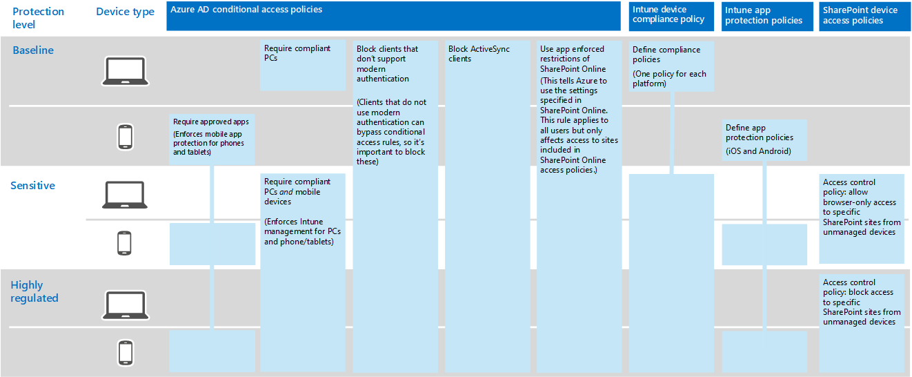

# Informationsskydd för Contoso Corporation

Contoso är seriöst för sin informations säkerhet. Läckage och destruktion av immateriella rättigheter som beskriver produktens utformning och tillverkarspecifik tillverknings teknik skulle göra dem konkurrens kraftigare.

Innan du flyttar deras känsliga digitala till gångar till molnet har contoso säkerställt att sin lokala informations klassificering och säkerhets krav stöds av de molnbaserade tjänsterna i Microsoft 365 för företag.

## Säkerhets klassificering för Contoso-data

Contoso utförde en analys av sina uppgifter och fastställde följande klassificerings nivåer.

| Nivå 1: Baslinje | Nivå 2: Känslig | Nivå 3: Strikt reglerad |
|:-------|:-----|:-----|
| Datan krypteras och är endast tillgänglig för autentiserade användare.    Tillhandahålls för alla data som lagrats lokalt och i Cloud-baserad lagring och arbets belastning. Datan krypteras när den lagras i tjänsten och överförs mellan tjänsten och klientenheterna.   Exempel på data på nivå 1 är normal företagskommunikation (e-post) och filer till administrations-, försäljnings- och supportpersonal. | Nivå 1 plus stark autentisering och dataförlustskydd.    Stark autentisering inkluderar Azure Multi-Factor Authentication (MFA) med SMS-verifiering. Med förhindra data förlust ser du till att känslig eller viktig information inte reser utanför Microsofts moln.  Exempel på data på nivå 2 är ekonomisk och juridisk information, samt data vid forskning och utveckling av nya produkter. | Nivå 2 plus de högsta nivåerna för kryptering, autentisering och granskning.  Högsta krypteringsnivåerna för vilande data och data i molnet, kompatibla med regionala föreskrifter, kombinerade med MFA med smartkort, detaljerad granskning och aviseringar.   Exempel på nivå 3-data är kund-och partner person uppgifter, produkt teknik specifikationer och tillverkarspecifik tillverknings teknik.  |
||||

## Contoso information policies
I följande tabell visas Contosos informations principer.

| Värde | Åtkomst | Datakvarhållning | Informationsskydd |
|:-------|:-----|:-----|:-----|
| Lågt affärsvärde (Nivå 1: Baslinje) | Tillåt åtkomst till alla.  | 6 månader | Använd kryptering. |
| Medelhögt affärsvärde (Nivå 2: Känslig) | Tillåt åtkomst till contoso-anställda, underleverantörer och partners.    Använd MFA, TLS (Transport Layer Security) och hantering av mobilprogram (MAM). | 2 år  | Använd hashvärden för dataintegritet.  |
| Högt affärsvärde (Nivå 3: Strikt reglerad) | Tillåt åtkomst till chefer och ledare inom teknik och tillverkning.     Endast RMS (Rights Management System) med hanterade nätverksenheter.  | 7 år  | Använd digitala signaturer för oavvislighet.  |
|||||

## Contoso-sökvägen till informations skydd med Microsoft 365 för företag

Contoso Följ de här stegen för att förbereda Microsoft 365 för företag efter information om sina informations skydd:

1. Identifiera vilken information som ska skyddas

   Contoso gjorde en omfattande recension av sina befintliga digitala till gångar på lokala SharePoint-webbplatser och fildelning och klassificerade varje gång.

2. Bestämma åtkomst, bevarande och informations skydds principer för data nivåer

   Baserat på datanivåerna fastställde Contoso detaljerade principkrav, som användes för att skydda befintliga digitala tillgångar när de flyttades till molnet.

3. Skapa känslighets etiketter och deras inställningar för de olika informations nivåerna

   Contoso skapade känslighetsetiketter för datanivåerna, där etiketten Strikt reglerad inkluderar kryptering, behörigheter och vattenstämplar.

4.  Flytta data från lokala SharePoint-webbplatser och fil resurser till deras nya SharePoint-webbplatser

    De filer som migrerades till de nya SharePoint-webbplatserna, ärvde standardinställningen för de kvarhållningsetiketter som tilldelats till webbplatsen.

5.  Utbilda anställda hur man använder känslighets etiketter för nya dokument, hur man interagerar med contoso när de skapar nya SharePoint-webbplatser och alltid lagrar digitala till gångar på SharePoint-webbplatser

    Ändring av dåligt anställd – lagrings vanor behandlas ofta som den hårda delen av över gången för informations skydd för molnet. Contoso IT and Management som behövs för att få anställda att alltid märka och lagra sina digitala till gångar i molnet, avstå från att använda lokala fil resurser och inte använda tredjeparts moln lagrings tjänster eller USB-enheter.

## Principer för villkorlig åtkomst i informationsskydd

Som en del av sin installation av Exchange Online och SharePoint konfigurerade contoso följande uppsättning villkorsstyrda åtkomst principer och använde dem för lämpliga grupper:

- [Principer för hanterad och ohanterad programåtkomst på enheter](../security/office-365-security/identity-access-policies.md)
- [Principer för Exchange Online-åtkomst](../security/office-365-security/secure-email-recommended-policies.md)
- [Principer för SharePoint-åtkomst](../security/office-365-security/sharepoint-file-access-policies.md)

Här följer en uppsättning contoso-principer för informations skydd.

>[!Note]
>Contoso har även konfigurerat ytterligare principer för villkorlig åtkomst till identitet och inloggning. Se [Contoso Corporations identitet](contoso-identity.md#conditional-access-policies-for-identity-and-device-access).
>

Med dessa principer ser du till att:

- Appar som tillåts och vilka åtgärder de kan utföra med organisationens data definieras av program skydds principer.
- Datorer och mobila enheter måste vara kompatibla.
- Exchange Online använder Office 365 Message Encryption (OME) för Exchange Online.
- SharePoint använder Programbegränsningar.
- I SharePoint används åtkomstkontrollprinciper för att endast bevilja åtkomst via webbläsare och för att blockera åtkomst för ohanterade enheter.

## Mappa Microsoft 365 för Enterprise-funktioner till data nivåerna contoso

I följande tabell mappas contoso data nivåer till informations skydds funktioner i Microsoft 365 för företag.

| Graden | Microsoft 365-molntjänster | Windows 10 och  Microsoft 365-appar för företag | Säkerhet och efterlevnad |
|:-------|:-----|:-----|:-----|
| Nivå 1: Baslinje  | Principer för villkorlig åtkomst i SharePoint och Exchange Online   Behörigheter på SharePoint-webbplatser | Känslighetsetiketter   BitLocker   Windows Information Protection | Principer för villkorlig åtkomst för enheter och hantering av mobilprogram |
| Nivå 2: Känslig | Nivå 1 plus:     Markera som känsligt   Microsoft 365-kvarhållningsetiketter på SharePoint-webbplatser   Dataförlustskydd för SharePoint och Exchange Online   Isolerade SharePoint-webbplatser  | Nivå 1 plus:     Känslighetsetiketter för digitala tillgångar  | Nivå 1 |
| Nivå 3: Strikt reglerad | Nivå 2 plus:    Skapa en egen nyckel (BYOK) kryptering och skydd för information om bransch hemlighet   Azure Key Vault för affärs program som interagerar med Microsoft 365-tjänster | Nivå 2 | Nivå 1 |
|||||

Här är den resulterande contoso-säkerhetskonfigurationen.

## Nästa steg

Lär dig hur Contoso använder [säkerhetsfunktionerna i Microsoft 365 för företag](contoso-security-summary.md) för identitets-och åtkomst hantering, Hot skydd, informations skydd och säkerhets hantering.

## Se även

[Säkerhetsöversikt](https://docs.microsoft.com/microsoft-365/security/office-365-security/security-roadmap)

[Översikt över Microsoft 365 för företag](microsoft-365-overview.md)

[Testlabbguider](m365-enterprise-test-lab-guides.md)
