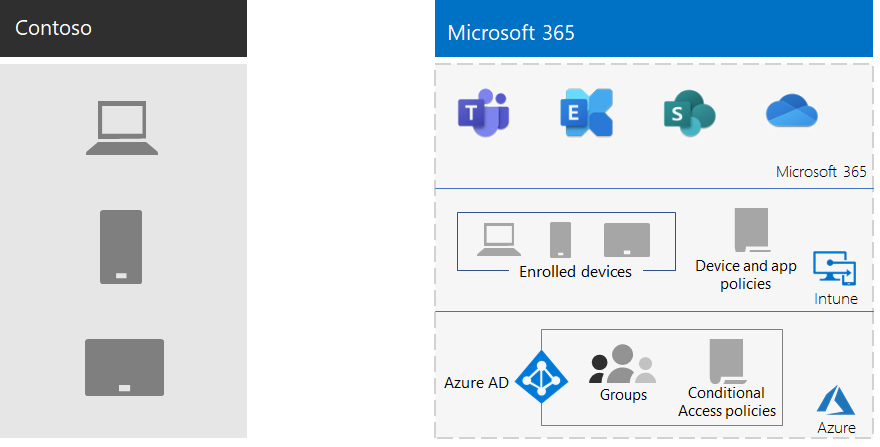

# Hantering av mobila enheter på Contoso

Microsoft 365 för Enterprise inkluderar Intune och en uppsättning Azure-tjänster som stöder mobila enheter och program hantering och-säkerhet.

Contoso har många mobila anställda. Vissa har kontor på Contoso-platser och vissa har inga kontor. Contoso ville ge medarbetarna möjlighet att arbeta effektivt och samtidigt skydda enheterna, företagsdata som lagras på dessa enheter och programmens funktionalitet.

## Planera

Contoso identifierade följande Intune användnings fall i hantering av mobila enheter för Microsoft 365 för företag:

- Skydda Exchange Online-e-post och data så att de kan nås av mobila enheter på ett säkert sätt.
- Implementera ett BYOD-program för Contoso-anställda.
- Ge organisationens ägda telefoner och begränsa-Använd delade surfplattor till contoso-anställda.

Contoso använder inte Intune för att:

- Gör det möjligt för anställda att säkert komma åt Microsoft 365 från en ohanterad offentlig kiosk.
- Skydda det lokala e-postmeddelandet och data så att det kan nås på ett säkert sätt via mobila enheter eftersom det inte finns några lokala Microsoft Exchange-servrar.

## Distribuera

Så här konfigurerar Contoso infrastrukturen för hantering av mobila enheter:

- Ange Intune som hanterings myndigheten för mobila enheter (MDM) och Använd Intune på Azure för att administrera innehåll och hantera enheterna
- Skapade Azure Active Directory-grupper (Azure AD) för enheter för registrerings-och Intune-inställningar och enhetbaserade principer för villkorsstyrd åtkomst

  Mer information finns i [principer för villkorsstyrd åtkomst via contoso](contoso-identity.md#conditional-access-policies-for-identity-and-device-access).

- Aktiverat Apple-enheten för att stödja anställda med iPad, iMacs och iPhone och företagsägda iPhone
- Contoso-specifika principer för villkor har skapats. Dessa visas under installationen av företagsportalen för Contoso på mobila enheter
- För enheter som inte är registrerade, implementerade en uppsättning principer för MAM (Mobile Application Management) för att kräva åtkomst till Microsoft 365-tjänster
- Intune-principer har skapats för att tillämpa:
  - Tillåtna appar.
  - Enhets kryptering för att förhindra obehörig åtkomst.
  - En sex eller ett fyrsiffrigt lösen ord.
  - En inaktivitet – tids gräns.
  - Skydd mot virus och skadlig program vara med Windows Defender på Windows 10-enheter.
  - Automatiska uppdateringar på Windows 10-enheter som innehåller de senaste säkerhets uppdateringarna.
  - Skicka certifikat till hanterade enheter.
  - En tydlig åtskillnad mellan företagsdata och personliga data. Användare och administratörer kan selektivt rensa företagsdata från enheten medan personliga data, till exempel bilder, personliga e-postkonton och personliga filer, bevaras.

Contoso-registrerade distribuerade och ägda datorer och surfplattor genom att lägga till dem till rätt Intune-gruppgrupper. De uppvisade också ett BYOD-program som de anställda kan registrera sina personliga enheter på. Registrerade enheter tar emot Intune-principer, som leder till hanterade och skyddade enheter och deras program. Enheter som inte har registrerats har MAM-principer (Mobile Application Management) som anger tillåtna program.

Här är distributions arkitekturen contoso Mobile Device Management.

## Nästa steg

[Lär dig](contoso-info-protect.md) hur Contoso använder informations skydds funktionerna i Microsoft 365 för företag för att klassificera, identifiera och skydda viktiga digitala till gångar i sin organisation.

## Se även

[Enhets hantering för Microsoft 365](device-management-roadmap-microsoft-365.md)

[Översikt över Microsoft 365 för företag](microsoft-365-overview.md)

[Testlabbguider](m365-enterprise-test-lab-guides.md)

