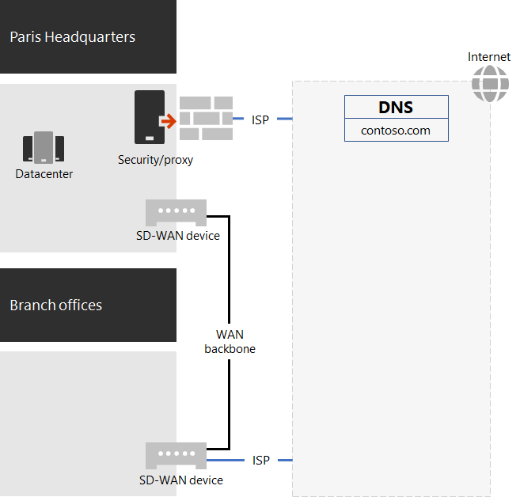
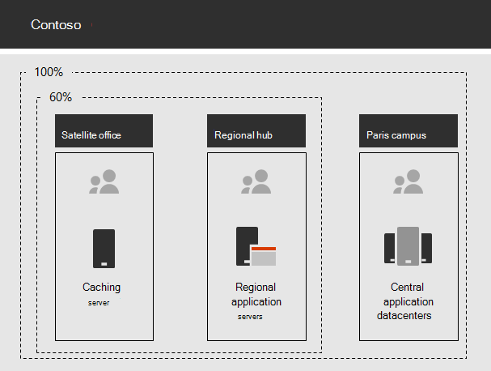

# Nätverk för Contoso Corporation

För att kunna använda en molnbaserad infrastruktur genomförde Contosos nätverkstekniker den övergripande övergången på samma sätt som nätverkstrafik till molntjänster sker. I stället för en intern nav- och ekermodell som fokuserar på nätverksanslutning och trafik för nästa nivå i Contosos kontorshierarki, eftersträvade de att mappa användarplatser mot lokal, utgående Internettrafik och lokala anslutningar till närmaste Microsoft 365-nätverksplats på Internet.

## Contosos nätverksinfrastruktur

Följande delar i Contosos nätverk länkar sina kontor över hela världen:

- MPLS-WAN-nätverk

  Ett MPLS WAN-nätverk kopplar samman huvudkontoret i Paris med lokala kontor, och regionala kontor med satellitkontor i en nav- och ekerkonfiguration. Avsikten är att användarna ska få åtkomst till de lokala servrar som används för branschtillämpningar på Paris-kontoret. Den dirigerar även all allmän Internettrafik till Paris-kontoret där enheter för nätverkssäkerhet rensar förfrågningarna. Inom varje kontor levererar routrar trafik till trådanslutna och trådlösa åtkomstpunkter i undernät, som använder det privata IP-adressutrymmet.

- Lokal, direkt Internet-åtkomst för Microsoft 365-trafik

  Varje kontor har en SD WAN-enhet med en eller flera lokala Internetleverantörers nätverkskretsar och en egen Internetanslutning via en proxyserver. Lösningen implementeras vanligtvis som en WAN-länk till en lokal Internetleverantör, som även tillhandahåller offentliga IP-adresser och en lokal DNS-server.

- Internet-närvaro

  Contoso äger det offentliga domännamnet contoso.com. Contosos offentliga webbplats för beställning av produkter är en uppsättning servrar på ett Internetanslutet datacenter på anläggningen i Paris. Contoso använder ett offentligt /24 IP-adressintervall på Internet.

Bild 1 visar organisationens nätverksinfrastruktur och anslutningar till Internet.

 
**Bild 1: Contosos nätverk**

## Användning av SD-WAN för optimal nätverksanslutning till Microsoft

Contoso följde [principerna för nätverksanslutningar för Microsoft 365](microsoft-365-network-connectivity-principles.md) för att:

1. Identifiera och särskilja Microsoft 365-nätverkstrafik
2. Utgående nätverksanslutningar lokalt
3. Undvika nätverkshairpins
4. Kringgå dubblerade enheter för nätverkssäkerhet

Det finns tre olika kategorier av nätverkstrafik för Microsoft 365: Optimera, Tillåt och Standard. Trafik av typerna Optimera och Tillåt är betrodd nätverkstrafik som krypteras och skyddas vid slutpunkterna och som är avsedd för Microsoft 365-nätverket.

Contoso fattade beslutet att:

- Använda Internetegress för trafik i kategorierna Optimera och Tillåt och vidarebefordra all trafik i kategorin Standard till den Paris-baserade, centrala Internet-anslutningen.

- Distribuera SD-WAN-enheter på varje arbetsplats som ett enkelt sätt att följa dessa principer och uppnå optimala nätverksprestanda för molnbaserade Microsoft 365-tjänster.

  SD-WAN-enheterna har en LAN-port för det lokala kontorsnätverket och flera WAN-portar. En WAN-port ansluter till MPLS-nätverket och en annan WAN-port ansluter till en lokal Internetleverantörskrets. SD-WAN-enheten dirigerar nätverkstrafik i kategorierna Optimera och Tillåt via Internetleverantörslänken.

## Contosos infrastruktur för branschtillämpningar

Contoso har utformat sin infrastruktur för branschtillämpningar och serverintranät för följande:

- Satellitkontor använder lokala cache-servrar för att lagra dokument som används ofta och interna webbplatser.
- Regionala nav använder regionala programservrar för region- och satellitkontor. Servrarna synkroniseras med servrar på huvudkontoret i Paris.
- På campus i Paris finns de datacenter som innehåller de centraliserade programservrar som används av hela organisationen.

I bild 2 visas procentandelen nätverkstrafik vid anslutning till servrar på olika platser i Contosos intranät.

 
**Bild 2: Contosos infrastruktur för interna program**

För användare på satellitkontor eller regionkontor kan 60 % av de resurser som medarbetarna behöver tillhandahållas av servrar på satellitkontor och regionkontor. Ytterligare 40 % av alla resursbegäranden måste gå via WAN-länken till företagets campus i Paris.

## Organisationens nätverks analys och förberedelse av sitt nätverk för Microsoft 365 för företag

Om du har godkänt Microsoft 365 för företags tjänster av Skype-användare beror det på hög tillgänglighet och anslutning till Internet, eller direkt till Microsofts moln tjänster. Contoso utförde de här stegen för att planera för och implementera optimerad anslutning till Microsoft 365 för företags moln tjänster:

1. Skapade ett diagram över företagets WAN-nätverk för att underlätta planeringen

   Contoso inledde sin nätverksplanering med att skapa ett diagram som visade deras arbetsplatser, befintliga nätverksanslutningar, enheter inom befintlig nätverksgräns och tjänstklasser som hanteras i nätverket. De använde diagrammet för varje efterföljande steg under planering och implementering av nätverksanslutningen.

2. Skapat en plan för Microsoft 365 för företags nätverks anslutning

   Contoso använde sig av [principerna för nätverksanslutningar för Microsoft 365](microsoft-365-network-connectivity-principles.md) och tillhandahöll referensnätverksarkitekturer för att utse SD-WAN som föredragen topologi för Microsoft 365-anslutningar.

3. Analyserade användningen av Internet-anslutning och MPLS WAN-bandbredd för varje kontor och ökade bandbredd vid behov

   Den aktuella användningen analyserades på varje kontor och kretsarna utökades så att den förutsedda, molnbaserade Microsoft 365-trafiken skulle fungera med en genomsnittlig outnyttjad kapacitet på 20 %.

4. Optimerade prestanda för Microsofts nätverkstjänster

   Contoso identifierade sin uppsättning med Office 365-, Intune- och Azure-slutpunkter och konfigurerade brandväggar, säkerhetsenheter och andra system på Internetrutten för optimala prestanda. Slutpunkter för Office 365-trafik i kategorierna Optimera och Tillåt konfigurerades i SD-WAN-enheter för routning över ISP-kretsen.

5. Konfigurerade intern DNS

   DNS måste fungera och letas upp lokalt för Microsoft 365-trafik.

6. Verifierade nätverksslutpunkter och portanslutningar

   Contoso körde nätverks anslutningar som tillhandahålls av Microsoft för att verifiera anslutningen för Microsoft 365 för företags moln tjänster.

7. Optimerade medarbetarnas datorer för nätverksanslutning

   Enskilda datorer kontrollerades för att säkerställa att de senaste uppdateringarna av operativsystemet hade installerats och att övervakning av slutpunktssäkerhet var aktivt på alla klienter.

## Nästa steg

[Läs om](contoso-identity.md) hur Contoso drar nytta av sina lokala Active Directory-domäntjänster i molnet för sina medarbetare och federerar autentisering för kunder och affärspartner.

## Se även

[Nätverks översikt för Microsoft 365](networking-roadmap-microsoft-365.md)

[Översikt över Microsoft 365 för företag](microsoft-365-overview.md)

[Testlabbguider](m365-enterprise-test-lab-guides.md)
