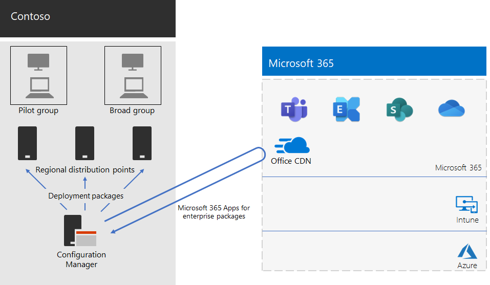

# Microsoft 365-applikationer för företagsdistribution av Contoso

Contoso uppgraderade datorerna till Windows 10 Enterprise och Microsoft 365-applikationer för företag för att få effektivare samarbete, bättre säkerhet och en modernare skrivbordsanvändning. Efter att de har bedömt deras infrastruktur-och företags behov identifierade contoso dessa viktiga krav för distributionen:

- Alla datorer bör köra Microsoft 365-appar för företag.
- Distributionen bör använda befintliga hanterings verktyg och infrastruktur när så är möjligt.
- Distributionen måste stödja flera språk och befintliga arkitekturer på användarnas enheter.
- Datorerna bör vara uppdaterade och säkra med minimala IT-administrativa kostnader och minimal påverkan för användarna.

## Distributionsverktyg

Baserat på deras krav väljer contoso att distribuera Windows 10 Enterprise och Microsoft 365-appar för företag via Configuration Manager (aktuell filial). Configuration Manager kan skalas för stora miljöer och tillhandahåller omfattande kontroll över installation, uppdateringar och inställningar. Den har också inbyggda funktioner som gör det enklare och mer effektivt att distribuera och hantera Office, däribland:

- Peer-cache, som kan hjälpa med begränsad nätverks kapacitet vid distribution till enheter på fjärrplatser.
- Instrument panelen för Office client Management, som gör det enkelt att distribuera uppdateringar för Office och övervakning och ger administratörer till gång till de senaste distributions-och hanterings funktionerna.
- Intelligent språk paket distribution, inklusive automatisk distribution av samma språk som operativ systemet.
- En fullständigt och lättanvänd metod för att ta bort befintliga versioner av Office från en klient under distribution.

Utöver Configuration Manager använde contoso [readiness Toolkit för Office-tillägg och VBA](https://docs.microsoft.com/deployoffice/readiness-toolkit-application-compatibility-microsoft-365-apps), ett kostnads fritt verktyg från Microsoft, för att utvärdera kompatibilitetsproblem med deras Office-makron och-tillägg.

## Hantera distribution och uppdateringar

Microsoft 365-applikationer för företag har en ny versionsmodell: Office som tjänst. Tjänste modellen gör det enkelt att alltid komma igång med nya funktioner. Men det kräver ofta IT-avdelningar att ändra hur de distribuerar och testar nya utgåvor. För att minimera kompatibilitetsproblem och säkerställa att datorerna hålls uppdaterade, contoso-distribuerade Windows och Office i två steg:

- Först distribuerade Microsoft 365-apparna för företag till en mindre uppsättning representativa enheter i organisationen. Denna pilot grupp användes för att testa appar, tillägg och maskin vara med Microsoft 365-appar för företag.
- Fyra månader senare distribuerade Contoso Microsoft 365-applikationer för företag till resten av enheterna i organisationen (den omfattande gruppen) när du har åtgärdat alla kritiska problem med appar, tillägg och maskinvara i pilotgruppen.

I stället för att hantera uppdateringar till Office via Configuration Manager är contoso aktiverat automatiska uppdateringar från molnet. Molnbaserade uppdateringar minskar administrationen och säkerställer att enheterna alltid är uppdaterade.

Contoso följde samma två stegs metod för funktions uppdateringar som de använde för distribution av Office: enheter i gruppen pilot grupp mottog uppdateringar fyra månader tidigare än enheter i resten av organisationen (huvud gruppen). För att aktivera detta för Office använde Contoso två rekommenderade [uppdateringskanaler](https://docs.microsoft.com/DeployOffice/overview-update-channels):

- Halvårsvis kanal (riktad) för uppdateringar av pilotgruppen
- Semi-Annual företags kanal för uppdateringar av bred gruppen

Eftersom den halvårsvisa kanalen (riktad) lanserar en version av Microsoft 365-applikationer för företag fyra månader tidigare än den halvårsvisa kanalen har Contoso tid att validera uppdateringarna utan att behöva hantera dem.

## Distributionsprocess

För att slutföra distributionen av Office genomför Contoso följande process, som innehåller rekommendationer från Microsoft:

1. Innan du distribuerar contoso använde du readiness Toolkit för Office-tillägget och VBA för att testa deras program och Office-tillägg för att bedöma deras kompatibilitet med Microsoft 365-appar för företag.
1. I Configuration Manager aktiverade de peer-cachen på sina klient enheter, som får begränsad nätverks kapacitet vid distribution till klient enheter på fjärrplatser. 
1. Contoso definierade två distributions grupper som enhets samlingar i Configuration Manager: en pilot grupp och en bred grupp. Gruppen pilot, som innehöll en liten uppsättning representativa enheter i organisationen, användes för ytterligare tester av appar, tillägg och maskin vara med Windows 10 Enterprise och Microsoft 365-appar för företag.
1. De skapade distributions paket för Office med hjälp av instrument panelen för Office-klient och Office 365 installations program, som är både en del av Configuration Manager-konsolen. De har skapat två paket för Microsoft 365-applikationer för företag, ett för pilotgruppen på den halvårsvisa kanalen (riktad) och en för den omfattande gruppen för den halvårsvisa kanalen.
2. Varje Office-paket innehöll språk paket för engelska, franska och tyska. Om en enhet kräver ett språk som inte ingår i Office-paketet laddades det språk paketet automatiskt från Office Content Delivery Network (CDN).
3. De använde den inbyggda funktionen i Office-paketet för att automatiskt ta bort alla befintliga MSI-versioner av Office innan de installerade Microsoft 365-applikationer för företag.
4. I Configuration Manager distribueras Windows-och Office-paketen till distributions platser i hela nätverket. Då körde de Configuration Manager-distributionspaket för distribution av pilot Microsoft 365-appar för företags paket till pilot gruppen.
5. Efter att de har åtgärdat kompatibilitetsproblem med pilot gruppen körde contoso dina aktivitetssekvenser att distribuera Microsoft 365-programmen för företags paketet till bred gruppen.

Eftersom Contoso valde att uppdatera enheter automatiskt från molnet behövde processen inte hanteras i Configuration Manager. Deras enheter uppdateras automatiskt direkt från Cloud-baserad på den uppdaterings kanal som har definierats i den första distributionen.

Här är de contoso Microsoft 365-apparna för företags installation och pågående uppdateringar distributions arkitektur.

 
## Nästa steg

Lär dig hur contoso [använder Microsoft Intune](contoso-mdm.md) i Microsoft 365 för att hantera dess enheter och vilka program de kör i organisationen.

## Se även

[Microsoft 365 Apps för företag](https://docs.microsoft.com/deployoffice/deployment-guide-microsoft-365-apps)

[Översikt över Microsoft 365 för företag](microsoft-365-overview.md)

[Testlabbguider](m365-enterprise-test-lab-guides.md)
