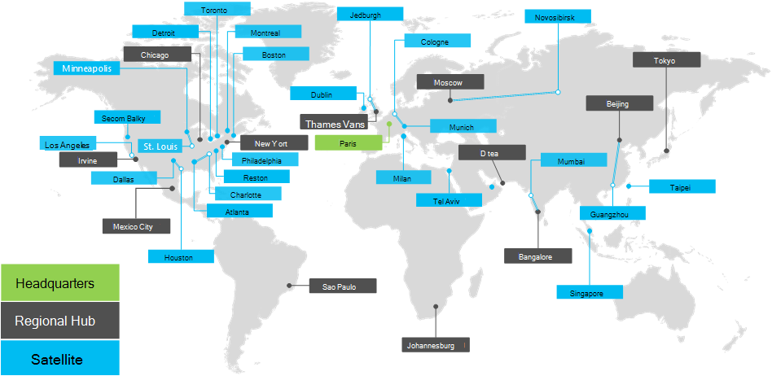

# Översikt över Contoso Corporation

Contoso Corporation är ett multinationellt företag med huvudkontor Paris, Frankrike. Det är ett tillverkningskonglomerat som arbetar med tillverkning, försäljning och support av över 100 000 produkter.

## Contoso runtom i världen

Bild 1 visar huvudkontoret i Paris och regionala nav- och satellitkontor i olika världsdelar.

**Bild 1: Contosos kontor runtom i världen**
 
Contosos kontor runtom i världen har en utformning på tre nivåer.

- Huvudkontor

  Contoso Corporations huvudkvarter ett stort företagscampus i utkanten av Paris med dussintals byggnader för administrations-, teknik- och tillverkningsanläggningar. Alla Contosos datacenter och Internet-närvaro finns på huvudkontoret i Paris.

  Huvudkontoret har 25 000 medarbetare.

- Regionala nav

  Regionala navkontor betjänar en särskild region i världen med 60 % av försäljningen och supportpersonalen. Varje regionalt nav ansluts till Paris-kontoret med en WAN-länk med hög bandbredd.

  Varje regionalt nav har i genomsnitt 2 000 medarbetare.

- Satellitkontor

  Satellitkontor består till 80 % av försäljnings- och supportpersonal och tillhandahåller en lokal närvaro för Contoso-kunder i nyckelorter och underregioner. Varje satellitkontor är anslutet till ett regionalt nav med en WAN-länk med hög bandbredd.

  Varje satellitkontor har i genomsnitt 250 medarbetare.

25 % av organisationens arbetsstyrka är endast mobil, med en högre procent andel mobila arbetare i de regionala naven och satellitkontoren. Att erbjuda bättre support för mobila arbetare är ett viktigt affärsmål för Contoso.

## Utformning av Microsoft 365 för företag

Contosos IT-arkitekter identifierade följande design krav och överväganden vid distribution av Microsoft 365 för företag: 

- Flera geografiska platser med lokala regler och efterföljandekrav
- Ett centralt intranät-datacenter i administrationscentret för Office och regionala programservrar som är värdar för interna affärsprogram
- En befintlig infrastruktur för Microsoft Endpoint Configuration Manager
- En blandning av klientdatorenheter, t. ex. Windows, Mac och Linux
- En blandning av personliga och företagsspecifika mobila enheter, bland annat iOS (iPhone och iPad), telefoner och surfplattor med Android
- Många distansarbete och mycket mobil personal
- Många företagspartner
- En stor mängd kundinformation och information som är identifierbar för dig
- En stor mängd immaterialrätt med högt värde i form av utformningsspecifikationer för produkter och tillverkningsaffärshemligheter

## Nästa steg

[Lär dig mer](contoso-infra-needs.md) om Contosos lokala IT-infrastruktur och hur deras företags behov är riktade mot Microsoft 365 för företag.

## Snabbreferens

[Översikt över Microsoft 365 för företag](microsoft-365-overview.md)

[Testlabbguider](m365-enterprise-test-lab-guides.md)

