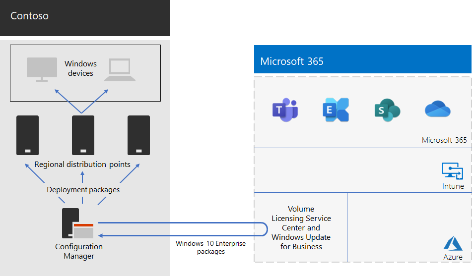

# Windows 10 Enterprise-driftsättning för Contoso

Före lanseringen av Microsoft 365 Enterprise hade Contoso Windows-kompatibla datorer och enheter med en blandning av Windows 7 (10 %), Windows 8.1 (65 %) och Windows 10 (25 %). Contoso ville uppgradera datorerna för Windows 10 Enterprise för att dra nytta av avancerad säkerhet och lägre IT-kostnader jämfört med automatiska distributioner av uppdateringar. 

Efter att ha uppskattat deras infrastruktur- och företagsbehov identifierade Contoso de viktigaste kraven för distributionen:

- Så många datorer och enheter som möjligt skulle köra Windows 10 Enterprise
- Lanseringen av på plats-uppgraderingar utnyttjar befintlig Configuration Manager-infrastruktur
- Styr vilka versioner av Windows 10 Enterprise som ska distribueras och vilka uppdateringar som görs via ringar
- Datorerna och enheterna ska vara uppdaterade med minimala IT-administrativa kostnader och minsta möjliga påverkan på slutanvändarna

Uppdaterat definieras som den version av Windows 10 Enterprise som stöds och som uppfyller organisationens affärsbehov, och det kan skilja sig från att ha alla Windows-kompatibla datorer med den senaste versionen av Windows 10 Enterprise.

## Distributionsverktyg

Före och under på plats-uppgraderingar av Windows 10 Enterprise använde Contoso följande lösningar i Windows Analytics:

- Uppgraderingsberedskap  

  Samlar in system-, program- och drivrutinsdata för analys och identifierar kompatibilitetsproblem som kan blockera en uppgradering och förslag på problem som är kända för Microsoft.

- Uppdateringsefterlevnad  

  Visar status för dina enheter med hänsyn till Windows-uppdateringarna, så att du kan se till att de är uppdaterade med de senaste uppdateringarna.

- Enhetshälsotillstånd  

  Identifierar enheter som kraschar ofta och därför kan behöva återskapas eller ersättas samt drivrutiner som orsakar att enheten kraschar, med förslag på alternativa versioner av drivrutiner som kan minska antalet krascher. Skickar meddelanden om informativa Windows-felkonfigurationer som skickar uppmaningar till slutanvändare.
 
Contoso har en befintlig infrastruktur för Configuration Manager (Current Branch). Configuration Manager kan skalas för stora miljöer och tillhandahåller omfattande kontroll över installation, uppdateringar och inställningar. Den har också inbyggda funktioner som gör det enklare och mer effektivt att distribuera och hantera Windows 10 Enterprise.

## Planeringsprocessen

Före distributionen definierade Contoso följande ringar:

- Tre ringar för mellanlagring av verifiering och distribution 
  - En för förhandsversioner 
  - En för nya versioner
  - En för tidigare versioner 
- En enda ring för bred distribution av Windows 10 Enterprise baserat på data från verifieringsringarna

Contoso använde även uppgraderingsberedskap för Windows Analytics för att avgöra vilka appar som är installerade och deras kompatibilitet med Windows 10 Enterprise.

## Distributionsprocess

För att slutföra distributionen av på plats-uppgradering av Windows 10 Enterprise genomför Contoso följande process, som innehåller rekommendationer från Microsoft:

1. Aktiverad peer-cachelagring för Configuration Manager.
2. Anpassade Windows-paket som skapats utifrån avbildningarna från Volume Licensing Service Center.
3. Använde Configuration Manager för distribution av Windows-paket till distributionsplatser via nätverket och distribuerade versioner till de tre ringar för mellanlagring av verifiering och distribution.
4. Genomförde bedömning av framgång för datorer och enheter i de tre ringarna för mellanlagring av verifiering och distribution med hjälp av enhetshälsotillstånd och lösningar för uppdateringsefterlevnad för Windows Analytics.
5. Baserat på Windows Analytics-information fastställde Contoso versionen av Windows 10 Enterprise för distribution till den breda distributionsringen.
6. Körde Configuration Manager-aktivitetssekvenser för distribution för att distribuera det valda Windows-paketet till den breda distributionsringen.
7. Övervakade datorer och enheter i den breda distributionsringen som använder lösningar för enhetens hälsotillstånd och uppdateringsefterlevnad för att lösa problem.

Det här är Contosos på plats-uppgradering och pågående uppdateringars distributionsarkitektur.

Infrastrukturen består av:

- Configuration Manager, som:
  - Hämtar avbildningar av Windows 10 Enterprise-paket från Microsoft Volume Licensing Center i Microsoft-nätverket.
  - Är den centrala administrationsplatsen för distributionspaket.
- Regionala distributionsplatser som vanligtvis finns i Contosos regionala navkontor.
- Windows-datorer och -enheter på olika platser som tar emot och installerar distributionspaket för på plats-uppgraderingar eller pågående uppdateringar baserat på ringtillhörighet.

## Nästa steg

[Läs mer](contoso-o365pp.md) om hur Contoso använder sin Configuration Manager-infrastruktur till att distribuera och hålla Microsoft 365 Apps uppdaterat i organisationen. 

## Se även

[Windows 10 Enterprise för Microsoft 365 Enterprise](windows10-infrastructure.md)

[Distributionsguide](deploy-microsoft-365-enterprise.md)

[Testlabbguider](m365-enterprise-test-lab-guides.md)
