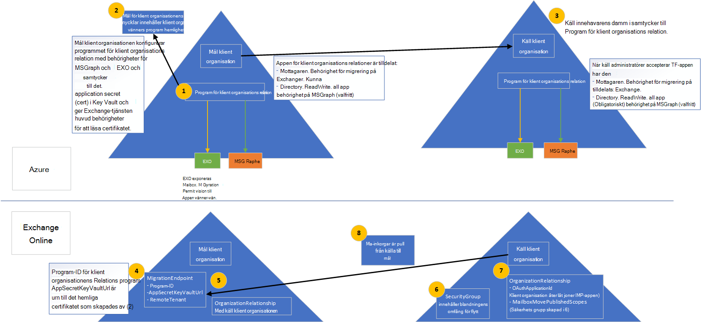

# <a name="cross-tenant-mailbox-migration-preview"></a><span data-ttu-id="68be5-103">Migrera mellan innehavare (för hands version)</span><span class="sxs-lookup"><span data-stu-id="68be5-103">Cross-tenant mailbox migration (preview)</span></span>

<span data-ttu-id="68be5-104">Tidigare, när en Exchange Online-klient måste flytta post lådor till en annan klient organisation i samma Exchange Online-tjänst, måste de helt ta bort dem på lokal och sedan vara inloggade på en ny klient organisation.</span><span class="sxs-lookup"><span data-stu-id="68be5-104">Previously, when an Exchange Online tenant needed to move mailboxes to another tenant in the same Exchange Online service, they would have to completely offboard them to on-premises and then onboard them to a new tenant.</span></span> <span data-ttu-id="68be5-105">Med den nya Överflyttnings funktionen för post lådor för flera innehavare kan klient organisationer i både käll-och mål klient organisationer flytta post lådor mellan klient organisationerna och deras lokala system.</span><span class="sxs-lookup"><span data-stu-id="68be5-105">With the new cross-tenant mailbox migration feature, tenant administrators in both source and target tenants can move mailboxes between the tenants with minimal infrastructure dependencies in their on-premises systems.</span></span> <span data-ttu-id="68be5-106">Detta tar bort behovet av ta bort och inbyggda post lådor.</span><span class="sxs-lookup"><span data-stu-id="68be5-106">This removes the need to offboard and onboard mailboxes.</span></span>

<span data-ttu-id="68be5-107">Vanligt vis kan du med att flytta användare och innehåll till en ny klient organisation under fusioner och divestitures.</span><span class="sxs-lookup"><span data-stu-id="68be5-107">Commonly, during mergers or divestitures, you need the ability to move users and content into a new tenant.</span></span> <span data-ttu-id="68be5-108">När mål gruppens administratör utför flytten kallas det för pull-Move, som liknar lokal distribution med lokala Cloud-migreringar.</span><span class="sxs-lookup"><span data-stu-id="68be5-108">When the target tenant administrator executes the move, it’s called a Pull move, similar to on-premises to cloud onboarding migrations.</span></span>

<span data-ttu-id="68be5-109">Exchange-postlådor för utbyte av flera innehavare är helt självbetjänings fria från klient organisationer, med välkända gränssnitt som kan följa skript i de större arbets flöden som behövs för att överföra användare till deras nya organisation.</span><span class="sxs-lookup"><span data-stu-id="68be5-109">Cross-tenant Exchange mailbox moves are fully self-serviced by tenant administrators, using well known interfaces that can be scripted into the larger workflows needed to transition users to their new organization.</span></span> <span data-ttu-id="68be5-110">Administratörer kan använda `New-MigrationBatch` cmdleten som är tillgänglig via hanterings rollen flytta post lådor för att utföra flytt av klient organisationer.</span><span class="sxs-lookup"><span data-stu-id="68be5-110">Administrators can use the `New-MigrationBatch` cmdlet, available through the Move Mailboxes management role, to execute cross-tenant moves.</span></span> <span data-ttu-id="68be5-111">Flyttnings processen inkluderar kontroll av klient organisationens verifiering under synkronisering och avslut.</span><span class="sxs-lookup"><span data-stu-id="68be5-111">The move process includes tenant authorization checks during mailbox synchronization and finalization.</span></span> 
 
<span data-ttu-id="68be5-112">Användare som migreras måste finnas i mål klient organisationens Exchange Online-system som användare med specifika attribut för att aktivera kors klient organisationer.</span><span class="sxs-lookup"><span data-stu-id="68be5-112">Users migrating must be present in the target tenant Exchange Online system as MailUsers, marked with specific attributes to enable the cross-tenant moves.</span></span> <span data-ttu-id="68be5-113">Systemet kommer inte att flyttas för användare som inte har kon figurer ATS korrekt i mål klient organisationen.</span><span class="sxs-lookup"><span data-stu-id="68be5-113">The system will fail moves for users that are not properly set up in the target tenant.</span></span> 

<span data-ttu-id="68be5-114">När flyttningarna är slutförda konverteras post lådan till Mail-användare och targetAddress (visas som ExternalEmailAddress i Exchange) med Dirigerings adressen till destinations innehavaren.</span><span class="sxs-lookup"><span data-stu-id="68be5-114">When the moves are complete, the source system mailbox is converted to MailUser and the targetAddress (shown as ExternalEmailAddress in Exchange) is stamped with the routing address to the destination tenant.</span></span> <span data-ttu-id="68be5-115">Den här processen lämnar den gamla e-postkontot i källans klient organisation och möjliggör en period med samtidig existens och e-postdirigering.</span><span class="sxs-lookup"><span data-stu-id="68be5-115">This process leaves the legacy MailUser in the source tenant, and allows for a period of co-existence and mail routing.</span></span> <span data-ttu-id="68be5-116">När affärs processer tillåts kan käll klient organisationen ta bort käll-mail-användaren eller konvertera dem till en e-postkontakt.</span><span class="sxs-lookup"><span data-stu-id="68be5-116">When business processes allow, the source tenant may remove the source MailUser or convert them to a mail contact.</span></span> 

<span data-ttu-id="68be5-117">Migrering för Exchange-postlåda med flera innehavare stöds endast för klient organisationer i hybrid-eller moln syfte, eller någon kombination av båda.</span><span class="sxs-lookup"><span data-stu-id="68be5-117">Cross-tenant Exchange mailbox migrations are supported for tenants in hybrid or cloud only, or any combination of the two.</span></span>

<span data-ttu-id="68be5-118">I den här artikeln beskrivs processen för flytt av post lådor mellan innehavare och vägledning för hur du förbereder käll-och mål klienter för innehållet.</span><span class="sxs-lookup"><span data-stu-id="68be5-118">This article describes the process for cross-tenant mailbox moves and provides guidance on how to prepare source and target tenants for the content move.</span></span> 

## <a name="preparing-source-and-target-tenants"></a><span data-ttu-id="68be5-119">Förbereda käll-och mål klient organisationer</span><span class="sxs-lookup"><span data-stu-id="68be5-119">Preparing source and target tenants</span></span>

<span data-ttu-id="68be5-120">Migreringsguiden för Exchange-postlådan för flera innehavare kräver auktorisering och omfattning för migrering mellan innehavare.</span><span class="sxs-lookup"><span data-stu-id="68be5-120">The Cross-tenant Exchange mailbox migration feature requires authorization and scoping for cross-tenant migrations.</span></span> <span data-ttu-id="68be5-121">Genom att använda Azure Enterprise-programmet och viktiga valv lagrings lösningarna kan klient administratörer hantera både auktorisering och omfångst av Exchange Online Mailbox-migreringar från en klient organisation till en annan.</span><span class="sxs-lookup"><span data-stu-id="68be5-121">Using the Azure Enterprise application and Key Vault storage solutions, tenant admins are now empowered to manage both authorization and scoping of Exchange Online mailbox migrations from one tenant to another.</span></span> <span data-ttu-id="68be5-122">Post låda för flera innehavare flyttar stöd för en inbjudan och en tillstånds modell för att upprätta ett Azure Active Directory-program som används för att verifiera ett klient par.</span><span class="sxs-lookup"><span data-stu-id="68be5-122">Cross-tenant mailbox moves supports an invitation and consent model to establish an Azure Active Directory (Azure AD) application used for authentication between a tenant pair.</span></span> <span data-ttu-id="68be5-123">Ytterligare komponenter som organisations relationer och slut punkt för migrering krävs också.</span><span class="sxs-lookup"><span data-stu-id="68be5-123">Additional components such as an organization relationship and a migration endpoint are also required.</span></span>

<span data-ttu-id="68be5-124">I det här avsnittet ingår inte de steg som krävs för att förbereda användar objekt i gruppen användare i mål katalogen, eller så inkluderar det inte kommandot exempel för att skicka in en migreringstabell.</span><span class="sxs-lookup"><span data-stu-id="68be5-124">This section does not include the specific steps required to prepare the MailUser user objects in the target directory, nor does it include the sample command to submit a migration batch.</span></span> <span data-ttu-id="68be5-125">Se [förbereda mål användar objekt för migrering](#prepare-target-user-objects-for-migration) för den här informationen.</span><span class="sxs-lookup"><span data-stu-id="68be5-125">Please see [Prepare target user objects for migration](#prepare-target-user-objects-for-migration) for this information.</span></span>

## <a name="prerequisites"></a><span data-ttu-id="68be5-126">Förutsättningar</span><span class="sxs-lookup"><span data-stu-id="68be5-126">Prerequisites</span></span>

<span data-ttu-id="68be5-127">För funktionen för flytt av post lådor krävs ett [Azure-valv](https://docs.microsoft.com/azure/key-vault/basic-concepts) för att upprätta ett klient organisations par-specifika Azure-program för säker lagring och åtkomst till certifikatet/hemligheten som används för att autentisera och auktorisera post lådans migrering från en klient organisation till den andra, vilket tar bort alla krav för att dela certifikat/hemligheter mellan klient organisationer.</span><span class="sxs-lookup"><span data-stu-id="68be5-127">The cross-tenant mailbox move feature requires [Azure Key Vault](https://docs.microsoft.com/azure/key-vault/basic-concepts) to establish a tenant pair-specific Azure application to securely store and access the certificate/secret used to authenticate and authorize mailbox migration from one tenant to the other, removing any requirements to share certificates/secrets between tenants.</span></span> 

<span data-ttu-id="68be5-128">Innan du börjar bör du kontrol lera att du har nödvändig behörighet för att köra distributions skripten för att kunna konfigurera Azure Key Vault, flytta program varan för EXO, slut punkt för migrering och EXO organisations relation.</span><span class="sxs-lookup"><span data-stu-id="68be5-128">Before starting, be sure you have the necessary permissions to run the deployment scripts in order to configure Azure Key Vault, Move Mailbox application, EXO Migration Endpoint, and the EXO Organization Relationship.</span></span> <span data-ttu-id="68be5-129">Vanligt vis har global administratör behörighet att utföra alla konfigurations steg.</span><span class="sxs-lookup"><span data-stu-id="68be5-129">Typically, Global Admin has permission to perform all configuration steps.</span></span>

<span data-ttu-id="68be5-130">Dessutom krävs e-postaktiverade säkerhets grupper i käll klient organisationen innan installationen körs.</span><span class="sxs-lookup"><span data-stu-id="68be5-130">Additionally, mail-enabled security groups in the source tenant are required prior to running setup.</span></span> <span data-ttu-id="68be5-131">Dessa grupper används för att scope listan med post lådor som kan flyttas från källan (eller ibland kallas resurs) för klient organisationen till mål innehavaren.</span><span class="sxs-lookup"><span data-stu-id="68be5-131">These groups are used to scope the list of mailboxes that can move from source (or sometimes referred to as resource) tenant to the target tenant.</span></span> <span data-ttu-id="68be5-132">Detta gör att du kan använda administratörs administratören för att begränsa eller ange omfattningen av de post lådor som måste flyttas för att förhindra att oavsiktliga användare migreras.</span><span class="sxs-lookup"><span data-stu-id="68be5-132">This allows the source tenant admin to restrict or scope the specific set of mailboxes that need to be moved, preventing unintended users from being migrated.</span></span> <span data-ttu-id="68be5-133">Kapslade grupper stöds inte.</span><span class="sxs-lookup"><span data-stu-id="68be5-133">Nested groups are not supported.</span></span>

<span data-ttu-id="68be5-134">Du måste också kommunicera med ditt betrodda partner företag (du kommer att flytta brev lådor) för att få sitt Microsoft 365-klient-ID.</span><span class="sxs-lookup"><span data-stu-id="68be5-134">You will also need to communicate with your trusted partner company (with whom you will be moving mailboxes) to obtain their Microsoft 365 tenant ID.</span></span> <span data-ttu-id="68be5-135">Detta klient-ID används i fältet organisations relation `DomainName` .</span><span class="sxs-lookup"><span data-stu-id="68be5-135">This tenant ID is used in the Organization Relationship `DomainName` field.</span></span>

<span data-ttu-id="68be5-136">Om du vill skaffa klient organisationens ID för ett abonnemang loggar du in i administrations centret för Microsoft 365 och går till [https://aad.portal.azure.com/#blade/Microsoft_AAD_IAM/ActiveDirectoryMenuBlade/Properties](https://aad.portal.azure.com/#blade/Microsoft_AAD_IAM/ActiveDirectoryMenuBlade/Properties) .</span><span class="sxs-lookup"><span data-stu-id="68be5-136">To obtain the tenant ID of a subscription, sign-in to the Microsoft 365 admin center and go to [https://aad.portal.azure.com/#blade/Microsoft_AAD_IAM/ActiveDirectoryMenuBlade/Properties](https://aad.portal.azure.com/#blade/Microsoft_AAD_IAM/ActiveDirectoryMenuBlade/Properties).</span></span> <span data-ttu-id="68be5-137">Klicka på ikonen Kopiera för egenskapen innehavaradministration för att kopiera den till Urklipp.</span><span class="sxs-lookup"><span data-stu-id="68be5-137">Click the copy icon for the Tenant ID property to copy it to the clipboard.</span></span>

<span data-ttu-id="68be5-138">Så här fungerar processen.</span><span class="sxs-lookup"><span data-stu-id="68be5-138">Here is how the process works.</span></span>

:::image type="content" source="../media/tenant-to-tenant-mailbox-move/prepare-tenants-flow.png" alt-text="Förberedelse av klient organisation för migrering av post låda.":::

<!--
[](https://github.com/MicrosoftDocs/microsoft-365-docs/raw/public/microsoft-365/media/tenant-to-tenant-mailbox-move/prepare-tenants-flow.png)

[See a larger version of this image](https://github.com/MicrosoftDocs/microsoft-365-docs/raw/public/microsoft-365/media/tenant-to-tenant-mailbox-move/prepare-tenants-flow.png).
--> 

### <a name="prepare-tenants"></a><span data-ttu-id="68be5-140">Förbereda klient organisationer</span><span class="sxs-lookup"><span data-stu-id="68be5-140">Prepare tenants</span></span>

<span data-ttu-id="68be5-141">På en hög nivå utförs följande konfigurations åtgärder när du kör installations skripten.</span><span class="sxs-lookup"><span data-stu-id="68be5-141">At a high level, the following configuration actions take place when executing the setup scripts.</span></span>

<span data-ttu-id="68be5-142">Förbereda mål klient organisationen:</span><span class="sxs-lookup"><span data-stu-id="68be5-142">Prepare the target tenant:</span></span>

1. <span data-ttu-id="68be5-143">Om det inte finns någon befintlig Azure-gruppgrupp skapas en ny (skript).</span><span class="sxs-lookup"><span data-stu-id="68be5-143">If an existing Azure Resource Group is not provided, a new one is created (SCRIPT).</span></span>
2. <span data-ttu-id="68be5-144">Om det inte finns något befintligt huvud valv skapas ett nytt (skript).</span><span class="sxs-lookup"><span data-stu-id="68be5-144">If an existing Key Vault is not provided, a new one is created (SCRIPT).</span></span>
3. <span data-ttu-id="68be5-145">En ny åtkomst policy skapas för Office 365 Exchange Online Mailbox migration-programmet (skript).</span><span class="sxs-lookup"><span data-stu-id="68be5-145">A new Access Policy is created for the Office 365 Exchange Online Mailbox Migration application (SCRIPT).</span></span>
4. <span data-ttu-id="68be5-146">Ett nytt certifikat skapas (eller används för det) för att hålla hemligheten till migreringsarkivet (skript).</span><span class="sxs-lookup"><span data-stu-id="68be5-146">A new certificate is created (or existing one, if specified) to hold the secret to the Migration application (SCRIPT).</span></span>
5. <span data-ttu-id="68be5-147">Ett nytt Azure AD-program skapas (skript).</span><span class="sxs-lookup"><span data-stu-id="68be5-147">A new Azure AD application is created (SCRIPT).</span></span>
6. <span data-ttu-id="68be5-148">Certifikatet/hemligheten laddas upp till migreringsarkivet (skript).</span><span class="sxs-lookup"><span data-stu-id="68be5-148">The certificate/secret is uploaded to the migration application (SCRIPT).</span></span>
7. <span data-ttu-id="68be5-149">Överflyttnings behörigheter för post lådor är tilldelade till programmet (skript).</span><span class="sxs-lookup"><span data-stu-id="68be5-149">Mailbox migration permissions are assigned to the application (SCRIPT).</span></span>
8. <span data-ttu-id="68be5-150">Distributions skriptet pausas tills mål administratören samtycker till deras egna program (skript).</span><span class="sxs-lookup"><span data-stu-id="68be5-150">The deployment script pauses until target admin consents to their own application (SCRIPT).</span></span>
9. <span data-ttu-id="68be5-151">Mål organisationens administratör samtycker till de behörigheter som givits till programmet (MANUAL).</span><span class="sxs-lookup"><span data-stu-id="68be5-151">The target tenant admin consents to the permissions given to the application (MANUAL).</span></span>
10. <span data-ttu-id="68be5-152">En organisations relation skapas till mål klient organisationen (skript).</span><span class="sxs-lookup"><span data-stu-id="68be5-152">An organization relationship is created to the target tenant (SCRIPT).</span></span>
11. <span data-ttu-id="68be5-153">En slut punkt för migrering skapas för att hämta post lådor till mål klient organisationen (skript).</span><span class="sxs-lookup"><span data-stu-id="68be5-153">A migration endpoint is created to pull mailboxes to the target tenant (SCRIPT).</span></span>

<span data-ttu-id="68be5-154">Förbereda käll klient organisationen:</span><span class="sxs-lookup"><span data-stu-id="68be5-154">Prepare the source tenant:</span></span>

1. <span data-ttu-id="68be5-155">Klient organisationens administratör accepterar godkännande från mål klient organisationen (MANUAL) för migrering av postinbjudan.</span><span class="sxs-lookup"><span data-stu-id="68be5-155">The source tenant admin accepts consent to Mailbox Migration application invitation from the Target tenant (MANUAL).</span></span>
2. <span data-ttu-id="68be5-156">Klient organisationens administratör skapar en e-postaktive rad säkerhets grupp i sin klient organisation som innehåller listan över post lådor som ska kunna flyttas av migreringsarkivet (manuellt).</span><span class="sxs-lookup"><span data-stu-id="68be5-156">The source tenant admin creates a mail-enabled security group in their tenant to contain the list of mailboxes allowed to be moved by the migration application (MANUAL).</span></span>
3. <span data-ttu-id="68be5-157">En organisations relation skapas till mål innehavaren som anger att programmet för postmigrering ska användas för OAuth-verifiering för att acceptera flytt förfrågan (skript).</span><span class="sxs-lookup"><span data-stu-id="68be5-157">An organization relationship is created to the target tenant specifying the mailbox migration application should be used for OAuth verification to accept the move request (SCRIPT).</span></span>

#### <a name="step-by-step-instructions-for-the-target-tenant-admin"></a><span data-ttu-id="68be5-158">Steg-för-steg-instruktioner för mål gruppens administratör</span><span class="sxs-lookup"><span data-stu-id="68be5-158">Step-by-step instructions for the target tenant admin</span></span>

1. <span data-ttu-id="68be5-159">Ladda ned SetupCrossTenantRelationshipForTargetTenant.ps1-skript för mål klient organisationens konfiguration från [GitHub-databasen](https://github.com/microsoft/cross-tenant/releases/tag/Preview).</span><span class="sxs-lookup"><span data-stu-id="68be5-159">Download the SetupCrossTenantRelationshipForTargetTenant.ps1 script for the target tenant setup from the [GitHub repository](https://github.com/microsoft/cross-tenant/releases/tag/Preview).</span></span> 
2. <span data-ttu-id="68be5-160">Spara skriptet (SetupCrossTenantRelationshipForTargetTenant.ps1) till den dator som du ska köra skriptet från.</span><span class="sxs-lookup"><span data-stu-id="68be5-160">Save the script (SetupCrossTenantRelationshipForTargetTenant.ps1) to the computer from which you will be executing the script.</span></span>
3. <span data-ttu-id="68be5-161">Skapa en fjärran sluten PowerShell-anslutning till Exchange Online-måldomänkontrollanten.</span><span class="sxs-lookup"><span data-stu-id="68be5-161">Create a Remote PowerShell connection to the Exchange Online target tenant.</span></span> <span data-ttu-id="68be5-162">Kontrol lera igen att du har nödvändig behörighet för att köra distributions skripten för att kunna konfigurera lagring och certifikat för Azure Key Vault, flytta program varan för migrering, EXO och EXO organisations relation.</span><span class="sxs-lookup"><span data-stu-id="68be5-162">Again, make sure you have the necessary permissions to run the deployment scripts in order to configure the Azure Key Vault storage and certificate, Move Mailbox application, EXO Migration Endpoint, and the EXO Organization Relationship.</span></span>
4. <span data-ttu-id="68be5-163">Ändra katalogen för filmapp till skript platsen eller kontrol lera att skriptet är sparat på platsen som för närvarande är en fjärr-PowerShell-session.</span><span class="sxs-lookup"><span data-stu-id="68be5-163">Change the file folder directory to the script location or verify the script is currently saved to the location currently in your Remote PowerShell session.</span></span>
5. <span data-ttu-id="68be5-164">Kör skriptet med följande parametrar och värden.</span><span class="sxs-lookup"><span data-stu-id="68be5-164">Run the script with the following parameters and values.</span></span>

    | <span data-ttu-id="68be5-165">Indataparametern</span><span class="sxs-lookup"><span data-stu-id="68be5-165">Parameter</span></span> | <span data-ttu-id="68be5-166">Value</span><span class="sxs-lookup"><span data-stu-id="68be5-166">Value</span></span> | <span data-ttu-id="68be5-167">Obligatoriskt eller valfritt</span><span class="sxs-lookup"><span data-stu-id="68be5-167">Required or Optional</span></span>
    |---------------------------------------------|-----------------|--------------|
    | <span data-ttu-id="68be5-168">-ResourceTenantDomain</span><span class="sxs-lookup"><span data-stu-id="68be5-168">-ResourceTenantDomain</span></span>                       | <span data-ttu-id="68be5-169">Käll klient organisation, till exempel Fabrikam \. onmicrosoft.com.</span><span class="sxs-lookup"><span data-stu-id="68be5-169">Source tenant domain, such as fabrikam\.onmicrosoft.com.</span></span> | <span data-ttu-id="68be5-170">Obligatoriskt</span><span class="sxs-lookup"><span data-stu-id="68be5-170">Required</span></span> |
    | <span data-ttu-id="68be5-171">-ResourceTenantAdminEmail</span><span class="sxs-lookup"><span data-stu-id="68be5-171">-ResourceTenantAdminEmail</span></span>                   | <span data-ttu-id="68be5-172">Källa för klient organisationens e-postadress.</span><span class="sxs-lookup"><span data-stu-id="68be5-172">Source tenant admin’s email address.</span></span> <span data-ttu-id="68be5-173">Det här är käll klientens administratör som kommer att skickas vidare till den som skickas från mål administratören. Det här är administratören som kommer att få e-postinbjudan för programmet.</span><span class="sxs-lookup"><span data-stu-id="68be5-173">This is the source tenant admin who will be consenting to the use of the mailbox migration application sent from the target admin. This is the admin who will receive the email invite for the application.</span></span> | <span data-ttu-id="68be5-174">Obligatoriskt</span><span class="sxs-lookup"><span data-stu-id="68be5-174">Required</span></span> |
    | <span data-ttu-id="68be5-175">-TargetTenantDomain</span><span class="sxs-lookup"><span data-stu-id="68be5-175">-TargetTenantDomain</span></span>                         | <span data-ttu-id="68be5-176">Mål grupps domän, till exempel contoso \. onmicrosoft.com.</span><span class="sxs-lookup"><span data-stu-id="68be5-176">Target tenant domain, such as contoso\.onmicrosoft.com.</span></span> | <span data-ttu-id="68be5-177">Obligatoriskt</span><span class="sxs-lookup"><span data-stu-id="68be5-177">Required</span></span> |
    | <span data-ttu-id="68be5-178">-ResourceTenantId</span><span class="sxs-lookup"><span data-stu-id="68be5-178">-ResourceTenantId</span></span>                           | <span data-ttu-id="68be5-179">Organisations-ID för käll innehavare (GUID).</span><span class="sxs-lookup"><span data-stu-id="68be5-179">Source tenant organization ID (GUID).</span></span> | <span data-ttu-id="68be5-180">Obligatoriskt</span><span class="sxs-lookup"><span data-stu-id="68be5-180">Required</span></span> |
    | <span data-ttu-id="68be5-181">-SubscriptionId</span><span class="sxs-lookup"><span data-stu-id="68be5-181">-SubscriptionId</span></span>                             | <span data-ttu-id="68be5-182">Azure-abonnemanget som används för att skapa resurser.</span><span class="sxs-lookup"><span data-stu-id="68be5-182">The Azure subscription to use for creating resources.</span></span> | <span data-ttu-id="68be5-183">Obligatoriskt</span><span class="sxs-lookup"><span data-stu-id="68be5-183">Required</span></span> |
    | <span data-ttu-id="68be5-184">-ResourceGroup</span><span class="sxs-lookup"><span data-stu-id="68be5-184">-ResourceGroup</span></span>                              | <span data-ttu-id="68be5-185">Namnet på Azure Resource-gruppen som innehåller eller kommer att innehålla huvud-valvet.</span><span class="sxs-lookup"><span data-stu-id="68be5-185">Azure resource group name that contains or will contain the Key Vault.</span></span> | <span data-ttu-id="68be5-186">Obligatoriskt</span><span class="sxs-lookup"><span data-stu-id="68be5-186">Required</span></span> |
    | <span data-ttu-id="68be5-187">-KeyVaultName</span><span class="sxs-lookup"><span data-stu-id="68be5-187">-KeyVaultName</span></span>                               | <span data-ttu-id="68be5-188">Azure Key Vault-instans som lagrar certifikatet/hemligheten för post lådan.</span><span class="sxs-lookup"><span data-stu-id="68be5-188">Azure Key Vault instance that will store your mailbox migration application certificate/secret.</span></span> | <span data-ttu-id="68be5-189">Obligatoriskt</span><span class="sxs-lookup"><span data-stu-id="68be5-189">Required</span></span> |
    | <span data-ttu-id="68be5-190">-CertificateName</span><span class="sxs-lookup"><span data-stu-id="68be5-190">-CertificateName</span></span>                            | <span data-ttu-id="68be5-191">Certifikat namn när du skapar eller söker efter certifikat i Key Vault.</span><span class="sxs-lookup"><span data-stu-id="68be5-191">Certificate name when generating or searching for certificate in key vault.</span></span> | <span data-ttu-id="68be5-192">Obligatoriskt</span><span class="sxs-lookup"><span data-stu-id="68be5-192">Required</span></span> |
    | <span data-ttu-id="68be5-193">-CertificateSubject</span><span class="sxs-lookup"><span data-stu-id="68be5-193">-CertificateSubject</span></span>                         | <span data-ttu-id="68be5-194">Namn på certifikat för Azure Key valv, till exempel CN = contoso_fabrikam.</span><span class="sxs-lookup"><span data-stu-id="68be5-194">Azure Key Vault certificate subject name, such as CN=contoso_fabrikam.</span></span> | <span data-ttu-id="68be5-195">Obligatoriskt</span><span class="sxs-lookup"><span data-stu-id="68be5-195">Required</span></span> |
    | <span data-ttu-id="68be5-196">-ExistingApplicationId</span><span class="sxs-lookup"><span data-stu-id="68be5-196">-ExistingApplicationId</span></span>                      | <span data-ttu-id="68be5-197">E-postmigrering som ska användas om en redan har skapats.</span><span class="sxs-lookup"><span data-stu-id="68be5-197">Mail migration application to use if one was already created.</span></span> | <span data-ttu-id="68be5-198">Valfritt</span><span class="sxs-lookup"><span data-stu-id="68be5-198">Optional</span></span> |
    | <span data-ttu-id="68be5-199">-AzureAppPermissions</span><span class="sxs-lookup"><span data-stu-id="68be5-199">-AzureAppPermissions</span></span>                        | <span data-ttu-id="68be5-200">De behörigheter som krävs för att få åtkomst till migreringsarkivet-programmet, till exempel Exchange eller MSGraph (Exchange för att flytta post lådor, MSGraph för att använda detta program för att skicka en inbjudan till resurs innehavaren av programmet.</span><span class="sxs-lookup"><span data-stu-id="68be5-200">The permissions required to be given to the mailbox migration application, such as Exchange or MSGraph (Exchange for moving mailboxes, MSGraph for using this application to send a consent link invitation to resource tenant).</span></span> | <span data-ttu-id="68be5-201">Obligatoriskt</span><span class="sxs-lookup"><span data-stu-id="68be5-201">Required</span></span> |
    | <span data-ttu-id="68be5-202">-UseAppAndCertGeneratedForSendingInvitation</span><span class="sxs-lookup"><span data-stu-id="68be5-202">-UseAppAndCertGeneratedForSendingInvitation</span></span> | <span data-ttu-id="68be5-203">Parameter för användning av det program som har skapats för migrering för att skicka inbjudan om godkännande länk till source innehavaradministratörer-administratör. Om det inte visas uppmanas du att ange inloggnings uppgifter för att ansluta till Azure Inbjudnings hanteraren och skicka inbjudan som mål administratör.</span><span class="sxs-lookup"><span data-stu-id="68be5-203">Parameter for using the application created for migration to be used for sending consent link invitation to source tenant admin. If not present this will prompt for the target admin’s credentials to connect to Azure invitation manager and send the invitation as target admin.</span></span> | <span data-ttu-id="68be5-204">Valfritt</span><span class="sxs-lookup"><span data-stu-id="68be5-204">Optional</span></span> |
    | <span data-ttu-id="68be5-205">-KeyVaultAuditStorageAccountName</span><span class="sxs-lookup"><span data-stu-id="68be5-205">-KeyVaultAuditStorageAccountName</span></span>            | <span data-ttu-id="68be5-206">Lagrings kontot där viktiga Valvs gransknings loggar lagras.</span><span class="sxs-lookup"><span data-stu-id="68be5-206">The storage account where Key Vault’s audit logs would be stored.</span></span> | <span data-ttu-id="68be5-207">Valfritt</span><span class="sxs-lookup"><span data-stu-id="68be5-207">Optional</span></span> |
    | <span data-ttu-id="68be5-208">-KeyVaultAuditStorageResourceGroup</span><span class="sxs-lookup"><span data-stu-id="68be5-208">-KeyVaultAuditStorageResourceGroup</span></span>          | <span data-ttu-id="68be5-209">Resurs gruppen som innehåller lagrings kontot för att spara gransknings loggar för Key valv.</span><span class="sxs-lookup"><span data-stu-id="68be5-209">The resource group that contains the storage account for storing Key Vault audit logs.</span></span> | <span data-ttu-id="68be5-210">Valfritt</span><span class="sxs-lookup"><span data-stu-id="68be5-210">Optional</span></span> |
    ||||

6. <span data-ttu-id="68be5-211">Skriptet pausas och du uppmanas att acceptera eller godkänna det migreringsåtgärder för Exchange-postprogrammet som skapades under processen.</span><span class="sxs-lookup"><span data-stu-id="68be5-211">The script will pause and ask you to accept or consent to the Exchange mailbox migration application that was created during this process.</span></span> <span data-ttu-id="68be5-212">Här är ett exempel.</span><span class="sxs-lookup"><span data-stu-id="68be5-212">Here is an example.</span></span>

    ```powershell
    PS C:\Users\Admin\scripts\T2TMovesV2> .\SetupCrossTenantRelationshipForTargetTenant.ps1 -ResourceTenantDomain contoso.onmicrosoft.com -ResourceTenantAdminEmail admin@contoso.onmicrosoft.com -TargetTenantDomain fabrikam.onmicrosoft.com -ResourceTenantId ksagjid39-ede2-4d2c-98ae-874709325b00 -SubscriptionId e4ssd05d-a327-49ss-849a-sd0932439023 -ResourceGroup "Cross-TenantMoves" -KeyVaultName "Cross-TenantMovesVault" -CertificateName "Contoso-Fabrikam-cert" -CertificateSubject "CN=Contoso_Fabrikam" -AzureAppPermissions Exchange, MSGraph -UseAppAndCertGeneratedForSendingInvitation -KeyVaultAuditStorageAccountName "t2tstorageaccount" -KeyVaultAuditStorageResourceGroup "Demo"

    cmdlet Get-Credential at command pipeline position 1
    Supply values for the following parameters:
    Credential
    Setting up key vault in the fabrikam.onmicrosoft.com tenant

    Name                                     Account                                 SubscriptionName                        Environment                             TenantId
        ----                                     -------                                 ----------------                        -----------                             --------
    Pay-As-You-Go (ewe23423-a3327-34232-343... Admin@fabrikam... Pay-As-You-Go                           AzureCloud                              dsad938432-dd8e-s9034-bf9a-83984293n43
    Auditing setup successfully for Cross-TenantMovesVault
    Exchange application given access to KeyVault Cross-TenantMovesVault
    Application fabrikam_Friends_contoso_2520 created successfully in fabrikam.onmicrosoft.com tenant with following permissions. MSGraph - Directory.ReadWrite.All. Exchange - Mailbox.Migration
    Admin consent URI for fabrikam.onmicrosoft.com tenant admin is -
    https://login.microsoftonline.com/fabrikam.onmicrosoft.com/adminconsent?client_id=6fea6ere-0dwe-404d-ad35-c71a15cers5c&redirect_uri=https://office.com
    Admin consent URI for contoso.onmicrosoft.com tenant admin is -
    https://login.microsoftonline.com/contoso.onmicrosoft.com/adminconsent?client_id=6fea6ssd-0753-404d-wer5-c71a154d675c&redirect_uri=https://office.com
    Application details to be registered in organization relationship: ApplicationId: [ 6fes8en4-sjo3-406d-ad35-sldkfjiew993 ]. KeyVault secret Id: [ https://cross-tenantmovesvault.vault.azure.net:443/certificates/Contoso-Fabrikam-cert/ksdfj843nt8476h84c288c5a3fb8ec5fdb08 ]. These values are available in variables $AppId and $CertificateId respectively
    Please consent to the application for fabrikam.onmicrosoft.com before sending invitation to admin@contoso.onmicrosoft.com:
    ``` 

7. <span data-ttu-id="68be5-213">En URL-adress kommer att visas i fjärrsessionen.</span><span class="sxs-lookup"><span data-stu-id="68be5-213">A URL will be displayed in the Remote PowerShell session.</span></span> <span data-ttu-id="68be5-214">Kopiera länken som tillhandahålls för innehavarens medgivande och klistra in den i en webbläsare.</span><span class="sxs-lookup"><span data-stu-id="68be5-214">Copy the link provided for your tenant consent and paste it into a Web browser.</span></span>

8. <span data-ttu-id="68be5-215">Logga in med dina autentiseringsuppgifter för din globala administratör.</span><span class="sxs-lookup"><span data-stu-id="68be5-215">Sign in with your Global Admin credentials.</span></span> <span data-ttu-id="68be5-216">När följande skärm visas väljer du **acceptera**.</span><span class="sxs-lookup"><span data-stu-id="68be5-216">When the following screen is presented, select **Accept**.</span></span>

    :::image type="content" source="../media/tenant-to-tenant-mailbox-move/permissions-requested-dialog.png" alt-text="Dialog rutan Godkänn behörigheter":::
    
9. <span data-ttu-id="68be5-218">Gå tillbaka till fjärrsessionen för PowerShell och Fortsätt genom att trycka på RETUR.</span><span class="sxs-lookup"><span data-stu-id="68be5-218">Switch back to the Remote PowerShell session and hit Enter to proceed.</span></span>

10. <span data-ttu-id="68be5-219">Skriptet konfigurerar de återstående installations objekt.</span><span class="sxs-lookup"><span data-stu-id="68be5-219">The script will configure the remaining setup objects.</span></span> <span data-ttu-id="68be5-220">Här är ett exempel.</span><span class="sxs-lookup"><span data-stu-id="68be5-220">Here is an example.</span></span>

    ```powershell
    Successfully sent invitation to admin@contoso.onmicrosoft.com
    Setting up exchange components on target tenant: fabrikam.onmicrosoft.com
    MigrationEndpoint created in fabrikam.onmicrosoft.com for target contoso.onmicrosoft.com
    Exchange setup complete. Migration endpoint details are available in $MigrationEndpoint variable
    ```

<span data-ttu-id="68be5-221">Konfigurationen för mål administratören är nu klar!</span><span class="sxs-lookup"><span data-stu-id="68be5-221">The target admin setup is now complete!</span></span>

#### <a name="step-by-step-instructions-for-the-source-tenant-admin"></a><span data-ttu-id="68be5-222">Stegvisa anvisningar för käll klient organisationens administratör</span><span class="sxs-lookup"><span data-stu-id="68be5-222">Step-by-step instructions for the source tenant admin</span></span>

1.  <span data-ttu-id="68be5-223">Logga in på din post låda som den-ResourceTenantAdminEmail som anges av mål administratören under installationen.</span><span class="sxs-lookup"><span data-stu-id="68be5-223">Sign in to your mailbox as the -ResourceTenantAdminEmail specified by the target admin during their setup.</span></span> <span data-ttu-id="68be5-224">Sök efter e-postinbjudan från mål innehavaren och välj sedan knappen **Kom igång** .</span><span class="sxs-lookup"><span data-stu-id="68be5-224">Find the email invitation from the target tenant, and then select the **Get Started** button.</span></span>

    :::image type="content" source="../media/tenant-to-tenant-mailbox-move/invited-by-target-tenant.png" alt-text="Dialog rutan har blivit inbjuden":::

2. <span data-ttu-id="68be5-226">Välj **acceptera** för att acceptera inbjudan.</span><span class="sxs-lookup"><span data-stu-id="68be5-226">Select **Accept** to accept the invitation.</span></span>

    :::image type="content" source="../media/tenant-to-tenant-mailbox-move/permissions-requested-accept.png" alt-text="Dialog ruta för att godkänna behörigheter":::

   > [!NOTE]
   > <span data-ttu-id="68be5-228">Om du inte får det här e-postmeddelandet eller inte kan hitta det, har mål organisationens administratör en direkt URL som kan tilldelas dig för att acceptera inbjudan.</span><span class="sxs-lookup"><span data-stu-id="68be5-228">If you do not get this email or cannot find it, the target tenant admin was provided a direct URL that can be given to you to accept the invitation.</span></span> <span data-ttu-id="68be5-229">URL: en ska i avskriften för klient organisationens fjärradministratörs fjärrsession.</span><span class="sxs-lookup"><span data-stu-id="68be5-229">The URL should in the in the transcript of the target tenant admin's Remote PowerShell session.</span></span>

3. <span data-ttu-id="68be5-230">I administrations centret för Microsoft 365 eller en fjärr-PowerShell-session skapar du en eller flera e-postaktiverade säkerhets grupper för att kontrol lera listan med post lådor som tillåts av mål klient organisationen för att ta bort (flytta) från käll klient organisationen till mål klient organisationen.</span><span class="sxs-lookup"><span data-stu-id="68be5-230">In either the Microsoft 365 admin center or a Remote PowerShell session, create one or more mail-enabled security groups to control the list of mailboxes allowed by the target tenant to pull (move) from the source tenant to the target tenant.</span></span> <span data-ttu-id="68be5-231">Du behöver inte fylla i den här gruppen i förväg, men minst en grupp måste tillhandahållas för att köra konfigurations stegen (skript).</span><span class="sxs-lookup"><span data-stu-id="68be5-231">You do not need to populate this group in advance, but at least one group must be provided to run the setup steps (script).</span></span> <span data-ttu-id="68be5-232">Kapslade grupper stöds inte.</span><span class="sxs-lookup"><span data-stu-id="68be5-232">Nest groups are not supported.</span></span> 

4. <span data-ttu-id="68be5-233">Ladda ned SetupCrossTenantRelationshipForTargetResource.ps1-skript för käll klient organisations konfiguration från GitHub-databasen [här](https://github.com/microsoft/cross-tenant/releases/tag/Preview).</span><span class="sxs-lookup"><span data-stu-id="68be5-233">Download the SetupCrossTenantRelationshipForTargetResource.ps1 script for the source tenant setup from the GitHub repository [here](https://github.com/microsoft/cross-tenant/releases/tag/Preview).</span></span> 

5. <span data-ttu-id="68be5-234">Skapa en fjärran sluten PowerShell-anslutning till käll klient organisationen med administratörs behörigheter för Exchange.</span><span class="sxs-lookup"><span data-stu-id="68be5-234">Create a Remote PowerShell connection to the source tenant with your Exchange Administrator permissions.</span></span> <span data-ttu-id="68be5-235">Den globala administratörs behörighet krävs inte för att konfigurera käll klient organisationen, bara mål innehavaren på grund av processen att skapa Azure-program.</span><span class="sxs-lookup"><span data-stu-id="68be5-235">Global Admin permissions are not required to configure the source tenant, only the target tenant because of the Azure application creation process.</span></span>

6. <span data-ttu-id="68be5-236">Byt katalog till skript platsen eller kontrol lera att skriptet för närvarande är sparat på platsen som för närvarande är en fjärr-PowerShell-session.</span><span class="sxs-lookup"><span data-stu-id="68be5-236">Change directory to the script location or verify that the script is currently saved to the location currently in your Remote PowerShell session.</span></span>

7. <span data-ttu-id="68be5-237">Kör skriptet med följande obligatoriska parametrar och värden.</span><span class="sxs-lookup"><span data-stu-id="68be5-237">Run the script with the following required parameters and values.</span></span>

    | <span data-ttu-id="68be5-238">Indataparametern</span><span class="sxs-lookup"><span data-stu-id="68be5-238">Parameter</span></span> | <span data-ttu-id="68be5-239">Value</span><span class="sxs-lookup"><span data-stu-id="68be5-239">Value</span></span> |
    |-----|------|
    | <span data-ttu-id="68be5-240">-SourceMailboxMovePublishedScopes</span><span class="sxs-lookup"><span data-stu-id="68be5-240">-SourceMailboxMovePublishedScopes</span></span> | <span data-ttu-id="68be5-241">E-postaktive rad säkerhets grupp skapad av käll klient organisationen för de identiteter/post lådor som är i omfång för migrering.</span><span class="sxs-lookup"><span data-stu-id="68be5-241">Mail-enabled security group created by source tenant for the identities/mailboxes that are in scope for migration.</span></span> |
    | <span data-ttu-id="68be5-242">-ResourceTenantDomain</span><span class="sxs-lookup"><span data-stu-id="68be5-242">-ResourceTenantDomain</span></span> | <span data-ttu-id="68be5-243">Käll klient namn för källan, till exempel Fabrikam \. onmicrosoft.com.</span><span class="sxs-lookup"><span data-stu-id="68be5-243">Source tenant domain name, such as fabrikam\.onmicrosoft.com.</span></span> |
    | <span data-ttu-id="68be5-244">-TargetTenantDomain</span><span class="sxs-lookup"><span data-stu-id="68be5-244">-TargetTenantDomain</span></span> | <span data-ttu-id="68be5-245">Mål gruppens domän namn, till exempel contoso \. onmicrosoft.com.</span><span class="sxs-lookup"><span data-stu-id="68be5-245">Target tenant domain name, such as contoso\.onmicrosoft.com.</span></span> |
    | <span data-ttu-id="68be5-246">-ApplicationId</span><span class="sxs-lookup"><span data-stu-id="68be5-246">-ApplicationId</span></span> | <span data-ttu-id="68be5-247">ID för Azure-programmet (GUID) för programmet som används för migrering.</span><span class="sxs-lookup"><span data-stu-id="68be5-247">Azure application ID (GUID) of the application used for migration.</span></span> <span data-ttu-id="68be5-248">Program-ID tillgängligt via din Azure-Portal (Azure AD, Enterprise-program, program namn, program-ID) eller inkluderat i e-postinbjudan.</span><span class="sxs-lookup"><span data-stu-id="68be5-248">Application ID available via your Azure portal (Azure AD, Enterprise Applications, app name, application ID) or included in your invitation email.</span></span>  |
    | <span data-ttu-id="68be5-249">-TargetTenantId</span><span class="sxs-lookup"><span data-stu-id="68be5-249">-TargetTenantId</span></span> | <span data-ttu-id="68be5-250">Innehavarens ID för mål innehavaren.</span><span class="sxs-lookup"><span data-stu-id="68be5-250">Tenant ID of the target tenant.</span></span> <span data-ttu-id="68be5-251">Till exempel Azure AD-klient organisations-ID: t contoso \. onmicrosoft.com-klienten.</span><span class="sxs-lookup"><span data-stu-id="68be5-251">For example, the Azure AD tenant ID of contoso\.onmicrosoft.com tenant.</span></span> |
    |||
    
    <span data-ttu-id="68be5-252">Här är ett exempel.</span><span class="sxs-lookup"><span data-stu-id="68be5-252">Here is an example.</span></span>
    ```powershell
    SetupCrossTenantRelationshipForResourceTenant.ps1 -SourceMailboxMovePublishedScopes "MigScope","MyGroup" -ResourceTenantDomain contoso.onmicrosoft.com -TargetTenantDomain fabrikam.onmicrosoft.com -ApplicationId sdf5e87sa-0753-dd88-ad35-c71a15cs8e44c -TargetTenantId 4sdkfo933-3904-sd93-bf9a-sdi39402834
    Exchange setup complete.

    ```

<span data-ttu-id="68be5-253">Konfiguration av käll administratör är nu klar!</span><span class="sxs-lookup"><span data-stu-id="68be5-253">The source admin setup is now complete!</span></span>

### <a name="verify-setup"></a><span data-ttu-id="68be5-254">Verifiera inställningar</span><span class="sxs-lookup"><span data-stu-id="68be5-254">Verify setup</span></span>

<span data-ttu-id="68be5-255">Kontrol lera att organisations relationerna i både käll-och mål klient organisationer och slut punkt för migrering i målet har skapats.</span><span class="sxs-lookup"><span data-stu-id="68be5-255">Verify that the organization relationships in both source and target tenants and migration endpoint in the target were created successfully.</span></span>

#### <a name="target-tenant"></a><span data-ttu-id="68be5-256">Mål klient organisation</span><span class="sxs-lookup"><span data-stu-id="68be5-256">Target tenant</span></span>

<span data-ttu-id="68be5-257">**Organisations relation**</span><span class="sxs-lookup"><span data-stu-id="68be5-257">**Organization relationship**</span></span>

<span data-ttu-id="68be5-258">Kontrol lera att du har skapat och konfigurerat organisations Relations objekt med det här kommandot.</span><span class="sxs-lookup"><span data-stu-id="68be5-258">Verify that the organization relationship object was created and configured with this command.</span></span>

```powershell
Get-OrganizationRelationship <source tenant organization name> | fl name, DomainNames, MailboxMoveEnabled, MailboxMoveCapability
```
<span data-ttu-id="68be5-259">Här är ett exempel:</span><span class="sxs-lookup"><span data-stu-id="68be5-259">Here is an example:</span></span>

```powershell
PS C:\Users\Admin\scripts\T2TMovesV2> Get-OrganizationRelationship fabrikam_contoso_1178 | fl name, DomainNames, MailboxMoveEnabled, MailboxMoveCapability

Name                  : fabrikam_contoso_1123
DomainNames           : {sd0933me9f-9304-s903-s093-s093mfi903m4}
MailboxMoveEnabled    : True
MailboxMoveCapability : Inbound

```

<span data-ttu-id="68be5-260">**Slut punkt för migrering**</span><span class="sxs-lookup"><span data-stu-id="68be5-260">**Migration endpoint**</span></span>

<span data-ttu-id="68be5-261">Kontrol lera att migrerings slut punkten skapades och konfigurerades med det här kommandot.</span><span class="sxs-lookup"><span data-stu-id="68be5-261">Verify that the migration endpoint object was created and configured with this command.</span></span>

```powershell
Get-MigrationEndpoint "<fabrikam_contoso_1123> | fl Identity, RemoteTenant, ApplicationId, AppSecretKeyVaultUrl
```

<span data-ttu-id="68be5-262">Här är ett exempel.</span><span class="sxs-lookup"><span data-stu-id="68be5-262">Here is an example.</span></span>

```powershell
PS C:\Users\Admin\scripts\T2TMovesV2> Get-MigrationEndpoint fabrikam_contoso_1123 | fl Identity, RemoteTenant, ApplicationId, AppSecretKeyVaultUrl


Identity             : fabrikam_contoso_1123
RemoteTenant         : contoso.onmicrosoft.com
ApplicationId        : s93mf93-das9-dq24-dq234-dada9033904m
AppSecretKeyVaultUrl : https://cross-tenantmyvaultformoves.vault.azure.net:443/certificates/Contoso-Fabrikam-cert/ae79348mx94384c288c5a3dfsioepw308

```

#### <a name="source-tenant"></a><span data-ttu-id="68be5-263">Käll klient organisation</span><span class="sxs-lookup"><span data-stu-id="68be5-263">Source tenant</span></span>

<span data-ttu-id="68be5-264">**Organisations relation**</span><span class="sxs-lookup"><span data-stu-id="68be5-264">**Organization relationship**</span></span>

<span data-ttu-id="68be5-265">Kontrol lera att du har skapat och konfigurerat organisations Relations objekt med det här kommandot.</span><span class="sxs-lookup"><span data-stu-id="68be5-265">Verify that the organization relationship object was created and configured with this command.</span></span>

```powershell
Get-OrganizationRelationship | fl name, MailboxMoveEnabled, MailboxMoveCapability, MailboxMovePublishedScopes, OAuthApplicationId
```
<span data-ttu-id="68be5-266">Här är ett exempel.</span><span class="sxs-lookup"><span data-stu-id="68be5-266">Here is an example.</span></span>

```powershell
PS C:\Users\Admin\scripts\T2TMovesV2> Get-OrganizationRelationship | fl name, MailboxMoveEnabled, MailboxMoveCapability, MailboxMovePublishedScopes, OAuthApplicationId


Name                       : fabrikam_contoso_001
MailboxMoveEnabled         : True
MailboxMoveCapability      : RemoteOutbound
MailboxMovePublishedScopes : {MigScope}
OAuthApplicationId         : sd9890342-3243-3242-fe3w2-fsdade93m0
```

### <a name="move-mailboxes-back-to-the-original-source"></a><span data-ttu-id="68be5-267">Flytta tillbaka post lådorna till den ursprungliga källan</span><span class="sxs-lookup"><span data-stu-id="68be5-267">Move mailboxes back to the original source</span></span>

<span data-ttu-id="68be5-268">Om en post låda flyttas tillbaka till den ursprungliga käll klient organisationen krävs samma uppsättning steg och skript i både ny källa och nya mål klienter.</span><span class="sxs-lookup"><span data-stu-id="68be5-268">If a mailbox move back to the original source tenant is required, the same set of steps and scripts will need to be run in both new source and new target tenants.</span></span> <span data-ttu-id="68be5-269">Befintligt organisations Relations objekt uppdateras eller läggs till, inte återskapas.</span><span class="sxs-lookup"><span data-stu-id="68be5-269">The existing Organization Relationship object will be updated or appended, not recreated.</span></span>

## <a name="prepare-target-user-objects-for-migration"></a><span data-ttu-id="68be5-270">Förbereda mål användar objekt för migrering</span><span class="sxs-lookup"><span data-stu-id="68be5-270">Prepare target user objects for migration</span></span>

<span data-ttu-id="68be5-271">Användare som migreras måste finnas i mål klient organisationen och Exchange Online-systemet (som återanvändare) markeras med specifika attribut för att aktivera kors klient organisationer.</span><span class="sxs-lookup"><span data-stu-id="68be5-271">Users migrating must be present in the target tenant and Exchange Online system (as MailUsers) marked with specific attributes to enable the cross-tenant moves.</span></span> <span data-ttu-id="68be5-272">Systemet kommer inte att flyttas för användare som inte har kon figurer ATS korrekt i mål klient organisationen.</span><span class="sxs-lookup"><span data-stu-id="68be5-272">The system will fail moves for users that are not properly set up in the target tenant.</span></span> <span data-ttu-id="68be5-273">I följande avsnitt beskrivs användar objekts kraven för mål klient organisationen.</span><span class="sxs-lookup"><span data-stu-id="68be5-273">The following section details the MailUser object requirements for the target tenant.</span></span>

### <a name="prerequisites"></a><span data-ttu-id="68be5-274">Förutsättningar</span><span class="sxs-lookup"><span data-stu-id="68be5-274">Prerequisites</span></span>
  
<span data-ttu-id="68be5-275">Du måste kontrol lera att följande objekt och attribut är inställda i mål organisationen.</span><span class="sxs-lookup"><span data-stu-id="68be5-275">You must ensure the following objects and attributes are set in the target organization.</span></span>  

1. <span data-ttu-id="68be5-276">För alla post lådor som flyttas från en käll organisation måste du tillhandahålla ett e-postobjekt i mål organisationen:</span><span class="sxs-lookup"><span data-stu-id="68be5-276">For any mailbox moving from a source organization, you must provision a MailUser object in the Target organization:</span></span> 
   - <span data-ttu-id="68be5-277">Mål-e-postkontot måste ha följande attribut från käll post lådan eller tilldelat det nya användarobjektet:</span><span class="sxs-lookup"><span data-stu-id="68be5-277">The Target MailUser must have these attributes from the source mailbox or assigned with the new User object:</span></span>
      - <span data-ttu-id="68be5-278">ExchangeGUID (direkt flöde från källa till mål) – post lådans GUID måste stämma.</span><span class="sxs-lookup"><span data-stu-id="68be5-278">ExchangeGUID (direct flow from source to target) – The mailbox GUID must match.</span></span> <span data-ttu-id="68be5-279">Flyttningen går inte att genomföra om det inte finns någon på målobjektet.</span><span class="sxs-lookup"><span data-stu-id="68be5-279">The move process will not proceed if this is not present on target object.</span></span> 
      - <span data-ttu-id="68be5-280">ArchiveGUID (direkt flöde från källa till mål) – Arkiv-GUID måste stämma.</span><span class="sxs-lookup"><span data-stu-id="68be5-280">ArchiveGUID (direct flow from source to target) – The archive GUID must match.</span></span> <span data-ttu-id="68be5-281">Flyttningen går inte att genomföra om det inte finns något på målobjektet.</span><span class="sxs-lookup"><span data-stu-id="68be5-281">The move process will not proceed if this is not present on the target object.</span></span> <span data-ttu-id="68be5-282">(Detta krävs endast om käll brev lådan är aktive rad.</span><span class="sxs-lookup"><span data-stu-id="68be5-282">(This is only required if the source mailbox is Archive enabled).</span></span> 
      - <span data-ttu-id="68be5-283">LegacyExchangeDN (flöde som proxyAddress, "x500: <LegacyExchangeDN> ") – LegacyExchangeDN måste finnas på mål gruppen.</span><span class="sxs-lookup"><span data-stu-id="68be5-283">LegacyExchangeDN (flow as proxyAddress, “x500:<LegacyExchangeDN>”) – The LegacyExchangeDN must be present on target MailUser as x500: proxyAddress.</span></span> <span data-ttu-id="68be5-284">Det går inte att gå vidare om det inte finns något på målobjektet.</span><span class="sxs-lookup"><span data-stu-id="68be5-284">The move processes will not proceed if this is not present on the target object.</span></span> 
      - <span data-ttu-id="68be5-285">UserPrincipalName – UPN kommer att justera till användarens nya identitet eller mål bolag (till exempel user@northwindtraders.onmicrosoft.com).</span><span class="sxs-lookup"><span data-stu-id="68be5-285">UserPrincipalName – UPN will align to the user’s NEW identity or target company (for example, user@northwindtraders.onmicrosoft.com).</span></span> 
      - <span data-ttu-id="68be5-286">Primär SMTPAddress – primär SMTP-adress kommer att justeras efter användarens nya företag (till exempel user@northwind.com).</span><span class="sxs-lookup"><span data-stu-id="68be5-286">Primary SMTPAddress – Primary SMTP address will align to the user’s NEW company (for example, user@northwind.com).</span></span> 
      - <span data-ttu-id="68be5-287">TargetAddress/ExternalEmailAddress – Mail-användare hänvisar till användarens aktuella post låda i käll klient organisationen (till exempel user@contoso.onmicrosoft.com).</span><span class="sxs-lookup"><span data-stu-id="68be5-287">TargetAddress/ExternalEmailAddress – MailUser will reference the user’s current mailbox hosted in source tenant (for example user@contoso.onmicrosoft.com).</span></span> <span data-ttu-id="68be5-288">När du tilldelar det här värdet bör du kontrol lera att du har/tilldelar PrimarySMTPAddress eller det här värdet ställer in PrimarySMTPAddress som orsakar ett flytt problem.</span><span class="sxs-lookup"><span data-stu-id="68be5-288">When assigning this value, verify that you have/are also assigning PrimarySMTPAddress or this value will set the PrimarySMTPAddress which will cause move failures.</span></span> 
      - <span data-ttu-id="68be5-289">Du kan inte lägga till gamla SMTP-proxyadresser från käll brev lådan till mål-och e-postanvändare.</span><span class="sxs-lookup"><span data-stu-id="68be5-289">You cannot add legacy smtp proxy addresses from source mailbox to target MailUser.</span></span> <span data-ttu-id="68be5-290">Du kan till exempel inte underhålla contoso.com på POSTAKTIVERADE användaren i fabrikam.onmicrosoft.com klient organisations objekt).</span><span class="sxs-lookup"><span data-stu-id="68be5-290">For example, you cannot maintain contoso.com on the MEU in fabrikam.onmicrosoft.com tenant objects).</span></span> <span data-ttu-id="68be5-291">Domäner är kopplade till bara en Azure AD-eller Exchange Online-klient organisation.</span><span class="sxs-lookup"><span data-stu-id="68be5-291">Domains are associated with one Azure AD or Exchange Online tenant only.</span></span>
 
    <span data-ttu-id="68be5-292">Exempel på **mål** användar objekt:</span><span class="sxs-lookup"><span data-stu-id="68be5-292">Example **target** MailUser object:</span></span>
 
    | <span data-ttu-id="68be5-293">Attribut</span><span class="sxs-lookup"><span data-stu-id="68be5-293">Attribute</span></span>             | <span data-ttu-id="68be5-294">Value</span><span class="sxs-lookup"><span data-stu-id="68be5-294">Value</span></span>                                                                                                                    |
    |-----------------------|--------------------------------------------------------------------------------------------------------------------------|
    | <span data-ttu-id="68be5-295">Standardaliasuppsättning</span><span class="sxs-lookup"><span data-stu-id="68be5-295">Alias</span></span>                 | <span data-ttu-id="68be5-296">LaraN</span><span class="sxs-lookup"><span data-stu-id="68be5-296">LaraN</span></span>                                                                                                                    |
    | <span data-ttu-id="68be5-297">RecipientType</span><span class="sxs-lookup"><span data-stu-id="68be5-297">RecipientType</span></span>         | <span data-ttu-id="68be5-298">Användare</span><span class="sxs-lookup"><span data-stu-id="68be5-298">MailUser</span></span>                                                                                                                 |
    | <span data-ttu-id="68be5-299">En</span><span class="sxs-lookup"><span data-stu-id="68be5-299">RecipientTypeDetails</span></span>  | <span data-ttu-id="68be5-300">Användare</span><span class="sxs-lookup"><span data-stu-id="68be5-300">MailUser</span></span>                                                                                                                 |
    | <span data-ttu-id="68be5-301">UserPrincipalName</span><span class="sxs-lookup"><span data-stu-id="68be5-301">UserPrincipalName</span></span>     | <span data-ttu-id="68be5-302">LaraN@northwintraders \. onmicrosoft.com</span><span class="sxs-lookup"><span data-stu-id="68be5-302">LaraN@northwintraders\.onmicrosoft.com</span></span>                                                                                    |
    | <span data-ttu-id="68be5-303">PrimarySmtpAddress</span><span class="sxs-lookup"><span data-stu-id="68be5-303">PrimarySmtpAddress</span></span>    | <span data-ttu-id="68be5-304">Lara \. Newton@northwind.com</span><span class="sxs-lookup"><span data-stu-id="68be5-304">Lara\.Newton@northwind.com</span></span>                                                                                                |
    | <span data-ttu-id="68be5-305">ExternalEmailAddress</span><span class="sxs-lookup"><span data-stu-id="68be5-305">ExternalEmailAddress</span></span>  | <span data-ttu-id="68be5-306">SMTP: LaraN@contoso \. onmicrosoft.com</span><span class="sxs-lookup"><span data-stu-id="68be5-306">SMTP:LaraN@contoso\.onmicrosoft.com</span></span>                                                                                       |
    | <span data-ttu-id="68be5-307">ExchangeGuid</span><span class="sxs-lookup"><span data-stu-id="68be5-307">ExchangeGuid</span></span>          | <span data-ttu-id="68be5-308">1ec059c7-8396-4d0b-af4e-d6bd4c12a8d8</span><span class="sxs-lookup"><span data-stu-id="68be5-308">1ec059c7-8396-4d0b-af4e-d6bd4c12a8d8</span></span>                                                                                     |
    | <span data-ttu-id="68be5-309">LegacyExchangeDN</span><span class="sxs-lookup"><span data-stu-id="68be5-309">LegacyExchangeDN</span></span>      | <span data-ttu-id="68be5-310">/o = första organisation/ou = Exchange administrativ grupp</span><span class="sxs-lookup"><span data-stu-id="68be5-310">/o=First Organization/ou=Exchange Administrative Group</span></span>                                                                   |
    |                       | <span data-ttu-id="68be5-311">(FYDIBOHF23SPDLT)/CN = mottagare/CN = 74e5385fce4b46d19006876949855035Lara</span><span class="sxs-lookup"><span data-stu-id="68be5-311">(FYDIBOHF23SPDLT)/cn=Recipients/cn=74e5385fce4b46d19006876949855035Lara</span></span>                                                  |
    | <span data-ttu-id="68be5-312">Postadresser '</span><span class="sxs-lookup"><span data-stu-id="68be5-312">EmailAddresses</span></span>        | <span data-ttu-id="68be5-313">x500:/o = First organisation/ou = Exchange Administrative Group (FYDIBOHF23SPDLT)/CN = mottagare/CN = d11ec1a2cacd4f81858c8190</span><span class="sxs-lookup"><span data-stu-id="68be5-313">x500:/o=First Organization/ou=Exchange Administrative Group (FYDIBOHF23SPDLT)/cn=Recipients/cn=d11ec1a2cacd4f81858c8190</span></span>  |
    |                       | <span data-ttu-id="68be5-314">7273f1f9-Lara</span><span class="sxs-lookup"><span data-stu-id="68be5-314">7273f1f9-Lara</span></span>                                                                                                            |
    |                       | <span data-ttu-id="68be5-315">SMTP: LaraN@northwindtraders \. onmicrosoft.com</span><span class="sxs-lookup"><span data-stu-id="68be5-315">smtp:LaraN@northwindtraders\.onmicrosoft.com</span></span>                                                                              |
    |                       | <span data-ttu-id="68be5-316">SMTP: Lara \. Newton@northwind.com</span><span class="sxs-lookup"><span data-stu-id="68be5-316">SMTP:Lara\.Newton@northwind.com</span></span>                                                                                           |
    |||

   <span data-ttu-id="68be5-317">Exempel på **käll** post låda:</span><span class="sxs-lookup"><span data-stu-id="68be5-317">Example **source** Mailbox object:</span></span>

   | <span data-ttu-id="68be5-318">Attribut</span><span class="sxs-lookup"><span data-stu-id="68be5-318">Attribute</span></span>             | <span data-ttu-id="68be5-319">Value</span><span class="sxs-lookup"><span data-stu-id="68be5-319">Value</span></span>                                                                    |
   |-----------------------|--------------------------------------------------------------------------|
   | <span data-ttu-id="68be5-320">Standardaliasuppsättning</span><span class="sxs-lookup"><span data-stu-id="68be5-320">Alias</span></span>                 | <span data-ttu-id="68be5-321">LaraN</span><span class="sxs-lookup"><span data-stu-id="68be5-321">LaraN</span></span>                                                                    |
   | <span data-ttu-id="68be5-322">RecipientType</span><span class="sxs-lookup"><span data-stu-id="68be5-322">RecipientType</span></span>         | <span data-ttu-id="68be5-323">UserMailbox</span><span class="sxs-lookup"><span data-stu-id="68be5-323">UserMailbox</span></span>                                                              |
   | <span data-ttu-id="68be5-324">En</span><span class="sxs-lookup"><span data-stu-id="68be5-324">RecipientTypeDetails</span></span>  | <span data-ttu-id="68be5-325">UserMailbox</span><span class="sxs-lookup"><span data-stu-id="68be5-325">UserMailbox</span></span>                                                              |
   | <span data-ttu-id="68be5-326">UserPrincipalName</span><span class="sxs-lookup"><span data-stu-id="68be5-326">UserPrincipalName</span></span>     | <span data-ttu-id="68be5-327">LaraN@contoso \. onmicrosoft.com</span><span class="sxs-lookup"><span data-stu-id="68be5-327">LaraN@contoso\.onmicrosoft.com</span></span>                                            |
   | <span data-ttu-id="68be5-328">PrimarySmtpAddress</span><span class="sxs-lookup"><span data-stu-id="68be5-328">PrimarySmtpAddress</span></span>    | <span data-ttu-id="68be5-329">Lara \. Newton@contoso.com</span><span class="sxs-lookup"><span data-stu-id="68be5-329">Lara\.Newton@contoso.com</span></span>                                                  |
   | <span data-ttu-id="68be5-330">ExchangeGuid</span><span class="sxs-lookup"><span data-stu-id="68be5-330">ExchangeGuid</span></span>          | <span data-ttu-id="68be5-331">1ec059c7-8396-4d0b-af4e-d6bd4c12a8d8</span><span class="sxs-lookup"><span data-stu-id="68be5-331">1ec059c7-8396-4d0b-af4e-d6bd4c12a8d8</span></span>                                     |
   | <span data-ttu-id="68be5-332">LegacyExchangeDN</span><span class="sxs-lookup"><span data-stu-id="68be5-332">LegacyExchangeDN</span></span>      | <span data-ttu-id="68be5-333">/o = första organisation/ou = Exchange administrativ grupp</span><span class="sxs-lookup"><span data-stu-id="68be5-333">/o=First Organization/ou=Exchange Administrative Group</span></span>                   |
   |                       | <span data-ttu-id="68be5-334">(FYDIBOHF23SPDLT)/CN = mottagare/CN = d11ec1a2cacd4f81858c81907273f1f9Lara</span><span class="sxs-lookup"><span data-stu-id="68be5-334">(FYDIBOHF23SPDLT)/cn=Recipients/cn=d11ec1a2cacd4f81858c81907273f1f9Lara</span></span>  |
   | <span data-ttu-id="68be5-335">Postadresser '</span><span class="sxs-lookup"><span data-stu-id="68be5-335">EmailAddresses</span></span>        | <span data-ttu-id="68be5-336">SMTP: LaraN@contoso \. onmicrosoft.com</span><span class="sxs-lookup"><span data-stu-id="68be5-336">smtp:LaraN@contoso\.onmicrosoft.com</span></span> 
   |                       | <span data-ttu-id="68be5-337">SMTP: Lara \. Newton@contoso.com</span><span class="sxs-lookup"><span data-stu-id="68be5-337">SMTP:Lara\.Newton@contoso.com</span></span>          |
   |||

   - <span data-ttu-id="68be5-338">Ytterligare attribut kan ingå i Exchange hybrid Skriv tillbaka.</span><span class="sxs-lookup"><span data-stu-id="68be5-338">Additional attributes may be included in Exchange hybrid write back already.</span></span> <span data-ttu-id="68be5-339">Om inte, ska de inkluderas.</span><span class="sxs-lookup"><span data-stu-id="68be5-339">If not, they should be included.</span></span> 
   - <span data-ttu-id="68be5-340">msExchBlockedSendersHash – skriver tillbaka säkra och blockerade avsändare från klienter till lokala Active Directory.</span><span class="sxs-lookup"><span data-stu-id="68be5-340">msExchBlockedSendersHash – Writes back online safe and blocked sender data from clients to on-premises Active Directory.</span></span>
   - <span data-ttu-id="68be5-341">msExchSafeRecipientsHash – skriver tillbaka säkra och blockerade avsändare från klienter till lokala Active Directory.</span><span class="sxs-lookup"><span data-stu-id="68be5-341">msExchSafeRecipientsHash – Writes back online safe and blocked sender data from clients to on-premises Active Directory.</span></span>
   - <span data-ttu-id="68be5-342">msExchSafeSendersHash – skriver tillbaka säkra och blockerade avsändare från klienter till lokala Active Directory.</span><span class="sxs-lookup"><span data-stu-id="68be5-342">msExchSafeSendersHash – Writes back online safe and blocked sender data from clients to on-premises Active Directory.</span></span>

2. <span data-ttu-id="68be5-343">Om käll brev lådan är på LitigationHold och storleken på post lådan för återställnings bara objekt är större än vår databas (30 GB), går det inte att flytta eftersom mål kvoten är mindre än käll post lådan.</span><span class="sxs-lookup"><span data-stu-id="68be5-343">If the source mailbox is on LitigationHold and the source mailbox Recoverable Items size is greater than our database default (30 GB), moves will not proceed since the target quota is less than the source mailbox size.</span></span> <span data-ttu-id="68be5-344">Du kan uppdatera mål-e-postobjektet för att överföra ELC från käll miljön till målet, vilket utlöser mål systemet för att expandera kvoten för e-postkontot till 100 GB och därmed tillåta flytten till målet.</span><span class="sxs-lookup"><span data-stu-id="68be5-344">You can update the target MailUser object to transition the ELC mailbox flags from the source environment to the target, which triggers the target system to expand the quota of the MailUser to 100 GB, thus allowing the move to the target.</span></span> <span data-ttu-id="68be5-345">De här instruktionerna fungerar bara för Hybrid identitet med Azure AD Connect, eftersom de kommandon som används för att stämpla ELC flaggor inte är utsatta för klient organisationer.</span><span class="sxs-lookup"><span data-stu-id="68be5-345">These instructions will work only for hybrid identity running Azure AD Connect, as the commands to stamp the ELC flags are not exposed to tenant administrators.</span></span>

    >[!Note]
    > <span data-ttu-id="68be5-346">EXEMPEL – SOM DET ÄR, INGEN GARANTI</span><span class="sxs-lookup"><span data-stu-id="68be5-346">SAMPLE – AS IS, NO WARRANTY</span></span><br/><span data-ttu-id="68be5-347">Det här manuset utgår från en anslutning till båda käll brev lådan (för att få käll värden) och mål platsen lokalt Active Directory (för att stämpla ADUser-objektet).</span><span class="sxs-lookup"><span data-stu-id="68be5-347">This script assumes a connection to both source mailbox (to get source values) and the target on-premises Active Directory (to stamp the ADUser object).</span></span> <span data-ttu-id="68be5-348">Om källan har en tvist eller återställning av enskilt objekt aktiverat anger du detta på mål kontot.</span><span class="sxs-lookup"><span data-stu-id="68be5-348">If source has litigation or single item recovery enabled, set this on the destination account.</span></span>  <span data-ttu-id="68be5-349">Detta ökar Dumpster storlek för mål kontot till 100 GB.</span><span class="sxs-lookup"><span data-stu-id="68be5-349">This will increase the dumpster size of destination account to 100 GB.</span></span>

    ```powershell
    $ELCValue = 0 
    if ($source.LitigationHoldEnabled) {$ELCValue = $ELCValue + 8} if ($source.SingleItemRecoveryEnabled) {$ELCValue = $ELCValue + 16} if ($ELCValue -gt 0) {Set-ADUser -Server $domainController -Identity $destination.SamAccountName -Replace @{msExchELCMailboxFlags=$ELCValue}} 
    ```
3. <span data-ttu-id="68be5-350">Icke-hybrid mål innehavare kan ändra kvoten för mappen för återställnings bara objekt för användare före migreringen genom att köra följande kommando för att aktivera tvist i gruppen User och öka kvoten till 100 GB: `Set-MailUser -EnableLitigationHoldForMigration $TRUE` .</span><span class="sxs-lookup"><span data-stu-id="68be5-350">Non-hybrid target tenants can modify the quota on the Recoverable Items folder for the MailUsers prior to migration by running the following command to enable Litigation Hold on the MailUser object and increasing the quota to 100 GB: `Set-MailUser -EnableLitigationHoldForMigration $TRUE`.</span></span> <span data-ttu-id="68be5-351">Observera att detta inte fungerar för klient organisationer i hybrid.</span><span class="sxs-lookup"><span data-stu-id="68be5-351">Note this will not work for tenants in hybrid.</span></span>

4. <span data-ttu-id="68be5-352">Användare i mål organisationen måste vara licensierade med lämpliga Exchange Online-prenumerationer för organisationen.</span><span class="sxs-lookup"><span data-stu-id="68be5-352">Users in the target organization must be licensed with appropriate Exchange Online subscriptions applicable for the organization.</span></span> <span data-ttu-id="68be5-353">Du kan lägga till en licens i förväg i en post lådas flytt, men bara när mål-e-postkontot har kon figurer ATS korrekt med ExchangeGUID och proxyadresser.</span><span class="sxs-lookup"><span data-stu-id="68be5-353">You may apply a license in advance of a mailbox move but ONLY once the target MailUser is properly set up with ExchangeGUID and proxy addresses.</span></span> <span data-ttu-id="68be5-354">Om du använder en licens innan ExchangeGUID tillämpas kommer en ny post låda att läggas till i mål organisation.</span><span class="sxs-lookup"><span data-stu-id="68be5-354">Applying a license before the ExchangeGUID is applied will result in a new mailbox provisioned in target organization.</span></span> 

    > [!Note]
    > <span data-ttu-id="68be5-355">När du tillämpar en licens på en post låda eller ett e-postobjekt, tas alla SMTP-proxyAddresses bort så att endast verifierade domäner tas med i matrisen Exchange postadresser '.</span><span class="sxs-lookup"><span data-stu-id="68be5-355">When you apply a license on a Mailbox or MailUser object, all SMTP type proxyAddresses are scrubbed to ensure only verified domains are included in the Exchange EmailAddresses array.</span></span> 

5. <span data-ttu-id="68be5-356">Du måste se till att mål-ExchangeGuid inte har några tidigare som inte stämmer överens med ExchangeGuid.</span><span class="sxs-lookup"><span data-stu-id="68be5-356">You must ensure that the target MailUser has no previous ExchangeGuid that does not match the Source ExchangeGuid.</span></span> <span data-ttu-id="68be5-357">Det här kan inträffa om mål-POSTAKTIVERADE användaren tidigare var licensierad för Exchange Online och etablerade en post låda.</span><span class="sxs-lookup"><span data-stu-id="68be5-357">This might occur if the target MEU was previously licensed for Exchange Online and provisioned a mailbox.</span></span> <span data-ttu-id="68be5-358">Om mål-eller postanvändaren har licensierat för eller haft en ExchangeGuid som inte matchar käll ExchangeGuid måste du utföra en rensning av moln POSTAKTIVERADE användaren.</span><span class="sxs-lookup"><span data-stu-id="68be5-358">If the target MailUser was previously licensed for or had an ExchangeGuid that does not match the Source ExchangeGuid, you need to perform a cleanup of the cloud MEU.</span></span> <span data-ttu-id="68be5-359">Du kan köra kommandot för dessa moln postaktiverade användare `Set-User <identity> -PermanentlyClearPreviousMailboxInfo` .</span><span class="sxs-lookup"><span data-stu-id="68be5-359">For these cloud MEUs, you can run the `Set-User <identity> -PermanentlyClearPreviousMailboxInfo` command.</span></span> 

    > [!Caution]
    > <span data-ttu-id="68be5-360">Den här processen kan inte ångras.</span><span class="sxs-lookup"><span data-stu-id="68be5-360">This process is irreversible.</span></span> <span data-ttu-id="68be5-361">Om objektet har en softDeleted-postlåda kan den inte återställas efter den här punkten.</span><span class="sxs-lookup"><span data-stu-id="68be5-361">If the object has a softDeleted mailbox, it cannot be restored after this point.</span></span> <span data-ttu-id="68be5-362">När du har avmarkerat den kan du synkronisera rätt ExchangeGuid till målobjektet och MRS ansluter käll post lådan till den nya mål post lådan.</span><span class="sxs-lookup"><span data-stu-id="68be5-362">Once cleared, however, you can sync the correct ExchangeGuid to the target object and MRS will connect the source mailbox to the newly created target mailbox.</span></span> <span data-ttu-id="68be5-363">(Referens, EHLO-blogg på den nya parametern.)</span><span class="sxs-lookup"><span data-stu-id="68be5-363">(Reference EHLO blog on the new parameter.)</span></span> 
 
    <span data-ttu-id="68be5-364">Hitta objekt som tidigare post lådor med det här kommandot.</span><span class="sxs-lookup"><span data-stu-id="68be5-364">Find objects that were previously mailboxes using this command.</span></span>

    ```powershell
    Get-User <identity> | select Name, *recipient* | ft -a**.
    ```
    <span data-ttu-id="68be5-365">Här är ett exempel.</span><span class="sxs-lookup"><span data-stu-id="68be5-365">Here is an example.</span></span> 

    ```powershell
    PS demo> get-user John@northwindtraders.com |select name, *recipient*| ft -AutoSize 
 
    Name        PreviousRecipientTypeDetails     RecipientType RecipientTypeDetails 
    ----       ---------------------------- ------------- -------------------- 
    John       UserMailbox                  MailUser      MailUser 
    ```   
 
    <span data-ttu-id="68be5-366">Rensa den borttagna post lådan med det här kommandot.</span><span class="sxs-lookup"><span data-stu-id="68be5-366">Clear the soft-deleted mailbox using this command.</span></span>

    ````
    Set-User <identity> -PermanentlyClearPreviousMailboxInfo
    ```` 

    <span data-ttu-id="68be5-367">Här är ett exempel.</span><span class="sxs-lookup"><span data-stu-id="68be5-367">Here is an example.</span></span>

    ```powershell
    PS demo> Set-User John@northwindtraders.com -PermanentlyClearPreviousMailboxInfo Confirm 
    Are you sure you want to perform this action? 
    Delete all existing information about user “John@northwindtraders.com"?. This operation will clear existing values from Previous home MDB and Previous Mailbox GUID of the user. After deletion, reconnecting to the previous mailbox that existed in the cloud will not be possible and any content it had will be unrecoverable PERMANENTLY. 
    Do you want to continue? 
    [Y] Yes  [A] Yes to All  [N] No  [L] No to All  [?] Help (default is "Y"): Y 
    ```

## <a name="perform-mailbox-migrations"></a><span data-ttu-id="68be5-368">Utföra migrering av post lådor</span><span class="sxs-lookup"><span data-stu-id="68be5-368">Perform mailbox migrations</span></span>

<span data-ttu-id="68be5-369">Migreringar av Exchange-postgrupper som skickas från mål klient organisationen.</span><span class="sxs-lookup"><span data-stu-id="68be5-369">Cross-tenant Exchange mailbox migrations are submitted as migration batches initiated from the target tenant.</span></span> <span data-ttu-id="68be5-370">Detta liknar det sätt som de on-Board-kommandona fungerar när du migrerar från Exchange lokalt till Microsoft 365.</span><span class="sxs-lookup"><span data-stu-id="68be5-370">This is similar to the way that on-boarding migration batches work when migrating from Exchange on-premises to Microsoft 365.</span></span> 

### <a name="create-migration-batches"></a><span data-ttu-id="68be5-371">Skapa migreringsåtgärder</span><span class="sxs-lookup"><span data-stu-id="68be5-371">Create Migration batches</span></span>

<span data-ttu-id="68be5-372">Här är ett exempel på en cmdlet för migrering för att stoppa flytten.</span><span class="sxs-lookup"><span data-stu-id="68be5-372">Here is an example migration batch cmdlet for kicking off moves.</span></span>

```powershell
New-MigrationBatch -Name T2Tbatch-testforignitedemo -SourceEndpoint target_source_7977 -CSVData ([System.IO.File]::ReadAllBytes('users.csv')) -Autostart -TargetDeliveryDomain targetformoves.onmicrosoft.com -AutoComplete

Identity                   Status  Type               TotalCount
--------                   ------  ----               ----------
T2Tbatch-testforignitedemo Syncing ExchangeRemoteMove 1

```

> [!Note]
> <span data-ttu-id="68be5-373">E-postadressen i CSV-filen måste vara den som anges i mål klient organisationen, inte till käll klient organisationen.</span><span class="sxs-lookup"><span data-stu-id="68be5-373">The email address in the CSV file must be the one specified in the target tenant, not the source tenant.</span></span>

<span data-ttu-id="68be5-374">Batchbearbetning stöds också från det nya administrations centret för Exchange när du väljer alternativet kors klient organisation.</span><span class="sxs-lookup"><span data-stu-id="68be5-374">Migration batch submission is also supported from the new Exchange Admin Center when selecting the cross-tenant option.</span></span>
 
#### <a name="update-on-premises-mailusers"></a><span data-ttu-id="68be5-375">Uppdatera lokala användare</span><span class="sxs-lookup"><span data-stu-id="68be5-375">Update on-premises MailUsers</span></span>

<span data-ttu-id="68be5-376">När post lådan flyttas från källa till mål bör du kontrol lera att lokala e-postkonton, både källa och mål, uppdateras med den nya targetAddress.</span><span class="sxs-lookup"><span data-stu-id="68be5-376">Once the mailbox moves from source to target, you should ensure that the on-premises mail users, both Source and target, are updated with the new targetAddress.</span></span> <span data-ttu-id="68be5-377">I exemplen är targetDeliveryDomain som används i flytten **contoso \. onmicrosoft.com**.</span><span class="sxs-lookup"><span data-stu-id="68be5-377">In the examples, the targetDeliveryDomain used in the move is **contoso\.onmicrosoft.com**.</span></span> <span data-ttu-id="68be5-378">Uppdatera e-postanvändare med denna targetAddress.</span><span class="sxs-lookup"><span data-stu-id="68be5-378">Update the mail users with this targetAddress.</span></span>
 
## <a name="frequently-asked-questions"></a><span data-ttu-id="68be5-379">Vanliga frågor och svar</span><span class="sxs-lookup"><span data-stu-id="68be5-379">Frequently asked questions</span></span>
 
<span data-ttu-id="68be5-380">**Måste vi uppdatera RemoteMailboxes i lokal plats efter flytten?**</span><span class="sxs-lookup"><span data-stu-id="68be5-380">**Do we need to update RemoteMailboxes in source on-premises after the move?**</span></span>
 
<span data-ttu-id="68be5-381">Ja, du bör uppdatera targetAddress (RemoteRoutingAddress/ExternalEmailAddress) för lokala käll användare när käll gruppens post låda flyttas till mål klient organisationen.</span><span class="sxs-lookup"><span data-stu-id="68be5-381">Yes, you should update the targetAddress (RemoteRoutingAddress/ExternalEmailAddress) of the source on-premises users when the source tenant mailbox moves to target tenant.</span></span>  <span data-ttu-id="68be5-382">När e-postroutning kan följa hänvisningar till flera e-postkonton med olika targetAddresses måste du ha en särskild/upptagen-sökning för att e-postanvändare ska ha plats för platsen för post lådan.</span><span class="sxs-lookup"><span data-stu-id="68be5-382">While mail routing can follow the referrals across multiple mail users with different targetAddresses, Free/Busy lookups for mail users MUST target the location of the mailbox user.</span></span> <span data-ttu-id="68be5-383">Ledig/upptagen-sökningar kommer inte att spåra flera omdirigeringar.</span><span class="sxs-lookup"><span data-stu-id="68be5-383">Free/Busy lookups will not chase multiple redirects.</span></span> 
 
<span data-ttu-id="68be5-384">**Migrerar mappen Teams-mappinnehåll kors klient organisationen?**</span><span class="sxs-lookup"><span data-stu-id="68be5-384">**Does the Teams chat folder content migrate cross-tenant?**</span></span> 

<span data-ttu-id="68be5-385">Nej, mappinnehåll för Teams-chatt migrerar inte kors klient organisationer.</span><span class="sxs-lookup"><span data-stu-id="68be5-385">No, the Teams chat folder content does not migrate cross-tenant.</span></span> 
 
<span data-ttu-id="68be5-386">**Hur kan jag se bara flytt mellan klient organisationer, inte mina inbyggda och offboardinger?**</span><span class="sxs-lookup"><span data-stu-id="68be5-386">**How can I see just moves that are cross-tenant moves, not my onboarding and offboarding moves?**</span></span>

<span data-ttu-id="68be5-387">Använd `-flags` parametern.</span><span class="sxs-lookup"><span data-stu-id="68be5-387">Use the `-flags` parameter.</span></span> <span data-ttu-id="68be5-388">Här är ett exempel.</span><span class="sxs-lookup"><span data-stu-id="68be5-388">Here is an example.</span></span>

```powershell
Get-MoveRequest -Flags "CrossTenant" 
```
 
<span data-ttu-id="68be5-389">**Kan du ange exempel skript för kopiering av attribut som används vid testning?**</span><span class="sxs-lookup"><span data-stu-id="68be5-389">**Can you provide example scripts for copying attributes used in testing?**</span></span>

> [!Note]
> <span data-ttu-id="68be5-390">EXEMPEL – SOM DET ÄR, INGEN GARANTI</span><span class="sxs-lookup"><span data-stu-id="68be5-390">SAMPLE – AS IS, NO WARRANTY</span></span><br/><span data-ttu-id="68be5-391">Det här manuset utgår från en anslutning till båda käll brev lådan (för att få käll värden) och målets lokala Active Directory Domain Services (för att stämpla ADUser-objektet).</span><span class="sxs-lookup"><span data-stu-id="68be5-391">This script assumes a connection to both source mailbox (to get source values) and the target on-premises Active Directory Domain Services (to stamp the ADUser object).</span></span> <span data-ttu-id="68be5-392">Om källan har en tvist eller återställning av enskilt objekt aktiverat anger du detta på mål kontot.</span><span class="sxs-lookup"><span data-stu-id="68be5-392">If source has litigation or single item recovery enabled, set this on the destination account.</span></span>  <span data-ttu-id="68be5-393">Detta ökar Dumpster storlek för mål kontot till 100 GB.</span><span class="sxs-lookup"><span data-stu-id="68be5-393">This will increase the dumpster size of destination account to 100 GB.</span></span>

```powershell
#Dumps out the test mailboxes from SourceTenant 
#Note, the filter applied on GetMailbox is for an attribute set on CA1 = “ProjectKermit” 
#These are the ‘target’ users to be moved to the Northwind org tenant #################################################################  
$outFile = "$home\desktop\UserListToImport.csv" 
$outArray = @() 
#output the test objects 
$Mailboxes = get-mailbox -filter "CustomAttribute1 -like ‘ProjectKermit'" -resultsize unlimited  
#created these mailboxes in adv using separate scripts but you get the idea on how to define the user list to move 
Foreach ($i in $Mailboxes)  
{ 
    $user = get-Recipient $i.alias 
    $myobj = New-Object System.Object 
    $myObj | Add-Member -type NoteProperty -name primarysmtpaddress -value $i.PrimarySMTPAddress 
    $myObj | Add-Member -type NoteProperty -name alias -value $i.alias 
    $myObj | Add-Member -type NoteProperty -name FirstName -value $User.FirstName 
    $myObj | Add-Member -type NoteProperty -name LastName -value $User.LastName 
    $myObj | Add-Member -type NoteProperty -name DisplayName -value $User.DisplayName 
    $myObj | Add-Member -type NoteProperty -name Name -value $i.Name 
    $myObj | Add-Member -type NoteProperty -name SamAccountName -value $i.SamAccountName 
    $myObj | Add-Member -type NoteProperty -name legacyExchangeDN -value $i.legacyExchangeDN    $myObj | Add-Member -type NoteProperty -name ExchangeGuid -value $i.ExchangeGuid 
    $outArray += $myObj 
} 
$outArray | Export-CSV $outfile -notypeinformation  
################################################################# 
#Copy the file $outfile to the desktop of the target on-premises 
#then run the below to create MEU in Target 
#################################################################  
$ImportUserList = import-csv "$home\desktop\UserListToImport.csv" 
$pwstr = "Something 98053 Random!!"; 
$pw = new-object "System.Security.SecureString"; 
for ($i=0; $i -lt $pwstr.Length; $i++) {$pw.AppendChar($pwstr[$i])} foreach ($user in $ImportUserList) { 
     $tmpUser = $null 
    $UPNSuffix = "@northwindtraders.com"    $UPN = $user.Alias+$upnsuffix 
    $tmpUser = New-MailUser -organization -UserPrincipalName $upn -ExternalEmailAddress $user.primarysmtpaddress -FirstName $user.FirstName ` 
                 -LastName $user.LastName -SamAccountName $user.SamAccountName -ResetPasswordOnNextLogon $false ` 
                 -Alias $user.alias -PrimarySmtpAddress $UPN -Name $User.Name -DisplayName $user.DisplayName ` 
                 -OrganizationalUnit "OU=ContosoUsers,OU=MLB,DC=ContosoLab,DC=net" -Password $pw       $x500 = "x500:" + $user.legacyExchangeDN 
    $tmpUser | Set-MailUser -ExchangeGuid $user.ExchangeGuid -EmailAddresses @{Add=$x500} -CustomAttribute1 "ProjectKermit" 
}  
################################################################# 
# On AADSync machine, run AADSync 
#################################################################  
Start-ADSyncSyncCycle 
 
#AADSync and FWDSync will create the target MEUs in the Target tenant 
```
<span data-ttu-id="68be5-394">**Hur kommer vi åt Outlook på dag 1 efter att Använd post låda har flyttats?**</span><span class="sxs-lookup"><span data-stu-id="68be5-394">**How do we access Outlook on Day 1 after the use mailbox is moved?**</span></span>

<span data-ttu-id="68be5-395">Eftersom bara en klient organisation kan äga en domän kopplas inte den tidigare primära SMTPAddress till användaren i mål klient organisationen när flytt brev lådan är klar. endast de domäner som är kopplade till den nya innehavaren.</span><span class="sxs-lookup"><span data-stu-id="68be5-395">Since only one tenant can own a domain, the former primary SMTPAddress will not be associated to the user in the target tenant when the mailbox move completes; only those domains associated with the new tenant.</span></span> <span data-ttu-id="68be5-396">Outlook använder de nya UPN-användarna för att autentisera till tjänsten och Outlook-profilen förväntar sig att hitta den äldre primära SMTPAddress för att matcha post lådan i mål systemet.</span><span class="sxs-lookup"><span data-stu-id="68be5-396">Outlook uses the users new UPN to authenticate to the service and the Outlook profile expects to find the legacy primary SMTPAddress to match the mailbox in the target system.</span></span> <span data-ttu-id="68be5-397">Eftersom den äldre adressen inte finns i mål systemet går det inte att ansluta till den nyligen flyttade post lådan.</span><span class="sxs-lookup"><span data-stu-id="68be5-397">Since the legacy address is not in the target System the outlook profile will not connect to find the newly moved mailbox.</span></span> 

<span data-ttu-id="68be5-398">För den här första distributionen måste användarna återskapa sin profil med deras nya UPN, primära SMTP-adress och Synkronisera OST-innehåll på nytt.</span><span class="sxs-lookup"><span data-stu-id="68be5-398">For this initial deployment, users will need to rebuild their profile with their new UPN, primary SMTP address and re-sync OST content.</span></span> 

> [!Note]
> <span data-ttu-id="68be5-399">Planera detta när du gruppanvändar dina användare.</span><span class="sxs-lookup"><span data-stu-id="68be5-399">Plan accordingly as you batch your users for completion.</span></span> <span data-ttu-id="68be5-400">Du måste ha till gång till nätverks användning och-kapacitet när Outlook-klient profiler skapas och följande OST-och OAB-filer laddas ned till klienter.</span><span class="sxs-lookup"><span data-stu-id="68be5-400">You need to account for network utilization and capacity when Outlook client profiles are created and subsequent OST and OAB files are downloaded to clients.</span></span> 
 
<span data-ttu-id="68be5-401">**Vilka Exchange RBAC-roller måste jag vara medlem i för att kunna konfigurera eller slutföra en förflyttning mellan klienter?**</span><span class="sxs-lookup"><span data-stu-id="68be5-401">**What Exchange RBAC roles do I need to be member of to set up or complete a cross-tenant move?**</span></span>
 
<span data-ttu-id="68be5-402">En matris med roller baseras på antagande av delegerade uppgifter när en post låda flyttas.</span><span class="sxs-lookup"><span data-stu-id="68be5-402">There a matrix of roles based on assumption of delegated duties when executing a mailbox move.</span></span> <span data-ttu-id="68be5-403">För närvarande krävs två roller:</span><span class="sxs-lookup"><span data-stu-id="68be5-403">Currently, two roles are required:</span></span>  

- <span data-ttu-id="68be5-404">Den första rollen är en konfiguration med en enda tids period som anger tillstånd för att flytta innehåll till eller från din klient organisations gräns.</span><span class="sxs-lookup"><span data-stu-id="68be5-404">The first role is for a one-time setup task that establishes the authorization of moving content into or out of your tenant/organizational boundary.</span></span> <span data-ttu-id="68be5-405">Eftersom flytt av data från din organisations kontroll är ett kritiskt problem för alla företag har vi valt den mest tilldelade rollen som organisations administratör (OrgAdmin).</span><span class="sxs-lookup"><span data-stu-id="68be5-405">As moving data out of your organizational control is a critical concern for all companies, we opted with the highest assigned role of Organization Administrator (OrgAdmin).</span></span> <span data-ttu-id="68be5-406">Den här rollen måste ändra eller ställa in en ny OrganizationRelationship som definierar MailboxMoveCapability med fjärrorganisationen.</span><span class="sxs-lookup"><span data-stu-id="68be5-406">This role must alter or setup a new OrganizationRelationship that defines the -MailboxMoveCapability with the remote organization.</span></span> <span data-ttu-id="68be5-407">Det är bara funktionen OrgAdmin som kan ändra inställningen för MailboxMoveCapability medan andra attribut i OrganizationRelationhip kan hanteras av administratören för extern delning.</span><span class="sxs-lookup"><span data-stu-id="68be5-407">Only the OrgAdmin can alter the MailboxMoveCapability setting, while other attributes on the OrganizationRelationhip can be managed by the Federated Sharing administrator.</span></span> 
 
- <span data-ttu-id="68be5-408">Rollen för att köra kommandot faktiskt flytt kan delegeras till en lågnivå funktion.</span><span class="sxs-lookup"><span data-stu-id="68be5-408">The role of executing the actual move commands can be delegated to a lower-level function.</span></span> <span data-ttu-id="68be5-409">Rollen som flyttar post lådor är kopplad till eller från organisationen genom att använda `-RemoteTenant` parametern.</span><span class="sxs-lookup"><span data-stu-id="68be5-409">The role of Move Mailboxes is assigned the capability of moving mailboxes in or out of the organization by using the `-RemoteTenant` parameter.</span></span>  

<span data-ttu-id="68be5-410">**Hur kan vi nå SMTP-adressen för targetAddress (TargetDeliveryDomain) på den konverterade post lådan (to user Conversion)?**</span><span class="sxs-lookup"><span data-stu-id="68be5-410">**How do we target which SMTP address is selected for targetAddress (TargetDeliveryDomain) on the converted mailbox (to MailUser conversion)?**</span></span>
 
<span data-ttu-id="68be5-411">Exchange-postlådan flyttar med MRS-båtar targetAddress på den ursprungliga käll brev lådan när du konverterar till en e-postanvändare genom att matcha en adress (proxyAddress) för målobjektet.</span><span class="sxs-lookup"><span data-stu-id="68be5-411">Exchange mailbox moves using MRS craft the targetAddress on the original source mailbox when converting to a MailUser by matching an email address (proxyAddress) on the target object.</span></span> <span data-ttu-id="68be5-412">Processen tar TargetDeliveryDomain-värdet som skickas till kommandot Move och letar sedan efter en matchande proxyserver för domänen på mål sidan.</span><span class="sxs-lookup"><span data-stu-id="68be5-412">The process takes the -TargetDeliveryDomain value passed into the move command, then checks for a matching proxy for that domain on the target side.</span></span> <span data-ttu-id="68be5-413">När vi hittar en matchning används den matchande proxyAddress för att ange ExternalEmailAddress (targetAddress) i det konverterade post lådan (nu).</span><span class="sxs-lookup"><span data-stu-id="68be5-413">When we find a match, the matching proxyAddress is used to set the ExternalEmailAddress (targetAddress) on the converted mailbox (now MailUser) object.</span></span>
 
<span data-ttu-id="68be5-414">**Hur över gången åtkomst till post lådor?**</span><span class="sxs-lookup"><span data-stu-id="68be5-414">**How do mailbox permissions transition?**</span></span>

<span data-ttu-id="68be5-415">Behörigheter för Mailbox inkluderar Send för användarens och post lådans åtkomst:</span><span class="sxs-lookup"><span data-stu-id="68be5-415">Mailbox permissions include Send on Behalf of and Mailbox Access:</span></span> 

- <span data-ttu-id="68be5-416">Skicka åt (AD: publicDelegates) lagrar DN för mottagarna med åtkomst till en användares post låda som ombud.</span><span class="sxs-lookup"><span data-stu-id="68be5-416">Send On Behalf Of (AD:publicDelegates) stores the DN of recipients with access to a user’s mailbox as a delegate.</span></span> <span data-ttu-id="68be5-417">Det här värdet lagras i Active Directory och flyttas inte som en del av över gången till post lådan.</span><span class="sxs-lookup"><span data-stu-id="68be5-417">This value is stored in Active Directory and currently does not move as part of the mailbox transition.</span></span> <span data-ttu-id="68be5-418">Om käll brev lådan innehåller publicDelegates måste du omstämpla publicDelegates i mål brev lådan när POSTAKTIVERADE användaren-konverteringen till post låda har slutförts i mål miljön med `Set-Mailbox <principle> -GrantSendOnBehalfTo <delegate>` kommandot.</span><span class="sxs-lookup"><span data-stu-id="68be5-418">If the source mailbox has publicDelegates set, you will need to restamp the publicDelegates on the target Mailbox once the MEU to Mailbox conversion completes in the target environment using the `Set-Mailbox <principle> -GrantSendOnBehalfTo <delegate>` command.</span></span> 
 
- <span data-ttu-id="68be5-419">Behörigheter för Mailbox som lagras i post lådan flyttas med post lådan när både huvud kontot och ombudet flyttas till mål systemet.</span><span class="sxs-lookup"><span data-stu-id="68be5-419">Mailbox Permissions that are stored in the mailbox will move with the mailbox when both the principal and the delegate are moved to the target system.</span></span> <span data-ttu-id="68be5-420">Användaren TestUser_7 ges till exempel behörigheten Full Access till post lådan TestUser_8 i klient organisationens SourceCompany.onmicrosoft.com.</span><span class="sxs-lookup"><span data-stu-id="68be5-420">For example, the user TestUser_7 is granted FullAccess to the mailbox TestUser_8 in the tenant SourceCompany.onmicrosoft.com.</span></span> <span data-ttu-id="68be5-421">När flyttningen av post lådan är färdig med TargetCompany.onmicrosoft.com har samma behörigheter ställts in i mål katalogen.</span><span class="sxs-lookup"><span data-stu-id="68be5-421">After the mailbox move completes to TargetCompany.onmicrosoft.com, the same permissions are set up in the target directory.</span></span> <span data-ttu-id="68be5-422">Exempel på *Get-MailboxPermission* för TestUser_7 i både käll-och mål klient organisationer visas nedan.</span><span class="sxs-lookup"><span data-stu-id="68be5-422">Examples using *Get-MailboxPermission* for TestUser_7 in both source and target tenants are shown below.</span></span> <span data-ttu-id="68be5-423">Exchange-cmdlets föregås av källa och mål därefter.</span><span class="sxs-lookup"><span data-stu-id="68be5-423">Exchange cmdlets are prefixed with source and target accordingly.</span></span> 
 
<span data-ttu-id="68be5-424">Här är ett exempel på utdata från Mailbox-behörigheten före flytt.</span><span class="sxs-lookup"><span data-stu-id="68be5-424">Here's an example of the output of the mailbox permission before a move.</span></span> 

```powershell
PS C:\DEMO Get-SourceMailboxPermission testuser_7 |ft -AutoSize User, AccessRights, IsInherited, Deny
User                                             AccessRights                                                            IsInherited Deny
----                                             ------------                                                            ----------- ----
NT AUTHORITY\SELF                                {FullAccess, ReadPermission}                                            False       False
TestUser_8@SourceCompany.onmicrosoft.com         {FullAccess}                                                            False       False....
```
<span data-ttu-id="68be5-425">Här är ett exempel på utdata från Mailbox-behörighet efter flytten.</span><span class="sxs-lookup"><span data-stu-id="68be5-425">Here's an example of the output of the mailbox permission after the move.</span></span> 

```powershell
C:\DEMO> Get-TargetMailboxPermission testuser_7 | ft -AutoSize User, AccessRights, IsInherited, Deny
User                                             AccessRights                                                            IsInherited Deny
----                                             ------------                                                            ----------- ----
NT AUTHORITY\SELF                                {FullAccess, ReadPermission}                                            False       FalseTestUser_8@TargetCompany.onmicrosoft.com         {FullAccess}                                                            False       False
```
 
> [!Note]
> <span data-ttu-id="68be5-426">Det går inte att hantera behörigheter mellan innehavare och kalender.</span><span class="sxs-lookup"><span data-stu-id="68be5-426">Cross-tenant mailbox and calendar permissions are NOT supported.</span></span> <span data-ttu-id="68be5-427">Du måste ordna objekt och ombud i konsoliderade flyttningar så att dessa kopplade post lådor kopplas samtidigt från käll klient organisationen.</span><span class="sxs-lookup"><span data-stu-id="68be5-427">You must organize principals and delegates into consolidated move batches so that these connected mailboxes are transitioned at the same time from the source tenant.</span></span> 
 
## <a name="known-issues"></a><span data-ttu-id="68be5-428">Kända problem</span><span class="sxs-lookup"><span data-stu-id="68be5-428">Known issues</span></span> 

-  <span data-ttu-id="68be5-429">**Problem: det går inte att migrera automatiskt utökade arkiv.**</span><span class="sxs-lookup"><span data-stu-id="68be5-429">**Issue: Auto Expanded archives cannot be migrated.**</span></span> <span data-ttu-id="68be5-430">Överflyttnings funktionen mellan innehavare stöder migrering av den primära post lådan och Arkiv post lådan för en viss användare.</span><span class="sxs-lookup"><span data-stu-id="68be5-430">The cross-tenant migration feature support migrations of the primary mailbox and archive mailbox for a specific user.</span></span> <span data-ttu-id="68be5-431">Om användaren i källan har ett automatiskt expanderat Arkiv – d.v.s. mer än en Arkiv post låda kan funktionen inte migrera ytterligare arkiv.</span><span class="sxs-lookup"><span data-stu-id="68be5-431">If the user in the source however has an auto expanded archive – meaning more than one archive mailbox, the feature is unable to migrate the additional archives.</span></span>

- <span data-ttu-id="68be5-432">**Problem: Cloud-användare med icke ägda SMTP-proxyAddress blockera MRS flyttar bakgrunden.**</span><span class="sxs-lookup"><span data-stu-id="68be5-432">**Issue: Cloud MailUsers with non-owned smtp proxyAddress block MRS moves background.**</span></span> <span data-ttu-id="68be5-433">När du skapar användare av mål grupp för användar namn måste du se till att alla SMTP-proxyadresser tillhör organisationen för mål innehavaren.</span><span class="sxs-lookup"><span data-stu-id="68be5-433">When creating target tenant MailUser objects, you must ensure that all SMTP proxy addresses belong to the target tenant organization.</span></span> <span data-ttu-id="68be5-434">Om en SMTP-proxyAddress finns på mål-e-postkontot som inte tillhör den lokala klient organisationen förhindras konverteringen av e-postmeddelandet till post låda.</span><span class="sxs-lookup"><span data-stu-id="68be5-434">If an SMTP proxyAddress exists on the target mail user that does not belong to the local tenant, the conversion of the MailUser to Mailbox is prevented.</span></span> <span data-ttu-id="68be5-435">Detta är på grund av vår garanti att Mailbox-objekt endast kan skicka e-post från domäner för vilka klient organisationen är auktoritär (domäner som klienten använder):</span><span class="sxs-lookup"><span data-stu-id="68be5-435">This is due to our assurance that mailbox objects can only send mail from domains for which the tenant is authoritative (domains claimed by the tenant):</span></span> 
- 
   - <span data-ttu-id="68be5-436">När du synkroniserar användare via lokal användning av Azure AD Connect tillhandahåller du lokala e-postobjekt med ExternalEmailAddress som pekar på käll klient organisationen där post lådan finns (laran@contoso \. onmicrosoft.com) och sedan stämplar PrimarySMTPAddress som en domän som finns i mål klient organisationen (Lara. Newton@northwind \. com).</span><span class="sxs-lookup"><span data-stu-id="68be5-436">When you sync users from on-premises using Azure AD Connect, you provision on-premises MailUser objects with ExternalEmailAddress pointing to the source tenant where the mailbox exists (laran@contoso\.onmicrosoft.com) and you stamp the PrimarySMTPAddress as a domain that resides in the target tenant (Lara.Newton@northwind\.com).</span></span> <span data-ttu-id="68be5-437">Dessa värden synkroniseras till klient organisationen och en lämplig e-postanvändare tillhandahålls och är klar för migrering.</span><span class="sxs-lookup"><span data-stu-id="68be5-437">These values sync down to the tenant and an appropriate mail user is provisioned and ready for migration.</span></span> <span data-ttu-id="68be5-438">Ett exempel objekt visas här.</span><span class="sxs-lookup"><span data-stu-id="68be5-438">An example object is shown here.</span></span>
     ```powershell
     target/AADSynced user] PS C> Get-MailUser laran | select ExternalEmailAddress, EmailAddresses   
     ExternalEmailAddress               EmailAddresses 
     --------------------               -------------- 
     SMTP:laran@contoso.onmicrosoft.com {SMTP:lara.newton@northwind.com} 
     ```

   > [!Note]
   > <span data-ttu-id="68be5-439">Com-adressen *contoso \. . onmicrosoft* finns *inte* i postadresser '/proxyAddresses-matrisen.</span><span class="sxs-lookup"><span data-stu-id="68be5-439">The *contoso.onmicrosoft\.com* address is *not* present in the EmailAddresses/proxyAddresses array.</span></span>

- <span data-ttu-id="68be5-440">**Problem: användar objekt med "externa" primära SMTP-adresser ändras/återställs till "det interna" Företaget begärde domäner**</span><span class="sxs-lookup"><span data-stu-id="68be5-440">**Issue: MailUser objects with “external” primary SMTP addresses are modified/reset to “internal” company claimed domains**</span></span>

   <span data-ttu-id="68be5-441">Postobjekt är pekare till icke-lokala post lådor.</span><span class="sxs-lookup"><span data-stu-id="68be5-441">MailUser objects are pointers to non-local mailboxes.</span></span> <span data-ttu-id="68be5-442">I fråga om migrering av post lådor mellan innehavare använder vi användar objekt för att representera antingen käll post lådan (från mål organisationens perspektiv) eller mål post lådan (från käll organisationens perspektiv).</span><span class="sxs-lookup"><span data-stu-id="68be5-442">In the case for cross-tenant mailbox migrations, we use MailUser objects to represent either the source mailbox (from the target organization’s perspective) or target mailbox (from the source organization’s perspective).</span></span> <span data-ttu-id="68be5-443">E-postanvändare kommer att ha en ExternalEmailAddress (targetAddress) som pekar på SMTP-adressen till den faktiska post lådan (ProxyTest \@ fabrikam \. onmicrosoft.com) och primarySMTP-adressen som representerar den SMTP-adress som står för användare i katalogen.</span><span class="sxs-lookup"><span data-stu-id="68be5-443">The MailUsers will have an ExternalEmailAddress (targetAddress) that points to the smtp address of the actual mailbox (ProxyTest\@fabrikam\.onmicrosoft.com) and primarySMTP address that represents the displayed SMTP address of the mailbox user in the directory.</span></span> <span data-ttu-id="68be5-444">Vissa organisationer väljer att visa den primära SMTP-adressen som en extern SMTP-adress, inte som en adress som ägs/verifieras av den lokala klient organisationen (till exempel fabrikam.com istället för som contoso.com).</span><span class="sxs-lookup"><span data-stu-id="68be5-444">Some organizations choose to display the primary SMTP address as an external SMTP address, not as an address owned/verified by the local tenant (such as fabrikam.com rather than as contoso.com).</span></span>  <span data-ttu-id="68be5-445">När ett Exchange Service plan-objekt tillämpas på en användare via licensierings åtgärder ändras emellertid den primära SMTP-adressen så att den visas som en domän verifierad av den lokala organisationen (contoso.com).</span><span class="sxs-lookup"><span data-stu-id="68be5-445">However, once an Exchange service plan object is applied to the MailUser via licensing operations, the primary SMTP address is modified to show as a domain verified by the local organization (contoso.com).</span></span> <span data-ttu-id="68be5-446">Det finns två möjliga orsaker:</span><span class="sxs-lookup"><span data-stu-id="68be5-446">There are two potential reasons:</span></span>
   
   - <span data-ttu-id="68be5-447">När en Exchange Service-plan tillämpas på en e-användare börjar Azure AD-processen att tvinga fram återskrubbning för att säkerställa att den lokala organisationen inte kan skicka e-post, förfalskningar eller e-post från en annan klient organisation.</span><span class="sxs-lookup"><span data-stu-id="68be5-447">When any Exchange service plan is applied to a MailUser, the Azure AD process starts to enforce proxy scrubbing to ensure that the local organization is not able to send mail out, spoof, or mail from another tenant.</span></span> <span data-ttu-id="68be5-448">Alla SMTP-adresser på ett mottagar objekt med dessa Service planer tas bort om adressen inte verifieras av den lokala organisationen.</span><span class="sxs-lookup"><span data-stu-id="68be5-448">Any SMTP address on a recipient object with these service plans will be removed if the address is not verified by the local organization.</span></span> <span data-ttu-id="68be5-449">Precis som i exemplet \. är Fabikam com-domänen inte verifierad av contoso \. onmicrosoft.com-klienten, så rensning tar bort den Fabrikam \. com-domänen.</span><span class="sxs-lookup"><span data-stu-id="68be5-449">As is the case in the example, the Fabikam\.com domain is NOT verified by the contoso\.onmicrosoft.com tenant, so the scrubbing removes that fabrikam\.com domain.</span></span> <span data-ttu-id="68be5-450">Om du vill behålla de här externa domänerna på en användare, antingen före migreringen eller efter migreringen, måste du ändra migrerings processerna till stripe-licenser efter flytten eller före flytten för att säkerställa att användarna har den förväntade externa märkningen.</span><span class="sxs-lookup"><span data-stu-id="68be5-450">If you wish to persist these external domain on MailUser, either before the migration or after migration, you need to alter your migration processes to strip licenses after the move completes or before the move to ensure that the users have the expected external branding applied.</span></span> <span data-ttu-id="68be5-451">Du måste kontrol lera att objektet Mailbox är korrekt licensierat för att inte påverka e-posttjänsten.</span><span class="sxs-lookup"><span data-stu-id="68be5-451">You will need to ensure that the mailbox object is properly licensed to not affect mail service.</span></span><br/><br/><span data-ttu-id="68be5-452">Ett exempel skript som används för att ta bort tjänste abonnemangen på en användare i Contoso \. onmicrosoft.com-innehavaren visas här.</span><span class="sxs-lookup"><span data-stu-id="68be5-452">An example script to remove the service plans on a MailUser in the Contoso\.onmicrosoft.com tenant is shown here.</span></span>

    ```powershell
    $LO = New-MsolLicenseOptions -AccountSkuId "contoso:ENTERPRISEPREMIUM" DisabledPlans 
    "LOCKBOX_ENTERPRISE","EXCHANGE_S_ENTERPRISE","INFORMATION_BARRIERS","MIP_S_CLP2","
    MIP_S_CLP1","MYANALYTICS_P2","EXCHANGE_ANALYTICS","EQUIVIO_ANALYTICS","THREAT_INTE
    LLIGENCE","PAM_ENTERPRISE","PREMIUM_ENCRYPTION" 
    Set-MsolUserLicense -UserPrincipalName proxytest@contoso.com LicenseOptions $lo 
    ```

       <span data-ttu-id="68be5-453">Resultat i den uppsättning ServicePlans som har tilldelats visas här.</span><span class="sxs-lookup"><span data-stu-id="68be5-453">Results in the set of ServicePlans assigned are shown here.</span></span>

    ```powershell
    (Get-MsolUser -UserPrincipalName proxytest@contoso.com).licenses |select 
    -ExpandProperty servicestatus |sort ProvisioningStatus -Descending   
    ServicePlan           ProvisioningStatus 
    -----------           ------------------ 
    ATP_ENTERPRISE        PendingProvisioning 
    MICROSOFT_SEARCH      PendingProvisioning 
    INTUNE_O365           PendingActivation 
    PAM_ENTERPRISE        Disabled 
    EXCHANGE_ANALYTICS    Disabled 
    EQUIVIO_ANALYTICS     Disabled 
    THREAT_INTELLIGENCE   Disabled 
    LOCKBOX_ENTERPRISE    Disabled 
    PREMIUM_ENCRYPTION    Disabled 
    EXCHANGE_S_ENTERPRISE Disabled 
    INFORMATION_BARRIERS  Disabled 
    MYANALYTICS_P2        Disabled 
    MIP_S_CLP1            Disabled 
    MIP_S_CLP2            Disabled 
    ADALLOM_S_O365        PendingInput 
    RMS_S_ENTERPRISE      Success 
    YAMMER_ENTERPRISE     Success 
    PROJECTWORKMANAGEMENT Success 
    BI_AZURE_P2           Success 
    WHITEBOARD_PLAN3      Success 
    SHAREPOINTENTERPRISE  Success 
    SHAREPOINTWAC         Success 
    KAIZALA_STANDALONE    Success 
    OFFICESUBSCRIPTION    Success 
    MCOSTANDARD           Success 
    Deskless              Success 
    STREAM_O365_E5        Success 
    FLOW_O365_P3          Success 
    POWERAPPS_O365_P3     Success 
    TEAMS1                Success 
    MCOEV                 Success 
    MCOMEETADV            Success 
    BPOS_S_TODO_3         Success 
    FORMS_PLAN_E5         Success 
    SWAY                  Success 

    ```
 
       <span data-ttu-id="68be5-454">Användarens PrimarySMTPAddress tas inte längre bort.</span><span class="sxs-lookup"><span data-stu-id="68be5-454">The user’s PrimarySMTPAddress is no longer scrubbed.</span></span> <span data-ttu-id="68be5-455">Fabrikam.com-domänen ägs inte av contoso.onmicrosoft.com-klienten och kommer att bevaras som den primära SMTP-adressen som visas i katalogen.</span><span class="sxs-lookup"><span data-stu-id="68be5-455">The fabrikam.com domain is not owned by the contoso.onmicrosoft.com tenant and will persist as the primary SMTP address shown in the directory.</span></span>

       <span data-ttu-id="68be5-456">Här är ett exempel.</span><span class="sxs-lookup"><span data-stu-id="68be5-456">Here is an example.</span></span>

    ```powershell
    get-recipient proxytest | ft -a userprin*, primary*, external*   
    PrimarySmtpAddress        ExternalDirectoryObjectId               ExternalEmailAddress 
    ------------------        -------------------------               -------------------- 
    proxytest@fabrikam.com    e2513482-1d5b-4066-936a-cbc7f8f6f817    SMTP:proxytest@fabrikam.com 
    ```

   - <span data-ttu-id="68be5-457">När msExchRemoteRecipientType är inställt på 8 (DeprovisionMailbox) för lokala-användare som migreras till mål klient organisationen tas de icke ägda domänerna bort och återställas till en ägd domän.</span><span class="sxs-lookup"><span data-stu-id="68be5-457">When msExchRemoteRecipientType is set to 8 (DeprovisionMailbox), for on-premises MailUsers that are migrated to the target tenant, the proxy scrubbing logic in Azure will remove nonowned domains and reset the primarySMTP to an owned domain.</span></span> <span data-ttu-id="68be5-458">Genom att rensa msExchRemoteRecipientType i den lokala postkontot gäller inte den här logiken för skrubbning.</span><span class="sxs-lookup"><span data-stu-id="68be5-458">By clearing msExchRemoteRecipientType in the on-premises MailUser, the proxy scrub logic no longer applies.</span></span> <br/><br><span data-ttu-id="68be5-459">Nedan hittar du alla möjliga service abonnemang som innehåller Exchange Online.</span><span class="sxs-lookup"><span data-stu-id="68be5-459">Below is the full set of possible Service Plans that include Exchange Online.</span></span>

   | <span data-ttu-id="68be5-460">Namn</span><span class="sxs-lookup"><span data-stu-id="68be5-460">Name</span></span>                                              |
   |---------------------------------------------------|
   | <span data-ttu-id="68be5-461">Avancerade eDiscovery-lagringar (500 GB)</span><span class="sxs-lookup"><span data-stu-id="68be5-461">Advanced eDiscovery Storage (500GB)</span></span>               |
   | <span data-ttu-id="68be5-462">Customer Lockbox</span><span class="sxs-lookup"><span data-stu-id="68be5-462">Customer Lockbox</span></span>                                  |
   | <span data-ttu-id="68be5-463">Dataförlustskydd</span><span class="sxs-lookup"><span data-stu-id="68be5-463">Data Loss Prevention</span></span>                              |
   | <span data-ttu-id="68be5-464">Exchange Enterprise CAL-tjänster (EOP, DLP)</span><span class="sxs-lookup"><span data-stu-id="68be5-464">Exchange Enterprise CAL Services (EOP, DLP)</span></span>       |
   | <span data-ttu-id="68be5-465">Grunderna i Exchange</span><span class="sxs-lookup"><span data-stu-id="68be5-465">Exchange Essentials</span></span>                               |
   | <span data-ttu-id="68be5-466">Exchange Foundation</span><span class="sxs-lookup"><span data-stu-id="68be5-466">Exchange Foundation</span></span>                               |
   | <span data-ttu-id="68be5-467">Exchange Online (P1)</span><span class="sxs-lookup"><span data-stu-id="68be5-467">Exchange Online (P1)</span></span>                              |
   | <span data-ttu-id="68be5-468">Exchange Online (abonnemang 1)</span><span class="sxs-lookup"><span data-stu-id="68be5-468">Exchange Online (Plan 1)</span></span>                          |
   | <span data-ttu-id="68be5-469">Exchange Online (abonnemang 2)</span><span class="sxs-lookup"><span data-stu-id="68be5-469">Exchange Online (Plan 2)</span></span>                          |
   | <span data-ttu-id="68be5-470">Exchange Online-arkivering för Exchange Online</span><span class="sxs-lookup"><span data-stu-id="68be5-470">Exchange Online Archiving for Exchange Online</span></span>     |
   | <span data-ttu-id="68be5-471">Exchange Online-arkivering för Exchange Server</span><span class="sxs-lookup"><span data-stu-id="68be5-471">Exchange Online Archiving for Exchange Server</span></span>     |
   | <span data-ttu-id="68be5-472">Inaktive rad Exchange Online-tillägg</span><span class="sxs-lookup"><span data-stu-id="68be5-472">Exchange Online Inactive User Add-on</span></span>              |
   | <span data-ttu-id="68be5-473">Exchange Online-kiosk</span><span class="sxs-lookup"><span data-stu-id="68be5-473">Exchange Online Kiosk</span></span>                             |
   | <span data-ttu-id="68be5-474">Exchange Online multi-geo</span><span class="sxs-lookup"><span data-stu-id="68be5-474">Exchange Online Multi-Geo</span></span>                         |
   | <span data-ttu-id="68be5-475">Exchange Online-abonnemang 1</span><span class="sxs-lookup"><span data-stu-id="68be5-475">Exchange Online Plan 1</span></span>                            |
   | <span data-ttu-id="68be5-476">POP för Exchange Online</span><span class="sxs-lookup"><span data-stu-id="68be5-476">Exchange Online POP</span></span>                               |
   | <span data-ttu-id="68be5-477">Exchange Online Protection</span><span class="sxs-lookup"><span data-stu-id="68be5-477">Exchange Online Protection</span></span>                        |
   | <span data-ttu-id="68be5-478">Informations hinder</span><span class="sxs-lookup"><span data-stu-id="68be5-478">Information Barriers</span></span>                              |
   | <span data-ttu-id="68be5-479">Informations skydd för Office 365 – Premium</span><span class="sxs-lookup"><span data-stu-id="68be5-479">Information Protection for Office 365 - Premium</span></span>   |
   | <span data-ttu-id="68be5-480">Informations skydd för Office 365 – standard</span><span class="sxs-lookup"><span data-stu-id="68be5-480">Information Protection for Office 365 - Standard</span></span>  |
   | <span data-ttu-id="68be5-481">Insikter för analys</span><span class="sxs-lookup"><span data-stu-id="68be5-481">Insights by MyAnalytics</span></span>                           |
   | <span data-ttu-id="68be5-482">Microsoft 365 avancerad granskning</span><span class="sxs-lookup"><span data-stu-id="68be5-482">Microsoft 365 Advanced Auditing</span></span>                   |
   | <span data-ttu-id="68be5-483">Microsoft Bookings</span><span class="sxs-lookup"><span data-stu-id="68be5-483">Microsoft Bookings</span></span>                                |
   | <span data-ttu-id="68be5-484">Microsoft Business Center</span><span class="sxs-lookup"><span data-stu-id="68be5-484">Microsoft Business Center</span></span>                         |
   | <span data-ttu-id="68be5-485">Microsoft $ (fullständig)</span><span class="sxs-lookup"><span data-stu-id="68be5-485">Microsoft MyAnalytics (Full)</span></span>                      |
   | <span data-ttu-id="68be5-486">Avancerad eDiscovery för Office 365</span><span class="sxs-lookup"><span data-stu-id="68be5-486">Office 365 Advanced eDiscovery</span></span>                    |
   | <span data-ttu-id="68be5-487">Office 365 Avancerat skydd (abonnemang 1)</span><span class="sxs-lookup"><span data-stu-id="68be5-487">Office 365 Advanced Threat Protection (Plan 1)</span></span>    |
   | <span data-ttu-id="68be5-488">Office 365 Avancerat skydd (abonnemang 2)</span><span class="sxs-lookup"><span data-stu-id="68be5-488">Office 365 Advanced Threat Protection (Plan 2)</span></span>    |
   | <span data-ttu-id="68be5-489">Office 365 hantering av privilegie rad åtkomst</span><span class="sxs-lookup"><span data-stu-id="68be5-489">Office 365 Privileged Access Management</span></span>           |
   | <span data-ttu-id="68be5-490">Kund ansvarig för Outlook</span><span class="sxs-lookup"><span data-stu-id="68be5-490">Outlook Customer Manager</span></span>                          |
   | <span data-ttu-id="68be5-491">Premium-kryptering i Office 365</span><span class="sxs-lookup"><span data-stu-id="68be5-491">Premium Encryption in Office 365</span></span>                  |
   || 
 
