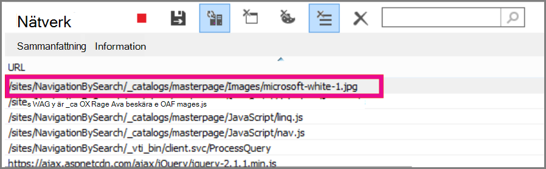
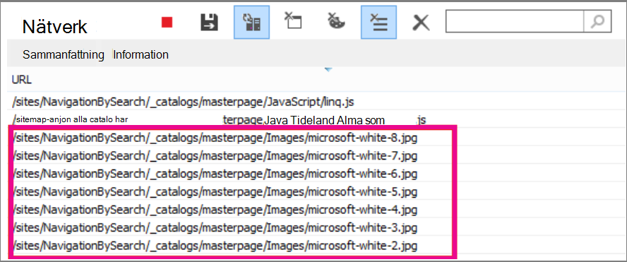

# <a name="delay-loading-images-and-javascript-in-sharepoint-online"></a><span data-ttu-id="4fd3f-103">Fördröja inläsning av bilder och JavaScript i SharePoint Online</span><span class="sxs-lookup"><span data-stu-id="4fd3f-103">Delay loading images and JavaScript in SharePoint Online</span></span>

<span data-ttu-id="4fd3f-104">I den här artikeln beskrivs hur du kan minska inläsningstiden för SharePoint Online-sidor genom att använda JavaScript för att fördröja inläsningen av bilder och även genom att vänta med att läsa in icke-viktiga JavaScript tills sidan har lästs in.</span><span class="sxs-lookup"><span data-stu-id="4fd3f-104">This article describes how you can decrease the load time for SharePoint Online pages by using JavaScript to delay loading images and also by waiting to load non-essential JavaScript until after the page loads.</span></span>
  
<span data-ttu-id="4fd3f-105">Bilder kan påverka inläsningshastigheten för sidor i SharePoint Online negativt.</span><span class="sxs-lookup"><span data-stu-id="4fd3f-105">Images can negatively affect page load speeds on SharePoint Online.</span></span> <span data-ttu-id="4fd3f-106">Som standard hämtar de flesta moderna webbläsare bilder i förväg när de läser in en HTML-sida.</span><span class="sxs-lookup"><span data-stu-id="4fd3f-106">By default, most modern Internet browsers pre-fetch images when loading an HTML page.</span></span> <span data-ttu-id="4fd3f-107">Det kan leda till att sidan tar onödigt lång tid att läsa in om bilderna inte visas på skärmen förrän användaren rullar nedåt.</span><span class="sxs-lookup"><span data-stu-id="4fd3f-107">This can cause the page to be unnecessarily slow to load if the images are not visible on the screen until the user scrolls down.</span></span> <span data-ttu-id="4fd3f-108">Bilderna kan blockera webbläsaren från att läsa in den synliga delen av sidan.</span><span class="sxs-lookup"><span data-stu-id="4fd3f-108">The images can block the browser from loading the visible part of the page.</span></span> <span data-ttu-id="4fd3f-109">Du kan komma runt det här problemet genom att använda JavaScript för att hoppa över inläsningen av bilder först.</span><span class="sxs-lookup"><span data-stu-id="4fd3f-109">To work around this problem, you can use JavaScript to skip loading the images first.</span></span> <span data-ttu-id="4fd3f-110">Inläsning av JavaScript som inte är viktigt kan också leda till långsamma nedladdningstider på SharePoint-sidor.</span><span class="sxs-lookup"><span data-stu-id="4fd3f-110">Also, loading non-essential JavaScript can slow download times on your SharePoint pages too.</span></span> <span data-ttu-id="4fd3f-111">I det här avsnittet beskrivs några metoder du kan använda för att förbättra sidinläsningstiderna med JavaScript i SharePoint Online.</span><span class="sxs-lookup"><span data-stu-id="4fd3f-111">This topic describes some methods you can use to improve page load times with JavaScript in SharePoint Online.</span></span>
  
## <a name="improve-page-load-times-by-delaying-image-loading-in-sharepoint-online-pages-by-using-javascript"></a><span data-ttu-id="4fd3f-112">Förbättra sidinläsningstiderna genom att fördröja inläsningen av bilder på SharePoint Online-sidor med JavaScript</span><span class="sxs-lookup"><span data-stu-id="4fd3f-112">Improve page load times by delaying image loading in SharePoint Online pages by using JavaScript</span></span>

<span data-ttu-id="4fd3f-113">Du kan använda JavaScript för att förhindra att en webbläsare hämtar bilder i förväg.</span><span class="sxs-lookup"><span data-stu-id="4fd3f-113">You can use JavaScript to prevent a web browser from pre-fetching images.</span></span> <span data-ttu-id="4fd3f-114">Det gör att den övergripande dokumentåtergivningen går snabbare.</span><span class="sxs-lookup"><span data-stu-id="4fd3f-114">This speeds up overall document rendering.</span></span> <span data-ttu-id="4fd3f-115">Om du vill göra det här tar du bort värdet för src-attributet från taggen och ersätter det med sökvägen till en fil i ett \ dataattribut, till exempel: data-src.</span><span class="sxs-lookup"><span data-stu-id="4fd3f-115">To do this you remove the value of the src attribute from the \ tag and replace it with the path to a file in a data attribute such as: data-src.</span></span> <span data-ttu-id="4fd3f-116">Ett exempel:</span><span class="sxs-lookup"><span data-stu-id="4fd3f-116">For example:</span></span>
  
```html

```

<span data-ttu-id="4fd3f-117">Med den här metoden laddar webbläsaren inte ned bilderna direkt.</span><span class="sxs-lookup"><span data-stu-id="4fd3f-117">By using this method, the browser doesn't download the images immediately.</span></span> <span data-ttu-id="4fd3f-118">Om bilden redan finns i visningsområdet talar JavaScript om för webbläsaren att hämta URL-adressen från dataattributet och infoga den som värde för src-attributet.</span><span class="sxs-lookup"><span data-stu-id="4fd3f-118">If the image is already in the viewport, JavaScript tells the browser to retrieve the URL from the data attribute and insert it as the value for the src attribute.</span></span> <span data-ttu-id="4fd3f-119">Bilden läses bara in när användaren rullar och den kommer in i visningsläge.</span><span class="sxs-lookup"><span data-stu-id="4fd3f-119">The image only loads as the user scrolls and it comes into view.</span></span>
  
<span data-ttu-id="4fd3f-120">Om du vill göra allt detta måste du använda JavaScript.</span><span class="sxs-lookup"><span data-stu-id="4fd3f-120">To make all of this happen, you'll need to use JavaScript.</span></span>
  
<span data-ttu-id="4fd3f-121">Definiera funktionen **isElementInViewport()** i en textfil för att kontrollera om ett element finns i den del av webbläsaren som är synlig för användaren.</span><span class="sxs-lookup"><span data-stu-id="4fd3f-121">In a text file, define the **isElementInViewport()** function to check whether or not an element is in the part of the browser that is visible to the user.</span></span>
  
```javascript
function isElementInViewport(el) {
  if (!el)
    return false;
  var rect = el.getBoundingClientRect();
  return (
    rect.top >= 0 &amp;&amp;
    rect.left >= 0 &amp;&amp;
    rect.bottom <= (window.innerHeight || document.documentElement.clientHeight) &amp;&amp;
    rect.right <= (window.innerWidth || document.documentElement.clientWidth)
  );
}
```

<span data-ttu-id="4fd3f-122">Använd sedan **isElementInViewport()** i funktionen **loadItemsInView().**</span><span class="sxs-lookup"><span data-stu-id="4fd3f-122">Next, use **isElementInViewport()** in the **loadItemsInView()** function.</span></span> <span data-ttu-id="4fd3f-123">Funktionen **loadItemsInView()** laddar alla bilder som har ett värde för attributet data-src, om de finns i den del av webbläsaren som är synlig för användaren.</span><span class="sxs-lookup"><span data-stu-id="4fd3f-123">The **loadItemsInView()** function will load all images that have a value for the data-src attribute if they are in the part of the browser that is visible to the user.</span></span> <span data-ttu-id="4fd3f-124">Lägg till följande funktion i textfilen:</span><span class="sxs-lookup"><span data-stu-id="4fd3f-124">Add the following function to the text file:</span></span>
  
```javascript
function loadItemsInView() {
  //Select elements by the row id.
  $("#row [data-src]").each(function () {
      var isVisible = isElementInViewport(this);
      if (isVisible) {
          if ($(this).attr("src") == undefined) {
              $(this).attr("src", $(this).data("src"));
          }
      }
  });
}
```

<span data-ttu-id="4fd3f-125">Anropa slutligen **loadItemsInView()** inifrån **window.onscroll()** enligt följande exempel.</span><span class="sxs-lookup"><span data-stu-id="4fd3f-125">Finally, call **loadItemsInView()** from within **window.onscroll()** as shown in the following example.</span></span> <span data-ttu-id="4fd3f-126">Detta garanterar att alla bilder som finns i visningsområdet laddas när användaren behöver dem, men inte tidigare.</span><span class="sxs-lookup"><span data-stu-id="4fd3f-126">This ensures that any images that are in the viewport are loaded as the user needs them, but not before.</span></span> <span data-ttu-id="4fd3f-127">Lägg till följande i textfilen:</span><span class="sxs-lookup"><span data-stu-id="4fd3f-127">Add the following to the text file:</span></span>
  
```javascript
//Example of calling loadItemsInView() from within window.onscroll()
$(window).on("scroll", function () {
    loadItemsInView();
});

```

<span data-ttu-id="4fd3f-128">För SharePoint Online måste du koppla följande funktion till rullningshändelsen på \<div\> #s4-workspace-taggen.</span><span class="sxs-lookup"><span data-stu-id="4fd3f-128">For SharePoint Online, you need to attach the following function to the scroll event on the #s4-workspace \<div\> tag.</span></span> <span data-ttu-id="4fd3f-129">Det beror på att fönsterhändelserna åsidosätts för att säkerställa att menyfliksområdet förblir kopplat till början av sidan.</span><span class="sxs-lookup"><span data-stu-id="4fd3f-129">This is because the window events are overridden in order to ensure the ribbon remains attached to the top of the page.</span></span>
  
```javascript
//Keep the ribbon at the top of the page
$('#s4-workspace').on("scroll", function () {
    loadItemsInView();
});
```

<span data-ttu-id="4fd3f-130">Spara textfilen som en JavaScript-fil med filnamnstillägget .js, till exempel delayLoadImages.js.</span><span class="sxs-lookup"><span data-stu-id="4fd3f-130">Save the text file as a JavaScript file with the extension .js, for example delayLoadImages.js.</span></span>
  
<span data-ttu-id="4fd3f-131">När du är klar med delayLoadImages.js kan du lägga till innehållet i filen på en huvudsida i SharePoint Online.</span><span class="sxs-lookup"><span data-stu-id="4fd3f-131">Once you've finished writing delayLoadImages.js, you can add the contents of the file to a master page in SharePoint Online.</span></span> <span data-ttu-id="4fd3f-132">Det gör du genom att lägga till en skriptlänk i sidhuvudet på huvudsidan.</span><span class="sxs-lookup"><span data-stu-id="4fd3f-132">You do this by adding a script link to the header in the master page.</span></span> <span data-ttu-id="4fd3f-133">När JavaScript-text finns på en huvudsida används det på alla sidor på SharePoint Online-webbplatsen som använder den huvudsideslayouten.</span><span class="sxs-lookup"><span data-stu-id="4fd3f-133">Once it's in a master page, the JavaScript will be applied to all pages in your SharePoint Online site that use that master page layout.</span></span> <span data-ttu-id="4fd3f-134">Om du bara tänker använda det på en sida på webbplatsen kan du använda skriptredigeringswebbdelen till att bädda in JavaScript-skriptet på sidan.</span><span class="sxs-lookup"><span data-stu-id="4fd3f-134">Alternatively, if you intend to only use this on one page of your site, use the script editor Web Part to embed the JavaScript into the page.</span></span> <span data-ttu-id="4fd3f-135">Mer information finns i följande avsnitt:</span><span class="sxs-lookup"><span data-stu-id="4fd3f-135">See these topics for more information:</span></span>
  
- [<span data-ttu-id="4fd3f-136">Så här gör du för att: Använda en huvudsida för en webbplats i SharePoint 2013</span><span class="sxs-lookup"><span data-stu-id="4fd3f-136">How to: Apply a master page to a site in SharePoint 2013</span></span>](/sharepoint/dev/general-development/how-to-apply-a-master-page-to-a-site-in-sharepoint)

- [<span data-ttu-id="4fd3f-137">Så här gör du för att: Skapa en sidlayout i SharePoint 2013</span><span class="sxs-lookup"><span data-stu-id="4fd3f-137">How to: Create a page layout in SharePoint 2013</span></span>](/sharepoint/dev/general-development/how-to-create-a-page-layout-in-sharepoint)

### <a name="example-referencing-the-javascript-delayloadimagesjs-file-from-a-master-page-in-sharepoint-online"></a><span data-ttu-id="4fd3f-138">Exempel: Referera till JavaScript-delayLoadImages.js från en huvudsida i SharePoint Online</span><span class="sxs-lookup"><span data-stu-id="4fd3f-138">Example: Referencing the JavaScript delayLoadImages.js file from a master page in SharePoint Online</span></span>
  
<span data-ttu-id="4fd3f-139">För att det här ska fungera måste du också referera till jQuery på huvudsidan.</span><span class="sxs-lookup"><span data-stu-id="4fd3f-139">In order for this to work, you also need to reference jQuery in the master page.</span></span> <span data-ttu-id="4fd3f-140">I följande exempel kan du se att i den första sidinläsningen finns det bara en bild inläst, men det finns flera bilder på sidan.</span><span class="sxs-lookup"><span data-stu-id="4fd3f-140">In the following example, you can see in the initial page load that there is only one image loaded but there are several more on the page.</span></span>
  

  
<span data-ttu-id="4fd3f-142">På följande skärmbild visas resten av bilderna som laddas ned när de rullas in i vyn.</span><span class="sxs-lookup"><span data-stu-id="4fd3f-142">The following screenshot shows the rest of the images that are downloaded after they scroll into view.</span></span>
  

  
<span data-ttu-id="4fd3f-144">Att fördröja bildläsningen med hjälp av JavaScript kan vara en effektiv teknik för att öka prestandan. Men om tekniken används på en offentlig webbplats kan sökmotorer inte crawla bilder på samma sätt som de skulle crawla bilder som skapats regelbundet.</span><span class="sxs-lookup"><span data-stu-id="4fd3f-144">Delaying image loading by using JavaScript can be an effective technique in increasing performance; however, if the technique is applied on a public website then search engines are not able to crawl the images in the same way they would crawl a regularly formed image.</span></span> <span data-ttu-id="4fd3f-145">Det kan påverka rangordningen på sökmotorer eftersom metadata på själva bilden inte verkligen finns där förrän sidan läses in.</span><span class="sxs-lookup"><span data-stu-id="4fd3f-145">This can affect rankings on search engines because metadata on the image itself is not really there until the page loads.</span></span> <span data-ttu-id="4fd3f-146">Sökmotor crawlare läser bara HTML-koden och ser därför inte bilderna som innehåll på sidan.</span><span class="sxs-lookup"><span data-stu-id="4fd3f-146">Search engine crawlers only read the HTML and therefore will not see the images as content on the page.</span></span> <span data-ttu-id="4fd3f-147">Bilder är en av de faktorer som används för att rangordna sidor i sökresultat.</span><span class="sxs-lookup"><span data-stu-id="4fd3f-147">Images are one of the factors used to rank pages in search results.</span></span> <span data-ttu-id="4fd3f-148">Ett sätt att komma runt det här problemet är att använda introduktionstext för bilder.</span><span class="sxs-lookup"><span data-stu-id="4fd3f-148">One way to work around this is to use introductory text for your images.</span></span>
  
## <a name="github-code-sample-injecting-javascript-to-improve-performance"></a><span data-ttu-id="4fd3f-149">Exempel på GitHub-kod: Mata in JavaScript för att förbättra prestanda</span><span class="sxs-lookup"><span data-stu-id="4fd3f-149">GitHub code sample: Injecting JavaScript to improve performance</span></span>

<span data-ttu-id="4fd3f-150">Missa inte artikeln och kodexeskriptet på [JavaScript-rutorna](https://go.microsoft.com/fwlink/p/?LinkId=524759) som visas på GitHub.</span><span class="sxs-lookup"><span data-stu-id="4fd3f-150">Don't miss the article and code sample on [JavaScript injection](https://go.microsoft.com/fwlink/p/?LinkId=524759) provided on GitHub.</span></span>
  
## <a name="see-also"></a><span data-ttu-id="4fd3f-151">Se även</span><span class="sxs-lookup"><span data-stu-id="4fd3f-151">See also</span></span>

[<span data-ttu-id="4fd3f-152">Webbläsare som stöds i Office 2013 och Microsoft 365-program för företag</span><span class="sxs-lookup"><span data-stu-id="4fd3f-152">Supported browsers in Office 2013 and Microsoft 365 Apps for enterprise</span></span>](https://support.office.com/article/57342811-0dc4-4316-b773-20082ced8a82)
  
[<span data-ttu-id="4fd3f-153">Så här gör du för att: Använda en huvudsida för en webbplats i SharePoint 2013</span><span class="sxs-lookup"><span data-stu-id="4fd3f-153">How to: Apply a master page to a site in SharePoint 2013</span></span>](/sharepoint/dev/general-development/how-to-apply-a-master-page-to-a-site-in-sharepoint)
  
[<span data-ttu-id="4fd3f-154">Så här gör du för att: Skapa en sidlayout i SharePoint 2013</span><span class="sxs-lookup"><span data-stu-id="4fd3f-154">How to: Create a page layout in SharePoint 2013</span></span>](/sharepoint/dev/general-development/how-to-create-a-page-layout-in-sharepoint)