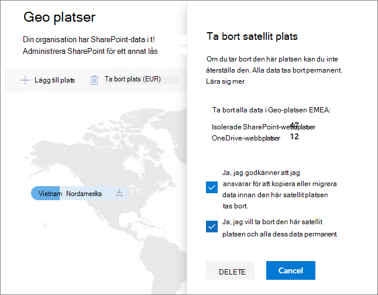

# Ta bort en satellitplats i Microsoft 365 Multi-GeoDelete a satellite location in Microsoft 365 Multi-Geo

Om du inte längre behöver en satellitplats kan du ta bort den från klientorganisationen SharePoint administrationscentret.If you no longer need a satellite location, you can delete it from your tenant from the SharePoint admin center.

> [!WARNING]
> Alla användardata på satellitplatsen tas bort permanent.All user data in the satellite location will be permanently deleted. Det omfattar allt OneDrive för företag, webbplatser SharePoint postlådor Exchange postlådor, inklusive postlådor Microsoft 365 grupper.This includes all OneDrive for Business content, SharePoint sites and Exchange mailboxes including Microsoft 365 Group mailboxes. Du måste migrera data till en annan satellitplats eller den centrala platsen innan du tar bort satellitplatsen.You must migrate any data to another satellite location or the central location before you delete the satellite location. Den här åtgärden kan inte ångras.This action cannot be undone.

Endast globala administratörer kan ta bort satellitplatser.Only global administrators can delete satellite locations.

Ta bort en satellitplatsTo delete a satellite location

1. Öppna SharePoint administrationscenterOpen the SharePoint admin center

2. Gå till **fliken Geoplatser.**Navigate to the **Geo locations** tab.

3. Klicka på den geoplats du vill ta bort på kartan.On the map, click the geo location that you want to delete.

4. Klicka på **Ta bort plats.**Click **Delete location**.

5. Bekräfta borttagningen genom att markera kryssrutorna för bekräftelse.Confirm the deletion by selecting the confirmation check boxes.

6. Klicka på **Ta bort**.Click **Delete**.
