# Grundläggande infrastruktur för Microsoft 365 för företag för andra än stora företagMicrosoft 365 for enterprise foundation infrastructure for non-enterprises

Andra organisationer än stora företag kan också distribuera Microsoft 365 för företag och uppleva affärsvärdet för en integrerad och säker infrastruktur som gör det möjligt att samarbeta och frigöra kreativitet.Non-enterprise organizations can also deploy Microsoft 365 for enterprise and realize the business value of an integrated and secure infrastructure that enables teamwork and unlocks creativity. Andra organisationer än stora företag har vanligtvis:A non-enterprise typically has:

- En mindre del lokal IT-infrastruktur, t.ex. e-post och filservrar och en AD DS-domän (Active Directory Domain Services), eller ingen alls.A small amount of on-premises IT infrastructure, such as email and file servers and an Active Directory Domain Services (AD DS) domain, or none at all.
- En liten IT-personalstyrka, varav de flesta är IT-generalister snarare än specialister inom en specifik teknik eller ett kunskapsområde, t.ex. nätverk eller e-post.A small IT staff, most of whom are IT generalists, rather than specialists in a specific technology or workload such as networking or email.

För mindre organisationer erbjuder Microsoft [Microsoft 365 Business](https://www.microsoft.com/microsoft-365/business).For smaller, non-enterprise organizations, Microsoft offers [Microsoft 365 for business](https://www.microsoft.com/microsoft-365/business). Det finns dock anledningar till varför du kan behöva Microsoft 365 för företag, till exempel:However, there are reasons why you might need Microsoft 365 for enterprise, such as:

- Din organisation behöver mer eller kommer att behöva mer än 300 Microsoft 365-licenser, vilket är maximalt antal för Microsoft 365 Business.Your organization needs more or will need more than 300 Microsoft 365 licenses, which is the maximum for Microsoft 365 for business.
- Din organisation behöver de avancerade funktionerna för produktivitet, rösttjänster, säkerhet och analys som inte finns i Microsoft 365 Business.Your organization needs the advanced productivity, voice, security, and analytics capabilities that are not available with Microsoft 365 for business.

I den här artikeln beskrivs en förenklad distribution av den grundläggande infrastrukturen för Microsoft 365 för företag, som passar företag som inte har lika stora behov som storföretag.This article steps you through a simplified deployment of the foundation infrastructure of Microsoft 365 for enterprise suitable for your non-enterprise.

## Konfigurera först din prenumerationFirst, set up your subscription

Du måste konfigurera DNS-domänerna (Domain Name System) för prenumerationen.You must set up the Domain Name System (DNS) domains for your subscription. Om du redan har en Microsoft 365-prenumeration borde detta vara gjort.If you already have a Microsoft 365 subscription, this should have been done. Annars följer du anvisningarna i [Lägga till en domän i Office 365](https://docs.microsoft.com/office365/admin/setup/add-domain?view=o365-worldwide).If not, follow the instructions in [Add a domain to Office 365](https://docs.microsoft.com/office365/admin/setup/add-domain?view=o365-worldwide).

Därefter måste du konfigurera ytterligare säkerhet för Microsoft 365.Next, you need to configure additional security for Microsoft 365. Följ anvisningarna i [Konfigurera ökad säkerhet](https://docs.microsoft.com/office365/securitycompliance/tenant-wide-setup-for-increased-security).Follow the instructions in [Configure increased security](https://docs.microsoft.com/office365/securitycompliance/tenant-wide-setup-for-increased-security).

## Fas 1: NätverkPhase 1: Networking

Organisationer som inte är stora företag har vanligtvis lokala Internetanslutningar på varje kontor och använder inte proxyservrar, brandväggar eller enheter för paketkontroll.Non-enterprise organizations typically have local Internet connections in each office and do not use proxy servers, firewalls, or packet inspection devices. Den Internetleverantör som betjänar varje kontor har en regional lokal DNS-server så att trafiken dirigeras till den Microsoft 365-nätverksplats som ligger närmast dina kontor och de lokala användarna.The Internet service provider (ISP) serving each office has a regionally local DNS server so that traffic is directed to the Microsoft 365 network location that is closest to your offices and their on-premises users. Mer information finns i [Konfigurera lokala Internetanslutningar för varje kontor](networking-dns-resolution-same-location.md).For more information, see [Configure local Internet connections for each office](networking-dns-resolution-same-location.md).

Därför behöver du bara verifiera med din Internetleverantör att anslutningen på var och en av dina kontorsplatser:Therefore, you only need to verify with your ISP that the connection at each of your office locations:

- Använder en regional lokal DNS-server.Uses a regionally local DNS server.
- Passar för nuvarande och framtida behov allteftersom användarna börjar använda fler Microsoft 365-molntjänster.Is adequate for current and future needs as your users begin using more Microsoft 365 cloud services.

Om du använder proxyservrar, brandväggar eller enheter för paketkontroll kan du läsa [Konfigurera förbikoppling av trafik](networking-configure-proxies-firewalls.md) för mer information om hur du optimerar prestanda för Microsoft 365-tjänster.If you do use proxy servers, firewalls, or packet inspection devices, see [Configure traffic bypass](networking-configure-proxies-firewalls.md) for information on how to optimize performance to Microsoft 365 services.

### Din konfiguration hittillsYour configuration so far

Här är en visuell sammanfattning med fas 1-elementet markerat.Here is a visual summary with the Phase 1 element highlighted. **Din organisation** kan bestå av flera kontor, som vart och ett har en lokal Internetanslutning med en Internetleverantör som använder en regional lokal DNS-server.**Your organization** can be multiple offices, each of which has a local Internet connection with an ISP that uses a regionally local DNS server. Via Internetleverantören kan användarna på varje kontor nå närmaste Microsoft 365-nätverksplats och resurserna för Microsoft 365-prenumerationen.Through the ISP, users in each office can reach the nearest Microsoft 365 network location and the resources of your Microsoft 365 subscription.

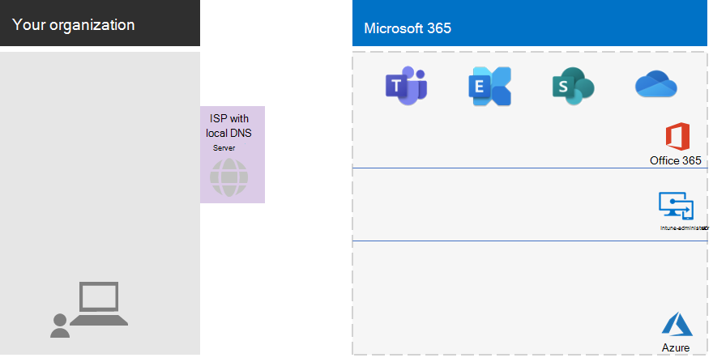

## Fas 2: IdentitetPhase 2: Identity

Alla anställda i din organisation måste kunna logga in, vilket kräver ett användarkonto i Azure Active Directory-klientorganisationen (Azure AD) för Microsoft 365 för företag-prenumerationen.Each employee of your organization must be able to sign in, which requires a user account in the Azure Active Directory (Azure AD) tenant of your Microsoft 365 for enterprise subscription. Grupper används sedan för att hålla samman användarkonton och andra grupper för att kommunicera och få tillgång till resurser som kräver behörighet, t.ex. en SharePoint Online-webbplats eller ett team.Groups are then used to contain user accounts and other groups to communicate or gain access to permissioned resources, such as a SharePoint Online site or a team. 

### AdministratörskontonAdministrator accounts

Skydda dina användarkonton för global administratör genom att kräva starka lösenord och multifaktorautentisering (MFA).Protect your global administrator user accounts by requiring strong passwords and multi-factor authentication (MFA). Mer information finns i [Skydda globala administratörskonton](identity-create-protect-global-admins.md#protect-global-administrator-accounts).See [Protect global administrator accounts](identity-create-protect-global-admins.md#protect-global-administrator-accounts) for more information.

Om din organisation kräver hög säkerhet och du har Microsoft 365 E5, använder du Azure AD Privileged Identity Management för att aktivera just-in-time-administratörsåtkomst.If your organization requires high security and you have Microsoft 365 E5, use Azure AD Privileged Identity Management to enable just-in-time administrator access. Mer information finns i [Konfigurera globala administratörer på begäran](identity-create-protect-global-admins.md#identity-pim).See [Set up on-demand global administrators](identity-create-protect-global-admins.md#identity-pim) for more information.

### Rekommendationer för grupperRecommendations for groups

Om du har en lokal AD DS-domän fortsätter du att använda dessa grupper i Microsoft 365 för företag som grupper i Azure AD.If you have an on-premises AD DS domain, continue to use those groups in Microsoft 365 for enterprise as groups in Azure AD.

Om du inte har en lokal AD DS-domän skapar du säkerhetsgrupper i Azure AD med dessa säkerhetsnivåer.If you don't have an on-premises AD DS domain, create security groups in Azure AD using these levels of security.

| SäkerhetsnivåSecurity level | BeskrivningDescription | ExempelExamples |
|:-------|:-----|:-----|
| GrundläggandeBaseline | Det här är en minimal standard för att skydda data och identiteter och enheter som har åtkomst till dina data.This is a minimum and default  standard for protecting data and the identities and devices that access your data.    Det här är vanligtvis den största delen av organisationens data som hanteras av de flesta av användarna.This is typically most of your organization's data managed by most of your users. | Grupper för personal som jobbar på fältet och med kunder, till exempel försäljning, marknadsföring, support, administration och tillverkning.Groups for first line workers, such as sales, marketing, support, administration, and manufacturing. |
| KänsligSensitive | Det här är ytterligare skydd för en underuppsättning av dina data som måste skyddas mer än på grundläggande nivå.This is additional protection for a subset of your data that must be protected beyond the baseline level. Dessa grupper innehåller användare som använder och skapar känsliga data som är avsedda för avdelningar och projekt som inte är avsedda att bli tillgängliga för alla.These groups contain users that use and create sensitive data that is specific to departments and projects that are not meant to be available to everyone. | Produkt- eller marknadsgrupper som utvecklar kommande produkterProduct or marketing teams that are developing future products |
| Strikt regleradHighly regulated | Det här är den högsta skyddsnivån för en liten mängd data som är strikt sekretessbelagda, vilka kan vara intellektuella egendomar eller affärshemligheter eller data som måste följa säkerhetsföreskrifter.This is the highest level of protection for a typically small amount of data that is highly classified, considered intellectual property or trade secrets, or data that must adhere to security regulations. |  Forskningsteam och juridiska och ekonomiska team, eller team som lagrar eller använder kund- eller partnerdata.Research, legal, and financial teams, or teams storing or using customer or partner data. |
||||

### HybrididentitetHybrid identity

Om du har en lokal AD DS-domän måste du synkronisera uppsättningen användarkonton, grupper och kontakter för din domän med Azure AD-klientorganisationen för din Microsoft 365 för företag-prenumeration.If you have an on-premises AD DS domain, you need to synchronize the set of user accounts, groups, and contacts of your domain with the Azure AD tenant of your Microsoft 365 for enterprise subscription. För andra än stora företag konfigurerar du Azure AD Connect på en server med synkronisering av lösenordshash (PHS).For your non-enterprise, you configure Azure AD Connect on a server with password hash synchronization (PHS). Mer information finns i [Synkronisera identiteter](identity-add-user-accounts.md#synchronize-identities-for-hybrid-identity).See [Synchronize identities](identity-add-user-accounts.md#synchronize-identities-for-hybrid-identity) for more information.

### Säkrare användaråtkomst med principer för villkorsstyrd åtkomstMore secure user access with Conditional Access policies

Med Azure AD utvärderas villkoren för användarinloggningar, och principer för villkorsstyrd åtkomst kan användas för att bevilja eller neka åtkomst och för att vidta fler åtgärder som måste utföras för att slutföra inloggningen.Azure AD evaluates the conditions of user sign-ins and can use Conditional Access policies to grant or deny access and impose further actions that must be taken to complete the sign-in. Om till exempel Azure AD fastställer att inloggningen sker under medelhög eller hög risknivå, kan det krävas att användaren utför MFA för att slutföra inloggningen.For example, if Azure AD determines that the sign-in is happening under medium or high-risk conditions, it can require the user to perform MFA to complete the sign-in.

Du kan använda principer för villkorsstyrd åtkomst för användarkonton eller grupper.You apply Conditional Access policies to user accounts or groups. Om du vill göra det enklare att använda principer för villkorsstyrd åtkomst skapar du följande Azure AD-säkerhetsgrupper i din organisation:To facilitate an easier assignment of Conditional Access policies, create these Azure AD security groups in your organization:

- BASELINEBASELINE

  Innehåller grupper eller användarkonton för användare med åtkomst till grundläggande data.Contains the groups or user accounts for users with access to baseline data.

- SENSITIVESENSITIVE

  Innehåller grupper eller användarkonton för användare med åtkomst till känsliga data.Contains the groups or user accounts for users with access to sensitive data.

- HIGHLY-REGULATEDHIGHLY-REGULATED

  Innehåller grupper eller användarkonton för användare med åtkomst till strikt reglerade data.Contains the groups or user accounts for users with access to highly regulated data.

- COND-ACCESS-EXCLUDECOND-ACCESS-EXCLUDE

  En tom grupp som du kan använda för att tillfälligt undanta en användare från principer för villkorsstyrd åtkomst.An empty group that you can use to temporarily exclude a user from Conditional Access policies.

Här följer en lista över principer för villkorsstyrd åtkomst i Azure AD att aktivera eller skapa.Here is the list of Azure AD Conditional Access policies to enable or create.

| Princip för villkorsstyrd åtkomst i Azure ADAzure AD Conditional Access policy | Grupper som den gäller förGroups to which it applies |
|:------|:-----|
| Grundläggande princip: Kräv MFA för administratörerBaseline policy: Require MFA for admins | Principen gäller för administratörsroller, så inga grupper måste anges.This policy applies to admin roles, so no groups need to be specified. Principen behöver bara aktiveras.This policy just needs to be enabled. Alla efterföljande principer måste skapas och aktiveras.All subsequent policies need to be created and enabled. |
| Blockera klienter som inte har stöd för modern autentiseringBlock clients that don't support modern authentication | Välj Alla användare i principinställningarna.Select "All users" in the policy settings. |
| Kräv MFA när inloggningsrisken är medelhög eller hög (kräver Microsoft 365 E5)Require MFA when sign-in risk is medium or high (requires Microsoft 365 E5) | BASELINEBASELINE |
| Kräv MFA när inloggningsrisken är låg, medel eller hög (kräver Microsoft 365 E5)Require MFA when sign-in risk is low, medium, or high (requires Microsoft 365 E5) | SENSITIVESENSITIVE |
| Kräv alltid MFAAlways require MFA | HIGHLY-REGULATEDHIGHLY-REGULATED |
| Kräv godkända appar på iOS- och Android-enheterRequire approved apps on iOS and Android devices | BASELINE, SENSITIVE, HIGHLY-REGULATEDBASELINE, SENSITIVE, HIGHLY-REGULATED |
| Kräv kompatibla PC-datorerRequire compliant PCs | BASELINEBASELINE |
| Kräv kompatibla PC-datorer och iOS- och Android-enheterRequire compliant PCs and iOS and Android devices | SENSITIVE, HIGHLY-REGULATEDSENSITIVE, HIGHLY-REGULATED |
|||

Det här är användarriskprincipen Azure AD Identity Protection (kräver Microsoft 365 E5) som du kan skapa och aktivera.Here is the Azure AD Identity Protection (requires Microsoft 365 E5) user risk policy to create and enable.

| Användarriskprincipen Azure AD Identity ProtectionAzure AD Identity Protection user risk policy | Grupper som den gäller förGroups to which it applies |
|:------|:-----|
| Användare med hög risk måste byta lösenordHigh risk users must change passwords | Välj Alla användare i principinställningarna.Select "All users" in the policy settings. |
|||

Mer information finns i [Vanliga principer för identitets- och enhetsåtkomst](identity-access-policies.md).See [Common identity and device access policies](identity-access-policies.md) for the instructions.

### Grupper för enklare hanteringGroups for easier management

Här är några av de funktioner som kan göra grupp- och licenshantering lättare för dig.Here are some features that can make group and licensing management easier for you.

| FunktionFeature | AnvändningUse |
|:------|:-----|
| Grupphantering för självbetjäningSelf-service group management | Tillåt hantering av Azure AD-grupper för gruppägare istället för IT-personal.Allow management of Azure AD groups by group owners instead of IT staff. Mer information finns i [Grupphantering för självbetjäning](identity-use-group-management.md#allow-users-to-create-and-manage-their-own-groups).See [Self-service group management](identity-use-group-management.md#allow-users-to-create-and-manage-their-own-groups) for more information. |
| Dynamiskt gruppmedlemskapDynamic group membership | Konfigurera automatiskt tillägg eller borttagning av användarkonton från Azure AD-grupper baserat på användarkontons attribut, t.ex. avdelning eller land.Configure automatic addition or removal of user accounts from Azure AD groups based on user account attributes, such as Department or Country. Mer information finns i [Dynamiskt gruppmedlemskap](identity-use-group-management.md#set-up-dynamic-group-membership).See [Dynamic group membership](identity-use-group-management.md#set-up-dynamic-group-membership) for more information. |
| Gruppbaserad licensieringGroup-based licensing | Använd gruppmedlemskap för att automatiskt tilldela eller ta bort licenser för användarkonton.Use group membership to automatically assign or unassign licenses to user accounts. Mer information finns i [Gruppbaserad licensiering](identity-use-group-management.md#set-up-automatic-licensing).See [Group-based licensing](identity-use-group-management.md#set-up-automatic-licensing) for more information. |
|  |  |

Om du använder gruppbaserad licensiering kan du skapa en grupp med namnet LICENSED för användarkontonamn som tilldelats en Microsoft 365 för företag-licens.If you are using group-based licensing, create a group named LICENSED to contain user account names that are assigned a Microsoft 365 for enterprise license.

### Övervaka användaråtkomstMonitor user access

Om du har Microsoft 365 E5 kan du med hjälp av Azure AD Identity Protection övervaka och analysera användarinloggningar för att upptäcka angrepp mot autentiseringsuppgifter.If you have Microsoft 365 E5, you can use Azure AD Identity Protection to monitor and analyze user sign-ins for credential compromise. Mer information finns i [Skydda mot obehörig inloggning](identity-secure-user-sign-ins.md#protect-against-credential-compromise).See [Protect against credential compromise](identity-secure-user-sign-ins.md#protect-against-credential-compromise) for more information.

### Din konfiguration hittillsYour configuration so far

Här är en visuell sammanfattning av identitetsfasen för hybrididentitet, med befintliga och nya element markerade.Here is a visual summary of the Identity phase for hybrid identity, with existing and new elements highlighted.

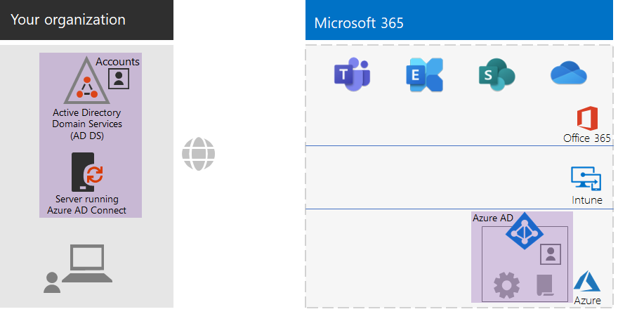
 
De nya och markerade hybrididentitetselementen inkluderar:The new and highlighted hybrid identity elements include:
 
|||
|:------:|:-----|
| 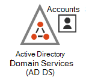 | En lokal AD DS-domän med användarkonton och grupper.An on-premises AD DS domain with user accounts and groups. |
| 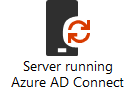 | En Windows-baserad server med Azure AD Connect.A Windows-based server running Azure AD Connect. |
| 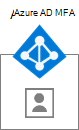 | Synkroniserad uppsättning av AD DS-användarkonton och grupper i Azure AD.The synchronized set of AD DS user accounts and groups in Azure AD. |
|  | Azure AD-inställningar för autentisering, skydd av globala konton och enklare hantering av grupper och licenser.Azure AD settings for authentication, securing global accounts, and making it easier to manage groups and licenses. |
| 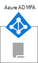 | Principer för villkorsstyrd åtkomst i Azure AD.Azure AD Conditional Access policies. |
|||

Här är en visuell sammanfattning av fasen för helt molnbaserad identitet, med nya element markerade.Here is a visual summary of the Identity phase for cloud-only identity, with the new elements highlighted.

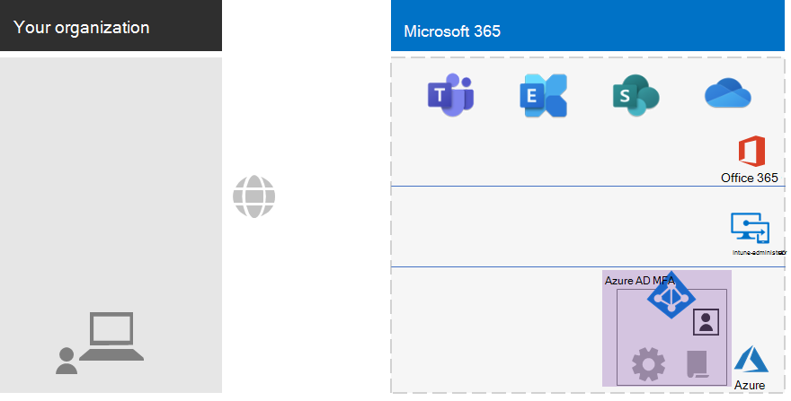
 
De nya och markerade elementen för helt molnbaserad identitet inbegriper:The new and highlighted cloud-only identity elements include:
 
|||
|:------:|:-----|
| 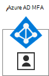 | Användarkonton och grupper i Azure AD.The user accounts and groups in Azure AD. |
|  | Azure AD-inställningar för autentisering, skydd av globala konton och enklare hantering av grupper och licenser.Azure AD settings for authentication, securing global accounts, and making it easier to manage groups and licenses. |
|  | Principer för villkorsstyrd åtkomst i Azure AD.Azure AD Conditional Access policies. |
|||

## Fas 3: Windows 10 EnterprisePhase 3: Windows 10 Enterprise

Här är dina alternativ för att säkerställa att dina Windows 10 Enterprise-enheter är integrerade i identitets- och säkerhetsinfrastrukturen för Microsoft 365 för företag:To ensure that your Windows 10 Enterprise devices are integrated into the identity and security infrastructure of Microsoft 365 for enterprise, here are your options:

- Hybrid (du har en lokal AD DS-domän)Hybrid (you have an on-premises AD DS domain)

  Varje befintlig Windows 10 Enterprise-enhet som redan är ansluten till din AD DS-domän, ska du ansluta till Azure AD-klientorganisationen.For each existing Windows 10 Enterprise device already joined to your AD DS domain, join them to the Azure AD tenant. Mer information finns i [Konfigurera hybridanslutna Azure Active Directory-enheter](https://go.microsoft.com/fwlink/p/?linkid=872870).See [How to configure hybrid Azure Active Directory joined devices](https://go.microsoft.com/fwlink/p/?linkid=872870) for the instructions.

  Varje ny Windows 10 Enterprise-enhet ska du ansluta till din AD DS-domän, och sedan ansluta dem till Azure AD-klientorganisationen.For each new Windows 10 Enterprise device, join them to your AD DS domain, and then join them to the Azure AD tenant.

  Varje Windows 10 Enterprise-enhet ska du registrera för hantering av mobila enheter.For each Windows 10 Enterprise device, enroll them for mobile device management. Anvisningar finns i [Registrera en Windows 10-enhet med Intune med hjälp av en grupprincip](https://go.microsoft.com/fwlink/p/?linkid=872871).See [Enroll a Windows 10 device with Intune by using a Group Policy](https://go.microsoft.com/fwlink/p/?linkid=872871) for the instructions.

- Endast molnet (du har inte en lokal AD DS-domän)Cloud-only (you do not have an on-premises AD DS domain)

  Anslut varje Windows 10 Enterprise-enhet till Azure AD-klientorganisationen för din prenumeration.Join each Windows 10 Enterprise device to the Azure AD tenant of your subscription.

  Mer information finns [Ansluta din arbetsenhet till organisationens nätverk](https://docs.microsoft.com/azure/active-directory/user-help/user-help-join-device-on-network).See [Join your work device to your organization's network](https://docs.microsoft.com/azure/active-directory/user-help/user-help-join-device-on-network) for more information.

När du har installerat och anslutit, installerar varje Windows 10 Enterprise-enhet automatiskt uppdateringar från molntjänsten Windows Update för företag.Once installed and joined, each Windows 10 Enterprise device automatically installs updates from the Windows Update for Business cloud service. Det finns vanligtvis inget behov av att konfigurera en infrastruktur för distribution och installation av Windows 10-uppdateringar i organisationer som inte är stora företag.There is typically no need in a non-enterprise organization to set up an infrastructure to distribute and install Windows 10 updates.

### Din konfiguration hittillsYour configuration so far

Här är en visuell sammanfattning av Windows 10 Enterprise-fasen med nya element markerade.Here is a visual summary of the Windows 10 Enterprise phase with the new elements highlighted.

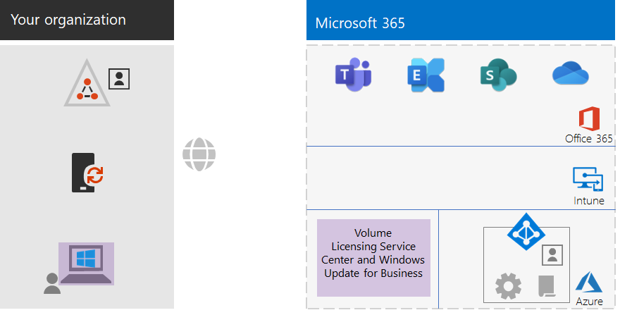
 
De nya och markerade Windows 10 Enterprise-elementen inkluderar:The new and highlighted Windows 10 Enterprise elements include:

|||
|:------:|:-----|
|  | Windows 10 Enterprise installerat på Windows-enheter, med en lokal bärbar dator som exempel.Windows 10 Enterprise installed on Windows devices, with an on-premises laptop as an example. |
| 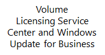 | Volume Licensing Service Center, som innehåller avbildningar för nya installationer av Windows 10 Enterprise, och tjänsten Windows Update för företag, som innehåller de senaste uppdateringarna.The Volume Licensing Service Center, which provides images for new installations of Windows 10 Enterprise, and the Windows Update for Business service, which provides the latest updates. |
|||

## Fas 4: Microsoft 365-applikationer för företagPhase 4: Microsoft 365 Apps for enterprise

Microsoft 365 Enterprise innehåller Microsoft 365-applikationer för företag, prenumerationsversionen av Microsoft Office.Microsoft 365 for enterprise includes Microsoft 365 Apps for enterprise, the subscription version of Microsoft Office. Som Office 2016 eller Office 2019 installeras Microsoft 365-applikationer för företag direkt på dina klientenheter.Like Office 2016 or Office 2019, Microsoft 365 Apps for enterprise is installed directly on your client devices. Microsoft 365-applikationer för företag får däremot regelbundet uppdateringar som innehåller nya funktioner.However, Microsoft 365 Apps for enterprise receives updates that include new features on a regular basis. Mer information finns i [Om Microsoft 365-applikationer för företag i företaget](https://docs.microsoft.com/deployoffice/about-office-365-proplus-in-the-enterprise).See [About Microsoft 365 Apps for enterprise in the enterprise](https://docs.microsoft.com/deployoffice/about-office-365-proplus-in-the-enterprise) for more information.

För andra organisationer än stora företag installerar du Microsoft 365-applikationer för företag manuellt på enheterna, som kan omfatta Windows-, iOS- och Android-enheter.For your non-enterprise organization, you manually install Microsoft 365 Apps for enterprise on devices, which can include Windows, iOS, and Android devices. Detta kan göras som en del av att förbereda en ny enhet för användning, eller av användaren som en del av introduktionsprocessen.This can be done as part of preparing a new device for use, or by the user as part of their onboarding process.

I båda fallen loggar administratören eller användaren in på Office 365-portalen på https://portal.office.com.In either case, the administrator or the user signs in to the Office 365 portal at https://portal.office.com. På fliken **Microsoft Office Home** klickar du på **Installera Office** och genomför installationsprocessen.On the **Microsoft Office Home** tab, click **Install Office** and step through the installation process.

Funktionsuppdateringar för Microsoft 365-applikationer för företag laddas ned varje månad av alla datorer där de är installerade.Feature updates to Microsoft 365 Apps for enterprise are downloaded monthly by each computer on which it is installed. Det finns vanligtvis inget behov av att konfigurera en infrastruktur för distribution av uppdateringar för Microsoft 365-applikationer för företag i organisationer som inte är stora företag.There is typically no need in a non-enterprise organization to set up an infrastructure to distribute Microsoft 365 Apps for enterprise updates. 

### Din konfiguration hittillsYour configuration so far

Här är en visuell sammanfattning av fasen för Microsoft 365-applikationer för företag med nya element markerade.Here is a visual summary of the Microsoft 365 Apps for enterprise phase with the new elements highlighted.

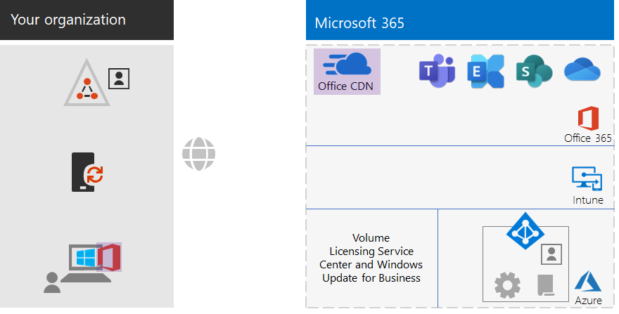
 
De nya och markerade elementen för Microsoft 365-applikationer för företag omfattar:The new and highlighted Microsoft 365 Apps for enterprise elements include:
 
|||
|:------:|:-----|
|  | Microsoft 365-applikationer för företag installerat på enheter, med en lokal bärbar dator som exempel.Microsoft 365 Apps for enterprise installed on devices, with an on-premises laptop as an example. |
| 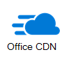 | Office Content Delivery Network (CDN) för Microsoft 365-applikationer för företag, som enheterna har tillgång till för uppdateringar för Microsoft 365-applikationer för företag.The Office Content Delivery Network (CDN) for Microsoft 365 Apps for enterprise, which devices access for Microsoft 365 Apps for enterprise updates. |
|||

## Fas 5: Hantering av mobila enheterPhase 5: Mobile device management

Microsoft 365 för företag innehåller Microsoft Intune för hantering av mobila enheter.Microsoft 365 for enterprise includes Microsoft Intune for mobile device management. Med Intune kan du hantera enheter för Windows, iOS, Android och macOS och skydda åtkomsten till organisationens resurser, inklusive data.With Intune, you can manage Windows, iOS, Android, and macOS devices to protect access to your organization's resources, including your data. I Intune används användar-, grupp- och datorkonton för Azure AD.Intune uses the user, group, and computer accounts of Azure AD.

Intune tillhandahåller två typer av hantering av mobila enheter:Intune provides two types of mobile device management:

- MDM (Mobile Device Management) är när enheter registreras i Intune.Mobile device management (MDM) is when devices get enrolled in Intune. När de har registrerats är de hanterade enheter och kan ta emot principer, regler och inställningar som används av din organisation.Once enrolled, they are managed devices and can receive the policies, rules, and settings used by your organization. Dessa typer av enheter ägs vanligtvis av din organisation och utfärdas till dina anställda.These types of devices are typically owned by your organization and issued to your employees.

- Användare med egna personliga enheter kanske inte vill registrera sina enheter eller att de hanteras av Intune med dina principer och inställningar.Users with their own personal devices may not want to enroll their devices or be managed by Intune with your policies and settings. Men du måste ändå skydda organisationens resurser och data.However, you still need to protect your organization's resources and data. I det här scenariot kan du skydda dina appar med MAM (hantering av mobilprogram).For this scenario, you can protect your apps with mobile application management (MAM).  

Intune-principer kan upprätthålla enhetsefterlevnad och programskydd.Intune policies can enforce device compliance and app protection. Här följer en lista över Intune-principer som du kan skapa.Here is the list of Intune policies to create.

| Intune-principerIntune policies | Grupper som den gäller förGroups to which it applies |
|:------|:-----|
| Policy för enhetsefterlevnad för WindowsDevice compliance policy for Windows | BASELINE, SENSITIVE, HIGHLY-REGULATEDBASELINE, SENSITIVE, HIGHLY-REGULATED |
| Policy för enhetsefterlevnad för iOSDevice compliance policy for iOS | SENSITIVE, HIGHLY-REGULATEDSENSITIVE, HIGHLY-REGULATED |
| Enhetsefterlevnad för macOSDevice compliance for macOS | SENSITIVE, HIGHLY-REGULATEDSENSITIVE, HIGHLY-REGULATED |
| Policy för enhetsefterlevnad för Android och Android EnterpriseDevice compliance policy for Android and Android Enterprise | SENSITIVE, HIGHLY-REGULATEDSENSITIVE, HIGHLY-REGULATED |
| Appskyddsprincip för iOSApp protection policy for iOS | BASELINE, SENSITIVE, HIGHLY-REGULATEDBASELINE, SENSITIVE, HIGHLY-REGULATED |
| Appskyddsprincip för macOSApp protection policy for macOS | BASELINE, SENSITIVE, HIGHLY-REGULATEDBASELINE, SENSITIVE, HIGHLY-REGULATED |
| Appskyddsprincip för Android och Android EnterpriseApp protection policy for Android and Android Enterprise | BASELINE, SENSITIVE, HIGHLY-REGULATEDBASELINE, SENSITIVE, HIGHLY-REGULATED |
|||
    
Mer information finns i [Vanliga principer för identitets- och enhetsåtkomst](identity-access-policies.md).See [Common identity and device access policies](identity-access-policies.md) for the instructions.

### Din konfiguration hittillsYour configuration so far

Här är en visuell sammanfattning av fasen för hantering av mobila enheter, med nya element markerade.Here is a visual summary of the Mobile Device Management phase with the new elements highlighted.

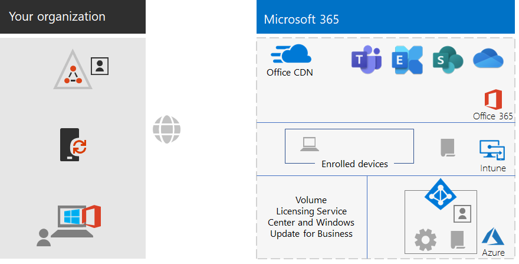
 
De nya och markerade elementen för hantering av mobila enheter inkluderar:The new and highlighted mobile device management elements include:

|||
|:------:|:-----|
| 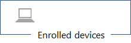 | Enheter som är registrerade i Intune, som visar en lokal bärbar dator med Windows 10 Enterprise som exempel.Devices that are enrolled in Intune, showing an on-premises laptop running Windows 10 Enterprise as an example. |
|  | Intune-principer för enhetsefterlevnad och programskydd.Intune policies for device compliance and app protection. |
|||

## Fas 6: InformationsskyddPhase 6: Information protection

Microsoft 365 för företag har en mängd funktioner för informationsskydd som gör att du kan hantera klassificering av data på olika sätt genom att tillämpa olika nivåer av styrning, säkerhet och skydd.Microsoft 365 for enterprise has a host of information protection features that allow you to treat classifications of data differently by applying different levels of governance, security, and protection. 

Normal korrespondens mellan de flesta anställda och de dokument som de arbetar med behöver till exempel en viss grundläggande skyddsnivå.For example, normal correspondence between most employees and the documents on which they work need a certain baseline level of protection. Ekonomiposter, kunddata och intellektuell egendom kräver en högre skyddsnivå.Financial records, customer data, and your intellectual property need a higher level of protection.

Det första steget för en strategi för informationsskydd är att fastställa skyddsnivåer.The first step to an information protection strategy is to determine the levels of protection. Många organisationer använder de här nivåerna, som redan används för principer för villkorsstyrd åtkomst:Many organizations use these levels, which are already being used for Conditional Access policies:

- GrundläggandeBaseline

  Exempel är normal företagskommunikation (e-post) och filer för administrations-, försäljnings- och supportpersonal.Examples include normal business communications (email) and files for administrative, sales, and support workers.

- KänsligSensitive

  Exempel är ekonomisk och juridisk information och data för forskning och utveckling för nya produkter eller tjänster.Examples include financial and legal information and research and development data for new products or services.

- Strikt regleradHighly regulated

  I exemplen ingår personligt identifierbar information om kunder och partner och organisationens strategiska planer eller intellektuella egendom.Examples include customer and partner personally identifiable information and your organization's strategic plans or intellectual property.

Baserat på dessa datasäkerhetsnivåer är nästa steg att identifiera och implementera:Based on these levels of data security, the next step is to identify and implement:

- Vanliga typer av känslig informationCustom sensitive information types

  Microsoft 365 tillhandahåller ett brett urval av olika typer av känslig information, t.ex. sjukvård och kreditkortsnummer.Microsoft 365 supplies a wide selection of sensitive information types, such as health service and credit card numbers. Om du inte hittar den du behöver i den angivna listan kan du skapa din egen.If you do not find one that you need in the supplied list, you can create your own.

- KvarhållningsetiketterRetention labels

  Om du vill följa organisationens principer och regionala bestämmelser kan du behöva ange hur länge vissa typer av dokument eller dokument med specifikt innehåll ska behållas.To comply with organization policies and regional regulations, you might have to specify how long specific types of documents or documents with specific contents should be retained. Du kan implementera det för e-post och dokument med hjälp av kvarhållningsetiketter.You can implement this for email and documents using retention labels. Kvarhållningsetiketter kan också användas tillsammans med DLP-principer (dataförlustskydd) som kan begränsa delning av filer eller e-post utanför din organisation.Retention labels can also be used in conjunction with Data Loss Prevention (DLP) policies that can restrict the sharing of files or email outside your organization.

- KänslighetsetiketterSensitivity labels

  Du kan märka e-post eller dokument med en beskrivande känslighetsetikett så att ytterligare säkerhetsnivåer kan tillämpas.You can label email or documents with a named sensitivity label so that additional levels of security can be applied. Exempel är vattenstämplar, kryptering och behörigheter, som anger vem som har behörighet att komma åt e-postmeddelandet eller dokumentet och vad de har tillåtelse att göra.Examples are watermarks, encryption, and permissions, which specify who is allowed to access the email or document and what they are allowed to do.

Mer information finns i [Klassificeringstyper i Microsoft 365](infoprotect-configure-classification.md#microsoft-365-classification-types).See [Microsoft 365 classification types](infoprotect-configure-classification.md#microsoft-365-classification-types) for more information.

Om du använder känslighetsetiketter med behörigheter kan du behöva skapa ytterligare säkerhetsgrupper för att definiera vem som får göra vad med e-post och dokument som har tillämpade känslighetsetiketter.If you use sensitivity labels with permissions, you might have to create additional security groups to define who is allowed to do what with email and documents that have the sensitivity label applied. 

Du måste till exempel skapa känslighetsetiketten RESEARCH för att skydda e-post och dokument i forskningsteam.For example, you need to create a RESEARCH sensitivity label to protect the email and documents of your research team. Du fastställer att:You determine that:

- Forskare måste ha möjlighet att ändra dokument som har markerats med känslighetsetiketten RESEARCH.Researchers must have the ability to change documents marked with the RESEARCH sensitivity label.
- Medarbetare som inte är forskare bara ska ha möjlighet att visa dokument som har markerats med känslighetsetiketten RESEARCH.Non-research employees only need to have the ability to view documents marked with the RESEARCH sensitivity label. 

Det innebär att du måste skapa och hantera två ytterligare Microsoft 365-grupper:This means you need to create and manage two additional Microsoft 365 groups:

- RESEARCH-ALLRESEARCH-ALL
- RESEARCH-VIEWRESEARCH-VIEW

Dessa grupper och deras behörigheter blir en del av konfigurationen för känslighetsetiketten RESEARCH.These groups and their permissions become part of the RESEARCH sensitivity label's configuration.

För känslighetsetiketter som konfigurerats med gruppbaserade behörigheter, måste du hantera medlemskap för dessa grupper.For sensitivity labels configured with group-based permissions, you must manage the membership of these groups.

### Din konfiguration hittillsYour configuration so far

Här är en visuell sammanfattning av fasen för informationsskydd med nya element markerade.Here is a visual summary of the Information Protection phase with the new elements highlighted.

 
De nya och markerade elementen för informationsskydd inkluderar:The new and highlighted information protection elements include:
 
|||
|:------:|:-----|
|  | Känslighetsetiketter för de tre säkerhetsnivåerna som användare kan använda för dokument och e-post.Sensitivity labels for the three levels of security that users can apply to documents and email. |
|||

Anpassade informationstyper och kvarhållningsetiketter visas inte.Custom information types and retention labels are not shown.

## IntroduktionerOnboarding

Med din infrastruktur för Microsoft 365 för företag kan du enkelt introducera dina anställda.With your Microsoft 365 for enterprise infrastructure in place, you can easily onboard your employees.

### En ny Windows 10 Enterprise-enhetA new Windows 10 Enterprise device

Innan du ger en anställd en ny Windows 10 Enterprise-enhet:Before giving an employee a new Windows 10 Enterprise device:

- För hybrididentitetFor hybrid identity

  Anslut enheten till AD DS-domänen, anslut enheten till Azure AD-klientorganisationen och registrera sedan enheten i Intune.Join the device to your AD DS domain, join the device to your Azure AD tenant, and then enroll the device in Intune.

- För identitet endast för molnetFor cloud-only identity

  Anslut enheten till Azure AD-klientorganisationen.Join the device to your Azure AD tenant.

### Befintlig anställd med ett AD DS-användarkontoExisting employee with an AD DS user account

Som en del av den första introduktionen för din organisation vid användning av hybrididentitet, lägger du till AD DS-användarkontot i följande Azure AD-grupper:As part of the initial onboarding for your organization when using hybrid identity, add the AD DS user account to these Azure AD groups:

- LICENSEDLICENSED
- Lämpliga AD DS- eller Azure AD-säkerhetsgrupper som är medlemmar i Azure AD-grupperna BASELINE, SENSITIVE och HIGHLY-REGULATED The appropriate AD DS or Azure AD security groups that are members of the BASELINE, SENSITIVE, and HIGHLY-REGULATED Azure AD groups
- Grupper av känslighetsetiketter (efter behov)Sensitivity label groups (as needed)

En befintlig anställd ska redan ha lagts till i lämplig arbetsgrupp, avdelning och regional AD DS-grupp.The existing employee should already be added to the appropriate workgroup, departmental, and regional AD DS groups.

Du kan lägga till ett användarkonto i flera Azure AD-grupper i administrationscentret för Microsoft 365.You can add a user account to multiple Azure AD groups in the Microsoft 365 admin center. Från användarkontots egenskaper klickar du på **Hantera grupper > Lägg till medlemskap**.From the properties of the user account, click **Manage groups > Add memberships**.

Om du vill använda PowerShell kan du läsa den här [nedladdningsbara Excel-arbetsboken](https://github.com/MicrosoftDocs/microsoft-365-docs/raw/public/microsoft-365/media/deploy-foundation-infrastructure-non-enterprises/Group-License-Mgmt-PowerShell.xlsx), som genererar PowerShell-kommandon baserat på ett specifikt användarkonto och valda gruppnamn.If you want to use PowerShell, see this [downloadable Excel workbook](https://github.com/MicrosoftDocs/microsoft-365-docs/raw/public/microsoft-365/media/deploy-foundation-infrastructure-non-enterprises/Group-License-Mgmt-PowerShell.xlsx), which generates the PowerShell commands based on a specified user account and selected group names.

### Ny anställd med ett användarkonto för endast molnetNew employee with a cloud-only user account

Som en del av den första introduktionen för din organisation vid användning av identitet för endast molnet, lägger du till det nya användarkontot i följande grupper:As part of the initial onboarding for your organization when using cloud-only identity, add the new user account to these groups:

- LICENSEDLICENSED
- Lämpliga Azure AD-säkerhetsgrupper som är medlemmar i Azure AD-grupperna BASELINE, SENSITIVE och HIGHLY-REGULATEDThe appropriate Azure AD security groups that are members of the BASELINE, SENSITIVE, and HIGHLY-REGULATED Azure AD groups
- Arbetsgrupp, avdelning och regionala grupperWorkgroup, departmental, and regional groups
- Grupper av känslighetsetiketter (efter behov)Sensitivity label groups (as needed)

### Första inloggning till Microsoft 365Initial sign-in to Microsoft 365

För första gången som medarbetarna loggar in på Microsoft 365, instruerar du dem att:For the first time employees sign in to Microsoft 365, instruct them to:

1. Logga in på sina enheter med användarkontouppgifterna.Sign into their devices with their user account credentials.
2. Logga in på Office 365-portalen med hjälp av en webbläsare på https://portal.office.com.Using a browser, sign in to the Office 365 portal at https://portal.office.com.
3. På **startfliken för Office 365** klickar du på **Installera Office** för att installera Microsoft 365-applikationer för företag på deras enhet.From the **Office 365 Home** tab, click **Install Office** to install Microsoft 365 Apps for enterprise on their device.

## SlutresultatEnd results

Här visas resultatet av att konfigurera den grundläggande infrastrukturen för Microsoft 365 för företag för din organisation, som inte är ett större företag.Here are the results of configuring the Microsoft 365 for enterprise foundation infrastructure for your non-enterprise organization.

### InfrastrukturresultatInfrastructure results

Efter utbyggnad och konfiguration av din Microsoft 365 för företag-infrastruktur bör du ha:After the build-out and configuration of your Microsoft 365 for enterprise infrastructure, you should have:

- En lokal Internetanslutning för vart och ett av dina kontor med tillräcklig bandbredd som tillhandahålls av en Internetleverantör som använder en regional lokal DNS-server.A local Internet connection for each of your offices with sufficient bandwidth supplied by an ISP that uses a regionally local DNS server.
- För hybrididentitet: Azure AD Connect som körs på en server som synkroniserar din lokala AD DS-domän med Azure AD-klientorganisationen.For hybrid identity, Azure AD Connect running on a server that synchronizes your on-premises AD DS domain with your Azure AD tenant.
- Dessa grupper:These groups:
  - LICENSEDLICENSED
  - COND-ACCESS-EXCLUDECOND-ACCESS-EXCLUDE
  - Lämpliga AD DS- eller Azure AD-säkerhetsgrupper som även är medlemmar i Azure AD-grupperna BASELINE, SENSITIVE och HIGHLY-REGULATEDThe appropriate AD DS or Azure AD security groups that are also members of the BASELINE, SENSITIVE, and HIGHLY-REGULATED Azure AD groups 
  - Arbetsgrupp, avdelning och regionala grupperWorkgroup, departmental, and regional groups
  - Grupper av känslighetsetiketter för Microsoft 365 (efter behov)Sensitivity label Microsoft 365 groups (as needed)
- Principer för villkorsstyrd åtkomst för Azure AD-inloggning som använder Azure AD-grupperna BASELINE, SENSITIVE, HIGHLY-REGULATED och COND-ACCESS-EXCLUDE.Azure AD sign-in Conditional Access policies that use the BASELINE, SENSITIVE, and HIGHLY-REGULATED, and COND-ACCESS-EXCLUDE Azure AD groups.
- Principer för Intune-program och enhetsefterlevnad.Intune application and device compliance policies.
- Vanliga typer av känslig information (efter behov).Custom sensitive information types (as needed).
- Kvarhållningsetiketter (efter behov).Retention labels (as needed).
- Känslighetsetiketter (efter behov).Sensitivity labels (as needed).

Här är en visuell sammanfattning av infrastrukturen om organisationen använder hybrididentitet, som inkluderar din AD DS-domän, en Azure AD Connect-server och synkroniserade AD DS-användare och -grupper.Here is a visual summary of the infrastructure if your organization uses hybrid identity, which includes your AD DS domain, an Azure AD Connect server, and synchronized AD DS users and groups.

 
Här är en visuell sammanfattning av infrastrukturen om organisationen använder helt molnbaserad identitet.Here is a visual summary of the infrastructure if your organization uses cloud-only identity.
 
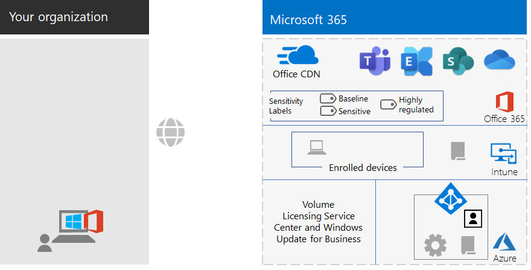

### Resultat för personalEmployee results

Efter introduktionen ska varje anställd ha följande:After their onboarding, each employee should have:

- En fungerande lokal nätverkssökväg från sin enhet till Microsoft 365-molntjänsterna i respektive region.A performant, on-premises network path from their device to the Microsoft 365 cloud services in their region.
- Ett användarkonto med följande gruppmedlemskap:A user account with these group memberships:
   - LICENSEDLICENSED
   - Lämpliga AD DS- eller Azure AD-säkerhetsgrupper, som även är medlemmar i Azure AD-grupperna BASELINE, SENSITIVE och HIGHLY-REGULATED för principer för villkorsstyrd åtkomstThe appropriate AD DS or Azure AD security groups, which are also members of the BASELINE, SENSITIVE, and HIGHLY-REGULATED Azure AD groups for Conditional Access policies 
   - Lämplig arbetsgrupp, avdelning och regionala grupperThe appropriate workgroup, departmental, and regional groups
   - Grupper av känslighetsetiketter för Microsoft 365 (efter behov)Sensitivity label Microsoft 365 groups (as needed)
- En Windows 10 Enterprise-enhet som:A Windows 10 Enterprise device that:
   - är ansluten till Azure AD-klientorganisationen (endast molnet) eller till både Azure AD-klientorganisationen och AD DS-domänen (hybrid).Is joined to the Azure AD tenant (cloud-only) or to both the Azure AD tenant and your AD DS domain (hybrid).
   - uppdateras automatiskt med de senaste produkt- och säkerhetsförbättringarna för Windows 10 Enterprise.Automatically updates itself with the latest Windows 10 Enterprise product improvements and security enhancements.
   - har Microsoft 365-applikationer för företag installerat, som automatiskt uppdateras med de senaste produkt- och säkerhetsförbättringarna för Office-produkter.Has Microsoft 365 Apps for enterprise installed, which automatically updates itself with the latest Office product improvements and security enhancements.
   - är registrerad i Intune och omfattas av efterlevnads- och appskyddsprinciper för Intune-enheter.Is enrolled in Intune and subject to Intune device compliance policies and app protection policies.

## Nästa stegNext step

Distribuera dina [arbetsbelastningar och scenarier](deploy-workloads.md) så att de drar nytta av funktioner och konfigurationen i din grundläggande infrastruktur för Microsoft 365 för företag.Deploy your [workloads and scenarios](deploy-workloads.md) to take advantage of the features and configuration of your Microsoft 365 for enterprise foundation infrastructure.
