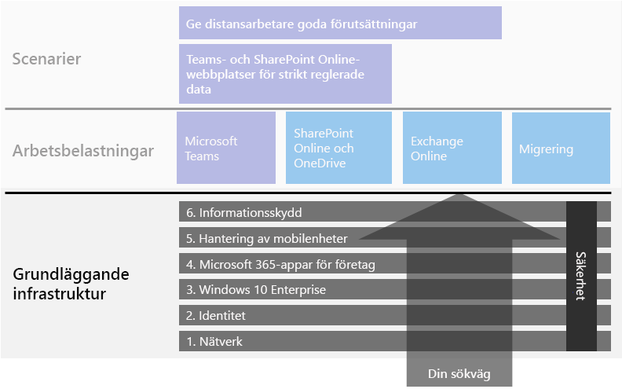
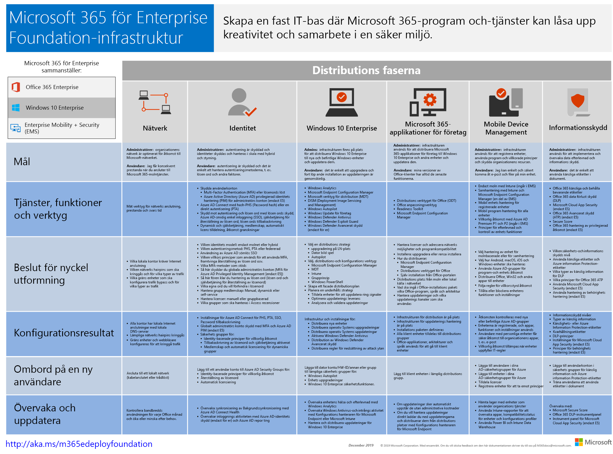

# Grundläggande infrastruktur för Microsoft 365 för företag

Om du utför distributionen från slutpunkt till slutpunkt av Microsoft 365 för företag på egen hand måste du först bygga upp en stabil grund så att program och tjänster kan främja kreativitet och samarbete i en säker miljö. Den här grunden kallas ibland för *core deployment*.

Du kan använda de här faserna när du planerar för och distribuerar en grundläggande infrastruktur för Microsoft 365 för företag:

| | Fas | Resultat |
|:-------|:-----|:-----|
||[Fas 1: Nätverk](networking-infrastructure.md)| Ditt nätverk är optimerat för åtkomst till de molnbaserade tjänsterna i Microsoft 365. |
||[Fas 2: Identitet](identity-infrastructure.md)| Dina administratörskonton är skyddade, dina användare och grupper är synkroniserade och du har en stark användarautentisering. |
||[Fas 3: Windows 10 Enterprise](windows10-infrastructure.md)| Dina befintliga Windows-baserade datorer kan uppgradera till Windows 10 Enterprise och nya enheter installeras med Windows 10 Enterprise. |
||[Fas 4: Microsoft 365-applikationer för företag](office365proplus-infrastructure.md)| Dina befintliga Microsoft Office-användare kan uppgradera till Microsoft 365-applikationer för företag. |
||[Fas 5: Hantering av mobila enheter](mobility-infrastructure.md)| Dina enheter kan registreras och hanteras. |
||[Fas 6: Informationsskydd](infoprotect-infrastructure.md)| Säkerhetsfunktionerna i Microsoft 365 är aktiverade och dina etiketter och principer är redo att skydda dokument och e-post. |

Faserna inleds med det mest grundläggande (nätverk och identitet) och sedan skapas lager med infrastrukturinställningar och grupper för att:

- Installera den senaste och säkraste versionen av Windows på dina enheter och hålla den aktuell.
- Installera den senaste versionen av Microsoft Office på dina enheter och hålla den aktuell.
- Hantera din organisations enheter och deras åtkomst till appar.
- Skydda informationen på dessa enheter och i molnet.

Du har dock flexibiliteten att konfigurera och distribuera faserna, eller stegen i faserna, på ett sätt som passar dina IT-resurser och affärsbehov.

- **Om du är en mindre eller nyare organisation** följer du stegen som krävs för att skapa din infrastruktur på ett metodiskt sätt. Om du vill ha en förenklad distribution som inte är avsedd för företag kan du klicka [här](deploy-foundation-infrastructure-non-enterprises.md).

-  **Om du representerar ett större företag eller en organisation** ska du betrakta dessa faser som lager i IT-infrastrukturen snarare än en färdig väg, och avgöra hur du på bästa sätt kan uppfylla eventuella krav för varje lager i din organisation.

I slutet av varje fas undersöker du *avslutsvillkoren* som innefattar nödvändiga villkor som du måste uppfylla och valfria villkor att överväga. Avslutsvillkoren för varje fas säkerställer att din lokala infrastruktur och molninfrastruktur samt resulterande konfiguration från slutpunkt till slutpunkt uppfyller kraven för en distribution av Microsoft 365 för företag.

I den här korta videon kan du se hur innehållet är strukturerat.

> [!VIDEO https://www.microsoft.com/videoplayer/embed/RE23VRG]

Det här är den grundläggande infrastrukturen i den övergripande distributionsguiden för Microsoft 365 för företag:

## Översikt

[Affischen som visar den grundläggande infrastrukturen för Microsoft 365 för företag](../media/deploy-foundation-infrastructure/Microsoft365EnterpriseFoundInfra.pdf) är en central plats där du kan se följande för varje fas:

- Det övergripande syftet med fasen för administratörer och användare
- Tjänsterna, funktionerna och verktygen
- Viktiga utformningsbeslut för planering
- Konfigurationsresultaten
- Processen för att registrera en ny användare
- Övervaka och uppdatera

Klicka [här](https://github.com/MicrosoftDocs/microsoft-365-docs/raw/public/microsoft-365/media/deploy-foundation-infrastructure/Microsoft365EnterpriseFoundInfra.pdf) om du vill ladda ned en kopia av affischen.

## Infrastrukturkonfiguration jämfört med användardistribution

Den grundläggande infrastrukturen består av en uppsättning konfigurerade program och tjänster. När dessa kombineras för en användare kan användaren utnyttja samtliga funktioner och skydd som Microsoft 365 för företag erbjuder. Det ultimata målet för din distribution från slutpunkt till slutpunkt är att den här infrastrukturen gäller för alla dina användare och deras Windows-baserade enheter.  

Men det är viktigt att notera att den grundläggande infrastrukturen för Microsoft 365 för företag är oberoende av distributionen av programvara och tjänster till dina användare. ***Du kan konfigurera lager i den grundläggande infrastrukturen utan att du behöver distribuera dessa lager till alla dina användare.***

Det går att konfigurera, testa och pilottesta de olika delarna i den grundläggande infrastrukturen innan de distribueras till alla användare i alla kontor, regioner eller avdelningar i organisationen.

Du skapar till exempel inställningar för:

| Fas | Resultat |
|:-------|:-----|
| Identitet | Kontosynkronisering och grupper för identitetsbaserade principer för villkorsstyrd åtkomst. |
| Windows 10 Enterprise | Grupper för att automatiskt uppgradera datorer med Windows 7 eller Windows 8.1 till Windows 10 Enterprise. |
| Microsoft 365-applikationer för företag | Grupper för att automatiskt distribuera Microsoft 365-applikationer för företag till användare med Office 2010, Office 2013 eller Office 2016. |
| Hantering av mobilenheter | Grupper för enhetsregistrering och enhetsbaserade principer för villkorsstyrd åtkomst. |
| Informationsskydd | Grupper för känslighetsetiketter. |

När du är redo att distribuera de olika delarna av infrastrukturen till användarna ska du:

| Fas | Distributionsåtgärd |
|:-------|:-----|
| Identitet | Lägga till användarkonton i grupper för identitetsbaserade principer för villkorsstyrd åtkomst. |
| Windows 10 Enterprise | Lägga till konton i grupper för att automatiskt distribuera Windows 10 Enterprise till användare med Windows 7 eller Windows 8.1. |
| Microsoft 365-applikationer för företag | Lägga till användarkonton i grupper för att automatiskt distribuera Microsoft 365-applikationer för företag till användare med Office 2010, Office 2013 eller Office 2016. |
| Hantering av mobilenheter | Lägga till konton i grupper för registrering av enheter och enhetsbaserade principer för villkorsstyrd åtkomst. |
| Informationsskydd | Lägga till användarkonton i grupper för känslighetsetiketter. |

När faserna eller delarna av den grundläggande infrastrukturen är klara, testade och pilottestade kan du distribuera installerad programvara, till exempel Windows 10 Enterprise och Microsoft 365-applikationer för företag, samt molnbaserade tjänster och skydd som enhetsregistrering och principer för villkorsstyrd åtkomst till användarna på det sätt som passar bäst för dina affärsmål och IT-resurser.

## Strategier för distribution och projektledning

Några förslag på hur du kan hantera projektledningen i olika faser av den grundläggande infrastrukturen för pilotanvändare och övriga i din organisation finns i [strategier för distribution](deployment-strategies-microsoft-365-enterprise.md).

## Distribution för andra än stora företag

Om du har ett litet företag och Microsoft 365 Business inte passar dig finns en förenklad distributionsmetod i [distribution för andra än stora företag](deploy-foundation-infrastructure-non-enterprises.md).

## Nästa steg

| Mitt aktuella läge | Vad jag behöver göra |
|:-------|:-----|
| Jag har befintlig infrastruktur för Office 365, Enterprise Mobility + Security (EMS) eller Windows 10 Enterprise | Börja med avsnittet för [distribution med en befintlig infrastruktur](deploy-with-existing-infrastructure.md) som ger en stegvis vägledning genom avslutsvillkoren för varje fas. |
| Jag representerar ett företag som börjar från grunden | Påbörja distributionen från slutpunkt till slutpunkt med [Fas 1: Nätverk](networking-infrastructure.md). |
| Jag representerar inte ett större företag och jag börjar från grunden | Påbörja distributionen från slutpunkt till slutpunkt med [Distribution för andra än stora företag](deploy-foundation-infrastructure-non-enterprises.md). |
