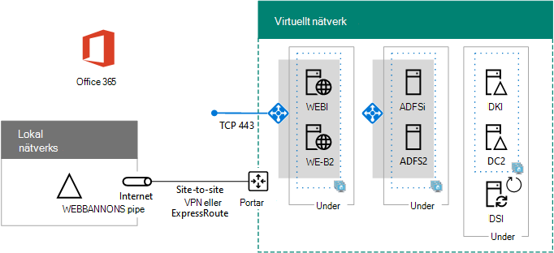

# Distribuera federerad för hög tillgänglighet för Microsoft 365 i Azure

Den här artikeln innehåller länkar till stegvisa instruktioner för hur du distribuerar federerad för extern tillgänglighet för Microsoft Microsoft 365 i Azure Infrastructure Services med de här virtuella datorerna:
  
- Två Webbprogramproxy
    
- Två AD FS-servrar (Active Directory Federation Services)
    
- Två reservdomänkontrollanter
    
- En katalogpartition med Azure AD Connect
    
Här är konfigurationen, med plats hållare för varje server.
  
**En federerad åtkomst med hög tillgänglighet för Microsoft 365-infrastrukturen i Azure**

  
Alla virtuella datorer är i ett enda interlokalt Azure-virtuellt nätverk (VNet). 
  
> [!NOTE]
> Federerad inloggningsautentisering för enskilda användare förlitar sig inte på lokala resurser. Men om den lokala anslutningen blir otillgänglig kommer domän kontrol Lanterna i VNet inte att få uppdateringar för användar konton och grupper som görs i den lokala Active Directory Domain Services (AD DS). För att säkerställa att detta inte sker kan du konfigurera hög tillgänglighet för din korslänkade förbindelse. Mer information finns i [lättillgängliga kors lokala och VNET-till-VNet-anslutningar](https://docs.microsoft.com/azure/vpn-gateway/vpn-gateway-highlyavailable)
  
Varje par med virtuella datorer för en viss roll är i dess eget undernät och tillgänglighets uppsättning.
  
> [!NOTE]
> Eftersom den här VNet är ansluten till det lokala nätverket inkluderar den här konfigurationen inte hopp eller övervaka virtuella datorer i ett hanterings nät. Mer information finns i [köra Windows-VMS för en arkitektur med bara en nivå](https://docs.microsoft.com/azure/guidance/guidance-compute-n-tier-vm). 
  
Resultatet av denna konfiguration är att du har federerad autentisering för alla dina Microsoft 365-användare, där de kan använda sina AD DS-autentiseringsuppgifter för att logga in i stället för sitt Microsoft 365-konto. Infrastrukturen för federerad gästautentisering använder en redundant uppsättning servrar som är enklare att distribuera i Azure Infrastructure-tjänster, i stället för i ditt lokala Edge-nätverk.
  
## Struktur lista

Denna bas linje konfiguration kräver följande uppsättning Azure-tjänster och-komponenter:
  
- Sju virtuella datorer
    
- Ett lokalt virtuellt nätverk med fyra undernät
    
- Fyra resurs grupper
    
- Tre tillgänglighets uppsättningar
    
- Ett Azure-abonnemang
    
Här är de virtuella datorerna och deras standard storlekar för denna konfiguration.
  
|**Objekt**|**Beskrivning av virtuell dator**|**Bild av Azure-Galleri**|**Standard storlek**|
|:-----|:-----|:-----|:-----|
|1.    |Första domänkontrollanten    |Windows Server 2016 Data Center    |D2    |
|2.    |Andra domänkontrollanten    |Windows Server 2016 Data Center    |D2    |
|3.    |Azure AD Connect-Server    |Windows Server 2016 Data Center    |D2    |
|4.    |Första AD FS server    |Windows Server 2016 Data Center    |D2    |
|5.    |Andra AD FS-servern    |Windows Server 2016 Data Center    |D2    |
|18.6.    |Första Webbprogramproxy    |Windows Server 2016 Data Center    |D2    |
|borttagning.    |Andra Webbprogramproxy    |Windows Server 2016 Data Center    |D2    |
   
Information om hur du beräknar uppskattade kostnader för denna konfiguration finns i [Azure pris kalkylatorn](https://azure.microsoft.com/pricing/calculator/)
  
## Faser i distributionen

Du distribuerar denna arbets belastning i följande faser:
  
- [Fas 1: Konfigurera Azure](high-availability-federated-authentication-phase-1-configure-azure.md). Skapa resurs grupper, lagrings konton, tillgänglighets uppsättningar och ett lokalt virtuellt nätverk.
    
- [Fas 2: Konfigurera domänkontrollanter](high-availability-federated-authentication-phase-2-configure-domain-controllers.md). Skapa och konfigurera repliker för AD DS och server för katalogpartition.
    
- [Fas 3: Konfigurera AD FS-servrar](high-availability-federated-authentication-phase-3-configure-ad-fs-servers.md). Skapa och konfigurera de två AD FS-servrarna.
    
- [Fas 4: Konfigurera Webbprogramproxy](high-availability-federated-authentication-phase-4-configure-web-application-pro.md). Skapa och konfigurera de två webbprogramproxy.
    
- [Fas 5: Konfigurera federerad auktorisering för Microsoft 365](high-availability-federated-authentication-phase-5-configure-federated-authentic.md). Konfigurera federerad auktorisering för Microsoft 365-prenumerationen.
    
De här artiklarna innehåller en rikt linje för förhands instruktioner för en fördefinierad arkitektur för att skapa en funktionell, federerad inloggningsautentisering med hög tillgänglighet för Microsoft 365 i Azure Infrastructure Services. Tänk på följande:
  
- Om du är en erfaren AD FS-implementerare kan du anpassa instruktionerna i steg 3 och 4 och bygga den uppsättning servrar som bäst passar dina behov.
    
- Om du redan har en befintlig Azure Hybrid Cloud-distribution med ett befintligt lokalt virtuellt nätverk, kan du helt enkelt anpassa eller hoppa över instruktionerna i steg 1 och 2 och placera AD FS-och Webbprogramproxy på de olika under näten.
    
För att skapa en utvecklings-eller test miljö eller en proof-of-Concept av denna konfiguration, se [federerad identitet för din Microsoft 365-miljö](federated-identity-for-your-microsoft-365-dev-test-environment.md).
  
## Nästa steg

Starta konfigureringen av denna arbets belastning med [fas 1: Konfigurera Azure](high-availability-federated-authentication-phase-1-configure-azure.md). 
  
