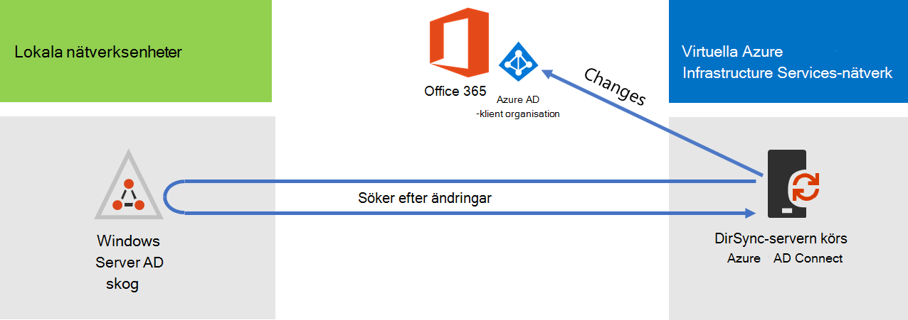
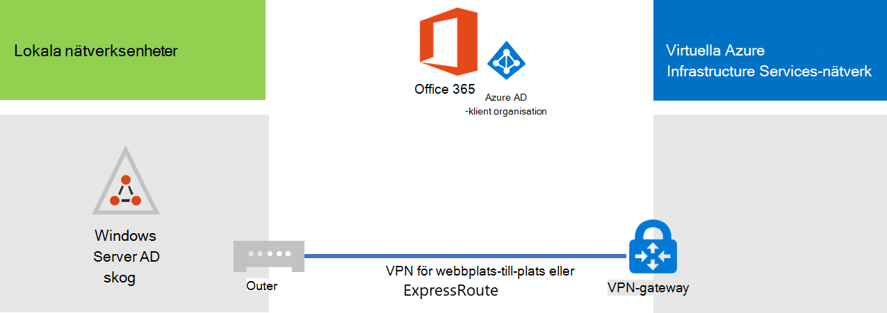
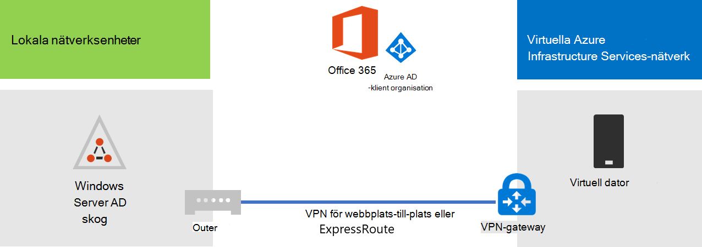
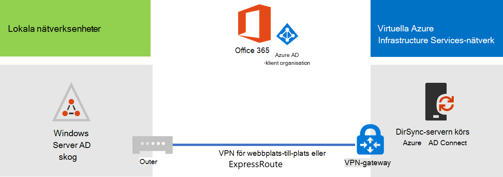

# Distribuera Microsoft 365 katalogsynkronisering i Microsoft AzureDeploy Microsoft 365 Directory Synchronization in Microsoft Azure

Azure Active Directory (Azure AD) Anslut (kallades tidigare för katalogsynkroniseringsverktyget, katalogsynkroniseringsverktyget eller DirSync.exe-verktyget) är ett program som du installerar på en domän ansluten server för att synkronisera dina lokala AD DS-användare (Active Directory Domain Services) till Azure AD-klientorganisationen för din Microsoft 365-prenumeration.Azure Active Directory (Azure AD) Connect (formerly known as the Directory Synchronization tool, Directory Sync tool, or the DirSync.exe tool) is an application that you install on a domain-joined server to synchronize your on-premises Active Directory Domain Services (AD DS) users to the Azure AD tenant of your Microsoft 365 subscription. Microsoft 365 använder Azure AD för sin katalogtjänst.Microsoft 365 uses Azure AD for its directory service. I Microsoft 365-prenumeration ingår en Azure AD-klient.Your Microsoft 365 subscription includes an Azure AD tenant. Den här klientorganisationen kan också användas för hantering av organisationens identiteter med andra molnarbetsbelastningar, inklusive andra SaaS-program och -appar i Azure.This tenant can also be used for management of your organization's identities with other cloud workloads, including other SaaS applications and apps in Azure.

Du kan installera Azure AD Anslut på en lokal server, men du kan också installera det på en virtuell dator i Azure av följande anledningar:You can install Azure AD Connect on a on-premises server, but you can also install it on a virtual machine in Azure for these reasons:
  
- Du kan tillhandahålla och konfigurera molnbaserade servrar snabbare, vilket gör tjänsterna tillgängliga för användarna snabbare.You can provision and configure cloud-based servers faster, making the services available to your users sooner.
- Azure erbjuder bättre webbplatstillgänglighet med mindre ansträngning.Azure offers better site availability with less effort.
- Du kan minska antalet lokala servrar i organisationen.You can reduce the number of on-premises servers in your organization.

Den här lösningen kräver anslutning mellan ditt lokala nätverk och ditt virtuella Azure-nätverk.This solution requires connectivity between your on-premises network and your Azure virtual network. Mer information finns i [Anslut ett lokalt nätverk till ett Microsoft Azure virtuellt nätverk.](connect-an-on-premises-network-to-a-microsoft-azure-virtual-network.md)For more information, see [Connect an on-premises network to a Microsoft Azure virtual network](connect-an-on-premises-network-to-a-microsoft-azure-virtual-network.md). 
  
> [!NOTE]
> I den här artikeln beskrivs synkronisering av en enda domän i en enda skog.This article describes synchronization of a single domain in a single forest. Azure AD Anslut synkroniserar alla AD DS-domäner i Active Directory-skogen med Microsoft 365.Azure AD Connect synchronizes all AD DS domains in your Active Directory forest with Microsoft 365. Om du har flera Active Directory-skogar att synkronisera med Microsoft 365 finns mer information i Scenariot Katalogsynkronisering [med Sign-On med flera skogar.](/azure/active-directory/hybrid/whatis-hybrid-identity)If you have multiple Active Directory forests to synchronize with Microsoft 365, see [Multi-forest Directory Sync with Single Sign-On Scenario](/azure/active-directory/hybrid/whatis-hybrid-identity). 
  
## Översikt över distribution Microsoft 365 katalogsynkronisering i AzureOverview of deploying Microsoft 365 directory synchronization in Azure

Följande diagram visar Azure AD Anslut som körs på en virtuell dator i Azure (katalogsynkroniseringsservern) som synkroniserar en lokal AD DS-skog med en Microsoft 365 prenumeration.The following diagram shows Azure AD Connect running on a virtual machine in Azure (the directory sync server) that synchronizes an on-premises AD DS forest to a Microsoft 365 subscription.
  

  
I diagrammet finns det två nätverk anslutna med VPN-anslutning mellan webbplatser eller ExpressRoute-anslutning.In the diagram, there are two networks connected by a site-to-site VPN or ExpressRoute connection. Det finns ett lokalt nätverk där AD DS-domänkontrollanter finns och det finns ett virtuellt Azure-nätverk med en katalogsynkroniseringsserver, som är en virtuell dator som kör [Azure AD Anslut.](https://www.microsoft.com/download/details.aspx?id=47594)There is an on-premises network where AD DS domain controllers are located, and there is an Azure virtual network with a directory sync server, which is a virtual machine running [Azure AD Connect](https://www.microsoft.com/download/details.aspx?id=47594). Det finns två huvudsakliga trafikflöden som kommer från katalogsynkroniseringsservern:There are two main traffic flows originating from the directory sync server:
  
-  Azure AD Anslut frågar en domänkontrollant på det lokala nätverket om ändringar av konton och lösenord.Azure AD Connect queries a domain controller on the on-premises network for changes to accounts and passwords.
-  Azure AD Anslut skickar ändringarna till konton och lösenord till Azure AD-instansen av din Microsoft 365-prenumeration.Azure AD Connect sends the changes to accounts and passwords to the Azure AD instance of your Microsoft 365 subscription. Eftersom katalogsynkroniseringsservern ligger i en utökad del av det lokala nätverket skickas ändringarna via det lokala nätverkets proxyserver.Because the directory sync server is in an extended portion of your on-premises network, these changes are sent through the on-premises network's proxy server.
    
> [!NOTE]
> I den här lösningen beskrivs synkronisering av en enda Active Directory-domän i en enda Active Directory-skog.This solution describes synchronization of a single Active Directory domain, in a single Active Directory forest. Azure AD Anslut synkroniserar alla Active Directory-domäner i Active Directory-skogen med Microsoft 365.Azure AD Connect synchronizes all Active Directory domains in your Active Directory forest with Microsoft 365. Om du har flera Active Directory-skogar att synkronisera med Microsoft 365 finns mer information i Scenariot Katalogsynkronisering [med Sign-On med flera skogar.](/azure/active-directory/hybrid/whatis-hybrid-identity)If you have multiple Active Directory forests to synchronize with Microsoft 365, see [Multi-forest Directory Sync with Single Sign-On Scenario](/azure/active-directory/hybrid/whatis-hybrid-identity). 
  
Det finns två huvudsteg när du distribuerar den här lösningen:There are two major steps when you deploy this solution:
  
1. Skapa ett virtuellt Azure-nätverk och upprätta en VPN-anslutning mellan webbplatser till ditt lokala nätverk.Create an Azure virtual network and establish a site-to-site VPN connection to your on-premises network. Mer information finns i [Anslut ett lokalt nätverk till ett Microsoft Azure virtuellt nätverk.](connect-an-on-premises-network-to-a-microsoft-azure-virtual-network.md)For more information, see [Connect an on-premises network to a Microsoft Azure virtual network](connect-an-on-premises-network-to-a-microsoft-azure-virtual-network.md).
    
2. Installera [Azure AD Anslut](https://www.microsoft.com/download/details.aspx?id=47594) på en domän ansluten virtuell dator i Azure och synkronisera sedan den lokala AD DS till Microsoft 365.Install [Azure AD Connect](https://www.microsoft.com/download/details.aspx?id=47594) on a domain-joined virtual machine in Azure, and then synchronize the on-premises AD DS to Microsoft 365. Detta omfattar:This involves:
    
    Skapa en virtuell Azure-dator för att köra Azure AD Anslut.Creating an Azure Virtual Machine to run Azure AD Connect.
    
    Installera och konfigurera [Azure AD-Anslut](https://www.microsoft.com/download/details.aspx?id=47594).Installing and configuring [Azure AD Connect](https://www.microsoft.com/download/details.aspx?id=47594).
    
    För konfiguration av Azure AD Anslut måste du ha autentiseringsuppgifter (användarnamn och lösenord) för ett Azure AD-administratörskonto och ett AD DS-företagsadministratörskonto.Configuring Azure AD Connect requires the credentials (user name and password) of an Azure AD administrator account and a AD DS enterprise administrator account. Azure AD Anslut körs direkt och kontinuerligt för att synkronisera den lokala AD DS-skogen till Microsoft 365.Azure AD Connect runs immediately and on an ongoing basis to synchronize the on-premises AD DS forest to Microsoft 365.
    
Innan du distribuerar den här lösningen i  produktionen kan du använda instruktionerna i Den simulerade företagskonfigurationen för att konfigurera den här konfigurationen som ett konceptbevis, för demonstrationer eller för experiment.Before you deploy this solution in production, you can use the instructions in [The simulated enterprise base configuration](simulated-ent-base-configuration-microsoft-365-enterprise.md) to set this configuration up as a proof of concept, for demonstrations, or for experimentation.
  
> [!IMPORTANT]
> När Azure AD Anslut-konfigurationen har slutförts sparas inte autentiseringsuppgifterna för ad ds-företagsadministratörens konto.When Azure AD Connect configuration completes, it does not save the AD DS enterprise administrator account credentials. 
  
> [!NOTE]
> I den här lösningen beskrivs synkronisering av en enda AD DS-skog till Microsoft 365.This solution describes synchronizing a single AD DS forest to Microsoft 365. Topologin som beskrivs i den här artikeln representerar bara ett sätt att implementera den här lösningen.The topology discussed in this article represents only one way to implement this solution. Organisationens topologi kan skilja sig åt beroende på dina unika nätverkskrav och säkerhetsöverväganden.Your organization's topology might differ based on your unique network requirements and security considerations. 
  
## Planera värd för en katalogsynkroniseringsserver för Microsoft 365 i AzurePlan for hosting a directory sync server for Microsoft 365 in Azure

### FörutsättningarPrerequisites

Innan du börjar granskar du följande krav för den här lösningen:Before you begin, review the following prerequisites for this solution:
  
- Granska relaterat planeringsinnehåll i [Planera ditt virtuella Azure-nätverk.](connect-an-on-premises-network-to-a-microsoft-azure-virtual-network.md#plan-your-azure-virtual-network)Review the related planning content in [Plan your Azure virtual network](connect-an-on-premises-network-to-a-microsoft-azure-virtual-network.md#plan-your-azure-virtual-network).
    
- Se till att du uppfyller [alla krav för](connect-an-on-premises-network-to-a-microsoft-azure-virtual-network.md#prerequisites) att konfigurera det virtuella Azure-nätverket.Ensure that you meet all [Prerequisites](connect-an-on-premises-network-to-a-microsoft-azure-virtual-network.md#prerequisites) for configuring the Azure virtual network.
    
- Ha en Microsoft 365-prenumeration som innehåller Active Directory-integreringsfunktionen.Have a Microsoft 365 subscription that includes the Active Directory integration feature. Mer information om Microsoft 365 prenumerationer finns på sidan [Microsoft 365 prenumeration.](https://products.office.com/compare-all-microsoft-office-products?tab=2)For information about Microsoft 365 subscriptions, go to the [Microsoft 365 subscription page](https://products.office.com/compare-all-microsoft-office-products?tab=2).
    
- Tillhandahålla en Virtuell Azure-dator som kör Azure AD Anslut för att synkronisera din lokala AD DS-skog med Microsoft 365.Provision one Azure Virtual Machine that runs Azure AD Connect to synchronize your on-premises AD DS forest with Microsoft 365.
    
    Du måste ha autentiseringsuppgifterna (namn och lösenord) för ett AD DS-företagsadministratörskonto och ett Azure AD-administratörskonto.You must have the credentials (names and passwords) for a AD DS enterprise administrator account and an Azure AD Administrator account.
    
### Antaganden om design av lösningsarkitekturSolution architecture design assumptions

I följande lista beskrivs de designval som gjorts för den här lösningen.The following list describes the design choices made for this solution.
  
- Den här lösningen använder ett enda virtuellt Azure-nätverk med en VPN-anslutning mellan webbplatser.This solution uses a single Azure virtual network with a site-to-site VPN connection. Det virtuella Azure-nätverket är värd för ett enda undernät som har en server, den katalogsynkroniseringsserver som kör Azure AD Anslut.The Azure virtual network hosts a single subnet that has one server, the directory sync server that is running Azure AD Connect. 
    
- I det lokala nätverket finns en domänkontrollant och DNS-servrar.On the on-premises network, a domain controller and DNS servers exist.
    
- Azure AD Anslut att utföra synkronisering av lösenordshashar i stället för enkel inloggning.Azure AD Connect performs password hash synchronization instead of single sign-on. Du behöver inte distribuera en AD FS-infrastruktur (Active Directory Federation Services).You do not have to deploy an Active Directory Federation Services (AD FS) infrastructure. Mer information om synkronisering av lösenordshashar och alternativ för enkel inloggning finns i Välja rätt autentiseringsmetod för din [Azure Active Directory hybrididentitetslösning.](/azure/active-directory/hybrid/choose-ad-authn)To learn more about password hash synchronization and single sign-on options, see [Choosing the right authentication method for your Azure Active Directory hybrid identity solution](/azure/active-directory/hybrid/choose-ad-authn).
    
Det finns ytterligare designalternativ som du kan tänka på när du distribuerar den här lösningen i din miljö.There are additional design choices that you might consider when you deploy this solution in your environment. Det kan till exempel vara:These include the following:
  
- Om det finns befintliga DNS-servrar i ett befintligt virtuellt Azure-nätverk ska du avgöra om du vill att katalogsynkroniseringsservern ska använda dem för namnmatchning i stället för DNS-servrar i det lokala nätverket.If there are existing DNS servers in an existing Azure virtual network, determine whether you want your directory sync server to use them for name resolution instead of DNS servers on the on-premises network.
    
- Om det finns domänkontrollanter i ett befintligt virtuellt Azure-nätverk avgör du om konfigurering av Active Directory -webbplatser och -tjänster kan vara ett bättre alternativ för dig.If there are domain controllers in an existing Azure virtual network, determine whether configuring Active Directory Sites and Services may be a better option for you. Katalogsynkroniseringsservern kan fråga domänkontrollanterna i det virtuella Azure-nätverket efter ändringar i konton och lösenord i stället för domänkontrollanter på det lokala nätverket.The directory sync server can query the domain controllers in the Azure virtual network for changes in accounts and passwords instead of domain controllers on the on-premises network.
    
## DistributionsöversiktDeployment roadmap

Distribution av Azure AD Anslut på en virtuell dator i Azure består av tre faser:Deploying Azure AD Connect on a virtual machine in Azure consists of three phases:
  
- Fas 1: Skapa och konfigurera det virtuella Azure-nätverketPhase 1: Create and configure the Azure virtual network
    
- Fas 2: Skapa och konfigurera den virtuella Azure-datornPhase 2: Create and configure the Azure virtual machine
    
- Fas 3: Installera och konfigurera Azure AD-AnslutPhase 3: Install and configure Azure AD Connect
    
Efter distributionen måste du också tilldela platser och licenser för de nya användarkontona i Microsoft 365.After deployment, you must also assign locations and licenses for the new user accounts in Microsoft 365.

### Fas 1: Skapa och konfigurera det virtuella Azure-nätverketPhase 1: Create and configure the Azure virtual network

Slutför fas 1 för att skapa och konfigurera det virtuella [Azure-nätverket:](connect-an-on-premises-network-to-a-microsoft-azure-virtual-network.md#phase-1-prepare-your-on-premises-network) Förbered ditt lokala nätverk och fas [2:](connect-an-on-premises-network-to-a-microsoft-azure-virtual-network.md#phase-2-create-the-cross-premises-virtual-network-in-azure) Skapa det virtuella korslokala nätverket i Azure i översikten över distributionen av Anslut ett lokalt nätverk till ett [virtuellt](connect-an-on-premises-network-to-a-microsoft-azure-virtual-network.md)Microsoft Azure-nätverk.To create and configure the Azure virtual network, complete [Phase 1: Prepare your on-premises network](connect-an-on-premises-network-to-a-microsoft-azure-virtual-network.md#phase-1-prepare-your-on-premises-network) and [Phase 2: Create the cross-premises virtual network in Azure](connect-an-on-premises-network-to-a-microsoft-azure-virtual-network.md#phase-2-create-the-cross-premises-virtual-network-in-azure) in the deployment roadmap of [Connect an on-premises network to a Microsoft Azure virtual network](connect-an-on-premises-network-to-a-microsoft-azure-virtual-network.md).
  
Det här är den resulterande konfigurationen.This is your resulting configuration.
  

  
På den här bilden visas ett lokalt nätverk som är anslutet till ett virtuellt Azure-nätverk via en VPN-anslutning mellan webbplatser eller ExpressRoute-anslutning.This figure shows an on-premises network connected to an Azure virtual network through a site-to-site VPN or ExpressRoute connection.
  
### Fas 2: Skapa och konfigurera den virtuella Azure-datornPhase 2: Create and configure the Azure virtual machine

Skapa den virtuella datorn i Azure med hjälp av [anvisningarna Skapa din Windows virtuella datorn i Azure-portalen](https://go.microsoft.com/fwlink/p/?LinkId=393098).Create the virtual machine in Azure using the instructions [Create your first Windows virtual machine in the Azure portal](https://go.microsoft.com/fwlink/p/?LinkId=393098). Använd följande inställningar:Use the following settings:
  
- I fönstret **Grunder** väljer du samma prenumeration, plats och resursgrupp som ditt virtuella nätverk.On the **Basics** pane, select the same subscription, location, and resource group as your virtual network. Registrera användarnamnet och lösenordet på en säker plats.Record the user name and password in a secure location. Du behöver dem senare för att ansluta till den virtuella datorn.You will need these later to connect to the virtual machine.
    
- I fönstret **Välj en storlek** väljer du **A2 Standardstorlek.**On the **Choose a size** pane, choose the **A2 Standard** size.
    
- Välj **Inställningar** standardlagringstyp i **Storage** i **fönstret** Inställningar.On the **Settings** pane, in the **Storage** section, select the **Standard** storage type. I avsnittet **Nätverk** väljer du namnet på det virtuella nätverket och undernätet för värd för katalogsynkroniseringsservern (inte GatewaySubnet).In the **Network** section, select the name of your virtual network and the subnet for hosting the directory sync server (not the GatewaySubnet). Lämna alla andra inställningar för standardvärdena.Leave all other settings at their default values.
    
Kontrollera att din katalogsynkroniseringsserver använder DNS korrekt genom att kontrollera din interna DNS för att se till att en adresspost (A) har lagts till för den virtuella datorn med dess IP-adress.Verify that your directory sync server is using DNS correctly by checking your internal DNS to make sure that an Address (A) record was added for the virtual machine with its IP address. 
  
Följ anvisningarna i Anslut den virtuella datorn och logga [in](/azure/virtual-machines/windows/connect-logon) för att ansluta till katalogsynkroniseringsservern med en Fjärrskrivbordsanslutning.Use the instructions in [Connect to the virtual machine and sign on](/azure/virtual-machines/windows/connect-logon) to connect to the directory sync server with a Remote Desktop Connection. När du har loggat in ansluter du den virtuella datorn till den lokala AD DS-domänen.After signing in, join the virtual machine to the on-premises AD DS domain.
  
För att Azure AD Anslut få åtkomst till Internetresurser måste du konfigurera katalogsynkroniseringsservern så att den använder det lokala nätverkets proxyserver.For Azure AD Connect to gain access to Internet resources, you must configure the directory sync server to use the on-premises network's proxy server. Kontakta nätverksadministratören för ytterligare konfigurationssteg.You should contact your network administrator for any additional configuration steps to perform.
  
Det här är den resulterande konfigurationen.This is your resulting configuration.
  

  
I den här bilden visas den virtuella katalogsynkroniseringsservern i det virtuella Azure-nätverket.This figure shows the directory sync server virtual machine in the cross-premises Azure virtual network.
  
### Fas 3: Installera och konfigurera Azure AD-AnslutPhase 3: Install and configure Azure AD Connect

Slutför följande procedur:Complete the following procedure:
  
1. Anslut till katalogsynkroniseringsservern med en Anslutning till fjärrskrivbord med ett AD DS-domänkonto med lokal administratörsbehörighet.Connect to the directory sync server using a Remote Desktop Connection with an AD DS domain account that has local administrator privileges. Se [Anslut till den virtuella datorn och logga in på](/azure/virtual-machines/windows/connect-logon).See [Connect to the virtual machine and sign on](/azure/virtual-machines/windows/connect-logon).
    
2. Från katalogsynkroniseringsservern öppnar du artikeln Konfigurera katalogsynkronisering för [Microsoft 365](set-up-directory-synchronization.md) och följer anvisningarna för katalogsynkronisering med synkronisering av lösenordshashar.From the directory sync server, open the [Set up directory synchronization for Microsoft 365](set-up-directory-synchronization.md) article and follow the directions for directory synchronization with password hash synchronization.
    
> [!CAUTION]
> Vid installationen **AAD_xxxxxxxxxxxx** kontot i organisationsenheten Lokala användare (OU).Setup creates the **AAD_xxxxxxxxxxxx** account in the Local Users organizational unit (OU). Flytta inte eller ta inte bort det här kontot, annars misslyckas synkroniseringen.Do not move or remove this account or synchronization will fail.
  
Det här är den resulterande konfigurationen.This is your resulting configuration.
  

  
I den här bilden visas katalogsynkroniseringsservern med Azure AD Anslut i det virtuella Azure-nätverket på plats.This figure shows the directory sync server with Azure AD Connect in the cross-premises Azure virtual network.
  
### Tilldela platser och licenser till användare i Microsoft 365Assign locations and licenses to users in Microsoft 365

Azure AD Anslut lägger till konton i Microsoft 365-prenumerationen från den lokala AD DS-tjänsten, men för att användarna ska kunna logga in på Microsoft 365 och använda tjänsterna måste kontona konfigureras med en plats och licenser.Azure AD Connect adds accounts to your Microsoft 365 subscription from the on-premises AD DS, but in order for users to sign in to Microsoft 365 and use its services, the accounts must be configured with a location and licenses. Gör så här för att lägga till platsen och aktivera licenser för lämpliga användarkonton:Use these steps to add the location and activate licenses for the appropriate user accounts:
  
1. Logga in på [Microsoft 365 och](https://admin.microsoft.com)klicka sedan på **Admin.**Sign in to the [Microsoft 365 admin center](https://admin.microsoft.com), and then click **Admin**.
    
2. Klicka på **Användare > Aktiva användare** i det vänstra navigeringsfönstret.In the left navigation, click **Users > Active users**.
    
3. Markera kryssrutan bredvid den användare du vill aktivera i listan med användarkonton.In the list of user accounts, select the check box next to the user you want to activate.
    
4. På sidan för användaren klickar du på **Redigera för** **produktlicenser.**On the page for the user, click **Edit** for **Product licenses**.
    
5. På sidan **Produktlicenser** väljer du en plats för användaren **för Plats** och aktiverar sedan lämpliga licenser för användaren.On the **Product licenses** page, select a location for the user for **Location**, and then enable the appropriate licenses for the user.
    
6. När det är klart klickar **du på** Spara och sedan på **Stäng två** gånger.When complete, click **Save**, and then click **Close** twice.
    
7. Gå tillbaka till steg 3 för ytterligare användare.Go back to step 3 for additional users.
    
## Se ävenSee also

[Microsoft 365-lösning och arkitekturcenterMicrosoft 365 solution and architecture center](../solutions/index.yml)
  
[Anslut ett lokalt nätverk till ett virtuellt Microsoft Azure nätverkConnect an on-premises network to a Microsoft Azure virtual network](connect-an-on-premises-network-to-a-microsoft-azure-virtual-network.md)

[Ladda ned Azure AD-AnslutDownload Azure AD Connect](https://www.microsoft.com/download/details.aspx?id=47594)
  
[Konfigurera katalogsynkronisering för Microsoft 365Set up directory synchronization for Microsoft 365](set-up-directory-synchronization.md)
