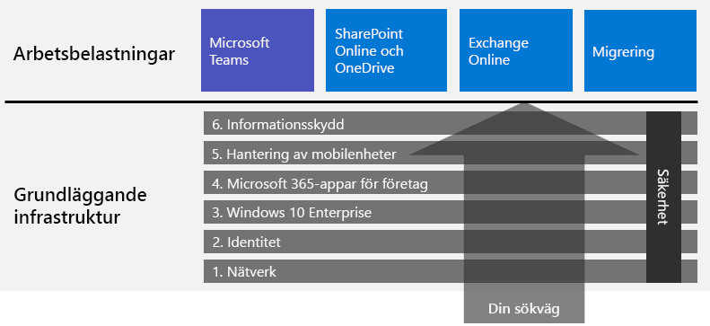

# Distribuera Microsoft 365 för företagDeploy Microsoft 365 for enterprise

Microsoft 365 för företag är en kombination av lokala och molnbaserade produktivitetsprogram och tjänster med Windows 10 Enterprise som:Microsoft 365 for enterprise is a combination of local and cloud-based productivity apps and services with Windows 10 Enterprise that:  

- Innehåller intelligent säkerhet.Has intelligent security.
- Är integrerat för enkelhet.Is integrated for simplicity.
- Frigör kreativitet.Unlocks creativity.
- Är utvecklat för samarbete.Is built for teamwork.

Du upptäcker fördelarna när du distribuerar infrastruktur och produktivitetsarbetsbelastningar på ett integrerat sätt, med moderna säkerhetstjänster och funktioner.You can realize these benefits by deploying the infrastructure and productivity workloads in an integrated way that includes state-of-the-art security services and features.

Det finns tre huvudsakliga metoder för distribution av Microsoft 365 för företag:There are three main ways to deploy Microsoft 365 for enterprise:

- Samarbeta med Microsofts tekniker genom att använda [FastTrack för Microsoft 365](#fasttrack-for-microsoft-365).Do it with Microsoft engineers using [FastTrack for Microsoft 365](#fasttrack-for-microsoft-365).
- Samarbeta med Microsoft Consulting Services eller en [Microsoft-partner](https://partner.microsoft.com/).Do it with help from Microsoft Consulting Services or a [Microsoft partner](https://partner.microsoft.com/).
- Gör det själv med hjälp av [distributionsguiden till Microsoft 365 för företag](#microsoft-365-for-enterprise-deployment-guide).Do it yourself with the [Microsoft 365 for enterprise deployment guide](#microsoft-365-for-enterprise-deployment-guide).

## FastTrack för Microsoft 365FastTrack for Microsoft 365

FastTrack är en pågående och upprepningsbar funktion – *tillgänglig kostnadsfritt som en del av din prenumeration* – som Microsofts tekniker använder när de hjälper dig att gå över till molnet i din egen takt.FastTrack is an ongoing and repeatable benefit—*available for free as part of your subscription*—that is delivered by Microsoft engineers to help you move to the cloud at your own pace. FastTrack ger dig även tillgång till kvalificerade partners för ytterligare tjänster.FastTrack also gives you access to qualified partners for additional services. Med sina just nu drygt 40 000 kunder kan FastTrack maximera ROI, påskynda distributionen och öka införandet i hela organisationen.With over 40,000 customers enabled to date, FastTrack helps maximize ROI, accelerate deployment, and increase adoption across your organization. Se [FastTrack för Microsoft 365](https://fasttrack.microsoft.com/microsoft365).See [FastTrack for Microsoft 365](https://fasttrack.microsoft.com/microsoft365).

Om du vill använda FastTrack när du distribuerar Microsoft 365 för företag, kan du använda FastTracks [distributionsguide för Microsoft 365](https://aka.ms/microsoft365setupguide). Där finns vägledning om hur du distribuerar och konfigurerar den grundläggande infrastrukturen.If you want to take advantage of FastTrack to deploy Microsoft 365 for enterprise, you can use the FastTrack [Microsoft 365 deployment advisor](https://aka.ms/microsoft365setupguide) for guidance on how to deploy and set up your foundation infrastructure. Du måste vara inloggad som global administratör i en Office 365- eller Microsoft 365-klientorganisation för att kunna öppna sidan.You must be signed in as a global administrator in an Office 365 or Microsoft 365 tenant to access this page.

Påbörja distributionen från slutpunkt till slutpunkt med FastTrack [här](https://fasttrack.microsoft.com/microsoft365).Get started on your end-to-end deployment journey with FastTrack [here](https://fasttrack.microsoft.com/microsoft365).

## Distributionsguide till Microsoft 365 för företagMicrosoft 365 for enterprise deployment guide

I distributionsguiden till Microsoft 365 för företag finns information om hur du konfigurerar produkter och funktioner i Microsoft 365 för företag.The Microsoft 365 for enterprise deployment guide steps you through the correct and required configuration of Microsoft 365 for enterprise products and features.

Om du vill distribuera Microsoft 365 för företag själv, kan du:To deploy Microsoft 365 for enterprise yourself, you can:

- Distribuera [den grundläggande infrastrukturen](deploy-foundation-infrastructure.md) för inbyggd säkerhet och integrering med enklare hantering, vilket gör det lättare att se till att klientprogramvaran uppdateras med de senaste förbättringarna inom produktivitet och säkerhet.Deploy the [foundation infrastructure](deploy-foundation-infrastructure.md) for built-in security and integration for simplified management, which makes it easier to ensure your client software is updated with the latest productivity and security enhancements. 
 
  Den grundläggande infrastrukturen består av en serie numrerade faser som bygger på varandra och som är anpassade för en miljö med stöd för arbetsbelastningar och scenarier i Microsoft 365 för företag.The foundation infrastructure is organized as a series of numbered phases that build upon each other and towards an environment that supports Microsoft 365 for enterprise workloads and scenarios. 

  **Om du har en mindre eller nyare organisation** följer du faserna för att skapa din infrastruktur på ett metodiskt sätt.**If you are a smaller or newer organization**, follow the phases in order to methodically build out your infrastructure.

  Du kan dock distribuera faser eller delar av faser i den här infrastrukturen i valfri ordning, [efter varandra eller parallellt](deployment-strategies-microsoft-365-enterprise.md), för att integrera dem med din befintliga infrastruktur, anpassa efter dina IT-abonnemang och resurser, eller uppfylla dina affärsbehov.However, you can deploy phases or the portions of phases of this infrastructure in any order as needed, [one after the other or in parallel](deployment-strategies-microsoft-365-enterprise.md), to integrate with your current infrastructure, fit your IT plans and resources, and meet your business needs. Om du vill ha en förenklad distribution som inte är avsedd för företag, kan du klicka [här](deploy-foundation-infrastructure-non-enterprises.md).For a simplified deployment for non-enterprises, click [here](deploy-foundation-infrastructure-non-enterprises.md).

  **Om du har ett större företag eller organisation** ska dessa faser betraktas som lager i IT-infrastrukturen i stället för en fastställd metod. Du avgör själv hur du på bästa sätt kan följa eventuella krav för varje lager i din organisation.**If you are an enterprise organization**, view the phases as layers of IT infrastructure, rather than a defined path, and determine how to best work toward eventual adherence to the requirements of each layer across your organization.

- Distribuera [arbetsbelastningar och scenarier](deploy-workloads.md) för nyckelproduktivitet överst i infrastrukturen.Deploy key productivity [workloads and scenarios](deploy-workloads.md) on top of your infrastructure. Dessa frigör kreativitet och samarbete i organisationen.These unlock creativity and teamwork in your organization.

Här visas förhållandet mellan den grundläggande infrastrukturen, arbetsbelastningar och scenarier.Here's the relationship between the foundation infrastructure and the workloads and scenarios.

Arbetsbelastningar och scenarier ligger högst upp i den grundläggande infrastrukturen.Workloads and scenarios operate over the top of the foundation infrastructure. Men alla faser i den grundläggande infrastrukturen behöver inte finnas på plats för att du ska kunna börja använda arbetsbelastningar för produktivitet och samarbete.However, you do not have to have all of the foundation infrastructure phases built out to begin using workloads for productivity and collaboration.

Påbörja distributionen själv från slutpunkt till slutpunkt [här](deploy-foundation-infrastructure.md).Get self-started on your end-to-end deployment journey [here](deploy-foundation-infrastructure.md).

## Ta en provturTake a test drive

”*Intelligens består inte bara av kunskap, utan även av förmågan att utöva kunskap i praktiken.*”“*For the things we have to learn before we can do them, we learn by doing them.*” - Aristoteles- Aristotle

Om du inte har använt Microsoft 365 för företag eller en särskild produkt eller funktion tidigare, är ett av de bästa sätten att lära sig på att använda det själv och se hur det fungerar.If you're new to Microsoft 365 for enterprise or to a specific product or feature, one of the best ways to gain understanding is to build it out yourself and see it working.

Vi har gjort det enklare med testlabbguider, som vägleder dig genom konfigurationen av infrastrukturen eller en funktion i en förenklad och men representativ testmiljö, där du använder utvärderingsversioner eller betalda prenumerationer.We've made this easier with Test Lab Guides (TLGs), which step you through the configuration of infrastructure or a feature in a simplified but representative test environment using trial or paid subscriptions.

Med testlabbguiderna kan du på egen hand lära dig mer, utforma, anpassa eller skapa ett koncepttest av en komplex konfiguration, arbetsbelastning eller ett scenario från slutpunkt till slutpunkt.With TLGs, you can self-learn, demonstrate, customize, or build a proof of concept (PoC) of a complex configuration, workload, or end-to-end scenario.

Mer information finns i [Testlabbguider till Microsoft 365 för företag](m365-enterprise-test-lab-guides.md).For more information, see [Microsoft 365 for enterprise Test Lab Guides](m365-enterprise-test-lab-guides.md).

## En övergång för hela organisationenTransition your entire organization

Om du vill få en bättre bild av hur du flyttar hela organisationen till produkter och tjänster i Microsoft 365 för företag, kan du läsa affischen [Överför din organisation till Microsoft 365](../media/deploy-microsoft-365-enterprise/transition-org-to-m365.pdf).To get a better picture of how to move your entire organization to the products and services in Microsoft 365 for enterprise, see the [Transition Your Organization to Microsoft 365](../media/deploy-microsoft-365-enterprise/transition-org-to-m365.pdf) poster.

Med den här affischen på två sidor kan du snabbt inventera din befintliga infrastruktur och få vägledning i hur du flyttar till motsvarande produkt eller tjänst i Microsoft 365 för företag.This two-page poster is a quick way to inventory your existing infrastructure and get to the guidance for moving to the corresponding product or service in Microsoft 365 for enterprise. Den innehåller Windows- och Office-produkter samt andra infrastruktur- och säkerhetselement, som exempelvis enhetshantering, identitet, information och skydd mot hot.It includes Windows and Office products and other infrastructure and security elements such as device management, identity, and information and threat protection.

Du kan också [ladda ner övergångsaffischen](https://github.com/MicrosoftDocs/microsoft-365-docs/raw/public/microsoft-365/media/deploy-microsoft-365-enterprise/transition-org-to-m365.pdf) och skriva ut den i formaten Letter, Legal och Tabloid (11 x 17).You can also [download the transition poster](https://github.com/MicrosoftDocs/microsoft-365-docs/raw/public/microsoft-365/media/deploy-microsoft-365-enterprise/transition-org-to-m365.pdf) and print it in letter, legal, or tabloid (11 x 17) formats.

## Hur har andra gjort?How did others do it?

Använd de här resurserna för att se hur andra har distribuerat och använder Microsoft 365 för företag.Use these resources to understand how others have deployed and are using Microsoft 365 for enterprise.

### Hur kunderna använder Microsoft 365 för företagHow customers use Microsoft 365 for enterprise

Gå till webbplatsen Kundberättelser för att se hur Microsofts kunder använder Microsoft 365 för företag.Use the Customer Stories site to see how Microsoft customers are using Microsoft 365 for enterprise.

1. Gå till [https://customers.microsoft.com/](https://customers.microsoft.com/) och klicka på **Sök**.Go to [https://customers.microsoft.com/](https://customers.microsoft.com/) and click **Search**.
2. I det vänstra fönstret väljer du önskat språk i **Språk**.In the left pane, select your language in **Language**.
3. Välj organisationens bransch i **Bransch**.Select your organization's industry in **Industry**.
4. Välj **Microsoft 365** i **Produkt**.Select **Microsoft 365** in **Product**.
5. Klicka på ett kort för att läsa om kunden.Click on a card for the customer's case study.

### Hur Microsoft använder Microsoft 365 för företagHow Microsoft uses Microsoft 365 for enterprise

Att definiera en digital kultur är en viktig prioritering för alla ledare som strävar efter att skapa en modern arbetsplats.Defining a digital culture is a major priority for every leader who strives to foster a modern workplace. Microsoft 365 har tagits fram för att stödja den här typen av kulturellt skifte och för att göra det lättare för alla att frigöra kreativitet och samarbete.Microsoft 365 was designed to support this kind of cultural shift helping leaders empower everyone at their companies to unleash creativity and collaboration. Microsofts grundläggande infrastruktur främjar exakt den här typen av digitala kulturskiften.Establishing Microsoft's foundational infrastructure has sparked precisely this kind of digital culture shift. Genom att implementera Microsoft 365 för företag kan vi använda samarbetsteknik, t.ex. Microsoft Teams och Exchange Online, och dela känsliga data online på säkra intranätplatser från SharePoint.Implementing Microsoft 365 for enterprise has allowed us to deploy collaboration technology, like Microsoft Teams and Exchange Online, and to share sensitive data online across secure SharePoint intranet sites.

Samtidigt hjälper smarta säkerhetsfunktioner och produktintegreringen till med att effektivisera hanteringsbehoven och minimera den totala ägandekostnaden i IT-livscykeln.At the same time, intelligent security features and product integration helps streamline management needs and minimize the total cost of ownership across the IT lifecycle. 

Services hur Core Services Engineering and Operations (tidigare Microsoft IT) har [skapat en modern arbetsplats med Microsoft 365](https://www.microsoft.com/en-us/itshowcase/microsoft-365).Learn how Core Services Engineering and Operations (formerly Microsoft IT) has [built a modern workplace with Microsoft 365](https://www.microsoft.com/en-us/itshowcase/microsoft-365).

> [!Note]
> Den här webbsidan är endast tillgänglig på engelska.This web page is only available in English.

### Hur Contoso Corporation distribuerade Microsoft 365 för företagHow the Contoso Corporation deployed Microsoft 365 for enterprise

Contoso Corporation är en fiktiv och representativ global tillverkningskoncern med huvudkontor i Paris, Frankrike.The Contoso Corporation is a fictional but representative global manufacturing conglomerate with its headquarters in Paris, France. Se hur [Contoso har distribuerat Microsoft 365 för företag](contoso-case-study.md), fattat stora designbeslut och tagit fram implementeringsinformation för nätverk, identitet, Windows 10 Enterprise, Microsoft 365 Apps för företag, hantering av mobila enheter, informationsskydd och säkerhet.See how [Contoso deployed Microsoft 365 for enterprise](contoso-case-study.md) and addressed major design decisions and implementation details for networking, identity, Windows 10 Enterprise, Microsoft 365 Apps for enterprise, mobile device management, information protection, and security. 

## Aktuellt distributionsinnehållStay current with deployment content

De senaste ändringarna i innehållet finns i [den här artikeln](microsoft-365-deploment-guide-changes.md).For the latest changes in content, see [this article](microsoft-365-deploment-guide-changes.md).

## Nästa stegNext step

Använd [FastTrack](https://fasttrack.microsoft.com/microsoft365) om du vill ha hjälp direkt från Microsoft.To do it with direct Microsoft assistance, use [FastTrack](https://fasttrack.microsoft.com/microsoft365).

Om du vill använda en konsult, kontaktar du Microsoft Consulting Services eller en [Microsoft-partner](https://partner.microsoft.com/).To do it with a consultant, contact Microsoft Consulting Services or a [Microsoft partner](https://partner.microsoft.com/).

Om du vill göra det själv kan du läsa om [den grundläggande infrastrukturen](deploy-foundation-infrastructure.md).To get started doing it yourself, see the [foundation infrastructure](deploy-foundation-infrastructure.md).
