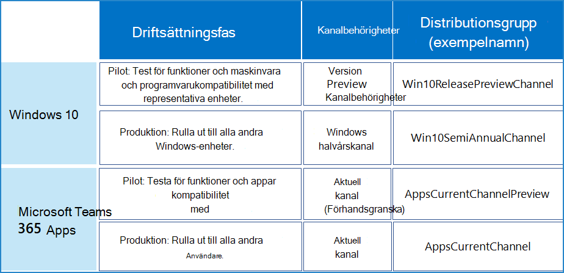

# Exempel på en bred distribution för de senaste versionernaExample of broad deployment for the latest releases

Detta konfigurations exempel för kanaler är för en organisation som använder snabb distribution av de senaste versionerna för att få plats med dessa affärs prioriteringar:This channel configuration example is for an organization that uses rapid deployment of the latest releases to fit these business priorities:

- Säkerställ företags kontinuitet med Microsoft-program och-tjänster.Ensure business continuity with Microsoft apps and services.
- Maximera enhets-, tjänst-och data säkerheten med de senaste funktionerna och korrigeringarna från Microsoft.Maximize device, service, and data security with the latest features and fixes from Microsoft.
- Maximera användarproduktiviteten med de senaste funktionerna från Microsoft.Maximize user productivity with the latest features from Microsoft.

Syftet är att översätta till IT-aktiviteten för att hitta saldot mellan snabb distribution av produktion och tidiga vetting med en representativ del uppsättning användare och enheter att validera i funktion före bred distribution.These goals translate to the IT task of finding the balance between rapid production deployment and early vetting with a representative subset of users and devices to validate functionally before broad deployment.

Våra exempel organisationer har 5 000 anställda i byggnader i världen i Europa, Afrika, Asien och Amerika.Our example organization has 5,000 employees in buildings across the world in Europe, Africa, Asia, and the Americas. 70% av medarbetarna använder Microsoft 365 E3 och resten av organisationen använder Microsoft 365 E5.70% of the employees use Microsoft 365 E3 and the rest of the organization uses Microsoft 365 E5.

>[!Note]
>I det här exemplet ser du hur du kan använda distributions faser och-grupper, som kan användas i organisationer med många olika typer och storlekar.This example is designed to show you how you can use deployment stages and groups, which can work for organizations of many types and sizes.
>

Organisationens IT-infrastruktur:This organization's IT infrastructure: 

- Är i stort sett homogent, med Windows, Microsoft 365-appar och Microsofts moln tjänster som innehåller 60% av den installerade bas versionen.Is largely homogeneous, with Windows, Microsoft 365 Apps, and Microsoft cloud services comprising 60% of the installed base. Några äldre system finns kvar efter en intensiv arbetskraft för att förenkla och strömlinjeforma IT-infrastrukturen.A few legacy systems remain after an intensive, multi-year effort to simplify and streamline the IT infrastructure.
- Upprätthålls av en mycket erfaren anställd och med uppgifter som gör att användarna kan vara produktiva och säkra med att följa Microsofts bly i sina versioner.Is maintained by highly experienced staff and tasked with keeping users and their devices productive and secure by following Microsoft’s lead in their releases.

## Steg för distribution och uppdateringDeployment and update stages

I det här exemplet använder vi en distributions process i två steg baserat på snabba distributions mål för den senaste versionen.Based on rapid deployment goals of the latest release, this example organization uses a two-step deployment process.

1. **Använda en förhands granskning eller distribution av pilotprojekt:** validera och iterera med tidiga efterföljare, IT-personal, användare med representativa konfigurationer och utbildnings personal.**Use a preview or pilot deployment:** Validate and iterate with early adopters, IT staff, users with representative configurations, and training staff. 

   Tidiga medarbetare, IT-personal och användare med representativa konfigurationer, kan validera funktioner med andra program och på enheter innan de nya funktionerna distribueras till resten av organisationen.The early adopters, IT staff, users with representative configurations can validate functionality with other apps and on devices before the new features roll out to the rest of the organization.

   Ändra chefer har tidig till gång till nya funktioner före omfattande lansering och kan planera meddelande hantering och lansering.Change managers have an early peek at the new features before widespread rollout and can plan messaging and rollout.

   Utbildnings personal kan planera nya interna kurser eller uppdatera befintliga kurser för nya funktioner före omfattande lansering.Training staff can plan new internal courses or update existing courses for the new features before widespread rollout.

2. **Produktions distribution:** ut för alla återstående användare efter region, avdelning eller annan distributions metod.**Production deployment:** Roll out to all remaining users by region, department, or other deployment method.

## Distributions konfiguration för Windows 10Deployment configuration for Windows 10

Det övergripande målet är att göra en bred distribution av den senaste halvårs fri lanseringen efter validering av frisläppnings kanaler för förhands granskning av en grupp representativa användare och deras enheter.The overall goal is to perform a broad deployment of the latest Semi-Annual Channel release after validation of Release Preview Channel changes by a group of representative users and their devices.

Mer information om distributions metoder och strategier för Windows 10 finns i [distribution av Windows 10](https://docs.microsoft.com/windows/deployment/).See [Windows 10 deployment](https://docs.microsoft.com/windows/deployment/) for more information on Windows 10 deployment methods and strategies.

| FasStage | KanalChannel | Distributions gruppDeployment group |
|:-------|:-------|:-----|
| PilotPilot |  **Frisläpp för hands version****Release Preview Channel**  <ul><li>Syfte: distribution av funktions uppdateringar för IT-personal och tidiga inför verifiering för representativa enheter och konfigurationer (språk, program från 3:e part).Purpose: Deployment of feature updates to IT staff and early adopters for validation on representative devices and configurations (languages, 3rd party apps). </li><li> Län: är helt kompatibla med och stöds inte för kommersiella kunder och det räknas inte mot dina support avtal.State: Fully compliant and supported for commercial customers and it does not count against your support agreements. </li></ul> | **Win10ReleasePreviewChannel** (exempel namn)**Win10ReleasePreviewChannel** (example name)    Medlemmar är grupper som innehåller:Members are groups containing: <ul><li> Windows-entusiaster på olika avdelningar och platserWindows enthusiasts across departments and locations </li><li> Personal med konfigurationer som behöver verifierasStaff with configurations that need validation </li><li> IT-administratörer och IT-personalIT admins and IT deployment staff </li><li> Ändra cheferChange managers </li><li> Intern utbildnings personalInternal training staff </li></ul> |
| ProduktionProduction |  **Halvårskanal****Semi-Annual Channel**  <ul><li>Syfte: omfattande distribution av de senaste funktions uppdateringarna till resten av organisationen.Purpose: Broad deployment of the latest feature updates to the rest of the organization. </li><li> State: fullständigt kompatibla och stöds.State: Fully compliant and supported. </li></ul> | **Win10SemiAnnualChannel** (exempel namn)**Win10SemiAnnualChannel** (example name)    Medlemmar är alla användare som inte finns i gruppen Win10ReleasePreviewChannel.Members are all users that are not in the Win10ReleasePreviewChannel group. |
||||

Med den här organisationens bästa metod för distribution av versionen av för hands versionen av för hands versionen av kanaler på samma sätt som de använder halvårs kanal släpningar, t. ex. Windows Update eller Windows Server Update Services, och att de tillämpar samma principer för uppdateringar av båda kanalerna.This organization uses the best practice of deploying the Release Preview Channel payload in the same way as they deploy Semi-Annual Channel releases, such as Windows Update or Windows Server Update Services, and that they apply the same policies for both channel updates.

Pågående uppdaterings processen:Ongoing updates process:

1. Släpp förhands gransknings kanal ändringarna distribueras till distributions gruppen Win10ReleasePreviewChannel (exempel namn).Release Preview Channel changes are deployed to the Win10ReleasePreviewChannel (example name) deployment group.
2. Medlemmar i Win10ReleasePreviewChannel-gruppen bekräftar att de släppta ändringarna för förhands granskning av kanaler fungerar för IT-personal. vem som kan ge feedback till Microsoft och vänta på nästa version av Preview-kanalen ändras för ytterligare verifiering.Win10ReleasePreviewChannel group members confirm that Release Preview Channel changes are working to IT deployment staff, who can provide feedback to Microsoft and wait for the next Release Preview Channel changes for additional validation.
3. Halvårs byten för kanal funktioner distribueras till distributions gruppen Win10SemiAnnualChannel.Semi-Annual Channel feature changes are deployed to the Win10SemiAnnualChannel deployment group. 

>[!Note]
>Även om den årliga kanalen är den rekommenderade kanalen bör IT-avdelningen använda sina hanterings verktyg och bestämma när den senaste halvårs versionen av kanalen ska distribueras i organisationen och sedan sammanställa den i vågor.While the Semi-Annual Channel is the recommended channel, your IT department should utilize their management tools and determine when to deploy the latest Semi-Annual Channel release within their organization and then roll it out in waves.
>

## Distributions konfiguration för Microsoft 365-apparDeployment configuration for Microsoft 365 Apps

Det övergripande målet är att utföra en bred distribution av den senaste aktuella kanal versionen när du har verifierat den aktuella kanalen (för hands version).The overall goal is to perform a broad deployment of the latest Current Channel release after validation of Current Channel (Preview) changes by a group of representative users.

Se [distribution av Microsoft 365-appar](https://docs.microsoft.com/deployoffice/plan-office-365-proplus) mer information om distributions metoder och strategier för Microsoft 365-appar.See [Microsoft 365 Apps deployment](https://docs.microsoft.com/deployoffice/plan-office-365-proplus) for more information on Microsoft 365 Apps deployment methods and strategies.

| FasStage | KanalChannel | Distributions gruppDeployment group |
|:-------|:-------|:-----|
| PilotPilot |  **Aktuell kanal (förhandsversion)****Current Channel (Preview)** <ul><li> Syfte: {ge en grupp representativa användare en titt på de nya Microsoft 365 Apps-apparna} distribution av funktions uppdateringar så snart de har testats med aktuell kanal (för hands version) och är Product Ready.Purpose: {give a group of representative users a sneak peek of new Microsoft 365 Apps features} Deployment of feature updates as soon as they are tested with Current Channel (Preview) users and are production-ready. </li><li> State: fullständigt kompatibla och stöds.State: Fully compliant and supported.</li><li> Hur ofta: uppdaterar 2-3 gånger per månad.How often: Updates 2-3 times each month. </li></ul> | **AppsCurrentChannelPreview** (exempel namn)**AppsCurrentChannelPreview** (example name)    Medlemmar är grupper som innehåller:Members are groups containing: <ul><li> Office-appar entusiaster över avdelningar och platserOffice apps enthusiasts across departments and locations </li><li> Personal med konfigurationer som behöver verifierasStaff with configurations that need validation </li><li> IT-administratörer och IT-personalIT admins and IT deployment staff </li><li> Ändra cheferChange managers </li><li> Intern utbildnings personalInternal training staff </li></ul>|
| ProduktionProduction | **Aktuell kanal****Current Channel** <ul><li> Syfte: omfattande distribution av de senaste funktions uppdateringarna till resten av organisationen.Purpose: Broad deployment of the latest feature updates to the rest of the organization. </li><li> State: fullständigt kompatibla och stöds.State: Fully compliant and supported. </li></ul> |  **AppsCurrentChannel** (exempel namn)**AppsCurrentChannel** (example name)    Medlemmar är alla användare som inte finns i gruppen AppsCurrentChannelPreview.Members are all users that are not in the AppsCurrentChannelPreview group. |
|||

Pågående uppdaterings processen:Ongoing updates process:

1. Aktuell kanal (förhandsversion) distribueras till distributions gruppen AppsCurrentChannelPreview.Current Channel (Preview) changes are deployed to the AppsCurrentChannelPreview deployment group.
2. Medlemmar i AppsCurrentChannelPreview-gruppen bekräftar att aktuell kanal (förhandsversion) fungerar för IT-personal, som kan ge feedback till Microsoft och vänta på nästa aktuella kanal (förhandsversion) för ytterligare verifiering.AppsCurrentChannelPreview group members confirm that Current Channel (Preview) changes are working to IT deployment staff, who can provide feedback to Microsoft and wait for the next Current Channel (Preview) release for additional validation.
3. Aktuella kanal ändringar distribueras till distributions gruppen AppsCurrentChannel.Current Channel changes are deployed to the AppsCurrentChannel deployment group. 

## Visuell sammanfattningVisual summary

Här är de produkter, deras kanaler, och de distributions grupper som används i den här exempel organisationen.Here are the products, their channels, and the deployment groups used by this example organization. 

## Se ävenSee also

[Distribution och uppdatering av kanalkonfigurationerDeployment and update channel example configurations](deploy-update-channels-examples.md)

[DistributionsguideDeployment guide](deploy-microsoft-365-enterprise.md)

[TestlabbguiderTest lab guides](m365-enterprise-test-lab-guides.md)
