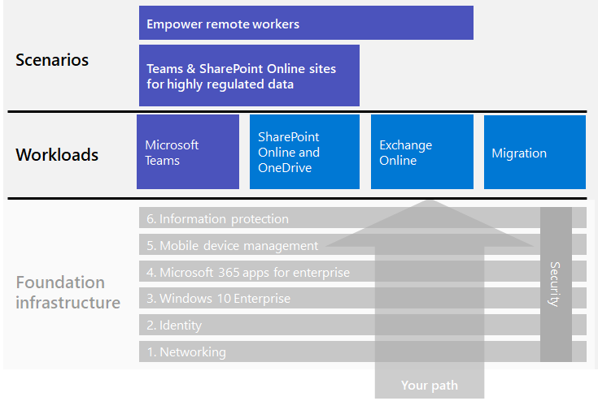

# Arbetsbelastningar och scenarier i Microsoft 365 för företag

För att få fördelarna med kreativitet och samarbete i Microsoft 365 för företag distribuerar du dessa arbetsbelastningar i den grundläggande infrastrukturen:

- [Microsoft Teams](teams-workload.md)
- [Exchange Online](exchangeonline-workload.md)
- [SharePoint och OneDrive](sharepoint-online-onedrive-workload.md)

En allmän översikt över hur du migrerar hela organisationen till Microsoft 365 för företag finns i artikeln om [migrering](migration-microsoft-365-enterprise-workload.md), som inkluderar Microsoft Office-klientprodukter, lokala Office-serverprodukter och Microsoft Windows-baserade enheter.

I scenarierna används funktioner och tjänster från hela Microsoft 365 för företag på ett integrerat sätt för att lösa ett företagsbehov. 

Ett sådant behov är att se till att dina anställda kan arbeta produktivt och säkert när de inte är direktanslutna till intranätet. Mer information om hur du distribuerar infrastrukturelementen och får fart på fjärranvändning för viktiga arbetsbelastningar, t.ex. Teams och Exchange Online, finns i scenariot [Ge distansarbetare goda förutsättningar](empower-people-to-work-remotely.md).

Ett annat sådant behov är att skydda strikt reglerade data som lagrats i Microsoft 365. I strikt reglerade data ingår digitala tillgångar som:

- Lyder under regionala bestämmelser.
- Är de mest värdefulla data för din organisation, t.ex. affärshemligheter, ekonomisk information och personalinformation samt organisationens strategi.

Information om hur du skyddar dessa data från interna och externa hot finns i:

- [Teams för strikt reglerade data](secure-teams-highly-regulated-data-scenario.md)
- [SharePoint-webbplatser för strikt reglerade data](teams-sharepoint-online-sites-highly-regulated-data.md). 

De här scenarierna hjälper dig att konfigurera ett Microsoft Teams-team eller en SharePoint-webbplats där du på ett säkert sätt kan lagra dina mest värdefulla data.

Det här är arbetsbelastningarna och scenarierna i den övergripande distributionsguiden för Microsoft 365 för företag:

Fler scenarier finns i [Microsoft 365 Produktivitetsbibliotek](https://aka.ms/productivitylibrary) (https://aka.ms/productivitylibrary)). 

## Förutsättningar för grundläggande infrastruktur

*Helst* bör du distribuera arbetsbelastningar och scenarier efter att du har konfigurerat alla faser för den [grundläggande infrastrukturen](deploy-foundation-infrastructure.md). Det säkerställer att alla underliggande grundlager finns på plats för att användarna och deras enheter ska få integrering, säkerhet och bästa möjliga upplevelse.

| Fas | Resultat |
|:-------|:-----|
| Nätverk | Nätverket är uppdaterat för optimal prestanda för Microsoft 365-molntjänster. |
| Identitet | Identiteten är synkroniserad och skyddad med stark autentisering för användarkonton och skydd för administratörskonton. |
| Windows 10 Enterprise | Dina datorer med Windows 7 eller Windows 8.1 kan uppgradera till Windows 10 Enterprise och nya enheter installeras med Windows 10 Enterprise. |
|  Microsoft 365 Apps för företag | Dina befintliga Microsoft Office-användare kan uppgradera till Microsoft 365 Apps för företag. |
| Hantering av mobilenheter | Dina enheter kan registreras och hanteras. |
| Informationsskydd | Funktioner för informationsskydd i Microsoft 365 konfigureras och känslighetsetiketterna eller Azure Information Protection-etiketterna kan användas för att skydda dokument och e-post. |

Kom ihåg att det här är optimalt och kan ta tid att planera, konfigurera, testa och sköta, särskilt i stora organisationer med befintlig infrastruktur och flera platser. Det är inte nödvändigt att slutföra alla dessa faser på alla platser för att snabbt få affärsvärde från Microsoft 365 för företag. 

Här är några vanliga arbetsbelastningar som du kan distribuera direkt: 

- Efter att fasen **Identitet** för den grundläggande infrastrukturen har lanserats för användarna distribuerar många organisationer:
  - [Microsoft 365 Apps för företag](office365proplus-infrastructure.md) tillsammans med [OneDrive](https://docs.microsoft.com/onedrive/plan-onedrive-enterprise). Microsoft  365 Apps för företag skyddas med modern autentisering och har samma användarmiljö som i den senaste Microsoft Office-klienten. Migreringen av användarens personliga filer till OneDrive minskar infrastrukturen och behovet att stödja arbetsmappar och -enheter.
  - [Exchange Online](exchangeonline-workload.md) så att användare kan börja använda molnbaserad e-post.
- Om du inte har ett direkt behov av att lagra strikt reglerade digitala tillgångar i molnet distribuerar du [Microsoft Teams](teams-workload.md) och [SharePoint](sharepoint-online-onedrive-workload.md) för dina användare innan fasen för **informationsskydd**.

Du måste bestämma hur du på bästa sätt ordnar och distribuerar den grundläggande infrastrukturens konfiguration av nödvändiga faser för att uppfylla dina affärsbehov.

### Metodtips

Vi rekommenderar starkt att du distribuerar och lanserar fasen **Identitet** för den grundläggande infrastrukturen innan du introducerar användarna för arbetsbelastningar eller scenarier.

Med fasen **Identitet** ser du till att den molnbaserade identiteten, oavsett om den bara finns i molnet eller är synkroniserad med din lokala Active Directory Domain Services (AD DS), innehåller de användar- och datorkonton samt grupper för att hantera autentisering och åtkomst. Stark autentisering för alla användare tillsammans med starkt skydd av administratörskonton krävs innan du placerar organisationens digitala tillgångar i Microsoft 365-molnet.

Även om lanseringen av fasen **Nätverk** är grundläggande och mycket viktig för den övergripande prestandan, kan den vara pågående under tiden du introducerar användarna till arbetsbelastningar. Tänk dock på att Microsoft 365-prestandan för arbetsbelastningar och tjänster förbättras med tiden. Det här gäller särskilt för organisationer med flera platser och en blandning av gränsenheter och Internetanslutningar.
