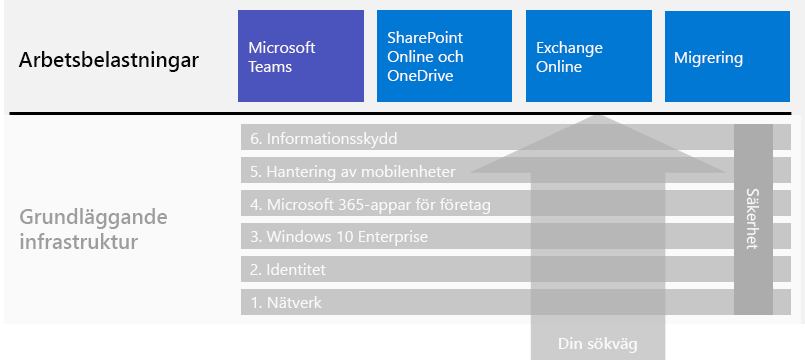

# Arbetsbelastningar och scenarier i Microsoft 365 för företagMicrosoft 365 for enterprise workloads and scenarios

För att få fördelarna med kreativitet och samarbete i Microsoft 365 för företag distribuerar du dessa arbetsbelastningar i den grundläggande infrastrukturen:To get the creativity and teamwork benefits of Microsoft 365 for enterprise, deploy these workloads over your foundation infrastructure:

- [Microsoft TeamsMicrosoft Teams](teams-workload.md)
- [Exchange OnlineExchange Online](exchangeonline-workload.md)
- [SharePoint och OneDriveSharePoint and OneDrive](sharepoint-online-onedrive-workload.md)

En allmän översikt över hur du migrerar hela organisationen till Microsoft 365 för företag finns i artikeln om [migrering](migration-microsoft-365-enterprise-workload.md), som inkluderar Microsoft Office-klientprodukter, lokala Office-serverprodukter och Microsoft Windows-baserade enheter.See the [migration](migration-microsoft-365-enterprise-workload.md) article for a general roadmap to migrate your entire organization to Microsoft 365 for enterprise, which includes Microsoft Office client products, on-premises Office Server products, and Microsoft Windows-based devices.

I scenarierna används funktioner och tjänster från hela Microsoft 365 för företag på ett integrerat sätt för att lösa ett företagsbehov.Scenarios use features and services from across Microsoft 365 for enterprise in an integrated way to address a business need. 

Ett sådant behov är att se till att dina anställda kan arbeta produktivt och säkert när de inte är direktanslutna till intranätet.One such need is to ensure that your employees can work productively and securely when they're not directly connected to your intranet. Mer information om hur du distribuerar infrastrukturelementen och får fart på fjärranvändning för viktiga arbetsbelastningar, t.ex. Teams och Exchange Online, finns i scenariot [Ge distansarbetare goda förutsättningar](empower-people-to-work-remotely.md).See the [Empower remote workers](empower-people-to-work-remotely.md) scenario for a roadmap to deploy the infrastructure elements and drive remote user adoption for key workloads, such as Teams and Exchange Online.

Ett annat sådant behov är att skydda strikt reglerade data som lagrats i Microsoft 365.Another such need is to protect highly regulated data stored in Microsoft 365. I strikt reglerade data ingår digitala tillgångar som:Highly regulated data includes digital assets that are:

- Lyder under regionala bestämmelser.Subject to regional regulations.
- Är de mest värdefulla data för din organisation, t.ex. affärshemligheter, ekonomisk information och personalinformation samt organisationens strategi.The most valuable data for your organization, such as trade secrets, financial or human resources information, and organization strategy.

Information om hur du skyddar dessa data från interna och externa hot finns i:To protect this data from internal and external threats, see:

- [Teams för strikt reglerade dataTeams for highly regulated data](secure-teams-highly-regulated-data-scenario.md)
- [SharePoint-webbplatser för strikt reglerade data](teams-sharepoint-online-sites-highly-regulated-data.md).[SharePoint sites for highly regulated data](teams-sharepoint-online-sites-highly-regulated-data.md). 

De här scenarierna hjälper dig att konfigurera ett Microsoft Teams-team eller en SharePoint-webbplats där du på ett säkert sätt kan lagra dina mest värdefulla data.These scenarios step you through configuring a Microsoft Teams team or SharePoint site to securely store your most valuable data.

Det här är arbetsbelastningarna och scenarierna i den övergripande distributionsguiden för Microsoft 365 för företag:Here are the workloads and scenarios in the overall Microsoft 365 for enterprise deployment guide:

Fler scenarier finns i [Microsoft 365 Produktivitetsbibliotek](https://aka.ms/productivitylibrary) (https://aka.ms/productivitylibrary)).See the [Microsoft 365 Productivity Library](https://aka.ms/productivitylibrary) (https://aka.ms/productivitylibrary) for additional scenarios. 

## Förutsättningar för grundläggande infrastrukturFoundation infrastructure prerequisites

*Helst* bör du distribuera arbetsbelastningar och scenarier efter att du har konfigurerat alla faser för den [grundläggande infrastrukturen](deploy-foundation-infrastructure.md).*Ideally*, you should deploy workloads and scenarios after you have configured all of the phases of the [foundation infrastructure](deploy-foundation-infrastructure.md). Det säkerställer att alla underliggande grundlager finns på plats för att användarna och deras enheter ska få integrering, säkerhet och bästa möjliga upplevelse.This ensures that all of the underlying foundation layers are in place to provide integration, security, and the best experience for your users and their devices.

| FasPhase | ResultatResult |
|:-------|:-----|
| NätverkNetwork | Nätverket är uppdaterat för optimal prestanda för Microsoft 365-molntjänster.Your network is updated for optimum performance to Microsoft 365 cloud services. |
| IdentitetIdentity | Identiteten är synkroniserad och skyddad med stark autentisering för användarkonton och skydd för administratörskonton.Identity is synchronized and secured with strong authentication for user accounts and protection for admin accounts. |
| Windows 10 EnterpriseWindows 10 Enterprise | Dina datorer med Windows 7 eller Windows 8.1 kan uppgradera till Windows 10 Enterprise och nya enheter installeras med Windows 10 Enterprise.Your computers running Windows 7 or Windows 8.1 can upgrade to Windows 10 Enterprise and new devices are installed with Windows 10 Enterprise. |
|  Microsoft 365 Apps för företagMicrosoft 365 Apps for enterprise | Dina befintliga Microsoft Office-användare kan uppgradera till Microsoft 365 Apps för företag.Your existing users of Microsoft Office can upgrade to Microsoft 365 Apps for enterprise. |
| Hantering av mobilenheterMobile device management | Dina enheter kan registreras och hanteras.Your devices can be enrolled and managed. |
| InformationsskyddInformation protection | Funktioner för informationsskydd i Microsoft 365 konfigureras och känslighetsetiketterna eller Azure Information Protection-etiketterna kan användas för att skydda dokument och e-post.Microsoft 365 information protection features are configured and your sensitivity or Azure Information Protection labels are ready to protect documents and email. |

Kom ihåg att det här är optimalt och kan ta tid att planera, konfigurera, testa och sköta, särskilt i stora organisationer med befintlig infrastruktur och flera platser.Remember that this is ideal and can take some time to plan for, configure, test, and pilot, especially in large organizations with existing infrastructure and multiple locations. Det är inte nödvändigt att slutföra alla dessa faser på alla platser för att snabbt få affärsvärde från Microsoft 365 för företag.Completing all of these phases in all locations is not necessary for you to more quickly get business value from Microsoft 365 for enterprise. 

Här är några vanliga arbetsbelastningar som du kan distribuera direkt:Here are some common workloads to deploy right away: 

- Efter att fasen **Identitet** för den grundläggande infrastrukturen har lanserats för användarna distribuerar många organisationer:After the **Identity** phase of the foundation infrastructure is rolled out to users, many organizations deploy:
  - [Microsoft 365 Apps för företag](office365proplus-infrastructure.md) tillsammans med [OneDrive](https://docs.microsoft.com/onedrive/plan-onedrive-enterprise).[Microsoft 365 Apps for enterprise](office365proplus-infrastructure.md) combined with [OneDrive](https://docs.microsoft.com/onedrive/plan-onedrive-enterprise). Microsoft  365 Apps för företag skyddas med modern autentisering och har samma användarmiljö som i den senaste Microsoft Office-klienten.Microsoft 365 Apps for enterprise provides the security of modern authentication and the user experience of the latest Microsoft Office client. Migreringen av användarens personliga filer till OneDrive minskar infrastrukturen och behovet att stödja arbetsmappar och -enheter.The migration of user's personal files to OneDrive reduces infrastructure and the need to support home folders and drives.
  - [Exchange Online](exchangeonline-workload.md) så att användare kan börja använda molnbaserad e-post.[Exchange Online](exchangeonline-workload.md) so that users can begin using cloud-based email.
- Om du inte har ett direkt behov av att lagra strikt reglerade digitala tillgångar i molnet distribuerar du [Microsoft Teams](teams-workload.md) och [SharePoint](sharepoint-online-onedrive-workload.md) för dina användare innan fasen för **informationsskydd**.If you don't have an immediate need for storing highly regulated digital assets in the cloud, deploy [Microsoft Teams](teams-workload.md) and [SharePoint](sharepoint-online-onedrive-workload.md) for your users prior to the **Information protection** phase.

Du måste bestämma hur du på bästa sätt ordnar och distribuerar den grundläggande infrastrukturens konfiguration av nödvändiga faser för att uppfylla dina affärsbehov.You must decide on how to best order and deploy the configuration of prerequisite phases of foundation infrastructure to meet your business needs.

### MetodtipsBest practice

Vi rekommenderar starkt att du distribuerar och lanserar fasen **Identitet** för den grundläggande infrastrukturen innan du introducerar användarna för arbetsbelastningar eller scenarier.We highly recommend that you deploy and roll out the **Identity** phase of the foundation infrastructure prior to onboarding your users to any workloads or scenarios.

Med fasen **Identitet** ser du till att den molnbaserade identiteten, oavsett om den bara finns i molnet eller är synkroniserad med din lokala Active Directory Domain Services (AD DS), innehåller de användar- och datorkonton samt grupper för att hantera autentisering och åtkomst.The **Identity** phase ensures that your cloud-based identity, whether cloud-only or synchronized with your on-premises Active Directory Domain Services (AD DS), contains the user and computer accounts and groups to manage authentication and access. Stark autentisering för alla användare tillsammans med starkt skydd av administratörskonton krävs innan du placerar organisationens digitala tillgångar i Microsoft 365-molnet.Strong authentication for all your users along with strong protection of admin accounts is required before placing your organization's digital assets in the Microsoft 365 cloud.

Även om lanseringen av fasen **Nätverk** är grundläggande och mycket viktig för den övergripande prestandan, kan den vara pågående under tiden du introducerar användarna till arbetsbelastningar. Tänk dock på att Microsoft 365-prestandan för arbetsbelastningar och tjänster förbättras med tiden.Although foundational and very important to overall performance, the rollout of the **Networking** phase can be in progress while onboarding your users to workloads, with the understanding that Microsoft 365 workload and service performance will improve over time. Det här gäller särskilt för organisationer med flera platser och en blandning av gränsenheter och Internetanslutningar.This is especially true for enterprise organizations with multiple locations and a mixture of edge devices and Internet connections.
