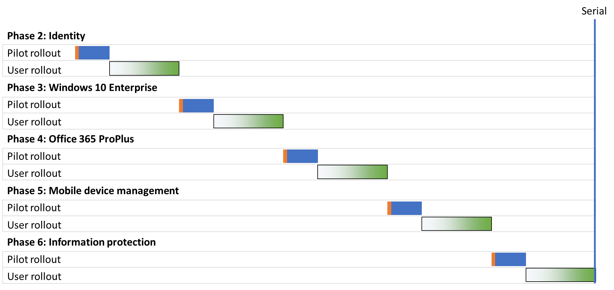

# Microsoft 365 för företag – strategier för distribuering av grundläggande infrastrukturMicrosoft 365 for enterprise foundation infrastructure deployment strategies

Det finns många sätt som du kan använda för att distribuera faserna i [den grundläggande infrastrukturen](deploy-foundation-infrastructure.md) för Microsoft 365 för företag och lansera funktioner, program och tjänster för dina användare.There are many ways you can deploy the phases of the [foundation infrastructure](deploy-foundation-infrastructure.md) of Microsoft 365 for enterprise and roll out its capabilities, software, and services to your users. Tänk på följande distributionsstrategier om du vill komma igång med projektledningen av det här jobbet, som kan vara stor och komplicerad beroende på hur stor din organisation är och dess befintliga infrastruktur:To get you started on the project management of this undertaking, which can be large and complex depending on the size of your organization and its existing infrastructure, consider the following deployment strategies:

- Seriell distributionSerial deployment
- Parallell distribution med ej överlappande användarlanseringParallel deployment with non-overlapping user rollout
- Parallell distribution med överlappande användarlanseringParallel deployment with overlapping user rollout
- Inledande infrastruktur och lansering av slutpunkt till slutpunkt-konfigurationenUp-front infrastructure and rollout of the end-to-end configuration

Använd de här strategierna för att få förslag på hur du kan hantera det övergripande projektet och hur du snabbare kan använda affärsfördelarna med Microsoft 365 för företag.Use these strategies for ideas on how to manage the overall project and more quickly realize the business benefits of Microsoft 365 for enterprise.

>[!Note]
>I den här artikeln beskrivs förutsättningar och förenklingar för att på ett konsekvent sätt beskriva distributionsstrategierna.This article contains assumptions and simplifications for a consistent way to describe the deployment strategies. Dessa distributionsstrategier är allmänna och är inte avsedda att ange vissa tidsramar. De är inte heller avsedda att tillämpas för alla organisationer och situationer.These deployment strategies are generalized and are not meant to imply any specific timeframes, nor are they meant to apply to all organizations and situations.
>

## Element i IT-projektledning för typiska företagsorganisationerElements of IT project management for typical enterprise organizations

IT-infrastruktur omfattar både serverdelstjänster och lansering av nya eller förbättrade funktioner eller installerad programvara för slutanvändare.IT infrastructure includes both backend services and the rollout of new or improved capabilities or installed software to end users. IT-avdelningar distribuerar vanligtvis delar av en IT-infrastruktur på ett metodiskt sätt.IT departments typically deploy elements of an IT infrastructure in a methodical way. En metod för framgångsrik distribution av ett element i IT-infrastrukturen består av:One approach to the successful deployment of an element of IT infrastructure consists of:

- En pilotlanseringA pilot rollout 

  Den omfattar en första konfiguration av infrastruktur och lansering av en pilotuppsättning användare, tester och efterföljande ändringar av infrastrukturens konfiguration.This includes initial infrastructure configuration and rollout to a pilot set of users, testing, and subsequent modifications to the infrastructure configuration.

- En användarlanseringA user rollout

  Den omfattar lanseringen till resten av din organisation baserat på regioner, avdelningar, grupper eller andra typer av systematisk spridning av konfiguration eller programvara.This includes the rollout to the rest of your organization based on regions, departments, groups, or other types of systematic propagation of configuration or software.

Uppsättningen användare som ingår i pilotlanseringen är inte desamma som ingår i användarlanseringen.The set of users in the pilot rollout are not the same as those in the user rollout.

I den här artikeln används följande grafik för att åskådliggöra definitionerna:This article uses the following graphics to depict these definitions: 

 

Skuggan för grafiken som visar användarlanseringen anger procentsatsen i din organisation från 0 % till 100 % som använder en strukturerad eller metodisk metod, t. ex. grupper, avdelningar eller regioner.The shading for the user rollout graphic indicates the percentage across your organization from 0% to 100% using a structured or methodical approach such as groups, departments, or regions.

## DistributionsstrategierDeployment strategies

Överväg följande distributionsstrategier:Consider the following deployment strategies:

- Seriell distributionSerial deployment
- Parallell distribution med ej överlappande användarlanseringParallel deployment with non-overlapping user rollout
- Parallell distribution med överlappande användarlanseringParallel deployment with overlapping user rollout
- Inledande infrastruktur och lansering av slutpunkt till slutpunkt-konfigurationenUp-front infrastructure and rollout of the end-to-end configuration

### Seriell distributionSerial deployment

Vid seriell distribution slutför du en fas helt och ser till att fasen distribueras till 100 % till alla dina användare innan du går vidare till nästa fas.With a serial deployment, you completely roll out a phase, allowing the phase to reach 100% completion of deployment to all of your users, before moving on to the next one. Här är några anledningar till varför det kan vara bra att distribuera på det här sättet:Here are some of the reasons why you might deploy this way:

- RiskhanteringRisk mitigation
- ResursbegränsningarResourcing constraints
- Finansieringscykler för IT-avdelningenIT department funding cycles
- IT-teknikberoendenIT technology dependencies
- Företagets förändringshantering och slutanvändares resistensBusiness change management and end-user resistance

I det här Gantt-schemat visas en förenklad seriell distribution av fas 2–6 av den grundläggande infrastrukturen för Microsoft 365 för företag.This Gantt chart shows a simplified serial deployment of phases 2-6 of the foundation infrastructure for Microsoft 365 for enterprise.

 
 
För att förenkla diskussionen och exemplet måste samtliga fas- och distributionssegment i varje fas pågå lika länge.To simplify the discussion and example, each phase and deployment segment within each phase are assumed to take the same amount of time.

>[!Note]
>Fas 1: Nätverk för den grundläggande infrastrukturen för Microsoft 365 för företag är en fas som endast berör IT-avdelningen.Phase 1: Networking of the Microsoft 365 for enterprise Foundation Infrastructure is an IT department-only phase. Användare drar nytta av fördelarna med optimerad anslutning till Microsofts molnresurser men de behöver inte göra något för att få den.Users reap the benefits of optimized connectivity to Microsoft’s cloud resources but are not imposed upon to achieve it.
>

Här följer en förenklad pilotupplevelse för användare som exempel:Here’s a simplified pilot user experience as an example:

- I december behöver jag använda min smartphone för MFA.In December, I need to use my smart phone for MFA. (Identitet)(Identity)
- I mars får jag Windows 10 Enterprise installerat på min dator med Windows 8.1.In March, I get Windows 10 Enterprise installed on my Windows 8.1 desktop. (Windows 10 Enterprise)(Windows 10 Enterprise)
- I juni får jag Office 365 ProPlus installerat, som ersätter Office 2013.In June, I get Office 365 ProPlus installed, replacing Office 2013. (Office 365 ProPlus)(Office 365 ProPlus)
- I september får jag principer för enhetsregistrering, appar och enheter.In September, I get device enrollment and app and device policies applied. (Hantering av mobila enheter)(Mobile device management)
- I december får jag Azure Information Protection-klienten installerad och får veta hur jag lägger till etiketter i dokument.In December, I get the Azure Information Protection client installed and get trained on how to apply labels to documents. (Informationsskydd)(Information protection)

Resultatet är en takt på 90 dagar mellan på varandra följande pilotlanseringar.The result is a 90-day cadence between successive pilot rollouts.

Här följer en förenklad upplevelse för slutanvändare som exempel:Here’s a simplified end-user experience as an example:

- I januari behöver jag använda min smartphone för MFA.In January, I need to use my smart phone for MFA. (Identitet)(Identity)
- I april får jag Windows 10 Enterprise installerat på min dator med Windows 8.1.In April, I get Windows 10 Enterprise installed on my Windows 8.1 desktop. (Windows 10 Enterprise)(Windows 10 Enterprise)
- I juli får jag Office 365 ProPlus installerat, som ersätter Office 2013.In July, I get Office 365 ProPlus installed, replacing Office 2013. (Office 365 ProPlus)(Office 365 ProPlus)
- I oktober får jag principer för enhetsregistrering, appar och enheter.In October, I get device enrollment and app and device policies applied. (Hantering av mobila enheter)(Mobile device management)
- I januari efterföljande år får jag Azure Information Protection-klienten installerad och får veta hur jag lägger till etiketter i dokument.In January of the following year, I get the Azure Information Protection client installed and get trained on how to apply labels to documents. (Informationsskydd)(Information protection)

Resultatet är en takt på 90 dagar mellan på varandra följande användarlanseringar.The result is a 90-day cadence between successive user rollouts.

Nackdelen med den här distributionsstrategin är att det kan ta lång tid att helt distribuera den grundläggande infrastrukturen för Microsoft 365 för företag.The disadvantage to this deployment strategy is that it can take a long time to fully deploy the Microsoft 365 for enterprise foundation infrastructure.

### Parallell distribution med ej överlappande användarlansering (Parallell 1)Parallel deployment with non-overlapping user rollout (Parallel 1)

För den här distributionsstrategin startar du pilotlanseringen för nästa fas under sista delen av användarlanseringen för den aktuella fasen.For this deployment strategy, you start the pilot rollout of the next phase during the last part of the user rollout of the current phase.
Här är distributionen av faserna 2–6 när pilotlanseringen inleds då användarlanseringen av föregående fas avslutas.Here is the deployment of phases 2-6 when the pilot rollout occurs as the user rollout of the previous phase is wrapping up.

 
 
Slutresultatet är att användarlansering för den aktuella fasen slutförs i hela organisationen innan nästa påbörjas.The end result is that user rollout for the current phase completes across your organization before the next one starts. Användare som inte deltar i pilotlanseringar hanterar inte lanseringar av flera faser samtidigt, men pilotlanseringar görs parallellt med användarlanseringar.Users that are not in pilot rollouts are not dealing with the rollouts of multiple phases at the same time, but pilot rollouts are done in parallel with user rollouts.

Här följer en förenklad pilotupplevelse för användare som exempel:Here’s a simplified pilot user experience as an example:

- I december behöver jag använda min smartphone för MFA.In December, I need to use my smart phone for MFA. (Identitet)(Identity)
- I februari får jag Windows 10 Enterprise installerat på min dator med Windows 8.1.In February, I get Windows 10 Enterprise installed on my Windows 8.1 desktop. (Windows 10 Enterprise)(Windows 10 Enterprise)
- I april får jag Office 365 ProPlus installerat, som ersätter Office 2013.In April, I get Office 365 ProPlus installed, replacing Office 2013. (Office 365 ProPlus)(Office 365 ProPlus)
- I juni får jag principer för enhetsregistrering, appar och enheter.In June, I get device enrollment and app and device policies applied. (Hantering av mobila enheter)(Mobile device management)
- I augusti får jag Azure Information Protection-klienten installerad och får veta hur jag lägger till etiketter i dokument.In August, I get the Azure Information Protection client installed and get trained on how to apply labels to documents. (Informationsskydd)(Information protection)

Resultatet är en takt på 60 dagar mellan på varandra följande pilotlanseringar.The result is a 60-day cadence between successive pilot rollouts.

Här följer en förenklad upplevelse för slutanvändare som exempel:Here’s a simplified end-user experience as an example:

- I januari behöver jag använda min smartphone för MFA.In January, I need to use my smart phone for MFA. (Identitet)(Identity)
- I mars får jag Windows 10 Enterprise installerat på min dator med Windows 8.1.In March, I get Windows 10 Enterprise installed on my Windows 8.1 desktop. (Windows 10 Enterprise)(Windows 10 Enterprise)
- I maj får jag Office 365 ProPlus installerat, som ersätter Office 2013.In May, I get Office 365 ProPlus installed, replacing Office 2013. (Office 365 ProPlus)(Office 365 ProPlus)
- I juli får jag principer för enhetsregistrering, appar och enheter.In July, I get device enrollment and app and device policies applied. (Hantering av mobila enheter)(Mobile device management)
- I september får jag Azure Information Protection-klienten installerad och får veta hur jag lägger till etiketter i dokument.In September, I get the Azure Information Protection client installed and get trained on how to apply labels to documents. (Informationsskydd)(Information protection)

Resultatet är en takt på 60 dagar mellan på varandra följande användarlanseringar.The result is a 60-day cadence between successive user rollouts.

Fördelen med den här distributionsstrategin är att det kan ta kortare tid att helt distribuera den grundläggande infrastrukturen för Microsoft 365 för företag, utan att IT-avdelningen och användare behöver hantera flera lanseringar samtidigt.The advantage to this deployment strategy is that it can take less time to fully deploy the Microsoft 365 for enterprise foundation infrastructure, without having your IT department and users deal with multiple rollouts the same time.

### Parallell distribution med överlappande användarlansering (Parallell 2)Parallel deployment with overlapping user rollout (Parallel 2)

För den här distributionsstrategin startar du:For this deployment strategy, you start the:

- Pilotlanseringen för nästa fas under sista delen av användarlanseringen för den aktuella fasen.Pilot rollout of the next phase during the last part of the user rollout of the current phase.
- Användarlansering av nästa fas under användarlanseringen av den aktuella fasen på ett sätt som gör att inga användare hanterar lanseringar av flera faser samtidigt.User rollout of the next phase during the user rollout of the current phase in such a way that no user is dealing with the rollouts of multiple phases at the same time. Det här förutsätter att du lanserar varje fas av den grundläggande infrastrukturen på samma sätt genom att använda regioner, avdelningar eller andra indelningar.This assumes that you are rolling out each phase of the foundation infrastructure in the same way, using regions, departments, or other groupings.

Här är en förenklad jämförelse mellan de olika distributionsstrategierna.Here is a simplified comparison between the different deployment strategies.

 

Slutresultatet är:The end result is that:

- Pilotlanseringar går från en fas till nästa utan pauser.Pilot rollouts go from one phase to the next without a pause.
- Användarlansering för en fas börjar innan användarlanseringen av föregående fas slutförs, men ingen enskild användare får mer än en fas lanserad samtidigt.The user rollout for a phase begins before the completion of the user rollout of the previous phase, but no individual user is rolling out more than one phase at a time.

Här följer en förenklad pilotupplevelse för användare som exempel:Here’s a simplified pilot user experience as an example:

- I december behöver jag använda min smartphone för MFA.In December, I need to use my smart phone for MFA. (Identitet)(Identity)
- I januari får jag Windows 10 Enterprise installerat på min dator med Windows 8.1.In January, I get Windows 10 Enterprise installed on my Windows 8.1 desktop. (Windows 10 Enterprise)(Windows 10 Enterprise)
- I februari får jag Office 365 ProPlus installerat, som ersätter Office 2013.In February, I get Office 365 ProPlus installed, replacing Office 2013. (Office 365 ProPlus)(Office 365 ProPlus)
- I mars får jag principer för enhetsregistrering, appar och enheter.In March, I get device enrollment and app and device policies applied. (Hantering av mobila enheter)(Mobile device management)
- I april får jag Azure Information Protection-klienten installerad och får veta hur jag lägger till etiketter i dokument.In April, I get the Azure Information Protection client installed and get trained on how to apply labels to documents. (Informationsskydd)(Information protection)

Resultatet är en takt på 30 dagar mellan på varandra följande pilotlanseringar.The result is a 30-day cadence between successive pilot rollouts.

Här följer en förenklad upplevelse för slutanvändare som exempel:Here’s a simplified end-user experience as an example:

- I januari behöver jag använda min smartphone för MFA.In January, I need to use my smart phone for MFA. (Identitet)(Identity)
- I februari får jag Windows 10 Enterprise installerat på min dator med Windows 8.1.In February, I get Windows 10 Enterprise installed on my Windows 8.1 desktop. (Windows 10 Enterprise)(Windows 10 Enterprise)
- I mars får jag Office 365 ProPlus installerat, som ersätter Office 2013.In March, I get Office 365 ProPlus installed, replacing Office 2013. (Office 365 ProPlus)(Office 365 ProPlus)
- I april får jag principer för enhetsregistrering, appar och enheter.In April, I get device enrollment and app and device policies applied. (Hantering av mobila enheter)(Mobile device management)
- I maj får jag Azure Information Protection-klienten installerad och får veta hur jag lägger till etiketter i dokument.In May, I get the Azure Information Protection client installed and get trained on how to apply labels to documents. (Informationsskydd)(Information protection)

Resultatet är en takt på 30 dagar mellan på varandra följande användarlanseringar.The result is a 30-day cadence between successive user rollouts.

Fördelen med den här distributionsstrategin är att det kan ta ännu kortare tid att helt distribuera den grundläggande infrastrukturen för Microsoft 365 för företag, och slutanvändare behöver fortfarande inte hantera flera lanseringar samtidigt.The advantage to this deployment strategy is that it can take even less time to fully deploy the Microsoft 365 for enterprise foundation infrastructure, still without having end-users deal with multiple rollouts the same time. Användare får dock inte någon paus mellan på varandra följande steg.However, users don’t get a break between successive phases.

### Inledande infrastruktur och lansering av slutpunkt till slutpunkt-konfigurationenUp-front infrastructure and rollout of the end-to-end configuration

För mindre organisationer som kan komprimera faserna 2–6 till ett enda distributionssegment ser den resulterande distributionen ut så här:For smaller organizations with the ability to compress phases 2-6 into a single deployment segment, the resulting deployment looks like this:
 
 

IT-avdelningen konfigurerar infrastrukturen för faserna 2–6 och lanserar sedan för pilotanvändarna för att kontrollera funktioner från slutpunkt till slutpunkt.The IT department configures the infrastructure for phases 2-6, then rolls out to the pilot users to check for the end-to-end functionality. Pilotanvändare får till exempel alla de här funktionerna på samma gång:For example, pilot users get all of this functionality at the same time:

- MFA och andra identitetsfunktioner (Identitet)MFA and other identity features (Identity)
- Windows 10 Enterprise på Windows-enheter (Windows 10 Enterprise)Windows 10 Enterprise on Windows devices (Windows 10 Enterprise)
- Office 365 ProPlus för Office-paketet (Office 365 ProPlus)Office 365 ProPlus for the Office suite (Office 365 ProPlus)
- Principer för appar och enheter (hantering av mobila enheter)App and device policies (Mobile device management)
- Azure Information Protection-klienten installeras och utbildning sker om hur man lägger till etiketter i dokument (Informationsskydd).Azure Information Protection client installed and training on how to apply labels to documents (Information protection)

När pilotlanseringen har avslutats inleds användarlanseringen när varje användare får alla funktioner samtidigt.Once the pilot rollout is concluded, the user rollout begins in which each user gets all the functionality the same time.

## Nästa stegNext step

Inled din distribution av Microsoft 365 för företag med den [grundläggande infrastrukturen](deploy-foundation-infrastructure.md).Start your deployment of Microsoft 365 for enterprise with the [foundation infrastructure](deploy-foundation-infrastructure.md).
