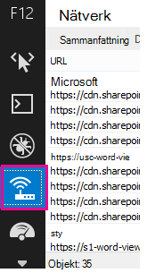
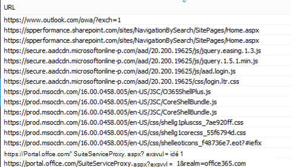
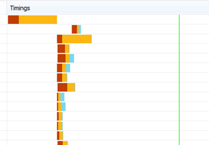
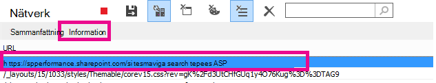
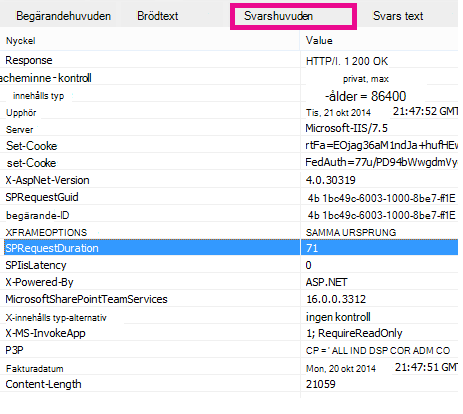

# Diagnostisering av prestandaproblem i SharePoint Online

I den här artikeln visar vi hur du kan diagnostisera vanliga problem med SharePoint Online-webbplatsen med utvecklarverktygen i Internet Explorer.
  
Det finns tre olika sätt att identifiera att en sida på en SharePoint Online-webbplats har prestandaproblem med anpassningarna.
  
- F12-verktygsfältets nätverksskärm

- Jämförelse med en icke-anpassad originalplan

- Mått för SharePoint Online-svarshuvuden

I det här avsnittet beskrivs hur du använder var och en av de här metoderna för att diagnostisera prestandaproblem. När du har hittat orsaken till problemet kan du arbeta mot en lösning med hjälp av artiklarna om hur du förbättrar prestanda i SharePoint som du hittar på https://aka.ms/tune .
  
## Använda F12-verktygsfältet för att diagnostisera prestanda i SharePoint Online

I den här artikeln använder vi Internet Explorer 11. Versioner av F12-utvecklarverktygen i andra webbläsare har liknande funktioner, men de kan se lite annorlunda ut. Mer information om F12-utvecklingsverktygen finns i:
  
- [Vad är nytt i F12-verktygen](/previous-versions/windows/internet-explorer/ie-developer/dev-guides/bg182632(v=vs.85))

- [Använda F12-utvecklingsverktygen](/previous-versions/windows/internet-explorer/ie-developer/samples/bg182326(v=vs.85))

Du visar utvecklingsverktygen genom att trycka **på F12** och sedan klicka Wi-Fi ikonen:
  

  
På fliken **Nätverk** trycker du på den gröna uppspelningsknappen för att läsa in en sida. Verktyget returnerar alla filer som webbläsaren begär för att få den sida du efterfrågar. Följande skärmbild visar en sådan lista.
  

  
På höger sida kan du även se nedladdningstiderna för filerna, som på skärmbilden.
  

  
Det ger dig en visualisering av hur lång tid det tog att läsa in filen. Den gröna linjen visar när sidan är klar att återges i webbläsaren. Det ger dig en snabb översikt över de olika filer som kan vara orsaken till långsam sidin läses in på webbplatsen.
  
## Konfigurera en icke-anpassad originalplan för SharePoint Online

Det bästa sättet att ta reda på var webbplatsen fungerar bäst är att konfigurera en förinställt webbplatssamling i SharePoint Online. På så sätt kan du jämföra olika aspekter av webbplatsen med vad du skulle få utan anpassning på sidan. Startsidan för OneDrive för företag är ett bra exempel på en separat webbplatssamling som det inte är troligt att det finns några anpassningar för.
  
## Visa information om SharePoint-svarshuvuden

I SharePoint Online kan du komma åt den information som skickas tillbaka till webbläsaren i svarshuvudet för varje fil. Det mest användbara värdet för diagnostisering av prestandaproblem är **SPRequestDuration,** som visar den tid som begäran tog på servern för att bearbetas. Det kan hjälpa dig att avgöra om begäran är mycket tung och resurskrävande. Det här är den bästa insikt du har i hur mycket arbete servern utför för att servera sidan.

### Så här visar du information om SharePoint-svarshuvuden
  
1. Kontrollera att du har F12-verktygen installerade. Mer information om hur du laddar ned och installerar dessa verktyg finns [i Vad är nytt i F12-verktygen.](/previous-versions/windows/internet-explorer/ie-developer/dev-guides/bg182632(v=vs.85))

2. I F12-verktygen på fliken Nätverk **trycker du på** den gröna uppspelningsknappen för att läsa in en sida.

3. Klicka på en av .aspx-filerna som returneras av verktyget och klicka sedan på **INFORMATION.**

    
  
4. Klicka **på Svarshuvuden**.

    
  
## Vad orsakar prestandaproblem i SharePoint Online?

I artikeln Navigeringsalternativ för [SharePoint Online](navigation-options-for-sharepoint-online.md) visas ett exempel på hur SPRequestDuration-värdet används för att fastställa att komplicerad strukturell navigering var orsaken till att det tog lång tid för sidan att bearbetas på servern. Genom att ta ett värde för en baslinjewebbplats (utan anpassning) kan du avgöra om det tar lång tid att läsa in en viss fil. Det exempel som används [i Navigeringsalternativ för SharePoint Online](navigation-options-for-sharepoint-online.md) är den viktigaste .aspx-filen. Den filen innehåller de flesta ASP.NET kod som körs för sidinläsningen. Beroende på vilken webbplatsmall du använder kan det vara start.aspx, home.aspx, default.aspx eller ett annat namn om du anpassar startsidan. Om det här talet är betydligt högre än baslinjewebbplatsens är det en god indikation på att något komplicerat pågår på sidan som orsakar prestandaproblemen.
  
När du har identifierat att ett problem gäller specifikt för din webbplats är det rekommenderade sättet att ta reda på vad som orsakar dåliga prestanda att ta bort alla möjliga orsaker, som sidanpassning, och sedan lägga till dem en och en på webbplatsen. När du har tagit bort tillräckligt många anpassningar för att sidan ska gå bra kan du lägga tillbaka specifika anpassningar en och en.
  
Om du till exempel har en mycket komplex navigering kan du försöka ändra navigeringen så att underwebbplatser inte visas, och sedan kontrollera utvecklarverktygen för att se om det gör någon skillnad. Om du har en stor mängd innehållsupprullningar kan du ta bort dem från sidan och se om det förbättrar saker. Om du tar bort alla möjliga orsaker och lägger till dem i en i taget kan du enkelt identifiera vilka funktioner som är det största problemet och sedan arbeta mot en lösning.