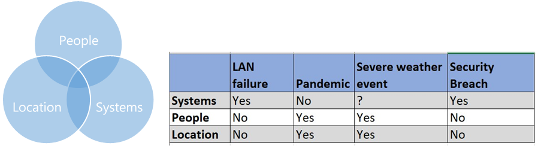

# Hantering av affärskontinuitet för företag för kund- och molnpartneransvar

Att skaffa Microsoft 365-molntjänster för dina användare är ett samarbete mellan din organisation och Microsoft. Microsoft tillhandahåller tjänsterna och du ansvarar för att ansluta dina klientslutpunkter, hantera identitets- och åtkomstinformation och hur tjänsterna används. Det finns också delade ansvarsområden, t. ex. identitets- och kataloginfrastruktur. I den här artikeln beskrivs några av de kritiska objekt som du behöver för att få verksamheten att fungera om en tjänstehändelse sker, och det hjälper till att ställa in förväntningar på vad Microsoft gör under en tjänstehändelse.

## Transparens under tjänstehändelser

Som betrodd partner skapar Microsoft mycket elastiska molntjänster och följer strukturerade procedurer för att lösa problem med tjänsten när de inträffar. När en tjänstehändelse inträffar vet Microsoft att kommunikation som är **i tid,** **riktad**och har **hög tillgänglighet** är viktig för kunderna.

## I tid
Microsoft meddelar Microsoft 365-administratörer genom att uppdatera klientorganisationens hälsoinstrumentpanel (SHD) i Microsoft 365-administratörsportalen. Uppdateringar för tjänstehändelser tillhandahålls vanligtvis varje timme. Om en annan tid krävs kommer vi att hålla dig informerad om ändringen av SHD-kommunikationsinläggen.

## Riktad
I de flesta fall när vårt övervakningssystem identifierar ett problem kan vi identifiera den påverkade kundbasen, från en enda kund upp till regionsnivå eller mer och dirigera den nödvändiga kommunikationen till kunderna. Det hjälper dig att hålla koll på vad du behöver veta för ditt företag och att inte distraheras av brusmeddelanden som inte påverkar dig. Om till exempel en särskild postlådedatabas påverkas kan vi identifiera exakt vilka kunder som har användare i den aktuella infrastrukturen och leta upp vår kommunikation med dem. Om incidentens omfattning är oklar utökar vi vår kommunikation till den bredaste gruppen med kunder som eventuellt påverkas.

## Hög tillgänglighet
Microsoft har flera kanaler för tjänststatuskommunikation som kunder kan använda.

- I händelse att administrationscentret eller hälsoinstrumentpanelen i administrationscentret inte är tillgänglig kan du övervaka tjänstens status med vår [säkerhetskopieringswebbplats](https://status.office365.com/).
- Vi underhåller ett Twitter-konto, [@MSFT365Status](https://twitter.com/msft365status?lang=en), där vi kommer att besvara rapporter om konsekvenserna och publicera uppdateringar på SHD om påverkade händelser.
- I Admin-appen för Microsoft 365-klientorganisationer får du möjlighet att ansluta till organisationens Microsoft 365-tjänstestatus på resande fot. Klientorganisationernas användare kan visa statusinformation för tjänsten och uppdateringar av underhållsstatus från sina mobila enheter. Mer information finns på sidan med [vanliga frågor och svar om Admin-appen](https://docs.microsoft.com/office365/admin/admin-overview/admin-mobile-app?view=o365-worldwide).
- Med [API:n för tjänstens kommunikation i Microsoft 365](https://docs.microsoft.com/office365/servicedescriptions/office-365-platform-service-description/service-health-and-continuity#office-365-service-communications-api) kan du komma åt tjänstens kommunikation, så att du enklare kan övervaka din miljö. Du kan ansluta till API:et, ta emot hälsotillståndsdata i realtid och publicera informationen på en intern instrumentpanel för att informera användarna om händelser. När du distribuerar informationen internt kan det minska supportens trafik under ett avbrott.
- För allvarliga händelser publicerar Microsoft granskningar efteråt (PIR) till SHD i administrationscentret. PIR-granskningar innehåller viktig information om händelser som hjälper dig att förstå avbrottet. De innehåller vanligtvis följande delar:
    - användarpåverkan
    - påverkans omfattning
    - start- och slutdatum och tid för händelser
    - rotorsak
    - vidtagna åtgärder
    - nästa steg
- Extrakommunikation är tillgänglig i meddelandecentret för Microsoft 365, t. ex. meddelanden om kommande ändringar, nya funktioner och planerat underhåll.
- Mer information finns i [guiden för tjänstens hälsa och kontinuitet](https://docs.microsoft.com/office365/servicedescriptions/office-365-platform-service-description/service-health-and-continuity) om olika kommunikationskanaler och hur du övervakar tjänstens hälsa.
 
Att ge åtkomst till Microsoft 365-onlinetjänster är ett samarbete mellan din organisation och Microsoft. Den här tabellen sammanfattar det ansvar som både Microsoft och kunder har vid en tjänstehändelse och under vanliga åtgärder.

## Din kontinuitet för miljö – tjänst
När du funderar på kontinuitetsplanen ska du vara uppmärksam på händelser som kan påverka din organisation och dess övergripande förmåga att kommunicera. På en hög nivå finns det tre faktorer som kan påverka verksamheten.

### Kontakter
Överväg händelser som skulle kunna skada din arbetsstyrka, som en naturkatastrof eller en pandemi. Det här är lätt att missa på grund av osannolikheten för en stor påverkan om arbetsstyrkan är spridd. Men fortsätter verksamheten att fungera om en stor andel av arbetsstyrkan skulle vara offline? Hur åtgärdar ni det?

### Plats
Många organisationer kräver att medarbetare befinner sig på en angiven fysisk eller annan nätverksplats för att kunna ansluta till företagssystem och molntjänster.  
Microsoft publicerar [principer för nätverksanslutningar](https://docs.microsoft.com/office365/enterprise/office-365-network-connectivity-principles) som hjälper företagen via metodtips för att konfigurera nätverksanslutningar till molnresurser. Exempel på optimering omfattar implementation av delade tunnel-VPN-nätverk för att tillåta anslutningar direkt från en användares nätverk istället för via en VPN-tunnel.  Även om de här anslutningsprinciperna är viktiga för att upprätthålla anslutningar med låg fördröjning kräver tjänstens återhämtning alternativa metoder för att ansluta till företagets resurser för generellt samarbete.

### System
Många samarbetslösningar är beroende av system, och detsamma gäller för företagets WAN-nätverk (wide area network). Hur svarar din organisation när systemen inte är tillgängliga?
Den här bilden visar problem som kan påverka fler än ett område. Den tillhörande tabellen innehåller exempel att tänka på

Dina kontinuitetsplaner bör överväga vart och ett av dessa områden. Hur får de användarna åtkomst till viktiga resurser om du till exempel vill att användare ska vara i företagets nätverk och det blir snöstorm? Om snön förhindrar resor till kontoret och teknikerna måste ansluta sig till företagsnätverket – finns det då en princip beträffande att de har sina företagsdatorer hemma?
