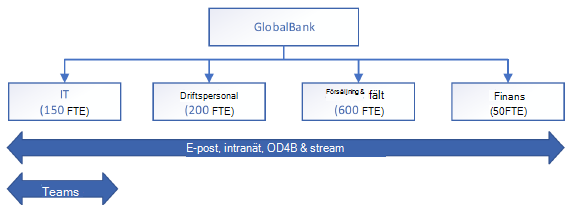

# Utveckla en kontinuitetsplanDeveloping your continuity plan

I det här avsnittet får du information om hur du utvecklar en affärskontinuitetsplan som tar hänsyn till Microsoft 365-beroenden.This topic provides guidance on developing a business continuity plan which takes Microsoft 365 dependencies into account. Här rekommenderar vi metoder för att analysera dina företagsfunktioner och identifiera vilka som är beroende av Microsoft 365-tjänster.Here we recommend methods for analyzing your business functions and identifying the ones which depend on Microsoft 365 services. Du kommer att utföra den här analysen med bedömningen att det kommer att bli fel i tjänsten och att du måste förbereda för dessa eventualiteter.You'll perform this analysis with the anticipation that there will be service failures and that you have to prepare for those possibilities.

Generellt sett omfattar affärskontinuitetsplanering fyra aspekter: bedömning, planering, funktionsvalidering samt kommunikation och samordning.Broadly speaking, business continuity planning involves four aspects, assessment, planning, capability validation, and communication and coordination.

## BedömningAssessment
Du måste först identifiera företagsfunktionerna i organisationen och de tjänster och processer som stöder dem.First you must identify the business functions in your org and the services and processes that support them. Det här innefattar att göra en analys av påverkan på verksamheten, där varje företagsfunktion rangordnas enligt hur kritisk den är och du identifierar de processer och tjänster som varje funktion är beroende av.This includes completing a business impact analysis, where each business function is ranked according to how critical it is and you identify the processes and services that each one depends on. Här är en exempeltabell du kan använda för att komma igång med din egen bedömning.Here's a sample table you can refer to help you get started with your own assessment.

**Exempel på BIA (Business Impact Assessment – bedömning av påverkan på verksamheten****Sample Business Impact Assessment (BIA)**

Det här är ett BIA-dokument för `name of the service, system, process, or function`This is a BIA document for `name of the service, system, process, or function`

|BIA-fältBIA fields|BeskrivningDescription|
|---------|---------|
|BIA-typBIA type|`is it a business process or technology, service or system?`|
|BIA-namnBIA name|`name of the service/system/function/process`|
|tjänstbeskrivningservice description|`give a full description of the service, process, or function`|
|företagsfunktionenterprise function|`some examples: customer services; legal; marketing; risk management, security, sales, information technology, production, manufacturing`|
|räkenskapsårfiscal year|`the current fiscal year, re-evaluate these on a regular basis`|
|kritikalitetcriticality|`develop your own classifications, but here are some examples: mission critical, important, deferrable`|
|affärsenhetbusiness unit|`name of the business unit that owns this business function`|
|process (tjänst, funktion)process (service, feature)|`the name of the process, service, or feature`|
|chef för affärsgruppbusiness group senior leader|`the name and contact information of the senior leader of the business group that owns this business process`|
|Har tekniken ett upprättat **internt** SLA eller OLA?Does the technology have an established **internal** SLA or OLA?|`please explain in as much detail as possible`|
|Har tekniken ett upprättat **externt** SLA eller OLA?Does the technology have an established **external** SLA or OLA?|`please explain in as much detail as possible`|
|Har tekniken ett känt exekutivt mandat som driver ett specifikt process-SLA?Does the technology have a known executive mandate driving a specific process SLA? Om ja, beskriv i detalj.If yes, explain in detail.|`details here`|
|Kommer förlust eller komprometterande av data associerade med de här tjänsterna att utlösa en stor händelse?Will the loss or compromise of the data associated with this services trigger a major event? Om ja, beskriv i detalj.If yes, explain in detail.|`details here`|
|Har tjänsten en tillfällig lösning eller ett alternativt på plats för vissa eller alla av dess huvudfunktioner?Does the service have a workaround or alternative in place for some or all of its key functions and features? Om ja, beskriv i detalj.If yes, explain in detail.|`details here`|
|Bearbetar, lagrar eller överför tjänsten kunddata, till exempel information som går att koppla till en specifik individ (PII)?Does the service process, store, or transmit customer data, such as personally identifiable information (PII)? Om ja, beskriv i detalj.If yes, explain in detail.|`details here`|
|BIA-statusBIA status|`develop your own status classification, here are some examples: planned, started, in-progress, complete, on-hold, expired`|
|slutförandedatumcompletion date|`the date this BIA was completed`|
|BIA-samordnareBIA facilitator|`name of the person or group who is responsible for developing and maintaining this BIA`|
|BIA-godkännandeBIA approval|`name of the person or group who is the executive sponsor of this BIA and who has responsibility for approving it.`|
|medverkandecontributors|`optional list of the people who helped develop this BIA and their contact information`|
|BIA-godkännandeplatsBIA approval location|`indicate where the executive approval is located, or attach proof to this document`|

## PlaneringPlanning

Titta nu på olika affärsprocesser för att se var det finns sammanhängande beroenderelationer.Next, you look across business processes to see where any cascading dependency relationships exist. Utifrån resultatet gör du prioriteringar och utformar återhämtningsstrategier och standarddriftsprocedurer som stöder dina strategier.Based on the outcome, you prioritize and form resiliency strategies, and standard operating procedures supporting your strategies.

Du kan använda [Tjänstkarta för Microsoft](https://docs.microsoft.com/azure/azure-monitor/insights/service-map) som hjälp med mappningen.You can use [Microsoft Service Map](https://docs.microsoft.com/azure/azure-monitor/insights/service-map) to help you in with this mapping. Tjänstkarta för Microsoft identifierar automatiskt programkomponenter i Windows- och Linux-system och mappar alla TCP-beroenden, identifierar anslutningar och fjärrstyrda tredjepartssystem som appen är beroende av.Microsoft Service Map automatically discovers application components on Windows and Linux systems and maps all TCP dependencies, identifies connections,  and remote third-party systems that the app depends on. Den mappar även beroenden till områden av nätverket som traditionellt är mörka, till exempel Active Directory.It also maps dependencies to areas of your network that are traditionally dark, such as Active Directory.

Här är ett exempel på en beroendeanalys (DA – Dependency Analysis) du kan använda som utgångspunkt.Here's a sample dependency analysis (DA) you can start from. I beroendeanalysen (DA) identifierar och undersöker du processberoenden.In your dependency analysis (DA), you will identify and examine the process dependencies. Se till att inkludera personer, leverantörer, kunder, samarbeten och anläggningar.Make sure you include people, suppliers, customers, partnerships and facilities. Data från analysen används till att identifiera luckor mellan återställningskraven för en process och återställningsfunktionerna för stödjande beroenden.The data from this analysis will be used to identify gaps between the recovery requirements of a process and the recovery capabilities of supporting dependencies.

|fältfield|beskrivningdescription|
|---------|---------|
|processtypprocess type|         |
|samordnarefacilitator|         |
|slutfördes avcompleted by|         |
|slutdatumcompleted date|         |
|medverkandecontributors|         |
  
## FunktionsvalideringCapability validation

När du har inventerat dina affärsprocesser och kartlagt relationerna till andra processer och tekniker måste du skapa valideringsscenarier för alla processer.Once you have inventoried your business processes and mapped out relationships to other process and technologies, you need to build validation scenarios for all the processes. I princip ska du ta reda på hur du ska validera affärsprocessernas kontinuitetsplaner.Basically, figure out how you are going to validate your business process continuity plans. Du kommer troligen finna att vissa är viktigare än andra och att du vill prioritera dem.You'll probably find that some are more important that others and you'll want to prioritize those.
Kom ihåg att regelbunden utbildning av medarbetare om svar på incidenter och kontinuitetsåtgärder är viktigt när planen har upprättats.Don't forget that regularly training employees on incident response and continuity measures is important once the plan is established. Granskningar efter incidenter ska användas för att förbättra återhämtningsstrategierna genom att lägga till information från varje validering eller test.Post incident reviews should be used to enhance your resiliency strategies by incorporating learnings from each validation or test.

## Samordning och kommunikation vid incidenterIncident coordination and communication

Under en tjänstincident kan normala kommunikationskanaler vara påverkade eller försämrade, så du bör i förväg ordna med alternativ som hjälper organisationen att hålla kontakten vid en incident.During a service incident, normal communications channels may be impacted or degraded, so you should pre-arrange alternatives to help your organization stay connected during an incident. Det är viktigt att kommunikationskanaler upprättas, testas för säkerhet och efterlevnad, och att användarna utbildas i användning innan störningarna sker.It is critical that the communication channels be established, vetted for security and compliance, and users trained on their use prior to a disruption. En övergång vid fel från ett känt tillstånd till ett annat känt tillstånd är mycket bättre jämfört med att användarna kommer på okända ad hoc-lösningar mitt i en kris.Failing from a known state to another known state is far preferable to users coming up with ad-hoc, unknown solutions in the middle of a crisis.

På Microsoft har varje tjänstteam upprättat interna alternativa kommunikationskanaler som hjälper oss med samordningen när våra normala kommunikationskanaler inte är tillgängliga.At Microsoft, each service team has established internal alternative communication channels to help us coordinate when our normal communications channels aren’t available. Det är till exempel reservlösningar för telefoni och ljudkonferenser, Yammer-grupper, Teams-grupper, interna Service Health-instrumentpaneler och intern programvara för incidenthantering.These include backup telephony and audio-conferencing solutions, Yammer groups, Teams groups, internal Service Health Dashboards, and internal Incident Management software.

Under din BIA- och DA-analys mappar du kritiska processer och de tekniker eller tjänster de är beroende av.During your Business Impact Analysis and Dependency Analysis, you will be mapping critical processes and the technologies or services they depend on. Ägna särskild uppmärksamhet åt kommunikationen under den här fasen av planeringen och fundera över alternativ.Pay special attention to communication during this phase of planning and think of alternatives. Här är några exempel.Here are some examples.

- Om e-post är din primära metod för information till användare och intressenter, och e-posttjänsten är försämrad eller otillgänglig, till exempel Microsoft Teams, Yammer eller någon annan tredjepartstjänst som reserv.If email is your primary method of keeping your users and stakeholders informed, and your email service is degraded or unavailable, you can use another service such as Microsoft Teams, Yammer, or another 3rd-party service as a backup. Nyckeln är att upprätta dem i förväg och informera användarna om vart de ska gå.The key is to establish these beforehand and train your users on where to go. En Yammer-tråd kommer inte att vara användbar om ingen vet att den finns eller om ingen har ett bokmärke för den.A Yammer thread isn’t going to be useful if no one knows it exists or if no one has it bookmarked.  
- Om dina interna processer för incidenthantering förlitar sig på röstkommunikation för att samordna svaren ska du upprätta en alternativ telefonilösning som används vid en kris.If your internal Incident Management processes rely on voice communications to coordinate your responses, establish an alternative telephony solution for use during a crisis. Lösningen behöver inte vara helt jämförbar med den primära tjänsten men ska tillhandahålla en minsta samarbetsnivå där det går att samordna affärskontinuitets- och incidenthanteringsteamen.This solution doesn’t need to have full parity with your primary service but should provide the minimum level of collaboration to coordinate your Business Continuity and Incident Management teams. Om du dessutom ber användarna att publicera sina mobiltelefonnummer i företagets globala adresslista kan det ge en ytterligare nivå av reservkommunikation i extrema fall.Additionally, asking users to publish their mobile phone numbers in your Global Address List can provide an additional layer of backup communication in extreme cases.
- Det kan vara en bra idé at skapa en anpassad Service Health-instrumentpanel, eller någon annan liknande webbplats, som kan ge statusuppdateringar vid en incident.You may want to create a custom service health dashboard, or other such site, which can provide status updates during an incident. Att i förväg informera användare vart de ska gå för att få information minskar antalet onödiga samtal till supportavdelningen och gör användarna trygga i att situationen hanteras snabbt och effektivt.Training users where to go for information beforehand will help reduce unnecessary calls to help desk and instill confidence in your user base that the situation is being handled quickly and efficiently. Använd O365 Service Communications API för väva in det här i M365 för att få en ännu högre synlighetsnivå.Use the O365 Service Communications API to tie this into M365 for an even greater level of visibility.  
- Det är viktigt att platsen för affärskontinuitetsplaner och standarddriftsprocedurer är välkända.It is critical that the location of your Business Continuity Plans and Standard Operating Procedures is well known. Vi rekommenderar att du har kopior online och offline av kritisk dokumentation, till exempel med SharePoint Online eller OneDrive för företag konfigurerat för automatisk synkronisering på lokala enheter.We recommend maintaining online and offline copies of critical documentation, such as with SharePoint Online or OneDrive for Business configured for automatic sync to local devices. För tjänst-/nätverksdriftscenter och andra liknande team som är absolut kritiska för återställning kan det också vara en bra idé att ha papperskopior tillgängliga som kan användas vid nödläge.For Service/Network Operations Centers and other similar teams that will be absolutely critical for recovery, you may also want to keep hard copies available to be used in the event of an emergency.

## Känn till dina externa integreringspunkterKnow your external points of integration

Oavsett affärsmodell har alla företag integreringspunkter med kunder, partners och leverantörer.Regardless of business model, every company has points of integration with their customers, partners and vendors. Leveranskedjan för affärsvärden bygger på integrering med externa entiteter.The business value supply chain is built on integration with external entities. En förbättring av affärskontinuiteten vid störningar i tjänsten kräver överväganden – och skydd – av varje integreringspunkt.Improving business continuity in the event of service disruption requires consideration – and protection – of each point of integration.  
När du analyserar din leveranskedja ska du tänka på extern kommunikation på samma sätt som intern kommunikation analyseras.As you analyze your supply chain, external communications should be considered in the same way internal communications are analyzed. Förlitar sig dina kunder på Exchange Online-servrar som enda metod att kontakta dig?Do your customers rely on your Exchange Online servers as the only method of contacting you? Har du upprättat och gjort leverantörerna medvetna om alternativa kommunikationsmetoder, om drifttiden påverkas?Have you established and made your suppliers aware of alternative communication methods, in the event uptime is impacted? Här är en exempeltabell som ger förslag på hur du kan organisera tänkandet.Here's a sample table that suggests how to organize your thinking.

|namn på extern entitetexternal entity name|scenario för påverkande incidentimpacting incident scenario|Integrerade Microsoft 365-tjänsterMicrosoft 365 services integrated|alternativalternatives|
|---------|---------|---------|---------|
|`vendor name`|e-postflödemail flow|Exchange Online är det enda kommunikationsmedlet med ContosoExchange Online is the only means of communication with Contoso|konfigurera externa Microsoft Teams-kanaler eller samarbetsprogram från tredje partset up external Microsoft Teams channels or a third-party collaboration software          |
|`service supplier name`|chattchat|Microsoft TeamsMicrosoft Teams|snabbmeddelandefunktioner från tredje partthird party instant messaging|
|`partner name`|röstfunktionervoice|Microsoft TeamsMicrosoft Teams|mobil eller allmän pstnmobile or public pstn      |
|`supplier name`|fildelningfile sharing|externt delade SharePoint-webbplatser och OneDriveexternally shared SharePoint sites and OneDrive|fildelning från tredje partthird party file sharing         |
