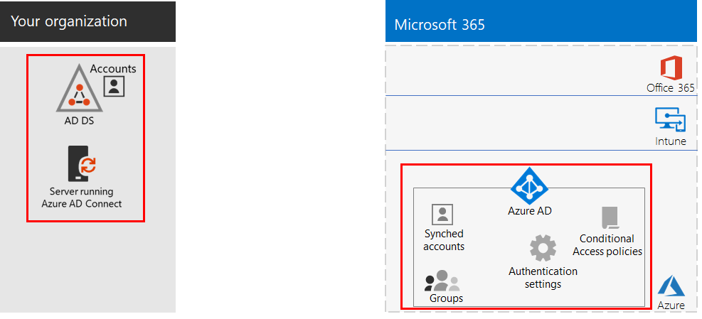
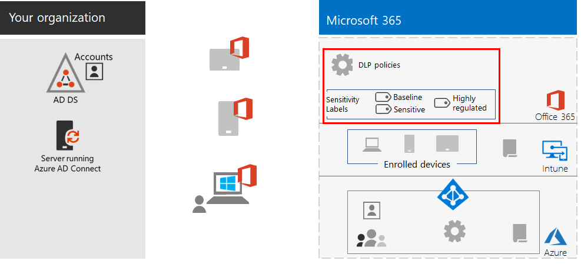

# Ge distansarbetare goda förutsättningarEmpower remote workers

*Det här scenariot gäller både E3- och E5-versionerna av Microsoft 365 Enterprise**This scenario applies to both the E3 and E5 versions of Microsoft 365 Enterprise*

Att göra det möjligt för personalen att jobba på distans på ett smidigt och säkert sätt är viktigt för många organisationer för att spara på kontorsyta, rekrytera och behålla personal som inte kan eller vill flytta och minska pendling och det ger de anställda mer tid att vara produktiva och utföra aktiviteter som minskar stressen utanför arbetet.Allowing employees to work away from the office seamlessly and securely is important for many organizations to save on office space, hire and retain employees who are unwilling to relocate, and reduce employee commuting, leaving them with more time to be productive and for stress-reducing activities outside of work.

Distansarbete kan betyda flera olika saker, till exempel:Remote working, also known as teleworking, can span a spectrum that includes:

- Anställda som ibland är borta från kontoret på konferenser eller kundmöten.Employees that are occasionally away from the office for conferences or client meetings.
- Vissa anställda som arbetar heltid på distans.Some employees that work remotely full-time.
- En fullständigt fjärransluten organisation där det inte finns något kontor och alla medarbetare arbetar på distans.A fully remote organization in which there is no office and all employees are remote.

En kombination av funktioner i Microsoft 365 Enterprise ger dina distansarbetare goda förutsättningar på ett mycket samarbetsinriktat sätt, till exempel:To support remote workers, a combination of features in Microsoft 365 Enterprise enables your remote workers in a highly collaborative way, such as:

- Onlinemöten och chattsessioner.Online meetings and chat sessions.
- Delade arbetsytor för molnbaserad fillagring med global tillgänglighet och samarbete i realtid.Shared workspaces for cloud-based file storage with global accessibility and real-time collaboration.
- Delade uppgifter och arbetsflöden för att dela upp arbetet och få saker gjorda.Shared tasks and workflows to divide up the work and get things done.

Microsoft 365 Enterprise har följande starka säkerhetsfunktioner:For strong security, Microsoft 365 Enterprise includes:

- Tvingande autentiseringskrav, identifiera och svara på högriskinloggningar och blockera valda appar och icke-kompatibla enheter.Enforced authentication requirements, detecting and responding to high-risk sign-ins, and blocking selected apps and non-compliant devices.
- Krypterade anslutningar och digitala tillgångar i molnet.Encrypted connections and digital assets in the cloud.
- Behörigheter för att definiera vilka som kan göra vad med filer.Permissions to define who can do what with files.
- Skydd mot dataförlust (DLP) för att förhindra läckage av strikt reglerade data.Data loss prevention (DLP) to prevent leakage of highly regulated data.

För att möta dessa kriterier för distanspersonal använder du följande Microsoft 365 Enterprise-funktioner:To meet these criteria for remote workers, use the following Microsoft 365 Enterprise features:

- Användaridentitet och inloggningssäkerhetUser identity and sign-in security
  - Användarkonton i Azure Active Directory (Azure AD) med multifaktorautentisering (MFA)Azure Active Directory (Azure AD) user accounts with multi-factor authentication (MFA)
  - Principer för villkorsstyrd åtkomst för att kräva MFA för riskfyllda inloggningarConditional Access policies to require MFA for risky sign-ins
- SamarbetsplattformarCollaboration platforms
  - Microsoft Teams, SharePoint och OneDrive, med vilka distansarbetare kan schemalägga och delta i videobaserade onlinemöten och arbeta med samma dokument samtidigtMicrosoft Teams, SharePoint, and OneDrive, with which remote workers can schedule and attend online video-based meetings and work on the same documents at the same time
- Säker åtkomst till resurserSecure access to resources
  - Grupper och behörigheter för Teams, SharePoint-webbplatser och OneDrive så att bara autentiserade och tillåtna användare har åtkomstGroups and permissions for Teams, SharePoint sites, and OneDrive so that only authenticated and permitted users have access
- Skydd mot läckta filerProtection for leaked files
  - Office 365 DLP-principerOffice 365 DLP policies
  - Känslighetsetiketter för kryptering och behörigheter som följer med filerSensitivity labels for encryption and permissions that travel with files
- Enhetshantering och säkerhet med Microsoft IntuneDevice management and security with Microsoft Intune
  - Registrering av hanterade enheterEnrollment for managed devices
  - Appinställningar för personliga enheterApp settings for personal devices
  - Enhets- och apprinciperDevice and app policies
- Produktivitetsappar för enheterProductivity apps for devices
  - Office 365 ProPlus-appar för samarbete med Teams, SharePoint och OneDriveOffice 365 ProPlus apps for collaborative experiences with Teams, SharePoint, and OneDrive 
- Windows 10 EnterpriseWindows 10 Enterprise
  - Omfattande säkerhetsfunktioner för att skydda mot cyberattacker och förhindra dataläckageComprehensive security features to protect against cyberattacks and prevent data leakage
- Åtkomst till lokala apparAccess to on-premises apps
  - Organisationer som har hybrididentitet kan använda Azure AD-programproxy istället för VPN-anslutningar (virtuellt privat nätverk)Organizations that have hybrid identity can use Azure AD Application Proxy instead of virtual private network (VPN) connections

I följande faser får du stegvisa anvisningar om hur du distribuerar funktionen för fjärråtkomst i Microsoft 365 Enterprise och inför funktionen för distansarbetare.The following phases step you through deploying the feature of Microsoft 365 Enterprise for remote access and driving adoption for remote workers. Om du redan har distribuerade element för dessa faser ser du till de uppfyller de angivna kraven innan du går vidare till nästa del.If you have already deployed elements of these phases, ensure that they meet the stated requirements before moving on to the next element.

 En sammanfattning på en sida av det här scenariot finns på affischen [Ge distansarbetare goda förutsättningar](../media/empower-people-to-work-remotely/empower-remote-workers-scenario.pdf).For a 1-page summary of this scenario, see the [Empower remote workers poster](../media/empower-people-to-work-remotely/empower-remote-workers-scenario.pdf).

Du kan också ladda ned den här affischen i [PDF](https://github.com/MicrosoftDocs/microsoft-365-docs/raw/public/microsoft-365/media/empower-people-to-work-remotely/empower-remote-workers-scenario.pdf)- eller [PowerPoint](https://github.com/MicrosoftDocs/microsoft-365-docs/raw/public/microsoft-365/media/empower-people-to-work-remotely/Empower-Remote-Workers-Poster.pptx)-format och skriva ut den i pappersstorleken letter, legal eller tabloid (11 x 17).You can also download this poster in [PDF](https://github.com/MicrosoftDocs/microsoft-365-docs/raw/public/microsoft-365/media/empower-people-to-work-remotely/empower-remote-workers-scenario.pdf) or [PowerPoint](https://github.com/MicrosoftDocs/microsoft-365-docs/raw/public/microsoft-365/media/empower-people-to-work-remotely/Empower-Remote-Workers-Poster.pptx) formats and print it on letter, legal, or tabloid (11 x 17)-sized paper.

## Fas 1: Distribuera Microsoft 365-funktioner för distansarbetarePhase 1: Deploy Microsoft 365 features and capabilities for remote workers

På grund av bredden och antalet funktioner som krävs för det här scenariot går vi igenom de olika stegen för de element som krävs i avsnitten för grundinfrastrukturen och arbetsbelastningar i [distributionsguiden för Microsoft 365 Enterprise](deploy-microsoft-365-enterprise.md).Because of the breadth and number of features and capabilities required for this scenario, we’ll step you through the required elements of the foundation infrastructure and workloads sections of the [Microsoft 365 Enterprise Deployment Guide](deploy-microsoft-365-enterprise.md).

### Steg 1: Krav på grundinfrastrukturen för distansarbetareStep 1: Foundation infrastructure requirements for remote workers

I det här steget går vi igenom faserna för [grundinfrastrukturen](deploy-foundation-infrastructure.md) och listar de element som krävs för att möjliggöra distansarbete.In this step, we’ll visit the phases of the [foundation infrastructure](deploy-foundation-infrastructure.md) and list the required elements to enable remote workers.

För [Fas 2: identitet](identity-infrastructure.md) distribuerar du följande användaridentitet och inloggningssäkerhet:For [Phase 2: Identity](identity-infrastructure.md), deploy the following for user identity and sign-in security:

- För hybrididentitet, användarkonton och grupper synkroniserade från lokal Active Directory Domain Services (AD DS).For hybrid identity, user accounts and groups synchronized from on-premises Active Directory Domain Services (AD DS).
- För tilldelning av behörigheter, synkroniserade grupper eller Azure AD-grupper med rätt medlemmar.For assigning permissions, synchronized or Azure AD groups with the appropriate members.
- Autentiseringsinställningar, till exempel att kräva MFA.Authentication settings, such as requiring MFA.
- Principer för villkorsstyrd åtkomst för att kräva MFA för riskfyllda inloggningar och blockera klienter som inte stöder modern autentisering.Conditional Access policies to require MFA for risky sign-ins and block clients that don’t support modern authentication.

Här är konfigurationsresultatet med de nya identitetselementen markerade.Here's the resulting configuration with the identity elements highlighted.

 
Distribuera följande för [Fas 3: Windows 10 Enterprise](windows10-infrastructure.md):For [Phase 3: Windows 10 Enterprise](windows10-infrastructure.md), deploy:

- Infrastrukturen för att distribuera nya enheter med Windows 10 Enterprise och för att uppgradera dina Windows 7- eller Windows 8.1-enheter till Windows 10 EnterpriseThe infrastructure to deploy new devices with Windows 10 Enterprise and to upgrade of your Windows 7 or Windows 8.1 devices to Windows 10 Enterprise
- Aktivera omfattande säkerhetsfunktioner för identitet, hot och informationsskyddEnabling comprehensive security features for identity, threat, and information protection

Här är konfigurationsresultatet med Windows 10 Enterprise-enheter.Here's the resulting configuration with Windows 10 Enterprise devices.

 
För [Fas 4: Office 365 ProPlus](office365proplus-infrastructure.md) distribuerar du infrastrukturen för att installera Office 365 ProPlus eller uppgradera ditt nuvarande Office-paket, till exempel Office 2010 eller Office 2013, till Office 365 ProPlus på organisationens enheter.For [Phase 4: Office 365 ProPlus](office365proplus-infrastructure.md), deploy the infrastructure to install Office 365 ProPlus or upgrade your currently installed Office suite, such as Office 2010 or Office 2013, to Office 365 ProPlus on your organization devices. Det här ger dina användare de bästa säkerhets- och samarbetsfunktionerna.This will give your users the best security and collaborative experiences.

Här är konfigurationsresultatet med Office 365 ProPlus installerat på enheterna.Here's the resulting configuration with Office 365 ProPlus installed on devices.

 
För [Fas 5: Hantering av mobila enheter](mobility-infrastructure.md) distribuerar du enhets- och apphantering med Intune för:For [Phase 5: Mobile device management](mobility-infrastructure.md), deploy Intune device and app management for:

- Registrering av Windows 10 Enterprise-, iOS-, macOS-, Android- och Android Enterprise-enheter så att de får funktioner och säkerhetsinställningar som definieras av organisationen.Enrollment of your Windows 10 Enterprise, iOS, macOS, Android, and Android Enterprise devices so they receive features and security settings defined by your organization.
- Appinställningar för extra säkerhet och för att tillåta eller blockera appar, även på de anställdas personliga enheter.App settings for extra security and to allow or block apps, even on employee-owned personal devices.
- Efterlevnadsprinciper med villkorsstyrd åtkomst för att förhindra anslutning av enheter som inte följer standard.Compliance policies with Conditional Access to prevent non-compliant devices from connecting.

Här är konfigurationsresultatet med Intune-registrerade enheter och principer markerade.Here's the resulting configuration with Intune enrolled devices and policies highlighted.

 
För [Fas 6: Informationsskydd](infoprotect-infrastructure.md), utforma och konfigurera skydd för dina digitala tillgångar med:For [Phase 6: Information protection](infoprotect-infrastructure.md), design and configure protection for your digital assets with:

- Office 365 DLP-principer.Office 365 DLP policies.
- Office 365-känslighetsetiketter för kryptering och behörigheter som följer med filer.Office 365 sensitivity labels for encryption and permissions that travel with files.

Här är konfigurationsresultatet med DLP-principer och känslighetsetiketter markerade.Here's the resulting configuration with DLP policies and sensitivity labels highlighted.

 
För åtkomst till lokala appar kan du använda [Azure AD-programproxy](https://docs.microsoft.com/azure/active-directory/manage-apps/application-proxy), som kräver en hybrididentitetsmiljö.For access to on-premises apps, you can use [Azure AD Application Proxy](https://docs.microsoft.com/azure/active-directory/manage-apps/application-proxy), which requires a hybrid identity environment.

Här är konfigurationsresultatet med komponenterna för programproxy markerade.Here's the resulting configuration with the application proxy components highlighted.

 
### Steg 2: Arbetsbelastningar för distansarbetareStep 2: Workloads for remote workers

För [Exchange Online](exchangeonline-workload.md) distribuerar du Exchange Online-postlådor till var och en av dina användare.For [Exchange Online](exchangeonline-workload.md), deploy Exchange Online mailboxes to each of your users.

För [Teams](teams-workload.md) distribuerar du Teams till dina användare och grupper.For [Teams](teams-workload.md), deploy Teams to your users and groups.

För [SharePoint och OneDrive](sharepoint-online-onedrive-workload.md) distribuerar du SharePoint-gruppwebbplatser eller kommunikationswebbplatser och OneDrive-mappar.For [SharePoint and OneDrive](sharepoint-online-onedrive-workload.md), deploy SharePoint team or communication sites and OneDrive folders.

Här är konfigurationsresultatet med arbetsbelastningar markerade.Here's the resulting configuration with the workloads highlighted.

 
### DistributionsresultatDeployment results

Efter distribution av grundinfrastrukturen och arbetsbelastningar och lansering av Windows 10 Enterprise och Office 365 ProPlus gäller följande för distansarbetare:After deploying the foundation infrastructure and workloads and rolling out Windows 10 Enterprise and Office 365 ProPlus, remote workers:

- De omfattas av starkt autentiserings- och identitetsskydd.Are subject to strong authentication and identity protection.
- De har den senaste och säkraste versionen av Windows på sina Windows-enheter.Have the latest and most secure version of Windows on their Windows devices.
- De har den senaste och med produktiva versionen av Office-paketet på sina enheter.Have the latest and most productive version of the Office suite on their devices.
- De omfattas av principer för apphantering och enhetsefterlevnad.Are subject to app management and device compliance policies.
- De omfattas av DLP-principer och begränsningar.Are subject to DLP policies and restrictions.
- De kan tilldela känslighetsetiketter för kryptering och behörigheter som följer med filer och e-post.Can assign sensitivity labels for encryption and permissions that travel with files and email.
- De kan komma åt lokala appar utan en VPN-anslutning.Can access on-premises apps without a VPN connection.
- De kan utföra eget arbete och delta i realtidssamarbete med kollegor via chattar, möten och filer i Teams och filer i SharePoint och OneDrive.Can perform their own work and participate in real-time collaboration with co-workers with chats, meetings, and files in Teams and files in SharePoint and OneDrive.

När distansarbetarna är offline (inte anslutna till Internet) kan de ändra lokala kopior av filer.When offline (not connected to the Internet), your remote workers can change local copies of files. När de ansluter till Internet igen synkroniserar OneDrive lokala kopior med de filer som lagras i din Microsoft 365-prenumeration.When they reconnect to the Internet, OneDrive synchronizes local copies with the files stored in your Microsoft 365 subscription. 

Här är konfigurationsresultatet för distansarbetare i organisationen om du använder hybrididentitet.Here's the resulting configuration for remote workers of your organization if you use hybrid identity.

 
 
Här är konfigurationsresultatet för distansarbetare i organisationen om du använder helt molnbaserad identitet.Here's the resulting configuration for remote workers your organization if you use cloud-only identity.

## Fas 2: Driva på distansarbetares användningPhase 2: Drive user adoption for remote workers

Nu när grundinfrastrukturen och arbetsbelastningarna är på plats är det dags att driva på den pågående användningen av de här funktionerna för dina distansarbetare så att de kan vara produktiva var som helst och när som helst.Now that the foundation infrastructure and workloads are in place, it’s time to drive the ongoing usage of these capabilities to your remote workers so they can be productive anywhere and at any time.

### Steg 1: Utbilda dina användareStep 1: Train your users

Utbilda distansarbetare i följande:Train your remote workers on:

- Lämpliga inloggningssätt, till exempel MFA-registrering, och hur inloggningar kan utmanas när en risk upptäcks.Proper sign-in procedures, including MFA registration, and how sign ins can be challenged when risk is detected.
- Användningen av enheter och hur principer kan användas för att blockera åtkomsten för enheter som inte följer standard.The use of devices and how policies can be used to block access for non-compliant devices.
- Användningen av tillåtna appar och hur Intune-apprinciper kan användas för att blockera appar.The use of allowed apps and how Intune app polices can be used to block apps.
- Windows 10 Enterprise-säkerhetsfunktioner.Windows 10 Enterprise security features.
- Använda Outlook för e-post och kalenderfunktioner.How to use Outlook for email and calendaring.
- Använda [Teams](https://docs.microsoft.com/microsoftteams/training-microsoft-teams-landing-page) för chatt, videobaserade konferenser, dokumentdelning och trådade konversationer.How to use [Teams](https://docs.microsoft.com/microsoftteams/training-microsoft-teams-landing-page) for chat, video-based conferencing, document sharing, and threaded conversations.
- Använda SharePoint-gruppwebbplatser eller -kommunikationswebbplatser och OneDrive-mappar för att bläddra bland filer i en användares bibliotek och sådana som tillhör en grupp.How to use SharePoint team or communication sites and OneDrive folders to browse files in a user's library and those belonging to a group.
- Använda och tillämpa känslighetsetiketter för filer som innehåller känsliga eller strikt reglerade data, för både lokala och onlineversioner av filer.How to use and apply sensitivity labels for files containing sensitive or highly regulated data, for both local and online versions of files.

I den här utbildningen ska det ingå praktiska övningar så att dina elever kan prova funktionerna och se deras resultat.This training should include hands-on exercises so that your students can experience these capabilities and their results.

### Steg 2: Utföra regelbundna granskningar av användning och hantera feedback för medarbetareStep 2: Conduct periodic reviews of usage and address worker feedback

I veckorna efter utbildningen:In the weeks after training:

- Snabbt hantera feedback från distansarbetare och finjustera principer och konfigurationer.Quickly address remote worker feedback and fine tune polices and configurations.
- Analysera användning av Teams, SharePoint-webbplatser och OneDrive-mappar samt jämföra med förväntad användning.Analyze usage for teams, SharePoint sites, and OneDrive folders and compare it with usage expectations.
- Kontrollera att känsliga eller strikt reglerade filer har etiketterats korrekt med lämplig känslighetsetikett.Verify that sensitive or highly regulated files have been properly labeled with the appropriate sensitivity label.

Vidareutbilda dina användare efter behov.Retrain your users as needed.

### AnvändningsresultatUser adoption results

Dina distansarbetare kan använda sina Windows 10 Enterprise-enheter eller andra enheter och Office 365 ProPlus för att komma åt och arbeta med delade Microsoft 365 Enterprise-molntjänster och -resurser i en säker miljö där de möts, skapar och samarbetar i realtid.Your remote workers can use their Windows 10 Enterprise or other devices and Office 365 ProPlus to access and work on shared Microsoft 365 Enterprise cloud services and resources in a secure environment, and they’re meeting, creating, and collaborating in real time.

## Se ävenSee also

[Arbetsbelastningar och scenarierWorkloads and scenarios](deploy-workloads.md)

[Produktivitetsbiblioteket för Microsoft 365](https://aka.ms/productivitylibrary) (https://aka.ms/productivitylibrary)[Microsoft 365 Productivity Library](https://aka.ms/productivitylibrary) (https://aka.ms/productivitylibrary)

[DistributionsguideDeployment guide](deploy-microsoft-365-enterprise.md)
