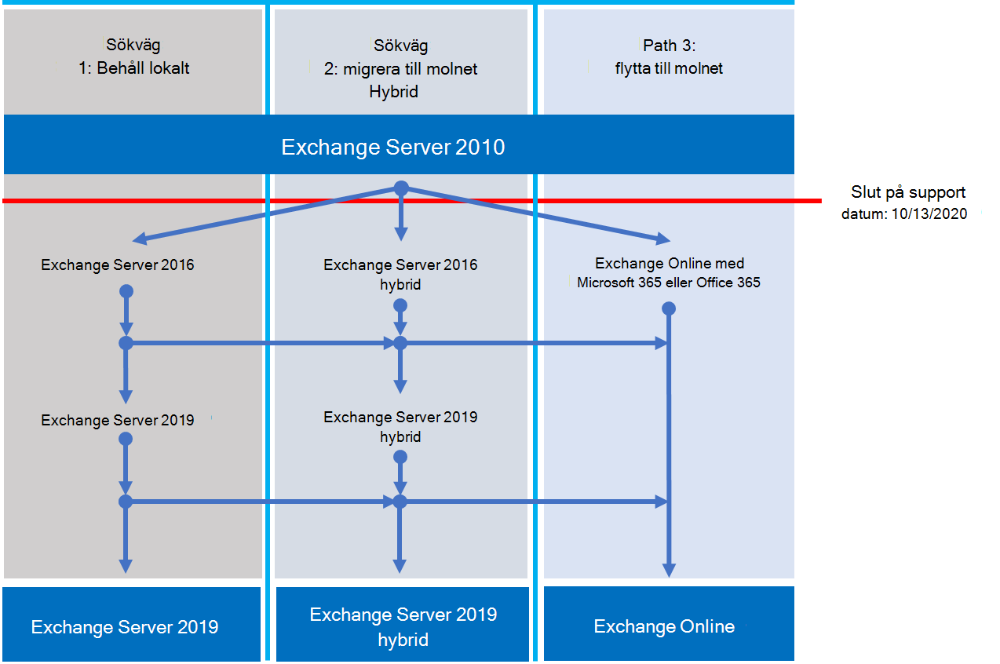

# Stöd översikt för Exchange 2010Exchange 2010 end of support roadmap

*Denna artikel gäller för både Microsoft 365 Enterprise och Office 365 Enterprise.**This article applies to both Microsoft 365 Enterprise and Office 365 Enterprise.*

Exchange Server 2010 har nått Supportens slut den **13 oktober 2020**.Exchange Server 2010 reached its end of support on **October 13, 2020**. Om du inte redan har börjat migrera från Exchange 2010 till Microsoft 365, Office 365 eller Exchange 2016 är det dags att börja planera.If you haven't already begun your migration from Exchange 2010 to Microsoft 365, Office 365, or Exchange 2016, now's the time to start planning.

## Vad innebär *slut på support* ?What does *end of support* mean?

De flesta Microsoft-produkter har en support livs cykel under vilken de får nya funktioner, korrigeringar, säkerhets korrigeringar och så vidare.Most Microsoft products have a support lifecycle during which they get new features, bug fixes, security fixes, and so on. Denna livs cykel räcker vanligt vis i 10 år från produkten första gången.This lifecycle typically lasts for 10 years from the product's initial release. Slutet av livs cykeln kallas produkt Supportens slut.The end of this lifecycle is known as the product's end of support. Eftersom Exchange 2010 nådde Supportens slut den 13 oktober 2020, erbjuder Microsoft inte längre:Because Exchange 2010 reached its end of support on October 13, 2020, Microsoft no longer provides:

- Teknisk support för problem som kan uppstå.Technical support for problems that may occur.
- Program korrigeringar för problem som kan påverka serverns stabilitet och användbarhet.Bug fixes for issues that may impact the stability and usability of the server.
- Säkerhets korrigeringar för säkerhets problem som kan göra servern sårbar för säkerhets brott.Security fixes for vulnerabilities that may make the server vulnerable to security breaches.
- Tids zons uppdateringar.Time zone updates.

Din installation av Exchange 2010 fortsätter att köras efter detta datum.Your installation of Exchange 2010 will continue to run after this date. Men på grund av ändringarna ovan rekommenderar vi starkt att du migrerar från Exchange 2010 så snart som möjligt.But because of the changes listed above, we strongly recommend that you migrate from Exchange 2010 as soon as possible.

Mer information om hur du nära Supportens slut finns i [resurser som hjälper dig att uppgradera från Office 2010-servrar och-klienter](upgrade-from-office-2010-servers-and-products.md).For more information about nearing the end of support, see [Resources to help you upgrade from Office 2010 servers and clients](upgrade-from-office-2010-servers-and-products.md).

## Vilka alternativ har jag?What are my options?

Det är en bra tidpunkt för att utforska dina alternativ och förbereda ett flytt abonnemang.It's a great time to explore your options and prepare a migration plan. Du kan:You can:

- Migrera helt till Microsoft 365.Migrate fully to Microsoft 365. Migrera post lådor med snabbmigrering, minimal hybrid eller fullständig hybrid migrering.Migrate mailboxes using cutover, minimal hybrid, or full hybrid migration. Ta sedan bort lokala Exchange-servrar och Active Directory.Then remove on-premises Exchange servers and Active Directory.
- Migrera dina Exchange 2010-servrar till Exchange 2016 på dina lokala servrar.Migrate your Exchange 2010 servers to Exchange 2016 on your on-premises servers.

> [!IMPORTANT]
> Om organisationen väljer att migrera post lådor till Microsoft 365 men planerar att hålla DirSync eller Azure AD Connect för att fortsätta att hantera användar konton från lokala Active Directory måste du behålla minst en Microsoft Exchange-Server lokalt.If your organization chooses to migrate mailboxes to Microsoft 365 but plans to keep DirSync or Azure AD Connect in place to continue managing user accounts from on-premises Active Directory, you need to keep at least one Microsoft Exchange server on-premises. Om du tar bort alla Exchange-servrar kan du inte göra ändringar i Exchange-mottagare i Exchange Online eftersom auktoritets källan förblir i din lokala Active Directory.If you remove all Exchange servers, you won't be able to make changes to Exchange recipients in Exchange Online because the source of authority remains in your on-premises Active Directory. Ändringar måste göras där.Changes need to be made there. I det här scenariot har du följande alternativ:In this scenario, you have the following options:
>
>- *Rekommenderas:* Om du har migrerat dina post lådor till Microsoft 365 och uppgraderat dina servrar senast den 13 oktober 2020 kan du använda Exchange 2010 för att ansluta till Microsoft 365 och migrera post lådor.*Recommended:* If you migrated your mailboxes to Microsoft 365 and upgraded your servers by October 13, 2020, use Exchange 2010 to connect to Microsoft 365 and migrate mailboxes. Migrera Exchange 2010 till Exchange 2016 och inaktivera alla återstående Exchange 2010-servrar.Next, migrate Exchange 2010 to Exchange 2016, and decommission any remaining Exchange 2010 servers.
>- Om du inte slutförde migrering av post lådor och lokal server uppgradering senast den 13 oktober 2020 uppgraderar du först dina lokala Exchange 2010-servrar till Exchange 2016.If you didn't complete the mailbox migration and on-premises server upgrade by October 13, 2020, upgrade your on-premises Exchange 2010 servers to Exchange 2016 first. Använd sedan Exchange 2016 för att ansluta till Microsoft 365 och migrera post lådor.Then use Exchange 2016 to connect to Microsoft 365 and migrate mailboxes.

> [!NOTE]
> Det är lite mer komplicerat, men du kan även migrera post lådor till Microsoft 365 när du migrerar dina lokala Exchange 2010-servrar till Exchange 2016.It's little more complicated, but you can also migrate mailboxes to Microsoft 365 while migrating your on-premises Exchange 2010 servers to Exchange 2016.

Här är de tre vägarna som du kan vidta för att undvika slut på stöd för Exchange Server 2010.Here are the three paths you can take to avoid the end of support for Exchange Server 2010.

I följande avsnitt förklaras alla alternativ i detalj.The following sections explore each option in more detail.

## Migrera till Microsoft 365Migrate to Microsoft 365

Migrering av e-post till Microsoft 365 är det bästa och enklaste alternativet att hjälpa dig att ta bort din Exchange 2010-distribution.Migrating your email to Microsoft 365 is the best and simplest option to help you retire your Exchange 2010 deployment. Med en migrering till Microsoft 365 kan du skapa ett enkelt hopp från gammal teknik till aktuella funktioner, bland annat:With a migration to Microsoft 365, you can make a single hop from old technology to current features, including:

- Funktioner för efterlevnad, som bevarande principer, In-Place och rättsliga undantag, pågående eDiscovery och mycket mer.Compliance capabilities such as Retention Policies, In-Place and Litigation Hold, in-place eDiscovery, and more.
- Microsoft Teams.Microsoft Teams.
- Power BI.Power BI.
- Prioriterad inkorg.Focused Inbox.
- MyAnalytics.MyAnalytics.

Microsoft 365 får också nya funktioner först, så din organisation kan börja använda dem direkt.Microsoft 365 also gets new features and experiences first, so your organization can start using them right away. Dessutom behöver du inte oroa dig över:Also, you won't have to worry about:

- Köpa och underhålla maskin vara.Purchasing and maintaining hardware.
- Betala till hetta och låt dina servrar svalna.Paying to heat and cool your servers.
- Hålla dig uppdaterad om säkerhets-, produkt-och tids zoner.Keeping up to date on security, product, and time-zone fixes.
- Bevara lagring och program vara för att stödja kraven på efterlevnad.Maintaining storage and software to support compliance requirements.
- Uppgradera till en ny version av Exchange.Upgrading to a new version of Exchange. Du är alltid med den senaste versionen av Exchange i Microsoft 365.You're always on the latest version of Exchange in Microsoft 365.

### Hur ska jag migrera till Microsoft 365?How should I migrate to Microsoft 365?

Beroende på din organisation har du några alternativ för att komma till Microsoft 365.Depending on your organization, you have a few options to get to Microsoft 365. Först måste du fundera på några saker, till exempel:First, you need to consider a few things, such as:
- Antalet säten eller post lådor som du måste flytta.The number of seats or mailboxes you need to move.
- Hur länge du vill att migreringen ska pågå.How long you want the migration to last.
- Om du behöver en sömlös integrering mellan din lokala installation och Microsoft 365 under migreringen.Whether you need a seamless integration between your on-premises installation and Microsoft 365 during the migration.
 
I den här tabellen visas migreringsåtgärder och de viktigaste faktorer som avgör vilken metod som ska användas.This table shows your migration options and the most important factors that determine which method to use.

|Flyttnings alternativMigration option|Organisationens storlekOrganization size|RepetitionDuration|
|---|---|---|
|Snabb migreringCutover migration|Färre än 150 platserFewer than 150 seats|En vecka eller mindreA week or less|
|Minimal hybrid migrationMinimal hybrid migration|Färre än 150 platserFewer than 150 seats|Några veckor eller färreA few weeks or less|
|Fullständig hybrid migrationFull hybrid migration|Fler än 150 platserMore than 150 seats|Några veckor eller merA few weeks or more|

I följande avsnitt får du en översikt över de här metoderna.The following sections give you an overview of these methods. Mer information finns i [välja en sökväg för migrering](https://support.office.com/article/Decide-on-a-migration-path-0d4f2396-9cef-43b8-9bd6-306d01df1e27).For more information, see [Decide on a migration path](https://support.office.com/article/Decide-on-a-migration-path-0d4f2396-9cef-43b8-9bd6-306d01df1e27).

### Snabb migreringCutover migration

I en snabbmigrering-migrering migrerar du alla dina post lådor, distributions grupper, kontakter och så vidare till Office 365 vid en uppsättning datum och tid.In a cutover migration, you migrate all your mailboxes, distribution groups, contacts, and so on, to Office 365 at a set date and time. När du är klar stänger du av dina lokala Exchange-servrar och börjar använda Microsoft 365 exklusivt.When you're done, you shut down your on-premises Exchange servers and start using Microsoft 365 exclusively.

Snabbmigrering migration är perfekt för små organisationer som inte har många post lådor, vill komma till Microsoft 365 snabbt och inte vill hantera de andra metodernas komplexitet.Cutover migration is great for small organizations that don't have many mailboxes, want to get to Microsoft 365 quickly, and don't want to deal with the complexity of the other methods. Men det bör göras i en vecka eller mindre.But it should be completed in a week or less. Och det kräver att användare konfigurerar om sina Outlook-profiler.And it requires users to reconfigure their Outlook profiles. Snabbmigrering migration kan migrera upp till 2 000-postlådor, men vi rekommenderar att du använder den för maximalt 150.Cutover migration can migrate up to 2,000 mailboxes, but we recommend you use it for a maximum of 150. Om du försöker migrera mer kan det ta slut på dig att överföra alla post lådorna före din tids gräns och din IT-supportavdelning kan bli mycket roligare med att hjälpa användarna att konfigurera om Outlook.If you try to migrate more, you could run out of time to transfer all the mailboxes before your deadline, and your IT support staff may get overwhelmed with requests to help users reconfigure Outlook.

Här är några saker du bör tänka på när du snabbmigrering migrering:Here are things to consider about cutover migration:

- Microsoft 365 måste ansluta till dina Exchange 2010-servrar med hjälp av Outlook överallt via TCP-port 443.Microsoft 365 will need to connect to your Exchange 2010 servers by using Outlook Anywhere over TCP port 443.
- Alla lokala post lådor flyttas till Microsoft 365.All on-premises mailboxes will be moved to Microsoft 365.
- Du behöver ett lokalt administratörs konto med Läs åtkomst till användarnas post lådor.You'll need an on-premises administrator account that has read access to your users' mailboxes.
- Exchange 2010 accepterade domäner som du vill använda i Microsoft 365 måste läggas till som verifierade domäner i tjänsten.The Exchange 2010 accepted domains that you want to use in Microsoft 365 need to be added as verified domains in the service.
- Mellan när du startar migreringen och när du påbörjar fasen kommer Microsoft 365 regelbundet att synkronisera Microsoft 365-och lokala post lådor.Between when you start the migration and when you begin the completion phase, Microsoft 365 will periodically synchronize the Microsoft 365 and on-premises mailboxes. Då kan du slutföra migreringen utan att oroa dig för att e-post kvars i dina lokala post lådor.This lets you complete the migration without worrying about email being left behind in your on-premises mailboxes.
- Användarna får nya tillfälliga lösen ord för sitt Microsoft 365-konto.Users will receive new temporary passwords for their Microsoft 365 account. De måste ändra dem när de loggar in på sina post lådor för första gången.They'll need to change those when they sign in to their mailboxes for the first time.
- Du behöver en Microsoft 365-licens som innehåller Exchange Online för varje användar post låda du migrerar.You'll need a Microsoft 365 license that includes Exchange Online for each user mailbox you migrate.
- Användarna måste konfigurera en ny Outlook-profil på var och en av deras enheter och hämta e-postmeddelandet igen.Users will need to set up a new Outlook profile on each of their devices and download their email again. Hur mycket e-post som kommer att hämtas kan variera.The amount of email that Outlook will download can vary. Mer information finns i [arbeta offline i Outlook](https://support.microsoft.com/office/f3a1251c-6dd5-4208-aef9-7c8c9522d633).For more information, see [Work offline in Outlook](https://support.microsoft.com/office/f3a1251c-6dd5-4208-aef9-7c8c9522d633).

Mer information om snabbmigrering migrering finns i:To learn more about cutover migration, see:

- [Det här behöver du veta om en snabbmigrering-e-postmigreringWhat you need to know about a cutover email migration](https://docs.microsoft.com/Exchange/mailbox-migration/what-to-know-about-a-cutover-migration)
- [Utföra en snabbmigrering migrering av e-post till Office 365Perform a cutover migration of email to Office 365](https://docs.microsoft.com/Exchange/mailbox-migration/cutover-migration-to-office-365)

### Minimal hybrid migrationMinimal hybrid migration

I en minimal hybrid eller snabb migrering flyttar du några hundra post lådor till Microsoft 365 inom några veckor.In a minimal hybrid, or express, migration you move a few hundred mailboxes to Microsoft 365 within a few weeks. Den här metoden stöder inte avancerade Hybrid funktioner som delade ledig/upptagen kalender information.This method doesn't support advanced hybrid-migration features like shared free/busy calendar information.

Minimal hybrid migration är perfekt för organisationer som behöver ta mer tid att migrera sina post lådor till Microsoft 365, men ändå planera för att slutföra migreringen inom några veckor.Minimal hybrid migration is great for organizations that need to take more time to migrate their mailboxes to Microsoft 365, but still plan to complete the migration within a few weeks. Du får några av fördelarna med den mer avancerade *fullständiga fullständig hybrid migreringen* utan mycket komplexitet.You get some of the benefits of the more advanced *full-hybrid migration* without much of the complexity. Du kan styra hur många och vilka post lådor som ska migreras vid en given tidpunkt.You can control how many and which mailboxes to migrate at a given time. Microsoft 365-postlådor skapas med användar namn och lösen ord för lokala konton.Microsoft 365 mailboxes will be created with the user names and passwords of the on-premises accounts. Och till skillnad från snabbmigrering-migreringar behöver dina användare inte återskapa sin Outlook-profil.And, unlike cutover migrations, your users don't have to recreate their Outlook profiles.

Här är några saker att tänka på för minimal hybrid migrering:Here are things to consider about minimal hybrid migration:

- Du måste göra en synkronisering mellan lokala Active Directory-servrar och Microsoft 365.You'll need to do a one-time directory synchronization between your on-premises Active Directory servers and Microsoft 365.
- Användarna kan logga in på sin Microsoft 365-postlåda med samma användar namn och lösen ord som före sin post låda.Users will be able to sign in to their Microsoft 365 mailbox with the same user name and password as before their mailbox.
- Du behöver en Microsoft 365-licens som innehåller Exchange Online för varje användar post låda som du migrerar.You'll need a Microsoft 365 license that includes Exchange Online for each user mailbox that you migrate.
- Användarna behöver inte konfigurera en ny Outlook-profil på de flesta enheter, men vissa äldre Android-telefoner kan behöva en ny profil.Users won't need to set up a new Outlook profile on most of their devices, though some older Android phones might need a new profile. Användarna behöver inte hämta e-postmeddelandet igen.Users won't need to redownload their email.

Mer information finns i [använda minimal hybrid för att snabbt migrera Exchange-postlådor till Office 365](https://docs.microsoft.com/Exchange/mailbox-migration/use-minimal-hybrid-to-quickly-migrate).For more information, see [Use Minimal Hybrid to quickly migrate Exchange mailboxes to Office 365](https://docs.microsoft.com/Exchange/mailbox-migration/use-minimal-hybrid-to-quickly-migrate).

### Fullständig hybridFull hybrid

I en fullständig hybrid migrering har du många hundra, upp till tusentals post lådor, och du flyttar några eller alla till Microsoft 365.In a full hybrid migration, you have many hundreds, up to tens of thousands, of mailboxes, and you move some or all to Microsoft 365. Eftersom de här migreringarna normalt är längre tid gör hybrid migrering det möjligt att:Because these migrations are typically longer-term, hybrid migrations make it possible to:

- Visa lokala användare den lediga/upptagna kalender informationen för användare i Microsoft 365 och vice versa.Show on-premises users the free/busy calendar information for users in Microsoft 365, and vice versa.
- Se en Unified Global Address-lista som innehåller mottagare i både lokala och Microsoft 365.See a unified global address list that contains recipients in both on-premises and Microsoft 365.
- Visa fullständiga egenskaper för Outlook-mottagare för alla användare, oavsett om de är lokalt eller i Microsoft 365.View full Outlook recipient properties for all users, regardless of whether they're on-premises or in Microsoft 365.
- Säker e-postkommunikation mellan lokala Exchange-servrar och Office 365 via TLS och certifikat.Secure email communication between on-premises Exchange servers and Office 365 using TLS and certificates.
- Behandla meddelanden som skickas mellan lokala Exchange-servrar och Microsoft 365 som interna, så att de kan:Treat messages sent between on-premises Exchange servers and Microsoft 365 as internal, enabling them to:
  - Utvärderas och behandlas korrekt av transport-och efterföljandekrav riktade mot interna meddelanden.Be properly evaluated and processed by transport and compliance agents targeting internal messages.
  - Kringgå skydd mot skräp post.Bypass anti-spam filters.

Fullständiga hybrid migreringar passar bäst för organisationer som förväntar sig i en hybrid konfiguration för många månader eller mer.Full hybrid migrations are best for organizations that expect to stay in a hybrid configuration for many months or more. Du får de funktioner som beskrivs tidigare i det här avsnittet, plus katalog-synkronisering, bättre integrerade funktioner och möjligheten att flytta post lådor till och från Microsoft 365 med hjälp av Online-postlådor.You get the features listed earlier in this section, plus directory synchronization, better integrated compliance features, and the ability to move mailboxes to and from Microsoft 365 using online mailbox moves. Microsoft 365 blir en förlängning av din lokala organisation.Microsoft 365 becomes an extension of your on-premises organization.

Saker du bör tänka på om fullständig hybrid migrering:Things to consider about full-hybrid migration:

- De är inte anpassade för alla organisationer.They aren't suited to all organizations. På grund av komplexiteten hos fullständiga hybrid migreringar kan organisationer med färre än ett fåtal hundra post lådor vanligt vis inte utnyttja fördelarna som motiverar och kostar.Due to the complexity of full hybrid migrations, organizations with less than a few hundred mailboxes don't typically see benefits that justify the effort and cost involved. I sådana fall rekommenderar vi att du tar med snabbmigrering eller en minimal hybrid migrering i stället.In such cases, we recommend that you consider cutover or minimal hybrid migration instead.
- Du måste konfigurera profilsynkronisering med Azure Active Directory (Azure AD) Connect mellan lokala Active Directory-servrar och Microsoft 365.You need to set up directory synchronization using Azure Active Directory (Azure AD) Connect between your on-premises Active Directory servers and Microsoft 365.
- Användare kan logga in i sin Microsoft 365-postlåda med samma användar namn och lösen ord som de använder när de loggar in i det lokala nätverket.Users will be able to sign in to their Microsoft 365 mailbox with same user name and password they use when they sign in to the local network. (Den här funktionen kräver Azure AD Connect med Lösenordssynkronisering och/eller Active Directory Federation Services).(This functionality requires Azure AD Connect with password synchronization and/or Active Directory Federation Services).
- Du behöver en Microsoft 365-licens som innehåller Exchange Online för varje användar post låda du migrerar.You need a Microsoft 365 license that includes Exchange Online for each user mailbox you migrate.
- Användarna behöver inte konfigurera en ny Outlook-profil på de flesta enheter, även om vissa äldre Android-telefoner kanske behöver en ny profil.Users don't need to set up a new Outlook profile on most of their devices, although some older Android phones might need a new profile. Användarna behöver inte hämta e-postmeddelandet igen.Users won't need to redownload their email.

> [!IMPORTANT]
> Om din organisation väljer att migrera post lådor till Microsoft 365 men planerar att hålla DirSync eller Azure AD Connect på plats för att fortsätta att hantera användar konton från lokala Active Directory måste du ha minst en Exchange-Server lokalt.If your organization chooses to migrate mailboxes to Microsoft 365 but plans to keep DirSync or Azure AD Connect in place to continue managing user accounts from on-premises Active Directory, you need to keep at least one Exchange server on-premises. Om alla Exchange-servrar tas bort kan du inte ändra Exchange-mottagarna i Exchange Online.If all Exchange servers are removed, you won't be able to make changes to Exchange recipients in Exchange Online. Detta beror på att källan till auktoritet kvarstår i din lokala Active Directory och ändringar måste göras där.This is because the source of authority remains in your on-premises Active Directory and changes need to be made there.

Om en fullständig hybrid migrering låter rätt för dig kan du läsa följande resurser:If a full hybrid migration sounds right for you, see the following helpful resources:

- [Distributions assistent för ExchangeExchange Deployment Assistant](https://aka.ms/exdeploy)
- [Hybrid distributioner av Exchange ServerExchange Server Hybrid Deployments](https://docs.microsoft.com/exchange/exchange-hybrid)
- [Hybrid konfigurations guidenHybrid Configuration wizard](https://docs.microsoft.com/exchange/hybrid-configuration-wizard)
- [Vanliga frågor om konfigurations guidenHybrid Configuration wizard FAQs](https://docs.microsoft.com/exchange/hybrid-configuration-wizard-faqs)
- [Förutsättningar för hybrid distributionHybrid deployment prerequisites](https://docs.microsoft.com/exchange/hybrid-deployment-prerequisites)

## Uppgradera till en nyare version av Exchange Server lokaltUpgrade to a newer version of Exchange Server on-premises

Vi tror att du kommer att få det bästa värdet och användar upplevelsen genom att migrera fullständigt till Microsoft 365.We strongly believe that you get the best value and user experience by migrating fully to Microsoft 365. Men vi förstår att vissa organisationer måste ha lokala Exchange-servrar.But we understand that some organizations need to keep some Exchange Servers on-premises. Detta kan bero på reglernas krav, för att säkerställa att data inte lagras i ett externt Data Center, eftersom du har unika inställningar eller krav som inte kan uppfyllas i molnet, eller på grund av att du inte har använt Active Directory lokalt.This might be because of regulatory requirements, to guarantee data isn't stored in a foreign datacenter, because you have unique settings or requirements that can't be met in the cloud, or because you need Exchange to manage cloud mailboxes because you still use Active Directory on-premises. Om du behåller lokal kommunikation bör du under alla omständigheter se till att din Exchange 2010-miljö uppgraderas till minst Exchange 2013 eller till Exchange 2016.In any case, if you keep Exchange on-premises, you should ensure your Exchange 2010 environment is upgraded to at least Exchange 2013 or Exchange 2016.

För att det ska fungera så bra som möjligt rekommenderar vi att du uppgraderar din återstående lokala miljö till Exchange 2016.For the best experience, we recommend that you upgrade your remaining on-premises environment to Exchange 2016. Du behöver inte installera Exchange Server 2013 om du vill gå direkt från Exchange Server 2010 till Exchange Server 2016.You don't need to install Exchange Server 2013 if you want to go straight from Exchange Server 2010 to Exchange Server 2016.

Exchange 2016 innehåller alla funktioner i tidigare versioner av Exchange.Exchange 2016 includes all the features of previous releases of Exchange. Det stämmer bäst med Microsoft 365, även om vissa funktioner endast är tillgängliga i Microsoft 365.It most closely matches the experience available with Microsoft 365, although some features are available only in Microsoft 365. Kolla in några av de saker du har saknatt:Check out just a few of the things you've been missing:

|Exchange-versionExchange release|FunktionerFeatures|
|---|---|
|**Exchange 2013****Exchange 2013**|Förenklad arkitektur minskar antalet Server roller till tre (post låda, klient åtkomst, Edge Transport)Simplified architecture reduces the number of server roles to three (Mailbox, Client Access, Edge Transport)|
||Principer för skydd mot data förlust (DLP) som hjälper till att förhindra känslig informationData loss prevention policies (DLP) that help keep sensitive information from leaking|
||Förbättrad Outlook Web App-upplevelseImproved Outlook Web App experience|
|**Exchange 2016****Exchange 2016**|*Funktioner från Exchange 2013 och...**Features from Exchange 2013 and …*|
||Ytterligare förenklade Server roller för just post lådan och Edge-TransportFurther simplified server roles to just Mailbox and Edge Transport|
||Förbättrat DLP tillsammans med integrering med SharePointImproved DLP along with integration with SharePoint|
||Förbättrad databas återhämtningImproved database resilience|
||Samarbete onlineOnline document collaboration|

|BedömningConsideration|Mer informationMore information|
|---|---|
|Slut på support datumEnd of support dates|Precis som Exchange 2010 har varje version av Exchange sitt eget eget support datum:Like Exchange 2010, each version of Exchange has its own end-of-support date:  Exchange 2013 – april 2023Exchange 2013 - April 2023 Exchange 2016-oktober 2025Exchange 2016 - October 2025  Den tidigare slutdatumet för slutanvändaren måste du göra en ny migrering.The earlier the end-of-support date, the sooner you'll need to perform another migration. April 2023 är lite närmare än du tror!April 2023 is a lot closer than you think!|
|Sökväg till migrering till Exchange 2013 eller 2016Migration path to Exchange 2013 or 2016|Migreringen från Exchange 2010 till en nyare version är detsamma oavsett om du väljer Exchange 2013 eller Exchange 2016:The migration path from Exchange 2010 to a newer version is the same whether you choose Exchange 2013 or Exchange 2016:  Installera Exchange 2013 eller 2016 i din befintliga Exchange 2010-organisation.Install Exchange 2013 or 2016 into your existing Exchange 2010 organization. Flytta tjänster och annan infrastruktur till Exchange 2013 eller 2016.Move services and other infrastructure to Exchange 2013 or 2016. Flytta post lådor och gemensamma mappar till Exchange 2013 eller 2016 avprovision återstående Exchange 2010-servrar.Move mailboxes and public folders to Exchange 2013 or 2016 Decommission remaining Exchange 2010 servers.|
|Versions samexistensVersion coexistence|När du migrerar till Exchange 2013 eller Exchange 2016 kan du installera antingen version i en befintlig Exchange 2010-organisation.When migrating to Exchange 2013 or Exchange 2016, you can install either version into an existing Exchange 2010 organization. Det gör att du kan installera en eller flera Exchange 2013-eller Exchange 2016-servrar och göra migreringen.This enables you to install one or more Exchange 2013 or Exchange 2016 servers and do your migration.|
|Server maskin varaServer hardware|Serverns maskin varu krav har ändrats från Exchange 2010.Server hardware requirements have changed from Exchange 2010. Kontrol lera att din maskin vara är kompatibel.Make sure your hardware is compatible. Få reda på mer om maskin varu kraven för varje version här:Find out more about hardware requirements for each version here:  [System krav för Exchange 2016Exchange 2016 system requirements](https://docs.microsoft.com/Exchange/plan-and-deploy/system-requirements?view=exchserver-2016) [System krav för Exchange 2013Exchange 2013 system requirements](https://docs.microsoft.com/Exchange/exchange-2013-system-requirements-exchange-2013-help)  Med de signifikanta förbättringarna i Exchange-prestandan och den ökade dator kraft och lagrings kapaciteten i nyare servrar behöver du troligt vis färre servrar för att stödja samma antal post lådor.With the significant improvements in Exchange performance and the increased computing power and storage capacity in newer servers, you'll likely need fewer servers to support the same number of mailboxes.|
|Operativ system versionOperating system version|De lägsta operativ system versionerna som stöds för varje version är:The minimum supported operating system versions for each version are:  Exchange 2016 – Windows Server 2012Exchange 2016 - Windows Server 2012 Exchange 2013 – Windows Server 2008 R2 SP1Exchange 2013 - Windows Server 2008 R2 SP1  Du hittar mer information om stöd för operativ system i [matrisen med stöd för Exchange](https://docs.microsoft.com/exchange/plan-and-deploy/supportability-matrix).You can find more information about operating system support at [Exchange Supportability Matrix](https://docs.microsoft.com/exchange/plan-and-deploy/supportability-matrix).|
|Funktionalitetsnivå för Active Directory-skogarActive Directory forest functional level|De lägsta funktions nivåerna för Active Directory-skogar som stöds för varje version är:The minimum supported Active Directory forest functional levels for each version are:  Exchange 2016 – Windows Server 2008 R2 SP1Exchange 2016 - Windows Server 2008 R2 SP1 Exchange 2013 – Windows Server 2003Exchange 2013 - Windows Server 2003  Du hittar mer information om stöd för skogens funktionalitetsnivå i [matrisen med stöd för Exchange](https://docs.microsoft.com/exchange/plan-and-deploy/supportability-matrix).You can find more information about forest functional level support at [Exchange Supportability Matrix](https://docs.microsoft.com/exchange/plan-and-deploy/supportability-matrix).|
|Office-klient versionerOffice client versions|De lägsta Office-klient versionerna som stöds för varje version är:The minimum supported Office client versions for each version are:  Exchange 2016 – Office 2010 (med de senaste uppdateringarna)Exchange 2016 - Office 2010 (with the latest updates) Exchange 2013 – Office 2007 SP3Exchange 2013 - Office 2007 SP3  Mer information om support för Office-klienter finns i [matrisen med stöd för Exchange](https://docs.microsoft.com/exchange/plan-and-deploy/supportability-matrix).Find more information about Office client support at [Exchange Supportability Matrix](https://docs.microsoft.com/exchange/plan-and-deploy/supportability-matrix).||| 

Använd följande resurser för att få hjälp med migreringen:Use the following resources to help with your migration:

- [Distributions assistent för ExchangeExchange Deployment Assistant](https://aka.ms/exdeploy)
- Ändringar i Active Directory-schema för Exchange [2016](https://docs.microsoft.com/exchange/plan-and-deploy/active-directory/ad-schema-changes?view=exchserver-2016), [2013](https://docs.microsoft.com/Exchange/exchange-2013-active-directory-schema-changes-exchange-2013-help)Active Directory schema changes for Exchange [2016](https://docs.microsoft.com/exchange/plan-and-deploy/active-directory/ad-schema-changes?view=exchserver-2016), [2013](https://docs.microsoft.com/Exchange/exchange-2013-active-directory-schema-changes-exchange-2013-help)
- System krav för Exchange [2016](https://docs.microsoft.com/exchange/plan-and-deploy/system-requirements?view=exchserver-2016), [2013](https://docs.microsoft.com/Exchange/exchange-2013-system-requirements-exchange-2013-help)System requirements for Exchange [2016](https://docs.microsoft.com/exchange/plan-and-deploy/system-requirements?view=exchserver-2016), [2013](https://docs.microsoft.com/Exchange/exchange-2013-system-requirements-exchange-2013-help)
- Förutsättningar för Exchange [2016](https://docs.microsoft.com/exchange/plan-and-deploy/prerequisites?view=exchserver-2016), [2013](https://docs.microsoft.com/Exchange/exchange-2013-prerequisites-exchange-2013-help)Prerequisites for Exchange [2016](https://docs.microsoft.com/exchange/plan-and-deploy/prerequisites?view=exchserver-2016), [2013](https://docs.microsoft.com/Exchange/exchange-2013-prerequisites-exchange-2013-help)

## Översikt över alternativ för Office 2010-klient och servrar och Windows 7Summary of options for Office 2010 client and servers and Windows 7

En visuell Sammanfattning av alternativen uppgradera, migrera och flytta till moln för Office 2010-klienter och-servrar och Windows 7 finns i avsnittet [support affisch](../downloads/Office2010Windows7EndOfSupport.pdf).For a visual summary of the upgrade, migrate, and move-to-the-cloud options for Office 2010 clients and servers and Windows 7, see the [end of support poster](../downloads/Office2010Windows7EndOfSupport.pdf).

Den här affischen med en sida illustrerar olika sökvägar som du kan vidta för att svara på Office 2010-klient och Server produkter och Windows 7 med stöd för support, med önskade sökvägar och alternativ support i Microsoft 365 Enterprise markerat.This one-page poster illustrates the various paths you can take to respond to Office 2010 client and server products and Windows 7 reaching end of support, with preferred paths and option support in Microsoft 365 Enterprise highlighted.

Du kan också [Ladda ned](https://github.com/MicrosoftDocs/microsoft-365-docs/raw/public/microsoft-365/downloads/Office2010Windows7EndOfSupport.pdf) den här affischen och skriva ut den i Letter-, Legal-och Tabloid-format (11 x 17).You can also [download](https://github.com/MicrosoftDocs/microsoft-365-docs/raw/public/microsoft-365/downloads/Office2010Windows7EndOfSupport.pdf) this poster and print it in letter, legal, or tabloid (11 x 17) format.

## Vad gör jag om jag behöver hjälp?What if I need help?

Om du migrerar till Microsoft 365 kanske du är berättigad att använda vår Microsoft FastTrack-tjänst.If you're migrating to Microsoft 365, you might be eligible to use our Microsoft FastTrack service. FastTrack ger metod tips, verktyg och resurser som gör migreringen till Microsoft 365 så sömlös som möjligt.FastTrack provides best practices, tools, and resources to make your migration to Microsoft 365 as seamless as possible. Det bästa av allt är att du får en support tekniker från planering och design för att migrera din sista post låda.Best of all, you'll have a support engineer walk you through from planning and design to migrating your last mailbox. Mer information om FastTrack finns i [Microsoft FastTrack](https://fasttrack.microsoft.com/).For more about FastTrack, see [Microsoft FastTrack](https://fasttrack.microsoft.com/).

Om du stöter på problem under migreringen till Microsoft 365 och du inte använder FastTrack, eller om du migrerar till en nyare version av Exchange Server, kan du använda följande resurser:If you run into problems during your migration to Microsoft 365 and you aren't using FastTrack, or you're migrating to a newer version of Exchange Server, here are some resources you can use:

- [Teknisk communityTechnical community](https://social.technet.microsoft.com/Forums/office/home?category=exchangeserver)
- [Kund supportCustomer support](https://support.microsoft.com/gp/support-options-for-business)

## Relaterade artiklarRelated articles

[Resurser som hjälper dig att uppgradera från Office 2010-servrar och-klienterResources to help you upgrade from Office 2010 servers and clients](upgrade-from-office-2010-servers-and-products.md)
