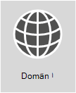

# <a name="external-domain-name-system-records-for-office-365"></a><span data-ttu-id="0cbf6-103">Externa DNS-poster för Office 365</span><span class="sxs-lookup"><span data-stu-id="0cbf6-103">External Domain Name System records for Office 365</span></span>

|||
|:-----|:-----|
||<span data-ttu-id="0cbf6-105">**Vill du se en anpassad lista över DNS-posterna för din Office 365-organisation?**</span><span class="sxs-lookup"><span data-stu-id="0cbf6-105">**Want to see a customized list of DNS records for your Office 365 organization?**</span></span> <span data-ttu-id="0cbf6-106">Du [hittar den information du behöver för att skapa Office 365 DNS-poster ](https://support.office.microsoft.com/article/Gather-the-information-you-need-to-create-Office-365-DNS-records-77f90d4a-dc7f-4f09-8972-c1b03ea85a67) för din domän i Office 365.</span><span class="sxs-lookup"><span data-stu-id="0cbf6-106">You can [find the info you need to create Office 365 DNS records](https://support.office.microsoft.com/article/Gather-the-information-you-need-to-create-Office-365-DNS-records-77f90d4a-dc7f-4f09-8972-c1b03ea85a67) for your domain in Office 365.</span></span>  <br/> <span data-ttu-id="0cbf6-107">**Vill du ha steg för steg instruktioner för hur du lägger till dessa poster hos domänens DNS-värd, t. ex. GoDaddy eller eNom?**</span><span class="sxs-lookup"><span data-stu-id="0cbf6-107">**Need step-by-step help to add these records at your domain's DNS host, such as GoDaddy or eNom?**</span></span> <span data-ttu-id="0cbf6-108">[Hitta länkar till steg för steg instruktioner för många vanliga DNS-värdar](../admin/get-help-with-domains/create-dns-records-at-any-dns-hosting-provider.md).</span><span class="sxs-lookup"><span data-stu-id="0cbf6-108">[Find links to step-by-step instructions for many popular DNS hosts](../admin/get-help-with-domains/create-dns-records-at-any-dns-hosting-provider.md).</span></span> <br/>  <span data-ttu-id="0cbf6-109">**Hänger du kvar för att använda referenslistan för en egen anpassad distribution?**</span><span class="sxs-lookup"><span data-stu-id="0cbf6-109">**Sticking around to use the reference list for your own custom deployment?**</span></span> <span data-ttu-id="0cbf6-110">Nedanstående lista bör användas som referens för en anpassad Office 365-distribution.</span><span class="sxs-lookup"><span data-stu-id="0cbf6-110">The below list should be used as a reference for your custom Office 365 deployment.</span></span> <span data-ttu-id="0cbf6-111">Du måste välj vilka poster som gäller för din organisation och fylla i lämpliga värden.</span><span class="sxs-lookup"><span data-stu-id="0cbf6-111">You will need to select which records apply to your organization and fill in the appropriate values.</span></span> <br/> <span data-ttu-id="0cbf6-112">**Gå tillbaka till**[Nätverksplanering och prestandajustering för Office 365](./network-planning-and-performance.md)..</span><span class="sxs-lookup"><span data-stu-id="0cbf6-112">**Go back to** [Network planning and performance tuning for Office 365](./network-planning-and-performance.md).</span></span>  <br/> |

<span data-ttu-id="0cbf6-113">Ofta är SPF-och MX-posterna svårast att reda ut. Vi har uppdaterat vår vägledning för SPF-poster i slutet av den här artikeln.</span><span class="sxs-lookup"><span data-stu-id="0cbf6-113">Often the SPF and MX records are the hardest to figure out. We've updated our SPF records guidance at the end of this article.</span></span> <span data-ttu-id="0cbf6-114">Det viktiga att komma ihåg är att _du bara kan ha en enda SPF-post för domänen_.</span><span class="sxs-lookup"><span data-stu-id="0cbf6-114">The important thing to remember is that _you can only have a single SPF record for your domain_.</span></span> <span data-ttu-id="0cbf6-115">Du kan ha flera MX-poster men det kan orsaka problem med e-postleveranser.</span><span class="sxs-lookup"><span data-stu-id="0cbf6-115">You can have multiple MX records; however, that can cause problems for mail delivery.</span></span> <span data-ttu-id="0cbf6-116">Om du har en enda MX-post som dirigerar e-post till ett e-postsystem undviker du många möjliga problem.</span><span class="sxs-lookup"><span data-stu-id="0cbf6-116">Having a single MX record that directs email to one mail system removes many potential problems.</span></span>
  
<span data-ttu-id="0cbf6-117">Avsnitten nedan är ordnade per tjänst i Office 365.</span><span class="sxs-lookup"><span data-stu-id="0cbf6-117">The sections below are organized by service in Office 365.</span></span> <span data-ttu-id="0cbf6-118">För att se en anpassad lista över Office 365 DNS-posterna för din domän, loggar du in på Office 365 och [ du hittar här den information du behöver för att skapa Office 365 DNS-postes](https://support.office.com/article/77f90d4a-dc7f-4f09-8972-c1b03ea85a67).</span><span class="sxs-lookup"><span data-stu-id="0cbf6-118">To see a customized list of the Office 365 DNS records for your domain, sign in to Office 365 and [Gather the information you need to create Office 365 DNS records](https://support.office.com/article/77f90d4a-dc7f-4f09-8972-c1b03ea85a67).</span></span>
  
## <a name="external-dns-records-required-for-office-365-core-services"></a><span data-ttu-id="0cbf6-119">Externa DNS-poster som krävs för Office 365 (kärntjänster)</span><span class="sxs-lookup"><span data-stu-id="0cbf6-119">External DNS records required for Office 365 (core services)</span></span>
<span data-ttu-id="0cbf6-120"><a name="BKMK_ReqdCore"> </a></span><span class="sxs-lookup"><span data-stu-id="0cbf6-120"><a name="BKMK_ReqdCore"> </a></span></span>

<span data-ttu-id="0cbf6-121">Alla Office 365-kunder måste lägga till två poster i sin externa DNS.</span><span class="sxs-lookup"><span data-stu-id="0cbf6-121">Every Office 365 customer needs to add two records to their external DNS.</span></span> <span data-ttu-id="0cbf6-122">Den första CNAME-posten ser till att Office 365 kan dirigera arbetsstationer att autentisera med lämplig identitetsplattform.</span><span class="sxs-lookup"><span data-stu-id="0cbf6-122">The first CNAME record ensures that Office 365 can direct workstations to authenticate with the appropriate identity platform.</span></span> <span data-ttu-id="0cbf6-123">Den andra obligatoriska posten är till för att bevisa att du äger domännamnet.</span><span class="sxs-lookup"><span data-stu-id="0cbf6-123">The second required record is to prove you own your domain name.</span></span>
  
||||
|:-----|:-----|:-----|
|<span data-ttu-id="0cbf6-124">**DNS-post**</span><span class="sxs-lookup"><span data-stu-id="0cbf6-124">**DNS record**</span></span> <br/> |<span data-ttu-id="0cbf6-125">**Syfte**</span><span class="sxs-lookup"><span data-stu-id="0cbf6-125">**Purpose**</span></span> <br/> |<span data-ttu-id="0cbf6-126">**Värde som ska användas**</span><span class="sxs-lookup"><span data-stu-id="0cbf6-126">**Value to use**</span></span> <br/> |
|<span data-ttu-id="0cbf6-127">**CNAME**</span><span class="sxs-lookup"><span data-stu-id="0cbf6-127">**CNAME**</span></span> <br/> <span data-ttu-id="0cbf6-128">**(Serie)**</span><span class="sxs-lookup"><span data-stu-id="0cbf6-128">**(Suite)**</span></span> <br/> |<span data-ttu-id="0cbf6-129">Används av Office 365 för att dirigera autentiseringen till rätt identitetsplattform.</span><span class="sxs-lookup"><span data-stu-id="0cbf6-129">Used by Office 365 to direct authentication to the correct identity platform.</span></span> [<span data-ttu-id="0cbf6-130">Mer information</span><span class="sxs-lookup"><span data-stu-id="0cbf6-130">More information</span></span>](../admin/services-in-china/purpose-of-cname.md?viewFallbackFrom=o365-worldwide) <br/> <span data-ttu-id="0cbf6-131">**Obs1:** Detta CNAME gäller bara för Office 365 som drivs av 21Vianet.</span><span class="sxs-lookup"><span data-stu-id="0cbf6-131">**Note:** This CNAME only applies to Office 365 operated by 21Vianet.</span></span> [<span data-ttu-id="0cbf6-132">Mer information</span><span class="sxs-lookup"><span data-stu-id="0cbf6-132">More information</span></span>](/office365/servicedescriptions/office-365-platform-service-description/office-365-operated-by-21vianet)  |<span data-ttu-id="0cbf6-133">**Alias:** msoid</span><span class="sxs-lookup"><span data-stu-id="0cbf6-133">**Alias:** msoid</span></span>  <br/> <span data-ttu-id="0cbf6-134">**Target:** clientconfig.partner.microsoftonline-p.net.cn</span><span class="sxs-lookup"><span data-stu-id="0cbf6-134">**Target:** clientconfig.partner.microsoftonline-p.net.cn</span></span>  <br/> |
|<span data-ttu-id="0cbf6-135">**TXT**</span><span class="sxs-lookup"><span data-stu-id="0cbf6-135">**TXT**</span></span> <br/> <span data-ttu-id="0cbf6-136">**(Domänverifiering)**</span><span class="sxs-lookup"><span data-stu-id="0cbf6-136">**(Domain verification)**</span></span> <br/> |<span data-ttu-id="0cbf6-137">Används av Office 365 för att verifiera att du äger domänen.</span><span class="sxs-lookup"><span data-stu-id="0cbf6-137">Used by Office 365 to verify only that you own your domain.</span></span> <span data-ttu-id="0cbf6-138">Det påverkar inte något annat.</span><span class="sxs-lookup"><span data-stu-id="0cbf6-138">It doesn't affect anything else.</span></span>  <br/> |<span data-ttu-id="0cbf6-139">**Värd:** @ (eller, för vissa DNS-värdtjänster, ditt domännamn)</span><span class="sxs-lookup"><span data-stu-id="0cbf6-139">**Host:** @ (or, for some DNS hosting providers, your domain name)</span></span>  <br/> <span data-ttu-id="0cbf6-140">**TXT-värde:** _en textsträng som tillhandahålls av_ Office 365</span><span class="sxs-lookup"><span data-stu-id="0cbf6-140">**TXT Value:** _A text string provided by_ Office 365</span></span>  <br/> <span data-ttu-id="0cbf6-141">Office 365 guiden för **domänkonfiguration** anger värdena du använder för att skapa den här posten.</span><span class="sxs-lookup"><span data-stu-id="0cbf6-141">The Office 365 **domain setup wizard** provides the values that you use to create this record.</span></span>  <br/> |


## <a name="external-dns-records-required-for-email-in-office-365-exchange-online"></a><span data-ttu-id="0cbf6-142">Externa DNS-poster som krävs för e-post i Office 365 (Exchange Online)</span><span class="sxs-lookup"><span data-stu-id="0cbf6-142">External DNS records required for email in Office 365 (Exchange Online)</span></span>
<span data-ttu-id="0cbf6-143"><a name="BKMK_ReqdCore"> </a></span><span class="sxs-lookup"><span data-stu-id="0cbf6-143"><a name="BKMK_ReqdCore"> </a></span></span>

<span data-ttu-id="0cbf6-144">E.post i Office 365 kräver flera olika poster.</span><span class="sxs-lookup"><span data-stu-id="0cbf6-144">Email in Office 365 requires several different records.</span></span> <span data-ttu-id="0cbf6-145">De tre primära posterna som alla kunder ska använda är Autodiscover, MX och SPF.</span><span class="sxs-lookup"><span data-stu-id="0cbf6-145">The three primary records that all customers should use are the Autodiscover, MX, and SPF records.</span></span>
  
- <span data-ttu-id="0cbf6-146">Med **Autodiscover-posten** kan klientdatorer automatiskt hitta Exchange och konfigurera klienten på rätt sätt.</span><span class="sxs-lookup"><span data-stu-id="0cbf6-146">**The Autodiscover record** allows client computers to automatically find Exchange and configure the client properly.</span></span>

- <span data-ttu-id="0cbf6-147">**MX-posten** berättar för andra e-postsystem vart e-posten ska skickas för din domän.</span><span class="sxs-lookup"><span data-stu-id="0cbf6-147">**The MX record** tells other mail systems where to send email for your domain.</span></span> <span data-ttu-id="0cbf6-148">**Obs!:** När du ändrar e-posten till Office 365, genom att uppdatera domänens MX-post, levereras ALL e-post som skickas till den domänen till Office 365.</span><span class="sxs-lookup"><span data-stu-id="0cbf6-148">**Note:** When you change your email to Office 365, by updating your domain's MX record, ALL email sent to that domain will start coming to Office 365.</span></span>  
<span data-ttu-id="0cbf6-149">Vill du bara att några e-postadresser går över till Office 365?</span><span class="sxs-lookup"><span data-stu-id="0cbf6-149">Do you just want to switch a few email addresses to Office 365?</span></span> <span data-ttu-id="0cbf6-150">Du kan [ pilottesta Office 365 med några e-postadresser på din anpassade domän.](https://support.office.com/article/39cee536-6a03-40cf-b9c1-f301bb6001d7).</span><span class="sxs-lookup"><span data-stu-id="0cbf6-150">You can [Pilot Office 365 with a few email addresses on your custom domain](https://support.office.com/article/39cee536-6a03-40cf-b9c1-f301bb6001d7).</span></span>

- <span data-ttu-id="0cbf6-151">**TXT-posten för SPF** används av mottagar-e-postsystem för att verifiera att den server som skickar din e-post är den du godkänner.</span><span class="sxs-lookup"><span data-stu-id="0cbf6-151">**The TXT record for SPF** is used by recipient email systems to validate that the server sending your email is one that you approve.</span></span> <span data-ttu-id="0cbf6-152">Det hjälper till att förhindra problem som förfalskning och nätfiske.</span><span class="sxs-lookup"><span data-stu-id="0cbf6-152">This helps prevent problems like email spoofing and phishing.</span></span> <span data-ttu-id="0cbf6-153">Se [Externa DNS-poster som krävs för SPF](external-domain-name-system-records.md#BKMK_SPFrecords)i den här artikeln för att få hjälp att förstå vad du ska inkludera i posten.</span><span class="sxs-lookup"><span data-stu-id="0cbf6-153">See the [External DNS records required for SPF](external-domain-name-system-records.md#BKMK_SPFrecords) in this article to help you understand what to include in your record.</span></span>

<span data-ttu-id="0cbf6-154">E-postkunder som använder Exchange-federation behöver även CNAME- och TXT-posten som visas längst ned i tabellen.</span><span class="sxs-lookup"><span data-stu-id="0cbf6-154">Email customers who are using Exchange Federation will also need the additional CNAME and TXT record listed at the bottom of the table.</span></span>
  
||||
|:-----|:-----|:-----|
|<span data-ttu-id="0cbf6-155">**DNS-post**</span><span class="sxs-lookup"><span data-stu-id="0cbf6-155">**DNS record**</span></span> <br/> |<span data-ttu-id="0cbf6-156">**Syfte**</span><span class="sxs-lookup"><span data-stu-id="0cbf6-156">**Purpose**</span></span> <br/> |<span data-ttu-id="0cbf6-157">**Värde som ska användas**</span><span class="sxs-lookup"><span data-stu-id="0cbf6-157">**Value to use**</span></span> <br/> |
|<span data-ttu-id="0cbf6-158">**CNAME**</span><span class="sxs-lookup"><span data-stu-id="0cbf6-158">**CNAME**</span></span> <br/> <span data-ttu-id="0cbf6-159">**(Exchange Online)**</span><span class="sxs-lookup"><span data-stu-id="0cbf6-159">**(Exchange Online)**</span></span> <br/> |<span data-ttu-id="0cbf6-160">Hjälper Outlook-klienter att enkelt ansluta till Exchange Online-tjänsten genom att använda tjänsten Automatisk upptäckt.</span><span class="sxs-lookup"><span data-stu-id="0cbf6-160">Helps Outlook clients to easily connect to the Exchange Online service by using the Autodiscover service.</span></span> <span data-ttu-id="0cbf6-161">Automatisk upptäckt hittar automatiskt rätt Exchange Server-värd och konfigurerar Outlook för användarna.</span><span class="sxs-lookup"><span data-stu-id="0cbf6-161">Autodiscover automatically finds the correct Exchange Server host and configures Outlook for users.</span></span>  <br/> |<span data-ttu-id="0cbf6-162">**Alias:** Autodiscover</span><span class="sxs-lookup"><span data-stu-id="0cbf6-162">**Alias:** Autodiscover</span></span>  <br/> <span data-ttu-id="0cbf6-163">**Target:** autodiscover.outlook.com</span><span class="sxs-lookup"><span data-stu-id="0cbf6-163">**Target:** autodiscover.outlook.com</span></span>  <br/> |
|<span data-ttu-id="0cbf6-164">**MX**</span><span class="sxs-lookup"><span data-stu-id="0cbf6-164">**MX**</span></span> <br/> <span data-ttu-id="0cbf6-165">**(Exchange Online)**</span><span class="sxs-lookup"><span data-stu-id="0cbf6-165">**(Exchange Online)**</span></span> <br/> |<span data-ttu-id="0cbf6-166">Skickar ingående e-post för domänen till Exchange Online-tjänsten i Office 365.</span><span class="sxs-lookup"><span data-stu-id="0cbf6-166">Sends incoming mail for your domain to the Exchange Online service in Office 365.</span></span>  <br/> [!NOTE] <span data-ttu-id="0cbf6-167">När e-posten flödar till Exchange Online tar du bort MX-posterna som pekar på ditt gamla system.</span><span class="sxs-lookup"><span data-stu-id="0cbf6-167">Once email is flowing to Exchange Online, you should remove the MX records that are pointing to your old system.</span></span>   |<span data-ttu-id="0cbf6-168">**Domän:** till exempel contoso.com</span><span class="sxs-lookup"><span data-stu-id="0cbf6-168">**Domain:** For example, contoso.com</span></span>  <br/> <span data-ttu-id="0cbf6-169">**E-postmålserver:**\<MX token\>.mail.protection.outlook.com</span><span class="sxs-lookup"><span data-stu-id="0cbf6-169">**Target email server:**\<MX token\>.mail.protection.outlook.com</span></span>  <br/> <span data-ttu-id="0cbf6-170">**Inställning/prioritet:** lägre än andra MX-poster (det ser till att e-posten levereras till Exchange Online) – t.ex. 1 eller ”låg”</span><span class="sxs-lookup"><span data-stu-id="0cbf6-170">**Preference/Priority:** Lower than any other MX records (this ensures mail is delivered to Exchange Online) - for example 1 or 'low'</span></span>  <br/>  <span data-ttu-id="0cbf6-171">Hitta din \<MX token\>genom att följa dessa anvisningar:</span><span class="sxs-lookup"><span data-stu-id="0cbf6-171">Find your \<MX token\> by following these steps:</span></span>  <br/>  <span data-ttu-id="0cbf6-172">Logga in på Office 365, gå till Office 365 administratörsdomäner \>.</span><span class="sxs-lookup"><span data-stu-id="0cbf6-172">Sign in to Office 365, go to Office 365 admin \> Domains.</span></span>  <br/>  <span data-ttu-id="0cbf6-173">Välj Åtgärda problem i kolumnen Åtgärd för domänen.</span><span class="sxs-lookup"><span data-stu-id="0cbf6-173">In the Action column for your domain, choose Fix issues.</span></span>  <br/>  <span data-ttu-id="0cbf6-174">Välj Vad behöver jag åtgärda i avsnittet MX-poster.</span><span class="sxs-lookup"><span data-stu-id="0cbf6-174">In the MX records section, choose What do I fix?</span></span>  <br/>  <span data-ttu-id="0cbf6-175">Följ anvisningarna på sidan för att uppdatera MX-posten.</span><span class="sxs-lookup"><span data-stu-id="0cbf6-175">Follow the directions on this page to update your MX record.</span></span>  <br/> [<span data-ttu-id="0cbf6-176">Vad är MX-prioritet?</span><span class="sxs-lookup"><span data-stu-id="0cbf6-176">What is MX priority?</span></span>](../admin/setup/domains-faq.yml) <br/> |
|<span data-ttu-id="0cbf6-177">**SPF (TXT)**</span><span class="sxs-lookup"><span data-stu-id="0cbf6-177">**SPF (TXT)**</span></span> <br/> <span data-ttu-id="0cbf6-178">**(Exchange Online)**</span><span class="sxs-lookup"><span data-stu-id="0cbf6-178">**(Exchange Online)**</span></span>  <br/> |<span data-ttu-id="0cbf6-179">Förhindrar att andra personer använder din domän till att skicka skräppost eller annan skadlig e-post.</span><span class="sxs-lookup"><span data-stu-id="0cbf6-179">Helps to prevent other people from using your domain to send spam or other malicious email.</span></span> <span data-ttu-id="0cbf6-180">SPF-poster (Sender Policy Framework) fungerar genom att identifiera servrarna som har godkänts för att skicka e-post från domänen.</span><span class="sxs-lookup"><span data-stu-id="0cbf6-180">Sender policy framework (SPF) records work by identifying the servers that are authorized to send email from your domain.</span></span>  <br/> |[<span data-ttu-id="0cbf6-181">Externa DNS-poster som krävs för SPF</span><span class="sxs-lookup"><span data-stu-id="0cbf6-181">External DNS records required for SPF</span></span>](external-domain-name-system-records.md#BKMK_SPFrecords) <br/> |
|<span data-ttu-id="0cbf6-182">**TXT**</span><span class="sxs-lookup"><span data-stu-id="0cbf6-182">**TXT**</span></span> <br/> <span data-ttu-id="0cbf6-183">**(Exchange federation)**</span><span class="sxs-lookup"><span data-stu-id="0cbf6-183">**(Exchange federation)**</span></span> <br/> |<span data-ttu-id="0cbf6-184">Används för Exchange-federation för hybriddistribution.</span><span class="sxs-lookup"><span data-stu-id="0cbf6-184">Used for Exchange federation for hybrid deployment.</span></span>  <br/> |<span data-ttu-id="0cbf6-185">**TXT-post 1:** Till exempel contoso.com och tillhörande särskilt genererad hash-text som domänbevis (t.ex. Y96nu89138789315669824)</span><span class="sxs-lookup"><span data-stu-id="0cbf6-185">**TXT record 1:** For example, contoso.com and associated custom-generated, domain-proof hash text (for example, Y96nu89138789315669824)</span></span>  <br/> <span data-ttu-id="0cbf6-186">**TXT-post 2:** till exempel exchangedelegation.contoso.com och tillhörande särskilt genererad hash-text som domänbevis (t.ex.Y3259071352452626169)</span><span class="sxs-lookup"><span data-stu-id="0cbf6-186">**TXT record 2:** For example, exchangedelegation.contoso.com and associated custom-generated, domain-proof hash text (for example, Y3259071352452626169)</span></span>  <br/> |
|<span data-ttu-id="0cbf6-187">**CNAME**</span><span class="sxs-lookup"><span data-stu-id="0cbf6-187">**CNAME**</span></span> <br/> <span data-ttu-id="0cbf6-188">**(Exchange federation)**</span><span class="sxs-lookup"><span data-stu-id="0cbf6-188">**(Exchange federation)**</span></span> <br/> |<span data-ttu-id="0cbf6-189">Hjälper Outlook-klienter att enkelt ansluta till Exchange Online-tjänsten genom att använda tjänsten Automatisk upptäckt när företaget använder Exchange-federation.</span><span class="sxs-lookup"><span data-stu-id="0cbf6-189">Helps Outlook clients to easily connect to the Exchange Online service by using the Autodiscover service when your company is using Exchange federation.</span></span> <span data-ttu-id="0cbf6-190">Automatisk upptäckt hittar automatiskt rätt Exchange Server-värd och konfigurerar Outlook för dina användare.</span><span class="sxs-lookup"><span data-stu-id="0cbf6-190">Autodiscover automatically finds the correct Exchange Server host and configures Outlook for your users.</span></span>  <br/> |<span data-ttu-id="0cbf6-191">**Alias:** till exempel Autodiscover.service.contoso.com</span><span class="sxs-lookup"><span data-stu-id="0cbf6-191">**Alias:** For example, Autodiscover.service.contoso.com</span></span>  <br/> <span data-ttu-id="0cbf6-192">**Target:** autodiscover.outlook.com</span><span class="sxs-lookup"><span data-stu-id="0cbf6-192">**Target:** autodiscover.outlook.com</span></span>  <br/> |


## <a name="external-dns-records-required-for-skype-for-business-online"></a><span data-ttu-id="0cbf6-193">Externa DNS-poster som krävs för Skype för företag Online</span><span class="sxs-lookup"><span data-stu-id="0cbf6-193">External DNS records required for Skype for Business Online</span></span>
<span data-ttu-id="0cbf6-194"><a name="BKMK_ReqdCore"> </a></span><span class="sxs-lookup"><span data-stu-id="0cbf6-194"><a name="BKMK_ReqdCore"> </a></span></span>

<span data-ttu-id="0cbf6-195">Det finns olika åtgärder att vidta när du använder [Office 365 URL: er och IP-adressintervall ](https://support.office.com/article/8548a211-3fe7-47cb-abb1-355ea5aa88a2#BKMK_LYO) för att kontrollera att nätverket är konfigurerat på rätt sätt.</span><span class="sxs-lookup"><span data-stu-id="0cbf6-195">There are specific steps to take when you use  [Office 365 URLs and IP address ranges](https://support.office.com/article/8548a211-3fe7-47cb-abb1-355ea5aa88a2#BKMK_LYO) to make sure your network is configured correctly.</span></span>

> [!NOTE]
> <span data-ttu-id="0cbf6-196">De här DNS-posterna gäller även för Teams, särskilt i ett hybrid Teams och Skype för företag-scenario, där vissa Federations problem kan uppstå.</span><span class="sxs-lookup"><span data-stu-id="0cbf6-196">These DNS records also apply to Teams, especially in a hybrid Teams and Skype for Business scenario, where certain federation issues could arise.</span></span>
  
||||
|:-----|:-----|:-----|
|<span data-ttu-id="0cbf6-197">**DNS-post**</span><span class="sxs-lookup"><span data-stu-id="0cbf6-197">**DNS record**</span></span> <br/> |<span data-ttu-id="0cbf6-198">**Syfte**</span><span class="sxs-lookup"><span data-stu-id="0cbf6-198">**Purpose**</span></span> <br/> |<span data-ttu-id="0cbf6-199">**Värde som ska användas**</span><span class="sxs-lookup"><span data-stu-id="0cbf6-199">**Value to use**</span></span> <br/> |
|<span data-ttu-id="0cbf6-200">**SRV**</span><span class="sxs-lookup"><span data-stu-id="0cbf6-200">**SRV**</span></span> <br/> <span data-ttu-id="0cbf6-201">**(Skype for företag online)**</span><span class="sxs-lookup"><span data-stu-id="0cbf6-201">**(Skype for Business Online)**</span></span> <br/> |<span data-ttu-id="0cbf6-202">Gör så att Office 365-domänen kan dela funktioner för snabbmeddelanden med externa klienter genom att aktivera SIP-federation.</span><span class="sxs-lookup"><span data-stu-id="0cbf6-202">Allows your Office 365 domain to share instant messaging (IM) features with external clients by enabling SIP federation.</span></span> <span data-ttu-id="0cbf6-203">Mer information finns i [URL-adresser och IP-adressintervall för Office 365](https://support.office.com/article/8548a211-3fe7-47cb-abb1-355ea5aa88a2#BKMK_LYO).</span><span class="sxs-lookup"><span data-stu-id="0cbf6-203">Read more about [Office 365 URLs and IP address ranges](https://support.office.com/article/8548a211-3fe7-47cb-abb1-355ea5aa88a2#BKMK_LYO).</span></span>  <br/> |<span data-ttu-id="0cbf6-204">**Tjänst**: sipfederationtls</span><span class="sxs-lookup"><span data-stu-id="0cbf6-204">**Service:** sipfederationtls</span></span>  <br/> <span data-ttu-id="0cbf6-205">**Protokoll:** TCP</span><span class="sxs-lookup"><span data-stu-id="0cbf6-205">**Protocol:** TCP</span></span>  <br/> <span data-ttu-id="0cbf6-206">**Prioritet:** 100</span><span class="sxs-lookup"><span data-stu-id="0cbf6-206">**Priority:** 100</span></span>  <br/> <span data-ttu-id="0cbf6-207">**Vikt:** 1</span><span class="sxs-lookup"><span data-stu-id="0cbf6-207">**Weight:** 1</span></span>  <br/> <span data-ttu-id="0cbf6-208">**Port:** 5061</span><span class="sxs-lookup"><span data-stu-id="0cbf6-208">**Port:** 5061</span></span>  <br/> <span data-ttu-id="0cbf6-209">**Target:** sipfed.online.lync.com</span><span class="sxs-lookup"><span data-stu-id="0cbf6-209">**Target:** sipfed.online.lync.com</span></span>  <br/> <span data-ttu-id="0cbf6-210">**Obs!:** Om brandväggen eller proxyservern blockerar SRV-sökningar på en extern DNS bör du lägga till den här posten i den interna DNS-posten.</span><span class="sxs-lookup"><span data-stu-id="0cbf6-210">**Note:** If the firewall or proxy server blocks SRV lookups on an external DNS, you should add this record to the internal DNS record.</span></span>   |
|<span data-ttu-id="0cbf6-211">**SRV**</span><span class="sxs-lookup"><span data-stu-id="0cbf6-211">**SRV**</span></span> <br/> <span data-ttu-id="0cbf6-212">**(Skype for företag online)**</span><span class="sxs-lookup"><span data-stu-id="0cbf6-212">**(Skype for Business Online)**</span></span> <br/> |<span data-ttu-id="0cbf6-213">Används av Skype för företag för att koordinera flödet av information mellan Lync-klienter.</span><span class="sxs-lookup"><span data-stu-id="0cbf6-213">Used by Skype for Business to coordinate the flow of information between Lync clients.</span></span>  <br/> |<span data-ttu-id="0cbf6-214">**Tjänst**: sip</span><span class="sxs-lookup"><span data-stu-id="0cbf6-214">**Service:** sip</span></span>  <br/> <span data-ttu-id="0cbf6-215">**Protokoll**: TLS</span><span class="sxs-lookup"><span data-stu-id="0cbf6-215">**Protocol:** TLS</span></span>  <br/> <span data-ttu-id="0cbf6-216">**Prioritet:** 100</span><span class="sxs-lookup"><span data-stu-id="0cbf6-216">**Priority:** 100</span></span>  <br/> <span data-ttu-id="0cbf6-217">**Vikt:** 1</span><span class="sxs-lookup"><span data-stu-id="0cbf6-217">**Weight:** 1</span></span>  <br/> <span data-ttu-id="0cbf6-218">**Port:** 443</span><span class="sxs-lookup"><span data-stu-id="0cbf6-218">**Port:** 443</span></span>  <br/> <span data-ttu-id="0cbf6-219">**Target**: sipdir.online.lync.com</span><span class="sxs-lookup"><span data-stu-id="0cbf6-219">**Target:** sipdir.online.lync.com</span></span>  <br/> |
|<span data-ttu-id="0cbf6-220">**CNAME**</span><span class="sxs-lookup"><span data-stu-id="0cbf6-220">**CNAME**</span></span> <br/> <span data-ttu-id="0cbf6-221">**(Skype for företag online)**</span><span class="sxs-lookup"><span data-stu-id="0cbf6-221">**(Skype for Business Online)**</span></span> <br/> |<span data-ttu-id="0cbf6-222">Används av Lync-klienten för att hjälpa till att hitta Skype för företag online-tjänsten och logga in.</span><span class="sxs-lookup"><span data-stu-id="0cbf6-222">Used by the Lync client to help find the Skype for Business Online service and sign in.</span></span>  <br/> |<span data-ttu-id="0cbf6-223">**Alias:** sip</span><span class="sxs-lookup"><span data-stu-id="0cbf6-223">**Alias:** sip</span></span>  <br/> <span data-ttu-id="0cbf6-224">**Target**: sipdir.online.lync.com</span><span class="sxs-lookup"><span data-stu-id="0cbf6-224">**Target:** sipdir.online.lync.com</span></span>  <br/> <span data-ttu-id="0cbf6-225">Mer information finns i [URL-adresser och IP-adressintervall för Office 365](https://support.office.com/article/8548a211-3fe7-47cb-abb1-355ea5aa88a2#BKMK_LYO).</span><span class="sxs-lookup"><span data-stu-id="0cbf6-225">For more information, see [Office 365 URLs and IP address ranges](https://support.office.com/article/8548a211-3fe7-47cb-abb1-355ea5aa88a2#BKMK_LYO).</span></span>  <br/> |
|<span data-ttu-id="0cbf6-226">**CNAME**</span><span class="sxs-lookup"><span data-stu-id="0cbf6-226">**CNAME**</span></span> <br/> <span data-ttu-id="0cbf6-227">**(Skype for företag online)**</span><span class="sxs-lookup"><span data-stu-id="0cbf6-227">**(Skype for Business Online)**</span></span> <br/> |<span data-ttu-id="0cbf6-228">Används av Lync-mobilklienten för att hjälpa till att hitta Skype för företag online-tjänsten och logga in.</span><span class="sxs-lookup"><span data-stu-id="0cbf6-228">Used by the Lync mobile client to help find the Skype for Business Online service and sign in.</span></span>  <br/> |<span data-ttu-id="0cbf6-229">**Alias:** lyncdiscover</span><span class="sxs-lookup"><span data-stu-id="0cbf6-229">**Alias:** lyncdiscover</span></span>  <br/> <span data-ttu-id="0cbf6-230">**Target:** webdir.online.lync.com</span><span class="sxs-lookup"><span data-stu-id="0cbf6-230">**Target:** webdir.online.lync.com</span></span>  <br/> |

## <a name="external-dns-records-required-for-office-365-single-sign-on"></a><span data-ttu-id="0cbf6-231">Externa DNS-poster krävs för enkel inloggning för Office 365</span><span class="sxs-lookup"><span data-stu-id="0cbf6-231">External DNS records required for Office 365 Single Sign-On</span></span>
<span data-ttu-id="0cbf6-232"><a name="BKMK_ReqdCore"> </a></span><span class="sxs-lookup"><span data-stu-id="0cbf6-232"><a name="BKMK_ReqdCore"> </a></span></span>

||||
|:-----|:-----|:-----|
|<span data-ttu-id="0cbf6-233">**DNS-post**</span><span class="sxs-lookup"><span data-stu-id="0cbf6-233">**DNS record**</span></span> <br/> |<span data-ttu-id="0cbf6-234">**Syfte**</span><span class="sxs-lookup"><span data-stu-id="0cbf6-234">**Purpose**</span></span> <br/> |<span data-ttu-id="0cbf6-235">**Värde som ska användas**</span><span class="sxs-lookup"><span data-stu-id="0cbf6-235">**Value to use**</span></span> <br/> |
|<span data-ttu-id="0cbf6-236">**Värd (A)**</span><span class="sxs-lookup"><span data-stu-id="0cbf6-236">**Host (A)**</span></span> <br/> |<span data-ttu-id="0cbf6-237">Används för enkel inloggning (SSO).</span><span class="sxs-lookup"><span data-stu-id="0cbf6-237">Used for single sign-on (SSO).</span></span> <span data-ttu-id="0cbf6-238">Det anger slutpunkten för externa användare (och lokala användare om du vill) för att ansluta till serverproxy för din Active Directory Federation Services (AD FS) eller belastningsutjämnad virtuell IP (VIP).</span><span class="sxs-lookup"><span data-stu-id="0cbf6-238">It provides the endpoint for your off-premises users (and on-premises users, if you like) to connect to your Active Directory Federation Services (AD FS) federation server proxies or load-balanced virtual IP (VIP).</span></span>  <br/> |<span data-ttu-id="0cbf6-239">**Mål:** till exempel sts.contoso.com</span><span class="sxs-lookup"><span data-stu-id="0cbf6-239">**Target:** For example, sts.contoso.com</span></span>  <br/> |

## <a name="external-dns-records-required-for-spf"></a><span data-ttu-id="0cbf6-240">Externa DNS-poster som krävs för SPF</span><span class="sxs-lookup"><span data-stu-id="0cbf6-240">External DNS records required for SPF</span></span>
<span data-ttu-id="0cbf6-241"><a name="BKMK_SPFrecords"> </a></span><span class="sxs-lookup"><span data-stu-id="0cbf6-241"><a name="BKMK_SPFrecords"> </a></span></span>

> [!IMPORTANT]
> <span data-ttu-id="0cbf6-242">SPF har utformats för att hjälpa till att förhindra förfalskning men det finns förfalskningsmetoder som SPF inte skyddar mot.</span><span class="sxs-lookup"><span data-stu-id="0cbf6-242">SPF is designed to help prevent spoofing, but there are spoofing techniques that SPF cannot protect against.</span></span> <span data-ttu-id="0cbf6-243">För att kunna skydda mot dessa ska du, efter att ha konfigurerat SPF, även konfigurera DKIM och DMARC för Office 365.</span><span class="sxs-lookup"><span data-stu-id="0cbf6-243">In order to protect against these, once you have set up SPF, you should also configure DKIM and DMARC for Office 365.</span></span> <span data-ttu-id="0cbf6-244">Information om hur du kommer igång finns i [Använda DKIM för att validera utgående e-post som skickas från din domän i Office 365](../security/defender-365-security/use-dkim-to-validate-outbound-email.md).</span><span class="sxs-lookup"><span data-stu-id="0cbf6-244">To get started, see [Use DKIM to validate outbound email sent from your domain in Office 365](../security/defender-365-security/use-dkim-to-validate-outbound-email.md).</span></span> <span data-ttu-id="0cbf6-245">Därefter läser du [Använd DMARC för att validera e-post i Office 365](../security/defender-365-security/use-dmarc-to-validate-email.md).</span><span class="sxs-lookup"><span data-stu-id="0cbf6-245">Next, see [Use DMARC to validate email in Office 365](../security/defender-365-security/use-dmarc-to-validate-email.md).</span></span>
  
<span data-ttu-id="0cbf6-246">SPF-poster är TXT-poster som hjälper till att hindra andra personer från att använda domänen till att skicka skräppost eller annan skadlig e-post.</span><span class="sxs-lookup"><span data-stu-id="0cbf6-246">SPF records are TXT records that help to prevent other people from using your domain to send spam or other malicious email.</span></span> <span data-ttu-id="0cbf6-247">SPF-poster (Sender Policy Framework) fungerar genom att identifiera servrarna som har godkänts för att skicka e-post från domänen.</span><span class="sxs-lookup"><span data-stu-id="0cbf6-247">Sender policy framework (SPF) records work by identifying the servers that are authorized to send email from your domain.</span></span>
  
<span data-ttu-id="0cbf6-248">Du kan bara ha en SPF-post (dvs. en TXT-post som definierar SPF) för domänen.</span><span class="sxs-lookup"><span data-stu-id="0cbf6-248">You can only have one SPF record (that is, a TXT record that defines SPF) for your domain.</span></span> <span data-ttu-id="0cbf6-249">Den enda posten kan ha några olika inkluderingar men det totala antalet DNS-sökningar som görs får inte vara mer än 10 (det hjälper till att förhindra överbelastningsattacker, DoS).</span><span class="sxs-lookup"><span data-stu-id="0cbf6-249">That single record can have a few different inclusions but the total DNS lookups that result can't be more than 10 (this helps prevent denial of service attacks).</span></span> <span data-ttu-id="0cbf6-250">Se tabellen och andra exempel nedan som hjälp för hur du skapar eller uppdaterar rätt SPF-postvärden för din miljö.</span><span class="sxs-lookup"><span data-stu-id="0cbf6-250">See the table and other examples below to help you create or update the right SPF record values for your environment.</span></span>
  
### <a name="structure-of-an-spf-record"></a><span data-ttu-id="0cbf6-251">Strukturen för en SPF-post</span><span class="sxs-lookup"><span data-stu-id="0cbf6-251">Structure of an SPF record</span></span>

<span data-ttu-id="0cbf6-252">Alla SPF-poster består av tre delar: deklarationen att det är en SPF-post, domänerna och IP-adresserna som ska skicka e-post och en regel för verkställande.</span><span class="sxs-lookup"><span data-stu-id="0cbf6-252">All SPF records contain three parts: the declaration that it is an SPF record, the domains, and IP addresses that should be sending email, and an enforcement rule.</span></span> <span data-ttu-id="0cbf6-253">Du behöver alla tre i en giltig SPF-post.</span><span class="sxs-lookup"><span data-stu-id="0cbf6-253">You need all three in a valid SPF record.</span></span> <span data-ttu-id="0cbf6-254">Här är ett exempel på en gemensam SPF-post för Office 365 när du bara använder Exchange Online-e-post:</span><span class="sxs-lookup"><span data-stu-id="0cbf6-254">Here's an example of a common SPF record for Office 365 when you use only Exchange Online email:</span></span>
  
``` dns
TXT Name @
Values: v=spf1 include:spf.protection.outlook.com -all
```

<span data-ttu-id="0cbf6-255">Ett e-postsystem som tar emot e-post från din domän ser på SPF-posten, och om e-postservern som har skickat meddelandet är en Office 365-server accepteras meddelandet.</span><span class="sxs-lookup"><span data-stu-id="0cbf6-255">An email system that receives an email from your domain looks at the SPF record, and if the email server that sent the message was an Office 365 server, the message is accepted.</span></span> <span data-ttu-id="0cbf6-256">Om servern som har skickat meddelandet är ditt gamla e-postsystem eller ett skadligt system på Internet, t. ex, kan det hända att SPF-kontrollen inte fungerar och meddelandet inte kunde levereras.</span><span class="sxs-lookup"><span data-stu-id="0cbf6-256">If the server that sent the message was your old mail system or a malicious system on the Internet, for example, the SPF check might fail and the message wouldn't be delivered.</span></span> <span data-ttu-id="0cbf6-257">Det här hjälper dig att förhindra förfalsknings-och nätfiskemeddelanden.</span><span class="sxs-lookup"><span data-stu-id="0cbf6-257">Checks like this help to prevent spoofing and phishing messages.</span></span>
  
### <a name="choose-the-spf-record-structure-you-need"></a><span data-ttu-id="0cbf6-258">Välj den SPF-poststruktur du behöver</span><span class="sxs-lookup"><span data-stu-id="0cbf6-258">Choose the SPF record structure you need</span></span>

<span data-ttu-id="0cbf6-259">För scenarier där du inte bara använder Exchange Online-e-post för Office 365 (till exempel när du även använder e-post som kommer från SharePoint Online) kan du använda följande tabell för att avgöra vad som ska ingå i värdet för posten.</span><span class="sxs-lookup"><span data-stu-id="0cbf6-259">For scenarios where you're not just using Exchange Online email for Office 365 (for example, when you use email originating from SharePoint Online as well), use the following table to determine what to include in the value of the record.</span></span>
  
> [!NOTE]
> <span data-ttu-id="0cbf6-260">Om du har ett komplicerat scenario som till exempel omfattar Edge-e-postservrar för att hantera e-posttrafik via brandväggen, behöver du konfigurera en mer detaljerad SPF-post.</span><span class="sxs-lookup"><span data-stu-id="0cbf6-260">If you have a complicated scenario that includes, for example, edge email servers for managing email traffic across your firewall, you'll have a more detailed SPF record to set up.</span></span> <span data-ttu-id="0cbf6-261">Lära dig hur du kan[ konfigurera SPF-poster i Office 365 för att förhindra förfalskning](../security/defender-365-security/set-up-spf-in-office-365-to-help-prevent-spoofing.md).</span><span class="sxs-lookup"><span data-stu-id="0cbf6-261">Learn how: [Set up SPF records in Office 365 to help prevent spoofing](../security/defender-365-security/set-up-spf-in-office-365-to-help-prevent-spoofing.md).</span></span> <span data-ttu-id="0cbf6-262">Du kan också lära dig mer om hur SPF fungerar med Office 365 genom att läsa [Hur Office 365 använder Sender Policy Framework (SPF) för att förhindra förfalskning](../security/defender-365-security/how-office-365-uses-spf-to-prevent-spoofing.md).</span><span class="sxs-lookup"><span data-stu-id="0cbf6-262">You can also learn much more about how SPF works with Office 365 by reading [How Office 365 uses Sender Policy Framework (SPF) to help prevent spoofing](../security/defender-365-security/how-office-365-uses-spf-to-prevent-spoofing.md).</span></span>
  
| <span data-ttu-id="0cbf6-263">Tal</span><span class="sxs-lookup"><span data-stu-id="0cbf6-263">Number</span></span>|<span data-ttu-id="0cbf6-264">Om du använder...</span><span class="sxs-lookup"><span data-stu-id="0cbf6-264">If you're using…</span></span>  <br/> |<span data-ttu-id="0cbf6-265">Syfte</span><span class="sxs-lookup"><span data-stu-id="0cbf6-265">Purpose</span></span>  <br/> |<span data-ttu-id="0cbf6-266">Lägg till följande</span><span class="sxs-lookup"><span data-stu-id="0cbf6-266">Add these includes</span></span>  <br/> |
|:-----|:-----|:-----|:-----|
|<span data-ttu-id="0cbf6-267">1</span><span class="sxs-lookup"><span data-stu-id="0cbf6-267">1</span></span>  <br/> |<span data-ttu-id="0cbf6-268">Alla e-postsystem (obligatoriskt)</span><span class="sxs-lookup"><span data-stu-id="0cbf6-268">All email systems (required)</span></span>  <br/> |<span data-ttu-id="0cbf6-269">Alla SPF-poster startar med det här värdet</span><span class="sxs-lookup"><span data-stu-id="0cbf6-269">All SPF records start with this value</span></span>  <br/> |<span data-ttu-id="0cbf6-270">v=spf1</span><span class="sxs-lookup"><span data-stu-id="0cbf6-270">v=spf1</span></span>  <br/> |
|<span data-ttu-id="0cbf6-271">2</span><span class="sxs-lookup"><span data-stu-id="0cbf6-271">2</span></span>  <br/> |<span data-ttu-id="0cbf6-272">Exchange Online (vanlig)</span><span class="sxs-lookup"><span data-stu-id="0cbf6-272">Exchange Online (common)</span></span>  <br/> |<span data-ttu-id="0cbf6-273">Använd med bara Exchange Online</span><span class="sxs-lookup"><span data-stu-id="0cbf6-273">Use with just Exchange Online</span></span>  <br/> |<span data-ttu-id="0cbf6-274">include:spf.protection.outlook.com</span><span class="sxs-lookup"><span data-stu-id="0cbf6-274">include:spf.protection.outlook.com</span></span>  <br/> |
|<span data-ttu-id="0cbf6-275">3</span><span class="sxs-lookup"><span data-stu-id="0cbf6-275">3</span></span>  <br/> |<span data-ttu-id="0cbf6-276">E-postsystem från tredje part (mindre vanligt)</span><span class="sxs-lookup"><span data-stu-id="0cbf6-276">Third-party email system (less common)</span></span>  <br/> ||<span data-ttu-id="0cbf6-277">inkluderar:\<email system like mail.contoso.com\></span><span class="sxs-lookup"><span data-stu-id="0cbf6-277">include:\<email system like mail.contoso.com\></span></span>  <br/> |
|<span data-ttu-id="0cbf6-278">4</span><span class="sxs-lookup"><span data-stu-id="0cbf6-278">4</span></span>  <br/> |<span data-ttu-id="0cbf6-279">Lokalt e-postsystem (mindre vanligt)</span><span class="sxs-lookup"><span data-stu-id="0cbf6-279">On-premises mail system (less common)</span></span>  <br/> |<span data-ttu-id="0cbf6-280">Använd om du använder Exchange Online Protection eller Exchange Online plus ett annat e-postsystem</span><span class="sxs-lookup"><span data-stu-id="0cbf6-280">Use if you're using Exchange Online Protection or Exchange Online plus another mail system</span></span>  <br/> |<span data-ttu-id="0cbf6-281">ip4:\<0.0.0.0\></span><span class="sxs-lookup"><span data-stu-id="0cbf6-281">ip4:\<0.0.0.0\></span></span>  <br/> <span data-ttu-id="0cbf6-282">ip6:\< : : \></span><span class="sxs-lookup"><span data-stu-id="0cbf6-282">ip6:\< : : \></span></span>  <br/> <span data-ttu-id="0cbf6-283">include:\<mail.contoso.com\></span><span class="sxs-lookup"><span data-stu-id="0cbf6-283">include:\<mail.contoso.com\></span></span>  <br/> <span data-ttu-id="0cbf6-284">Värdet inom parenteser (\<\>) ska vara andra e-postsystem som skickar e-post för din domän.</span><span class="sxs-lookup"><span data-stu-id="0cbf6-284">The value in brackets (\<\>) should be other mail systems that will send email for your domain.</span></span>  <br/> |
|<span data-ttu-id="0cbf6-285">5</span><span class="sxs-lookup"><span data-stu-id="0cbf6-285">5</span></span>  <br/> |<span data-ttu-id="0cbf6-286">Alla e-postsystem (obligatoriskt)</span><span class="sxs-lookup"><span data-stu-id="0cbf6-286">All email systems (required)</span></span>  <br/> ||<span data-ttu-id="0cbf6-287">-all</span><span class="sxs-lookup"><span data-stu-id="0cbf6-287">-all</span></span>  <br/> |

### <a name="example-adding-to-an-existing-spf-record"></a><span data-ttu-id="0cbf6-288">Exempel: Lägga till i en befintlig SPF-post</span><span class="sxs-lookup"><span data-stu-id="0cbf6-288">Example: Adding to an existing SPF record</span></span>
<span data-ttu-id="0cbf6-289"><a name="bkmk_addtospf"> </a></span><span class="sxs-lookup"><span data-stu-id="0cbf6-289"><a name="bkmk_addtospf"> </a></span></span>

<span data-ttu-id="0cbf6-290">Om du redan har en SPF-post måste du lägga till eller uppdatera värden för Office 365.</span><span class="sxs-lookup"><span data-stu-id="0cbf6-290">If you already have an SPF record, you'll need to add or update values for Office 365.</span></span> <span data-ttu-id="0cbf6-291">Anta att din befintliga SPF-post för contoso.com är följande:</span><span class="sxs-lookup"><span data-stu-id="0cbf6-291">For example, say your existing SPF record for contoso.com is this:</span></span>
  
``` dns
TXT Name @
Values: v=spf1 ip4:60.200.100.30 include:smtp.adatum.com -all
```

<span data-ttu-id="0cbf6-292">Nu uppdaterar du SPF-posten för Office 365.</span><span class="sxs-lookup"><span data-stu-id="0cbf6-292">Now you're updating your SPF record for Office 365.</span></span> <span data-ttu-id="0cbf6-293">Du redigerar den aktuella posten så att du har en SPF-post med de värden du behöver.</span><span class="sxs-lookup"><span data-stu-id="0cbf6-293">You'll edit your current record so you have an SPF record that includes the values that you need.</span></span> <span data-ttu-id="0cbf6-294">For Office 365, "spf.protection.outlook.com".</span><span class="sxs-lookup"><span data-stu-id="0cbf6-294">For Office 365, "spf.protection.outlook.com".</span></span>
  
<span data-ttu-id="0cbf6-295">Rätt:</span><span class="sxs-lookup"><span data-stu-id="0cbf6-295">Correct:</span></span>
  
``` dns
TXT Name @
Values: v=spf1 ip4:60.200.100.30 include:spf.protection.outlook.com include:smtp.adatum.com -all
```

<span data-ttu-id="0cbf6-296">Fel:</span><span class="sxs-lookup"><span data-stu-id="0cbf6-296">Incorrect:</span></span>
  
``` dns
Record 1:
TXT Name @
Values: v=spf1 ip4:60.200.100.30 include:smtp.adatum.com -all
Record 2:
Values: v=spf1 include:spf.protection.outlook.com -all
```

### <a name="more-examples-of-common-spf-values"></a><span data-ttu-id="0cbf6-297">Fler exempel på vanliga SPF-värden</span><span class="sxs-lookup"><span data-stu-id="0cbf6-297">More examples of common SPF values</span></span>
<span data-ttu-id="0cbf6-298"><a name="bkmk_addtospf"> </a></span><span class="sxs-lookup"><span data-stu-id="0cbf6-298"><a name="bkmk_addtospf"> </a></span></span>

<span data-ttu-id="0cbf6-299">Om du använder den fullständiga Office 365-sviten och använder MailChimp för att skicka marknadsföringsmeddelanden med e-post kan SPF-posten på contoso.com se ut enligt följande, med raderna 1, 3 och 5 från tabellen ovan.</span><span class="sxs-lookup"><span data-stu-id="0cbf6-299">If you are using the full Office 365 suite and are using MailChimp to send marketing emails on your behalf, your SPF record at contoso.com might look like the following, which uses rows 1, 3, and 5 from the table above.</span></span> <span data-ttu-id="0cbf6-300">Kom ihåg att raderna 1 och 5 är obligatoriska.</span><span class="sxs-lookup"><span data-stu-id="0cbf6-300">Remember, rows 1 and 5 are required.</span></span>
  
``` dns
TXT Name @
Values: v=spf1 include:spf.protection.outlook.com include:servers.mcsv.net -all
```

<span data-ttu-id="0cbf6-301">Alternativt: om du har en Exchange-hybridkonfiguration där e-posten skickas från både Office 365 och lokala e-postsystem kan SPF-posten på contoso.com se ut så här:</span><span class="sxs-lookup"><span data-stu-id="0cbf6-301">Alternatively, if you have an Exchange Hybrid configuration where email will be sent from both Office 365 and your on-premises mail system, your SPF record at contoso.com might look like this:</span></span>
  
``` dns
TXT Name @
Values: v=spf1 include:spf.protection.outlook.com include:mail.contoso.com -all
```

<span data-ttu-id="0cbf6-302">Det här är några vanliga exempel som kan hjälpa dig att anpassa den befintliga SPF-posten när du lägger till din domän i Office 365 för e-post.</span><span class="sxs-lookup"><span data-stu-id="0cbf6-302">These are some common examples that can help you adapt your existing SPF record when you add your domain to Office 365 for email.</span></span> <span data-ttu-id="0cbf6-303">Om du har ett komplicerat scenario som till exempel omfattar Edge-e-postservrar för att hantera e-posttrafik via brandväggen, behöver du konfigurera en mer detaljerad SPF-post.</span><span class="sxs-lookup"><span data-stu-id="0cbf6-303">If you have a complicated scenario that includes, for example, edge email servers for managing email traffic across your firewall, you'll have a more detailed SPF record to set up.</span></span> <span data-ttu-id="0cbf6-304">Lära dig hur du kan[ konfigurera SPF-poster i Office 365 för att förhindra förfalskning](../security/defender-365-security/set-up-spf-in-office-365-to-help-prevent-spoofing.md).</span><span class="sxs-lookup"><span data-stu-id="0cbf6-304">Learn how: [Set up SPF records in Office 365 to help prevent spoofing](../security/defender-365-security/set-up-spf-in-office-365-to-help-prevent-spoofing.md).</span></span>
  
<span data-ttu-id="0cbf6-305">Här är en kort länk som du kan använda för att komma tillbaka: [https://aka.ms/o365edns]()</span><span class="sxs-lookup"><span data-stu-id="0cbf6-305">Here's a short link you can use to come back: [https://aka.ms/o365edns]()</span></span>