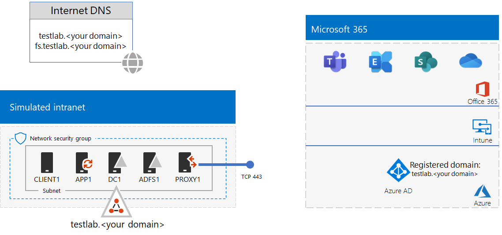

# <a name="federated-identity-for-your-microsoft-365-test-environment"></a><span data-ttu-id="4febe-103">Federerade identiteter i testmiljön för Microsoft 365</span><span class="sxs-lookup"><span data-stu-id="4febe-103">Federated identity for your Microsoft 365 test environment</span></span>

<span data-ttu-id="4febe-104">*Den här testlabbguiden kan användas i både Microsoft 365 Enterprise- och Office 365 Enterprise-testmiljöer.*</span><span class="sxs-lookup"><span data-stu-id="4febe-104">*This Test Lab Guide can be used for both Microsoft 365 Enterprise and Office 365 Enterprise test environments.*</span></span>

<span data-ttu-id="4febe-105">Office 365 stöder federerade identiteter.</span><span class="sxs-lookup"><span data-stu-id="4febe-105">Office 365 supports federated identity.</span></span> <span data-ttu-id="4febe-106">Det innebär att i stället för att Office 365 validerar autentiseringsuppgifterna själv, hänvisas användaren som ansluter till en federerad autentiseringsserver som är betrodd av Office 365.</span><span class="sxs-lookup"><span data-stu-id="4febe-106">This means that instead of performing the validation of credentials itself, Office 365 refers the connecting user to a federated authentication server that Office 365 trusts.</span></span> <span data-ttu-id="4febe-107">Om användarens autentiseringsuppgifter är korrekta utfärdar den federerade autentiseringsservern en säkerhetstoken som klienten sedan skickar till Office 365 som autentiseringsbevis.</span><span class="sxs-lookup"><span data-stu-id="4febe-107">If the user's credentials are correct, the federated authentication server issues a security token that the client then sends to Office 365 as proof of authentication.</span></span> <span data-ttu-id="4febe-108">Federerade identiteter möjliggör avlastning och uppskalning av autentiseringen i en Office 365-prenumeration, samt avancerade autentiserings- och säkerhetsscenarier.</span><span class="sxs-lookup"><span data-stu-id="4febe-108">Federated identity allows for the offloading and scaling up of authentication for an Office 365 subscription and advanced authentication and security scenarios.</span></span>
  
<span data-ttu-id="4febe-109">I artikeln beskrivs hur du konfigurerar federerad autentisering av din Microsoft 365- eller Office 365-testmiljö, vilket resulterar i följande:</span><span class="sxs-lookup"><span data-stu-id="4febe-109">This article describes how you can configure federated authentication for your Microsoft 365 or Office 365 test environment, resulting in the following:</span></span>


  
<span data-ttu-id="4febe-111">Konfigurationen består av:</span><span class="sxs-lookup"><span data-stu-id="4febe-111">This configuration consists of:</span></span> 
  
- <span data-ttu-id="4febe-112">En utvärderingsversion eller produktionsprenumeration för Microsoft 365 E5 eller Office 365 E5.</span><span class="sxs-lookup"><span data-stu-id="4febe-112">A Microsoft 365 E5 or Office 365 E5 trial or production subscription.</span></span>
    
- <span data-ttu-id="4febe-113">Ett förenklat företagsintranät som är anslutet till Internet. Det består av fem virtuella datorer i ett undernät i ett virtuellt Azure-nätverk (DC1, APP1, CLIENT1, ADFS1 och PROXY1).</span><span class="sxs-lookup"><span data-stu-id="4febe-113">A simplified organization intranet connected to the Internet, consisting of five virtual machines on a subnet of an Azure virtual network (DC1, APP1, CLIENT1, ADFS1, and PROXY1).</span></span> <span data-ttu-id="4febe-114">Azure AD Connect körs på APP1 för att synkronisera kontolistan i Active Directory Domain Services-domänen med Office 365.</span><span class="sxs-lookup"><span data-stu-id="4febe-114">Azure AD Connect runs on APP1 to synchronize the list of accounts in the Active Directory Domain Services domain to Office 365.</span></span> <span data-ttu-id="4febe-115">PROXY1 tar emot inkommande autentiseringsbegäranden.</span><span class="sxs-lookup"><span data-stu-id="4febe-115">PROXY1 receives the incoming authentication requests.</span></span> <span data-ttu-id="4febe-116">ADFS1 validerar autentiseringsuppgifter med DC1 och utfärdar säkerhetstoken.</span><span class="sxs-lookup"><span data-stu-id="4febe-116">ADFS1 validates credentials with DC1 and issues security tokens.</span></span>
    
<span data-ttu-id="4febe-117">Konfigurationen av testmiljön består av fem faser:</span><span class="sxs-lookup"><span data-stu-id="4febe-117">There are five phases to setting up this test environment:</span></span>
  
1. <span data-ttu-id="4febe-118">Skapa testmiljön för det simulerade företaget med synkronisering av lösenordshash.</span><span class="sxs-lookup"><span data-stu-id="4febe-118">Create the simulated enterprise test environment with password hash synchronization.</span></span>
    
2. <span data-ttu-id="4febe-119">Skapa en AD FS-server (ADFS1).</span><span class="sxs-lookup"><span data-stu-id="4febe-119">Create the AD FS server (ADFS1).</span></span>
    
3. <span data-ttu-id="4febe-120">Skapa webbproxyservern (PROXY1).</span><span class="sxs-lookup"><span data-stu-id="4febe-120">Create the web proxy server (PROXY1).</span></span>
    
4. <span data-ttu-id="4febe-121">Skapa ett självsignerat certifikat och konfigurera ADFS1 och PROXY1.</span><span class="sxs-lookup"><span data-stu-id="4febe-121">Create a self-signed certificate and configure ADFS1 and PROXY1.</span></span>
    
5. <span data-ttu-id="4febe-122">Konfigurera Office 365 för federerade identiteter.</span><span class="sxs-lookup"><span data-stu-id="4febe-122">Configure Office 365 for federated identity.</span></span>
    
> [!NOTE]
> <span data-ttu-id="4febe-123">Du kan inte konfigurera testmiljön med en Azure-utvärderingsprenumeration.</span><span class="sxs-lookup"><span data-stu-id="4febe-123">You cannot configure this test environment with an Azure Trial subscription.</span></span> 
  
## <a name="phase-1-configure-password-hash-synchronization-for-your-microsoft-365-test-environment"></a><span data-ttu-id="4febe-124">Fas 1: Konfigurera synkronisering av lösenordshash för Microsoft 365-testmiljön</span><span class="sxs-lookup"><span data-stu-id="4febe-124">Phase 1: Configure password hash synchronization for your Microsoft 365 test environment</span></span>

<span data-ttu-id="4febe-125">Följ anvisningarna i [synkronisering av lösenordshash för Microsoft 365](password-hash-sync-m365-ent-test-environment.md).</span><span class="sxs-lookup"><span data-stu-id="4febe-125">Follow the instructions in [password hash synchronization for Microsoft 365](password-hash-sync-m365-ent-test-environment.md).</span></span> <span data-ttu-id="4febe-126">Här är konfigurationsresultatet.</span><span class="sxs-lookup"><span data-stu-id="4febe-126">Here is your resulting configuration.</span></span>
  

  
<span data-ttu-id="4febe-128">Konfigurationen består av:</span><span class="sxs-lookup"><span data-stu-id="4febe-128">This configuration consists of:</span></span> 
  
- <span data-ttu-id="4febe-129">Utvärderingsversioner eller betalda prenumerationer för Microsoft 365 E5 eller Office 365 E5.</span><span class="sxs-lookup"><span data-stu-id="4febe-129">A Microsoft 365 E5 or Office 365 E5 trial or paid subscriptions.</span></span>
- <span data-ttu-id="4febe-130">Ett förenklat företagsintranät som är anslutet till Internet. Det består av de virtuella datorerna DC1, APP1 och CLIENT1 som körs i ett undernät i ett virtuellt Azure-nätverk.</span><span class="sxs-lookup"><span data-stu-id="4febe-130">A simplified organization intranet connected to the Internet, consisting of the DC1, APP1, and CLIENT1 virtual machines on a subnet of an Azure virtual network.</span></span> <span data-ttu-id="4febe-131">Azure AD Connect körs på APP1 och synkroniserar regelbundet TESTLAB AD DS-domänen med Azure AD-klientorganisationen för dina Microsoft 365- och Office 365-prenumerationer.</span><span class="sxs-lookup"><span data-stu-id="4febe-131">Azure AD Connect runs on APP1 to synchronize the TESTLAB AD DS domain to the Azure AD tenant of your Microsoft 365 or Office 365 subscriptions periodically.</span></span>

## <a name="phase-2-create-the-ad-fs-server"></a><span data-ttu-id="4febe-132">Fas 2: Skapa AD FS-servern</span><span class="sxs-lookup"><span data-stu-id="4febe-132">Phase 2: Create the AD FS server</span></span>

<span data-ttu-id="4febe-133">En AD FS-server tillhandahåller federerad autentisering mellan Office 365 och kontona på domänen corp.contoso.com som finns i DC1.</span><span class="sxs-lookup"><span data-stu-id="4febe-133">An AD FS server provides federated authentication between Office 365 and the accounts in the corp.contoso.com domain hosted on DC1.</span></span>
  
<span data-ttu-id="4febe-134">Om du vill skapa en virtuell Azure-dator för ADFS1, fyller du i namnet på prenumerationen, resursgruppen och Azure-platsen för baskonfigurationen. Kör sedan dessa kommandon i Azure PowerShell-kommandotolken på din lokala dator.</span><span class="sxs-lookup"><span data-stu-id="4febe-134">To create an Azure virtual machine for ADFS1, fill in the name of your subscription and the resource group and Azure location for your Base Configuration, and then run these commands at the Azure PowerShell command prompt on your local computer.</span></span>
  
```powershell
$subscrName="<your Azure subscription name>"
$rgName="<the resource group name of your Base Configuration>"
$vnetName="TlgBaseConfig-01-VNET"
# NOTE: If you built your simulated intranet with Azure PowerShell, comment the previous line with a "#" and remove the "#" from the next line.
#$vnetName="TestLab"
Connect-AzAccount
Select-AzSubscription -SubscriptionName $subscrName
$staticIP="10.0.0.100"
$locName=(Get-AzResourceGroup -Name $rgName).Location
$vnet=Get-AzVirtualNetwork -Name $vnetName -ResourceGroupName $rgName
$pip = New-AzPublicIpAddress -Name ADFS1-PIP -ResourceGroupName $rgName -Location $locName -AllocationMethod Dynamic
$nic = New-AzNetworkInterface -Name ADFS1-NIC -ResourceGroupName $rgName -Location $locName -SubnetId $vnet.Subnets[0].Id -PublicIpAddressId $pip.Id -PrivateIpAddress $staticIP
$vm=New-AzVMConfig -VMName ADFS1 -VMSize Standard_D2_v2
$cred=Get-Credential -Message "Type the name and password of the local administrator account for ADFS1."
$vm=Set-AzVMOperatingSystem -VM $vm -Windows -ComputerName ADFS1 -Credential $cred -ProvisionVMAgent -EnableAutoUpdate
$vm=Set-AzVMSourceImage -VM $vm -PublisherName MicrosoftWindowsServer -Offer WindowsServer -Skus 2016-Datacenter -Version "latest"
$vm=Add-AzVMNetworkInterface -VM $vm -Id $nic.Id
$vm=Set-AzVMOSDisk -VM $vm -Name "ADFS-OS" -DiskSizeInGB 128 -CreateOption FromImage -StorageAccountType "Standard_LRS"
New-AzVM -ResourceGroupName $rgName -Location $locName -VM $vm
```

<span data-ttu-id="4febe-135">Använd sedan [Azure-portalen](https://portal.azure.com) för att ansluta till den virtuella ADFS1-datorn med det lokala administratörskontonamnet och lösenordet för ADFS1 och öppna en kommandotolk i Windows PowerShell.</span><span class="sxs-lookup"><span data-stu-id="4febe-135">Next, use the [Azure portal](https://portal.azure.com) to connect to the ADFS1 virtual machine using the ADFS1 local administrator account name and password, and then open a Windows PowerShell command prompt.</span></span>
  
<span data-ttu-id="4febe-136">Om du vill kontrollera namnmatchningen och nätverkskommunikationen mellan ADFS1 och DC1, kör du kommandot **ping dc1.corp.contoso.com** och kontrollerar att det finns fyra svar.</span><span class="sxs-lookup"><span data-stu-id="4febe-136">To check name resolution and network communication between ADFS1 and DC1, run the **ping dc1.corp.contoso.com** command and check that there are four replies.</span></span>
  
<span data-ttu-id="4febe-137">Anslut sedan den virtuella ADFS1-datorn till CORP-domänen med dessa kommandon i Windows PowerShell-kommandotolken på ADFS1.</span><span class="sxs-lookup"><span data-stu-id="4febe-137">Next, join the ADFS1 virtual machine to the CORP domain with these commands at the Windows PowerShell prompt on ADFS1.</span></span>
  
```powershell
$cred=Get-Credential -UserName "CORP\User1" -Message "Type the User1 account password."
Add-Computer -DomainName corp.contoso.com -Credential $cred
Restart-Computer
```

<span data-ttu-id="4febe-138">Här är konfigurationsresultatet.</span><span class="sxs-lookup"><span data-stu-id="4febe-138">Here is your resulting configuration.</span></span>
  

  
## <a name="phase-3-create-the-web-proxy-server"></a><span data-ttu-id="4febe-140">Fas 3: Skapa webbproxyservern</span><span class="sxs-lookup"><span data-stu-id="4febe-140">Phase 3: Create the web proxy server</span></span>

<span data-ttu-id="4febe-141">Med PROXY1 kan du använda proxy till autentiseringsmeddelanden mellan användare som försöker autentisera och ADFS1.</span><span class="sxs-lookup"><span data-stu-id="4febe-141">PROXY1 provides proxying of authentication messages between users trying to authenticate and ADFS1.</span></span>
  
<span data-ttu-id="4febe-142">Om du vill skapa en virtuell Azure-dator för PROXY1 fyller du i namnet på din resursgrupp och Azure-plats och kör dessa kommandon i Azure PowerShell-kommandotolken på din lokala dator.</span><span class="sxs-lookup"><span data-stu-id="4febe-142">To create an Azure virtual machine for PROXY1, fill in the name of your resource group and Azure location, and then run these commands at the Azure PowerShell command prompt on your local computer.</span></span>
  
```powershell
$rgName="<the resource group name of your Base Configuration>"
$vnetName="TlgBaseConfig-01-VNET"
# NOTE: If you built your simulated intranet with Azure PowerShell, comment the previous line with a "#" and remove the "#" from the next line.
#$vnetName="TestLab"
$staticIP="10.0.0.101"
$locName=(Get-AzResourceGroup -Name $rgName).Location
$vnet=Get-AzVirtualNetwork -Name $vnetName -ResourceGroupName $rgName
$pip = New-AzPublicIpAddress -Name PROXY1-PIP -ResourceGroupName $rgName -Location $locName -AllocationMethod Static
$nic = New-AzNetworkInterface -Name PROXY1-NIC -ResourceGroupName $rgName -Location $locName -SubnetId $vnet.Subnets[0].Id -PublicIpAddressId $pip.Id -PrivateIpAddress $staticIP
$vm=New-AzVMConfig -VMName PROXY1 -VMSize Standard_D2_v2
$cred=Get-Credential -Message "Type the name and password of the local administrator account for PROXY1."
$vm=Set-AzVMOperatingSystem -VM $vm -Windows -ComputerName PROXY1 -Credential $cred -ProvisionVMAgent -EnableAutoUpdate
$vm=Set-AzVMSourceImage -VM $vm -PublisherName MicrosoftWindowsServer -Offer WindowsServer -Skus 2016-Datacenter -Version "latest"
$vm=Add-AzVMNetworkInterface -VM $vm -Id $nic.Id
$vm=Set-AzVMOSDisk -VM $vm -Name "PROXY1-OS" -DiskSizeInGB 128 -CreateOption FromImage -StorageAccountType "Standard_LRS"
New-AzVM -ResourceGroupName $rgName -Location $locName -VM $vm
```

> [!NOTE]
> <span data-ttu-id="4febe-143">PROXY1 tilldelas en statisk offentlig IP-adress eftersom du skapar en offentlig DNS-post som pekar på den. Denna får inte ändras när du startar om den virtuella PROXY1-datorn.</span><span class="sxs-lookup"><span data-stu-id="4febe-143">PROXY1 is assigned a static public IP address because you will create a public DNS record that points to it and it must not change when you restart the PROXY1 virtual machine.</span></span> 
  
<span data-ttu-id="4febe-144">Lägg sedan till en regel i nätverkssäkerhetsgruppen för CorpNet-undernätet som tillåter oombedd inkommande trafik från Internet till den privata IP-adressen och TCP-porten 443 i PROXY1.</span><span class="sxs-lookup"><span data-stu-id="4febe-144">Next, add a rule to the network security group for the CorpNet subnet to allow unsolicited inbound traffic from the Internet to PROXY1's private IP address and TCP port 443.</span></span> <span data-ttu-id="4febe-145">Kör dessa kommandon i Azure PowerShell-kommandotolken på din lokala dator.</span><span class="sxs-lookup"><span data-stu-id="4febe-145">Run these commands at the Azure PowerShell command prompt on your local computer.</span></span>
  
```powershell
$rgName="<the resource group name of your Base Configuration>"
Get-AzNetworkSecurityGroup -Name CorpNet -ResourceGroupName $rgName | Add-AzNetworkSecurityRuleConfig -Name "HTTPS-to-PROXY1" -Description "Allow TCP 443 to PROXY1" -Access "Allow" -Protocol "Tcp" -Direction "Inbound" -Priority 101 -SourceAddressPrefix "Internet" -SourcePortRange "*" -DestinationAddressPrefix "10.0.0.101" -DestinationPortRange "443" | Set-AzNetworkSecurityGroup
```

<span data-ttu-id="4febe-146">Använd sedan [Azure-portalen](https://portal.azure.com) för att ansluta till den virtuella PROXY1-datorn med det lokala administratörskontonamnet och lösenordet för PROXY1 och öppna en kommandotolk i Windows PowerShell för PROXY1.</span><span class="sxs-lookup"><span data-stu-id="4febe-146">Next, use the [Azure portal](https://portal.azure.com) to connect to the PROXY1 virtual machine using the PROXY1 local administrator account name and password, and then open a Windows PowerShell command prompt on PROXY1.</span></span>
  
<span data-ttu-id="4febe-147">Om du vill kontrollera namnmatchningen och nätverkskommunikationen mellan PROXY1 och DC1, kör du kommandot **ping dc1.corp.contoso.com** och kontrollerar att det finns fyra svar.</span><span class="sxs-lookup"><span data-stu-id="4febe-147">To check name resolution and network communication between PROXY1 and DC1, run the **ping dc1.corp.contoso.com** command and check that there are four replies.</span></span>
  
<span data-ttu-id="4febe-148">Anslut sedan den virtuella PROXY1-datorn till CORP-domänen med dessa kommandon i Windows PowerShell-kommandotolken på PROXY1.</span><span class="sxs-lookup"><span data-stu-id="4febe-148">Next, join the PROXY1 virtual machine to the CORP domain with these commands at the Windows PowerShell prompt on PROXY1.</span></span>
  
```powershell
$cred=Get-Credential -UserName "CORP\User1" -Message "Type the User1 account password."
Add-Computer -DomainName corp.contoso.com -Credential $cred
Restart-Computer
```

<span data-ttu-id="4febe-149">Visa den offentliga IP-adressen för PROXY1 med följande Azure PowerShell-kommandon på din lokala dator:</span><span class="sxs-lookup"><span data-stu-id="4febe-149">Display the public IP address of PROXY1 with these Azure PowerShell commands on your local computer:</span></span>
  
```powershell
Write-Host (Get-AzPublicIpaddress -Name "PROXY1-PIP" -ResourceGroup $rgName).IPAddress
```

<span data-ttu-id="4febe-150">Tillsammans med din offentliga DNS-leverantör kan du sedan skapa en ny offentlig DNS-post för **fs.testlab.**\<ditt DNS-domännamn > som matchas mot IP-adressen som visas med kommandot **Write-Host**.</span><span class="sxs-lookup"><span data-stu-id="4febe-150">Next, work with your public DNS provider and create a new public DNS A record for **fs.testlab.**\<your DNS domain name> that resolves to the IP address displayed by the **Write-Host** command.</span></span> <span data-ttu-id="4febe-151">**fs.testlab.**\<ditt DNS-domännamn > kallas i fortsättningen för *federationstjänstens FQDN*.</span><span class="sxs-lookup"><span data-stu-id="4febe-151">The **fs.testlab.**\<your DNS domain name> is hereafter referred to as the  *federation service FQDN*.</span></span>
  
<span data-ttu-id="4febe-152">Använd sedan [Azure-portalen](https://portal.azure.com) för att ansluta till den virtuella DC1-datorn med hjälp av CORP\\User1-autentiseringsuppgifter och kör följande kommandon i en Windows PowerShell-kommandotolk på administratörsnivå:</span><span class="sxs-lookup"><span data-stu-id="4febe-152">Next, use the [Azure portal](https://portal.azure.com) to connect to the DC1 virtual machine using the CORP\\User1 credentials, and then run the following commands at an administrator-level Windows PowerShell command prompt:</span></span>
  
```powershell
Add-DnsServerPrimaryZone -Name corp.contoso.com -ZoneFile corp.contoso.com.dns
Add-DnsServerResourceRecordA -Name "fs" -ZoneName corp.contoso.com -AllowUpdateAny -IPv4Address "10.0.0.100" -TimeToLive 01:00:00
```
<span data-ttu-id="4febe-153">Med dessa kommandon skapar du en intern DNS-post för att virtuella datorer i det virtuella Azure-nätverket ska kunna matcha den interna federationens FQDN med den privata IP-adressen i ADFS1.</span><span class="sxs-lookup"><span data-stu-id="4febe-153">These commands create an internal DNS A record so that virtual machines on the Azure virtual network can resolve the internal federation FQDN to ADFS1's private IP address.</span></span>
  
<span data-ttu-id="4febe-154">Här är konfigurationsresultatet.</span><span class="sxs-lookup"><span data-stu-id="4febe-154">Here is your resulting configuration.</span></span>
  

  
## <a name="phase-4-create-a-self-signed-certificate-and-configure-adfs1-and-proxy1"></a><span data-ttu-id="4febe-156">Fas 4: Skapa ett självsignerat certifikat och konfigurera ADFS1 och PROXY1.</span><span class="sxs-lookup"><span data-stu-id="4febe-156">Phase 4: Create a self-signed certificate and configure ADFS1 and PROXY1</span></span>

<span data-ttu-id="4febe-157">I den här fasen skapar du ett självsignerat digitalt certifikat för federationstjänstens FQDN. Därefter konfigurerar du ADFS1 och PROXY1 som en AD FS-servergrupp.</span><span class="sxs-lookup"><span data-stu-id="4febe-157">In this phase, you create a self-signed digital certificate for your federation service FQDN and configure ADFS1 and PROXY1 as an AD FS farm.</span></span>
  
<span data-ttu-id="4febe-158">Först använder du [Azure-portalen](https://portal.azure.com) för att ansluta till den virtuella DC1-datorn med hjälp av CORP\\User1-autentiseringsuppgifterna och sedan öppnar du en Windows PowerShell-kommandotolk på administratörsnivå.</span><span class="sxs-lookup"><span data-stu-id="4febe-158">First, use the [Azure portal](https://portal.azure.com) to connect to the DC1 virtual machine using the CORP\\User1 credentials, and then open an administrator-level Windows PowerShell command prompt.</span></span>
  
<span data-ttu-id="4febe-159">Skapa sedan AD FS-tjänstkontot med detta kommando i Windows PowerShell-kommandotolken på DC1:</span><span class="sxs-lookup"><span data-stu-id="4febe-159">Next, create AD FS service account with this command at the Windows PowerShell command prompt on DC1:</span></span>
  
```powershell
New-ADUser -SamAccountName ADFS-Service -AccountPassword (read-host "Set user password" -assecurestring) -name "ADFS-Service" -enabled $true -PasswordNeverExpires $true -ChangePasswordAtLogon $false
```
<span data-ttu-id="4febe-160">Observera att du uppmanas att ange lösenordet för kontot med detta kommando.</span><span class="sxs-lookup"><span data-stu-id="4febe-160">Note that this command prompts you to supply the account password.</span></span> <span data-ttu-id="4febe-161">Välj ett starkt lösenord och spara det på en säker plats.</span><span class="sxs-lookup"><span data-stu-id="4febe-161">Choose a strong password and record it in a secured location.</span></span> <span data-ttu-id="4febe-162">Du behöver det i den här fasen och i fas 5.</span><span class="sxs-lookup"><span data-stu-id="4febe-162">You will need it for this phase and Phase 5.</span></span>
  
<span data-ttu-id="4febe-163">Använd [Azure-portalen](https://portal.azure.com) för att ansluta till den virtuella ADFS1-datorn med hjälp av CORP\\User1-autentiseringsuppgifterna.</span><span class="sxs-lookup"><span data-stu-id="4febe-163">Use the [Azure portal](https://portal.azure.com) to connect to the ADFS1 virtual machine using the CORP\\User1 credentials.</span></span> <span data-ttu-id="4febe-164">Öppna en Windows PowerShell-kommandotolk på administratörsnivå i ADFS1, fyll i FQDN för federationstjänsten och kör sedan följande kommandon för att skapa ett självsignerat certifikat:</span><span class="sxs-lookup"><span data-stu-id="4febe-164">Open an administrator-level Windows PowerShell command prompt on ADFS1, fill in your federation service FQDN, and then run these commands to create a self-signed certificate:</span></span>
  
```powershell
$fedServiceFQDN="<federation service FQDN>"
New-SelfSignedCertificate -DnsName $fedServiceFQDN -CertStoreLocation "cert:\LocalMachine\My"
New-Item -path c:\Certs -type directory
New-SmbShare -name Certs -path c:\Certs -changeaccess CORP\User1
```

<span data-ttu-id="4febe-165">Följ sedan de här anvisningarna för att spara det nya självsignerade certifikatet som en fil.</span><span class="sxs-lookup"><span data-stu-id="4febe-165">Next, use these steps to save the new self-signed certificate as a file.</span></span>
  
1. <span data-ttu-id="4febe-166">Klicka på **Start**, skriv **mmc.exe** och tryck på **Retur**.</span><span class="sxs-lookup"><span data-stu-id="4febe-166">Click **Start**, type **mmc.exe**, and then press **Enter**.</span></span>
    
2. <span data-ttu-id="4febe-167">Klicka på **Arkiv > Lägg till/ta bort snapin-modul**.</span><span class="sxs-lookup"><span data-stu-id="4febe-167">Click **File > Add/Remove Snap-in**.</span></span>
    
3. <span data-ttu-id="4febe-168">I **Lägg till eller ta bort snapin-moduler** dubbelklickar du på **Certifikat** i listan med tillgängliga snapin-moduler. Klicka på **Datorkonto** och sedan på **Nästa**.</span><span class="sxs-lookup"><span data-stu-id="4febe-168">In **Add or Remove Snap-ins**, double-click **Certificates** in the list of available snap-ins, click **Computer account**, and then click **Next**.</span></span>
    
4. <span data-ttu-id="4febe-169">I **Välj dator** klickar du på **Slutför** och sedan på **OK**.</span><span class="sxs-lookup"><span data-stu-id="4febe-169">In **Select Computer**, click **Finish**, and then click **OK**.</span></span>
    
5. <span data-ttu-id="4febe-170">Öppna **Certifikat (lokal dator) > Personlig > Certifikat** i mapplistan.</span><span class="sxs-lookup"><span data-stu-id="4febe-170">In the tree pane, open **Certificates (Local Computer) > Personal > Certificates**.</span></span>
    
6. <span data-ttu-id="4febe-171">Högerklicka på certifikatet med federationstjänstens FQDN, klicka på **Alla uppgifter** och sedan på **Exportera**.</span><span class="sxs-lookup"><span data-stu-id="4febe-171">Right-click the certificate with your federation service FQDN, click **All tasks**, and then click **Export**.</span></span>
    
7. <span data-ttu-id="4febe-172">På sidan **Välkommen** klickar du på **Nästa**.</span><span class="sxs-lookup"><span data-stu-id="4febe-172">On the **Welcome** page, click **Next**.</span></span>
    
8. <span data-ttu-id="4febe-173">Klicka på **Ja** på sidan **Exportera privat nyckel** och klicka sedan på **Nästa**.</span><span class="sxs-lookup"><span data-stu-id="4febe-173">On the **Export Private Key** page, click **Yes**, and then click **Next**.</span></span>
    
9. <span data-ttu-id="4febe-174">Klicka på **Exportera alla utökade egenskaper** och sedan på **Nästa** på sidan **Exportera filformat**.</span><span class="sxs-lookup"><span data-stu-id="4febe-174">On the **Export File Format** page, click **Export all extended properties**, and then click **Next**.</span></span>
    
10. <span data-ttu-id="4febe-175">På sidan **Säkerhet** klickar du på **Lösenord** och anger ett lösenord i **Lösenord** och **Bekräfta lösenordet.**</span><span class="sxs-lookup"><span data-stu-id="4febe-175">On the **Security** page, click **Password** and type a password in **Password** and **Confirm password.**</span></span>
    
11. <span data-ttu-id="4febe-176">På sidan **Fil att exportera** klickar du på **Bläddra**.</span><span class="sxs-lookup"><span data-stu-id="4febe-176">On the **File to Export** page, click **Browse**.</span></span>
    
12. <span data-ttu-id="4febe-177">Bläddra till mappen **C:\\Certs**, skriv **SSL** i **Filnamn** och klicka sedan på **Spara.**</span><span class="sxs-lookup"><span data-stu-id="4febe-177">Browse to the **C:\\Certs** folder, type **SSL** in **File name**, and then click **Save.**</span></span>
    
13. <span data-ttu-id="4febe-178">På sidan **Fil att exportera** klickar du på **Nästa**.</span><span class="sxs-lookup"><span data-stu-id="4febe-178">On the **File to Export** page, click **Next**.</span></span>
    
14. <span data-ttu-id="4febe-179">Klicka på **Slutför** på sidan **Slutför guiden Exportera certifikat**.</span><span class="sxs-lookup"><span data-stu-id="4febe-179">On the **Completing the Certificate Export Wizard** page, click **Finish**.</span></span> <span data-ttu-id="4febe-180">Klicka på **OK** när du uppmanas att göra det.</span><span class="sxs-lookup"><span data-stu-id="4febe-180">When prompted, click **OK**.</span></span>
    
<span data-ttu-id="4febe-181">Installera sedan AD FS-tjänsten med detta kommando i Windows PowerShell-kommandotolken på ADFS1:</span><span class="sxs-lookup"><span data-stu-id="4febe-181">Next, install the AD FS service with this command at the Windows PowerShell command prompt on ADFS1:</span></span>
  
```powershell
Install-WindowsFeature ADFS-Federation -IncludeManagementTools
```

<span data-ttu-id="4febe-182">Vänta på att installationen slutförs.</span><span class="sxs-lookup"><span data-stu-id="4febe-182">Wait for the installation to complete.</span></span>
  
<span data-ttu-id="4febe-183">Konfigurera sedan AD FS-tjänsten med följande steg:</span><span class="sxs-lookup"><span data-stu-id="4febe-183">Next, configure the AD FS service with these steps:</span></span>
  
1. <span data-ttu-id="4febe-184">Klicka på **Start** och sedan på ikonen **Serverhanteraren**.</span><span class="sxs-lookup"><span data-stu-id="4febe-184">Click **Start**, and then click the **Server Manager** icon.</span></span>
    
2. <span data-ttu-id="4febe-185">I mapplistan i Serverhanteraren klickar du på **AD FS**.</span><span class="sxs-lookup"><span data-stu-id="4febe-185">In the tree pane of Server Manager, click **AD FS**.</span></span>
    
3. <span data-ttu-id="4febe-186">I verktygsfältet högst upp klickar du på den orange varningssymbolen och sedan på **Konfigurera federationstjänsten på den här servern**.</span><span class="sxs-lookup"><span data-stu-id="4febe-186">In the tool bar at the top, click the orange caution symbol, and then click **Configure the federation service on this server**.</span></span>
    
4. <span data-ttu-id="4febe-187">På sidan **Välkommen** i konfigurationsguiden för Active Directory Federation Services klickar du på **Nästa**.</span><span class="sxs-lookup"><span data-stu-id="4febe-187">On the **Welcome** page of the Active Directory Federation Services Configuration Wizard, click **Next**.</span></span>
    
5. <span data-ttu-id="4febe-188">På sidan **Anslut till AD DS** klickar du på **Nästa**.</span><span class="sxs-lookup"><span data-stu-id="4febe-188">On the **Connect to AD DS** page, click **Next**.</span></span>
    
6. <span data-ttu-id="4febe-189">På sidan **Ange egenskaper för tjänst**:</span><span class="sxs-lookup"><span data-stu-id="4febe-189">On the **Specify Service Properties** page:</span></span>
    
  - <span data-ttu-id="4febe-190">Om du vill använda **SSL-certifikat** klickar du på nedåtpilen och sedan på certifikatet med namnet på federationstjänstens FQDN.</span><span class="sxs-lookup"><span data-stu-id="4febe-190">For **SSL Certificate**, click the down arrow, and then click the certificate with the name of your federation service FQDN.</span></span>
    
  - <span data-ttu-id="4febe-191">I **Federationstjänstens visningsnamn** skriver du namnet på din fiktiva organisation.</span><span class="sxs-lookup"><span data-stu-id="4febe-191">In **Federation Service Display Name**, type the name of your fictional organization.</span></span>
    
  - <span data-ttu-id="4febe-192">Klicka på **Nästa**.</span><span class="sxs-lookup"><span data-stu-id="4febe-192">Click **Next**.</span></span>
    
7. <span data-ttu-id="4febe-193">På sidan **Ange tjänstkonto** klickar du på **Välj** för **Kontonamn**.</span><span class="sxs-lookup"><span data-stu-id="4febe-193">On the **Specify Service Account** page, click **Select** for **Account name**.</span></span>
    
8. <span data-ttu-id="4febe-194">I **Välj användar- eller tjänstkonto** skriver du **ADFS-Service**, klickar på **Kontrollera namn** och sedan på **OK**.</span><span class="sxs-lookup"><span data-stu-id="4febe-194">In **Select User or Service Account**, type **ADFS-Service**, click **Check Names**, and then click **OK**.</span></span>
    
9. <span data-ttu-id="4febe-195">I **Kontolösenord** skriver du lösenordet för kontot ADFS-Service och klickar sedan på **Nästa**.</span><span class="sxs-lookup"><span data-stu-id="4febe-195">In **Account Password**, type the password for the ADFS-Service account, and then click **Next**.</span></span>
    
10. <span data-ttu-id="4febe-196">På sidan **Ange konfigurationsdatabas** klickar du på **Nästa**.</span><span class="sxs-lookup"><span data-stu-id="4febe-196">On the **Specify Configuration Database** page, click **Next**.</span></span>
    
11. <span data-ttu-id="4febe-197">På sidan **Granskningsalternativ** klickar du på **Nästa**.</span><span class="sxs-lookup"><span data-stu-id="4febe-197">On the **Review Options** page, click **Next**.</span></span>
    
12. <span data-ttu-id="4febe-198">På sidan **Kravkontroller** klickar du på **Konfigurera**.</span><span class="sxs-lookup"><span data-stu-id="4febe-198">On the **Pre-requisite Checks** page, click **Configure**.</span></span>
    
13. <span data-ttu-id="4febe-199">På sidan **Resultat** klickar du på **Stäng**.</span><span class="sxs-lookup"><span data-stu-id="4febe-199">On the **Results** page, click **Close**.</span></span>
    
14. <span data-ttu-id="4febe-200">Klicka på **Start**, klicka på strömbrytarikonen, klicka på **Starta om** och klicka sedan på **Fortsätt**.</span><span class="sxs-lookup"><span data-stu-id="4febe-200">Click **Start**, click the power icon, click **Restart**, and then click **Continue**.</span></span>
    
<span data-ttu-id="4febe-201">I [Azure-portalen](https://portal.azure.com) kan du ansluta till PROXY1 med autentiseringsuppgifterna för CORP\\User1-kontot.</span><span class="sxs-lookup"><span data-stu-id="4febe-201">From the [Azure portal](https://portal.azure.com), connect to PROXY1 with the CORP\\User1 account credentials.</span></span>
  
<span data-ttu-id="4febe-202">Följ sedan de här anvisningarna för att installera det självsignerade certifikatet och konfigurera PROXY1.</span><span class="sxs-lookup"><span data-stu-id="4febe-202">Next, use these steps to install the self-signed certificate and configure PROXY1.</span></span>
  
1. <span data-ttu-id="4febe-203">Klicka på **Start**, skriv **mmc.exe** och tryck på **Retur**.</span><span class="sxs-lookup"><span data-stu-id="4febe-203">Click **Start**, type **mmc.exe**, and then press **Enter**.</span></span>
    
2. <span data-ttu-id="4febe-204">Klicka på **Arkiv > Lägg till/ta bort snapin-modul**.</span><span class="sxs-lookup"><span data-stu-id="4febe-204">Click **File > Add/Remove Snap-in**.</span></span>
    
3. <span data-ttu-id="4febe-205">I **Lägg till eller ta bort snapin-moduler** dubbelklickar du på **Certifikat** i listan med tillgängliga snapin-moduler. Klicka på **Datorkonto** och sedan på **Nästa**.</span><span class="sxs-lookup"><span data-stu-id="4febe-205">In **Add or Remove Snap-ins**, double-click **Certificates** in the list of available snap-ins, click **Computer account**, and then click **Next**.</span></span>
    
4. <span data-ttu-id="4febe-206">I **Välj dator** klickar du på **Slutför** och sedan på **OK**.</span><span class="sxs-lookup"><span data-stu-id="4febe-206">In **Select Computer**, click **Finish**, and then click **OK**.</span></span>
    
5. <span data-ttu-id="4febe-207">Öppna **Certifikat (lokal dator) > Personlig > Certifikat** i mapplistan.</span><span class="sxs-lookup"><span data-stu-id="4febe-207">In the tree pane, open **Certificates (Local Computer) > Personal > Certificates**.</span></span>
    
6. <span data-ttu-id="4febe-208">Högerklicka på **Personlig**, klicka på **Alla uppgifter** och klicka sedan på **Importera**.</span><span class="sxs-lookup"><span data-stu-id="4febe-208">Right-click **Personal**, click **All tasks**, and then click **Import**.</span></span>
    
7. <span data-ttu-id="4febe-209">På sidan **Välkommen** klickar du på **Nästa**.</span><span class="sxs-lookup"><span data-stu-id="4febe-209">On the **Welcome** page, click **Next**.</span></span>
    
8. <span data-ttu-id="4febe-210">På sidan **Fil att importera** skriver du **\\\\adfs1\\certs\\ssl.pfx** och klickar sedan på **Nästa**.</span><span class="sxs-lookup"><span data-stu-id="4febe-210">On the **File to Import** page, type **\\\\adfs1\\certs\\ssl.pfx**, and then click **Next**.</span></span>
    
9. <span data-ttu-id="4febe-211">På sidan **Skydd av privat nyckel** anger du lösenordet för certifikatet i **Lösenord** och klickar sedan på **Nästa.**</span><span class="sxs-lookup"><span data-stu-id="4febe-211">On the **Private key protection** page, type the certificate password in **Password**, and then click **Next.**</span></span>
    
10. <span data-ttu-id="4febe-212">På sidan **Certifikatarkiv** klickar du på **Nästa.**</span><span class="sxs-lookup"><span data-stu-id="4febe-212">On the **Certificate store** page, click **Next.**</span></span>
    
11. <span data-ttu-id="4febe-213">Klicka på **Slutför** på sidan **Slutför**.</span><span class="sxs-lookup"><span data-stu-id="4febe-213">On the **Completing** page, click **Finish**.</span></span>
    
12. <span data-ttu-id="4febe-214">På sidan **Certifikatarkiv** klickar du på **Nästa**.</span><span class="sxs-lookup"><span data-stu-id="4febe-214">On the **Certificate Store** page, click **Next**.</span></span>
    
13. <span data-ttu-id="4febe-215">Klicka på **OK** när du uppmanas att göra det.</span><span class="sxs-lookup"><span data-stu-id="4febe-215">When prompted, click **OK**.</span></span>
    
14. <span data-ttu-id="4febe-216">Klicka på **Certifikat** i mapplistan.</span><span class="sxs-lookup"><span data-stu-id="4febe-216">Click **Certificates** in the tree pane.</span></span>
    
15. <span data-ttu-id="4febe-217">Högerklicka på certifikatet och klicka sedan på **Kopiera**.</span><span class="sxs-lookup"><span data-stu-id="4febe-217">Right-click the certificate, and then click **Copy**.</span></span>
    
16. <span data-ttu-id="4febe-218">I mapplistan öppnar du **Betrodda rotcertifikatutfärdare > Certifikat**.</span><span class="sxs-lookup"><span data-stu-id="4febe-218">In the tree pane, open **Trusted Root Certification Authorities > Certificates**.</span></span>
    
17. <span data-ttu-id="4febe-219">Flytta muspekaren nedanför listan med installerade certifikat, högerklicka och klicka sedan på **Klistra in**.</span><span class="sxs-lookup"><span data-stu-id="4febe-219">Move your mouse pointer below the list of installed certificates, right-click, and then click **Paste**.</span></span>
    
<span data-ttu-id="4febe-220">Öppna en PowerShell-kommandotolk på administratörsnivå och kör följande kommando:</span><span class="sxs-lookup"><span data-stu-id="4febe-220">Open an administrator-level PowerShell command prompt and run the following command:</span></span>
  
```powershell
Install-WindowsFeature Web-Application-Proxy -IncludeManagementTools
```

<span data-ttu-id="4febe-221">Vänta på att installationen slutförs.</span><span class="sxs-lookup"><span data-stu-id="4febe-221">Wait for the installation to complete.</span></span>
  
<span data-ttu-id="4febe-222">Använd följande steg för att konfigurera att tjänsten Webbprogramproxy ska använda ADFS1 som federationsserver:</span><span class="sxs-lookup"><span data-stu-id="4febe-222">Use these steps to configure the web application proxy service to use ADFS1 as its federation server:</span></span>
  
1. <span data-ttu-id="4febe-223">Klicka på **Start** och sedan på **Serverhanteraren**.</span><span class="sxs-lookup"><span data-stu-id="4febe-223">Click **Start**, and then click **Server Manager**.</span></span>
    
2. <span data-ttu-id="4febe-224">I mapplistan klickar du på **Fjärråtkomst**.</span><span class="sxs-lookup"><span data-stu-id="4febe-224">In the tree pane, click **Remote Access**.</span></span>
    
3. <span data-ttu-id="4febe-225">I verktygsfältet högst upp klickar du på den orange varningssymbolen och sedan på **Öppna guiden Webbprogramproxy**.</span><span class="sxs-lookup"><span data-stu-id="4febe-225">In the tool bar at the top, click the orange caution symbol, and then click **Open the Web Application Proxy Wizard**.</span></span>
    
4. <span data-ttu-id="4febe-226">På sidan **Välkommen** i guiden Webbprogramproxy klickar du på **Nästa**.</span><span class="sxs-lookup"><span data-stu-id="4febe-226">On the **Welcome** page of the Web Application Proxy Configuration Wizard, click **Next**.</span></span>
    
5. <span data-ttu-id="4febe-227">På sidan **Federationsserver**:</span><span class="sxs-lookup"><span data-stu-id="4febe-227">On the **Federation Server** page:</span></span>
    
  - <span data-ttu-id="4febe-228">Skriv in federationstjänstens FQDN i **Federationstjänstens namn**.</span><span class="sxs-lookup"><span data-stu-id="4febe-228">Type your federation service FQDN in **Federation service name**.</span></span>
    
  - <span data-ttu-id="4febe-229">Skriv **CORP\\User1** i **Användarnamn**.</span><span class="sxs-lookup"><span data-stu-id="4febe-229">Type **CORP\\User1** in **User name**.</span></span>
    
  - <span data-ttu-id="4febe-230">Skriv in lösenordet för User1-kontot i **Lösenord**.</span><span class="sxs-lookup"><span data-stu-id="4febe-230">Type the password for the User1 account in **Password**.</span></span>
    
  - <span data-ttu-id="4febe-231">Klicka på **Nästa**.</span><span class="sxs-lookup"><span data-stu-id="4febe-231">Click **Next**.</span></span>
    
6. <span data-ttu-id="4febe-232">På sidan **AD FS-proxycertifikat** klickar du på nedåtpilen och sedan på certifikatet med federationstjänstens FQDN. Klicka sedan på **Nästa**.</span><span class="sxs-lookup"><span data-stu-id="4febe-232">On the **AD FS Proxy Certificate** page, click the down arrow, click the certificate with your federation service FQDN, and then click **Next**.</span></span>
    
7. <span data-ttu-id="4febe-233">På sidan **Bekräftelse** klickar du på **Konfigurera**.</span><span class="sxs-lookup"><span data-stu-id="4febe-233">On the **Confirmation** page, click **Configure**.</span></span>
    
8. <span data-ttu-id="4febe-234">På sidan **Resultat** klickar du på **Stäng**.</span><span class="sxs-lookup"><span data-stu-id="4febe-234">On the **Results** page, click **Close**.</span></span>

    
## <a name="phase-5-configure-office-365-for-federated-identity"></a><span data-ttu-id="4febe-235">Fas 5: Konfigurera Office 365 för federerad identitet</span><span class="sxs-lookup"><span data-stu-id="4febe-235">Phase 5: Configure Office 365 for federated identity</span></span>

<span data-ttu-id="4febe-236">Använd [Azure-portalen](https://portal.azure.com) för att ansluta till den virtuella APP1-datorn med hjälp av CORP\\User1-autentiseringsuppgifterna.</span><span class="sxs-lookup"><span data-stu-id="4febe-236">Use the [Azure portal](https://portal.azure.com) to connect to the APP1 virtual machine with the CORP\\User1 account credentials.</span></span>
  
<span data-ttu-id="4febe-237">Använd följande steg för att konfigurera Azure AD Connect och din Office 365-prenumeration för federerad autentisering:</span><span class="sxs-lookup"><span data-stu-id="4febe-237">Use these steps to configure Azure AD Connect and your Office 365 subscription for federated authentication:</span></span>
  
1. <span data-ttu-id="4febe-238">Dubbelklicka på **Azure AD Connect** på skrivbordet.</span><span class="sxs-lookup"><span data-stu-id="4febe-238">From the desktop, double-click **Azure AD Connect**.</span></span>
    
2. <span data-ttu-id="4febe-239">På sidan **Välkommen till Azure AD Connect** klickar du på **Konfigurera**.</span><span class="sxs-lookup"><span data-stu-id="4febe-239">On the **Welcome to Azure AD Connect** page, click **Configure**.</span></span>
    
3. <span data-ttu-id="4febe-240">På sidan **Ytterligare uppgifter** klickar du på **Ändra användarinloggning** och sedan på **Nästa**.</span><span class="sxs-lookup"><span data-stu-id="4febe-240">On the **Additional tasks** page, click **Change user sign-in**, and then click **Next**.</span></span>
    
4. <span data-ttu-id="4febe-241">På sidan **Anslut till Azure AD** skriver du kontonamn och lösenord för en global administratör i Office 365. Klicka sedan på **Nästa**.</span><span class="sxs-lookup"><span data-stu-id="4febe-241">On the **Connect to Azure AD** page, type your Office 365 global administrator account name and password, and then click **Next**.</span></span>
    
5. <span data-ttu-id="4febe-242">På sidan **Användarinloggning** klickar du på **Federation med AD FS** och sedan på **Nästa**.</span><span class="sxs-lookup"><span data-stu-id="4febe-242">On the **User sign-in** page, click **Federation with AD FS**, and then click **Next**.</span></span>
    
6. <span data-ttu-id="4febe-243">På sidan **AD FS-servergrupp** klickar du på **Använd en befintlig AD FS-servergrupp**. Skriv **ADFS1** i **Servernamn** och klicka sedan på **Nästa**.</span><span class="sxs-lookup"><span data-stu-id="4febe-243">On the **AD FS farm** page, click **Use an existing AD FS farm**, type **ADFS1** in **Server Name**, and then click **Next**.</span></span>
    
7. <span data-ttu-id="4febe-244">När du uppmanas att ange autentiseringsuppgifter för server anger du autentiseringsuppgifterna för kontot CORP\\User1. Klicka sedan på **OK**.</span><span class="sxs-lookup"><span data-stu-id="4febe-244">When prompted for server credentials, enter the credentials of the CORP\\User1 account, and then click **OK**.</span></span>
    
8. <span data-ttu-id="4febe-245">På sidan med autentiseringsuppgifter för **Domänadministratör** skriver du **CORP\\User1** i **Användarnamn** och lösenordet för kontot i **Lösenord**. Klicka sedan på **Nästa**.</span><span class="sxs-lookup"><span data-stu-id="4febe-245">On the **Domain Administrator** credentials page, type **CORP\\User1** in **Username** and the account password in **Password**, and then click **Next**.</span></span>
    
9. <span data-ttu-id="4febe-246">På sidan **AD FS-tjänstekonto** skriver du **CORP\\ADFS-Service** i **Domänanvändarnamn** och lösenordet för kontot i **Lösenord för domänanvändare**. Klicka sedan på **Nästa**.</span><span class="sxs-lookup"><span data-stu-id="4febe-246">On the **AD FS service account** page, type **CORP\\ADFS-Service** in **Domain Username** and the account password in **Domain User Password**, and then click **Next**.</span></span>
    
10. <span data-ttu-id="4febe-247">På sidan **Azure AD-domän** i **Domän** väljer du namnet på den domän som du tidigare skapade och lade till i din Office 365-prenumeration i fas 1. Klicka sedan på **Nästa**.</span><span class="sxs-lookup"><span data-stu-id="4febe-247">On the **Azure AD Domain** page, in **Domain**, select the name of the domain you previously created and added to your Office 365 subscription in Phase 1, and then click **Next**.</span></span>
    
11. <span data-ttu-id="4febe-248">Klicka på **Konfigurera** på sidan **Klart att konfigurera**.</span><span class="sxs-lookup"><span data-stu-id="4febe-248">On the **Ready to configure** page, click **Configure**.</span></span>
    
12. <span data-ttu-id="4febe-249">På sidan **Installationen är slutförd** klickar du på **Verifiera**.</span><span class="sxs-lookup"><span data-stu-id="4febe-249">On the **Installation complete** page, click **Verify**.</span></span>
    
    <span data-ttu-id="4febe-250">Du bör se meddelanden som anger att konfigurationen av både intranät och Internet har verifierats.</span><span class="sxs-lookup"><span data-stu-id="4febe-250">You should see messages indicating that both the intranet and Internet configuration was verified.</span></span>
    
13. <span data-ttu-id="4febe-251">På sidan **Installationen är slutförd** klickar du på **Avsluta**.</span><span class="sxs-lookup"><span data-stu-id="4febe-251">On the **Installation complete** page, click **Exit**.</span></span>
    
<span data-ttu-id="4febe-252">Visa att den federerade autentiseringen fungerar:</span><span class="sxs-lookup"><span data-stu-id="4febe-252">To demonstrate that federated authentication is working:</span></span>
  
1. <span data-ttu-id="4febe-253">Öppna en ny privat instans av webbläsaren på din lokala dator och gå till [https://admin.microsoft.com](https://admin.microsoft.com).</span><span class="sxs-lookup"><span data-stu-id="4febe-253">Open a new private instance of your browser on your local computer and go to [https://admin.microsoft.com](https://admin.microsoft.com).</span></span>
    
2. <span data-ttu-id="4febe-254">Som autentiseringsuppgifter skriver du **user1@**\<den domän som skapades i fas 1>.</span><span class="sxs-lookup"><span data-stu-id="4febe-254">For the sign-in credentials, type **user1@**\<the domain created in Phase 1>.</span></span> 
    
    <span data-ttu-id="4febe-255">Om din testdomän exempelvis är **testlab.contoso.com**skriver du ”user1@testlab.contoso.com”.</span><span class="sxs-lookup"><span data-stu-id="4febe-255">For example, if your test domain is **testlab.contoso.com**, you would type "user1@testlab.contoso.com".</span></span> <span data-ttu-id="4febe-256">Tryck på tabbtangenten eller tillåt att Office 365 omdirigerar dig automatiskt.</span><span class="sxs-lookup"><span data-stu-id="4febe-256">Press TAB or allow Office 365 to automatically redirect you.</span></span>
    
    <span data-ttu-id="4febe-257">Nu bör du se sidan **Din anslutning är inte privat**.</span><span class="sxs-lookup"><span data-stu-id="4febe-257">You should now see a **Your connection is not private** page.</span></span> <span data-ttu-id="4febe-258">Den visas eftersom du har installerat ett självsignerat certifikat på ADFS1 som din stationära dator inte kan verifiera.</span><span class="sxs-lookup"><span data-stu-id="4febe-258">You are seeing this because you installed a self-signed certificate on ADFS1 that your desktop computer cannot validate.</span></span> <span data-ttu-id="4febe-259">I en produktionsdistribution av federerad autentisering använder du ett certifikat från en betrodd certifikatutfärdare för att dina användare inte ska se den här sidan.</span><span class="sxs-lookup"><span data-stu-id="4febe-259">In a production deployment of federated authentication, you would use a certificate from a trusted certification authority and your users would not see this page.</span></span>
    
3. <span data-ttu-id="4febe-260">På sidan **Din anslutning inte är privat** klickar du på **Avancerat** och sedan på **Fortsätt till \<ditt FQDN för federationstjänsten>**.</span><span class="sxs-lookup"><span data-stu-id="4febe-260">On the **Your connection is not private** page, click **Advanced**, and then click **Proceed to \<your federation service FQDN>**.</span></span> 
    
4. <span data-ttu-id="4febe-261">Logga in med följande på sidan med namnet på din fiktiva organisation:</span><span class="sxs-lookup"><span data-stu-id="4febe-261">On the page with the name of your fictional organization, sign in with the following:</span></span>
    
  - <span data-ttu-id="4febe-262">**CORP\\User1** som namn</span><span class="sxs-lookup"><span data-stu-id="4febe-262">**CORP\\User1** for the name</span></span>
    
  - <span data-ttu-id="4febe-263">Lösenordet för User1-kontot</span><span class="sxs-lookup"><span data-stu-id="4febe-263">The password for the User1 account</span></span>
    
    <span data-ttu-id="4febe-264">Du bör se sidan **Microsoft Office Home**.</span><span class="sxs-lookup"><span data-stu-id="4febe-264">You should see the **Microsoft Office Home** page.</span></span>
    
<span data-ttu-id="4febe-265">Proceduren visar att utvärderingsprenumerationen för Office 365 är federerad med AD DS corp.contoso.com-domänen som finns på DC1.</span><span class="sxs-lookup"><span data-stu-id="4febe-265">This procedure demonstrates that your Office 365 trial subscription is federated with the AD DS corp.contoso.com domain hosted on DC1.</span></span> <span data-ttu-id="4febe-266">Här följer grundläggande information om autentiseringsprocessen:</span><span class="sxs-lookup"><span data-stu-id="4febe-266">Here are the basics of the authentication process:</span></span>
  
1. <span data-ttu-id="4febe-267">När du använder den federerade domänen som du skapade i fas 1 i namnet på inloggningskontot, dirigerar Office 365 webbläsaren till federationstjänstens FQDN och PROXY1.</span><span class="sxs-lookup"><span data-stu-id="4febe-267">When you use the federated domain that you created in Phase 1 within the sign-in account name, Office 365 redirects your browser to your federation service FQDN and PROXY1.</span></span>
    
2. <span data-ttu-id="4febe-268">PROXY1 skickar din lokala dator till inloggningssidan för det fiktiva företaget.</span><span class="sxs-lookup"><span data-stu-id="4febe-268">PROXY1 sends your local computer the fictional company sign-in page.</span></span>
    
3. <span data-ttu-id="4febe-269">När du skickar CORP\\User1 och lösenordet till PROXY1, vidarebefordras det till ADFS1.</span><span class="sxs-lookup"><span data-stu-id="4febe-269">When you send CORP\\User1 and the password to PROXY1, it forwards them to ADFS1.</span></span>
    
4. <span data-ttu-id="4febe-270">ADFS1 validerar CORP\\User1 och lösenordet med DC1 och skickar en säkerhetstoken till din lokala dator.</span><span class="sxs-lookup"><span data-stu-id="4febe-270">ADFS1 validates CORP\\User1 and the password with DC1 and sends your local computer a security token.</span></span>
    
5. <span data-ttu-id="4febe-271">Din lokala dator skickar säkerhetstoken till Office 365.</span><span class="sxs-lookup"><span data-stu-id="4febe-271">Your local computer sends the security token to Office 365.</span></span>
    
6. <span data-ttu-id="4febe-272">Office 365 kontrollerar att säkerhetstoken har skapats av ADFS1 och tillåter åtkomst.</span><span class="sxs-lookup"><span data-stu-id="4febe-272">Office 365 validates that the security token was created by ADFS1 and allows access.</span></span>
    
<span data-ttu-id="4febe-273">Utvärderingsprenumerationen för Office 365 har nu konfigurerats med federerad autentisering.</span><span class="sxs-lookup"><span data-stu-id="4febe-273">Your Office 365 trial subscription is now configured with federated authentication.</span></span> <span data-ttu-id="4febe-274">Du kan använda den här utvecklings-/testmiljön för avancerade autentiseringsscenarier.</span><span class="sxs-lookup"><span data-stu-id="4febe-274">You can use this dev/test environment for advanced authentication scenarios.</span></span>
  
## <a name="next-step"></a><span data-ttu-id="4febe-275">Nästa steg</span><span class="sxs-lookup"><span data-stu-id="4febe-275">Next step</span></span>

<span data-ttu-id="4febe-276">Om du är redo att distribuera en federerad autentisering med hög tillgänglighet för Microsoft 365 eller Office 365 i Azure, kan du läsa [Distribuera federerad autentisering med hög tillgänglighet för Office 365 i Azure](https://docs.microsoft.com/office365/enterprise/deploy-high-availability-federated-authentication-for-office-365-in-azure).</span><span class="sxs-lookup"><span data-stu-id="4febe-276">When you are ready to deploy production-ready, high availability federated authentication for Microsoft 365 or Office 365 in Azure, see [Deploy high availability federated authentication for Office 365 in Azure](https://docs.microsoft.com/office365/enterprise/deploy-high-availability-federated-authentication-for-office-365-in-azure).</span></span>
  
