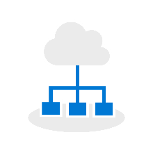

# Hitta hjälp för din Windows 10- och Office 365 ProPlus-distribution 

Om du planerar att genomföra din Windows 10-distribution med Office 365 ProPlus finns det flera alternativ för att få ytterligare hjälp från certifierade Microsoft-partner och [Microsoft FastTrack](https://www.microsoft.com/fasttrack).

Nedan ser du en översikt över de tillgängliga tjänsterna justerade mot processen för [skrivbordsdistribution](https://www.aka.ms/howtoshift) för Windows 10, Office 365 ProPlus och Enterprise Mobility + Security med befintliga partner- och FastTrack-erbjudanden. I många fall medföljer tjänsterna med din kvalificerande prenumeration för Microsoft 365, Office 365 eller Windows 10 Enterprise. För de partnerbaserade tjänsterna som Windows 10 och Office 365 ProPlus-skrivbordsbedömning tillhandahåller Microsoft en kupong för tjänster som genomförs av partnern. Information om varje erbjudande finns i länkarna nedan.

 

<table>
<tr class="even">
<td></td>
<td>
<strong>Beredskap för enheter och appar</strong>

<ul>
<li>
<a href="https://aka.ms/MDAcustomerform">Bedömning för modernt skrivbord</a>, där en kvalificerad partner i din region ger din organisation en djupgående lösning för programvara och enhetskompatibilitet och en bedömning av uppdateringsberedskap med de senaste verktygen och procedurerna från Microsoft.

<li>
<a href="https://www.aka.ms/desktopappassure">Desktop App Assure</a>, där Microsofts FastTrack-tekniker tillhandahåller rådgivning och reparationsvägledning om du stöter på problem med programkompatibilitet när du distribuerar Windows 10 och Office 365 ProPlus eller pågående uppdateringar.

</ul></td>
</tr>
<tbody>
<tr class="odd">
<td></td>
<td>
<strong>Katalog- och nätverksberedskap</strong>

<ul>
<li>
<a href="https://docs.microsoft.com/fasttrack/o365-onboarding-and-migration#core">Grundregistrering</a>, där Microsofts FastTrack-specialister tillhandahåller identitetsintegrering mellan de aktuella katalogtjänsterna och Azure Active Directory. Det här krävs för Office 365 ProPlus, Microsoft Intune, OneDrive och andra Office 365- och EMS-molntjänster som en del av din datordistribution.
</li>
</ul></td>
</tr>
<tr class="even">
<td></td>
<td>
<strong>Leverans av Office- och LOB-appar</strong>

<ul>
<li>
<a href="https://docs.microsoft.com/fasttrack/o365-onboarding-and-migration#office-365-proplus">Office 365 ProPlus</a>-konfiguration och -distribution, där Microsofts FastTrack-specialister tillhandahåller hjälp med att distribuera användarlicenser, konfigurera installation och uppdateringsinställningar för Klicka-och-kör och skapa paket om din organisation använder Microsoft Endpoint Configuration Manager.
</li>
</ul></td>
</tr>
<tr class="odd">
<td></td>
<td>
<strong>Migrering av användares filer och inställningar</strong>

<ul>
<li>
<a href="https://docs.microsoft.com/fasttrack/o365-onboarding-and-migration#onedrive-for-business">OneDrive</a>-konfiguration och -implementering, där Microsofts FastTrack-specialister tillhandahåller hjälp med att etablera användarlicenser och konfigurera synkroniseringsinställningar för OneDrive-klient. För organisationer med giltiga prenumerationer <a href="https://docs.microsoft.com/fasttrack/data-migration">migrerar FastTrack data till OneDrive</a>.
</li>
</ul></td>
</tr>
<tr class="even">
<td></td>
<td>
<strong>Överväganden för säkerhet och efterlevnad</strong>

<ul>
<li>
<a href="https://docs.microsoft.com/enterprise-mobility-security/Solutions/fasttrack-center-benefit-process-for-ems-fasttrack-responsibilities#enable-phase">Azure AD Premium</a>, där Microsofts FastTrack-specialister tillhandahåller hjälp med att aktivera tjänster för att förstärka din säkerhets- och informationsskyddsnivå när du börjar använda Microsoft 365. Tjänsterna inkluderar Azure Multi-Factor Authentication, självbetjäning för återställning av lösenord, villkorlig åtkomst i Azure Active Directory och mycket mer. För säkerhets- och slutpunktssäkerhet kan även Microsoft FastTrack hjälpa dig med <a href="https://docs.microsoft.com/enterprise-mobility-security/Solutions/fasttrack-center-benefit-process-for-ems-fasttrack-responsibilities#enable-phase">Microsoft Intune</a>-distribution och -principer.
</li>
</ul></td>
</tr>
<tr class="odd">
<td></td>
<td>
<strong>Distribution av operativsystem och uppdateringar av funktioner </strong>

<ul>
<li>
<a href="https://docs.microsoft.com/enterprise-mobility-security/Solutions/fasttrack-center-benefit-process-for-ems-fasttrack-responsibilities#enable-phase">Microsoft Intune</a>, där Microsofts FastTrack-specialister tillhandahåller hjälp med etableringen av användarlicenser och konfigurering av Windows Autopilot för nya enheter, MDM-principer för Windows 10 och andra mobila enheter, inklusive programdistribution, Wi-Fi- och VPN-profiler, samhantering med Konfigurations hanteraren för Microsoft Endpoint Configuration Manager med mera.
</li>
</ul></td>
</tr>
<tr class="even">
<td></td>
<td>
<strong>Office och Windows som en tjänst</strong>

<ul>
<li>
<a href="https://docs.microsoft.com/enterprise-mobility-security/Solutions/fasttrack-center-benefit-process-for-ems-fasttrack-responsibilities">Microsoft Intune</a>, där Microsofts FastTrack specialister tillhandahåller assistans med att konfigurera uppdateringsprinciper för Windows 10 och Office 365 ProPlus. <a href="https://docs.microsoft.com/fasttrack/o365-onboarding-and-migration#office-365-proplus">Office 365 ProPlus</a>, där Microsoft-FastTrack kan ge vägledning för att konfigurera driftsättningsringarna för att hålla dig uppdaterad.
</li>
</ul></td>
</tr>
<tr class="odd">
<td></td>
<td>
<strong>Kommunikation och utbildning för användare</strong>

<ul>
<li>
<a href="https://www.microsoft.com/microsoft-365/success/productivitylibrary/quickly-and-easily-transform-new-devices?rtc=2">Produktivitetsbibliotek</a>, en uppsättning onlineresurser från Microsoft för slutanvändarens kommunikation och utbildning i Microsoft 365.
</li>
<li>
<a href="https://www.office.com/training">Office-utbildning</a>, en uppsättning onlineresurser från Microsofts slutanvändarutbildning på Office 365 och Office 365 ProPlus.
</li>
<li>
<a href="https://info.microsoft.com/Windows10AdoptionPlanningKit.html">Sats för införandeplanering med Windows 10</a>, en uppsättning onlineresurser från Microsoft som inkluderar användarens beredskapsresurser.
</li>
</ul></td>
</tr>
</tbody>
</table>

## **Ställ en fråga till Tech-communityn**

För vissa frågor när du planerar eller startar din distribution kan du ansluta dig till [Microsoft Tech-communityn](https://techcommunity.microsoft.com)

## **Relaterade resurser**

  - [Center för skrivbordsdistribution](https://www.aka.ms/howtoshift)

  - [Videor i skrivbordsdistributionsserien från Microsoft Mechanics](https://www.aka.ms/watchhowtoshift)

  - [Desktop Deployment and Management Lab Kit](https://aka.ms/howtoshiftlabs)
