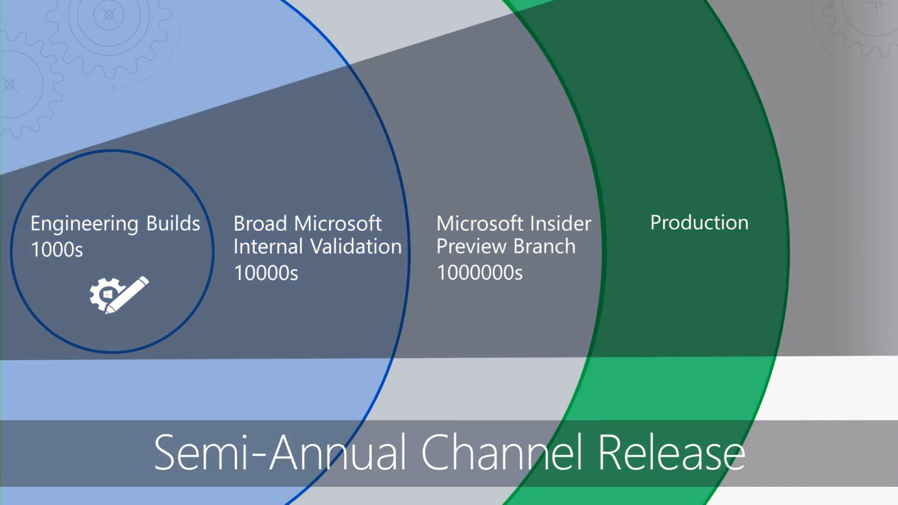

# Komma igång – Skrivbordsdistribution

<table>
<thead>
<td></td>
<td>
<strong>Komma igång: vägledning om användning, process och teknik</strong>

Läs om fördelarna med Windows 10 och Office 365 ProPlus, vilka större förändringar som gjorts och vilka överväganden som krävs jämfört med tidigare distributioner samt metodtips för att säkerställa en smidig övergång till Windows 10 och Office 365 ProPlus.
</td>
<td></td>
</thead>
</table>

>[!NOTE]
>I den här serien går vi igenom de bästa sätten att använda befintliga verktyg och presenterar de nya tekniker, tjänster och metoder som möjliggjorts av molnet.  Om du vill se en fullständig skrivbordsdistribution kan du gå till [Center för skrivbordsdistribution](https://aka.ms/HowToShift).
>

Välkommen till Center för skrivbordsdistribution, en central plats där du kan lära dig hur du planerar för och utför övergången till Windows 10 och Office 365 ProPlus. Det innebär att du kan använda en säker arbetsyta med de senaste produktivitets- och samarbetsfunktionerna.

Om det var länge sedan du distribuerade en ny skrivbordsmiljö har vi goda nyheter. Distributionsprocessen har förbättrats. Programkompatibilitet utgör inte ett lika stort problem som tidigare. Nya verktyg, och information som levereras via molnet, gör att du kan uppgradera på ett tryggare och mer effektivt sätt än tidigare.

I den här introduktionen beskriver vi vad som har ändrats och tar en titt på skrivbordsdistributionshjulet. Vi vägleder dig genom de rekommenderade stegen för övergången till Windows 10 och Office 365 ProPlus, och vi visar i detalj hur du kan använda dina befintliga verktyg och processer samtidigt som du börjar använda moderna tekniker och metoder. 

## Varför uppgradera?

Kombinationen av Windows 10 och Microsoft Intelligence Cloud ger dig bättre möjligheter att ge användarna en kraftfull och säker arbetsyta samtidigt som du får en enklare infrastruktur.

En viktig faktor inom modern hantering är att alltid ha uppdaterade enheter. I den här serien får du läsa om nya funktioner som du kan använda i din övergång till Windows 10 och Office 365 ProPlus och hur du håller dem uppdaterade med nya versioner som släpps varje halvår.

[Windows 10 för IT-proffs](https://www.microsoft.com/itpro/windows-10)

[Om Office 365 ProPlus i företaget](https://docs.microsoft.com/deployoffice/about-office-365-proplus-in-the-enterprise)

## Förändringar

Vi börjar med att ta en titt på vad som har förändrats och förbättrats sedan den senaste skrivbordsdistributionen. Om du inte har uppgraderat din skrivbordsmiljö på ett tag använder du troligtvis Windows 7 och Office 2010 eller Office 2013. Om du gör det kommer du att märka att vissa saker har förändrats sedan den senaste uppgraderingen. Här är några viktiga förändringar:

**Identitet och åtkomst:** Windows 10 och Office 365 ProPlus, som är anslutna till tjänster för molnproduktivitet, säkerhet och hantering, har en ny identitets- och åtkomsthanteringstjänst i grunden: Azure Active Directory (Azure AD). Tjänsten möjliggör enkel inloggning och säkra anslutningar mellan dina molntjänster, vilket innebär att du måste ha Azure AD för att kunna använda Microsoft 365-tjänster som Office 365, Intune och Windows Autopilot.

[Microsoft 365](https://www.microsoft.com/microsoft-365/default.aspx)

**Säker startmiljö:** 64-bitars inbyggd UEFI-programvara ersätter BIOS. Det innebär inte bara en kortare starttid. Det är också en förutsättning för att kunna använda flera av säkerhetsfunktionerna i Windows 10. Det går att köra Windows 10 på BIOS, men UEFI rekommenderas starkt. Om du inte har redan bytt från BIOS till UEFI (med 64 bitar) är det läge att göra det. Det finns verktyg som du kan använda för att göra detta vid uppgraderingen av Windows 10, eller efteråt.

**Molnbaserad enhetshantering:** Tjänster som Microsoft Intune hjälper dig att hantera dina Windows 10-enheter på samma sätt som du hanterar mobila enheter, från en och samma plats. Det som gör Microsoft Intune unikt är att du kan samhantera dina Windows 10-enheter med Microsoft Endpoint Configuration Manager. Du kan använda Configuration Manager i övergången till Windows 10 och sedan lägga till Microsoft Intune. När dessa används tillsammans blir Microsoft Endpoint Configuration Manager den intelligenta nätverksgränsen i organisationen, med anslutning till Microsoft Intelligent Cloud. Detta innebär att du kan hantera användarnas enheter på ett säkert sätt var de än är, oavsett om de är anslutna till organisationens infrastruktur eller det offentliga molnet.

[Samhantering av Windows 10-enheter](https://docs.microsoft.com/configmgr/core/clients/manage/co-management-overview)

**Molnbaserad distributionstjänst:** Vi har introducerat en ny molntjänst, Windows Autopilot, som hjälper dig att distribuera Microsoft 365-enheter när du köper nya datorer. Autopilot är integrerat med dina maskinvaruleverantörer, och de nya datorerna registreras automatiskt i Autopilot så att de kan levereras direkt till slutanvändaren. När datorn startas för första gången konfigureras den snabbt för just din organisation och efter användarnas specifika behov.

[Windows Autopilot](https://www.microsoft.com/windowsforbusiness/windows-autopilot)

**Klicka-och-kör-distributioner:** När du ska installera Office-skrivbordsprogram rekommenderar vi att du använder Office 365 ProPlus. Det ger dig tillgång till de senaste nyheterna i Office allt eftersom de utvecklas, så du inte behöver vänta i åratal innan du får nya funktioner. Du kan också använda en ny installation som kallas Klicka-och-kör.

Klicka-och-kör skiljer sig från äldre MSI-baserade paket. Klicka-och-kör är snabbare och mindre, och har stöd för uppdateringar i bakgrunden så att användarna kan fortsätta arbeta. Det är fortfarande en lokal kopia av Office och du kan fortsätta att använda dina befintliga distributionsverktyg, till exempel Microsoft Endpoint Configuration Manager, för att installera och konfigurera program.

[Distributionsguide för Office 365 ProPlus](https://docs.microsoft.com/DeployOffice/deployment-guide-for-office-365-proplus)

**Halvårsuppdateringar:** När du har övergått till Windows 10 och Office 365 ProPlus levereras uppdateringar varje halvår med nya funktioner. Eftersom Microsoft kan leverera information från molnet kan du snabbt och säkert installera dessa uppdateringar på hundratals eller tusentals enheter. Precis som på-plats-uppgraderingen bevaras appar, data och konfigurationer från tidigare versioner vid en funktionsuppdatering.

## Distributionsprocesshjulet

Innan du börjar måste du skapa en övergripande plan och få med nödvändiga parter på tåget. Distributionsprocesshjulet beskriver de viktiga stegen för att identifiera viktiga teammedlemmar och resurser som ska hanteras i följande distributionsområden.

**[Steg 1: Beredskap för enheter och appar](https://aka.ms/mdd1)** För att få en lyckad distribution måste du ta reda på vad du redan har. Det innebär att du måste göra en inventering av dina enheter och appar och kontrollera att de är kompatibla. Det finns verktyg i vår molnbaserade tjänst, Desktop Analytics, som kan hjälpa dig med detta. Med Desktop Analytics kan du, med hjälp av kompatibilitetsinformation och diagnostikdata som samlats in från hundratals miljoner datorer, utvärdera appar och drivrutiner som körs på din enhet. Du kan till och med exportera en lista över ”datorer som är redo för distribution” från Desktop Analytics till Configuration Manager (om du använder det) så att du kan bygga datagenererade samlingar av måldatorer allt eftersom de blir redo.

[Kom igång med uppgraderingsberedskap](https://docs.microsoft.com/windows/deployment/upgrade/upgrade-readiness-get-started)

**[Steg 2: Katalog- och nätverksberedskap](https://aka.ms/mdd2)** Implementera Azure Active Directory för identitets- och åtkomsthantering, om du inte redan har gjort det. Förbered också ditt nätverk på flytt av systemavbildningar, programpaket, användarfiler och uppdateringar. Det innebär stora mängder data. Ditt nätverk måste ha kapacitet att hantera den extra belastningen utan att det påverkar den dagliga verksamheten i din organisation. Vi har flera tillgängliga alternativ för nätverksoptimering, från bandbreddsbegränsning och P2P-alternativ till dynamisk bandbreddsrensning och differentiell uppdatering.

[BranchCache kontra peer-cache](https://blogs.technet.microsoft.com/swisspfe/2018/01/25/branch-cache-vs-peer-cache/)

**[Steg 3: Leverans av Office och verksamhetsspecifika appar](https://aka.ms/mdd3)** Windows fortsätter att stödja MSI-baserade installationer men har nu också stöd för nya installationsmekanismer som är optimerade för automatiserad distribution och kontinuerliga uppdateringar. Office 365 ProPlus- och Office 2019-klienter använder installationstekniken Klicka-och-kör. Du kanske vill göra UWP-appar tillgängliga, och du kanske har börjat distribuera alltfler program från tredje part och egenutvecklade verksamhetsspecifika program som använder de nya MSIX-paketerade apparna. Det här steget säkerställer att dina program är redo för automatisk distribution, och att du är redo oavsett om dina appar distribueras via Klicka-och-kör, MSIX, MSI (traditionell distribution), eller om dina appar är UWP-appar som distribuerats från en Microsoft Store för företag som du konfigurerat.

[Introduktion till MSIX](https://blogs.msdn.microsoft.com/sgern/2018/06/15/msix-intro/)

**[Steg 4: Migrering av användarfiler och inställningar](https://aka.ms/mdd4)** Det här är ett viktigt steg i alla utbytes- eller uppdateringscykler för datorer: du måste säkerställa att användarnas filer, data och inställningar bevaras under flytten. Det här steget omfattar alternativ för manuell eller automatiserad migrering, inklusive välbekanta och nya alternativ.

Precis som i tidigare uppgraderingar fortsätter User State Migration Tool att vara ett värdefullt verktyg för att automatisera den här processen, och att vara en integrerad del i migreringar som orkestreras med Microsoft Endpoint Configuration Manager eller Microsoft Deployment Toolkit. Det finns en risk att det uppstår en flaskhals när alla dessa data, ibland hundratals GB per dator, ska flyttas två gånger. Först från den gamla datorn och sedan till den nya datorn. Flytt av känd mapp är ett nytt alternativ i OneDrive som används för att synkronisera användarens dokument, bilder och skrivbordsfiler i stor skala via molnet, före distributionen.

[Dirigera om och flytta kända Windows-mappar till OneDrive](https://docs.microsoft.com/onedrive/redirect-known-folders)

**[Steg 5: Säkerhet och efterlevnad](https://aka.ms/mdd5)** Säkerhet och efterlevnad är ett område där det finns mycket att vinna på att övergå till Windows 10 och Office 365 ProPlus. Det är viktigt att du bekantar dig med de nya funktionerna och jämför med dem du redan har. Till exempel kan funktioner i Windows 10 som använder virtualiseringsbaserad säkerhet förhindra stöld av autentiseringsuppgifter och skydda mot webbläsarbaserade hot och körning av skadlig kod genom att kärnprocesser och hemligheter isoleras från operativsystemet. Molntjänster som Avancerat skydd ger dig dessutom en enhetlig plattform för säkerhetshärdning, identifiering efter intrång, undersökningar och åtgärder. Avancerat skydd skyddar dig mot skadliga e-postbilagor, osäkra hyperlänkar och mycket mer.

[Microsoft Security](https://www.microsoft.com/security/default.aspx)

**[Steg 6: Distribution av operativsystem och funktionsuppdateringar](https://aka.ms/mdd6)** När alla förberedelser har gjorts är nästa steg att distribuera OS-avbildningarna. Mycket av grovjobbet kan göras med System Center Configuration Manager-aktivitetssekvenser och -infrastruktur. Vi rekommenderar att distributionen utförs i faser där distributionen först görs på en liten testgrupp i organisationen med en representativ uppsättning maskinvara och appar. Sedan kan data från dessa enheter och användare användas för att gradvis utöka distributionen till fler datorer.

[Introduktion till operativsystemsdistribution i Configuration Manager](https://docs.microsoft.com/configmgr/osd/understand/introduction-to-operating-system-deployment)

**[Steg 7: Windows och Office som en tjänst](https://aka.ms/mdd7)** Det här innebär en stor förändring i hur du underhåller användarnas datorer. När du har övergått till Windows 10 och Office 365 ProPlus kan du börja hantera Windows och Office som en tjänst. I stället för att göra stora teknikbyten efter ett par år kan du kontinuerligt ge användarna nya funktioner, upplevelser och skydd.  Nya funktionsuppdateringar släpps varje höst och vår medan samlade kvalitetsuppdateringar med säkerhets-, tillförlitlighets- och felkorrigeringar släpps varje månad. Du kan välja att distribuera Office 2019-klienten, men vi rekommenderar starkt att du övergår till att använda Office 365 ProPlus. I så fall får du en liknande serviceplan som för Windows, vilket innebär att användarna får regelbundna uppdateringar för Office-programmen.

[Översikt över Windows som en tjänst](https://docs.microsoft.com/windows/deployment/update/waas-overview)
[Översikt över Office som en tjänst](https://docs.microsoft.com/DeployOffice/overview-of-update-channels-for-office-365-proplus)

**[Steg 8: Användarmeddelanden och utbildning](https://aka.ms/mdd8)** Det här sista steget är viktigt för att uppmuntra användning av nya funktioner för bättre samarbete, kommunikation, säkerhet och mycket mer. Vi rekommenderar att du distribuerar information och utbildning till användarna innan gör en bred distribution till användare utanför grupperna med tidiga användare. På så sätt kan du påverka hur nya funktioner används i Office, Windows eller andra verksamhetsspecifika appar och tjänster. Som hjälp tillhandahåller vi kostnadsfri utbildning online via Microsoft FastTrack. Dessutom har vi publicerad kostnadsfria kommunikationsplaner och tidslinjer samt mallar för e-post, sociala medier och intranät som hjälper dig med distributionen av Windows 10. Om din organisation använder Microsoft 365 eller Office 365 kan ni också vara berättigade till direktsupport.

## Nästa steg

Nu vet du vad som är nytt och annorlunda i Windows 10 och Office 365 ProPlus. Och vi har också gått igenom det rekommenderade distributionsprocesshjulet. Nu när du har fått ett smakprov på vilka instruktioner och verktyg från slutpunkt till slutpunkt som finns tillgängliga för att hjälpa dig med övergången till Windows 10 och Office 365 ProPlus är det dags att sätta igång.

## [Steg 1: Beredskap för enheter och appar](https://aka.ms/mdd1)

