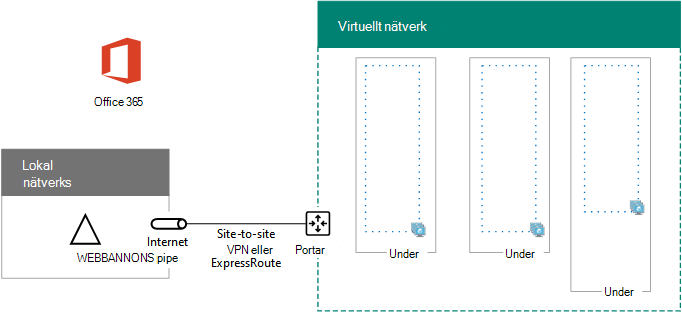

# <a name="high-availability-federated-authentication-phase-1-configure-azure"></a>Mellanliggande federerad autentiseringsläge med hög tillgänglighet: Konfigurera Azure

I den här fasen skapar du resurs grupper, virtuella nätverk (VNet) och tillgänglighets uppsättningar i Azure som ska vara värd för de virtuella datorerna i steg 2, 3 och 4. Du måste slutföra den här fasen innan du går vidare till [steg 2: Konfigurera domänkontrollanter](high-availability-federated-authentication-phase-2-configure-domain-controllers.md). Se [distribuera federerad inloggningsautentisering med hög tillgänglighet för Microsoft 365 i Azure](deploy-high-availability-federated-authentication-for-microsoft-365-in-azure.md) för alla faser.
  
Azure måste tillhandahållas med dessa grundläggande komponenter:
  
- Resurs grupper
    
- Ett lokalt Azure-nätverk (VNet) med undernät för att vara värd för de virtuella Azure-datorerna
    
- Nätverks säkerhets grupper för att utföra under näts isolering
    
- Tillgänglighets uppsättningar
    
## <a name="configure-azure-components"></a>Konfigurera Azure-komponenter

Innan du börjar konfigurera Azure-komponenter fyller du i följande tabeller. För att hjälpa dig att konfigurera Azure kan du skriva ut det här avsnittet och skriva ner informationen eller kopiera det här avsnittet till ett dokument och fylla i det. För inställningar för VNet fyller du i tabell V.
  
|**Objekt**|**Konfigurations inställning**|**Beskrivning**|**Värde**|
|:-----|:-----|:-----|:-----|
|1.  <br/> |VNet-namn  <br/> |Ett namn som ska kopplas till VNet (exempel FedAuthNet).  <br/> |  <br/> |
|2.  <br/> |VNet-plats  <br/> |Det regionala Azure-datacentret som kommer att innehålla det virtuella nätverket.  <br/> |  <br/> |
|3.  <br/> |IP-adress för VPN-enhet  <br/> |Offentlig IPv4-adress för din VPN-enhets gränssnitt på Internet.  <br/> |  <br/> |
|4.  <br/> |Virtuellt nätverk-adress utrymme  <br/> |Adress utrymmet för det virtuella nätverket. Arbeta med IT-avdelningen för att ta reda på det här adress utrymmet.  <br/> |  <br/> |
|5.  <br/> |Delad IPsec-nycklar  <br/> |En 32-tecken slumpmässig, alfanumerisk sträng som används för att autentisera båda sidor av VPN-anslutningen för webbplats-till-plats. Arbeta med din IT-eller säkerhets avdelning för att fastställa det här nyckelvärdet. Du kan också läsa [skapa en slumpmässig sträng för en förutdelad IPsec-produktnyckel](https://social.technet.microsoft.com/wiki/contents/articles/32330.create-a-random-string-for-an-ipsec-preshared-key.aspx).  <br/> |  <br/> |
   
 **Tabell V: konfiguration för lokalt nätverk**
  
Fyll i tabell S efter under nätet för den här lösningen. Alla adress utrymmen bör vara i CIDR-format (Classless Interdomain Routing), som även kallas för nätverksprefix. Ett exempel är 10.24.64.0/20.
  
För de tre första under näten anger du ett namn och ett enskilt IP-adressutrymmet baserat på det virtuella nätverkets adress utrymme. För gateway-undernätet bestämmer du det 27-bitars adress utrymmet (med en/27 prefixlängd) för Azure Gateway-under nätet med följande:
  
1. Ställ in de variabla bitarna i det mellanliggande nätverkets adress utrymme till 1, upp till de bitar som används av Gateway-undernätet och ange sedan de återstående bitarna till 0.
    
2. Konvertera de resulterande bitarna till decimal och uttrycka det som ett adress utrymme med prefixlängden angiven till gateway-undernätets längd.
    
Se [adress utrymmes Kalkylatorn för Azure Gateway-undernät](address-space-calculator-for-azure-gateway-subnets.md) för ett PowerShell Command block-och C#-eller python-konsol program som utför den här beräkningen åt dig.
  
Arbeta med IT-avdelningen för att fastställa dessa adress utrymmen från det virtuella nätverkets adress utrymme.
  
|**Objekt**|**Namn på undernät**|**Adress utrymme för undernät**|**Syfte**|
|:-----|:-----|:-----|:-----|
|1.  <br/> |  <br/> |  <br/> |Det undernät som används av AD DS-domänkontrollanten (Active Directory Domain Services) och virtuella datorer för katalogpartition för katalog.  <br/> |
|2.  <br/> |  <br/> |  <br/> |Under nätet som används av AD FS VM.  <br/> |
|3.  <br/> |  <br/> |  <br/> |Under nätet som används av Webbprogramproxy för webb programmet.  <br/> |
|4.  <br/> |GatewaySubnet  <br/> |  <br/> |Under nätet som används av Azure Gateway VMs.  <br/> |
   
 **Tabell S: undernät i det virtuella nätverket**
  
Fyll i tabell I för de statiska IP-adresser som är tilldelade till virtuella datorer och belastnings Utjämnings instanser.
  
|**Objekt**|**Syfte**|**IP-adress på under nätet**|**Värde**|
|:-----|:-----|:-----|:-----|
|1.  <br/> |Statisk IP-adress för den första domänkontrollanten  <br/> |Den fjärde möjliga IP-adressen för adress utrymmet för under nätet som definieras i punkt 1 i tabell S.  <br/> |  <br/> |
|2.  <br/> |Den andra domänkontrollantens statiska IP-adress  <br/> |Den femte möjliga IP-adressen för adress utrymmet för under nätet som definieras i punkt 1 i tabell S.  <br/> |  <br/> |
|3.  <br/> |Statisk IP-adress för katalogpartitionen  <br/> |Den sjätte möjliga IP-adressen för adress utrymmet för under nätet som definieras i punkt 1 i tabell S.  <br/> |  <br/> |
|4.  <br/> |Statisk IP-adress för intern belastningsutjämnaren för AD FS-servrarna  <br/> |Den fjärde möjliga IP-adressen för adress utrymmet för under nätet som definieras i punkt 2 i tabell S.  <br/> |  <br/> |
|5.  <br/> |Statisk IP-adress för den första AD FS-servern  <br/> |Den femte möjliga IP-adressen för det under nätets adress utrymme som definieras i punkt 2 i tabell S.  <br/> |  <br/> |
|18.6.  <br/> |Statisk IP-adress för den andra AD FS-servern  <br/> |Den sjätte möjliga IP-adressen för adress utrymmet för under nätet som definieras i punkt 2 i tabell S.  <br/> |  <br/> |
|borttagning.  <br/> |Statisk IP-adress för den första Web Application-proxyservern  <br/> |Den fjärde möjliga IP-adressen för adress utrymmet för under nätet som definieras i punkt 3 i tabell S.  <br/> |  <br/> |
|8.2.  <br/> |Statisk IP-adress för den andra Web Application Proxy-servern  <br/> |Den femte möjliga IP-adressen för adress utrymmet för under nätet som definieras i punkt 3 i tabell S.  <br/> |  <br/> |
   
 **Tabell I: statiska IP-adresser i det virtuella nätverket**
  
För två DNS-servrar (Domain Name System) i det lokala nätverk som du vill använda när du först konfigurerar domän kontrol Lanterna i det virtuella nätverket fyller du i tabell D. arbeta med IT-avdelningen för att fastställa den här listan.
  
|**Objekt**|**Eget namn på DNS-Server**|**IP-adress för DNS-Server**|
|:-----|:-----|:-----|
|1.  <br/> |  <br/> |  <br/> |
|2.  <br/> |  <br/> |  <br/> |
   
 **Tabell D: lokala DNS-servrar**
  
Om du vill dirigera paket från det lokala nätverket till organisationens nätverk via VPN-anslutningen för webbplats-till-plats måste du konfigurera det virtuella nätverket med ett lokalt nätverk som har en lista med adress utrymmen (i CIDR-notation) för alla tillgängliga platser i organisationens lokala nätverk. Listan med adress utrymmen som definierar ditt lokala nätverk måste vara unikt och får inte överlappa det adress utrymme som används för andra virtuella nätverk eller andra lokala nätverk.
  
För uppsättningen med lokala nätverks adress utrymmen fyller du i tabell L. Lägg märke till att tre tomma poster visas, men att du oftast behöver mer. Arbeta med IT-avdelningen för att fastställa den här listan med adress utrymmen.
  
|**Objekt**|**Lokala nätverks adress utrymmet**|
|:-----|:-----|
|1.  <br/> |  <br/> |
|2.  <br/> |  <br/> |
|3.  <br/> |  <br/> |
   
 **Tabell L: adressprefix för det lokala nätverket**
  
Nu kan du börja bygga Azure-infrastrukturen för att hantera din federerad lösenordsautentisering för Microsoft 365.
  
> [!NOTE]
> Följande kommandouppsättningar använder den senaste versionen av Azure PowerShell. Se [komma igång med Azure PowerShell](https://docs.microsoft.com/powershell/azure/get-started-azureps). 
  
Starta först en Azure PowerShell-kommandotolk och logga in på ditt konto.
  
```powershell
Connect-AzAccount
```

> [!TIP]
> Använd den här [arbets boken för Microsoft Excel-konfiguration](https://github.com/MicrosoftDocs/OfficeDocs-Enterprise/raw/live/Enterprise/downloads/O365FedAuthInAzure_Config.xlsx)om du vill skapa PowerShell-Kommandotolken som är klara att köra. 

Hämta ditt prenumerationsnamn med följande kommando.
  
```powershell
Get-AzSubscription | Sort Name | Select Name
```

Använd det här kommandot i stället för äldre versioner av Azure PowerShell.
  
```powershell
Get-AzSubscription | Sort Name | Select SubscriptionName
```

Ange din Azure-prenumeration. Ersätt allt inom citattecknen, inklusive \< and >-tecknen med rätt namn.
  
```powershell
$subscrName="<subscription name>"
Select-AzSubscription -SubscriptionName $subscrName
```

Skapa sedan de nya resurs grupperna. Använd det här kommandot för att ange en lista över befintliga resurs grupper.
  
```powershell
Get-AzResourceGroup | Sort ResourceGroupName | Select ResourceGroupName
```

Fyll i följande tabell efter uppsättningen med unika resurs grupps namn.
  
|**Objekt**|**Resurs grupps namn**|**Syfte**|
|:-----|:-----|:-----|
|1.  <br/> |  <br/> |Domänkontrollanter  <br/> |
|2.  <br/> |  <br/> |AD FS-servrar  <br/> |
|3.  <br/> |  <br/> |Webbprogramproxy  <br/> |
|4.  <br/> |  <br/> |Infrastruktur element  <br/> |
   
 **Tabell R: resurs grupper**
  
Skapa dina nya resurs grupper med dessa kommandon.
  
```powershell
$locName="<an Azure location, such as West US>"
$rgName="<Table R - Item 1 - Name column>"
New-AzResourceGroup -Name $rgName -Location $locName
$rgName="<Table R - Item 2 - Name column>"
New-AzResourceGroup -Name $rgName -Location $locName
$rgName="<Table R - Item 3 - Name column>"
New-AzResourceGroup -Name $rgName -Location $locName
$rgName="<Table R - Item 4 - Name column>"
New-AzResourceGroup -Name $rgName -Location $locName
```

Sedan skapar du ett Azure Virtual Network och dess undernät.
  
```powershell
$rgName="<Table R - Item 4 - Resource group name column>"
$locName="<your Azure location>"
$vnetName="<Table V - Item 1 - Value column>"
$vnetAddrPrefix="<Table V - Item 4 - Value column>"
$dnsServers=@( "<Table D - Item 1 - DNS server IP address column>", "<Table D - Item 2 - DNS server IP address column>" )
# Get the shortened version of the location
$locShortName=(Get-AzResourceGroup -Name $rgName).Location

# Create the subnets
$subnet1Name="<Table S - Item 1 - Subnet name column>"
$subnet1Prefix="<Table S - Item 1 - Subnet address space column>"
$subnet1=New-AzVirtualNetworkSubnetConfig -Name $subnet1Name -AddressPrefix $subnet1Prefix
$subnet2Name="<Table S - Item 2 - Subnet name column>"
$subnet2Prefix="<Table S - Item 2 - Subnet address space column>"
$subnet2=New-AzVirtualNetworkSubnetConfig -Name $subnet2Name -AddressPrefix $subnet2Prefix
$subnet3Name="<Table S - Item 3 - Subnet name column>"
$subnet3Prefix="<Table S - Item 3 - Subnet address space column>"
$subnet3=New-AzVirtualNetworkSubnetConfig -Name $subnet3Name -AddressPrefix $subnet3Prefix
$gwSubnet4Prefix="<Table S - Item 4 - Subnet address space column>"
$gwSubnet=New-AzVirtualNetworkSubnetConfig -Name "GatewaySubnet" -AddressPrefix $gwSubnet4Prefix

# Create the virtual network
New-AzVirtualNetwork -Name $vnetName -ResourceGroupName $rgName -Location $locName -AddressPrefix $vnetAddrPrefix -Subnet $gwSubnet,$subnet1,$subnet2,$subnet3 -DNSServer $dnsServers

```

Sedan skapar du nätverks säkerhets grupper för varje undernät som har virtuella datorer. Om du vill utföra under näts isolering kan du lägga till regler för de specifika trafik typer som tillåts eller nekas till nätverks säkerhets gruppen för ett undernät.
  
```powershell
# Create network security groups
$vnet=Get-AzVirtualNetwork -ResourceGroupName $rgName -Name $vnetName

New-AzNetworkSecurityGroup -Name $subnet1Name -ResourceGroupName $rgName -Location $locShortName
$nsg=Get-AzNetworkSecurityGroup -Name $subnet1Name -ResourceGroupName $rgName
Set-AzVirtualNetworkSubnetConfig -VirtualNetwork $vnet -Name $subnet1Name -AddressPrefix $subnet1Prefix -NetworkSecurityGroup $nsg

New-AzNetworkSecurityGroup -Name $subnet2Name -ResourceGroupName $rgName -Location $locShortName
$nsg=Get-AzNetworkSecurityGroup -Name $subnet2Name -ResourceGroupName $rgName
Set-AzVirtualNetworkSubnetConfig -VirtualNetwork $vnet -Name $subnet2Name -AddressPrefix $subnet2Prefix -NetworkSecurityGroup $nsg

New-AzNetworkSecurityGroup -Name $subnet3Name -ResourceGroupName $rgName -Location $locShortName
$nsg=Get-AzNetworkSecurityGroup -Name $subnet3Name -ResourceGroupName $rgName
Set-AzVirtualNetworkSubnetConfig -VirtualNetwork $vnet -Name $subnet3Name -AddressPrefix $subnet3Prefix -NetworkSecurityGroup $nsg
$vnet | Set-AzVirtualNetwork
```

Använd sedan dessa kommandon för att skapa gatewayen för VPN-anslutningen för webbplats-till-plats.
  
```powershell
$rgName="<Table R - Item 4 - Resource group name column>"
$locName="<Azure location>"
$vnetName="<Table V - Item 1 - Value column>"
$vnet=Get-AzVirtualNetwork -Name $vnetName -ResourceGroupName $rgName
$subnet=Get-AzVirtualNetworkSubnetConfig -VirtualNetwork $vnet -Name "GatewaySubnet"

# Attach a virtual network gateway to a public IP address and the gateway subnet
$publicGatewayVipName="PublicIPAddress"
$vnetGatewayIpConfigName="PublicIPConfig"
New-AzPublicIpAddress -Name $vnetGatewayIpConfigName -ResourceGroupName $rgName -Location $locName -AllocationMethod Dynamic
$publicGatewayVip=Get-AzPublicIpAddress -Name $vnetGatewayIpConfigName -ResourceGroupName $rgName
$vnetGatewayIpConfig=New-AzVirtualNetworkGatewayIpConfig -Name $vnetGatewayIpConfigName -PublicIpAddressId $publicGatewayVip.Id -Subnet $subnet

# Create the Azure gateway
$vnetGatewayName="AzureGateway"
$vnetGateway=New-AzVirtualNetworkGateway -Name $vnetGatewayName -ResourceGroupName $rgName -Location $locName -GatewayType Vpn -VpnType RouteBased -IpConfigurations $vnetGatewayIpConfig

# Create the gateway for the local network
$localGatewayName="LocalNetGateway"
$localGatewayIP="<Table V - Item 3 - Value column>"
$localNetworkPrefix=@( <comma-separated, double-quote enclosed list of the local network address prefixes from Table L, example: "10.1.0.0/24", "10.2.0.0/24"> )
$localGateway=New-AzLocalNetworkGateway -Name $localGatewayName -ResourceGroupName $rgName -Location $locName -GatewayIpAddress $localGatewayIP -AddressPrefix $localNetworkPrefix

# Define the Azure virtual network VPN connection
$vnetConnectionName="S2SConnection"
$vnetConnectionKey="<Table V - Item 5 - Value column>"
$vnetConnection=New-AzVirtualNetworkGatewayConnection -Name $vnetConnectionName -ResourceGroupName $rgName -Location $locName -ConnectionType IPsec -SharedKey $vnetConnectionKey -VirtualNetworkGateway1 $vnetGateway -LocalNetworkGateway2 $localGateway

```

> [!NOTE]
> Federerad inloggningsautentisering för enskilda användare förlitar sig inte på lokala resurser. Men om den här VPN-anslutningen för webbplats-till-plats blir otillgänglig kommer domän kontrol Lanterna i VNet inte att få uppdateringar för användar konton och grupper som görs i lokala Active Directory Domain Services. För att säkerställa att detta inte sker kan du konfigurera hög tillgänglighet för din VPN-anslutning för plats-till-plats. Mer information finns i [lättillgängliga kors lokala och VNET-till-VNet-anslutningar](https://docs.microsoft.com/azure/vpn-gateway/vpn-gateway-highlyavailable)
  
Ange sedan den offentliga IPv4-adressen för Azure VPN gateway för ditt virtuella nätverk från visningen av det här kommandot:
  
```powershell
Get-AzPublicIpAddress -Name $publicGatewayVipName -ResourceGroupName $rgName
```

Konfigurera sedan din lokala VPN-enhet för att ansluta till Azure VPN gateway. Mer information finns i [Konfigurera din VPN-enhet](https://docs.microsoft.com/azure/vpn-gateway/vpn-gateway-about-vpn-devices).
  
För att konfigurera den lokala VPN-enheten behöver du följande:
  
- Offentlig IPv4-adress för Azure VPN gateway.
    
- Den fördelade IPsec-länken för VPN för webbplats-till-plats (tabell V-post 5-värde-kolumnen).
    
Kontrol lera sedan att adress utrymmet för det virtuella nätverket kan nås från det lokala nätverket. Detta görs vanligt vis genom att lägga till en väg som motsvarar det virtuella nätverks adress utrymmet till din VPN-enhet och sedan annonseras till resten av infrastrukturen för routning i organisationens nätverk. Arbeta med IT-avdelningen för att ta reda på hur det går till.
  
Definiera sedan namnen på tre tillgänglighets uppsättningar. Fyll i tabell A. 
  
|**Objekt**|**Syfte**|**Namn på tillgänglighets uppsättning**|
|:-----|:-----|:-----|
|1.  <br/> |Domänkontrollanter  <br/> |  <br/> |
|2.  <br/> |AD FS-servrar  <br/> |  <br/> |
|3.  <br/> |Webbprogramproxy  <br/> |  <br/> |
   
 **Tabell A: tillgänglighets uppsättningar**
  
Du behöver dessa namn när du skapar de virtuella datorerna i steg 2, 3 och 4.
  
Skapa nya tillgänglighets uppsättningar med de här Azure PowerShell-kommandona.
  
```powershell
$locName="<the Azure location for your new resource group>"
$rgName="<Table R - Item 1 - Resource group name column>"
$avName="<Table A - Item 1 - Availability set name column>"
New-AzAvailabilitySet -ResourceGroupName $rgName -Name $avName -Location $locName -Sku Aligned  -PlatformUpdateDomainCount 5 -PlatformFaultDomainCount 2
$rgName="<Table R - Item 2 - Resource group name column>"
$avName="<Table A - Item 2 - Availability set name column>"
New-AzAvailabilitySet -ResourceGroupName $rgName -Name $avName -Location $locName -Sku Aligned  -PlatformUpdateDomainCount 5 -PlatformFaultDomainCount 2
$rgName="<Table R - Item 3 - Resource group name column>"
$avName="<Table A - Item 3 - Availability set name column>"
New-AzAvailabilitySet -ResourceGroupName $rgName -Name $avName -Location $locName -Sku Aligned  -PlatformUpdateDomainCount 5 -PlatformFaultDomainCount 2
```

Det här är konfigurationen som skapas när den här fasen har slutförts.
  
**Fas 1: Azure-infrastrukturen för extern tillgänglighets-federerad inloggningsautentisering för Microsoft 365**


  
## <a name="next-step"></a>Nästa steg

Använda [fas 2: Konfigurera domän kontrol Lanterna](high-availability-federated-authentication-phase-2-configure-domain-controllers.md) för att fortsätta med konfigurationen av denna arbets belastning.
  
## <a name="see-also"></a>Se även

[Distribuera federerad för hög tillgänglighet för Microsoft 365 i Azure](deploy-high-availability-federated-authentication-for-microsoft-365-in-azure.md)
  
[Federerad identitet för din Microsoft 365-miljö](federated-identity-for-your-microsoft-365-dev-test-environment.md)
  
[Microsoft 365-center för lösningar och arkitektur](../solutions/solution-architecture-center.md)

[Förstå Microsoft 365-identitet och Azure Active Directory](about-microsoft-365-identity.md)


