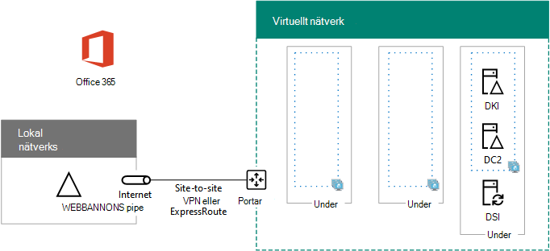

# <a name="high-availability-federated-authentication-phase-2-configure-domain-controllers"></a>Mellanliggande federerad autentiseringsläge med hög tillgänglighet: Konfigurera domänkontrollanter

I den här fasen av att distribuera hög tillgänglighet för Microsoft 365 federerad-verifikation i Azure Infrastructure Services konfigurerar du två domänkontrollanter och katalogpartitionen i Azure Virtual Network. Klient webb förfrågningar för autentisering kan sedan autentiseras i Azure Virtual Network i stället för att skicka verifierings trafiken via plats-till-plats-anslutningen till det lokala nätverket.
  
> [!NOTE]
> Active Directory Federation Services (AD FS) kan inte använda Azure Active Directory (Azure AD) som ersättning för AD DS-domänkontrollanter (Active Directory Domain Services). 
  
Du måste slutföra den här fasen innan du går vidare till [steg 3: Konfigurera AD FS-servrar](high-availability-federated-authentication-phase-3-configure-ad-fs-servers.md). Se [distribuera federerad inloggningsautentisering med hög tillgänglighet för Microsoft 365 i Azure](deploy-high-availability-federated-authentication-for-microsoft-365-in-azure.md) för alla faser.
  
## <a name="create-the-domain-controller-virtual-machines-in-azure"></a>Skapa virtuella dator datorer i Azure

Först måste du fylla i kolumnen Namn på **virtuell dator** för tabell M och ändra storlek på virtuell dator på det sätt som behövs i kolumnen **minsta storlek** .
  
|**Objekt**|**Namn på virtuell dator**|**Bild av galleriet**|**Lagrings typ**|**Minsta storlek**|
|:-----|:-----|:-----|:-----|:-----|
|1.  <br/> | (första domänkontrollanten, exempel DC1)  <br/> |Windows Server 2016 Data Center  <br/> |Standard_LRS  <br/> |Standard_D2  <br/> |
|2.  <br/> | (andra domänkontrollant, exempel DC2)  <br/> |Windows Server 2016 Data Center  <br/> |Standard_LRS  <br/> |Standard_D2  <br/> |
|3.  <br/> | (katalog synkroniseringstjänst, exempel DS1)  <br/> |Windows Server 2016 Data Center  <br/> |Standard_LRS  <br/> |Standard_D2  <br/> |
|4.  <br/> | (första AD FS-server, exempel ADFS1)  <br/> |Windows Server 2016 Data Center  <br/> |Standard_LRS  <br/> |Standard_D2  <br/> |
|5.  <br/> | (AD FS-server, exempel ADFS2)  <br/> |Windows Server 2016 Data Center  <br/> |Standard_LRS  <br/> |Standard_D2  <br/> |
|18.6.  <br/> | (första Webbprogramproxy, till exempel WEB1)  <br/> |Windows Server 2016 Data Center  <br/> |Standard_LRS  <br/> |Standard_D2  <br/> |
|borttagning.  <br/> | (andra Webbprogramproxy, till exempel WEB2)  <br/> |Windows Server 2016 Data Center  <br/> |Standard_LRS  <br/> |Standard_D2  <br/> |
   
 **Tabell M – virtuella maskiner för federerad åtkomst för hög tillgänglighet för Microsoft 365 i Azure**
  
En fullständig lista över storlek på virtuell dator finns i [storlekar för virtuella datorer](https://docs.microsoft.com/azure/virtual-machines/virtual-machines-windows-sizes).
  
Följande kommando block för Azure PowerShell skapar de virtuella datorerna för de två domän kontrol Lanterna. Ange värden för variablerna och ta bort \< and > tecknen. Observera att det här kommando blocket för Azure PowerShell använder värden från följande tabeller:
  
- Tabell M, för de virtuella datorerna
    
- Tabell R för dina resurs grupper
    
- Tabell V, för dina virtuella nätverks inställningar
    
- Tabell S, för under nätverk
    
- Tabell I, för statiska IP-adresser
    
- Tabell A, för dina tillgänglighets uppsättningar
    
Kom ihåg att du har definierat tabeller R, V, S, I och en i [steg 1: Konfigurera Azure](high-availability-federated-authentication-phase-1-configure-azure.md).
  
> [!NOTE]
> Följande kommandouppsättningar använder den senaste versionen av Azure PowerShell. Se [komma igång med Azure PowerShell](https://docs.microsoft.com/powershell/azure/get-started-azureps). 
  
När du har angett alla korrekta värden kör du det resulterande blocket i Azure PowerShell-uppmaningen eller i PowerShell-integreringen (Integrated script Environment) på din dator.
  
> [!TIP]
> Använd den här [arbets boken för Microsoft Excel-konfiguration](https://github.com/MicrosoftDocs/OfficeDocs-Enterprise/raw/live/Enterprise/downloads/O365FedAuthInAzure_Config.xlsx)om du vill skapa PowerShell-Kommandotolken som är klara att köra. 

```powershell
# Set up variables common to both virtual machines
$locName="<your Azure location>"
$vnetName="<Table V - Item 1 - Value column>"
$subnetName="<Table S - Item 1 - Value column>"
$avName="<Table A - Item 1 - Availability set name column>"
$rgNameTier="<Table R - Item 1 - Resource group name column>"
$rgNameInfra="<Table R - Item 4 - Resource group name column>"

$rgName=$rgNameInfra
$vnet=Get-AzVirtualNetwork -Name $vnetName -ResourceGroupName $rgName
$subnet=Get-AzVirtualNetworkSubnetConfig -VirtualNetwork $vnet -Name $subnetName

$rgName=$rgNameTier
$avSet=Get-AzAvailabilitySet -Name $avName -ResourceGroupName $rgName 

# Create the first domain controller
$vmName="<Table M - Item 1 - Virtual machine name column>"
$vmSize="<Table M - Item 1 - Minimum size column>"
$staticIP="<Table I - Item 1 - Value column>"
$diskStorageType="<Table M - Item 1 - Storage type column>"
$diskSize=<size of the extra disk for Active Directory Domain Services (AD DS) data in GB>

$nic=New-AzNetworkInterface -Name ($vmName +"-NIC") -ResourceGroupName $rgName -Location $locName -Subnet $subnet -PrivateIpAddress $staticIP
$vm=New-AzVMConfig -VMName $vmName -VMSize $vmSize -AvailabilitySetId $avset.Id
$vm=Set-AzVMOSDisk -VM $vm -Name ($vmName +"-OS") -DiskSizeInGB 128 -CreateOption FromImage -StorageAccountType $diskStorageType
$diskConfig=New-AzDiskConfig -AccountType $diskStorageType -Location $locName -CreateOption Empty -DiskSizeGB $diskSize
$dataDisk1=New-AzDisk -DiskName ($vmName + "-DataDisk1") -Disk $diskConfig -ResourceGroupName $rgName
$vm=Add-AzVMDataDisk -VM $vm -Name ($vmName + "-DataDisk1") -CreateOption Attach -ManagedDiskId $dataDisk1.Id -Lun 1
$cred=Get-Credential -Message "Type the name and password of the local administrator account for the first domain controller." 
$vm=Set-AzVMOperatingSystem -VM $vm -Windows -ComputerName $vmName -Credential $cred -ProvisionVMAgent -EnableAutoUpdate
$vm=Set-AzVMSourceImage -VM $vm -PublisherName MicrosoftWindowsServer -Offer WindowsServer -Skus 2016-Datacenter -Version "latest"
$vm=Add-AzVMNetworkInterface -VM $vm -Id $nic.Id
New-AzVM -ResourceGroupName $rgName -Location $locName -VM $vm

# Create the second domain controller
$vmName="<Table M - Item 2 - Virtual machine name column>"
$vmSize="<Table M - Item 2 - Minimum size column>"
$staticIP="<Table I - Item 2 - Value column>"
$diskStorageType="<Table M - Item 2 - Storage type column>"
$diskSize=<size of the extra disk for AD DS data in GB>

$nic=New-AzNetworkInterface -Name ($vmName +"-NIC") -ResourceGroupName $rgName -Location $locName -Subnet $subnet -PrivateIpAddress $staticIP
$vm=New-AzVMConfig -VMName $vmName -VMSize $vmSize -AvailabilitySetId $avset.Id
$vm=Set-AzVMOSDisk -VM $vm -Name ($vmName +"-OS") -DiskSizeInGB 128 -CreateOption FromImage -StorageAccountType $diskStorageType
$diskConfig=New-AzDiskConfig -AccountType $diskStorageType -Location $locName -CreateOption Empty -DiskSizeGB $diskSize
$dataDisk1=New-AzDisk -DiskName ($vmName + "-DataDisk1") -Disk $diskConfig -ResourceGroupName $rgName
$vm=Add-AzVMDataDisk -VM $vm -Name ($vmName + "-DataDisk1") -CreateOption Attach -ManagedDiskId $dataDisk1.Id -Lun 1
$cred=Get-Credential -Message "Type the name and password of the local administrator account for the second domain controller." 
$vm=Set-AzVMOperatingSystem -VM $vm -Windows -ComputerName $vmName -Credential $cred -ProvisionVMAgent -EnableAutoUpdate
$vm=Set-AzVMSourceImage -VM $vm -PublisherName MicrosoftWindowsServer -Offer WindowsServer -Skus 2016-Datacenter -Version "latest"
$vm=Add-AzVMNetworkInterface -VM $vm -Id $nic.Id
New-AzVM -ResourceGroupName $rgName -Location $locName -VM $vm

# Create the directory synchronization server
$vmName="<Table M - Item 3 - Virtual machine name column>"
$vmSize="<Table M - Item 3 - Minimum size column>"
$staticIP="<Table I - Item 3 - Value column>"
$diskStorageType="<Table M - Item 3 - Storage type column>"

$nic=New-AzNetworkInterface -Name ($vmName +"-NIC") -ResourceGroupName $rgName -Location $locName -Subnet $subnet -PrivateIpAddress $staticIP
$vm=New-AzVMConfig -VMName $vmName -VMSize $vmSize

$cred=Get-Credential -Message "Type the name and password of the local administrator account for the directory synchronization server." 
$vm=Set-AzVMOperatingSystem -VM $vm -Windows -ComputerName $vmName -Credential $cred -ProvisionVMAgent -EnableAutoUpdate
$vm=Set-AzVMSourceImage -VM $vm -PublisherName MicrosoftWindowsServer -Offer WindowsServer -Skus 2016-Datacenter -Version "latest"
$vm=Add-AzVMNetworkInterface -VM $vm -Id $nic.Id
$vm=Set-AzVMOSDisk -VM $vm -Name ($vmName +"-OS") -DiskSizeInGB 128 -CreateOption FromImage -StorageAccountType $diskStorageType
New-AzVM -ResourceGroupName $rgName -Location $locName -VM $vm
```

> [!NOTE]
> Eftersom de här virtuella datorerna är för ett intranät program är de inte tilldelad en offentlig IP-adress eller en DNS-domän namns etikett och är exponerad för Internet. Det innebär att du inte kan ansluta till dem från Azure-portalen. Alternativet **Anslut** är inte tillgängligt när du visar egenskaperna för den virtuella datorn. Använd anslutning till fjärr skrivbord eller ett annat fjärr skrivbord för att ansluta till den virtuella datorn via dess privata IP-adress eller intranät-DNS-namn.
  
## <a name="configure-the-first-domain-controller"></a>Konfigurera den första domänkontrollanten

Använd fjärr skrivbords klienten som du väljer och skapa en fjärr skrivbords anslutning till den första virtuella domänkontrollanten. Använd dess DNS-eller dator namn och autentiseringsuppgifterna för det lokala administratörs kontot.
  
Lägg sedan till den extra data disken till den första domänkontrollanten med det här kommandot från en Windows PowerShell-kommandotolk **på den första domänkontrollantens virtuella dator**:
  
```powershell
Get-Disk | Where PartitionStyle -eq "RAW" | Initialize-Disk -PartitionStyle MBR -PassThru | New-Partition -AssignDriveLetter -UseMaximumSize | Format-Volume -FileSystem NTFS -NewFileSystemLabel "WSAD Data"
```

Testa sedan den första domänkontrollantens anslutnings barhet till platserna i organisationens nätverk genom att använda **ping** -kommandot för att skicka ping till namn och IP-adresser till resurser i organisationens nätverk.
  
Den här proceduren ser till att DNS-namnmatchning fungerar som de ska (att den virtuella datorn är korrekt konfigurerad med lokala DNS-servrar) och att paket kan skickas till och från det lokala virtuella nätverket. Om det inte fungerar kan du kontakta IT-avdelningen för att felsöka problem med DNS-namnmatchning och paket leverans.
  
Gå sedan till kommando tolken för Windows PowerShell på den första domänkontrollanten och kör följande kommandon:
  
```powershell
$domname="<DNS domain name of the domain for which this computer will be a domain controller, such as corp.contoso.com>"
$cred = Get-Credential -Message "Enter credentials of an account with permission to join a new domain controller to the domain"
Install-WindowsFeature AD-Domain-Services -IncludeManagementTools
Install-ADDSDomainController -InstallDns -DomainName $domname  -DatabasePath "F:\NTDS" -SysvolPath "F:\SYSVOL" -LogPath "F:\Logs" -Credential $cred
```

Du uppmanas att ange autentiseringsuppgifter för ett domän administratörs konto. Datorn startas om.
  
## <a name="configure-the-second-domain-controller"></a>Konfigurera den andra domänkontrollanten

Använd fjärr skrivbords klienten som du väljer och skapa en fjärr skrivbords anslutning till den andra domänkontrollantens virtuella dator. Använd dess DNS-eller dator namn och autentiseringsuppgifterna för det lokala administratörs kontot.
  
Sedan måste du lägga till den extra data disken till den andra domänkontrollanten med det här kommandot från en Windows PowerShell-kommandotolk **på den andra domänkontrollantens virtuella dator**:
  
```powershell
Get-Disk | Where PartitionStyle -eq "RAW" | Initialize-Disk -PartitionStyle MBR -PassThru | New-Partition -AssignDriveLetter -UseMaximumSize | Format-Volume -FileSystem NTFS -NewFileSystemLabel "WSAD Data"
```

Kör sedan följande kommandon:
  
```powershell
$domname="<DNS domain name of the domain for which this computer will be a domain controller, such as corp.contoso.com>"
$cred = Get-Credential -Message "Enter credentials of an account with permission to join a new domain controller to the domain"
Install-WindowsFeature AD-Domain-Services -IncludeManagementTools
Install-ADDSDomainController -InstallDns -DomainName $domname  -DatabasePath "F:\NTDS" -SysvolPath "F:\SYSVOL" -LogPath "F:\Logs" -Credential $cred

```

Du uppmanas att ange autentiseringsuppgifter för ett domän administratörs konto. Datorn startas om.
  
Sedan måste du uppdatera DNS-servrarna för det virtuella nätverket så att Azure tilldelar virtuella datorer IP-adresserna för de två nya domän kontrol Lanterna att använda som DNS-servrar. Fyll i variablerna och kör de här kommandona från en Windows PowerShell-kommandotolk på din lokala dator:
  
```powershell
$rgName="<Table R - Item 4 - Resource group name column>"
$adrgName="<Table R - Item 1 - Resource group name column>"
$locName="<your Azure location>"
$vnetName="<Table V - Item 1 - Value column>"
$onpremDNSIP1="<Table D - Item 1 - DNS server IP address column>"
$onpremDNSIP2="<Table D - Item 2 - DNS server IP address column>"
$staticIP1="<Table I - Item 1 - Value column>"
$staticIP2="<Table I - Item 2 - Value column>"
$firstDCName="<Table M - Item 1 - Virtual machine name column>"
$secondDCName="<Table M - Item 2 - Virtual machine name column>"

$vnet=Get-AzVirtualNetwork -ResourceGroupName $rgName -Name $vnetName
$vnet.DhcpOptions.DnsServers.Add($staticIP1)
$vnet.DhcpOptions.DnsServers.Add($staticIP2) 
$vnet.DhcpOptions.DnsServers.Remove($onpremDNSIP1)
$vnet.DhcpOptions.DnsServers.Remove($onpremDNSIP2) 
Set-AzVirtualNetwork -VirtualNetwork $vnet
Restart-AzVM -ResourceGroupName $adrgName -Name $firstDCName
Restart-AzVM -ResourceGroupName $adrgName -Name $secondDCName
```

Observera att vi startar om de två domän kontrol Lanterna så att de inte är konfigurerade med lokala DNS-servrar som DNS-servrar. Eftersom de båda är DNS-servrar konfigurerade de automatiskt med lokala DNS-servrar som DNS-vidarebefordrare när de uppgraderades till domänkontrollanter.
  
Nu måste vi skapa en Active Directory-replikeringsgrupp för att säkerställa att servrar i det virtuella Azure-nätverket använder de lokala domän kontrol Lanterna. Anslut till domänkontrollant med domän administratörs konto och kör följande kommandon från en Windows PowerShell-kommandotolk på administratörs nivå:
  
```powershell
$vnet="<Table V - Item 1 - Value column>"
$vnetSpace="<Table V - Item 4 - Value column>"
New-ADReplicationSite -Name $vnet 
New-ADReplicationSubnet -Name $vnetSpace -Site $vnet
```

## <a name="configure-the-directory-synchronization-server"></a>Konfigurera katalogpartitionen för servrar

Använd fjärr skrivbords klienten som du väljer och skapa en fjärr skrivbords anslutning till den virtuella datorn för den synkroniserade servern. Använd dess DNS-eller dator namn och autentiseringsuppgifterna för det lokala administratörs kontot.
  
Gå sedan till den relevanta AD DS-domänen med de här kommandona i Windows PowerShell-uppmaningen.
  
```powershell
$domName="<AD DS domain name to join, such as corp.contoso.com>"
$cred=Get-Credential -Message "Type the name and password of a domain acccount."
Add-Computer -DomainName $domName -Credential $cred
Restart-Computer
```

Här är konfigurationen som skapas när den här fasen har slutförts, med plats hållare för dator namn.
  
**Fas 2: domän kontrol Lanterna och synkroniseringstjänst för extern tillgänglighet i Azure**


  
## <a name="next-step"></a>Nästa steg

Använda [fas 3: Konfigurera AD FS-servrar](high-availability-federated-authentication-phase-3-configure-ad-fs-servers.md) för att fortsätta konfigurera arbets belastningen.
  
## <a name="see-also"></a>Se även

[Distribuera federerad för hög tillgänglighet för Microsoft 365 i Azure](deploy-high-availability-federated-authentication-for-microsoft-365-in-azure.md)
  
[Federerad identitet för din Microsoft 365-miljö](federated-identity-for-your-microsoft-365-dev-test-environment.md)
  
[Microsoft 365-center för lösningar och arkitektur](../solutions/solution-architecture-center.md)


