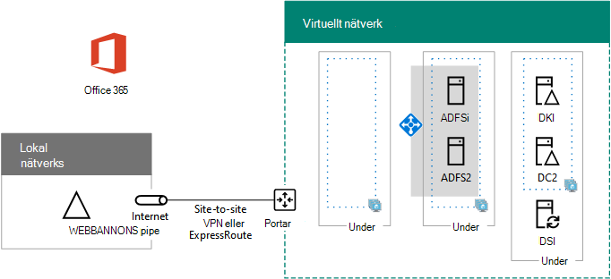

# <a name="high-availability-federated-authentication-phase-3-configure-ad-fs-servers"></a><span data-ttu-id="32751-103">Avancerad pool med hög tillgänglighet – steg 3: Konfigurera AD FS-servrar</span><span class="sxs-lookup"><span data-stu-id="32751-103">High availability federated authentication Phase 3: Configure AD FS servers</span></span>

<span data-ttu-id="32751-104">I den här fasen av att distribuera hög tillgänglighet för Microsoft 365 federerad-verifikation i Azure Infrastructure Services skapar du en intern belastningsutjämnare och två AD FS-servrar.</span><span class="sxs-lookup"><span data-stu-id="32751-104">In this phase of deploying high availability for Microsoft 365 federated authentication in Azure infrastructure services, you create an internal load balancer and two AD FS servers.</span></span>
  
<span data-ttu-id="32751-105">Du måste slutföra den här fasen innan du går vidare till [steg 4: Konfigurera Webbprogramproxy](high-availability-federated-authentication-phase-4-configure-web-application-pro.md).</span><span class="sxs-lookup"><span data-stu-id="32751-105">You must complete this phase before moving on to [Phase 4: Configure web application proxies](high-availability-federated-authentication-phase-4-configure-web-application-pro.md).</span></span> <span data-ttu-id="32751-106">Se [distribuera federerad inloggningsautentisering med hög tillgänglighet för Microsoft 365 i Azure](deploy-high-availability-federated-authentication-for-microsoft-365-in-azure.md) för alla faser.</span><span class="sxs-lookup"><span data-stu-id="32751-106">See [Deploy high availability federated authentication for Microsoft 365 in Azure](deploy-high-availability-federated-authentication-for-microsoft-365-in-azure.md) for all of the phases.</span></span>
  
## <a name="create-the-ad-fs-server-virtual-machines-in-azure"></a><span data-ttu-id="32751-107">Skapa AD FS-serverns virtuella datorer i Azure</span><span class="sxs-lookup"><span data-stu-id="32751-107">Create the AD FS server virtual machines in Azure</span></span>

<span data-ttu-id="32751-108">Använd följande block med PowerShell-kommandon för att skapa de virtuella datorerna för de två AD FS-servrarna.</span><span class="sxs-lookup"><span data-stu-id="32751-108">Use the following block of PowerShell commands to create the virtual machines for the two AD FS servers.</span></span> <span data-ttu-id="32751-109">Den här PowerShell-kommandoraden använder värden från följande tabeller:</span><span class="sxs-lookup"><span data-stu-id="32751-109">This PowerShell command set uses values from the following tables:</span></span>
  
- <span data-ttu-id="32751-110">Tabell M, för de virtuella datorerna</span><span class="sxs-lookup"><span data-stu-id="32751-110">Table M, for your virtual machines</span></span>
    
- <span data-ttu-id="32751-111">Tabell R för dina resurs grupper</span><span class="sxs-lookup"><span data-stu-id="32751-111">Table R, for your resource groups</span></span>
    
- <span data-ttu-id="32751-112">Tabell V, för dina virtuella nätverks inställningar</span><span class="sxs-lookup"><span data-stu-id="32751-112">Table V, for your virtual network settings</span></span>
    
- <span data-ttu-id="32751-113">Tabell S, för under nätverk</span><span class="sxs-lookup"><span data-stu-id="32751-113">Table S, for your subnets</span></span>
    
- <span data-ttu-id="32751-114">Tabell I, för statiska IP-adresser</span><span class="sxs-lookup"><span data-stu-id="32751-114">Table I, for your static IP addresses</span></span>
    
- <span data-ttu-id="32751-115">Tabell A, för dina tillgänglighets uppsättningar</span><span class="sxs-lookup"><span data-stu-id="32751-115">Table A, for your availability sets</span></span>
    
<span data-ttu-id="32751-116">Kom ihåg att du har definierat tabell M i [steg 2: Konfigurera domän kontrol Lanterna](high-availability-federated-authentication-phase-2-configure-domain-controllers.md) och tabellerna R, V, S, i och A i [steg 1: Konfigurera Azure](high-availability-federated-authentication-phase-1-configure-azure.md).</span><span class="sxs-lookup"><span data-stu-id="32751-116">Recall that you defined Table M in [Phase 2: Configure domain controllers](high-availability-federated-authentication-phase-2-configure-domain-controllers.md) and Tables R, V, S, I, and A in [Phase 1: Configure Azure](high-availability-federated-authentication-phase-1-configure-azure.md).</span></span>
  
> [!NOTE]
> <span data-ttu-id="32751-117">Följande kommandouppsättningar använder den senaste versionen av Azure PowerShell.</span><span class="sxs-lookup"><span data-stu-id="32751-117">The following command sets use the latest version of Azure PowerShell.</span></span> <span data-ttu-id="32751-118">Se [komma igång med Azure PowerShell](https://docs.microsoft.com/powershell/azure/get-started-azureps).</span><span class="sxs-lookup"><span data-stu-id="32751-118">See [Get started with Azure PowerShell](https://docs.microsoft.com/powershell/azure/get-started-azureps).</span></span> 
  
<span data-ttu-id="32751-119">Först skapar du en intern högavvägning i Azure för de två AD FS-servrarna.</span><span class="sxs-lookup"><span data-stu-id="32751-119">First, you create an Azure internal load balancer for the two AD FS servers.</span></span> <span data-ttu-id="32751-120">Ange värden för variablerna och ta bort \< and > tecknen.</span><span class="sxs-lookup"><span data-stu-id="32751-120">Specify the values for the variables, removing the \< and > characters.</span></span> <span data-ttu-id="32751-121">När du har angett alla värden kör du det resulterande blocket vid kommando tolken i Azure PowerShell eller i PowerShell ISE.</span><span class="sxs-lookup"><span data-stu-id="32751-121">When you have supplied all the proper values, run the resulting block at the Azure PowerShell command prompt or in the PowerShell ISE.</span></span>
  
> [!TIP]
> <span data-ttu-id="32751-122">Använd den här [arbets boken för Microsoft Excel-konfiguration](https://github.com/MicrosoftDocs/OfficeDocs-Enterprise/raw/live/Enterprise/downloads/O365FedAuthInAzure_Config.xlsx)om du vill skapa PowerShell-Kommandotolken som är klara att köra.</span><span class="sxs-lookup"><span data-stu-id="32751-122">To generate ready-to-run PowerShell command blocks based on your custom settings, use this [Microsoft Excel configuration workbook](https://github.com/MicrosoftDocs/OfficeDocs-Enterprise/raw/live/Enterprise/downloads/O365FedAuthInAzure_Config.xlsx).</span></span> 

```powershell
# Set up key variables
$locName="<your Azure location>"
$vnetName="<Table V - Item 1 - Value column>"
$subnetName="<Table R - Item 2 - Subnet name column>"
$privIP="<Table I - Item 4 - Value column>"
$rgName=<Table R - Item 4 - Resource group name column>"

$vnet=Get-AzVirtualNetwork -Name $vnetName -ResourceGroupName $rgName
$subnet=Get-AzVirtualNetworkSubnetConfig -VirtualNetwork $vnet -Name $subnetName

$frontendIP=New-AzLoadBalancerFrontendIpConfig -Name "ADFSServers-LBFE" -PrivateIPAddress $privIP -Subnet $subnet
$beAddressPool=New-AzLoadBalancerBackendAddressPoolConfig -Name "ADFSServers-LBBE"

$healthProbe=New-AzLoadBalancerProbeConfig -Name WebServersProbe -Protocol "TCP" -Port 443 -IntervalInSeconds 15 -ProbeCount 2
$lbrule=New-AzLoadBalancerRuleConfig -Name "HTTPSTraffic" -FrontendIpConfiguration $frontendIP -BackendAddressPool $beAddressPool -Probe $healthProbe -Protocol "TCP" -FrontendPort 443 -BackendPort 443
New-AzLoadBalancer -ResourceGroupName $rgName -Name "ADFSServers" -Location $locName -LoadBalancingRule $lbrule -BackendAddressPool $beAddressPool -Probe $healthProbe -FrontendIpConfiguration $frontendIP
```

<span data-ttu-id="32751-123">Skapa sedan de virtuella AD FS server-datorerna.</span><span class="sxs-lookup"><span data-stu-id="32751-123">Next, create the AD FS server virtual machines.</span></span>
  
<span data-ttu-id="32751-124">När du har angett alla värden kör du det resulterande blocket vid kommando tolken i Azure PowerShell eller i PowerShell ISE.</span><span class="sxs-lookup"><span data-stu-id="32751-124">When you have supplied all the proper values, run the resulting block at the Azure PowerShell command prompt or in the PowerShell ISE.</span></span>
  
```powershell
# Set up variables common to both virtual machines
$locName="<your Azure location>"
$vnetName="<Table V - Item 1 - Value column>"
$subnetName="<Table R - Item 2 - Subnet name column>"
$avName="<Table A - Item 2 - Availability set name column>"
$rgNameTier="<Table R - Item 2 - Resource group name column>"
$rgNameInfra="<Table R - Item 4 - Resource group name column>"

$rgName=$rgNameInfra
$vnet=Get-AzVirtualNetwork -Name $vnetName -ResourceGroupName $rgName
$subnet=Get-AzVirtualNetworkSubnetConfig -VirtualNetwork $vnet -Name $subnetName
$backendSubnet=Get-AzVirtualNetworkSubnetConfig -Name $subnetName -VirtualNetwork $vnet
$webLB=Get-AzLoadBalancer -ResourceGroupName $rgName -Name "ADFSServers"

$rgName=$rgNameTier
$avSet=Get-AzAvailabilitySet -Name $avName -ResourceGroupName $rgName

# Create the first ADFS server virtual machine
$vmName="<Table M - Item 4 - Virtual machine name column>"
$vmSize="<Table M - Item 4 - Minimum size column>"
$staticIP="<Table I - Item 5 - Value column>"
$diskStorageType="<Table M - Item 4 - Storage type column>"

$nic=New-AzNetworkInterface -Name ($vmName +"-NIC") -ResourceGroupName $rgName -Location $locName -Subnet $backendSubnet -LoadBalancerBackendAddressPool $webLB.BackendAddressPools[0] -PrivateIpAddress $staticIP
$vm=New-AzVMConfig -VMName $vmName -VMSize $vmSize -AvailabilitySetId $avset.Id

$cred=Get-Credential -Message "Type the name and password of the local administrator account for the first AD FS server." 
$vm=Set-AzVMOperatingSystem -VM $vm -Windows -ComputerName $vmName -Credential $cred -ProvisionVMAgent -EnableAutoUpdate
$vm=Set-AzVMSourceImage -VM $vm -PublisherName MicrosoftWindowsServer -Offer WindowsServer -Skus 2016-Datacenter -Version "latest"
$vm=Add-AzVMNetworkInterface -VM $vm -Id $nic.Id
$vm=Set-AzVMOSDisk -VM $vm -Name ($vmName +"-OS") -DiskSizeInGB 128 -CreateOption FromImage -StorageAccountType $diskStorageType
New-AzVM -ResourceGroupName $rgName -Location $locName -VM $vm

# Create the second AD FS virtual machine
$vmName="<Table M - Item 5 - Virtual machine name column>"
$vmSize="<Table M - Item 5 - Minimum size column>"
$staticIP="<Table I - Item 6 - Value column>"
$diskStorageType="<Table M - Item 5 - Storage type column>"

$nic=New-AzNetworkInterface -Name ($vmName +"-NIC") -ResourceGroupName $rgName -Location $locName  -Subnet $backendSubnet -LoadBalancerBackendAddressPool $webLB.BackendAddressPools[0] -PrivateIpAddress $staticIP
$vm=New-AzVMConfig -VMName $vmName -VMSize $vmSize -AvailabilitySetId $avset.Id

$cred=Get-Credential -Message "Type the name and password of the local administrator account for the second AD FS server." 
$vm=Set-AzVMOperatingSystem -VM $vm -Windows -ComputerName $vmName -Credential $cred -ProvisionVMAgent -EnableAutoUpdate
$vm=Set-AzVMSourceImage -VM $vm -PublisherName MicrosoftWindowsServer -Offer WindowsServer -Skus 2016-Datacenter -Version "latest"
$vm=Add-AzVMNetworkInterface -VM $vm -Id $nic.Id
$vm=Set-AzVMOSDisk -VM $vm -Name ($vmName +"-OS") -DiskSizeInGB 128 -CreateOption FromImage -StorageAccountType $diskStorageType
New-AzVM -ResourceGroupName $rgName -Location $locName -VM $vm

```

> [!NOTE]
> <span data-ttu-id="32751-125">Eftersom de här virtuella datorerna är för ett intranät program är de inte tilldelad en offentlig IP-adress eller en DNS-domän namns etikett och är exponerad för Internet.</span><span class="sxs-lookup"><span data-stu-id="32751-125">Because these virtual machines are for an intranet application, they are not assigned a public IP address or a DNS domain name label and exposed to the Internet.</span></span> <span data-ttu-id="32751-126">Det innebär att du inte kan ansluta till dem från Azure-portalen.</span><span class="sxs-lookup"><span data-stu-id="32751-126">However, this also means that you cannot connect to them from the Azure portal.</span></span> <span data-ttu-id="32751-127">Alternativet **Anslut** är inte tillgängligt när du visar egenskaperna för den virtuella datorn.</span><span class="sxs-lookup"><span data-stu-id="32751-127">The **Connect** option is unavailable when you view the properties of the virtual machine.</span></span> <span data-ttu-id="32751-128">Använd anslutning till fjärr skrivbord eller ett annat fjärr skrivbord för att ansluta till den virtuella datorn via dess privata IP-adress eller intranät-DNS-namn.</span><span class="sxs-lookup"><span data-stu-id="32751-128">Use the Remote Desktop Connection accessory or another Remote Desktop tool to connect to the virtual machine using its private IP address or intranet DNS name.</span></span>
  
<span data-ttu-id="32751-129">Använd fjärr skrivbords klienten för varje virtuell dator och skapa en anslutning till fjärr skrivbord.</span><span class="sxs-lookup"><span data-stu-id="32751-129">For each virtual machine, use the remote desktop client of your choice and create a remote desktop connection.</span></span> <span data-ttu-id="32751-130">Använd dess DNS-eller dator namn och autentiseringsuppgifterna för det lokala administratörs kontot.</span><span class="sxs-lookup"><span data-stu-id="32751-130">Use its intranet DNS or computer name and the credentials of the local administrator account.</span></span>
  
<span data-ttu-id="32751-131">För varje virtuell dator ansluter du dem till den relevanta AD DS-domänen (Active Directory Domain Services) med de här kommandona i Windows PowerShell-uppmaningen.</span><span class="sxs-lookup"><span data-stu-id="32751-131">For each virtual machine, join them to the appropriate Active Directory Domain Services (AD DS) domain with these commands at the Windows PowerShell prompt.</span></span>
  
```powershell
$domName="<AD DS domain name to join, such as corp.contoso.com>"
$cred=Get-Credential -Message "Type the name and password of a domain acccount."
Add-Computer -DomainName $domName -Credential $cred
Restart-Computer
```

<span data-ttu-id="32751-132">Här är konfigurationen som skapas när den här fasen har slutförts, med plats hållare för dator namn.</span><span class="sxs-lookup"><span data-stu-id="32751-132">Here is the configuration resulting from the successful completion of this phase, with placeholder computer names.</span></span>
  
<span data-ttu-id="32751-133">**Fas 3: AD FS-servrar och intern belastningsutjämnare för din höganvända federerad autentiseringsprocess i Azure**</span><span class="sxs-lookup"><span data-stu-id="32751-133">**Phase 3: The AD FS servers and internal load balancer for your high availability federated authentication infrastructure in Azure**</span></span>


  
## <a name="next-step"></a><span data-ttu-id="32751-135">Nästa steg</span><span class="sxs-lookup"><span data-stu-id="32751-135">Next step</span></span>

<span data-ttu-id="32751-136">Använda [fas 4: Konfigurera Webbprogramproxy](high-availability-federated-authentication-phase-4-configure-web-application-pro.md) för att fortsätta konfigurera arbets belastningen.</span><span class="sxs-lookup"><span data-stu-id="32751-136">Use [Phase 4: Configure web application proxies](high-availability-federated-authentication-phase-4-configure-web-application-pro.md) to continue configuring this workload.</span></span>
  
## <a name="see-also"></a><span data-ttu-id="32751-137">Se även</span><span class="sxs-lookup"><span data-stu-id="32751-137">See Also</span></span>

[<span data-ttu-id="32751-138">Distribuera federerad för hög tillgänglighet för Microsoft 365 i Azure</span><span class="sxs-lookup"><span data-stu-id="32751-138">Deploy high availability federated authentication for Microsoft 365 in Azure</span></span>](deploy-high-availability-federated-authentication-for-microsoft-365-in-azure.md)
  
[<span data-ttu-id="32751-139">Federerad identitet för din Microsoft 365-miljö</span><span class="sxs-lookup"><span data-stu-id="32751-139">Federated identity for your Microsoft 365 dev/test environment</span></span>](federated-identity-for-your-microsoft-365-dev-test-environment.md)


