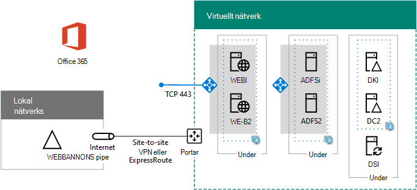

# <a name="high-availability-federated-authentication-phase-4-configure-web-application-proxies"></a>Federerad pool med hög tillgänglighet – steg 4: Konfigurera Webbprogramproxy

I den här fasen av att distribuera hög tillgänglighet för Microsoft 365 federerad-verifikation i Azure Infrastructure Services skapar du en intern belastningsutjämnare och två AD FS-servrar.
  
Du måste slutföra den här fasen innan du går vidare till [steg 5: Konfigurera federerad auktorisering för Microsoft 365](high-availability-federated-authentication-phase-5-configure-federated-authentic.md). Se [distribuera federerad inloggningsautentisering med hög tillgänglighet för Microsoft 365 i Azure](deploy-high-availability-federated-authentication-for-microsoft-365-in-azure.md) för alla faser.
  
## <a name="create-the-internet-facing-load-balancer-in-azure"></a>Skapa Internet Facing belastningsutjämnare i Azure

Du måste skapa en Internetbaserad belastnings utjämning så att Azure distribuerar trafiken för inkommande klientautentisering från Internet jämnt bland de två webbprogramproxy.
  
> [!NOTE]
> Följande kommandouppsättningar använder den senaste versionen av Azure PowerShell. Se [komma igång med Azure PowerShell](https://docs.microsoft.com/powershell/azure/get-started-azureps). 
  
När du har angett plats-och resurs grupp värden kör du det resulterande blocket vid kommando tolken i Azure PowerShell eller i PowerShell ISE.
  
> [!TIP]
> Använd den här [arbets boken för Microsoft Excel-konfiguration](https://github.com/MicrosoftDocs/OfficeDocs-Enterprise/raw/live/Enterprise/downloads/O365FedAuthInAzure_Config.xlsx)om du vill skapa PowerShell-Kommandotolken som är klara att köra. 

```powershell
# Set up key variables
$locName="<your Azure location>"
$rgName="<Table R - Item 4 - Resource group name column>"

$publicIP=New-AzPublicIpAddress -ResourceGroupName $rgName -Name "WebProxyPublicIP" -Location $LocName -AllocationMethod "Static"
$frontendIP=New-AzLoadBalancerFrontendIpConfig -Name "WebAppProxyServers-LBFE" -PublicIpAddress $publicIP
$beAddressPool=New-AzLoadBalancerBackendAddressPoolConfig -Name "WebAppProxyServers-LBBE"
$healthProbe=New-AzLoadBalancerProbeConfig -Name "WebServersProbe" -Protocol "TCP" -Port 443 -IntervalInSeconds 15 -ProbeCount 2
$lbrule=New-AzLoadBalancerRuleConfig -Name "WebTraffic" -FrontendIpConfiguration $frontendIP -BackendAddressPool $beAddressPool -Probe $healthProbe -Protocol "TCP" -FrontendPort 443 -BackendPort 443
New-AzLoadBalancer -ResourceGroupName $rgName -Name "WebAppProxyServers" -Location $locName -LoadBalancingRule $lbrule -BackendAddressPool $beAddressPool -Probe $healthProbe -FrontendIpConfiguration $frontendIP
```

Kör de här kommandona i Azure PowerShell-Kommandotolken på din lokala dator för att visa den offentliga IP-adressen som är tilldelad till din Internet-anslutning.
  
```powershell
Write-Host (Get-AzPublicIpaddress -Name "WebProxyPublicIP" -ResourceGroup $rgName).IPAddress
```

## <a name="determine-your-federation-service-fqdn-and-create-dns-records"></a>Fastställ FQDN-namn för Federations tjänsten och skapa DNS-poster

Du måste kontrol lera DNS-namnet för att identifiera ditt Federations tjänst namn på Internet. Azure AD Connect konfigurerar Microsoft 365 med det här namnet i steg 5, som kommer att bli en del av URL-adressen som Microsoft 365 skickar till att ansluta klienter för att få en säkerhetstoken. Ett exempel är fs.contoso.com (FS står för Federations tjänsten).
  
När du har en FDQN för Federations tjänsten skapar du en offentlig DNS-domän A-FDQN som matchas till den offentliga IP-adressen för Azure Internet-load-belastningsutjämnaren.
  
|**Name**|**Type (typ)**|**TTL**|**Värde**|
|:-----|:-----|:-----|:-----|
|Federations tjänstens FDQN  <br/> |Kallas  <br/> |3600  <br/> |offentlig IP-adress för Azure Internet-Facing belastningsutjämnare (visas i kommandot **Write-Host** i föregående avsnitt) <br/> |
   
Här är ett exempel:
  
|**Name**|**Type (typ)**|**TTL**|**Värde**|
|:-----|:-----|:-----|:-----|
|fs.contoso.com  <br/> |Kallas  <br/> |3600  <br/> |131.107.249.117  <br/> |
   
Lägg sedan till en DNS-postadress i organisationens privata DNS-namnområde som matchar den interna belastningsutjämnaren för AD FS-servrarna (tabell I, item 4, värde Column)...
  
## <a name="create-the-web-application-proxy-server-virtual-machines-in-azure"></a>Skapa Web Application Proxy Server-virtuella datorer i Azure

Använd följande block med Azure PowerShell-kommandon för att skapa virtuella datorer för de två webbprogramproxy. 
  
Observera att följande Azure PowerShell-kommando ställer in värden från följande tabeller:
  
- Tabell M, för de virtuella datorerna
    
- Tabell R för dina resurs grupper
    
- Tabell V, för dina virtuella nätverks inställningar
    
- Tabell S, för under nätverk
    
- Tabell I, för statiska IP-adresser
    
- Tabell A, för dina tillgänglighets uppsättningar
    
Kom ihåg att du har definierat tabell M i [steg 2: Konfigurera domän kontrol Lanterna](high-availability-federated-authentication-phase-2-configure-domain-controllers.md) och tabellerna R, V, S, i och A i [steg 1: Konfigurera Azure](high-availability-federated-authentication-phase-1-configure-azure.md).
  
När du har angett alla värden kör du det resulterande blocket vid kommando tolken i Azure PowerShell eller i PowerShell ISE.
  
```powershell
# Set up variables common to both virtual machines
$locName="<your Azure location>"
$vnetName="<Table V - Item 1 - Value column>"
$subnetName="<Table R - Item 3 - Subnet name column>"
$avName="<Table A - Item 3 - Availability set name column>"
$rgNameTier="<Table R - Item 3 - Resource group name column>"
$rgNameInfra="<Table R - Item 4 - Resource group name column>"

$rgName=$rgNameInfra
$vnet=Get-AzVirtualNetwork -Name $vnetName -ResourceGroupName $rgName
$subnet=Get-AzVirtualNetworkSubnetConfig -VirtualNetwork $vnet -Name $subnetName
$backendSubnet=Get-AzVirtualNetworkSubnetConfig -Name $subnetName -VirtualNetwork $vnet
$webLB=Get-AzLoadBalancer -ResourceGroupName $rgName -Name "WebAppProxyServers"

$rgName=$rgNameTier
$avSet=Get-AzAvailabilitySet -Name $avName -ResourceGroupName $rgName

# Create the first web application proxy server virtual machine
$vmName="<Table M - Item 6 - Virtual machine name column>"
$vmSize="<Table M - Item 6 - Minimum size column>"
$staticIP="<Table I - Item 7 - Value column>"
$diskStorageType="<Table M - Item 6 - Storage type column>"

$nic=New-AzNetworkInterface -Name ($vmName +"-NIC") -ResourceGroupName $rgName -Location $locName -Subnet $backendSubnet -LoadBalancerBackendAddressPool $webLB.BackendAddressPools[0] -PrivateIpAddress $staticIP
$vm=New-AzVMConfig -VMName $vmName -VMSize $vmSize -AvailabilitySetId $avset.Id

$cred=Get-Credential -Message "Type the name and password of the local administrator account for the first web application proxy server." 
$vm=Set-AzVMOperatingSystem -VM $vm -Windows -ComputerName $vmName -Credential $cred -ProvisionVMAgent -EnableAutoUpdate
$vm=Set-AzVMSourceImage -VM $vm -PublisherName MicrosoftWindowsServer -Offer WindowsServer -Skus 2016-Datacenter -Version "latest"
$vm=Add-AzVMNetworkInterface -VM $vm -Id $nic.Id
$vm=Set-AzVMOSDisk -VM $vm -Name ($vmName +"-OS") -DiskSizeInGB 128 -CreateOption FromImage -StorageAccountType $diskStorageType
New-AzVM -ResourceGroupName $rgName -Location $locName -VM $vm

# Create the second web application proxy virtual machine
$vmName="<Table M - Item 7 - Virtual machine name column>"
$vmSize="<Table M - Item 7 - Minimum size column>"
$staticIP="<Table I - Item 8 - Value column>"
$diskStorageType="<Table M - Item 7 - Storage type column>"

$nic=New-AzNetworkInterface -Name ($vmName +"-NIC") -ResourceGroupName $rgName -Location $locName  -Subnet $backendSubnet -LoadBalancerBackendAddressPool $webLB.BackendAddressPools[0] -PrivateIpAddress $staticIP
$vm=New-AzVMConfig -VMName $vmName -VMSize $vmSize -AvailabilitySetId $avset.Id

$cred=Get-Credential -Message "Type the name and password of the local administrator account for the second web application proxy server." 
$vm=Set-AzVMOperatingSystem -VM $vm -Windows -ComputerName $vmName -Credential $cred -ProvisionVMAgent -EnableAutoUpdate
$vm=Set-AzVMSourceImage -VM $vm -PublisherName MicrosoftWindowsServer -Offer WindowsServer -Skus 2016-Datacenter -Version "latest"
$vm=Add-AzVMNetworkInterface -VM $vm -Id $nic.Id
$vm=Set-AzVMOSDisk -VM $vm -Name ($vmName +"-OS") -DiskSizeInGB 128 -CreateOption FromImage -StorageAccountType $diskStorageType
New-AzVM -ResourceGroupName $rgName -Location $locName -VM $vm
```

> [!NOTE]
> Eftersom de här virtuella datorerna är för ett intranät program är de inte tilldelad en offentlig IP-adress eller en DNS-domän namns etikett och är exponerad för Internet. Det innebär att du inte kan ansluta till dem från Azure-portalen. Alternativet **Anslut** är inte tillgängligt när du visar egenskaperna för den virtuella datorn. Använd anslutning till fjärr skrivbord eller ett annat fjärr skrivbord för att ansluta till den virtuella datorn via dess privata IP-adress eller intranät-DNS-namn och autentiseringsuppgifterna för det lokala administratörs kontot.
  
Här är konfigurationen som skapas när den här fasen har slutförts, med plats hållare för dator namn.
  
**Fas 4: Internet-belastningsutjämna och Webbprogramproxy för din höganvända federerad infrastruktur i Azure**


  
## <a name="next-step"></a>Nästa steg

Använd [fas 5: Konfigurera federerad auktorisering för Microsoft 365](high-availability-federated-authentication-phase-5-configure-federated-authentic.md) för att fortsätta att konfigurera arbets belastningen.
  
## <a name="see-also"></a>Se även

[Distribuera federerad för hög tillgänglighet för Microsoft 365 i Azure](deploy-high-availability-federated-authentication-for-microsoft-365-in-azure.md)
  
[Federerad identitet för din Microsoft 365-miljö](federated-identity-for-your-microsoft-365-dev-test-environment.md)
  
[Microsoft 365-center för lösningar och arkitektur](../solutions/solution-architecture-center.md)

