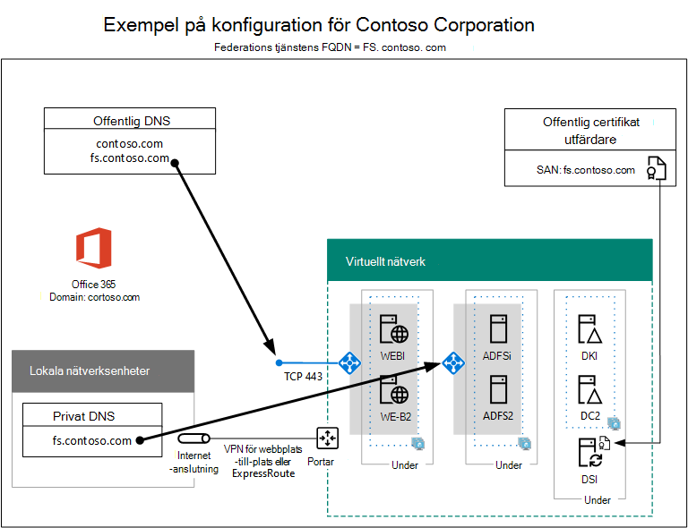
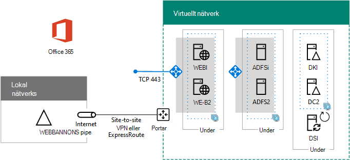

# Fas 5 med hög tillgänglighet för federerad autentisering: Konfigurera federerad autentisering för Microsoft 365High availability federated authentication Phase 5: Configure federated authentication for Microsoft 365

I den här sista fasen av distributionen av federerad autentisering med hög tillgänglighet för Microsoft 365 i Azure-infrastrukturtjänster får du och installerar ett certifikat som utfärdats av en offentlig certifikatutfärdare, verifierar din konfiguration och installerar och kör sedan Azure AD Connect på katalogsynkroniseringsservern.In this final phase of deploying high availability federated authentication for Microsoft 365 in Azure infrastructure services, you get and install a certificate issued by a public certification authority, verify your configuration, and then install and run Azure AD Connect on the directory synchronization server. Azure AD Connect konfigurerar Microsoft 365-prenumerationen och AD FS-servrar (Active Directory Federation Services) och webbprogramproxyservrar för federerad autentisering.Azure AD Connect configures your Microsoft 365 subscription and your Active Directory Federation Services (AD FS) and web application proxy servers for federated authentication.
  
Se [Distribuera hög tillgänglighet federerad autentisering för Microsoft 365 i Azure](deploy-high-availability-federated-authentication-for-microsoft-365-in-azure.md) för alla faser.See [Deploy high availability federated authentication for Microsoft 365 in Azure](deploy-high-availability-federated-authentication-for-microsoft-365-in-azure.md) for all of the phases.
  
## Skaffa ett offentligt certifikat och kopiera det till katalogsynkroniseringsservernGet a public certificate and copy it to the directory synchronization server

Få ett digitalt certifikat från en offentlig certifikatutfärdare med följande egenskaper:Get a digital certificate from a public certification authority with the following properties:
  
- Ett X.509-certifikat som passar för att skapa SSL-anslutningar.An X.509 certificate suitable for creating SSL connections.
    
- Den utökade egenskapen Subject Alternative Name (SAN) är inställd på federationstjänstens FQDN (exempel: fs.contoso.com).The Subject Alternative Name (SAN) extended property is set to your federation service FQDN (example: fs.contoso.com).
    
- Certifikatet måste ha den privata nyckeln och lagras i PFX-format.The certificate must have the private key and be stored in PFX format.
    
Dessutom måste datorerna och enheterna i organisationen lita på den offentliga certifikatutfärdare som utfärdar det digitala certifikatet.Additionally, your organization computers and devices must trust the public certification authority that is issuing the digital certificate. Det här förtroende upprättas genom att ha ett rotcertifikat från den offentliga certifikatutfärdaren som är installerat i arkivet med betrodda rotcertifikatutfärdare på dina datorer och enheter.This trust is established by having a root certificate from the public certification authority installed in the trusted root certification authorities store on your computers and devices. Datorer med Microsoft Windows har vanligtvis en uppsättning av dessa typer av certifikat installerade från vanliga certifikatutfärdare.Computers running Microsoft Windows typically have a set of these types of certificates installed from commonly-used certification authorities. Om rotcertifikatet från din offentliga certifikatutfärdare inte redan är installerat måste du distribuera det till datorerna och enheterna i organisationen.If the root certificate from your public certification authority is not already installed, you must deploy this to the computers and devices of your organization.
  
Mer information om certifikatkrav för federerad autentisering finns i Förutsättningar för installation och [konfiguration av federerad autentisering.](/azure/active-directory/connect/active-directory-aadconnect-prerequisites#prerequisites-for-federation-installation-and-configuration)For more information about certificate requirements for federated authentication, see [Prerequisites for federation installation and configuration](/azure/active-directory/connect/active-directory-aadconnect-prerequisites#prerequisites-for-federation-installation-and-configuration).
  
När du får certifikatet kopierar du det till en mapp på C:-enheten på katalogsynkroniseringsservern.When you receive the certificate, copy it to a folder on the C: drive of the directory synchronization server. Du kan till exempel ge filen namnet SSL.pfx och lagra den i mappen C: \\ Certs på katalogsynkroniseringsservern.For example, name the file SSL.pfx and store it in the C:\\Certs folder on the directory synchronization server.
  
## Verifiera konfigurationenVerify your configuration

Nu bör du vara redo att konfigurera Azure AD Connect och federerad autentisering för Microsoft 365.You should now be ready to configure Azure AD Connect and federated authentication for Microsoft 365. För att säkerställa att du är det finns här en checklista:To ensure that you are, here is a checklist:
  
- Organisationens offentliga domän läggs till i Microsoft 365-prenumerationen.Your organization's public domain is added to your Microsoft 365 subscription.
    
- Din organisations Microsoft 365-användarkonton är konfigurerade för organisationens offentliga domännamn och kan logga in.Your organization's Microsoft 365 user accounts are configured to your organization's public domain name and can successfully sign in.
    
- Du har fastställt en FQDN för en federationstjänst baserat på ditt offentliga domännamn.You have determined a federation service FQDN based your public domain name.
    
- En offentlig DNS A-post för federationstjänstens FQDN pekar på den offentliga IP-adressen för den Internetbaserade Azure-belastningsutjämaren för webbprogramproxyservrarna.A public DNS A record for your federation service FQDN points to the public IP address of the Internet-facing Azure load balancer for the web application proxy servers.
    
- En privat DNS A-post för federationstjänstens FQDN pekar på den privata IP-adressen för den interna Azure-belastningsutjämaren för AD FS-servrarna.A private DNS A record for your federation service FQDN points to the private IP address of the internal Azure load balancer for the AD FS servers.
    
- En offentlig certifikatutfärdare är ett digitalt certifikat som passar för SSL-anslutningar med SAN-uppsättningen till federationstjänstens FQDN är en PFX-fil som lagras på din katalogsynkroniseringsserver.A public certification authority-isssued digital certificate suitable for SSL connections with the SAN set to your federation service FQDN is a PFX file stored on your directory synchronization server.
    
- Rotcertifikatet för den offentliga certifikatutfärdaren installeras i arkivet Betrodda rotcertifikatutfärdare på dina datorer och enheter.The root certificate for the public certification authority is installed in the Trusted Root Certification Authorities store on your computers and devices.
    
Här är ett exempel för Contoso-organisationen:Here is an example for the Contoso organization:
  
**En exempelkonfiguration för en infrastruktur för federerad autentisering med hög tillgänglighet i Azure****An example configuration for a high availability federated authentication infrastructure in Azure**

  
## Kör Azure AD Connect för att konfigurera federerad autentiseringRun Azure AD Connect to configure federated authentication

Verktyget Azure AD Connect konfigurerar AD FS-servrarna, webbprogramproxyservrarna och Microsoft 365 för federerad autentisering med följande steg:The Azure AD Connect tool configures the AD FS servers, the web application proxy servers, and Microsoft 365 for federated authentication with these steps:
  
1. Skapa en anslutning till fjärrskrivbord till katalogsynkroniseringsservern med ett domänkonto som har lokal administratörsbehörighet.Create a remote desktop connection to your directory synchronization server with a domain account that has local administrator privileges.
    
2. Öppna Internet Explorer på skrivbordet på katalogsynkroniseringsservern och gå till [https://aka.ms/aadconnect](https://aka.ms/aadconnect) .From the desktop of the directory synchronization server, open Internet Explorer and go to [https://aka.ms/aadconnect](https://aka.ms/aadconnect).
    
3. På sidan **Microsoft Azure Active Directory Connect** klickar du på **Ladda** ned och sedan på **Kör**.On the **Microsoft Azure Active Directory Connect** page, click **Download**, and then click **Run**.
    
4. På sidan **Välkommen till Azure AD Connect** klickar du på Jag **godkänner** och klickar sedan på **Fortsätt.**On the **Welcome to Azure AD Connect** page, click **I agree**, and then click **Continue.**
    
5. På sidan **Expressinställningar klickar** du på **Anpassa**.On the **Express Settings** page, click **Customize**.
    
6. Klicka på **Installera på sidan** Installera nödvändiga **komponenter.**On the **Install required components** page, click **Install**.
    
7. På sidan **Användarinloggning** klickar du på **Federation med AD FS** och sedan på **Nästa**.On the **User sign-in** page, click **Federation with AD FS**, and then click **Next**.
    
8. På sidan **Anslut till Azure AD** anger du namn och lösenord för ett globalt administratörskonto för Microsoft 365-prenumerationen och klickar sedan på **Nästa.**On the **Connect to Azure AD** page, type the name and password of a global administrator account for your Microsoft 365 subscription, and then click **Next**.
    
9. På  sidan Anslut dina kataloger ser du till att din lokala AD DS-skog (Active Directory Domain Services) är vald i **Skog,** skriver namn och lösenord för ett domänadministratörskonto, klickar på Lägg till katalog och klickar sedan på **Nästa.**On the **Connect your directories** page, ensure that your on-premises Active Directory Domain Services (AD DS) forest is selected in **Forest**, type the name and password of a domain administrator account, click **Add Directory**, and then click **Next**.
    
10. På sidan **Konfiguration av Azure AD-inloggning** klickar du på **Nästa.**On the **Azure AD sign-in configuration** page, click **Next**.
    
11. På sidan **Domän- och OU-filtrering** klickar du på **Nästa.**On the **Domain and OU filtering** page, click **Next**.
    
12. På sidan **Unikt identifiera dina användare** klickar du på **Nästa.**On the **Uniquely identifying your users** page, click **Next**.
    
13. På sidan **Filtrera användare och enheter** klickar du på **Nästa.**On the **Filter users and devices** page, click **Next**.
    
14. På sidan **Valfria funktioner** klickar du på **Nästa.**On the **Optional features** page, click **Next**.
    
15. På sidan **AD FS-servergrupp** klickar du på **Konfigurera en ny AD FS-servergrupp**.On the **AD FS farm** page, click **Configure a new AD FS farm**.
    
16. Klicka **på** Bläddra och ange plats och namn för SSL-certifikatet från den offentliga certifikatutfärdaren.Click **Browse** and specify the location and name of the SSL certificate from the public certification authority.
    
17. När du uppmanas till det anger du certifikatlösenordet och klickar sedan på **OK.**When prompted, type the certificate password, and then click **OK**.
    
18. Kontrollera att **Ämnesnamn** och **Federationstjänstnamn** är inställda på federationstjänstens FQDN och klicka sedan på **Nästa.**Verify that the **Subject Name** and **Federation Service Name** are set to your federation service FQDN, and then click **Next**.
    
19. På **sidan AD FS-servrar** skriver du den första AD FS-serverns namn (tabell M - objekt 4 – namnkolumn för virtuell dator) och klickar sedan på **Lägg till**.On the **AD FS servers** page, type your first AD FS server's name (Table M - Item 4 - Virtual machine name column), and then click **Add**.
    
20. Skriv namnet på den andra AD FS-servern (tabell M - objekt 5 – namnkolumn för virtuell dator), klicka på Lägg till och klicka sedan på **Nästa.**Type your second AD FS server's name (Table M - Item 5 - Virtual machine name column), click **Add**, and then click **Next**.
    
21. På sidan **Proxyservrar** för webbprogram skriver du det första webbprogrammets proxyservernamn (tabell M - objekt 6 – namnkolumn för virtuell dator) och klickar sedan på **Lägg till**.On the **Web Application Proxy servers** page, type your first web application proxy server's name (Table M - Item 6 - Virtual machine name column), and then click **Add**.
    
22. Skriv namnet på proxyservern för det andra webbprogrammet (tabell M - objekt 7 – namnkolumn för virtuell dator), klicka på Lägg till och klicka sedan på **Nästa.**Type your second web application proxy server's name (Table M - Item 7 - Virtual machine name column), click **Add**, and then click **Next**.
    
23. På sidan **Autentiseringsuppgifter för domänadministratör** anger du användarnamn och lösenord för ett domänadministratörskonto och klickar sedan på **Nästa.**On the **Domain Administrator credentials** page, type the user name and password of a domain administrator account, and then click **Next**.
    
24. På sidan **AD FS-tjänstkonto** anger du användarnamn och lösenord för ett företagsadministratörskonto och klickar sedan på **Nästa.**On the **AD FS service account** page, type the user name and password of an enterprise administrator account, and then click **Next**.
    
25. Välj din **organisations DNS-domännamn** i **Domän** på sidan Azure AD Domain och klicka sedan på **Nästa.**On the **Azure AD Domain** page, in **Domain**, select your organization's DNS domain name, and then click **Next**.
    
26. På sidan **Klart att konfigurera** klickar du på **Installera**.On the **Ready to configure** page, click **Install**.
    
27. På sidan **Installationen är slutförd** klickar du på **Verifiera**.On the **Installation complete** page, click **Verify**. Du bör se två meddelanden som anger att både intranätet och Internetkonfigurationen har verifierats.You should see two messages indicating that both the intranet and Internet configuration was successfully verified.
    
  - Intranätmeddelandet ska lista den privata IP-adressen för dina interna Azure-belastningsutjämnare för AD FS-servrarna.The intranet message should list the private IP address of your Azure internal load balancer for your AD FS servers.
    
  - Internetmeddelandet ska lista den offentliga IP-adressen för din Azure-belastningsutjämnare för dina proxyservrar för webbprogram.The Internet message should list the public IP address of your Azure Internet-facing load balancer for your web application proxy servers.
    
28. På sidan **Installationen är slutförd** klickar du på **Avsluta**.On the **Installation complete** page, click **Exit**.
    
Här är den slutliga konfigurationen, med platshållarnamn för servrarna.Here is the final configuration, with placeholder names for the servers.
  
**Fas 5: Den slutliga konfigurationen av en infrastruktur för federerad autentisering med hög tillgänglighet i Azure****Phase 5: The final configuration of a high availability federated authentication infrastructure in Azure**

  
Din hög tillgänglighetsinfrastruktur för federerad autentisering för Microsoft 365 i Azure är klar.Your high availability federated authentication infrastructure for Microsoft 365 in Azure is complete.
  
## Se ävenSee Also

[Distribuera federerad autentisering med hög tillgänglighet för Microsoft 365 i AzureDeploy high availability federated authentication for Microsoft 365 in Azure](deploy-high-availability-federated-authentication-for-microsoft-365-in-azure.md)
  
[Federerad identitet för din Utvecklings-/testmiljö för Microsoft 365Federated identity for your Microsoft 365 dev/test environment](federated-identity-for-your-microsoft-365-dev-test-environment.md)
  
[Microsoft 365-lösning och arkitekturcenterMicrosoft 365 solution and architecture center](../solutions/index.yml)

[Federerad identitet för Microsoft 365Federated identity for Microsoft 365](https://support.office.com/article/Understanding-Office-365-identity-and-Azure-Active-Directory-06a189e7-5ec6-4af2-94bf-a22ea225a7a9#bk_federated)