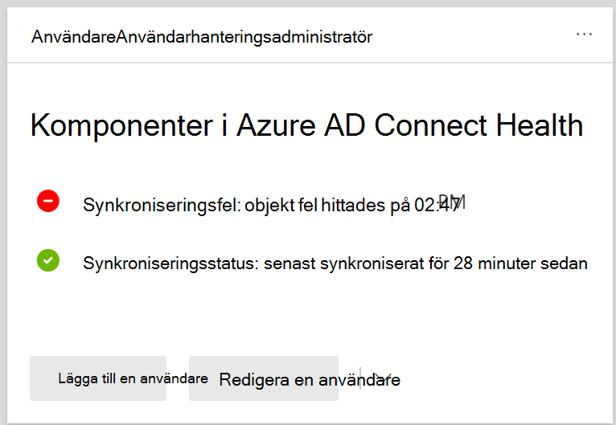

# Visa katalogsynkroniseringsfel i Microsoft 365View directory synchronization errors in Microsoft 365

Du kan visa katalogsynkroniseringsfel i administrationscentret för Microsoft 365.You can view directory synchronization errors in the Microsoft 365 admin center. Endast användarobjektfel visas.Only the User object errors are displayed. Information om hur du visar fel med PowerShell [finns i Identifiera objekt med DirSyncProvisioningErrors.](/azure/active-directory/hybrid/how-to-connect-syncservice-duplicate-attribute-resiliency)To view errors with PowerShell, see [Identify objects with DirSyncProvisioningErrors](/azure/active-directory/hybrid/how-to-connect-syncservice-duplicate-attribute-resiliency).

## Visa katalogsynkroniseringsfel i administrationscentret för Microsoft 365View directory synchronization errors in the Microsoft 365 admin center

Så här visar du eventuella fel i administrationscentret för Microsoft 365:To view any errors in the Microsoft 365 admin center:
  
1. Logga in på [administrationscentret för Microsoft 365 med](https://admin.microsoft.com) ett globalt administratörskonto.Sign in to the [Microsoft 365 admin center](https://admin.microsoft.com) with a global administrator account. 
    
2. På **startsidan** visas kortet **Användarhantering.**On the **Home** page, you'll see the **User management** card. 
    
    
  
3. På kortet väljer du **Synkroniseringsfel** under **Azure AD Connect** för att se felen på sidan **Katalogsynkroniseringsfel.**On the card, choose **Sync errors** under **Azure AD Connect** to see the errors on the **Directory sync errors** page.   
    
    

4. Välj något av felen om du vill visa informationsfönstret med information om felet och tips om hur du åtgärdar det.Choose any of the errors to display the details pane with information about the error and tips on how to fix it.

   
  
Läs åtgärda problem [med katalogsynkronisering för Microsoft 365 efter](fix-problems-with-directory-synchronization.md) visning för att korrigera eventuella identifierade problem.After viewing, see [fixing problems with directory synchronization for Microsoft 365](fix-problems-with-directory-synchronization.md) to correct any identified issues.