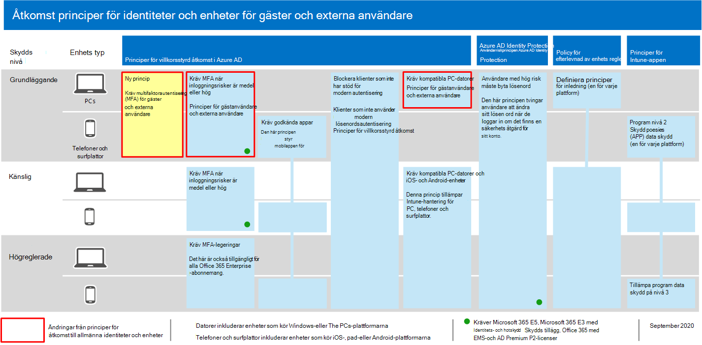
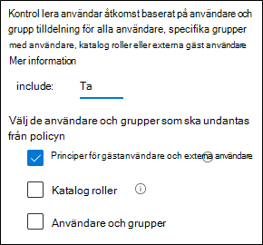
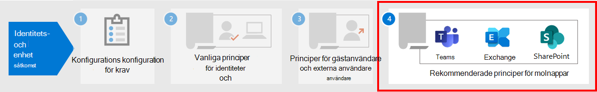

# Principer för att tillåta gäst-och extern B2B-åtkomst

I den här artikeln beskrivs hur du justerar de rekommenderade vanliga principerna för identitets-och enhets åtkomst för att tillåta åtkomst till konton för företag-till-företag (gäst-och externa användare). Den här vägledningen bygger på [vanliga principer för identitets-och enhets åtkomst](identity-access-policies.md).

Dessa rekommendationer är avsedda att tillämpas på den **ursprungliga** skydds nivån. Men du kan också justera rekommendationerna baserat på hur många olika behov du har för **känsligt** och **starkt reglerat** skydd. 

Om du tillhandahåller en väg för B2B-användare att autentisera med Azure Active Directory-klienten (Azure AD) ger dessa användare åtkomst till hela din miljö. B2B-användare har till gång till resurser som delas med dem (till exempel filer) inom de tjänster som beviljats i principer för villkorlig åtkomst.

## Uppdatera vanliga principer för att tillåta och skydda gäst och extern åtkomst 

För att skydda gäst och extern åtkomst illustrerar följande diagram vilka principer du kan lägga till eller uppdatera från principer för åtkomst till identitet och enheter. 

[Visa en större version av bilden](https://github.com/MicrosoftDocs/microsoft-365-docs/raw/public/microsoft-365/media/microsoft-365-policies-configurations/identity-access-ruleset-guest.png)

I följande tabell visas de principer som du måste uppdatera eller skapa nya. Gemensamma principer-länken till de associerade konfigurations anvisningarna i artikeln om [principer för åtkomst policys för identitet och enheter](identity-access-policies.md) .

|Skydds nivå|Principerna|Mer information|
|:---------------|:-------|:----------------|
|**Grundläggande**|[Kräv MFA alltid för gäst-och externa användare](identity-access-policies.md#require-mfa-based-on-sign-in-risk)|Skapa den nya principen och Använd den bara för gäster och externa användare. Låt alla alternativ vara avmarkerade under **inloggnings risker**så att multifaktorautentisering alltid upprätthålls (MFA).|
|        |[Kräv MFA när en inloggnings risk är *mellan* eller *hög*](identity-access-policies.md#require-mfa-based-on-sign-in-risk)|Ändra den här principen så att den exkluderar gäst-och externa användare.|
|        |[Kräv kompatibla PC-datorer](identity-access-policies.md#require-compliant-pcs-but-not-compliant-phones-and-tablets)|Ändra den här principen så att den exkluderar gäst-och externa användare.|

Om du vill inkludera eller exkludera gäster och externa användare i principer för villkorsstyrd åtkomst klickar du på fliken **Inkludera** eller **exkludera** och markerar **alla gäster och externa användare**.

## Mer information

### Gäster kontra externa användare
I Azure AD är gäst och externa användare desamma. Användar typen för båda dessa är gäster. Gäst användare är B2B-användare.

Microsoft Teams skiljer mellan gäst användare och externa användare inom appen. Gäst användare har Azure AD B2B-konton och kan läggas till i Teams. Externa användare kan bara delta i samtal, chatt och möten. Mer information finns i [den här jämförelsen mellan gäst och externa användare för Teams](https://docs.microsoft.com/microsoftteams/communicate-with-users-from-other-organizations#compare-external-and-guest-access).

Se [Policy rekommendationer för att skydda Teams, grupper och filer](teams-access-policies.md) för att få mer information om att skydda identitet och åtkomst till enheter för Teams

### Kräv MFA alltid för gäst-och externa användare
Den här principen ber dig registrera gäster för MFA i klient organisationen, oavsett om de är registrerade för MFA i sin hem klient organisation. När du får åtkomst till resurser i klient organisationen måste gäster och externa användare använda MFA för varje begäran. 

### Exkluderar gäst och externa användare från riskfyllda MFA
Trots att organisationer kan använda riskbaserade principer för B2B-användare som använder Azure AD Identity Protection finns det begränsningar i implementeringen av Azure AD Identity Protection för B2B-samarbets användare i en resurs katalog på grund av deras identitet i sin Hem Katalog. På grund av dessa begränsningar rekommenderar Microsoft att du exkluderar gäst användare från riskfyllda principer och kräver att dessa användare alltid använder MFA. 

Mer information finns i [begränsningar för identitets skydd för B2B-samarbets användare](https://docs.microsoft.com/azure/active-directory/identity-protection/concept-identity-protection-b2b#limitations-of-identity-protection-for-b2b-collaboration-users). 

### Exkludera gäst-och externa användare från enhets hantering 
Endast en organisation kan hantera en enhet. Om du inte utesluter gäst-och externa användare från principer som kräver att enheter efterlevs blockerar dessa användare. 

## Nästa steg

Konfigurera principer för villkorsstyrd åtkomst för:

- [Microsoft Teams](teams-access-policies.md)
- [Exchange Online](secure-email-recommended-policies.md)
- [SharePoint](secure-email-recommended-policies.md)

