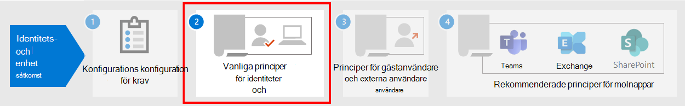

# Nödvändigt arbete för implementering av identitets-och enhets åtkomst principer

I den här artikeln beskrivs förutsättningar som måste implementeras innan du kan distribuera Rekommenderad identitet och enhets åtkomst principer. I den här artikeln beskrivs också rekommenderade standardinställningar för konfigurering av plattformar för att tillhandahålla den bästa enkel inloggnings upplevelsen (SSO) för användarna, samt de tekniska kraven för villkorlig åtkomst.

## Krav

Innan du implementerar de rekommenderade principer för identitet och enheter finns det flera förutsättningar för att organisationen måste mötas för dessa identitets-och autentiseringsdata för Microsoft 365 och Office 365:

- Endast molnet
- Hybrid med lösenord för lösen ords-hash (PHS)
- Hybrid med direktautentisering (PTA)
- Extern

I följande tabell beskrivs de nödvändiga funktionerna och deras konfiguration som gäller för alla identitets modeller förutom där det anges. 

| Konfiguration | Undanta |
| :------------- | :-----------: |
|  [Konfigurera PHS](https://docs.microsoft.com/azure/active-directory/hybrid/how-to-connect-password-hash-synchronization).  Detta måste vara aktiverat för att upptäcka läcka autentiseringsuppgifter och för att fungera med en riskfylld, villkorlig åtkomst. **Obs!** Det här är obligatoriskt oavsett om din organisation använder federerad identifiering. |  Endast molnet |
| [Aktivera sömlös enkel inloggning](https://docs.microsoft.com/azure/active-directory/connect/active-directory-aadconnect-sso) för att automatiskt signera användare i när de är på deras organisations enheter som är anslutna till organisationens nätverk. | Endast moln och federerad  |
| [Konfigurera namngivna nätverk](https://docs.microsoft.com/azure/active-directory/active-directory-known-networks-azure-portal). Azure AD Identity Protection samlar in och analyserar alla tillgängliga sessionsdata för att generera risk poäng. Vi rekommenderar att du anger din organisations offentliga IP-adressintervall för ditt nätverk i konfiguration av Azure AD med namnet Networks. Trafik från dessa områden ges minskad risk Poäng och trafik utanför organisations miljön får ett högre risk poäng. | |
|[Registrera alla användare för självbetjäning för återställning av lösen ord (SSPR) och multifaktorautentisering (MFA)](https://docs.microsoft.com/azure/active-directory/authentication/concept-registration-mfa-sspr-converged). Vi rekommenderar att du registrerar användare för Azure Multi-Factor-verifikation i förväg. Azure AD Identity Protection använder Azure Multi-Factor-verifiering för att utföra ytterligare säkerhets verifiering. För bästa inloggnings upplevelse rekommenderar vi att användare installerar [Microsoft Authenticator-appen](https://docs.microsoft.com/azure/active-directory/user-help/microsoft-authenticator-app-how-to) och Microsoft-företagsportalsappen på sina enheter. De här kan installeras från App Store för varje plattform. | |
| [Aktivera automatisk registrering av en domänansluten Windows-dator](https://docs.microsoft.com/azure/active-directory/active-directory-conditional-access-automatic-device-registration-setup). Villkorsstyrd åtkomst säkerställer att enheter som ansluter till program är domänansluten eller kompatibla. För att du ska kunna använda detta på Windows-datorer måste enheten vara registrerad med Azure AD.  I den här artikeln beskrivs hur du konfigurerar automatisk registrering av enheter. | Endast molnet |
| **Förbered support teamet**. Ha en plan för användare som inte kan slutföra MFA. Detta kan läggas till i en princip undantags grupp eller Registrera ny MFA-information för dem. Innan du gör något av följande säkerhets känsliga ändringar måste du se till att den faktiska användaren gör det. Att kräva att användarnas chefer får hjälp med godkännandet är ett effektivt steg. | |  
| [Konfigurera tillbakaskrivning för lösen ord för lokal annons](https://docs.microsoft.com/azure/active-directory/active-directory-passwords-getting-started). Med Lösenordssynkronisering kan Azure AD begära att användarna ändrar sina lokala lösen ord när ett högrisk problem upptäcks. Du kan aktivera den här funktionen med Azure AD Connect på ett av två sätt: aktivera **Ångra lösen ord** på skärmen valfria funktioner i installations guiden för Azure AD Connect eller aktivera den via Windows PowerShell. | Endast molnet |
| [Konfigurera lösen ords skydd för Azure AD](https://docs.microsoft.com/azure/active-directory/authentication/concept-password-ban-bad). Azure AD-lösenordet identifierar och blockerar kända svaga lösen ord och deras varianter och kan dessutom blockera ytterligare svaga termer som är specifika för din organisation. Standard listan över blockerade lösen ord tillämpas automatiskt på alla användare i en Azure AD-klient. Du kan definiera ytterligare poster i en anpassad lista över blockerade lösen ord. När användare ändrar eller återställer sina lösen ord är de här förbjudna lösen ords listorna markerade för att använda starka lösen ord. | |
| [Aktivera Azure Active Directory](https://docs.microsoft.com/azure/active-directory/identity-protection/overview-identity-protection)-kryptering. Azure AD Identity Protection gör att du kan upptäcka potentiella sårbarheter som påverkar organisationens identitet och konfigurera en automatisk reparations princip för att Visa riskerna med låg, medelhög och stor inloggning och användare.  | |
| **Aktivera modern lösenordsautentisering** för [Exchange Online](https://docs.microsoft.com/Exchange/clients-and-mobile-in-exchange-online/enable-or-disable-modern-authentication-in-exchange-online) och för [Skype för företag – Online](https://social.technet.microsoft.com/wiki/contents/articles/34339.skype-for-business-online-enable-your-tenant-for-modern-authentication.aspx). Modern verifiering är en förutsättning för användning av MFA. Modern autentisering är aktive rad som standard för Office 2016-klienter, SharePoint och OneDrive för företag. |  |
|||

## Rekommenderade klientkonfigurationer
I det här avsnittet beskrivs de standardinställningar för Platform-klient vi rekommenderar att tillhandahålla den bästa SSO-upplevelsen för användarna, samt de tekniska kraven för villkorlig åtkomst.

### Windows-enheter
Vi rekommenderar Windows 10 (version 2004 eller senare) eftersom Azure är utformat för att tillhandahålla det smidigaste SSO-gränssnittet för både lokalt och Azure AD. Arbets-eller skolbaserade enheter ska konfigureras för att ansluta till Azure AD direkt eller om organisationen använder lokal AD-domänansluten-anslutning ska dessa enheter [konfigureras att automatiskt och tyst registrera med Azure AD](https://docs.microsoft.com/azure/active-directory/active-directory-conditional-access-automatic-device-registration-setup).

För BYOD Windows-enheter kan användare använda **Lägg till arbets-eller skol konto**. Observera att användare av Google Chrome-webbläsaren på Windows 10-enheter måste [Installera ett tillägg](https://chrome.google.com/webstore/detail/windows-10-accounts/ppnbnpeolgkicgegkbkbjmhlideopiji?utm_source=chrome-app-launcher-info-dialog) för att få samma smidiga inloggnings upplevelse som Microsoft Edge-användare. Om din organisation har en domänansluten Windows 8-eller 8,1-enheter kan du även installera Microsoft Workplace Join för datorer utanför Windows 10. [Ladda ner paketet för att registrera](https://www.microsoft.com/download/details.aspx?id=53554) enheterna med Azure AD.

### iOS-enheter
Vi rekommenderar att du installerar [Microsoft Authenticator-appen](https://docs.microsoft.com/azure/multi-factor-authentication/end-user/microsoft-authenticator-app-how-to) på användarnas enheter innan du distribuerar villkorsstyrd åtkomst eller MFA-principer. Du bör minst installera programmet när användarna ska registrera sin enhet med Azure AD genom att lägga till ett arbets-eller skol konto, eller när de installerar programmet Intune-företagsportalsappen för att registrera enheten i hanteringen. Detta beror på den konfigurerade principen för villkorsstyrd åtkomst.

### Android-enheter
Vi rekommenderar att användare installerar [programmet Intune](https://play.google.com/store/apps/details?id=com.microsoft.windowsintune.companyportal&hl=en) -företagsportalsappen och [Microsoft Authenticator-appen](https://docs.microsoft.com/azure/multi-factor-authentication/end-user/microsoft-authenticator-app-how-to) innan principer för villkorsstyrd åtkomst distribueras eller när det behövs under vissa autentiseringsförsök. Efter programinstallationen kan användarna uppmanas att registrera sig med Azure AD eller registrera sin enhet med Intune. Detta beror på den konfigurerade principen för villkorsstyrd åtkomst.

Vi rekommenderar även att företagsägda enheter standardiseras på OEM-tillverkare och versioner som stöder Android för arbete eller Samsung KNOX för att tillåta att e-postkonton hanteras och skyddas av Intune MDM policy.

### Rekommenderade e-postklienter
Följande e-postklienter stöder modern och villkorlig åtkomst. 

|Plattform|Klient|Version/anteckningar|
|:-------|:-----|:------------|
|**Windows**|Outlook|2019, 2016, 2013   [Aktivera modern verifikation](https://docs.microsoft.com/microsoft-365/admin/security-and-compliance/enable-modern-authentication), [nödvändiga uppdateringar](https://support.office.com/article/Outlook-Updates-472c2322-23a4-4014-8f02-bbc09ad62213)|
|**iOS**|Outlook för iOS|[RelatesTo](https://itunes.apple.com/us/app/microsoft-outlook-email-and-calendar/id951937596?mt=8)|
|**Android**|Outlook för Android|[RelatesTo](https://play.google.com/store/apps/details?id=com.microsoft.office.outlook&hl=en)|
|**macOS**|Outlook|2019 och 2016|
|**Linux**|Stöds inte||
|||

### Rekommenderade klient plattformar när du skyddar dokument

Följande klienter rekommenderas när en princip för säker dokument tillämpas.

|Plattform|Word/Excel/PowerPoint|OneNote|OneDrive-appen|SharePoint-App|[OneDrive-synkroniseringsklient](https://docs.microsoft.com/onedrive/enable-conditional-access)|
|:-------|:-----|:------------|:-------|:-------------|:-----|
|Windows 8.1|Stöds|Stöds|EJ TILLÄMPLIGT|EJ TILLÄMPLIGT|Stöds|
|Windows 10|Stöds|Stöds|EJ TILLÄMPLIGT|EJ TILLÄMPLIGT|Stöds|
|Android|Stöds|Stöds|Stöds|Stöds|Saknas|
|iOS|Stöds|Stöds|Stöds|Stöds|Saknas|
|macOS|Stöds|Stöds|EJ TILLÄMPLIGT|EJ TILLÄMPLIGT|Stöds inte|
|Linux|Stöds inte|Stöds inte|Stöds inte|Stöds inte|Stöds inte|

### Support för Microsoft 365-klienter

Mer information om klient stöd i Microsoft 365 finns i följande artiklar:

- [Microsoft 365-klientprogram – villkorlig åtkomst](microsoft-365-client-support-conditional-access.md)
- [Microsoft 365-klientprogram – modern-verifikation](microsoft-365-client-support-modern-authentication.md)

## Skydda administratörs konton

Du kan kräva MFA för administratörs konton med en manuellt skapad princip för villkorsstyrd åtkomst för Microsoft 365 E3 eller E5 eller med separata Azure AD Premium P1-eller P2-licenser. Se [villkorlig åtkomst: KRÄV MFA för administratörer](https://docs.microsoft.com/azure/active-directory/conditional-access/howto-conditional-access-policy-admin-mfa) för att få information.

För utgåvor av Microsoft 365 eller Office 365 som inte har stöd för villkorlig åtkomst kan du aktivera [säkerhets standarden](https://docs.microsoft.com/azure/active-directory/fundamentals/concept-fundamentals-security-defaults) för att kräva MFA för alla konton.

Här är några ytterligare rekommendationer:

- Använd [Azure AD privilegie rad identitets hantering](https://docs.microsoft.com/azure/active-directory/privileged-identity-management/pim-getting-started) för att minska antalet beständiga administratörs konton. 
- [Använd hanteringen av privilegie rad åtkomst](../compliance/privileged-access-management-overview.md) för att skydda din organisation från intrång som kan använda befintliga administratörs konton med åtkomst till känsliga data eller åtkomst till viktiga konfigurations inställningar. 
- Skapa och Använd separata konton som har tilldelats [Microsoft 365-administratörs roller](https://docs.microsoft.com/microsoft-365/admin/add-users/about-admin-roles) *endast för administration*. Administratörer bör ha eget användar konto för regelbunden icke-administrativ användning och kan bara använda ett administratörs konto när det behövs för att slutföra en aktivitet som är kopplad till deras roll eller jobb funktion. 
- Följ de [bästa metoderna](https://docs.microsoft.com/azure/active-directory/admin-roles-best-practices) för att skydda privilegierade konton i Azure AD.

## Nästa steg

[Konfigurera principer för åtkomst för identitet och enheter](identity-access-policies.md)
