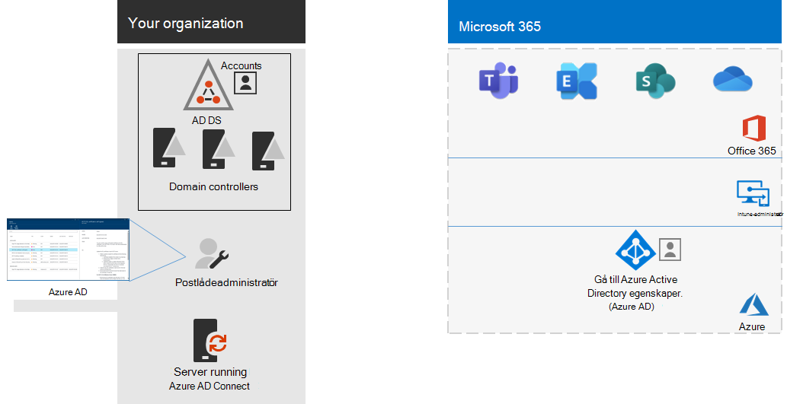

# Steg 4: Lägga till användarkonton

## Skapa användarkonton för helt molnbaserad identitet

Skapa dina användare och grupper i Azure Active Directory (Azure AD) för en helt molnbaserad identitet. Du kan använda:

- Administrationscentret för Microsoft 365
- Azure-portalen
- Azure PowerShell

## Synkronisera identiteter för hybrididentitet

*Det här är obligatoriskt för hybridmiljöer och gäller både E3- och E5-versionerna av Microsoft 365 Enterprise*

I det här avsnittet ska du synkronisera din lokala Active Directory Domain Services (AD DS) med Azure AD-klienten som används av Office 365, Microsoft Intune och andra molnbaserade tjänster som ingår i Microsoft 365 Enterprise.

Azure AD Connect är det Microsoft-verktyg som stöds, och vägleder dig genom att enbart synkronisera de identiteter du verkligen behöver i AD DS-miljöer med en eller flera skogar till din Azure AD-klient. Följande bild visar grundprocessen för Azure AD Connect-synkronisering.

1. Azure AD Connect körs på en server och avsöker AD DS för ändringar i konton, grupper och kontakter.
2. Azure AD Connect skickar ändringarna till Azure AD-klienten för din Microsoft 365-prenumerationen.

Det första beslutet i din hybrididentitetslösning gäller autentiseringskravet. Följande alternativ är tillgängliga:

- Med **hanterad autentisering** hanteras autentiseringsprocessen för användarnas inloggning av Azure AD. Det finns två metoder för hanterad autentisering: 
    - **PHS (Password Hash Sync)** [rekommenderas och krävs för vissa premiumfunktioner]. Det här är det enklaste sättet att aktivera autentisering för lokala katalogobjekt i Azure AD. Azure AD Connect extraherar det hash-kodade lösenordet från AD DS, utför extra säkerhetsbearbetning för lösenordshashvärdet och synkroniserar det med Azure AD. Mer information finns i [Implementera synkronisering av lösenordshash med Azure AD Connect-synkronisering](https://docs.microsoft.com/azure/active-directory/hybrid/how-to-connect-password-hash-synchronization).
    - **Direktautentisering (PTA)** ger en enkel lösning för lösenordsverifiering för Azure AD-baserade tjänster. PTA använder en agent som körs på en eller flera lokala servrar för att verifiera användarautentiseringarna direkt i din lokala AD DS. Mer information finns i [användarinloggning med Azure Active Directory – direktautentisering](https://docs.microsoft.com/azure/active-directory/connect/active-directory-aadconnect-pass-through-authentication).
- Med **federerad autentisering** omdirigeras autentiseringsprocessen till en annan identitetsleverantör via en server för identitetsfederation, till exempel Active Directory Federation Services (AD FS), för en användares inloggning. Identitetsleverantören kan tillhandahålla ytterligare autentiseringsmetoder, t. ex. smartkortsbaserad autentisering. Mer information finns i [Välja rätt autentiseringsmetod för din hybrididentitetslösning i Azure Active Directory](https://docs.microsoft.com/azure/active-directory/hybrid/choose-ad-authn).

I den här videon finns en översikt över identitetsmodeller och autentisering för Microsoft 365 Enterprise.

 

> [!VIDEO https://www.microsoft.com/videoplayer/embed/RE2Pjwu]

När du har fastställt din hybrididentitetslösning laddar du ned och kör [IdFix-verktyget för reparation av katalogsynkroniseringsfel](https://www.microsoft.com/download/details.aspx?id=36832) för att analysera eventuella problem med AD DS.

När du har åtgärdat alla problem som identifierats av IdFix-verktyget kan du läsa i [Implementera synkronisering av lösenordshash](https://docs.microsoft.com/azure/active-directory/connect/active-directory-aadconnectsync-implement-password-hash-synchronization), som innehåller vägledning för hur du installerar Azure AD Connect-verktyget och konfigurerar katalogsynkronisering mellan din lokala AD DS och Azure AD-klienten för din Microsoft 365-prenumeration. När synkroniseringen startar ska du underhålla dina användarkonton och grupper med din lokala identitetsleverantör, t. ex. AD DS.

Microsoft tillhandahåller en uppsättning rekommendationer för [identitets- och enhetsåtkomst](microsoft-365-policies-configurations.md) för att säkerställa en säker och produktiv arbetsstyrka. 

- Rekommenderade krav för hybridmiljöer beskrivs i kolumnen **Active Directory-synkronisering med hash-synkronisering** i [förutsättningar](identity-access-prerequisites.md#prerequisites). 

- Rekommenderade krav för miljöer med endast moln beskrivs i kolumnen **endast molnet** i [förutsättningar](identity-access-prerequisites.md#prerequisites).

När dina lokala användare och grupper finns i Azure AD kan du börja tilldela licenser och använda produktivitetsarbetsbelastningar, t. ex. OneDrive för företag och Exchange Online.

|||
|:-------|:-----|
|| [Testlabbguide: Synkronisering av lösenordshash](password-hash-sync-m365-ent-test-environment.md)  [Testlabbguide: Direktautentisering](pass-through-auth-m365-ent-test-environment.md) |
|||

Som en mellanliggande kontrollpunkt kan du se vilka [avslutsvillkor](identity-exit-criteria.md#crit-identity-sync) som motsvarar det här avsnittet.

## Övervaka synkroniseringshälsa

*Det här är valfritt och gäller både E3- och E5-versionerna av Microsoft 365*

I det här avsnittet installerar du en Azure AD Connect Health-agent på var och en av dina lokala AD DS-domänkontrollanter för att övervaka din identitetsinfrastruktur och de synkroniseringstjänster som tillhandahålls av Azure AD Connect. Övervakningsinformationen visas i en Azure AD Connect Health-portal, där du kan se varningar, prestandaövervakning, användningsanalys och annan information.

Det viktiga beslutet för hur du ska använda Azure AD Connect Health, baseras på hur du använder Azure AD Connect:

- Om du använder **hanterad autentisering** börjar du med [Använda Azure AD Connect Health med synkronisering](https://docs.microsoft.com/azure/active-directory/connect-health/active-directory-aadconnect-health-sync) för att förstå och konfigurera Azure AD Connect Health.
- Om du bara synkroniserar namnen på de konton och grupper som använder **federerad autentisering** med Active Directory Federation Services (AD FS), börjar du med [Använda Azure AD Connect Health med AD FS](https://docs.microsoft.com/azure/active-directory/connect-health/active-directory-aadconnect-health-adfs) för att förstå och konfigurera Azure AD Connect Health.

När du har slutfört det här avsnittet har du:

- Azure AD Connect Health-agenten installerad på dina lokala identitetsproviderservrar.
- Azure AD Connect Health-portalen visar aktuell status för lokal infrastruktur och synkronisering med Azure AD-klientorganisationen för din Microsoft 365-prenumeration.

Som en mellanliggande kontrollpunkt kan du läsa [avslutsvillkoren](identity-exit-criteria.md#crit-identity-sync-health) för det här avsnittet.

## Enklare uppdatering av lösenord

*Det här är valfritt för hybridversioner och gäller både E3- och E5-versionerna av Microsoft 365 Enterprise*

I det här avsnittet ska du ge användare möjlighet att återställa sina lösenord via Azure Active Directory (Azure AD), som sedan replikeras till din lokala Active Directory Domain Services (AD DS). Processen kallas för tillbakaskrivning av lösenord. Med funktionen för tillbakaskrivning av lösenord behöver användarna inte uppdatera sina lösenord via den lokala AD DS där användarkontona och tillhörande attribut lagras. Det här är värdefullt vid nätverksväxling och för fjärranvändare som inte har någon fjärråtkomstanslutning till det lokala nätverket.

Tillbakaskrivning av lösenord krävs för att fullt ut använda skyddsfunktioner för Azure AD, t. ex. för att begära att användare ska ändra sina lokala lösenord när en stor risk för kontointrång har upptäckts.

Mer information och anvisningar för konfiguration finns i [Azure AD SSPR med tillbakaskrivning av lösenord](https://docs.microsoft.com/azure/active-directory/active-directory-passwords-writeback).

>[!Note]
>Uppgradera till den senaste versionen av Azure AD Connect för att säkerställa bästa möjliga upplevelse och nya funktioner när de släpps. Mer information finns i [Anpassad installation av Azure AD Connect](https://docs.microsoft.com/azure/active-directory/connect/active-directory-aadconnect-get-started-custom).
>

|||
|:-------|:-----|
|| [Testlabbguide: Tillbakaskrivning av lösenord](password-writeback-m365-ent-test-environment.md) |
|||

Som en mellanliggande kontrollpunkt kan du läsa [avslutsvillkoren](identity-exit-criteria.md#crit-identity-pw-writeback) för det här avsnittet.

|||
|:-------|:-----|
|| [Använda grupper för hantering](identity-use-group-management.md) |
