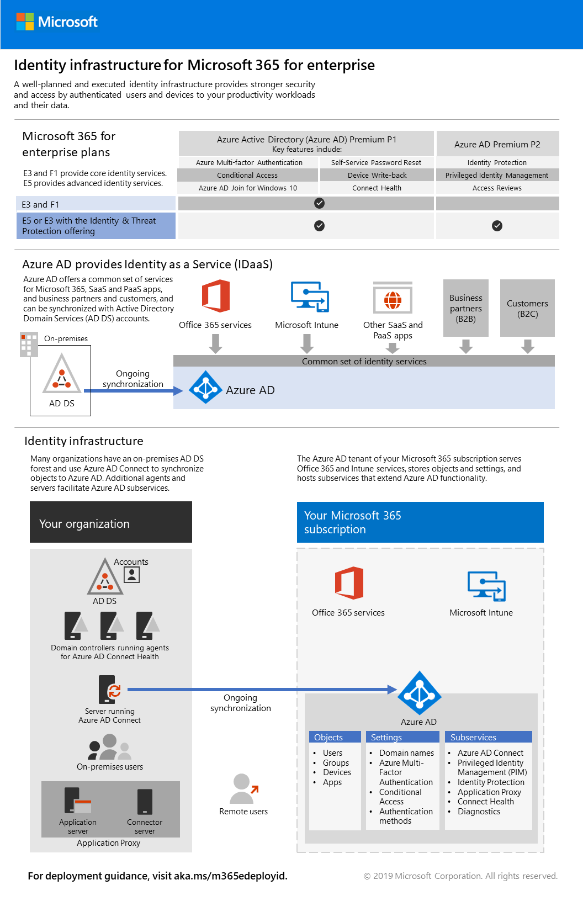

# Fas 2: IdentitetPhase 2: Identity

I Microsoft 365 Enterprise banar en välplanerad och körd identitetsinfrastruktur vägen för bättre säkerhet och åtkomst till dina produktivitetsarbetsbelastningar och deras data endast med autentiserade användare och enheter.In Microsoft 365 Enterprise, a well-planned and executed identity infrastructure paves the way for stronger security and access to your productivity workloads and their data only by authenticated users and devices.

I den här videon finns en översikt över identitetsmodeller och autentisering för Microsoft 365 Enterprise.Watch this video for an overview of identity models and authentication for Microsoft 365 Enterprise.

 

 

> [!VIDEO https://www.microsoft.com/videoplayer/embed/RE2Pjwu]

>[!Note]
>Om du redan har distribuerat en identitetsinfrastruktur läser du [villkoren för identitetsavslutning](identity-exit-criteria.md) för att kontrollera att du uppfyller kraven och valfria villkor för Microsoft 365 Enterprise.If you’ve already deployed an identity infrastructure, please see the [identity exit criteria](identity-exit-criteria.md) to make sure that you meet the required and optional conditions for Microsoft 365 Enterprise.
>

För de olika funktionerna i varje Microsoft 365 Enterprise-abonnemang finns rollerna i Azure Active Directory (Azure AD), lokala och molnbaserade komponenter samt de vanligaste autentiseringarna i [Identitetsinfrastruktur (affisch)](../media/identity-infrastructure/M365E-ID-Infra.pdf).For the identity features of each Microsoft 365 Enterprise plan, the role of Azure Active Directory (Azure AD), on-premises and cloud-based components, and the most common authentication configurations, see the [Identity Infrastructure poster](../media/identity-infrastructure/M365E-ID-Infra.pdf).

Med den här affischen på två sidor kan du snabbt förstärka identitetskoncept och konfigurationer för Microsoft 365 Enterprise.This two-page poster is a quick way to ramp up on identity concepts and configurations for Microsoft 365 Enterprise.

Du kan också [ladda ner denna affisch](https://github.com/MicrosoftDocs/microsoft-365-docs/raw/public/microsoft-365/media/identity-infrastructure/M365E-ID-Infra.pdf) och skriva ut den i formaten Letter, Legal och tabloid (11 x 17).You can also [download this poster](https://github.com/MicrosoftDocs/microsoft-365-docs/raw/public/microsoft-365/media/identity-infrastructure/M365E-ID-Infra.pdf) and print it in letter, legal, or tabloid (11 x 17) formats.

## Planera och distribuera din identitetsinfrastruktur för Microsoft 365 Enterprise.Plan and deploy your Microsoft 365 Enterprise identity infrastructure 

Använd följande steg för att planera och distribuera din nya identitetsinfrastruktur i molnet.Use the following steps to plan and deploy your new identity infrastructure in the cloud. Du kan också använda de här stegen för att anpassa din befintliga lokala eller hybrididentitetsinfrastruktur för att fungera med Microsoft 365 Enterprise.You can also use these steps to adapt your existing on-premises or hybrid identity infrastructure to work with Microsoft 365 Enterprise. 

|||
|:-------|:-----|
|| [Skapa och skydda dina globala administratörskontonCreate and protect your global admin accounts](identity-create-protect-global-admins.md) |
|| [Skydda dina lösenordSecure your passwords](identity-secure-your-passwords.md) |
|| [Skydda och hantera användarinloggningarSecure and manage your user sign-ins](identity-secure-user-sign-ins.md) |
|| [Lägga till användarkontonAdd your user accounts](identity-add-user-accounts.md) |
|| [Använda grupper för hanteringUse groups for management](identity-use-group-management.md) |
|| [Konfigurera identitetsstyrningConfigure identity governance](identity-configure-identity-governance.md) |

När du har utfört de här stegen går du till [avslutsvillkoret](identity-exit-criteria.md) i den här fasen för att säkerställa att du uppfyller kraven och valfria villkor för Microsoft 365 Enterprise-identitet.When you've completed these steps, go to the [exit criteria](identity-exit-criteria.md) for this phase to ensure that you meet the required and optional conditions for Microsoft 365 Enterprise identity.

## Rekommendationer för identitets- och enhetsåtkomstIdentity and device access recommendations

Microsoft tillhandahåller en uppsättning rekommendationer för [identitets- och enhetsåtkomst](microsoft-365-policies-configurations.md) för att säkerställa en säker och produktiv arbetsstyrka.Microsoft provides a set of recommendations for [identity and device access](microsoft-365-policies-configurations.md) to ensure a secure and productive workforce. Använd rekommendationer och inställningar för identitet i följande artiklar tillsammans med stegen i den här fasen:For identity, use the recommendations and settings in the following articles along with the steps in this phase:

- [KravPrerequisites](identity-access-prerequisites.md)
- [Vanliga principer för identitets- och enhetsåtkomstCommon identity and device access policies](identity-access-policies.md)

## Så här används Microsoft 365 Enterprise på MicrosoftHow Microsoft does Microsoft 365 Enterprise

Lär dig hur IT-experter på Microsoft [hanterar identiteter och säker åtkomst](https://www.microsoft.com/sv-SE/itshowcase/managing-user-identities-and-secure-access-at-microsoft).Learn how IT experts at Microsoft [manage identities and secure access](https://www.microsoft.com/sv-SE/itshowcase/managing-user-identities-and-secure-access-at-microsoft).

>[!Note]
>Den här IT-showcaseresurs är endast tillgänglig på engelska.This IT Showcase resource is only available in English.
>

## Så här använder Contoso Microsoft 365 EnterpriseHow Contoso did Microsoft 365 Enterprise

Se hur Contoso Corporation, ett fiktivt men representativt multinationellt företag, [distribuerade en hybrididentitetsinfrastruktur](contoso-identity.md) för Microsoft 365-molntjänster.See how the Contoso Corporation, a fictional but representative multi-national business, [deployed a hybrid identity infrastructure](contoso-identity.md) for Microsoft 365 cloud services.

## Nästa stegNext step

|||
|:-------|:-----|
|| [Skapa och skydda dina globala administratörskontonCreate and protect your global admin accounts](identity-create-protect-global-admins.md) |
