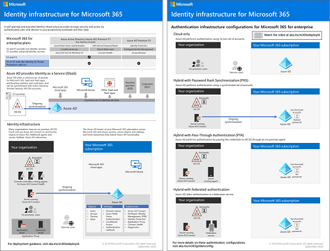

# Identitets översikt för Microsoft 365Identity roadmap for Microsoft 365

I Microsoft 365 för företag är en välplanerad och utförd identitets infrastruktur paves för bättre säkerhet och till gång till dina produktivitets arbets uppgifter och deras data enbart av autentiserade användare och enheter.In Microsoft 365 for enterprise, a well-planned and executed identity infrastructure paves the way for stronger security and access to your productivity workloads and their data only by authenticated users and devices.

Titta på den här videon om du vill ha en översikt över identitets modeller och-auktorisering för Microsoft 365 för företag.Watch this video for an overview of identity models and authentication for Microsoft 365 for enterprise.

 

 

> [!VIDEO https://www.microsoft.com/videoplayer/embed/RE2Pjwu]

För identitets funktionerna i varje Microsoft 365 för företag-abonnemang, rollen för Azure Active Directory (Azure AD), lokala och molnbaserade komponenter, samt de vanligaste autentiseringsinställningarna, kan du se [förhands granskning av identitet](../downloads/m365e-identity-infra.pdf).For the identity features of each Microsoft 365 for enterprise plan, the role of Azure Active Directory (Azure AD), on-premises and cloud-based components, and the most common authentication configurations, see the [Identity Infrastructure poster](../downloads/m365e-identity-infra.pdf).

Denna affisch med två sidor är ett snabbt sätt att ställa upp identitets koncept och konfigurationer för Microsoft 365 för företag.This two-page poster is a quick way to ramp up on identity concepts and configurations for Microsoft 365 for enterprise.

Du kan också [ladda ner denna affisch](https://github.com/MicrosoftDocs/microsoft-365-docs/raw/public/microsoft-365/downloads/m365e-identity-infra.pdf) och skriva ut den i formaten Letter, Legal och tabloid (11 x 17).You can also [download this poster](https://github.com/MicrosoftDocs/microsoft-365-docs/raw/public/microsoft-365/downloads/m365e-identity-infra.pdf) and print it in letter, legal, or tabloid (11 x 17) formats.

## PlaneraPlan

För att planera för din identitets implementering:To plan for your identity implementation:

- [Förstå de olika identitets modellernaUnderstand the different identity models](about-microsoft-365-identity.md)
- [Planera för Hybrid identitet och katalog synkroniseringPlan for hybrid identity and directory synchronization](plan-for-directory-synchronization.md)

## DistribueraDeploy

Så här distribuerar du din identitets implementering:To deploy your identity implementation:

- [Skydda globala administratörskontonProtect your global administrator accounts](protect-your-global-administrator-accounts.md)
- [Konfigurera och använda moln-Only-identiteterConfigure and use cloud-only identities](cloud-only-identities.md)
- [Konfigurera och använda Hybrid identiteterConfigure and use hybrid identities](prepare-for-directory-synchronization.md)
- [Konfigurera katalogsynkroniseringSet up directory synchronization](set-up-directory-synchronization.md)
- Om det behövs kan du använda ett [hybrid identitets scenario](hybrid-solutions.md)If needed, deploy [hybrid identity scenarios](hybrid-solutions.md)

### Rekommendationer för identitets- och enhetsåtkomstIdentity and device access recommendations

Microsoft tillhandahåller en uppsättning rekommendationer för [identitets- och enhetsåtkomst](microsoft-365-policies-configurations.md) för att säkerställa en säker och produktiv arbetsstyrka.Microsoft provides a set of recommendations for [identity and device access](microsoft-365-policies-configurations.md) to ensure a secure and productive workforce. Använd rekommendationer och inställningar i de här artiklarna för identitet:For identity, use the recommendations and settings in these articles:

- [KravPrerequisites](identity-access-prerequisites.md)
- [Vanliga principer för identitets- och enhetsåtkomstCommon identity and device access policies](identity-access-policies.md)

## HanteraManage

För att hantera din identitets implementering:To manage your identity implementation:

- [Tilldela licenser och hantera användar kontonAssign licenses and manage user accounts](assign-licenses-to-user-accounts.md)
- [Övervaka katalog synkroniseringMonitor directory synchronization](view-directory-synchronization-status.md)

## Så här fungerar Microsoft 365How Microsoft does identity for Microsoft 365

Lär dig hur IT-experter på Microsoft [hanterar identiteter och säker åtkomst](https://www.microsoft.com/en-us/itshowcase/managing-user-identities-and-secure-access-at-microsoft).Learn how IT experts at Microsoft [manage identities and secure access](https://www.microsoft.com/en-us/itshowcase/managing-user-identities-and-secure-access-at-microsoft).

>[!Note]
>Den här IT-showcaseresurs är endast tillgänglig på engelska.This IT Showcase resource is only available in English.
>

## Hur contoso lyckades för Microsoft 365How Contoso did identity for Microsoft 365

Se hur Contoso Corporation, ett fiktivt men representativt multinationellt företag, [distribuerade en hybrididentitetsinfrastruktur](contoso-identity.md) för Microsoft 365-molntjänster.See how the Contoso Corporation, a fictional but representative multi-national business, [deployed a hybrid identity infrastructure](contoso-identity.md) for Microsoft 365 cloud services.

## Nästa stegNext step

Påbörja din identitets planering med [identitets modeller](about-microsoft-365-identity.md).Start your identity planning with [Identity models](about-microsoft-365-identity.md).
