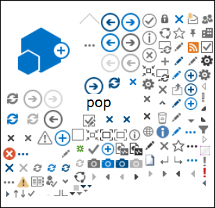
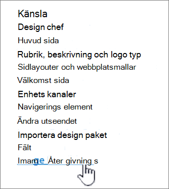
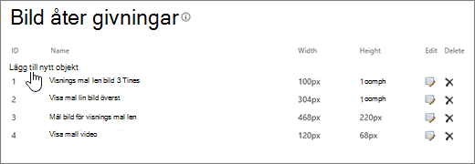
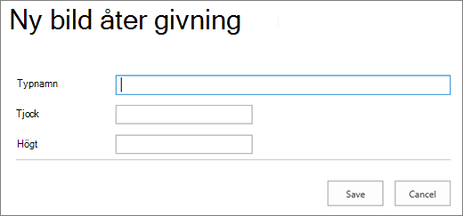

# Bildoptimering för SharePoint klassiska publiceringswebbplatser i Online

En webbsidas inläsningshastighet beror på den kombinerade storleken på alla komponenter som behövs för att återge sidan, inklusive bilder, HTML, JavaScript och CSS. Bilder är ett bra sätt att göra webbplatsen mer tilltalande, men deras storlek kan påverka prestandan. Genom att optimera bilderna med komprimering och storleksändring samt användning av sprites kan effekterna av väldigt stora bilder förskjutas. Om SharePoint bildåtergivningar kan du ladda upp en enda stor bild och visa delar av bilden så att den kan återanvändas i stället för att läsas in igen.

>[!NOTE]
>Det här avsnittet gäller för SharePoint klassiska publiceringswebbplatser online, inte moderna portalwebbplatser. Information om bildoptimering på webbplatser SharePoint onlineportal finns i [Optimera bilder i SharePoint sidor för moderna portaler online.](modern-image-optimization.md)
  
## Använda sprites för snabbare bildinläsning

|||
|:-----|:-----|
| En bild sprite innehåller många mindre bilder. Med CSS markerar du en del av den sammansatta bilden som ska visas på en viss del av sidan med absolut placering. Istället för att läsa in flera bilder flyttar du bara runt en enda bild på sidan och gör en liten del av bilden synlig genom ett litet fönster där den nödvändiga delen av spritebilden visas för slutanvändaren. SharePoint Online använder sprites för att visa dess olika ikoner i sprite-spcommon.png.     Det här tas upp:     Bildkomprimering     Bildoptimering     SharePoint bildåtergivningar    ||
   
Det kan ge högre prestanda eftersom du bara laddar ned en bild i stället för flera och sedan cachelagrar och återanvänder bilden. Även om bilden inte förblir cachelagrad minskar den här metoden det totala antalet HTTP-förfrågningar till servern, vilket minskar inläsningstiden för sidor. Det här är en form av bild sammanslagning. Det här är en mycket användbar teknik om bilderna inte ändras särskilt ofta, till exempel ikoner, som visas i SharePoint ovan. Du kan använda [Web Essentials](https://vswebessentials.com/), ett tredjeparts communitybaserat projekt med öppen källkod för att göra det enkelt i Microsoft Visual Studio. Mer information finns i [Förminring och sammanslagning i SharePoint Online.](./minification-and-bundling-in-sharepoint-online.md)
  
## Använda bildkomprimering och -optimering för att snabba på inläsningen av sidor

Bildkomprimering och -optimering handlar om att minska filstorleken för bilder som du använder på webbplatsen. Det bästa sättet att minska storleken på en bild är ofta att ändra storlek på bilden till det största måttet som den kommer att visas med på webbplatsen. Det finns ingen mening med att ha en bild som är större än den kommer att visas. Att kontrollera att bilder har rätt mått med hjälp av en bildredigerare är ett snabbt och enkelt sätt att minska sidans storlek.
  
När bilderna har rätt storlek är nästa steg att optimera komprimeringen av bilderna. Det finns olika verktyg som kan användas för komprimering och optimering, bland annat Fotogalleriet och verktyg från tredje part. Nyckeln till komprimering är att minska filstorleken så mycket som möjligt utan att någon urskiljbar kvalitet går förlorade för slutanvändarna. Testa de komprimerade filerna på en HD-skärm för att säkerställa att de fortfarande ser bra ut.
  
## Snabba på sidnedladdningar genom att SharePoint bildåtergivningar

Bildåtergivningar är en funktion i SharePoint Online som gör att du kan skapa olika versioner av bilder utifrån fördefinierade bildmått. Det här är särskilt viktigt när det finns bildinnehåll som användare genererat eller om bildmåtten, t.ex. bredd och höjd, korrigeras med CSS på webbplatsen. Även om en bild korrigeras med CSS läses bildens fulla upplösning ändå in. I det här fallet kan du minska filstorleken genom att använda bildåtergivningar.
  
> [!NOTE]
> Återgivningar är bara tillgängliga för SharePoint när publicering är aktiverat. Du kan aktivera publicering under Inställningar \> och Inställningar \> Hantera webbplatsfunktioner SharePoint \> Server-publicering. Annars visas inte alternativet.
  
Storleksändringen av bildåtergivningen fungerar genom att ta det minsta måttet som du definierar, antingen bredd eller höjd, och sedan ändra storlek på bilden så att storleken på det andra måttet ändras automatiskt baserat på det låsta bredd–höjd-förhållandet. Som standard beskärs bilden från mitten med återstående mått. Om du till exempel definierar en återgivning som är 100 bildpunkter bred och 50 bildpunkter hög, och den ursprungliga bilden är 1 000 bildpunkter bred och 800 bildpunkter hög, ändras storleken så att måttet på 800 bildpunkter nu är 50 bildpunkter och måttet på 1 000 bildpunkter (nu 62,5 bildpunkter) beskärs från mitten av bilden.
  
Stegen är relativt enkla, men om återgivningar ska användas för bilder måste återgivningarna finnas på den SharePoint innan du lägger till bilderna. Dessutom måste funktionerna infrastruktur för SharePoint-serverpublicering (webbplatssamlingsnivå) och SharePoint Serverpublicering (webbplatsnivå) vara aktiverat.
  
### Snabba på sidinläsningen genom att lägga till en bildåtergivning
  
1. Kontrollera att användarkontot som utför den här proceduren har åtminstone designbehörighet till webbplatsen på den översta nivån i webbplatssamlingen, och att webbplatsen publiceras på en webbsida.

2. Gå till den översta nivån i publiceringswebbplatssamlingen i en webbläsare.

3. Välj ikonen **Inställningar** bild.

4. På **sidan Inställningar,** i **avsnittet** Utseende, visas de inbyggda bildåtergivningarna.

    Du kan använda de förkryssade återgivningarna eller välja **Bildåtergivningar om** du vill skapa en ny.

    
  
5. Välj Lägg **till nytt objekt** på sidan **Bildåtergivningar.**

    
  
6. Ange **ett namn för återgivningen** i **rutan Namn** på sidan Ny bildåtergivning.

7. I **textrutorna** **Bredd** och Höjd anger du återgivningens bredd och höjd i bildpunkter och väljer sedan **Spara**.

    
  
## Anpassad beskärning med bildåtergivningar

Som standard genereras en bildåtergivning från mitten av bilden. Du kan justera bildåtergivningen för enskilda bilder genom att beskära den del av bilden som du vill använda. Du kan beskära bilderna individuellt, per återgivning. När du beskär bilder blir sidinläsningen snabbare genom att SharePoint använda blob-cachen och skapa en version av bilden för varje återgivning. På så sätt minskas serverbelastningen eftersom bildens storlek bara ändras en gång och sedan är klar att användas av slutanvändaren flera gånger. Mer information om hur du beskär en bildåtergivning finns i [Beskära en bildåtergivning](/sharepoint/dev/general-development/sharepoint-design-manager-device-channels).
