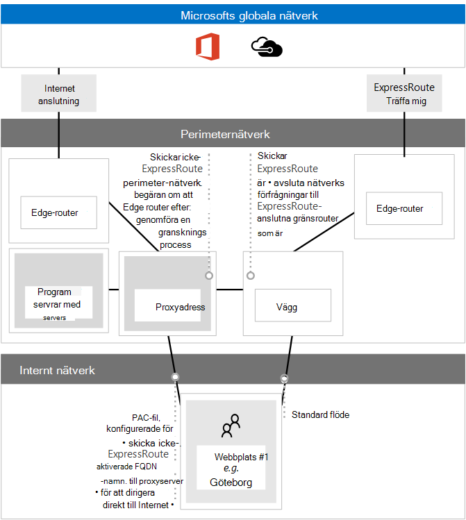

# <a name="implementing-expressroute-for-office-365"></a><span data-ttu-id="bcdf9-103">Implementera ExpressRoute för Office 365</span><span class="sxs-lookup"><span data-stu-id="bcdf9-103">Implementing ExpressRoute for Office 365</span></span>

<span data-ttu-id="bcdf9-104">*Denna artikel gäller för både Microsoft 365 Enterprise och Office 365 Enterprise.*</span><span class="sxs-lookup"><span data-stu-id="bcdf9-104">*This article applies to both Microsoft 365 Enterprise and Office 365 Enterprise.*</span></span>

<span data-ttu-id="bcdf9-105">ExpressRoute för Office 365 ger en alternativ routningssökväg till många Office 365-tjänster som har Internet.</span><span class="sxs-lookup"><span data-stu-id="bcdf9-105">ExpressRoute for Office 365 provides an alternate routing path to many internet facing Office 365 services.</span></span> <span data-ttu-id="bcdf9-106">Arkitekturen för ExpressRoute för Office 365 baseras på annonsering av offentliga IP-prefix för Office 365-tjänster som redan är tillgängliga via Internet i dina etablerade ExpressRoute-kretsar för efterföljande omdistribution av dessa IP-prefix till nätverket.</span><span class="sxs-lookup"><span data-stu-id="bcdf9-106">The architecture of ExpressRoute for Office 365 is based on advertising public IP prefixes of Office 365 services that are already accessible over the Internet into your provisioned ExpressRoute circuits for subsequent redistribution of those IP prefixes into your network.</span></span> <span data-ttu-id="bcdf9-107">Med ExpressRoute möjliggör du effektivt flera olika routningssökvägar, via internet och ExpressRoute, för många Office 365-tjänster.</span><span class="sxs-lookup"><span data-stu-id="bcdf9-107">With ExpressRoute you effectively enable several different routing paths, through the internet and through ExpressRoute, for many Office 365 services.</span></span> <span data-ttu-id="bcdf9-108">Den här statusen för routning i nätverket kan innebära en betydande förändring av hur den interna nätverkstopologin är utformad.</span><span class="sxs-lookup"><span data-stu-id="bcdf9-108">This state of routing on your network may represent a significant change to how your internal network topology is designed.</span></span>
  
 <span data-ttu-id="bcdf9-109">**Status:** Fullständig vägledning v2</span><span class="sxs-lookup"><span data-stu-id="bcdf9-109">**Status:** Complete Guide v2</span></span>
  
<span data-ttu-id="bcdf9-110">Du måste planera din Office 365-implementering av ExpressRoute noga för att ta hänsyn till nätverkskomplexitet som kan nås via både en särskild krets med routes som matas in i ditt kärnnätverk och Internet.</span><span class="sxs-lookup"><span data-stu-id="bcdf9-110">You must carefully plan your ExpressRoute for Office 365 implementation to accommodate for the network complexities of having routing available via both a dedicated circuit with routes injected into your core network and the internet.</span></span> <span data-ttu-id="bcdf9-111">Om du och ditt team inte går med på den detaljerade planeringen och de olika testerna i den här guiden är risken stor att du kommer få upprepade problem med eller en total förlust av anslutningen till Office 365-tjänster när ExpressRoute-kretsen är aktiverad.</span><span class="sxs-lookup"><span data-stu-id="bcdf9-111">If you and your team don't perform the detailed planning and testing in this guide, there is a high risk you'll experience intermittent or a total loss of connectivity to Office 365 services when the ExpressRoute circuit is enabled.</span></span>
  
<span data-ttu-id="bcdf9-112">Om du vill göra en lyckad implementering måste du analysera dina krav på infrastrukturen, gå igenom detaljerade nätverksbedömningar och -utformningar, noggrant planera implementeringen på ett detaljerat och kontrollerat sätt och skapa en detaljerad validerings- och testningsplan.</span><span class="sxs-lookup"><span data-stu-id="bcdf9-112">To have a successful implementation, you will need to analyze your infrastructure requirements, go through detailed network assessment and design, carefully plan the rollout in a staged and controlled manner, and build a detailed validation and testing plan.</span></span> <span data-ttu-id="bcdf9-113">För en stor, distribuerad miljö är det inte ovanligt med implementeringar som spänner över flera månader.</span><span class="sxs-lookup"><span data-stu-id="bcdf9-113">For a large, distributed environment it's not uncommon to see implementations span several months.</span></span> <span data-ttu-id="bcdf9-114">Den här guiden har utformats för att hjälpa dig planera.</span><span class="sxs-lookup"><span data-stu-id="bcdf9-114">This guide is designed to help you plan ahead.</span></span>
  
<span data-ttu-id="bcdf9-115">Stora och lyckade distributioner kan ta sex månader att planera och omfattar ofta teammedlemmar från många områden inom organisationen inklusive nätverk, brandväggs- och proxyserveradministratörer, Office 365-administratörer, säkerhet, support för slutanvändare, projektledning och sponsring från ledningen.</span><span class="sxs-lookup"><span data-stu-id="bcdf9-115">Large successful deployments may take six months in planning and often include team members from many areas in the organization including networking, Firewall and Proxy server administrators, Office 365 administrators, security, end-user support, project management, and executive sponsorship.</span></span> <span data-ttu-id="bcdf9-116">Investering i planeringsprocessen kommer att minska risken för att du får problem med distributionen som orsakar driftstopp eller komplex och dyr felsökning.</span><span class="sxs-lookup"><span data-stu-id="bcdf9-116">Your investment in the planning process will reduce the likelihood that you'll experience deployment failures resulting in downtime or complex and expensive troubleshooting.</span></span>
  
<span data-ttu-id="bcdf9-117">Vi räknar med att följande förutsättningar är slutförda innan den här implementeringsguiden startas.</span><span class="sxs-lookup"><span data-stu-id="bcdf9-117">We expect the following pre-requisites to be completed before this implementation guide is started.</span></span>
  
1. <span data-ttu-id="bcdf9-118">Du har genomfört en nätverksutvärdering för att avgöra om ExpressRoute rekommenderas och godkänns.</span><span class="sxs-lookup"><span data-stu-id="bcdf9-118">You've completed a network assessment to determine if ExpressRoute is recommended and approved.</span></span>

2. <span data-ttu-id="bcdf9-119">Du har valt en ExpressRoute-nätverkstjänstleverantör.</span><span class="sxs-lookup"><span data-stu-id="bcdf9-119">You've selected an ExpressRoute network service provider.</span></span> <span data-ttu-id="bcdf9-120">Hitta information om [ExpressRoute-partner och peeringplatser.](/azure/expressroute/expressroute-locations)</span><span class="sxs-lookup"><span data-stu-id="bcdf9-120">Find details about the [ExpressRoute partners and peering locations](/azure/expressroute/expressroute-locations).</span></span>

3. <span data-ttu-id="bcdf9-121">Du har redan läst och förstått [ExpressRoute-dokumentationen](https://azure.microsoft.com/documentation/services/expressroute/) och ditt interna nätverk kan uppfylla grundförutsättningarna för ExpressRoute från slut till slut.</span><span class="sxs-lookup"><span data-stu-id="bcdf9-121">You've already read and understand the [ExpressRoute documentation](https://azure.microsoft.com/documentation/services/expressroute/) and your internal network is able to meet ExpressRoute pre-requisites end to end.</span></span>

4. <span data-ttu-id="bcdf9-122">Din grupp har läst all offentlig vägledning och dokumentation på , och tittat på Azure ExpressRoute för [https://aka.ms/expressrouteoffice365](./azure-expressroute.md) [https://aka.ms/ert](https://aka.ms/ert) Office [365-utbildningsserien](https://channel9.msdn.com/series/aer) på Kanal 9 för att få en förståelse för kritisk teknisk information, till exempel:</span><span class="sxs-lookup"><span data-stu-id="bcdf9-122">Your team has read all of the public guidance and documentation at [https://aka.ms/expressrouteoffice365](./azure-expressroute.md), [https://aka.ms/ert](https://aka.ms/ert), and watched the [Azure ExpressRoute for Office 365 Training](https://channel9.msdn.com/series/aer) series on Channel 9 to gain an understanding of critical technical details including:</span></span>

      - <span data-ttu-id="bcdf9-123">Beroendet av Internet för SaaS-tjänster.</span><span class="sxs-lookup"><span data-stu-id="bcdf9-123">The internet dependencies of SaaS services.</span></span>

      - <span data-ttu-id="bcdf9-124">Hur du undviker asymmetriska routes och hanterar komplex routning.</span><span class="sxs-lookup"><span data-stu-id="bcdf9-124">How to avoid asymmetric routes and handle complex routing.</span></span>

      - <span data-ttu-id="bcdf9-125">Hur du införlivar kontroller för perimetersäkerhet, tillgänglighet och programnivå.</span><span class="sxs-lookup"><span data-stu-id="bcdf9-125">How to incorporate perimeter security, availability, and application level controls.</span></span>

## <a name="begin-by-gathering-requirements"></a><span data-ttu-id="bcdf9-126">Börja med att samla in krav</span><span class="sxs-lookup"><span data-stu-id="bcdf9-126">Begin by gathering requirements</span></span>
<span data-ttu-id="bcdf9-127"><a name="requirements"> </a></span><span class="sxs-lookup"><span data-stu-id="bcdf9-127"><a name="requirements"> </a></span></span>

<span data-ttu-id="bcdf9-128">Börja med att avgöra vilka funktioner och tjänster du planerar att använda i din organisation.</span><span class="sxs-lookup"><span data-stu-id="bcdf9-128">Start by determining which features and services you plan to adopt within your organization.</span></span> <span data-ttu-id="bcdf9-129">Du måste bestämma vilka funktioner i de olika Office 365-tjänsterna som ska användas och vilka platser i nätverket som är värd för personer som använder de funktionerna.</span><span class="sxs-lookup"><span data-stu-id="bcdf9-129">You need to determine which features of the different Office 365 services will be used and which locations on your network will host people using those features.</span></span> <span data-ttu-id="bcdf9-130">När du har katalogen med scenarier måste du lägga till de nätverksattribut som krävs för var och en av de scenarierna. till exempel inkommande och utgående nätverkstrafikflöden och om Office 365-slutpunkterna är tillgängliga via ExpressRoute eller inte.</span><span class="sxs-lookup"><span data-stu-id="bcdf9-130">With the catalog of scenarios, you need to add the network attributes that each of those scenarios require; such as inbound and outbound network traffic flows and if the Office 365 endpoints are available over ExpressRoute or not.</span></span>
  
<span data-ttu-id="bcdf9-131">Så här samlar du in organisationens krav:</span><span class="sxs-lookup"><span data-stu-id="bcdf9-131">To gather your organization's requirements:</span></span>
  
- <span data-ttu-id="bcdf9-132">Katalogisera inkommande och utgående nätverkstrafik för Office 365-tjänsterna som din organisation använder.</span><span class="sxs-lookup"><span data-stu-id="bcdf9-132">Catalog the inbound and outbound network traffic for the Office 365 services your organization is using.</span></span> <span data-ttu-id="bcdf9-133">Titta på sidan med URL:er och IP-adressintervall för Office 365 för att få en beskrivning av de flöden som olika Office 365-scenarier kräver.</span><span class="sxs-lookup"><span data-stu-id="bcdf9-133">Consult Office 365 URLs and IP address ranges page for the description of flows that different Office 365 scenarios require.</span></span>

- <span data-ttu-id="bcdf9-134">Samla in dokumentation om den befintliga nätverkstopologin som visar information om stommen och topologin i ditt interna WAN, anslutning av satellitwebbplatser, sista biten-anslutning för användare, routning till nätverkets utgående perimeterpunkter och proxytjänster.</span><span class="sxs-lookup"><span data-stu-id="bcdf9-134">Gather documentation of existing network topology showing details of your internal WAN backbone and topology, connectivity of satellite sites, last mile user connectivity, routing to network perimeter egress points, and proxy services.</span></span>

  - <span data-ttu-id="bcdf9-135">Identifiera slutpunkter för inkommande tjänster i nätverksdiagrammen som Office 365 och andra Microsoft-tjänster ansluter till, som visar både Internetanslutningssökvägar och föreslagna ExpressRoute-anslutningssökvägar.</span><span class="sxs-lookup"><span data-stu-id="bcdf9-135">Identify inbound service endpoints on the network diagrams that Office 365 and other Microsoft services will connect to, showing both internet and proposed ExpressRoute connection paths.</span></span>

  - <span data-ttu-id="bcdf9-136">Identifiera alla geografiska användarplatser och WAN-anslutningar mellan platser samt vilka platser som för närvarande har en utgång till internet och vilka platser som föreslås ha en utgång till en ExpressRoute-peeringplats.</span><span class="sxs-lookup"><span data-stu-id="bcdf9-136">Identify all geographic user locations and WAN connectivity between locations along with which locations currently have an egress to the internet and which locations are proposed to have an egress to an ExpressRoute peering location.</span></span>

  - <span data-ttu-id="bcdf9-137">Identifiera alla gränsenheter, till exempel proxyenheter, brandväggar och så vidare, och kartlägg deras relation till flöden via Internet och ExpressRoute.</span><span class="sxs-lookup"><span data-stu-id="bcdf9-137">Identify all edge devices, such as proxies, firewalls, and so on and catalog their relationship to flows going over the Internet and ExpressRoute.</span></span>

  - <span data-ttu-id="bcdf9-138">Dokumentera om slutanvändare ska komma åt Office 365-tjänster via direktroutning eller indirekt programproxy för både Internet- och ExpressRoute-flöden.</span><span class="sxs-lookup"><span data-stu-id="bcdf9-138">Document whether end users will access Office 365 services via direct routing or indirect application proxy for both Internet and ExpressRoute flows.</span></span>

- <span data-ttu-id="bcdf9-139">Lägg till klientorganisationens plats och platser för möte i nätverksdiagrammet.</span><span class="sxs-lookup"><span data-stu-id="bcdf9-139">Add the location of your tenant and meet-me locations to your network diagram.</span></span>

- <span data-ttu-id="bcdf9-140">Uppskatta förväntade och observerade nätverksprestanda och svarstidsegenskaper från större användarplatser till Office 365.</span><span class="sxs-lookup"><span data-stu-id="bcdf9-140">Estimate the expected and observed network performance and latency characteristics from major user locations to Office 365.</span></span> <span data-ttu-id="bcdf9-141">Kom ihåg att Office 365 är en global och fördelad uppsättning tjänster och att användare kommer att ansluta till andra platser än klientorganisationens.</span><span class="sxs-lookup"><span data-stu-id="bcdf9-141">Keep in mind that Office 365 is a global and distributed set of services and users will be connecting to locations that may be different from the location of their tenant.</span></span> <span data-ttu-id="bcdf9-142">Därför rekommenderar vi att du mäter och optimerar för svarstiden mellan användaren och den närmaste gränsen för Microsofts globala nätverk via ExpressRoute- och Internetanslutningar.</span><span class="sxs-lookup"><span data-stu-id="bcdf9-142">For this reason, it is recommended to measure and optimize for latency between the user and the closest edge of Microsoft global network over ExpressRoute and Internet connections.</span></span> <span data-ttu-id="bcdf9-143">Du kan använda resultaten från nätverksutvärderingen för den här uppgiften.</span><span class="sxs-lookup"><span data-stu-id="bcdf9-143">You can use your findings from the network assessment to aid with this task.</span></span>

- <span data-ttu-id="bcdf9-144">Lista krav för företagets nätverkssäkerhet och hög tillgänglighet som måste uppfyllas med den nya ExpressRoute-anslutningen.</span><span class="sxs-lookup"><span data-stu-id="bcdf9-144">List company network security and high availability requirements that need to be met with the new ExpressRoute connection.</span></span> <span data-ttu-id="bcdf9-145">Till exempel hur användare fortsatt får åtkomst till Office 365 vid ett fel på en Internet-utgång eller ExpressRoute-krets.</span><span class="sxs-lookup"><span data-stu-id="bcdf9-145">For example, how do users continue to get access to Office 365 in the event of the Internet egress or ExpressRoute circuit failure.</span></span>

- <span data-ttu-id="bcdf9-146">Dokumentera vilka inkommande och utgående Office 365-nätverksflöden som kommer att använda Internetsökvägen och vilka som kommer att använda ExpressRoute.</span><span class="sxs-lookup"><span data-stu-id="bcdf9-146">Document which inbound and outbound Office 365 network flows will use the Internet path and which will use ExpressRoute.</span></span> <span data-ttu-id="bcdf9-147">Specifika förutsättningar för dina användares geografiska platser och information om din lokala nätverkstopologi kan kräva att abonnemanget skiljer sig från en användarplats till en annan.</span><span class="sxs-lookup"><span data-stu-id="bcdf9-147">The specifics of geographical locations of your users and details of your on-premises network topology may require the plan to be different from one user location to another.</span></span>

### <a name="catalog-your-outbound-and-inbound-network-traffic"></a><span data-ttu-id="bcdf9-148">Katalogisera din utgående och inkommande nätverkstrafik</span><span class="sxs-lookup"><span data-stu-id="bcdf9-148">Catalog your outbound and inbound network traffic</span></span>
<span data-ttu-id="bcdf9-149"><a name="trafficCatalog"> </a></span><span class="sxs-lookup"><span data-stu-id="bcdf9-149"><a name="trafficCatalog"> </a></span></span>

<span data-ttu-id="bcdf9-150">För att minimera routning och annan nätverkskomplexitet rekommenderar vi att du bara använder ExpressRoute för Office 365 för de nätverkstrafikflöden som måste gå via en dedikerad anslutning på grund av krav eller som ett resultat av nätverksutvärderingen.</span><span class="sxs-lookup"><span data-stu-id="bcdf9-150">To minimize routing and other network complexities, we recommend that you only use ExpressRoute for Office 365 for the network traffic flows that are required to go over a dedicated connection due to regulatory requirements or as the result of the network assessment.</span></span> <span data-ttu-id="bcdf9-151">Dessutom rekommenderar vi att du fasar in ExpressRoute-routningens omfattning och metoden för utgående och inkommande nätverkstrafik som olika steg i implementeringsprojektet.</span><span class="sxs-lookup"><span data-stu-id="bcdf9-151">Additionally, we recommend that you stage the scope of ExpressRoute routing and approach outbound and inbound network traffic flows as different and distinct stages of the implementation project.</span></span> <span data-ttu-id="bcdf9-152">Om du bara distribuerar ExpressRoute för Office 365 för användarskapade utgående nätverkstrafikflöden och låter inkommande nätverkstrafikflöden gå via Internet kan du styra ökningen av den topologiska komplexiteten och riskerna som en introduktion till ytterligare asymmetriska routningsmöjligheter innebär.</span><span class="sxs-lookup"><span data-stu-id="bcdf9-152">Deploy ExpressRoute for Office 365 for just user initiated outbound network traffic flows and leave inbound network traffic flows across the Internet can help to control the increase in topological complexity and risks of introducing additional asymmetric routing possibilities.</span></span>
  
<span data-ttu-id="bcdf9-153">Din katalog över nätverkstrafik ska innehålla alla ingående och utgående nätverksanslutningar som du har mellan ditt lokala nätverk och Microsoft.</span><span class="sxs-lookup"><span data-stu-id="bcdf9-153">Your network traffic catalog should contain listings of all the inbound and outbound network connections that you'll have between your on-premises network and Microsoft.</span></span>
  
- <span data-ttu-id="bcdf9-154">Utgående nätverkstrafikflöden är alla scenarier där en anslutning initieras från din lokala miljö, till exempel från interna klienter eller servrar, med Microsoft-tjänsterna som mål.</span><span class="sxs-lookup"><span data-stu-id="bcdf9-154">Outbound network traffic flows are any scenarios where a connection is initiated from your on-premises environment, such as from internal clients or servers, with a destination of the Microsoft services.</span></span> <span data-ttu-id="bcdf9-155">De här anslutningarna kan vara direkta till Office 365 eller indirekta, till exempel när anslutningen går genom proxyservrar, brandväggar eller andra nätverksenheter på vägen till Office 365.</span><span class="sxs-lookup"><span data-stu-id="bcdf9-155">These connections may be direct to Office 365 or indirect, such as when the connection goes through proxy servers, firewalls, or other networking devices on the path to Office 365.</span></span>

- <span data-ttu-id="bcdf9-156">Inkommande nätverkstrafikflöden är alla scenarier där en anslutning initieras från Microsoft-molnet till en lokal värd.</span><span class="sxs-lookup"><span data-stu-id="bcdf9-156">Inbound network traffic flows are any scenarios where a connection is initiated from the Microsoft cloud to an on-premises host.</span></span> <span data-ttu-id="bcdf9-157">De här anslutningarna behöver vanligtvis gå genom brandväggen och annan säkerhetsinfrastruktur som kundens säkerhetspolicy kräver för flöden med externt ursprung.</span><span class="sxs-lookup"><span data-stu-id="bcdf9-157">These connections typically need to go through firewall and other security infrastructure that customer security policy requires for externally originated flows.</span></span>

<span data-ttu-id="bcdf9-158">Läs  avsnittet Säkerställa routningssymmetri i artikeln Dirigering med ExpressRoute för [Office 365](https://support.office.com/article/Routing-with-ExpressRoute-for-Office-365-e1da26c6-2d39-4379-af6f-4da213218408) för att avgöra vilka tjänster som ska skicka inkommande trafik och leta efter kolumnen som är markerad med ExpressRoute för **Office 365** i [Office 365-slutpunkterna](https://support.office.com/article/Office-365-URLs-and-IP-address-ranges-8548a211-3fe7-47cb-abb1-355ea5aa88a2) refererar till artikeln för att fastställa resten av anslutningsinformationen.</span><span class="sxs-lookup"><span data-stu-id="bcdf9-158">Read the **Ensuring route symmetry** section of the article [Routing with ExpressRoute for Office 365](https://support.office.com/article/Routing-with-ExpressRoute-for-Office-365-e1da26c6-2d39-4379-af6f-4da213218408) to determine which services will send inbound traffic and look for the column marked **ExpressRoute for Office 365** in the [Office 365 endpoints](https://support.office.com/article/Office-365-URLs-and-IP-address-ranges-8548a211-3fe7-47cb-abb1-355ea5aa88a2) reference article to determine the rest of the connectivity information.</span></span>
  
<span data-ttu-id="bcdf9-159">För varje tjänst som kräver en utgående anslutning ska du beskriva den planerade anslutningen för tjänsten, inklusive nätverksroutning, proxykonfiguration, paketkontroll och bandbreddsbehov.</span><span class="sxs-lookup"><span data-stu-id="bcdf9-159">For each service that requires an outbound connection, you'll want to describe the planned connectivity for the service including network routing, proxy configuration, packet inspection, and bandwidth needs.</span></span>
  
<span data-ttu-id="bcdf9-160">För varje tjänst som kräver en inkommande anslutning behöver du ytterligare information.</span><span class="sxs-lookup"><span data-stu-id="bcdf9-160">For each service that requires an inbound connection, you'll need some additional information.</span></span> <span data-ttu-id="bcdf9-161">Servrar i Microsoft-molnet upprättar anslutningar till ditt lokala nätverk.</span><span class="sxs-lookup"><span data-stu-id="bcdf9-161">Servers in the Microsoft cloud will establish connections to your on-premises network.</span></span> <span data-ttu-id="bcdf9-162">om du vill vara säker på att anslutningarna görs på rätt sätt bör du beskriva alla aspekter av den här anslutningen, inklusive: offentliga DNS-poster för de tjänster som accepterar dessa inkommande anslutningar, de CIDR-formaterade IPv4 IP-adresserna, vilken ISP-utrustning som ingår, och hur inkommande NAT eller käll-NAT hanteras för dessa anslutningar.</span><span class="sxs-lookup"><span data-stu-id="bcdf9-162">to ensure the connections are made correctly, you'll want to describe all aspects of this connectivity, including; the public DNS entries for the services that will accept these inbound connections, the CIDR formatted IPv4 IP addresses, which ISP equipment is involved, and how inbound NAT or source NAT is handled for these connections.</span></span>
  
<span data-ttu-id="bcdf9-163">Inkommande anslutningar bör granskas oavsett om de ansluter via Internet eller ExpressRoute för att säkerställa att asymmetrisk routning inte har använts.</span><span class="sxs-lookup"><span data-stu-id="bcdf9-163">Inbound connections should be reviewed regardless of whether they're connecting over the internet or ExpressRoute to ensure asymmetric routing hasn't been introduced.</span></span> <span data-ttu-id="bcdf9-164">I vissa fall kan lokala slutpunkter som Office 365-tjänster initierar inkommande anslutningar till också behöva nås av andra tjänster från Microsoft och andra användare.</span><span class="sxs-lookup"><span data-stu-id="bcdf9-164">In some cases, on-premises endpoints that Office 365 services initiate inbound connections to may also need to be accessed by other Microsoft and non-Microsoft services.</span></span> <span data-ttu-id="bcdf9-165">Det är mycket viktigt att aktiveringen av ExpressRoute-routning till de här tjänsterna för Office 365-syften inte bryter andra scenarier.</span><span class="sxs-lookup"><span data-stu-id="bcdf9-165">It is paramount that enabling ExpressRoute routing to these services for Office 365 purposes doesn't break other scenarios.</span></span> <span data-ttu-id="bcdf9-166">I många fall kan kunder behöva implementera specifika ändringar i sina interna nätverk, till exempel källbaserad NAT, för att säkerställa att inkommande flöden från Microsoft förblir symmetriska när ExpressRoute har aktiverats.</span><span class="sxs-lookup"><span data-stu-id="bcdf9-166">In many cases, customers may need to implement specific changes to their internal network, such as source based NAT, to ensure that inbound flows from Microsoft remain symmetric after ExpressRoute is enabled.</span></span>
  
<span data-ttu-id="bcdf9-167">Här är ett exempel på detaljnivån som krävs.</span><span class="sxs-lookup"><span data-stu-id="bcdf9-167">Here's a sample of the level of detail required.</span></span> <span data-ttu-id="bcdf9-168">I det här fallet skulle Exchange-hybriden dirigeras till det lokala systemet via ExpressRoute.</span><span class="sxs-lookup"><span data-stu-id="bcdf9-168">In this case Exchange Hybrid would route to the on-premises system over ExpressRoute.</span></span>

|<span data-ttu-id="bcdf9-169">**Anslutningsegenskap**</span><span class="sxs-lookup"><span data-stu-id="bcdf9-169">**Connection property**</span></span>|<span data-ttu-id="bcdf9-170">**Värde**</span><span class="sxs-lookup"><span data-stu-id="bcdf9-170">**Value**</span></span>|
|:-----|:-----|
|<span data-ttu-id="bcdf9-171">**Nätverkstrafikriktning**</span><span class="sxs-lookup"><span data-stu-id="bcdf9-171">**Network traffic direction**</span></span> <br/> |<span data-ttu-id="bcdf9-172">Inkommande</span><span class="sxs-lookup"><span data-stu-id="bcdf9-172">Inbound</span></span>  <br/> |
|<span data-ttu-id="bcdf9-173">**Tjänst**</span><span class="sxs-lookup"><span data-stu-id="bcdf9-173">**Service**</span></span> <br/> |<span data-ttu-id="bcdf9-174">Exchange-hybrid</span><span class="sxs-lookup"><span data-stu-id="bcdf9-174">Exchange Hybrid</span></span>  <br/> |
|<span data-ttu-id="bcdf9-175">**Offentlig Office 365-slutpunkt (källa)**</span><span class="sxs-lookup"><span data-stu-id="bcdf9-175">**Public Office 365 endpoint (source)**</span></span> <br/> |<span data-ttu-id="bcdf9-176">Exchange Online (IP-adresser)</span><span class="sxs-lookup"><span data-stu-id="bcdf9-176">Exchange Online (IP addresses)</span></span>  <br/> |
|<span data-ttu-id="bcdf9-177">**Offentlig lokal slutpunkt (mål)**</span><span class="sxs-lookup"><span data-stu-id="bcdf9-177">**Public On-Premises Endpoint (destination)**</span></span> <br/> |<span data-ttu-id="bcdf9-178">5.5.5.5</span><span class="sxs-lookup"><span data-stu-id="bcdf9-178">5.5.5.5</span></span>  <br/> |
|<span data-ttu-id="bcdf9-179">**Offentlig DNS-post (Internet)**</span><span class="sxs-lookup"><span data-stu-id="bcdf9-179">**Public (Internet) DNS entry**</span></span> <br/> |<span data-ttu-id="bcdf9-180">Autodiscover.contoso.com</span><span class="sxs-lookup"><span data-stu-id="bcdf9-180">Autodiscover.contoso.com</span></span>  <br/> |
|<span data-ttu-id="bcdf9-181">**Kommer den här lokala slutpunkten användas för andra Microsoft-tjänster (icke-Office 365)**</span><span class="sxs-lookup"><span data-stu-id="bcdf9-181">**Will this on-premises endpoint be used for by other (non-Office 365) Microsoft services**</span></span> <br/> |<span data-ttu-id="bcdf9-182">Nej</span><span class="sxs-lookup"><span data-stu-id="bcdf9-182">No</span></span>  <br/> |
|<span data-ttu-id="bcdf9-183">**Kommer den här lokala slutpunkten användas av användare/system på Internet**</span><span class="sxs-lookup"><span data-stu-id="bcdf9-183">**Will this on-premises endpoint be used by users/systems on the Internet**</span></span> <br/> |<span data-ttu-id="bcdf9-184">Ja</span><span class="sxs-lookup"><span data-stu-id="bcdf9-184">Yes</span></span>  <br/> |
|<span data-ttu-id="bcdf9-185">**Interna system som publiceras via offentliga slutpunkter**</span><span class="sxs-lookup"><span data-stu-id="bcdf9-185">**Internal systems published through public endpoints**</span></span> <br/> |<span data-ttu-id="bcdf9-186">Exchange Server-klientåtkomstroll (lokal) 192.168.101, 192.168.102, 192.168.103</span><span class="sxs-lookup"><span data-stu-id="bcdf9-186">Exchange Server client access role (on-premises) 192.168.101, 192.168.102, 192.168.103</span></span>  <br/> |
|<span data-ttu-id="bcdf9-187">**IP-annonsering för den offentliga slutpunkten**</span><span class="sxs-lookup"><span data-stu-id="bcdf9-187">**IP advertisement of the public endpoint**</span></span> <br/> |<span data-ttu-id="bcdf9-188">**Till Internet:** 5.5.0.0/16</span><span class="sxs-lookup"><span data-stu-id="bcdf9-188">**To Internet**: 5.5.0.0/16</span></span>  <br/> <span data-ttu-id="bcdf9-189">**Till ExpressRoute**: 5.5.5.0/24</span><span class="sxs-lookup"><span data-stu-id="bcdf9-189">**To ExpressRoute**: 5.5.5.0/24</span></span>  <br/> |
|<span data-ttu-id="bcdf9-190">**Säkerhets- och perimeterkontroller**</span><span class="sxs-lookup"><span data-stu-id="bcdf9-190">**Security/Perimeter Controls**</span></span> <br/> |<span data-ttu-id="bcdf9-191">**Internetsökväg:** DeviceID_002</span><span class="sxs-lookup"><span data-stu-id="bcdf9-191">**Internet path**: DeviceID_002</span></span>  <br/> <span data-ttu-id="bcdf9-192">**ExpressRoute-sökväg:** DeviceID_003</span><span class="sxs-lookup"><span data-stu-id="bcdf9-192">**ExpressRoute path**: DeviceID_003</span></span>  <br/> |
|<span data-ttu-id="bcdf9-193">**Hög tillgänglighet**</span><span class="sxs-lookup"><span data-stu-id="bcdf9-193">**High Availability**</span></span> <br/> |<span data-ttu-id="bcdf9-194">Aktiv/aktiv på 2 geo-redundanta</span><span class="sxs-lookup"><span data-stu-id="bcdf9-194">Active/Active across 2 geo-redundant</span></span>  <br/> <span data-ttu-id="bcdf9-195">ExpressRoute-kretsar – Chicago och Dallas</span><span class="sxs-lookup"><span data-stu-id="bcdf9-195">ExpressRoute circuits - Chicago and Dallas</span></span>  <br/> |
|<span data-ttu-id="bcdf9-196">**Symmetrikontroll för sökväg**</span><span class="sxs-lookup"><span data-stu-id="bcdf9-196">**Path symmetry control**</span></span> <br/> |<span data-ttu-id="bcdf9-197">**Metod**: Käll-NAT</span><span class="sxs-lookup"><span data-stu-id="bcdf9-197">**Method**: Source NAT</span></span>  <br/> <span data-ttu-id="bcdf9-198">**Internetsökväg**: Inkommande anslutningar för käll-NAT till 192.168.5.5</span><span class="sxs-lookup"><span data-stu-id="bcdf9-198">**Internet path**: Source NAT inbound connections to 192.168.5.5</span></span>  <br/> |<span data-ttu-id="bcdf9-199">**ExpressRoute-sökväg:** Anslutningar för käll-NAT till 192.168.1.0 (Chicago) och 192.168.2.0 (Dallas)</span><span class="sxs-lookup"><span data-stu-id="bcdf9-199">**ExpressRoute path**: Source NAT connections to 192.168.1.0 (Chicago) and 192.168.2.0 (Dallas)</span></span>  <br/> |

<span data-ttu-id="bcdf9-200">Här är ett exempel på en tjänst som endast är utgående:</span><span class="sxs-lookup"><span data-stu-id="bcdf9-200">Here's a sample of a service that is outbound only:</span></span>

|<span data-ttu-id="bcdf9-201">**Anslutningsegenskap**</span><span class="sxs-lookup"><span data-stu-id="bcdf9-201">**Connection property**</span></span>|<span data-ttu-id="bcdf9-202">**Värde**</span><span class="sxs-lookup"><span data-stu-id="bcdf9-202">**Value**</span></span>|
|:-----|:-----|
|<span data-ttu-id="bcdf9-203">**Nätverkstrafikriktning**</span><span class="sxs-lookup"><span data-stu-id="bcdf9-203">**Network traffic direction**</span></span> <br/> |<span data-ttu-id="bcdf9-204">Utgående</span><span class="sxs-lookup"><span data-stu-id="bcdf9-204">Outbound</span></span>  <br/> |
|<span data-ttu-id="bcdf9-205">**Tjänst**</span><span class="sxs-lookup"><span data-stu-id="bcdf9-205">**Service**</span></span> <br/> |<span data-ttu-id="bcdf9-206">SharePoint Online</span><span class="sxs-lookup"><span data-stu-id="bcdf9-206">SharePoint Online</span></span>  <br/> |
|<span data-ttu-id="bcdf9-207">**Lokal slutpunkt (källa)**</span><span class="sxs-lookup"><span data-stu-id="bcdf9-207">**On-premises endpoint (source)**</span></span> <br/> |<span data-ttu-id="bcdf9-208">Användarens arbetsstation</span><span class="sxs-lookup"><span data-stu-id="bcdf9-208">User workstation</span></span>  <br/> |
|<span data-ttu-id="bcdf9-209">**Offentlig Office 365-slutpunkt (mål)**</span><span class="sxs-lookup"><span data-stu-id="bcdf9-209">**Public Office 365 endpoint (destination)**</span></span> <br/> |<span data-ttu-id="bcdf9-210">SharePoint Online (IP-adresser)</span><span class="sxs-lookup"><span data-stu-id="bcdf9-210">SharePoint Online (IP addresses)</span></span>  <br/> |
|<span data-ttu-id="bcdf9-211">**Offentlig DNS-post (Internet)**</span><span class="sxs-lookup"><span data-stu-id="bcdf9-211">**Public (Internet) DNS entry**</span></span> <br/> |<span data-ttu-id="bcdf9-212">\*.sharepoint.com (och ytterligare FQDN)</span><span class="sxs-lookup"><span data-stu-id="bcdf9-212">\*.sharepoint.com (and additional FQDNs)</span></span>  <br/> |
|<span data-ttu-id="bcdf9-213">**CDN-hänvisningar**</span><span class="sxs-lookup"><span data-stu-id="bcdf9-213">**CDN Referrals**</span></span> <br/> |<span data-ttu-id="bcdf9-214">cdn.sharepointonline.com (och ytterligare FQDN) – IP-adresser som underhålls av CDN-leverantörer)</span><span class="sxs-lookup"><span data-stu-id="bcdf9-214">cdn.sharepointonline.com (and additional FQDNs) - IP addresses maintained by CDN providers)</span></span>  <br/> |
|<span data-ttu-id="bcdf9-215">**IP-annonsering och NAT används**</span><span class="sxs-lookup"><span data-stu-id="bcdf9-215">**IP advertisement and NAT in use**</span></span> <br/> |<span data-ttu-id="bcdf9-216">**Internetsökväg/käll-NAT**: 1.1.1.0/24</span><span class="sxs-lookup"><span data-stu-id="bcdf9-216">**Internet path/Source NAT**: 1.1.1.0/24</span></span>  <br/> <span data-ttu-id="bcdf9-217">**ExpressRoute-sökväg/käll-NAT**: 1.1.2.0/24 (Chicago) och 1.1.3.0/24 (Dallas)</span><span class="sxs-lookup"><span data-stu-id="bcdf9-217">**ExpressRoute path/Source NAT**: 1.1.2.0/24 (Chicago) and 1.1.3.0/24 (Dallas)</span></span>  <br/> |
|<span data-ttu-id="bcdf9-218">**Anslutningsmetod**</span><span class="sxs-lookup"><span data-stu-id="bcdf9-218">**Connectivity method**</span></span> <br/> |<span data-ttu-id="bcdf9-219">**Internet:** via lager 7-proxy (PAC-fil)</span><span class="sxs-lookup"><span data-stu-id="bcdf9-219">**Internet**: via layer 7 proxy (.pac file)</span></span>  <br/> <span data-ttu-id="bcdf9-220">**ExpressRoute:** direktroutning (ingen proxy)</span><span class="sxs-lookup"><span data-stu-id="bcdf9-220">**ExpressRoute**: direct routing (no proxy)</span></span>  <br/> |
|<span data-ttu-id="bcdf9-221">**Säkerhets- och perimeterkontroller**</span><span class="sxs-lookup"><span data-stu-id="bcdf9-221">**Security/Perimeter Controls**</span></span> <br/> |<span data-ttu-id="bcdf9-222">**Internetsökväg:** DeviceID_002</span><span class="sxs-lookup"><span data-stu-id="bcdf9-222">**Internet path**: DeviceID_002</span></span>  <br/> <span data-ttu-id="bcdf9-223">**ExpressRoute-sökväg:** DeviceID_003</span><span class="sxs-lookup"><span data-stu-id="bcdf9-223">**ExpressRoute path**: DeviceID_003</span></span>  <br/> |
|<span data-ttu-id="bcdf9-224">**Hög tillgänglighet**</span><span class="sxs-lookup"><span data-stu-id="bcdf9-224">**High Availability**</span></span> <br/> |<span data-ttu-id="bcdf9-225">**Internetsökväg:** Redundant internet egress</span><span class="sxs-lookup"><span data-stu-id="bcdf9-225">**Internet path**: Redundant internet egress</span></span>  <br/> <span data-ttu-id="bcdf9-226">**ExpressRoute-sökväg:** Aktiv/aktiv "potatis"-routning på 2 geo-redundanta ExpressRoute-kretsar – Chicago och Dallas</span><span class="sxs-lookup"><span data-stu-id="bcdf9-226">**ExpressRoute path**: Active/Active 'hot potato' routing across 2 geo-redundant ExpressRoute circuits - Chicago and Dallas</span></span>  <br/> |
|<span data-ttu-id="bcdf9-227">**Symmetrikontroll för sökväg**</span><span class="sxs-lookup"><span data-stu-id="bcdf9-227">**Path symmetry control**</span></span> <br/> |<span data-ttu-id="bcdf9-228">**Metod**: Käll-NAT för alla anslutningar</span><span class="sxs-lookup"><span data-stu-id="bcdf9-228">**Method**: Source NAT for all connections</span></span>  <br/> |

### <a name="your-network-topology-design-with-regional-connectivity"></a><span data-ttu-id="bcdf9-229">Utformning av din nätverkstopologi med regional anslutning</span><span class="sxs-lookup"><span data-stu-id="bcdf9-229">Your network topology design with regional connectivity</span></span>
<span data-ttu-id="bcdf9-230"><a name="topology"> </a></span><span class="sxs-lookup"><span data-stu-id="bcdf9-230"><a name="topology"> </a></span></span>

<span data-ttu-id="bcdf9-231">När du förstår tjänsterna och deras kopplade nätverkstrafikflöden kan du skapa ett nätverksdiagram där de här nya anslutningskraven ingår och som beskriver ändringarna du kommer att göra för att använda ExpressRoute för Office 365.</span><span class="sxs-lookup"><span data-stu-id="bcdf9-231">Once you understand the services and their associated network traffic flows, you can create a network diagram that incorporates these new connectivity requirements and illustrates the changes you'll make to use ExpressRoute for Office 365.</span></span> <span data-ttu-id="bcdf9-232">Ditt diagram ska innehålla:</span><span class="sxs-lookup"><span data-stu-id="bcdf9-232">Your diagram should include:</span></span>
  
1. <span data-ttu-id="bcdf9-233">Alla användarplatser där Office 365 och andra tjänster kommer åt dem.</span><span class="sxs-lookup"><span data-stu-id="bcdf9-233">All user locations where Office 365 and other services will be accessed from.</span></span>

2. <span data-ttu-id="bcdf9-234">Alla utgående punkter för Internet och ExpressRoute.</span><span class="sxs-lookup"><span data-stu-id="bcdf9-234">All internet and ExpressRoute egress points.</span></span>

3. <span data-ttu-id="bcdf9-235">Alla utgående och inkommande enheter som hanterar anslutningar in i och ut ur nätverket, inklusive routrar, brandväggar, programproxyservrar och intrångsidentifiering/-skydd.</span><span class="sxs-lookup"><span data-stu-id="bcdf9-235">All outbound and inbound devices that manage connectivity in and out of the network, including routers, firewalls, application proxy servers, and intrusion detection/prevention.</span></span>

4. <span data-ttu-id="bcdf9-236">Interna mål för all inkommande trafik, till exempel interna ADFS-servrar som accepterar anslutningar från ADFS-webbprogramproxyservrarna.</span><span class="sxs-lookup"><span data-stu-id="bcdf9-236">Internal destinations for all inbound traffic, such as internal ADFS servers that accept connections from the ADFS web application proxy servers.</span></span>

5. <span data-ttu-id="bcdf9-237">Katalog över alla IP-undernät som ska annonseras</span><span class="sxs-lookup"><span data-stu-id="bcdf9-237">Catalog of all IP subnets that will be advertised</span></span>

6. <span data-ttu-id="bcdf9-238">Identifiera varje plats där personer kommer att komma åt Office 365 från och lista de meet-me-platser som ska användas för ExpressRoute.</span><span class="sxs-lookup"><span data-stu-id="bcdf9-238">Identify each location where people will access Office 365 from and list the meet-me locations that will be used for ExpressRoute.</span></span>

7. <span data-ttu-id="bcdf9-239">Platser och delar av din interna nätverkstopologi där Microsoft-IP-prefix som lärts från ExpressRoute accepteras, filtreras och sprids till.</span><span class="sxs-lookup"><span data-stu-id="bcdf9-239">Locations and portions of your internal network topology, where Microsoft IP prefixes learned from ExpressRoute will be accepted, filtered and propagated to.</span></span>

8. <span data-ttu-id="bcdf9-240">Nätverkstopologin ska illustrera varje nätverkssegments geografiska plats och hur det ansluter till Microsoft-nätverket via ExpressRoute och/eller Internet.</span><span class="sxs-lookup"><span data-stu-id="bcdf9-240">The network topology should illustrate the geographic location of each network segment and how it connects to the Microsoft network over ExpressRoute and/or the Internet.</span></span>

<span data-ttu-id="bcdf9-241">Diagrammet nedan visar varje plats där personer kommer att använda Office 365 samt inkommande och utgående routningsannonsering till Office 365.</span><span class="sxs-lookup"><span data-stu-id="bcdf9-241">The diagram below shows each location where people will be using Office 365 from along with the inbound and outbound routing advertisements to Office 365.</span></span>
  

  
<span data-ttu-id="bcdf9-243">För utgående trafik använder personerna Office 365 på ett av tre sätt:</span><span class="sxs-lookup"><span data-stu-id="bcdf9-243">For outbound traffic, the people access Office 365 in one of three ways:</span></span>
  
1. <span data-ttu-id="bcdf9-244">Via en meet-me-plats i Nordamerika för personer i Kalifornien.</span><span class="sxs-lookup"><span data-stu-id="bcdf9-244">Through a meet-me location in North America for the people in California.</span></span>

2. <span data-ttu-id="bcdf9-245">Via en meet-me-plats i Hongkong för personer i Hongkong.</span><span class="sxs-lookup"><span data-stu-id="bcdf9-245">Through a meet-me location in Hong Kong for the people in Hong Kong.</span></span>

3. <span data-ttu-id="bcdf9-246">Via internet i Bangladesh där det finns färre personer och ingen ExpressRoute-krets har etablerats.</span><span class="sxs-lookup"><span data-stu-id="bcdf9-246">Through the internet in Bangladesh where there are fewer people and no ExpressRoute circuit provisioned.</span></span>


  
<span data-ttu-id="bcdf9-248">På samma sätt returnerar den inkommande nätverkstrafiken från Office 365 på ett av tre sätt:</span><span class="sxs-lookup"><span data-stu-id="bcdf9-248">Similarly, the inbound network traffic from Office 365 returns in one of three ways:</span></span>
  
1. <span data-ttu-id="bcdf9-249">Via en meet-me-plats i Nordamerika för personer i Kalifornien.</span><span class="sxs-lookup"><span data-stu-id="bcdf9-249">Through a meet-me location in North America for the people in California.</span></span>

2. <span data-ttu-id="bcdf9-250">Via en meet-me-plats i Hongkong för personer i Hongkong.</span><span class="sxs-lookup"><span data-stu-id="bcdf9-250">Through a meet-me location in Hong Kong for the people in Hong Kong.</span></span>

3. <span data-ttu-id="bcdf9-251">Via internet i Bangladesh där det finns färre personer och ingen ExpressRoute-krets har etablerats.</span><span class="sxs-lookup"><span data-stu-id="bcdf9-251">Through the internet in Bangladesh where there are fewer people and no ExpressRoute circuit provisioned.</span></span>


  
### <a name="determine-the-appropriate-meet-me-location"></a><span data-ttu-id="bcdf9-253">Fastställa lämplig meet-me-plats</span><span class="sxs-lookup"><span data-stu-id="bcdf9-253">Determine the appropriate meet-me location</span></span>

<span data-ttu-id="bcdf9-254">Valet av meet-me-platser, som är den fysiska plats där din ExpressRoute-krets ansluter nätverket till Microsoft-nätverket, påverkas av platserna där personer kommer att använda Office 365.</span><span class="sxs-lookup"><span data-stu-id="bcdf9-254">The selection of meet-me locations, which are the physical location where your ExpressRoute circuit connects your network to the Microsoft network, is influenced by the locations where people will access Office 365 from.</span></span> <span data-ttu-id="bcdf9-255">Eftersom Office 365 är en SaaS-tjänst så fungerar den inte enligt den regionala IaaS- eller PaaS-modellen på samma sätt som Azure.</span><span class="sxs-lookup"><span data-stu-id="bcdf9-255">As a SaaS offering, Office 365 does not operate under the IaaS or PaaS regional model in the same way Azure does.</span></span> <span data-ttu-id="bcdf9-256">Office 365 är i stället en fördelad uppsättning samarbetstjänster, där användare kan behöva ansluta till slutpunkter över flera datacenter och regioner, som kanske inte nödvändigtvis finns på samma plats eller i samma region som användarens klientorganisation.</span><span class="sxs-lookup"><span data-stu-id="bcdf9-256">Instead, Office 365 is a distributed set of collaboration services, where users may need to connect to endpoints across multiple datacenters and regions, which may not necessarily be in the same location or region where the user's tenant is hosted.</span></span>
  
<span data-ttu-id="bcdf9-257">Det innebär att det viktigaste som du måste göra när du väljer meet-me-platser för ExpressRoute för Office 365 är från vilken personer i organisationen kommer att ansluta från.</span><span class="sxs-lookup"><span data-stu-id="bcdf9-257">This means the most important consideration you need to make when selecting meet-me locations for ExpressRoute for Office 365 is where the people in your organization will be connecting from.</span></span> <span data-ttu-id="bcdf9-258">Den allmänna rekommendationen för optimal Office 365-anslutning är att implementera routning, så att användarförfrågningar till Office 365-tjänster lämnas in i Microsoft-nätverket via den kortaste nätverkssökvägen, vilket också ofta kallas "snabb potatisdirigering".</span><span class="sxs-lookup"><span data-stu-id="bcdf9-258">The general recommendation for optimal Office 365 connectivity is implement routing, so that user requests to Office 365 services are handed off into the Microsoft network over the shortest network path, this is also often being referred to as 'hot potato' routing.</span></span> <span data-ttu-id="bcdf9-259">Om de flesta Office 365-användarna till exempel befinner sig på en eller två platser skapar du den optimala designen genom att välja "meet-me"-platser som ligger närmast platsen för de användarna.</span><span class="sxs-lookup"><span data-stu-id="bcdf9-259">For example, if most of the Office 365 users are in one or two locations, selecting meet-me locations that are in the closest proximity to the location of those users will create the optimal design.</span></span> <span data-ttu-id="bcdf9-260">Om ditt företag har stora användargrupper i många olika regioner kan det vara bra att ha flera ExpressRoute-kretsar och meet-me-platser.</span><span class="sxs-lookup"><span data-stu-id="bcdf9-260">If your company has large user populations in many different regions, you may want to consider having multiple ExpressRoute circuits and meet-me locations.</span></span> <span data-ttu-id="bcdf9-261">För vissa av användarnas platser kanske den kortaste/mest optimala sökvägen till Microsoft-nätverket och Office 365 inte går via ditt interna WAN- och ExpressRoute-möte men via Internet.</span><span class="sxs-lookup"><span data-stu-id="bcdf9-261">For some of your user locations, the shortest/most optimal path into Microsoft network and Office 365, may not be through your internal WAN and ExpressRoute meet-me points, but via the Internet.</span></span>
  
<span data-ttu-id="bcdf9-262">Ofta går det att välja flera meet-me-platser i ett område som ligger relativt nära dina användare.</span><span class="sxs-lookup"><span data-stu-id="bcdf9-262">Often times, there are multiple meet-me locations that could be selected within a region with relative proximity to your users.</span></span> <span data-ttu-id="bcdf9-263">Fyll i följande tabell för att vägleda dina beslut.</span><span class="sxs-lookup"><span data-stu-id="bcdf9-263">Fill out the following table to guide your decisions.</span></span>

|<span data-ttu-id="bcdf9-264">**Planerade ExpressRoute-meet-me-platser i Kalifornien och New York**</span><span class="sxs-lookup"><span data-stu-id="bcdf9-264">**Planned ExpressRoute meet-me locations in California and New York**</span></span>||
|:-----|:-----|
|<span data-ttu-id="bcdf9-265">Plats</span><span class="sxs-lookup"><span data-stu-id="bcdf9-265">Location</span></span>  <br/> |<span data-ttu-id="bcdf9-266">Antal personer</span><span class="sxs-lookup"><span data-stu-id="bcdf9-266">Number of people</span></span>  <br/> |<span data-ttu-id="bcdf9-267">Förväntad fördröjning till Microsoft-nätverket via utgående Internet-anslutning</span><span class="sxs-lookup"><span data-stu-id="bcdf9-267">Expected latency to Microsoft network over Internet egress</span></span>  <br/> |<span data-ttu-id="bcdf9-268">Förväntad fördröjning till Microsoft-nätverket via ExpressRoute</span><span class="sxs-lookup"><span data-stu-id="bcdf9-268">Expected latency to Microsoft network over ExpressRoute</span></span>  <br/> |
|<span data-ttu-id="bcdf9-269">Los Angeles</span><span class="sxs-lookup"><span data-stu-id="bcdf9-269">Los Angeles</span></span>  <br/> |<span data-ttu-id="bcdf9-270">10,000</span><span class="sxs-lookup"><span data-stu-id="bcdf9-270">10,000</span></span>  <br/> |<span data-ttu-id="bcdf9-271">~15ms</span><span class="sxs-lookup"><span data-stu-id="bcdf9-271">~15ms</span></span>  <br/> |<span data-ttu-id="bcdf9-272">~10ms (via Silicon Valley)</span><span class="sxs-lookup"><span data-stu-id="bcdf9-272">~10ms (via Silicon Valley)</span></span>  <br/> |
|<span data-ttu-id="bcdf9-273">Washington DC</span><span class="sxs-lookup"><span data-stu-id="bcdf9-273">Washington DC</span></span>  <br/> |<span data-ttu-id="bcdf9-274">15,000</span><span class="sxs-lookup"><span data-stu-id="bcdf9-274">15,000</span></span>  <br/> |<span data-ttu-id="bcdf9-275">~20ms</span><span class="sxs-lookup"><span data-stu-id="bcdf9-275">~20ms</span></span>  <br/> |<span data-ttu-id="bcdf9-276">~10ms (via New York)</span><span class="sxs-lookup"><span data-stu-id="bcdf9-276">~10ms (via New York)</span></span>  <br/> |
|<span data-ttu-id="bcdf9-277">Dallas</span><span class="sxs-lookup"><span data-stu-id="bcdf9-277">Dallas</span></span>  <br/> |<span data-ttu-id="bcdf9-278">5,000</span><span class="sxs-lookup"><span data-stu-id="bcdf9-278">5,000</span></span>  <br/> |<span data-ttu-id="bcdf9-279">~15ms</span><span class="sxs-lookup"><span data-stu-id="bcdf9-279">~15ms</span></span>  <br/> |<span data-ttu-id="bcdf9-280">~40ms (via New York)</span><span class="sxs-lookup"><span data-stu-id="bcdf9-280">~40ms (via New York)</span></span>  <br/> |

<span data-ttu-id="bcdf9-281">När den globala nätverksarkitekturen som visar Office 365-regionen, uppfyller ExpressRoute-nätverkstjänstleverantörens platser och antalet personer per plats har utvecklats kan den användas för att identifiera om några optimeringar kan göras.</span><span class="sxs-lookup"><span data-stu-id="bcdf9-281">Once the global network architecture showing the Office 365 region, ExpressRoute network service provider meet-me locations, and the quantity of people by location has been developed, it can be used to identify if any optimizations can be made.</span></span> <span data-ttu-id="bcdf9-282">Den kan också visa globala hårnålsnätverksanslutningar där trafik dirigeras till en fjärrplats för att komma till mötesplats.</span><span class="sxs-lookup"><span data-stu-id="bcdf9-282">It may also show global hairpin network connections where traffic routes to a distant location in order to get the meet-me location.</span></span> <span data-ttu-id="bcdf9-283">Om en hårnålsnålsfärg upptäcks i det globala nätverket bör den åtgärdas innan du fortsätter.</span><span class="sxs-lookup"><span data-stu-id="bcdf9-283">If a hairpin on the global network is discovered it should be remediated before continuing.</span></span> <span data-ttu-id="bcdf9-284">Hitta en annan plats eller använd selektiva utgående punkter för Internet för att undvika hårnålsanslutningen.</span><span class="sxs-lookup"><span data-stu-id="bcdf9-284">Either find another meet-me location, or use selective Internet breakout egress points to avoid the hairpin.</span></span>
  
<span data-ttu-id="bcdf9-285">I det första diagrammet visas ett exempel på en kund med två fysiska platser i Nordamerika.</span><span class="sxs-lookup"><span data-stu-id="bcdf9-285">The first diagram, shows an example of a customer with two physical locations in North America.</span></span> <span data-ttu-id="bcdf9-286">Du kan se information om kontorsplatser, Office 365-klientorganisationsplatser och flera alternativ för ExpressRoute-meet-me-platser.</span><span class="sxs-lookup"><span data-stu-id="bcdf9-286">You can see the information about office locations, Office 365 tenant locations, and several choices for ExpressRoute meet-me locations.</span></span> <span data-ttu-id="bcdf9-287">I det här exemplet har kunden valt plats för möte baserat på två principer i följande ordning:</span><span class="sxs-lookup"><span data-stu-id="bcdf9-287">In this example, the customer has selected the meet-me location based on two principles, in order:</span></span>
  
1. <span data-ttu-id="bcdf9-288">Så nära personer i organisationen som finns.</span><span class="sxs-lookup"><span data-stu-id="bcdf9-288">Closest proximity to the people in their organization.</span></span>

2. <span data-ttu-id="bcdf9-289">Så nära ett Microsoft-datacenter där Office 365 finns.</span><span class="sxs-lookup"><span data-stu-id="bcdf9-289">Closest in proximity to a Microsoft datacenter where Office 365 is hosted.</span></span>


  
<span data-ttu-id="bcdf9-291">Om vi utökar begreppet något ytterligare visar det andra diagrammet ett exempel på ett multinationellt kunder som står inför liknande information och beslut.</span><span class="sxs-lookup"><span data-stu-id="bcdf9-291">Expanding this concept slightly further, the second diagram shows an example multi-national customer faced with similar information and decision making.</span></span> <span data-ttu-id="bcdf9-292">Den här kunden har ett litet kontor i Bangladesh med bara ett litet team med tio personer som fokuserar på att få sina fotavtryck i regionen.</span><span class="sxs-lookup"><span data-stu-id="bcdf9-292">This customer has a small office in Bangladesh with only a small team of ten people focused on growing their footprint in the region.</span></span> <span data-ttu-id="bcdf9-293">Det finns en meet-me-plats i Chennai och ett Microsoft-datacenter med Office 365 i Chennai, så det skulle vara en bra plats för ett möte. Men för tio personer är kostnaden för den extra kretsen besvärande.</span><span class="sxs-lookup"><span data-stu-id="bcdf9-293">There is a meet-me location in Chennai and a Microsoft datacenter with Office 365 hosted in Chennai so a meet-me location would make sense; however, for ten people, the expense of the additional circuit is burdensome.</span></span> <span data-ttu-id="bcdf9-294">När du tittar på ditt nätverk måste du avgöra om svarstiden som krävs för att skicka nätverkstrafiken över nätverket är mer effektiv än att använda versaler och till att köpa en annan ExpressRoute-krets.</span><span class="sxs-lookup"><span data-stu-id="bcdf9-294">As you look at your network, you'll need to determine if the latency involved in sending your network traffic across your network is more effective than spending the capital to acquire another ExpressRoute circuit.</span></span>
  
<span data-ttu-id="bcdf9-295">De tio personerna i Bangladesh kan också få bättre prestanda om deras nätverkstrafik skickas via internet till Microsoft-nätverket än de skulle få via routning på deras interna nätverk som vi visade i de inledande diagrammen och nedan.</span><span class="sxs-lookup"><span data-stu-id="bcdf9-295">Alternatively, the ten people in Bangladesh may experience better performance with their network traffic sent over the internet to the Microsoft network than they would routing on their internal network as we showed in the introductory diagrams and reproduced below.</span></span>
  

  
## <a name="create-your-expressroute-for-office-365-implementation-plan"></a><span data-ttu-id="bcdf9-297">Skapa din implementeringsplan för ExpressRoute för Office 365</span><span class="sxs-lookup"><span data-stu-id="bcdf9-297">Create your ExpressRoute for Office 365 implementation plan</span></span>
<span data-ttu-id="bcdf9-298"><a name="implementation"> </a></span><span class="sxs-lookup"><span data-stu-id="bcdf9-298"><a name="implementation"> </a></span></span>

<span data-ttu-id="bcdf9-299">Din implementeringsplan bör omfatta både teknisk information om konfiguration av ExpressRoute samt information om konfiguration av all annan infrastruktur på nätverket, till exempel följande.</span><span class="sxs-lookup"><span data-stu-id="bcdf9-299">Your implementation plan should encompass both the technical details of configuring ExpressRoute as well as the details of configuring all the other infrastructure on your network, such as the following.</span></span>
  
- <span data-ttu-id="bcdf9-300">Planera vilka tjänster som delas upp mellan ExpressRoute och Internet.</span><span class="sxs-lookup"><span data-stu-id="bcdf9-300">Plan which services split between ExpressRoute and Internet.</span></span>

- <span data-ttu-id="bcdf9-301">Planera för bandbredd, säkerhet, hög tillgänglighet och redundans.</span><span class="sxs-lookup"><span data-stu-id="bcdf9-301">Plan for bandwidth, security, high availability and failover.</span></span>

- <span data-ttu-id="bcdf9-302">Utforma inkommande och utgående routning, inklusive korrekt optimering av routningssökvägen för olika platser</span><span class="sxs-lookup"><span data-stu-id="bcdf9-302">Design inbound and outbound routing, including proper routing path optimizations for different locations</span></span>

- <span data-ttu-id="bcdf9-303">Bestäm hur långt ExpressRoute-routes ska annonseras på ditt nätverk och vilken mekanism som ska finnas för klienter för att välja Internet- eller ExpressRoute-sökväg. till exempel direktroutning eller programproxy.</span><span class="sxs-lookup"><span data-stu-id="bcdf9-303">Decide how far ExpressRoute routes will be advertised into your network and what is the mechanism for clients to select Internet or ExpressRoute path; for example, direct routing or application proxy.</span></span>

- <span data-ttu-id="bcdf9-304">Planera DNS-poständringar, inklusive [Sender Policy Framework-poster.](../security/defender-365-security/set-up-spf-in-office-365-to-help-prevent-spoofing.md)</span><span class="sxs-lookup"><span data-stu-id="bcdf9-304">Plan DNS record changes, including [Sender Policy Framework](../security/defender-365-security/set-up-spf-in-office-365-to-help-prevent-spoofing.md) entries.</span></span>

- <span data-ttu-id="bcdf9-305">Planera EN NAT-strategi som omfattar utgående och inkommande käll-NAT.</span><span class="sxs-lookup"><span data-stu-id="bcdf9-305">Plan NAT strategy including outbound and inbound source NAT.</span></span>

### <a name="plan-your-routing-with-both-internet-and-expressroute-network-paths"></a><span data-ttu-id="bcdf9-306">Planera din routning med både internetsökvägar och ExpressRoute-nätverkssökvägar</span><span class="sxs-lookup"><span data-stu-id="bcdf9-306">Plan your routing with both internet and ExpressRoute network paths</span></span>
<span data-ttu-id="bcdf9-307"><a name="paths"> </a></span><span class="sxs-lookup"><span data-stu-id="bcdf9-307"><a name="paths"> </a></span></span>

- <span data-ttu-id="bcdf9-308">För den första distributionen rekommenderas alla inkommande tjänster, till exempel inkommande e-post eller hybridanslutning, att använda Internet.</span><span class="sxs-lookup"><span data-stu-id="bcdf9-308">For your initial deployment, all inbound services, such as inbound email or hybrid connectivity, are recommended to use the internet.</span></span>

- <span data-ttu-id="bcdf9-309">Planera LAN-routning för slutanvändarklienter, till exempel konfigurera en [PAC/WPAD-fil,](./managing-office-365-endpoints.md)standarddirigering, proxyservrar och annonsering av BGP-routning.</span><span class="sxs-lookup"><span data-stu-id="bcdf9-309">Plan end user client LAN routing, such as [configuring a PAC/WPAD file](./managing-office-365-endpoints.md), default route, proxy servers, and BGP route advertisements.</span></span>

- <span data-ttu-id="bcdf9-310">Planera perimeterroutning, inklusive proxyservrar, brandväggar och molnproxyservrar.</span><span class="sxs-lookup"><span data-stu-id="bcdf9-310">Plan perimeter routing, including proxy servers, firewalls, and cloud proxies.</span></span>

### <a name="plan-your-bandwidth-security-high-availability-and-failover"></a><span data-ttu-id="bcdf9-311">Planera din bandbredd, säkerhet, hög tillgänglighet och redundans</span><span class="sxs-lookup"><span data-stu-id="bcdf9-311">Plan your bandwidth, security, high availability and failover</span></span>
<span data-ttu-id="bcdf9-312"><a name="availability"> </a></span><span class="sxs-lookup"><span data-stu-id="bcdf9-312"><a name="availability"> </a></span></span>

<span data-ttu-id="bcdf9-313">Skapa en plan för bandbredd som krävs för varje större arbetsbelastning i Office 365.</span><span class="sxs-lookup"><span data-stu-id="bcdf9-313">Create a plan for bandwidth required for each major Office 365 workload.</span></span> <span data-ttu-id="bcdf9-314">Gör separata uppskattningar av bandbreddskraven för Exchange Online, SharePoint Online och Skype för företag – Online.</span><span class="sxs-lookup"><span data-stu-id="bcdf9-314">Separately estimate Exchange Online, SharePoint Online, and Skype for Business Online bandwidth requirements.</span></span> <span data-ttu-id="bcdf9-315">Du kan använda de uppskattningskalkylatorer som vi har angett för Exchange Online och Skype för företag som en utgångspunkt. Ett pilottest med ett representativt urval av användarprofiler och platser krävs dock för att helt förstå organisationens bandbreddsbehov.</span><span class="sxs-lookup"><span data-stu-id="bcdf9-315">You can use the estimation calculators we've provided for Exchange Online and Skype for Business as a starting place; however, a pilot test with a representative sample of the user profiles and locations is required to fully understand the bandwidth needs of your organization.</span></span>
  
<span data-ttu-id="bcdf9-316">Lägg till hur säkerhet hanteras på varje utgående Internet- och ExpressRoute-plats i planen. Kom ihåg att alla ExpressRoute-anslutningar till Office 365 använder offentlig peering och fortfarande måste skyddas i enlighet med ditt företags säkerhetsprinciper för anslutning till externa nätverk.</span><span class="sxs-lookup"><span data-stu-id="bcdf9-316">Add how security is handled at each internet and ExpressRoute egress location to your plan, remember all ExpressRoute connections to Office 365 use public peering and must still be secured in accordance with your company security policies of connecting to external networks.</span></span>
  
<span data-ttu-id="bcdf9-317">Lägg till information i din plan om vilka personer som kommer att påverkas av vilken typ av avbrott och hur dessa personer kan utföra sitt arbete med full kapacitet på enklast möjliga sätt.</span><span class="sxs-lookup"><span data-stu-id="bcdf9-317">Add details to your plan about which people will be affected by what type of outage and how those people will be able to perform their work at full capacity in the simplest manner.</span></span>
  
#### <a name="plan-bandwidth-requirements-including-skype-for-business-requirements-on-jitter-latency-congestion-and-headroom"></a><span data-ttu-id="bcdf9-318">Planera bandbreddskrav inklusive krav för Skype för företag på jitter, svarstid, överbelastning och utrymme</span><span class="sxs-lookup"><span data-stu-id="bcdf9-318">Plan bandwidth requirements including Skype for Business requirements on Jitter, Latency, Congestion, and Headroom</span></span>
  
<span data-ttu-id="bcdf9-319">Skype för företag – Online har också specifika ytterligare nätverkskrav som beskrivs i artikeln Mediekvalitet och [nätverksanslutningsprestanda i Skype för företag – Online.](https://support.office.com/article/Media-Quality-and-Network-Connectivity-Performance-in-Skype-for-Business-Online-5fe3e01b-34cf-44e0-b897-b0b2a83f0917)</span><span class="sxs-lookup"><span data-stu-id="bcdf9-319">Skype for Business Online also has specific additional network requirements which are detailed in the article [Media Quality and Network Connectivity Performance in Skype for Business Online](https://support.office.com/article/Media-Quality-and-Network-Connectivity-Performance-in-Skype-for-Business-Online-5fe3e01b-34cf-44e0-b897-b0b2a83f0917).</span></span>
  
<span data-ttu-id="bcdf9-320">Läs avsnittet Planering **av bandbredd för Azure ExpressRoute** i [Nätverksplanering med ExpressRoute för Office 365.](https://support.office.com/article/Network-planning-with-ExpressRoute-for-Office-365-103208f1-e788-4601-aa45-504f896511cd)</span><span class="sxs-lookup"><span data-stu-id="bcdf9-320">Read the section **Bandwidth planning for Azure ExpressRoute** in [Network planning with ExpressRoute for Office 365](https://support.office.com/article/Network-planning-with-ExpressRoute-for-Office-365-103208f1-e788-4601-aa45-504f896511cd).</span></span>
  
<span data-ttu-id="bcdf9-321">När du utför en bandbreddsbedömning med dina pilotanvändare kan du använda vår guide. [Prestandajustering för Office 365 med baslinjer och prestandahistorik.](https://support.office.com/article/Office-365-performance-tuning-using-baselines-and-performance-history-1492cb94-bd62-43e6-b8d0-2a61ed88ebae)</span><span class="sxs-lookup"><span data-stu-id="bcdf9-321">When performing a bandwidth assessment with your pilot users, you can use our guide; [Office 365 performance tuning using baselines and performance history](https://support.office.com/article/Office-365-performance-tuning-using-baselines-and-performance-history-1492cb94-bd62-43e6-b8d0-2a61ed88ebae).</span></span>
  
#### <a name="plan-for-high-availability-requirements"></a><span data-ttu-id="bcdf9-322">Planera för krav på hög tillgänglighet</span><span class="sxs-lookup"><span data-stu-id="bcdf9-322">Plan for high availability requirements</span></span>
  
<span data-ttu-id="bcdf9-323">Skapa en plan för hög tillgänglighet för att tillgodose dina behov och införliva detta i ditt uppdaterade nätverkstopologidiagram.</span><span class="sxs-lookup"><span data-stu-id="bcdf9-323">Create a plan for high availability to meet your needs and incorporate this into your updated network topology diagram.</span></span> <span data-ttu-id="bcdf9-324">Läs avsnittet Hög **tillgänglighet och redundans med Azure ExpressRoute i** [Nätverksplanering med ExpressRoute för Office 365.](https://support.office.com/article/Network-planning-with-ExpressRoute-for-Office-365-103208f1-e788-4601-aa45-504f896511cd)</span><span class="sxs-lookup"><span data-stu-id="bcdf9-324">Read the section **High availability and failover with Azure ExpressRoute** in [Network planning with ExpressRoute for Office 365](https://support.office.com/article/Network-planning-with-ExpressRoute-for-Office-365-103208f1-e788-4601-aa45-504f896511cd).</span></span>
  
#### <a name="plan-for-network-security-requirements"></a><span data-ttu-id="bcdf9-325">Planera för nätverksäkerhetskrav</span><span class="sxs-lookup"><span data-stu-id="bcdf9-325">Plan for network security requirements</span></span>
  
<span data-ttu-id="bcdf9-326">Skapa en plan för att uppfylla nätverkssäkerhetskraven och lägg till den i ditt uppdaterade nätverkstopologidiagram.</span><span class="sxs-lookup"><span data-stu-id="bcdf9-326">Create a plan to meet your network security requirements and incorporate this into your updated network topology diagram.</span></span> <span data-ttu-id="bcdf9-327">Läs avsnittet Använda **säkerhetskontroller för Azure ExpressRoute för Office 365-scenarier** i Nätverksplanering med [ExpressRoute för Office 365.](https://support.office.com/article/Network-planning-with-ExpressRoute-for-Office-365-103208f1-e788-4601-aa45-504f896511cd)</span><span class="sxs-lookup"><span data-stu-id="bcdf9-327">Read the section **Applying security controls to Azure ExpressRoute for Office 365 scenarios** in [Network planning with ExpressRoute for Office 365](https://support.office.com/article/Network-planning-with-ExpressRoute-for-Office-365-103208f1-e788-4601-aa45-504f896511cd).</span></span>
  
### <a name="design-outbound-service-connectivity"></a><span data-ttu-id="bcdf9-328">Utforma anslutning för utgående tjänster</span><span class="sxs-lookup"><span data-stu-id="bcdf9-328">Design outbound service connectivity</span></span>
<span data-ttu-id="bcdf9-329"><a name="outbound"> </a></span><span class="sxs-lookup"><span data-stu-id="bcdf9-329"><a name="outbound"> </a></span></span>

<span data-ttu-id="bcdf9-330">ExpressRoute för Office 365  *har utgående*  nätverkskrav som kan vara obekanta.</span><span class="sxs-lookup"><span data-stu-id="bcdf9-330">ExpressRoute for Office 365 has  *outbound*  network requirements that may be unfamiliar.</span></span> <span data-ttu-id="bcdf9-331">Specifikt måste IP-adresserna som representerar dina användare och nätverk till Office 365 och som fungerar som källslutpunkter för utgående nätverksanslutningar till Microsoft följa särskilda krav som anges nedan.</span><span class="sxs-lookup"><span data-stu-id="bcdf9-331">Specifically, the IP addresses that represent your users and networks to Office 365 and act as the source endpoints for outbound network connections to Microsoft must follow specific requirements outlined below.</span></span>
  
1. <span data-ttu-id="bcdf9-332">Slutpunkterna måste vara offentliga IP-adresser som är registrerade för ditt företag eller för operatören som tillhandahåller expressRoute-anslutning till dig.</span><span class="sxs-lookup"><span data-stu-id="bcdf9-332">The endpoints must be public IP addresses, that are registered to your company or to carrier providing ExpressRoute connectivity to you.</span></span>

2. <span data-ttu-id="bcdf9-333">Slutpunkterna måste annonseras till Microsoft och valideras/godkännas av ExpressRoute.</span><span class="sxs-lookup"><span data-stu-id="bcdf9-333">The endpoints must be advertised to Microsoft and validated/accepted by ExpressRoute.</span></span>

3. <span data-ttu-id="bcdf9-334">Slutpunkterna får inte annonseras till Internet med samma eller fler önskade routningsmått.</span><span class="sxs-lookup"><span data-stu-id="bcdf9-334">The endpoints must not be advertised to the Internet with the same or more preferred routing metric.</span></span>

4. <span data-ttu-id="bcdf9-335">Slutpunkterna får inte användas för anslutning till Microsoft-tjänster som inte konfigureras via ExpressRoute.</span><span class="sxs-lookup"><span data-stu-id="bcdf9-335">The endpoints must not be used for connectivity to Microsoft services that are not configured over ExpressRoute.</span></span>

<span data-ttu-id="bcdf9-336">Om din nätverksdesign inte uppfyller de här kraven finns det en hög risk för att användarna kan drabbas av anslutningsproblem för Office 365 och andra Microsoft-tjänster på grund av svarta hål i routningen eller asymmetrisk routning.</span><span class="sxs-lookup"><span data-stu-id="bcdf9-336">If your network design doesn't meet these requirements, there is a high risk your users will experience connectivity failures to Office 365 and other Microsoft services due to route black holing or asymmetric routing.</span></span> <span data-ttu-id="bcdf9-337">Detta inträffar när förfrågningar för Microsoft-tjänster dirigeras via ExpressRoute, men svar dirigeras tillbaka via Internet, eller tvärtom, och svaren ignoreras av tillståndsnätverksenheter såsom brandväggar.</span><span class="sxs-lookup"><span data-stu-id="bcdf9-337">This occurs when requests to Microsoft services are routed over ExpressRoute, but responses are routed back across the internet, or vice versa, and the responses are dropped by stateful network devices such as firewalls.</span></span>
  
<span data-ttu-id="bcdf9-338">Den vanligaste metoden du kan använda för att uppfylla kraven ovan är att använda käll-NAT, antingen som en del av ditt nätverk eller som tillhandahålls av din ExpressRoute-operatör.</span><span class="sxs-lookup"><span data-stu-id="bcdf9-338">The most common method you can use to meet the above requirements is to use source NAT, either implemented as a part of your network or provided by your ExpressRoute carrier.</span></span> <span data-ttu-id="bcdf9-339">Med käll-NAT kan du sammandraga information och privata IP-adresser för internetnätverket från ExpressRoute och tillsammans med korrekt annonserade IP-vägar ger en enkel mekanism för att säkerställa sökvägssymmetri.</span><span class="sxs-lookup"><span data-stu-id="bcdf9-339">Source NAT allows you to abstract the details and private IP addressing of your internet network from ExpressRoute and; coupled with proper IP route advertisements, provide an easy mechanism to ensure path symmetry.</span></span> <span data-ttu-id="bcdf9-340">Om du använder tillståndsnätverksenheter som är specifika för ExpressRoute-peeringplatser måste du implementera separata NAT-pooler för varje ExpressRoute-peering för att säkerställa sökvägssymmetri.</span><span class="sxs-lookup"><span data-stu-id="bcdf9-340">If you're using stateful network devices that are specific to ExpressRoute peering locations, you must implement separate NAT pools for each ExpressRoute peering to ensure path symmetry.</span></span>
  
<span data-ttu-id="bcdf9-341">Läs mer om [NAT-krav för ExpressRoute.](/azure/expressroute/expressroute-nat)</span><span class="sxs-lookup"><span data-stu-id="bcdf9-341">Read more about the [ExpressRoute NAT requirements](/azure/expressroute/expressroute-nat).</span></span>
  
<span data-ttu-id="bcdf9-342">Lägg till ändringarna för den utgående anslutningen i nätverkstopologidiagrammet.</span><span class="sxs-lookup"><span data-stu-id="bcdf9-342">Add the changes for the outbound connectivity to the network topology diagram.</span></span>
  
### <a name="design-inbound-service-connectivity"></a><span data-ttu-id="bcdf9-343">Utforma anslutning för inkommande tjänster</span><span class="sxs-lookup"><span data-stu-id="bcdf9-343">Design inbound service connectivity</span></span>
<span data-ttu-id="bcdf9-344"><a name="inbound"> </a></span><span class="sxs-lookup"><span data-stu-id="bcdf9-344"><a name="inbound"> </a></span></span>

<span data-ttu-id="bcdf9-345">Majoriteten av företagsdistributionerna av Office 365 förutsätter någon form av inkommande anslutningar från Office 365 till lokala tjänster, till exempel för hybridscenarier för Exchange, SharePoint och Skype för företag, postlådemigrering och autentisering med ADFS-infrastrukturen.</span><span class="sxs-lookup"><span data-stu-id="bcdf9-345">The majority of enterprise Office 365 deployments assume some form of inbound connectivity from Office 365 to on-premises services, such as for Exchange, SharePoint, and Skype for Business hybrid scenarios, mailbox migrations, and authentication using ADFS infrastructure.</span></span> <span data-ttu-id="bcdf9-346">När ExpressRoute du aktiverar en ytterligare routningssökväg mellan ditt lokala nätverk och Microsoft för utgående anslutningar kan dessa inkommande anslutningar oavsiktligt påverkas av asymmetrisk routning, även om du tänker låta dessa flöden fortsätta att använda Internet.</span><span class="sxs-lookup"><span data-stu-id="bcdf9-346">When ExpressRoute you enable an additional routing path between your on-premises network and Microsoft for outbound connectivity, these inbound connections may inadvertently be impacted by asymmetric routing, even if you intend to have those flows continue to use the Internet.</span></span> <span data-ttu-id="bcdf9-347">Några försiktighetsåtgärder som beskrivs nedan rekommenderas för att säkerställa att det inte påverkar Internetbaserade inkommande flöden från Office 365 till lokala system.</span><span class="sxs-lookup"><span data-stu-id="bcdf9-347">A few precautions described below are recommended to ensure there is no impact to Internet based inbound flows from Office 365 to on-premises systems.</span></span>
  
<span data-ttu-id="bcdf9-348">För att minimera riskerna för asymmetrisk routning för inkommande nätverkstrafikflöden bör alla inkommande anslutningar använda käll-NAT innan de dirigeras till segment i nätverket som har routningssyn till ExpressRoute.</span><span class="sxs-lookup"><span data-stu-id="bcdf9-348">To minimize the risks of asymmetric routing for inbound network traffic flows, all of the inbound connections should use source NAT before they're routed into segments of your network which have routing visibility into ExpressRoute.</span></span> <span data-ttu-id="bcdf9-349">Om de inkommande anslutningarna tillåts till ett nätverkssegment med routningssynlighet till ExpressRoute utan käll-NAT kommer förfrågningar från Office 365 in från Internet, men svaret som går tillbaka till Office 365 föredrar ExpressRoute-nätverkssökvägen tillbaka till Microsoft-nätverket, vilket orsakar asymmetrisk routning.</span><span class="sxs-lookup"><span data-stu-id="bcdf9-349">If the incoming connections are allowed onto a network segment with routing visibility into ExpressRoute without source NAT, requests originating from Office 365 will enter from the internet, but the response going back to Office 365 will prefer the ExpressRoute network path back to the Microsoft network, causing asymmetric routing.</span></span>
  
<span data-ttu-id="bcdf9-350">Du kan överväga ett av följande implementeringsmönster för att uppfylla det här kravet:</span><span class="sxs-lookup"><span data-stu-id="bcdf9-350">You may consider one of the following implementation patterns to satisfy this requirement:</span></span>
  
1. <span data-ttu-id="bcdf9-351">Utför käll-NAT innan förfrågningar dirigeras till det interna nätverket med nätverksutrustning som brandväggar eller belastningsutjämnare på vägen från Internet till dina lokala system.</span><span class="sxs-lookup"><span data-stu-id="bcdf9-351">Perform source NAT before requests are routed into your internal network using networking equipment such as firewalls or load balancers on the path from the Internet to your on-premises systems.</span></span>

2. <span data-ttu-id="bcdf9-352">Se till att ExpressRoute-routes inte sprids till nätverkssegment där inkommande tjänster, till exempel frontend-servrar eller omvända proxysystem, som hanterar Internetanslutningar finns.</span><span class="sxs-lookup"><span data-stu-id="bcdf9-352">Ensure that ExpressRoute routes are not propagated to the network segments where inbound services, such as front end servers or reverse proxy systems, handling Internet connections reside.</span></span>

<span data-ttu-id="bcdf9-353">Ta uttryckligen med de här scenarierna i nätverket och håll alla inkommande nätverkstrafikflöden via Internet för att minimera distributions- och driftriskerna för asymmetrisk routning.</span><span class="sxs-lookup"><span data-stu-id="bcdf9-353">Explicitly accounting for these scenarios in your network and keeping all inbound network traffic flows over the Internet helps to minimize deployment and operational risk of asymmetric routing.</span></span>
  
<span data-ttu-id="bcdf9-354">Det kan finnas fall där du kan välja att dirigera vissa inkommande flöden via ExpressRoute-anslutningar.</span><span class="sxs-lookup"><span data-stu-id="bcdf9-354">There may be cases where you may choose to direct some inbound flows over ExpressRoute connections.</span></span> <span data-ttu-id="bcdf9-355">Ta hänsyn till följande ytterligare överväganden för de här scenarierna.</span><span class="sxs-lookup"><span data-stu-id="bcdf9-355">For these scenarios, take the following additional considerations into account.</span></span>
  
1. <span data-ttu-id="bcdf9-356">Office 365 kan endast ha lokala slutpunkter som använder offentliga IP-adresser som mål.</span><span class="sxs-lookup"><span data-stu-id="bcdf9-356">Office 365 can only target on-premises endpoints that use public IPs.</span></span> <span data-ttu-id="bcdf9-357">Det innebär att även om den lokala inkommande slutpunkten endast visas för Office 365 via ExpressRoute så måste den fortfarande ha offentliga IP-adresser kopplade till sig.</span><span class="sxs-lookup"><span data-stu-id="bcdf9-357">This means that even if the on-premises inbound endpoint is only exposed to Office 365 over ExpressRoute, it still needs to have public IP associated with it.</span></span>

2. <span data-ttu-id="bcdf9-358">All DNS-namnmatchning som Office 365-tjänster utför för att matcha lokala slutpunkter sker med offentlig DNS.</span><span class="sxs-lookup"><span data-stu-id="bcdf9-358">All DNS name resolution that Office 365 services perform to resolve on-premises endpoints happen using public DNS.</span></span> <span data-ttu-id="bcdf9-359">Det innebär att du måste registrera inkommande tjänsteslutpunkters FQDN för IP-mappningar på Internet.</span><span class="sxs-lookup"><span data-stu-id="bcdf9-359">This means that you must register inbound service endpoints' FQDN to IP mappings on the Internet.</span></span>

3. <span data-ttu-id="bcdf9-360">För att ta emot inkommande nätverksanslutningar via ExpressRoute måste de offentliga IP-undernäten för dessa slutpunkter annonseras till Microsoft via ExpressRoute.</span><span class="sxs-lookup"><span data-stu-id="bcdf9-360">In order to receive inbound network connections over ExpressRoute, the public IP subnets for these endpoints must to be advertised to Microsoft over ExpressRoute.</span></span>

4. <span data-ttu-id="bcdf9-361">Utvärdera noggrant dessa inkommande nätverkstrafikflöden för att säkerställa att korrekt säkerhets- och nätverkskontroller tillämpas för dem enligt ditt företags säkerhets- och nätverksprinciper.</span><span class="sxs-lookup"><span data-stu-id="bcdf9-361">Carefully evaluate these inbound network traffic flows to ensure that proper security and network controls are applied to them in accordance with your company security and network policies.</span></span>

5. <span data-ttu-id="bcdf9-362">När dina lokala inkommande slutpunkter annonseras till Microsoft via ExpressRoute blir ExpressRoute i själva verket den föredragna routningssökvägen till dessa slutpunkter för alla Microsoft-tjänster, inklusive Office 365.</span><span class="sxs-lookup"><span data-stu-id="bcdf9-362">Once your on-premises inbound endpoints are advertised to Microsoft over ExpressRoute, ExpressRoute will effectively become the preferred routing path to those endpoints for all Microsoft services, including Office 365.</span></span> <span data-ttu-id="bcdf9-363">Det innebär att dessa slutpunktsundernät endast får användas för kommunikation med Office 365-tjänster och inga andra tjänster på Microsoft-nätverket.</span><span class="sxs-lookup"><span data-stu-id="bcdf9-363">This means that those endpoint subnets must only be used for communications with Office 365 services and no other services on the Microsoft network.</span></span> <span data-ttu-id="bcdf9-364">Annars orsakar din utformning asymmetrisk routning där inkommande anslutningar från andra Microsoft-tjänster föredrar att dirigera inkommande trafik via ExpressRoute, medan retursökvägen använder Internet.</span><span class="sxs-lookup"><span data-stu-id="bcdf9-364">Otherwise, your design will cause asymmetric routing where inbound connections from other Microsoft services prefer to route inbound over ExpressRoute, while the return path will use the Internet.</span></span>

6. <span data-ttu-id="bcdf9-365">Om en ExpressRoute-krets eller meet-me-plats ligger nere måste du se till att de lokala inkommande slutpunkterna fortfarande är tillgängliga för att acceptera förfrågningar via en separat nätverkssökväg.</span><span class="sxs-lookup"><span data-stu-id="bcdf9-365">In the event an ExpressRoute circuit or meet-me location is down, you'll need to ensure the on-premises inbound endpoints are still available to accept requests over a separate network path.</span></span> <span data-ttu-id="bcdf9-366">Det kan innebära att undernät för dessa slutpunkter annonseras via flera ExpressRoute-kretsar.</span><span class="sxs-lookup"><span data-stu-id="bcdf9-366">This may mean advertising subnets for those endpoints through multiple ExpressRoute circuits.</span></span>

7. <span data-ttu-id="bcdf9-367">Vi rekommenderar att du använder käll-NAT för alla inkommande nätverkstrafikflöden som kommer in i ditt nätverk via ExpressRoute, särskilt när flödena går igenom tillståndsnätverksenheter som brandväggar.</span><span class="sxs-lookup"><span data-stu-id="bcdf9-367">We recommend applying source NAT for all inbound network traffic flows entering your network through ExpressRoute, especially when these flows cross stateful network devices such as firewalls.</span></span>

8. <span data-ttu-id="bcdf9-368">Vissa lokala tjänster, till exempel ADFS-proxy eller automatisk upptäckt i Exchange, kan ta emot inkommande förfrågningar från både Office 365-tjänster och användare från Internet.</span><span class="sxs-lookup"><span data-stu-id="bcdf9-368">Some on-premises services, such as ADFS proxy or Exchange autodiscover, may receive inbound requests from both Office 365 services and users from the Internet.</span></span> <span data-ttu-id="bcdf9-369">För dessa förfrågningar riktar Office 365 samma FQDN som användarförfrågningar via Internet.</span><span class="sxs-lookup"><span data-stu-id="bcdf9-369">For these requests Office 365 will target the same FQDN as user requests over the Internet.</span></span> <span data-ttu-id="bcdf9-370">Om du tillåter inkommande användaranslutningar från Internet till de lokala slutpunkterna, medan du tvingar Office 365-anslutningar att använda ExpressRoute, innebär det betydande routningskomplexitet.</span><span class="sxs-lookup"><span data-stu-id="bcdf9-370">Allowing inbound user connections from the internet to those on-premises endpoints, while forcing Office 365 connections to use ExpressRoute, represents significant routing complexity.</span></span> <span data-ttu-id="bcdf9-371">För majoriteten av kunderna rekommenderar vi inte att sådana komplexa scenarier implementeras via ExpressRoute på grund av driftöverväganden.</span><span class="sxs-lookup"><span data-stu-id="bcdf9-371">For the vast majority of customers implementing such complex scenarios over ExpressRoute is not recommended due to operational considerations.</span></span> <span data-ttu-id="bcdf9-372">Den här extra belastningen omfattar hantering av risker för asymmetrisk routning och kräver att du noggrant hanterar routningsannonsering och -principer i flera dimensioner.</span><span class="sxs-lookup"><span data-stu-id="bcdf9-372">This additional overhead includes, managing risks of asymmetric routing and will require you to carefully manage routing advertisements and policies across multiple dimensions.</span></span>

### <a name="update-your-network-topology-plan-to-show-how-you-would-avoid-asymmetric-routes"></a><span data-ttu-id="bcdf9-373">Uppdatera din nätverkstopologiplan för att visa hur du undviker asymmetriska routes</span><span class="sxs-lookup"><span data-stu-id="bcdf9-373">Update your network topology plan to show how you would avoid asymmetric routes</span></span>
<span data-ttu-id="bcdf9-374"><a name="asymmetric"> </a></span><span class="sxs-lookup"><span data-stu-id="bcdf9-374"><a name="asymmetric"> </a></span></span>

<span data-ttu-id="bcdf9-375">Du vill undvika asymmetrisk routning för att säkerställa att personer i organisationen smidigt kan använda Office 365 och andra viktiga tjänster på Internet.</span><span class="sxs-lookup"><span data-stu-id="bcdf9-375">You want to avoid asymmetric routing to ensure people in your organization can seamlessly use Office 365 as well as other important services on the internet.</span></span> <span data-ttu-id="bcdf9-376">Det finns två vanliga konfigurationer som kunder har som kan orsaka asymmetrisk routning.</span><span class="sxs-lookup"><span data-stu-id="bcdf9-376">There are two common configurations customers have that cause asymmetric routing.</span></span> <span data-ttu-id="bcdf9-377">Nu är det ett bra tillfälle att granska nätverkskonfigurationen som du planerar att använda och kontrollera om något av följande scenarier för asymmetrisk routning kan finnas.</span><span class="sxs-lookup"><span data-stu-id="bcdf9-377">Now's a good time to review the network configuration you're planning to use and check if one of these asymmetric routing scenarios could exist.</span></span>
  
<span data-ttu-id="bcdf9-378">Till att börja med undersöker vi några olika situationer som kopplas till följande nätverksdiagram.</span><span class="sxs-lookup"><span data-stu-id="bcdf9-378">To begin, we'll examine a few different situations associated with the following network diagram.</span></span> <span data-ttu-id="bcdf9-379">I det här diagrammet finns alla servrar som tar emot inkommande förfrågningar, till exempel ADFS eller lokala hybridservrar, på datacentret i New Jersey och annonseras till internet.</span><span class="sxs-lookup"><span data-stu-id="bcdf9-379">In this diagram, all servers that receive inbound requests, such as ADFS or on-premises hybrid servers are in the New Jersey data center and are advertised to the internet.</span></span>
  
1. <span data-ttu-id="bcdf9-380">Perimeternätverket är säkert, men det finns ingen käll-NAT tillgänglig för inkommande förfrågningar.</span><span class="sxs-lookup"><span data-stu-id="bcdf9-380">While the perimeter network is secure, there is no Source NAT available for incoming requests.</span></span>

2. <span data-ttu-id="bcdf9-381">Servrarna på datacentret i New Jersey kan se både internet- och ExpressRoute-routes.</span><span class="sxs-lookup"><span data-stu-id="bcdf9-381">The servers in the New Jersey data center are able to see both internet and ExpressRoute routes.</span></span>


  
<span data-ttu-id="bcdf9-383">Vi har också förslag på hur du kan åtgärda dem.</span><span class="sxs-lookup"><span data-stu-id="bcdf9-383">We also have suggestions on how to fix them.</span></span>
  
#### <a name="problem-1-cloud-to-on-premises-connection-over-the-internet"></a><span data-ttu-id="bcdf9-384">Problem 1: Moln till lokal anslutning via Internet</span><span class="sxs-lookup"><span data-stu-id="bcdf9-384">Problem 1: Cloud to on-premises connection over the Internet</span></span>
  
<span data-ttu-id="bcdf9-385">I följande diagram visas den asymmetriska nätverkssökvägen som används när din nätverkskonfiguration inte tillhandahåller NAT för inkommande förfrågningar från Microsoft-molnet via Internet.</span><span class="sxs-lookup"><span data-stu-id="bcdf9-385">The following diagram illustrates the asymmetric network path taken when your network configuration doesn't provide NAT for inbound requests from the Microsoft cloud over the internet.</span></span>
  
1. <span data-ttu-id="bcdf9-386">Den inkommande förfrågan från Office 365 hämtar IP-adressen för den lokala slutpunkten från offentlig DNS och skickar begäran till ditt perimeternätverk.</span><span class="sxs-lookup"><span data-stu-id="bcdf9-386">The inbound request from Office 365 retrieves the IP address of the on-premises endpoint from public DNS and sends the request to your perimeter network.</span></span>

2. <span data-ttu-id="bcdf9-387">I den här felaktiga konfigurationen finns det ingen konfigurerad käll-NAT och ingen är tillgänglig på perimeternätverket dit trafiken skickas vilket resulterar i att den faktiska käll-IP-adressen används som returmål.</span><span class="sxs-lookup"><span data-stu-id="bcdf9-387">In this faulty configuration, there is no Source NAT configured or available at the perimeter network where the traffic is sent resulting in the actual source IP address being used as the return destination.</span></span>

  - <span data-ttu-id="bcdf9-388">Servern på ditt nätverk dirigerar returtrafiken till Office 365 via valfri tillgänglig ExpressRoute-nätverksanslutning.</span><span class="sxs-lookup"><span data-stu-id="bcdf9-388">The server on your network routes the return traffic to Office 365 through any available ExpressRoute network connection.</span></span>

  - <span data-ttu-id="bcdf9-389">Resultatet är en asymmetrisk sökväg för flödet till Office 365, vilket resulterar i en bruten anslutning.</span><span class="sxs-lookup"><span data-stu-id="bcdf9-389">The result is an Asymmetric path for that flow to Office 365, resulting in a broken connection.</span></span>


  
##### <a name="solution-1a-source-nat"></a><span data-ttu-id="bcdf9-391">Lösning 1a: Käll-NAT</span><span class="sxs-lookup"><span data-stu-id="bcdf9-391">Solution 1a: Source NAT</span></span>
  
<span data-ttu-id="bcdf9-392">Det här felkonfigurerade nätverket löses genom att en käll-NAT läggs till för den inkommande förfrågan.</span><span class="sxs-lookup"><span data-stu-id="bcdf9-392">Simply adding a source NAT to the inbound request resolves this misconfigured network.</span></span> <span data-ttu-id="bcdf9-393">I det här diagrammet:</span><span class="sxs-lookup"><span data-stu-id="bcdf9-393">In this diagram:</span></span>
  
1. <span data-ttu-id="bcdf9-394">Den inkommande förfrågan fortsätter att komma via perimeternätverket för datacentret i New Jersey.</span><span class="sxs-lookup"><span data-stu-id="bcdf9-394">The incoming request continues to enter through the New Jersey data center's perimeter network.</span></span> <span data-ttu-id="bcdf9-395">Den här gången är käll-NAT tillgänglig.</span><span class="sxs-lookup"><span data-stu-id="bcdf9-395">This time Source NAT is available.</span></span>

2. <span data-ttu-id="bcdf9-396">Svaret från servern dirigerar tillbaka mot IP-adressen som är kopplad till käll-NAT i stället för den ursprungliga IP-adressen, vilket resulterar i att svaret returneras längs samma nätverkssökväg.</span><span class="sxs-lookup"><span data-stu-id="bcdf9-396">The response from the server routes back toward the IP associated with the Source NAT instead of the original IP address, resulting in the response returning along the same network path.</span></span>


  
##### <a name="solution-1b-route-scoping"></a><span data-ttu-id="bcdf9-398">Lösning 1b: Routeomfång</span><span class="sxs-lookup"><span data-stu-id="bcdf9-398">Solution 1b: Route Scoping</span></span>
  
<span data-ttu-id="bcdf9-399">Alternativt kan du välja att inte tillåta att ExpressRoute BGP-prefix ska annonseras och ta bort den alternativa nätverkssökvägen för de datorerna.</span><span class="sxs-lookup"><span data-stu-id="bcdf9-399">Alternatively, you can choose to not allow the ExpressRoute BGP prefixes to be advertised, removing the alternate network path for those computers.</span></span> <span data-ttu-id="bcdf9-400">I det här diagrammet:</span><span class="sxs-lookup"><span data-stu-id="bcdf9-400">In this diagram:</span></span>
  
1. <span data-ttu-id="bcdf9-401">Den inkommande förfrågan fortsätter att komma via perimeternätverket för datacentret i New Jersey.</span><span class="sxs-lookup"><span data-stu-id="bcdf9-401">The incoming request continues to enter through the New Jersey data center's perimeter network.</span></span> <span data-ttu-id="bcdf9-402">Den här gången är de prefix som annonseras från Microsoft via ExpressRoute-kretsen inte tillgängliga för datacentret i New Jersey.</span><span class="sxs-lookup"><span data-stu-id="bcdf9-402">This time the prefixes advertised from Microsoft over the ExpressRoute circuit are not available to the New Jersey data center.</span></span>

2. <span data-ttu-id="bcdf9-403">Svaret från servern dirigerar tillbaka mot IP-adressen som är kopplad till den ursprungliga IP-adressen via den enda tillgängliga routen, vilket resulterar i att svaret återgår längs samma nätverkssökväg.</span><span class="sxs-lookup"><span data-stu-id="bcdf9-403">The response from the server routes back toward the IP associated with the original IP address over the only route available, resulting in the response returning along the same network path.</span></span>


  
#### <a name="problem-2-cloud-to-on-premises-connection-over-expressroute"></a><span data-ttu-id="bcdf9-405">Problem 2: Moln till lokal anslutning via ExpressRoute</span><span class="sxs-lookup"><span data-stu-id="bcdf9-405">Problem 2: Cloud to on-premises connection over ExpressRoute</span></span>
  
<span data-ttu-id="bcdf9-406">I följande diagram visas den asymmetriska nätverkssökvägen som används när din nätverkskonfiguration inte tillhandahåller NAT för inkommande förfrågningar från Microsoft-molnet via ExpressRoute.</span><span class="sxs-lookup"><span data-stu-id="bcdf9-406">The following diagram illustrates the asymmetric network path taken when your network configuration doesn't provide NAT for inbound requests from the Microsoft cloud over ExpressRoute.</span></span>
  
1. <span data-ttu-id="bcdf9-407">Den inkommande förfrågan från Office 365 hämtar IP-adressen från DNS och skickar begäran till ditt perimeternätverk.</span><span class="sxs-lookup"><span data-stu-id="bcdf9-407">The inbound request from Office 365 retrieves the IP address from DNS and sends the request to your perimeter network.</span></span>

2. <span data-ttu-id="bcdf9-408">I den här felaktiga konfigurationen finns det ingen konfigurerad käll-NAT och ingen är tillgänglig på perimeternätverket dit trafiken skickas vilket resulterar i att den faktiska käll-IP-adressen används som returmål.</span><span class="sxs-lookup"><span data-stu-id="bcdf9-408">In this faulty configuration, there is no Source NAT configured or available at the perimeter network where the traffic is sent resulting in the actual source IP address being used as the return destination.</span></span>

  - <span data-ttu-id="bcdf9-409">Datorn på ditt nätverk dirigerar returtrafiken till Office 365 via valfri tillgänglig ExpressRoute-nätverksanslutning.</span><span class="sxs-lookup"><span data-stu-id="bcdf9-409">The computer on your network routes the return traffic to Office 365 through any available ExpressRoute network connection.</span></span>

  - <span data-ttu-id="bcdf9-410">Resultatet är en asymmetrisk anslutning till Office 365.</span><span class="sxs-lookup"><span data-stu-id="bcdf9-410">The result is an Asymmetric connection to Office 365.</span></span>


  
##### <a name="solution-2-source-nat"></a><span data-ttu-id="bcdf9-412">Lösning 2: Käll-NAT</span><span class="sxs-lookup"><span data-stu-id="bcdf9-412">Solution 2: Source NAT</span></span>
  
<span data-ttu-id="bcdf9-413">Det här felkonfigurerade nätverket löses genom att en käll-NAT läggs till för den inkommande förfrågan.</span><span class="sxs-lookup"><span data-stu-id="bcdf9-413">Simply adding a source NAT to the inbound request resolves this misconfigured network.</span></span> <span data-ttu-id="bcdf9-414">I det här diagrammet:</span><span class="sxs-lookup"><span data-stu-id="bcdf9-414">In this diagram:</span></span>
  
1. <span data-ttu-id="bcdf9-415">Den inkommande förfrågan fortsätter att komma via perimeternätverket för datacentret i New York.</span><span class="sxs-lookup"><span data-stu-id="bcdf9-415">The incoming request continues to enter through the New York data center's perimeter network.</span></span> <span data-ttu-id="bcdf9-416">Den här gången är käll-NAT tillgänglig.</span><span class="sxs-lookup"><span data-stu-id="bcdf9-416">This time Source NAT is available.</span></span>

2. <span data-ttu-id="bcdf9-417">Svaret från servern dirigerar tillbaka mot IP-adressen som är kopplad till käll-NAT i stället för den ursprungliga IP-adressen, vilket resulterar i att svaret returneras längs samma nätverkssökväg.</span><span class="sxs-lookup"><span data-stu-id="bcdf9-417">The response from the server routes back toward the IP associated with the Source NAT instead of the original IP address, resulting in the response returning along the same network path.</span></span>


  
### <a name="paper-verify-that-the-network-design-has-path-symmetry"></a><span data-ttu-id="bcdf9-419">Verifiera på papper att nätverksdesignen har symmetriska sökvägar</span><span class="sxs-lookup"><span data-stu-id="bcdf9-419">Paper verify that the network design has path symmetry</span></span>

<span data-ttu-id="bcdf9-420">Nu behöver du verifiera på papper att din implementeringsplan ger symmetriska router för de olika scenarier som du ska använda Office 365 i.</span><span class="sxs-lookup"><span data-stu-id="bcdf9-420">At this point, you need to verify on paper that your implementation plan offers route symmetry for the different scenarios in which you'll be using Office 365.</span></span> <span data-ttu-id="bcdf9-421">Du identifierar den specifika nätverksrutt som ska användas när en person använder olika funktioner i tjänsten.</span><span class="sxs-lookup"><span data-stu-id="bcdf9-421">You'll identify the specific network route that is expected to be taken when a person uses different features of the service.</span></span> <span data-ttu-id="bcdf9-422">Från det lokala nätverket och WAN-routningen, till perimeterenheterna, till anslutningssökvägen. ExpressRoute eller internet, och vidare till anslutningen till onlineslutpunkten.</span><span class="sxs-lookup"><span data-stu-id="bcdf9-422">From the on-premises network and WAN routing, to the perimeter devices, to the connectivity path; ExpressRoute or the internet, and on to the connection to the online endpoint.</span></span>
  
<span data-ttu-id="bcdf9-423">Du måste göra detta för alla Office 365-nätverkstjänster som tidigare identifierades som tjänster som din organisation ska använda.</span><span class="sxs-lookup"><span data-stu-id="bcdf9-423">You'll need to do this for all of the Office 365 network services that were previously identified as services that your organization will adopt.</span></span>
  
<span data-ttu-id="bcdf9-424">Det underlättar att göra den här pappers genomgången tillsammans med en annan person.</span><span class="sxs-lookup"><span data-stu-id="bcdf9-424">It helps to do this paper walk through of routes with a second person.</span></span> <span data-ttu-id="bcdf9-425">Förklara för dem var varje nätverkshopp förväntas få nästa route från och kontrollera att du är bekant med routningssökvägarna.</span><span class="sxs-lookup"><span data-stu-id="bcdf9-425">Explain to them where each network hop is expected to get its next route from and ensure that you're familiar with the routing paths.</span></span> <span data-ttu-id="bcdf9-426">Kom ihåg att ExpressRoute alltid ger en mer begränsad route till Microsoft-servrars IP-adresser, vilket innebär en lägre routekostnad än för en standardroute via Internet.</span><span class="sxs-lookup"><span data-stu-id="bcdf9-426">Remember that ExpressRoute will always provide a more scoped route to Microsoft server IP addresses giving it lower route cost than an Internet default route.</span></span>
  
### <a name="design-client-connectivity-configuration"></a><span data-ttu-id="bcdf9-427">Designa konfiguration av klientanslutning</span><span class="sxs-lookup"><span data-stu-id="bcdf9-427">Design Client Connectivity Configuration</span></span>
<span data-ttu-id="bcdf9-428"><a name="asymmetric"> </a></span><span class="sxs-lookup"><span data-stu-id="bcdf9-428"><a name="asymmetric"> </a></span></span>


  
<span data-ttu-id="bcdf9-430">Om du använder en proxyserver för Internetbunden trafik behöver du justera alla PAC- eller klientkonfigurationsfiler för att säkerställa att klientdatorer på nätverket är korrekt konfigurerade för att skicka ExpressRoute-trafiken du vill till Office 365 utan att ta vägen via din proxyserver, och att den återstående trafiken, inklusive viss Office 365-trafik, skickas till relevant proxy.</span><span class="sxs-lookup"><span data-stu-id="bcdf9-430">If you're using a proxy server for internet bound traffic then you need to adjust any PAC or client configuration files to ensure client computers on your network are correctly configured to send the ExpressRoute traffic you desire to Office 365 without transiting your proxy server, and the remaining traffic, including some Office 365 traffic, is sent to the relevant proxy.</span></span> <span data-ttu-id="bcdf9-431">Läs vår guide om hantering [av Office 365-slutpunkter,](./managing-office-365-endpoints.md) till exempel PAC-filer.</span><span class="sxs-lookup"><span data-stu-id="bcdf9-431">Read our guide on [managing Office 365 endpoints](./managing-office-365-endpoints.md) for example PAC files.</span></span>
  
> [!NOTE]
> <span data-ttu-id="bcdf9-432">Slutpunkterna ändras ofta, så ofta varje vecka.</span><span class="sxs-lookup"><span data-stu-id="bcdf9-432">The endpoints change frequently, as often as weekly.</span></span> <span data-ttu-id="bcdf9-433">Du bör bara göra ändringar baserat på de tjänster och funktioner som din organisation har infört för att minska antalet ändringar du behöver göra för att hålla dig aktuell.</span><span class="sxs-lookup"><span data-stu-id="bcdf9-433">You should only make changes based on the services and features your organization has adopted to reduce the number of changes you'll need to make to stay current.</span></span> <span data-ttu-id="bcdf9-434">Var uppmärksam på  startdatumet i RSS-flödet där ändringarna meddelas och en post sparas för alla tidigare ändringar, IP-adresser som meddelas kanske inte annonseras eller tas bort från annonseringen förrän startdatumet har uppnåtts.</span><span class="sxs-lookup"><span data-stu-id="bcdf9-434">Pay close attention to the **Effective Date** in the RSS feed where the changes are announced and a record is kept of all past changes, IP addresses that are announced may not be advertised, or removed from advertisement, until the effective date is reached.</span></span>
  
## <a name="build-your-deployment-and-testing-procedures"></a><span data-ttu-id="bcdf9-435">Skapa dina distributions- och testmetoder</span><span class="sxs-lookup"><span data-stu-id="bcdf9-435">Build your deployment and testing procedures</span></span>
<span data-ttu-id="bcdf9-436"><a name="testing"> </a></span><span class="sxs-lookup"><span data-stu-id="bcdf9-436"><a name="testing"> </a></span></span>

<span data-ttu-id="bcdf9-437">Din implementeringsplan bör innehålla planering för både testning och återställning.</span><span class="sxs-lookup"><span data-stu-id="bcdf9-437">Your implementation plan should include both testing and rollback planning.</span></span> <span data-ttu-id="bcdf9-438">Om din implementering inte fungerar som förväntat bör planen vara utformad så att så få personer som möjligt påverkas innan problemen upptäcks.</span><span class="sxs-lookup"><span data-stu-id="bcdf9-438">If your implementation isn't functioning as expected, the plan should be designed to affect the least number of people before problems are discovered.</span></span> <span data-ttu-id="bcdf9-439">Nedan följer några högnivåprinciper som du bör överväga att ta med i din plan.</span><span class="sxs-lookup"><span data-stu-id="bcdf9-439">The following are some high level principles your plan should consider.</span></span>
  
1. <span data-ttu-id="bcdf9-440">Fasa in nätverkssegmentet och användare i tjänsten för att minimera störningar.</span><span class="sxs-lookup"><span data-stu-id="bcdf9-440">Stage the network segment and user service onboarding to minimize disruption.</span></span>

2. <span data-ttu-id="bcdf9-441">Planera testning av routes med traceroute och TCP-anslutning från en separat Internetansluten värd.</span><span class="sxs-lookup"><span data-stu-id="bcdf9-441">Plan for testing routes with traceroute and TCP connect from a separate internet connected host.</span></span>

3. <span data-ttu-id="bcdf9-442">Testning av inkommande och utgående tjänster bör helst göras på ett isolerat testnätverk med en testklient för Office 365.</span><span class="sxs-lookup"><span data-stu-id="bcdf9-442">Preferably, testing of inbound and outbound services should be done on an isolated test network with a test Office 365 tenant.</span></span>

      - <span data-ttu-id="bcdf9-443">Testning kan även utföras på ett produktionsnätverk om kunden ännu inte använder Office 365 eller finns i pilotfasen.</span><span class="sxs-lookup"><span data-stu-id="bcdf9-443">Alternatively, testing can be performed on a production network if the customer is not yet using Office 365 or is in pilot.</span></span>

      - <span data-ttu-id="bcdf9-444">Testning kan även utföras under ett produktionsavbrott som endast är till för test och övervakning.</span><span class="sxs-lookup"><span data-stu-id="bcdf9-444">Alternatively, testing can be performed during a production outage that is set aside for test and monitoring only.</span></span>

      - <span data-ttu-id="bcdf9-445">Testning kan också utföras genom att du kontrollerar routes för varje tjänst på varje lager 3-routernod.</span><span class="sxs-lookup"><span data-stu-id="bcdf9-445">Alternatively, testing can be done by checking routes for each service on each layer 3 router node.</span></span> <span data-ttu-id="bcdf9-446">Denna reserv bör endast användas om ingen annan testning är möjlig, eftersom en brist på fysisk testning innebär risker.</span><span class="sxs-lookup"><span data-stu-id="bcdf9-446">This fall back should only be used if no other testing is possible since a lack of physical testing introduces risk.</span></span>

### <a name="build-your-deployment-procedures"></a><span data-ttu-id="bcdf9-447">Skapa dina distributionsprocedurer</span><span class="sxs-lookup"><span data-stu-id="bcdf9-447">Build your deployment procedures</span></span>

<span data-ttu-id="bcdf9-448">Dina distributionsprocedurer bör distribueras till små grupper med personer i faser för att testas innan du distribuerar till större grupper.</span><span class="sxs-lookup"><span data-stu-id="bcdf9-448">Your deployment procedures should roll out to small groups of people in stages to allow for testing before deploying to larger groups of people.</span></span> <span data-ttu-id="bcdf9-449">Nedan finns flera sätt att fasa in distributionen av ExpressRoute.</span><span class="sxs-lookup"><span data-stu-id="bcdf9-449">The following are several ways to stage the deployment of ExpressRoute.</span></span>
  
1. <span data-ttu-id="bcdf9-450">Konfigurera ExpressRoute med Microsoft-peering och se till att routeannonsering vidarebefordras till en enda värd för teständamål.</span><span class="sxs-lookup"><span data-stu-id="bcdf9-450">Set up ExpressRoute with Microsoft peering and have the route advertisements forwarded to a single host only for staged testing purposes.</span></span>

2. <span data-ttu-id="bcdf9-451">Annonsera routes till ExpressRoute-nätverket till ett enda nätverkssegment först och expandera routeannonseringen per nätverkssegment eller region.</span><span class="sxs-lookup"><span data-stu-id="bcdf9-451">Advertise routes to the ExpressRoute network to a single network segment at first and expand route advertisements by network segment or region.</span></span>

3. <span data-ttu-id="bcdf9-452">Om du distribuerar Office 365 för första gången använder du ExpressRoute-nätverksdistributionen som ett pilottest för ett litet antal personer.</span><span class="sxs-lookup"><span data-stu-id="bcdf9-452">If deploying Office 365 for the first time, use the ExpressRoute network deployment as a pilot for a small number of people.</span></span>

4. <span data-ttu-id="bcdf9-453">Om du använder proxyservrar kan du alternativt konfigurera en test-PAC-fil för att dirigera ett litet antal personer till ExpressRoute för testning och feedback innan du lägger till fler.</span><span class="sxs-lookup"><span data-stu-id="bcdf9-453">If using proxy servers, you can alternatively configure a test PAC file to direct a small number of people to ExpressRoute with testing and feedback before adding more.</span></span>

<span data-ttu-id="bcdf9-454">Din implementeringsplan bör lista alla distributionsprocedurer som måste genomföras eller kommandon som ska användas för att distribuera nätverkskonfigurationen.</span><span class="sxs-lookup"><span data-stu-id="bcdf9-454">Your implementation plan should list each of the deployment procedures that must be taken or commands that need to be used to deploy the networking configuration.</span></span> <span data-ttu-id="bcdf9-455">När nätverkets avbrottstid kommer ska alla ändringar som görs komma från den skriftliga distributionsplan som skrevs i förväg och som har granskats av kollegor.</span><span class="sxs-lookup"><span data-stu-id="bcdf9-455">When the network outage time arrives all of the changes being made should be from the written deployment plan which was written in advance and peer reviewed.</span></span> <span data-ttu-id="bcdf9-456">Läs våra riktlinjer om teknisk konfiguration av ExpressRoute.</span><span class="sxs-lookup"><span data-stu-id="bcdf9-456">See our guidance on the technical configuration of ExpressRoute.</span></span>
  
- <span data-ttu-id="bcdf9-457">Uppdatera dina SPF TXT-poster om du har ändrat IP-adresser för några lokala servrar som kommer att fortsätta skicka e-post.</span><span class="sxs-lookup"><span data-stu-id="bcdf9-457">Updating your SPF TXT records if you've changed IP addresses for any on-premises servers that will continue to send email.</span></span>

- <span data-ttu-id="bcdf9-458">Uppdatera alla DNS-poster för lokala servrar om du har ändrat IP-adresser för att ge plats åt en ny NAT-konfiguration.</span><span class="sxs-lookup"><span data-stu-id="bcdf9-458">Updating any DNS entries for on-premises servers if you've changed IP addresses to accommodate a new NAT configuration.</span></span>

- <span data-ttu-id="bcdf9-459">Se till att du prenumererar på RSS-flödet för Office 365-slutpunktmeddelanden för att behålla eventuella routnings- eller proxykonfigurationer.</span><span class="sxs-lookup"><span data-stu-id="bcdf9-459">Ensure you've subscribed to the RSS feed for Office 365 endpoint notifications to maintain any routing or proxy configurations.</span></span>

<span data-ttu-id="bcdf9-460">När ExpressRoute-distributionen är klar bör procedurerna i testplanen utföras.</span><span class="sxs-lookup"><span data-stu-id="bcdf9-460">After your ExpressRoute deployment is complete the procedures in the test plan should be executed.</span></span> <span data-ttu-id="bcdf9-461">Resultatet för varje procedur ska loggas.</span><span class="sxs-lookup"><span data-stu-id="bcdf9-461">Results for each procedure should be logged.</span></span> <span data-ttu-id="bcdf9-462">Du måste ta med procedurer för att distribuera tillbaka till den ursprungliga produktionsmiljön om testplanens resultat visar att implementeringen inte lyckades.</span><span class="sxs-lookup"><span data-stu-id="bcdf9-462">You must include procedures for rolling back to the original production environment in the event the test plan results indicate the implementation was not successful.</span></span>
  
### <a name="build-your-test-procedures"></a><span data-ttu-id="bcdf9-463">Skapa dina testprocedurer</span><span class="sxs-lookup"><span data-stu-id="bcdf9-463">Build your test procedures</span></span>

<span data-ttu-id="bcdf9-464">Dina testningsprocedurer bör omfatta tester för varje utgående och inkommande nätverkstjänst för Office 365, både sådana som kommer att använda ExpressRoute och sådana som inte kommer att göra det.</span><span class="sxs-lookup"><span data-stu-id="bcdf9-464">Your testing procedures should include tests for each outbound and inbound network service for Office 365 both that will be using ExpressRoute and ones that will not.</span></span> <span data-ttu-id="bcdf9-465">Procedurerna bör omfatta testning från varje unik nätverksplats, inklusive användare som inte befinner sig på plats i företagets LAN.</span><span class="sxs-lookup"><span data-stu-id="bcdf9-465">The procedures should include testing from each unique network location including users who are not on-premises in the corporate LAN.</span></span>
  
<span data-ttu-id="bcdf9-466">Här är några exempel på testaktiviteter:</span><span class="sxs-lookup"><span data-stu-id="bcdf9-466">Some examples of test activities include the following.</span></span>
  
1. <span data-ttu-id="bcdf9-467">Ping från din lokala router till din nätverksoperatörs router.</span><span class="sxs-lookup"><span data-stu-id="bcdf9-467">Ping from your on-premises router to your network operator router.</span></span>

2. <span data-ttu-id="bcdf9-468">Verifiera att de mer än 500 annonseringarna av IP-adresser i Office 365 och CRM Online tas emot av din lokala router.</span><span class="sxs-lookup"><span data-stu-id="bcdf9-468">Validate the 500+ Office 365 and CRM Online IP address advertisements are received by your on-premises router.</span></span>

3. <span data-ttu-id="bcdf9-469">Verifiera att din inkommande och utgående NAT fungerar mellan ExpressRoute och det interna nätverket.</span><span class="sxs-lookup"><span data-stu-id="bcdf9-469">Validate your inbound and outbound NAT is operating between ExpressRoute and the internal network.</span></span>

4. <span data-ttu-id="bcdf9-470">Verifiera att routes till din NAT annonseras från din router.</span><span class="sxs-lookup"><span data-stu-id="bcdf9-470">Validate that routes to your NAT are being advertised from your router.</span></span>

5. <span data-ttu-id="bcdf9-471">Verifiera att ExpressRoute har accepterat dina annonserade prefix.</span><span class="sxs-lookup"><span data-stu-id="bcdf9-471">Validate that ExpressRoute has accepted your advertised prefixes.</span></span>

      - <span data-ttu-id="bcdf9-472">Använd följande cmdlet för att verifiera peering-annonsering:</span><span class="sxs-lookup"><span data-stu-id="bcdf9-472">Use the following cmdlet to verify peering advertisements:</span></span>

      ```PowerShell
      Get-AzureRmExpressRouteCircuitRouteTable -DevicePath Primary -ExpressRouteCircuitName TestER -ResourceGroupName RG -PeeringType MicrosoftPeering
      ```

6. <span data-ttu-id="bcdf9-473">Verifiera att ditt offentliga NAT IP-intervall inte annonseras till Microsoft via någon annan ExpressRoute- eller offentlig Internetnätverkskrets såvida det inte är en specifik delmängd av ett större intervall som i föregående exempel.</span><span class="sxs-lookup"><span data-stu-id="bcdf9-473">Validate your public NAT IP range is not advertised to Microsoft through any other ExpressRoute or public Internet network circuit unless it is a specific subset of a larger range as in the previous example.</span></span>

7. <span data-ttu-id="bcdf9-474">ExpressRoute-kretsar är parade – verifiera att båda BGP-sessionerna körs.</span><span class="sxs-lookup"><span data-stu-id="bcdf9-474">ExpressRoute circuits are paired, validate that both BGP sessions are running.</span></span>

8. <span data-ttu-id="bcdf9-475">Konfigurera en enda värddator inuti din NAT och använd ping, tracert och tcpping för att testa den nya kretsens anslutning till outlook.office365.com.</span><span class="sxs-lookup"><span data-stu-id="bcdf9-475">Set up a single host on the inside of your NAT and use ping, tracert, and tcpping to test connectivity across the new circuit to the host outlook.office365.com.</span></span> <span data-ttu-id="bcdf9-476">Alternativt kan du använda ett verktyg, till exempel Wireshark eller Microsoft Network Monitor 3.4, på en speglad port till MSEE för att verifiera att du kan ansluta till IP-adressen som är kopplad till outlook.office365.com.</span><span class="sxs-lookup"><span data-stu-id="bcdf9-476">Alternatively, you could use a tool such as Wireshark or Microsoft Network Monitor 3.4 on a mirrored port to the MSEE to validate you're able to connect to the IP address associated with outlook.office365.com.</span></span>

9. <span data-ttu-id="bcdf9-477">Testa programnivåfunktioner för Exchange Online.</span><span class="sxs-lookup"><span data-stu-id="bcdf9-477">Test application level functionality for Exchange Online.</span></span>

  - <span data-ttu-id="bcdf9-478">Testa att Outlook kan ansluta till Exchange Online och skicka/ta emot e-post.</span><span class="sxs-lookup"><span data-stu-id="bcdf9-478">Test Outlook is able to connect to Exchange Online and send/receive email.</span></span>

  - <span data-ttu-id="bcdf9-479">Testa att Outlook kan använda onlineläge.</span><span class="sxs-lookup"><span data-stu-id="bcdf9-479">Test Outlook is able to use online-mode.</span></span>

  - <span data-ttu-id="bcdf9-480">Testa anslutning med smartphone och funktionen för att skicka/ta emot.</span><span class="sxs-lookup"><span data-stu-id="bcdf9-480">Test smartphone connectivity and send/receive capability.</span></span>

10. <span data-ttu-id="bcdf9-481">Testa programnivåfunktioner för SharePoint Online</span><span class="sxs-lookup"><span data-stu-id="bcdf9-481">Test application level functionality for SharePoint Online</span></span>

  - <span data-ttu-id="bcdf9-482">Testa synkroniseringsklienten för OneDrive för företag.</span><span class="sxs-lookup"><span data-stu-id="bcdf9-482">Test OneDrive for Business sync client.</span></span>

  - <span data-ttu-id="bcdf9-483">Testa SharePoint Online-webbåtkomst.</span><span class="sxs-lookup"><span data-stu-id="bcdf9-483">Test SharePoint Online web access.</span></span>

11. <span data-ttu-id="bcdf9-484">Testa programnivåfunktioner för samtalsscenarier i Skype för företag:</span><span class="sxs-lookup"><span data-stu-id="bcdf9-484">Test application level functionality for Skype for Business calling scenarios:</span></span>

  - <span data-ttu-id="bcdf9-485">Anslut till konferenssamtal som autentiserad användare [inbjudan initierad av slutanvändare].</span><span class="sxs-lookup"><span data-stu-id="bcdf9-485">Join to conference call as authenticated user [invite initiated by end user].</span></span>

  - <span data-ttu-id="bcdf9-486">Bjud in användare till konferenssamtal [inbjudan skickas från MCU].</span><span class="sxs-lookup"><span data-stu-id="bcdf9-486">Invite user to conference call [invite sent from MCU].</span></span>

  - <span data-ttu-id="bcdf9-487">Anslut till konferenssamtal som anonym användare med webbprogrammet för Skype för företag.</span><span class="sxs-lookup"><span data-stu-id="bcdf9-487">Join conference as anonymous user using the Skype for Business web application.</span></span>

  - <span data-ttu-id="bcdf9-488">Anslut till samtal från din kabelanslutna dator, IP-telefon och mobila enhet.</span><span class="sxs-lookup"><span data-stu-id="bcdf9-488">Join call from your wired PC connection, IP phone, and mobile device.</span></span>

  - <span data-ttu-id="bcdf9-489">Samtal till extern användare o Verifiering av samtal till PSTN: samtalet är slutfört, godkänd samtalskvalitet, godkänd anslutningstid.</span><span class="sxs-lookup"><span data-stu-id="bcdf9-489">Call to federated user o Call to PSTN Validation: call is completed, call quality is acceptable, connection time is acceptable.</span></span>

  - <span data-ttu-id="bcdf9-490">Kontrollera att närvarostatus för kontakter uppdateras för både medlemmar i klientorganisationen och externa användare.</span><span class="sxs-lookup"><span data-stu-id="bcdf9-490">Verify presence status for contacts is updated for both members of the tenant and federated users.</span></span>

### <a name="common-problems"></a><span data-ttu-id="bcdf9-491">Vanliga problem</span><span class="sxs-lookup"><span data-stu-id="bcdf9-491">Common problems</span></span>

<span data-ttu-id="bcdf9-492">Asymmetrisk routning är det vanligaste implementeringsproblemet.</span><span class="sxs-lookup"><span data-stu-id="bcdf9-492">Asymmetric routing is the most common implementation problem.</span></span> <span data-ttu-id="bcdf9-493">Här är några vanliga källor att leta efter:</span><span class="sxs-lookup"><span data-stu-id="bcdf9-493">Here are some common sources to look for:</span></span>
  
- <span data-ttu-id="bcdf9-494">Använda en öppen eller platt nätverkstopologi för routning utan käll-NAT på plats.</span><span class="sxs-lookup"><span data-stu-id="bcdf9-494">Using an open or flat network routing topology without source NAT in place.</span></span>

- <span data-ttu-id="bcdf9-495">SNAT används inte för att dirigera till inkommande tjänster via både Internet- och ExpressRoute-anslutningar.</span><span class="sxs-lookup"><span data-stu-id="bcdf9-495">Not using SNAT to route to inbound services through both the internet and ExpressRoute connections.</span></span>

- <span data-ttu-id="bcdf9-496">Inkommande tjänster testas inte på ExpressRoute på ett testnätverk innan du distribuerar dem i stor utsträckning.</span><span class="sxs-lookup"><span data-stu-id="bcdf9-496">Not testing inbound services on ExpressRoute on a test network prior to deploying broadly.</span></span>

## <a name="deploying-expressroute-connectivity-through-your-network"></a><span data-ttu-id="bcdf9-497">Distribuera ExpressRoute-anslutningar via nätverket</span><span class="sxs-lookup"><span data-stu-id="bcdf9-497">Deploying ExpressRoute connectivity through your network</span></span>
<span data-ttu-id="bcdf9-498"><a name="testing"> </a></span><span class="sxs-lookup"><span data-stu-id="bcdf9-498"><a name="testing"> </a></span></span>

<span data-ttu-id="bcdf9-499">Fasa in distributionen på ett nätverkssegment i taget och lansera gradvis anslutningen till olika delar av nätverket med en plan för återställning för varje nytt nätverkssegment.</span><span class="sxs-lookup"><span data-stu-id="bcdf9-499">Stage your deployment to one segment of the network at a time, progressively rolling out the connectivity to different parts of the network with a plan to roll back for each new network segment.</span></span> <span data-ttu-id="bcdf9-500">Om din distribution justeras mot en Office 365-distribution distribuerar du till dina Office 365-pilotanvändare först och utökar sedan distributionen.</span><span class="sxs-lookup"><span data-stu-id="bcdf9-500">If your deployment is aligned with an Office 365 deployment, deploy to your Office 365 pilot users first and extend from there.</span></span>
  
<span data-ttu-id="bcdf9-501">Först för ditt test och sedan för produktion:</span><span class="sxs-lookup"><span data-stu-id="bcdf9-501">First for your test and then for production:</span></span>
  
- <span data-ttu-id="bcdf9-502">Kör distributionsstegen för att aktivera ExpressRoute.</span><span class="sxs-lookup"><span data-stu-id="bcdf9-502">Run the deployment steps to enable ExpressRoute.</span></span>

- <span data-ttu-id="bcdf9-503">Testa att nätverksvägarna ser ut som förväntat.</span><span class="sxs-lookup"><span data-stu-id="bcdf9-503">Test your seeing the network routes are as expected.</span></span>

- <span data-ttu-id="bcdf9-504">Utför tester på varje inkommande och utgående tjänst.</span><span class="sxs-lookup"><span data-stu-id="bcdf9-504">Perform testing on each inbound and outbound service.</span></span>

- <span data-ttu-id="bcdf9-505">Återställ om du upptäcker problem.</span><span class="sxs-lookup"><span data-stu-id="bcdf9-505">Rollback if you discover any issues.</span></span>

### <a name="set-up-a-test-connection-to-expressroute-with-a-test-network-segment"></a><span data-ttu-id="bcdf9-506">Konfigurera en testanslutning till ExpressRoute med ett testnätverkssegment</span><span class="sxs-lookup"><span data-stu-id="bcdf9-506">Set up a test connection to ExpressRoute with a test network segment</span></span>

<span data-ttu-id="bcdf9-507">Nu när du har slutfört en pappersplan är det dags att testa i liten skala.</span><span class="sxs-lookup"><span data-stu-id="bcdf9-507">Now that you have the completed plan on paper it is time to test at a small scale.</span></span> <span data-ttu-id="bcdf9-508">I det här testet kommer du att upprätta en enda ExpressRoute-anslutning med Microsoft-peering till ett testundernät i ditt lokala nätverk.</span><span class="sxs-lookup"><span data-stu-id="bcdf9-508">In this test you will establish a single ExpressRoute connection with Microsoft Peering to a test subnet on your on-premises network.</span></span> <span data-ttu-id="bcdf9-509">Du kan konfigurera en utvärderingsversion av [en Office 365-klientorganisation](https://go.microsoft.com/fwlink/p/?LinkID=403802) med anslutning till och från testundernätet och inkludera alla utgående och inkommande tjänster som du använder i produktionen i testundernätet.</span><span class="sxs-lookup"><span data-stu-id="bcdf9-509">You can configure a [trial Office 365 tenant](https://go.microsoft.com/fwlink/p/?LinkID=403802) with connectivity to and from the test subnet and include all outbound and inbound services that you will be using in production in the test subnet.</span></span> <span data-ttu-id="bcdf9-510">Konfigurera DNS för testnätverkssegmentet och upprätta alla inkommande och utgående tjänster.</span><span class="sxs-lookup"><span data-stu-id="bcdf9-510">Set up DNS for the test network segment and establish all inbound and outbound services.</span></span> <span data-ttu-id="bcdf9-511">Utför din testplan och kontrollera att du är bekant med routningen för varje tjänst och routningsspridningen.</span><span class="sxs-lookup"><span data-stu-id="bcdf9-511">Execute your test plan and ensure that you are familiar with the routing for each service and the route propagation.</span></span>
  
### <a name="execute-the-deployment-and-test-plans"></a><span data-ttu-id="bcdf9-512">Utför distributions- och testplanerna</span><span class="sxs-lookup"><span data-stu-id="bcdf9-512">Execute the deployment and test plans</span></span>

<span data-ttu-id="bcdf9-513">När du har slutfört objekten som beskrivs ovan böver du de områden som du har slutfört och ser till att du och din grupp har granskat dem innan du kör dina distributions- och testplaner.</span><span class="sxs-lookup"><span data-stu-id="bcdf9-513">As you complete the items described above, check off the areas you've completed and ensure you and your team have reviewed them before executing your deployment and testing plans.</span></span>
  
- <span data-ttu-id="bcdf9-514">Lista över utgående och inkommande tjänster som är inblandade i nätverksändringen.</span><span class="sxs-lookup"><span data-stu-id="bcdf9-514">List of outbound and inbound services that are involved in the network change.</span></span>

- <span data-ttu-id="bcdf9-515">Globalt nätverksarkitekturdiagram som visar både utgående internet- och ExpressRoute-meet-me-platser.</span><span class="sxs-lookup"><span data-stu-id="bcdf9-515">Global network architecture diagram showing both internet egress and ExpressRoute meet-me locations.</span></span>

- <span data-ttu-id="bcdf9-516">Nätverksroutningsdiagram som visar de olika nätverkssökvägar som används för varje tjänst som distribueras.</span><span class="sxs-lookup"><span data-stu-id="bcdf9-516">Network routing diagram demonstrating the different network paths used for each service deployed.</span></span>

- <span data-ttu-id="bcdf9-517">En distributionsplan med steg för att implementera ändringar och återställning vid behov.</span><span class="sxs-lookup"><span data-stu-id="bcdf9-517">A deployment plan with steps to implement the changes and rollback if needed.</span></span>

- <span data-ttu-id="bcdf9-518">En testplan för testning av varje Office 365- och nätverkstjänst.</span><span class="sxs-lookup"><span data-stu-id="bcdf9-518">A test plan for testing each Office 365 and network service.</span></span>

- <span data-ttu-id="bcdf9-519">Slutförd pappersverifiering av produktionsvägar för inkommande och utgående tjänster.</span><span class="sxs-lookup"><span data-stu-id="bcdf9-519">Completed paper validation of production routes for inbound and outbound services.</span></span>

- <span data-ttu-id="bcdf9-520">Ett slutfört test i ett testnätverkssegment inklusive tillgänglighetstestning.</span><span class="sxs-lookup"><span data-stu-id="bcdf9-520">A completed test across a test network segment including availability testing.</span></span>

<span data-ttu-id="bcdf9-521">Välj ett avbrottsfönster som är tillräckligt stort för att du ska kunna gå igenom hela distributionsplanen och testplanen. Se till att du har tid för felsökning och distribution av distribution igen om det behövs.</span><span class="sxs-lookup"><span data-stu-id="bcdf9-521">Choose an outage window that is long enough to run through the entire deployment plan and the test plan, has some time available for troubleshooting and time for rolling back if required.</span></span>
  
> [!CAUTION]
> <span data-ttu-id="bcdf9-522">På grund av hur komplex routningen är över både Internet och ExpressRoute rekommenderar vi att ytterligare tidsbuffert läggs till i fönstret för att hantera felsökning av komplex routning.</span><span class="sxs-lookup"><span data-stu-id="bcdf9-522">Due to the complex nature of routing over both the internet and ExpressRoute, it is recommended that additional buffer time is added to this window to handle troubleshooting complex routing.</span></span>
  
### <a name="configure-qos-for-skype-for-business-online"></a><span data-ttu-id="bcdf9-523">Konfigurera QoS för Skype för företag – Online</span><span class="sxs-lookup"><span data-stu-id="bcdf9-523">Configure QoS for Skype for Business Online</span></span>

<span data-ttu-id="bcdf9-524">QoS krävs för röst- och mötesfördelar i Skype för företag – Online.</span><span class="sxs-lookup"><span data-stu-id="bcdf9-524">QoS is necessary to obtain voice and meeting benefits for Skype for Business Online.</span></span> <span data-ttu-id="bcdf9-525">Du kan konfigurera QoS när du har säker på att ExpressRoute-nätverksanslutningen inte blockerar all annan åtkomst till Office 365-tjänster.</span><span class="sxs-lookup"><span data-stu-id="bcdf9-525">You can configure QoS after you have ensured that the ExpressRoute network connection does not block any of your other Office 365 service access.</span></span> <span data-ttu-id="bcdf9-526">Konfiguration av QoS beskrivs i artikeln [ExpressRoute och QoS i Skype för företag – Online.](https://support.office.com/article/ExpressRoute-and-QoS-in-Skype-for-Business-Online-20c654da-30ee-4e4f-a764-8b7d8844431d)</span><span class="sxs-lookup"><span data-stu-id="bcdf9-526">Configuration for QoS is described in the article [ExpressRoute and QoS in Skype for Business Online](https://support.office.com/article/ExpressRoute-and-QoS-in-Skype-for-Business-Online-20c654da-30ee-4e4f-a764-8b7d8844431d) .</span></span>
  
## <a name="troubleshooting-your-implementation"></a><span data-ttu-id="bcdf9-527">Felsöka din implementering</span><span class="sxs-lookup"><span data-stu-id="bcdf9-527">Troubleshooting your implementation</span></span>
<span data-ttu-id="bcdf9-528"><a name="troubleshooting"> </a></span><span class="sxs-lookup"><span data-stu-id="bcdf9-528"><a name="troubleshooting"> </a></span></span>

<span data-ttu-id="bcdf9-529">Titta först på stegen i den här implementeringsguiden – har du missat något steg i din implementeringsplan?</span><span class="sxs-lookup"><span data-stu-id="bcdf9-529">The first place to look is at the steps in this implementation guide, were any missed in your implementation plan?</span></span> <span data-ttu-id="bcdf9-530">Gå tillbaka och kör ytterligare små nätverkstester om möjligt för att replikera felet och felsöka det där.</span><span class="sxs-lookup"><span data-stu-id="bcdf9-530">Go back and run further small network testing if possible to replicate the error and debug it there.</span></span>
  
<span data-ttu-id="bcdf9-531">Identifiera vilka inkommande eller utgående tjänster som misslyckades under testningen.</span><span class="sxs-lookup"><span data-stu-id="bcdf9-531">Identify which inbound or outbound services failed during testing.</span></span> <span data-ttu-id="bcdf9-532">Ta specifikt fram IP-adresserna och undernäten för var och en av de tjänster som misslyckades.</span><span class="sxs-lookup"><span data-stu-id="bcdf9-532">Get specifically the IP addresses and subnets for each of the services which failed.</span></span> <span data-ttu-id="bcdf9-533">Gå sedan igenom det papperna i nätverkstopologidiagrammet och verifiera routningen.</span><span class="sxs-lookup"><span data-stu-id="bcdf9-533">Go ahead and walk the network topology diagram on paper and validate the routing.</span></span> <span data-ttu-id="bcdf9-534">Validera vart ExpressRoute-routningen annonseras och testa den routningen med spårning under avbrottet om det går.</span><span class="sxs-lookup"><span data-stu-id="bcdf9-534">Validate specifically where the ExpressRoute routing is advertised to, Test that routing during the outage if possible with traces.</span></span>
  
<span data-ttu-id="bcdf9-535">Kör PSPing med en nätverksspårning till varje kundslutpunkt och utvärdera käll- och mål-IP-adresserna för att verifiera att de ser ut som förväntat.</span><span class="sxs-lookup"><span data-stu-id="bcdf9-535">Run PSPing with a network trace to each customer endpoint and evaluate source and destination IP addresses to validate that they are as expected.</span></span> <span data-ttu-id="bcdf9-536">Kör telnet till en e-postvärd som du exponerar på port 25 och verifiera att SNAT döljer den ursprungliga käll-IP-adressen om det är förväntat.</span><span class="sxs-lookup"><span data-stu-id="bcdf9-536">Run telnet to any mail host that you expose on port 25 and verify that SNAT is hiding the original source IP address if this is expected.</span></span>
  
<span data-ttu-id="bcdf9-537">När du distribuerar Office 365 med en ExpressRoute-anslutning måste du se till att både nätverkskonfigurationen för ExpressRoute är optimalt utformad och att du även har optimerat andra komponenter i nätverket, till exempel klientdatorer.</span><span class="sxs-lookup"><span data-stu-id="bcdf9-537">Keep in mind that while deploying Office 365 with an ExpressRoute connection you'll need to ensure both the network configuration for ExpressRoute is optimally designed and you've also optimized the other components on your network such as client computers.</span></span> <span data-ttu-id="bcdf9-538">Förutom att använda den här planeringsguiden för att felsöka steg som du kan ha missat, har vi även skrivit en plan för prestandafelsökning [för Office 365.](https://support.office.com/article/Performance-troubleshooting-plan-for-Office-365-e241e5d9-b1d8-4f1d-a5c8-4106b7325f8c)</span><span class="sxs-lookup"><span data-stu-id="bcdf9-538">In addition to using this planning guide to troubleshoot the steps you may have missed, we also have written a [Performance troubleshooting plan for Office 365](https://support.office.com/article/Performance-troubleshooting-plan-for-Office-365-e241e5d9-b1d8-4f1d-a5c8-4106b7325f8c) .</span></span>
  
<span data-ttu-id="bcdf9-539">Här är en kort länk som du kan använda för att komma tillbaka: [https://aka.ms/implementexpressroute365]()</span><span class="sxs-lookup"><span data-stu-id="bcdf9-539">Here's a short link you can use to come back: [https://aka.ms/implementexpressroute365]()</span></span>
  
## <a name="related-topics"></a><span data-ttu-id="bcdf9-540">Relaterade ämnen</span><span class="sxs-lookup"><span data-stu-id="bcdf9-540">Related Topics</span></span>

[<span data-ttu-id="bcdf9-541">Utvärdera Nätverksanslutningar för Office 365</span><span class="sxs-lookup"><span data-stu-id="bcdf9-541">Assessing Office 365 network connectivity</span></span>](assessing-network-connectivity.md)
  
[<span data-ttu-id="bcdf9-542">Azure ExpressRoute för Office 365</span><span class="sxs-lookup"><span data-stu-id="bcdf9-542">Azure ExpressRoute for Office 365</span></span>](azure-expressroute.md)
  
[<span data-ttu-id="bcdf9-543">Hantera ExpressRoute för Office 365-anslutningar</span><span class="sxs-lookup"><span data-stu-id="bcdf9-543">Managing ExpressRoute for Office 365 connectivity</span></span>](managing-expressroute-for-connectivity.md)
  
[<span data-ttu-id="bcdf9-544">Dirigering med ExpressRoute för Office 365</span><span class="sxs-lookup"><span data-stu-id="bcdf9-544">Routing with ExpressRoute for Office 365</span></span>](routing-with-expressroute.md)
  
[<span data-ttu-id="bcdf9-545">Nätverksplanering med ExpressRoute för Office 365</span><span class="sxs-lookup"><span data-stu-id="bcdf9-545">Network planning with ExpressRoute for Office 365</span></span>](network-planning-with-expressroute.md)
  
[<span data-ttu-id="bcdf9-546">Använda BGP-communities i ExpressRoute för Office 365-scenarier</span><span class="sxs-lookup"><span data-stu-id="bcdf9-546">Using BGP communities in ExpressRoute for Office 365 scenarios</span></span>](bgp-communities-in-expressroute.md)
  
[<span data-ttu-id="bcdf9-547">Prestanda för mediekvalitet och nätverksanslutning i Skype för företag – Online</span><span class="sxs-lookup"><span data-stu-id="bcdf9-547">Media Quality and Network Connectivity Performance in Skype for Business Online</span></span>](https://support.office.com/article/5fe3e01b-34cf-44e0-b897-b0b2a83f0917)
  
[<span data-ttu-id="bcdf9-548">Optimera ditt nätverk för Skype för företag – Online</span><span class="sxs-lookup"><span data-stu-id="bcdf9-548">Optimizing your network for Skype for Business Online</span></span>](https://support.office.com/article/b363bdca-b00d-4150-96c3-ec7eab5a8a43)
  
[<span data-ttu-id="bcdf9-549">ExpressRoute och QoS i Skype för företag – Online</span><span class="sxs-lookup"><span data-stu-id="bcdf9-549">ExpressRoute and QoS in Skype for Business Online</span></span>](https://support.office.com/article/20c654da-30ee-4e4f-a764-8b7d8844431d)
  
[<span data-ttu-id="bcdf9-550">Samtalsflöde med ExpressRoute</span><span class="sxs-lookup"><span data-stu-id="bcdf9-550">Call flow using ExpressRoute</span></span>](https://support.office.com/article/413acb29-ad83-4393-9402-51d88e7561ab)
  
[<span data-ttu-id="bcdf9-551">Prestandajustering för Office 365 med baslinjer och prestandahistorik</span><span class="sxs-lookup"><span data-stu-id="bcdf9-551">Office 365 performance tuning using baselines and performance history</span></span>](performance-tuning-using-baselines-and-history.md)
  
<span data-ttu-id="bcdf9-552">[Plan för prestandafelsökning för Office 365](performance-troubleshooting-plan.md).</span><span class="sxs-lookup"><span data-stu-id="bcdf9-552">[Performance troubleshooting plan for Office 365](performance-troubleshooting-plan.md)</span></span>
  
[<span data-ttu-id="bcdf9-553">URL-adresser och IP-adressintervall för Office 365</span><span class="sxs-lookup"><span data-stu-id="bcdf9-553">Office 365 URLs and IP address ranges</span></span>](https://support.office.com/article/8548a211-3fe7-47cb-abb1-355ea5aa88a2)
  
[<span data-ttu-id="bcdf9-554">Office 365 nätverks- och prestandajustering</span><span class="sxs-lookup"><span data-stu-id="bcdf9-554">Office 365 network and performance tuning</span></span>](network-planning-and-performance.md)