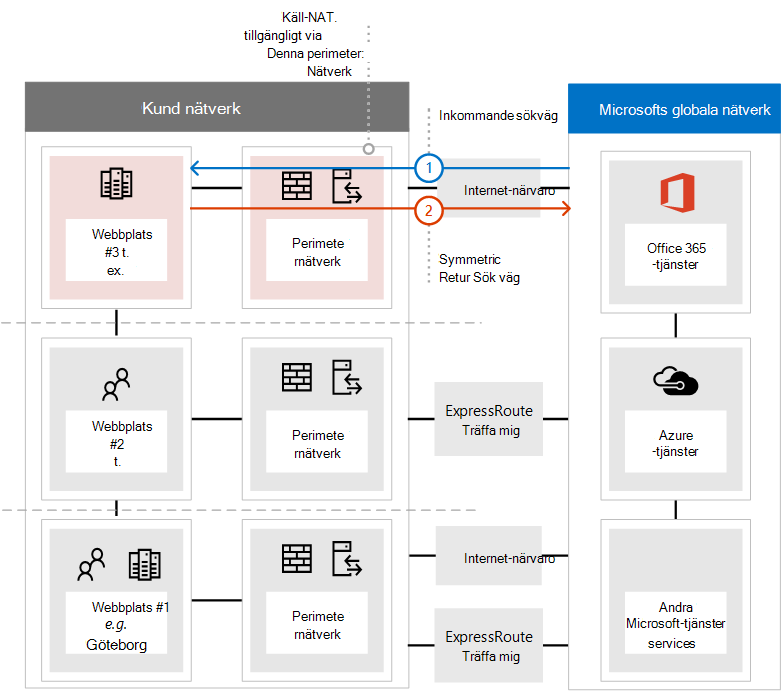
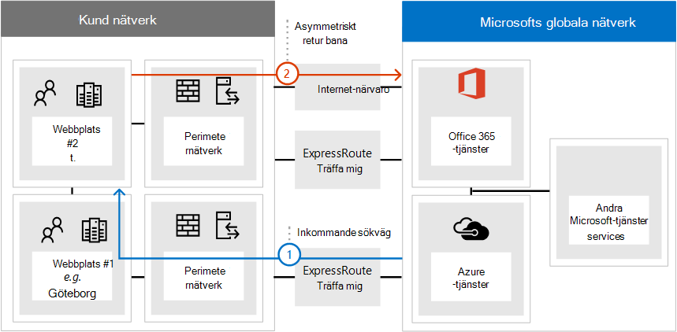
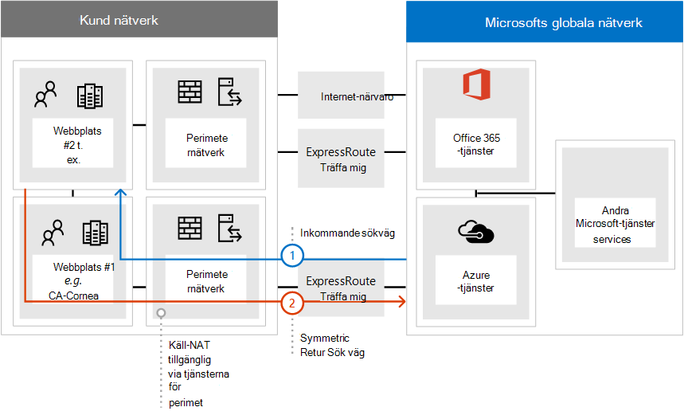

# <a name="implementing-expressroute-for-office-365"></a>Implementera ExpressRoute för Office 365

*Den här artikeln gäller både Microsoft 365 Enterprise och Office 365 Enterprise.*

ExpressRoute för Office 365 ger en alternativ cirkulations väg till många Internet Facing Office 365-tjänster. Arkitekturen i ExpressRoute för Office 365 är baserad på annonsering av offentliga IP-prefix för Office 365-tjänster som redan är tillgängliga via Internet till etablerade ExpressRoute-kretsar för efterföljande omdistribution av dessa IP-prefix till nätverket. Med ExpressRoute kan du effektivt aktivera flera olika vägar för routning via Internet och genom ExpressRoute för många Office 365-tjänster. Det här läget för routning i nätverket kan representera en väsentlig ändring av hur den interna nätverkets topologi är utformad.
  
 **Status:** Fullständig guide v2
  
Du måste noggrant planera dina ExpressRoute för implementering av Office 365 för att få plats med nätverks komplexare att ha routning tillgängliga via både en dedikerad krets med vägar som injiceras i kärn nätverket och Internet. Om du och ditt team inte utför detaljerad planering och testning i den här guiden, finns det en hög risk för återkommande eller en total förlust av anslutning till Office 365-tjänster när ExpressRoute-kretsen är aktive rad.
  
För att du ska kunna genomföra en lyckad implementering måste du analysera infrastruktur kraven, gå igenom detaljerad nätverks utvärdering och-utformning, noggrant planera installationen på ett stadium och kontrollerat sätt och skapa en detaljerad verifierings-och test plan. För en stor, distribuerad miljö är den inte ovanligt gemensam för att se implementeringar som sträcker sig över flera månader. Den här guiden är avsedd att hjälpa dig att planera.
  
En stor lyckad distribution kan ta sex månader att planera och inkludera ofta grupp medlemmar från många områden i organisationen, inklusive nätverks-, brand Väggs-och proxyserver administratörer, Office 365-administratörer, säkerhet, slutanvändarens support, projekt hantering och direktörens finansiering. Investeringen i planerings processen minskar sannolikheten för att distributions fel uppstår som leder till nertid eller komplex och dyrt fel sökning.
  
Vi förväntar oss att följande förutsättningar måste slutföras innan implementerings guiden startas.
  
1. Du har slutfört en nätverks utvärdering för att kontrol lera om ExpressRoute är rekommenderad och godkänd.

2. Du har valt en ExpressRoute nät tjänst leverantör. Få information om [ExpressRoute-partners och peering-platser](https://azure.microsoft.com/documentation/articles/expressroute-locations/).

3. Du har redan läst och förstått [ExpressRoute dokumentation](https://azure.microsoft.com/documentation/services/expressroute/) och det interna nätverket kan uppfylla ExpressRoute för att det ska gå att avsluta.

4. Ditt team har läst alla offentliga råd och dokumentation på [https://aka.ms/expressrouteoffice365](https://aka.ms/expressrouteoffice365) , [https://aka.ms/ert](https://aka.ms/ert) och bevakar [Azure ExpressRoute for Office 365-utbildning](https://channel9.msdn.com/series/aer) på kanal 9 för att få en förståelse för viktiga tekniska uppgifter som:

      - Internet-samband för SaaS-tjänster.

      - Undvik asymmetriska vägar och hantera komplex routning.

      - Så här införlivar du kontroller för perimeter-säkerhet, tillgänglighet och program nivå.

## <a name="begin-by-gathering-requirements"></a>Börja med att samla in krav
<a name="requirements"> </a>

Börja med att bestämma vilka funktioner och tjänster som du planerar att använda i organisationen. Du måste bestämma vilka funktioner i de olika Office 365-tjänsterna som ska användas och vilka platser i nätverket som ska vara värd för personer som använder de funktionerna. Med en katalog med scenarier måste du lägga till de nätverks egenskaper som krävs för var och en av dessa scenarier. till exempel inkommande och utgående nätverks trafik flöden och om Office 365-slutpunkter är tillgängliga via ExpressRoute eller inte.
  
Så här samlar du in organisationens krav:
  
- Katalogisera den inkommande och utgående nätverks trafiken för de Office 365-tjänster som organisationen använder. Gå till sidan Office 365 URL: er och IP-adressintervall för att beskriva de flöden som olika Office 365-scenarier kräver.

- Samla in dokumentation om befintlig nätverkstopologi med information om ditt interna WAN-stamnät och-topologi, anslutning av satellit webbplatser, senaste mil anslutnings barhet för nätverk, routning till utgående punkter och proxytjänster.

  - Identifiera inkommande tjänst slut punkter i nätverks diagrammen som Office 365 och andra Microsoft-tjänster ansluter till, med både Internet och föreslagna ExpressRoute.

  - Identifiera alla geografiska användar platser och WAN-anslutning mellan platser och vilka platser som för närvarande har ett utgång till Internet och vilka platser som föreslås för att få en utgång på en ExpressRoute-peering-plats.

  - Identifiera alla anslags enheter, till exempel proxyservrar, brand väggar och så vidare, samt koppla deras relationer till flöden via Internet och ExpressRoute.

  - Dokument som slutanvändare kommer åt Office 365-tjänster via Direct routing eller indirekt tillämpningsproxy för både Internet-och ExpressRoute-flöden.

- Lägg till platsen för klient organisationen och mötes platser till nätverks diagrammet.

- Uppskatta de förväntade och observerade egenskaperna för nätverks prestanda och svars tid från de större användar platserna till Office 365. Kom ihåg att Office 365 är en global och distribuerad uppsättning tjänster och att användarna ansluter till platser som kan skilja sig från deras klient organisation. Av den anledningen rekommenderas du att mäta och optimera svars tiden mellan användaren och den närmaste delen av Microsoft globalt nätverk via ExpressRoute och Internet anslutningar. Du kan använda resultaten från nätverks utvärderingen för att hjälpa till med den här uppgiften.

- Lista företags nätverks säkerhet och krav för hög tillgänglighet som måste uppfyllas med den nya ExpressRoute-anslutningen. Till exempel, hur fortsätter användare att få till gång till Office 365 i händelse av att det inte går att ta slut eller ExpressRoute.

- Dokument som inkommande och utgående Office 365-nätverks flöden använder Internet-sökvägen och som använder ExpressRoute. De specifika geografiska platserna för dina användare och information om din lokala nätverkstopologi kan kräva att planen är en annan plats än en användare.

### <a name="catalog-your-outbound-and-inbound-network-traffic"></a>Katalogisera din utgående och inkommande nätverks trafik
<a name="trafficCatalog"> </a>

För att minimera Routning och annan nätverks komplexitet rekommenderar vi att du endast använder ExpressRoute för Office 365 för de nätverks trafik flöden som krävs för att gå över en dedikerad anslutning på grund av myndighets krav eller som resultat av nätverks utvärdering. Dessutom rekommenderar vi att du Stage ExpressRoute Routing and trafik flöden för utgående och inkommande nätverk som olika faser i implementerings projektet. Distribuera ExpressRoute för Office 365 för bara den användare som har initierat utgående nätverks trafik flöden och lämna inkommande nätverks trafik flöden via Internet, kan hjälpa till att styra ökningen av Top ologiska komplexitet och riskerna med att introducera fler möjligheter för asymmetrisk cirkulation.
  
Nätverks trafik katalogen bör innehålla listor över alla inkommande och utgående nätverks anslutningar som du kommer att ha mellan det lokala nätverket och Microsoft.
  
- Utgående nätverks trafik flöden är alla scenarier där en anslutning initieras från din lokala miljö, till exempel från interna klienter eller servrar, med Microsoft-tjänsternas mål. Dessa anslutningar kan vara direkt till Office 365 eller indirekt, till exempel när anslutningen går via proxyservrar, brand väggar och andra nätverks enheter i sökvägen till Office 365.

- Inkommande nätverks trafik flöden är alla scenarier där en anslutning initieras från Microsoft Cloud till en lokal värd. Dessa anslutningar måste vanligt vis gå igenom brand väggar och annan säkerhets infrastruktur som kund säkerhets policyn kräver för externt upparbetade flöden.

Läs avsnittet om att **cirkulera symmetri** delen av artikeln [routning med ExpressRoute för Office 365](https://support.office.com/article/Routing-with-ExpressRoute-for-Office-365-e1da26c6-2d39-4379-af6f-4da213218408) för att avgöra vilka tjänster som ska skicka inkommande trafik och leta efter den markerade **ExpressRoute för Office 365** i referens artikeln för [Office 365-slut punkter](https://support.office.com/article/Office-365-URLs-and-IP-address-ranges-8548a211-3fe7-47cb-abb1-355ea5aa88a2) för att fastställa resten av anslutnings informationen.
  
För varje tjänst som kräver en utgående anslutning ska du beskriva den planerade anslutningen för tjänsten inklusive nätverks dirigering, proxykonfiguration, paket inspektion och bandbredds behov.
  
För varje tjänst som kräver en inkommande anslutning behöver du ytterligare information. Servrar i Microsofts moln etablerar anslutningar till ditt lokala nätverk. för att se till att anslutningarna görs korrekt ska du beskriva alla aspekter av den här anslutningen, inklusive; de offentliga DNS-posterna för de tjänster som kommer att acceptera dessa inkommande anslutningar, de CIDR-formaterade IPv4-IP-adresserna, vilken ISP-utrustning är involverad och hur inkommande NAT eller käll-NAT hanteras för dessa anslutningar.
  
Inkommande anslutningar bör ses över oavsett om de är anslutna via Internet eller ExpressRoute för att säkerställa att asymmetrisk routning inte har införts. I vissa fall måste lokala slut punkter som Office 365-tjänsterna initiera inkommande anslutningar till kanske också vara tillgängliga av andra Microsoft-tjänster än Microsoft och andra leverantörer. Det är ytterst viktigt att aktivera ExpressRoute-routning till de här tjänsterna för Office 365 inte fungerar i andra situationer. I många fall kan kunder behöva genomföra specifika ändringar i deras interna nätverk, till exempel source baserad NAT, för att säkerställa att inkommande flöden från Microsoft förblir symmetriska efter ExpressRoute.
  
Här är ett exempel på vilken detalj nivå som krävs. I det här fallet skickar Exchange hybrid till det lokala systemet via ExpressRoute.

|**Egenskapen Connection**|**Värde**|
|:-----|:-----|
|**Nätverks trafik riktning** <br/> |Inkommande  <br/> |
|**Tjänst** <br/> |Exchange-hybrid  <br/> |
|**Offentlig Office 365-slut punkt (källa)** <br/> |Exchange Online (IP-adresser)  <br/> |
|**Offentlig lokal slut punkt (mål)** <br/> |5.5.5.5  <br/> |
|**Offentlig DNS-post (Internet)** <br/> |Autodiscover.contoso.com  <br/> |
|**Kommer den här lokala slut punkten att användas i andra (icke-Office 365) Microsoft Services** <br/> |Nej  <br/> |
|**Kommer denna lokala slut punkt att användas av användare/datorer på Internet** <br/> |Ja  <br/> |
|**Interna system som publiceras genom offentliga slut punkter** <br/> |Klient åtkomst roll för Exchange Server (lokal) 192.168.101, 192.168.102, 192.168.103  <br/> |
|**IP-annonsering för den offentliga slut punkten** <br/> |**Till Internet**: 5.5.0.0/16  <br/> **Till ExpressRoute**: 5.5.5.0/24  <br/> |
|**Kontroller för säkerhet/perimeter** <br/> |**Internet Sök väg**: DeviceID_002  <br/> **ExpressRoute sökväg**: DeviceID_003  <br/> |
|**Hög tillgänglighet** <br/> |Aktiv/aktiv över 2 geo-redundanta  <br/> ExpressRoute kretsar – Chicago och Borås  <br/> |
|**Bana för symmetri kontroll** <br/> |**Metod**: käll-NAT  <br/> **Internet Sök väg**: inkommande anslutningar för käll-NAT till 192.168.5.5  <br/> |**ExpressRoute sökväg**: käll-NAT-anslutningar till 192.168.1.0 (Chicago) och 192.168.2.0 (Borås)  <br/> |

Här är ett exempel på en tjänst som endast är avgående:

|**Egenskapen Connection**|**Värde**|
|:-----|:-----|
|**Nätverks trafik riktning** <br/> |Gående  <br/> |
|**Tjänst** <br/> |SharePoint Online  <br/> |
|**Lokal slut punkt (källa)** <br/> |Användar arbets Station  <br/> |
|**Offentlig Office 365-slutpunkt (mål)** <br/> |SharePoint Online (IP-adresser)  <br/> |
|**Offentlig DNS-post (Internet)** <br/> |\*. sharepoint.com (och ytterligare FQDN)  <br/> |
|**CDN-referenser** <br/> |cdn.sharepointonline.com (och ytterligare FQDN)-IP-adresser som är förbehållna av CDN-leverantörer)  <br/> |
|**IP-annonsering och NAT används** <br/> |**Internet Sök väg/källa NAT**: 1.1.1.0/24  <br/> **ExpressRoute sökväg/källa NAT**: 1.1.2.0/24 (Chicago) och 1.1.3.0/24 (Borås)  <br/> |
|**Anslutnings metod** <br/> |**Internet**: via Layer 7 proxy (PAC-fil)  <br/> **ExpressRoute**: direkt routning (ingen proxy)  <br/> |
|**Kontroller för säkerhet/perimeter** <br/> |**Internet Sök väg**: DeviceID_002  <br/> **ExpressRoute sökväg**: DeviceID_003  <br/> |
|**Hög tillgänglighet** <br/> |**Internet Sök väg**: Redundant Internet utgång  <br/> **ExpressRoute**: aktiv/aktiv "het potatis"-routning över 2 geo-redundanta ExpressRoute-kretsar – Chicago och Borås  <br/> |
|**Bana för symmetri kontroll** <br/> |**Metod**: käll-NAT för alla anslutningar  <br/> |

### <a name="your-network-topology-design-with-regional-connectivity"></a>Din design för nätverks miljön med lokal anslutning
<a name="topology"> </a>

När du förstår tjänsterna och deras associerade nätverks trafik flöden kan du skapa ett nätverks diagram som innehåller de här anslutnings kraven och illustrerar de ändringar som du ska göra för att använda ExpressRoute för Office 365. Diagrammet bör innehålla:
  
1. Alla användar platser där Office 365 och andra tjänster kommer att nås från.

2. Alla utgångs punkter för Internet och ExpressRoute.

3. Alla utgående och inkommande enheter som hanterar anslutningar i och ut ur nätverket, inklusive routrar, brand väggar, tillämpningsproxy och intrång.

4. Interna destinationer för all inkommande trafik, till exempel interna ADFS-servrar som accepterar anslutningar från ADFS Web Application Proxy-servrar.

5. Katalog över alla IP-undernät som kommer att annonseras

6. Identifiera varje plats där folk kommer åt Office 365 från och visar de platser som är Mötes-och ExpressRoute.

7. Platser och delar av den interna nätverk sto pol Ogin där Microsoft-IP-prefix som lärts från ExpressRoute kommer att accepteras, filtreras och spridas till.

8. Nätverk sto pol Ogin ska illustrera den geografiska platsen för varje nätverks segment och hur det ansluts till Microsoft-nätverket via ExpressRoute och/eller Internet.

I diagrammet nedan visas var och en av platserna där användarna använder Office 365 tillsammans med inkommande och utgående routing-annonser till Office 365.
  

  
För utgående trafik kan folk komma åt Office 365 på ett av tre sätt:
  
1. Via en Mötes plats i Nord Amerika för personer i Kalifornien.

2. Via en Mötes plats i Hongkong för personer i Hongkong.

3. Via Internet i Bangladesh där det finns färre personer och ingen ExpressRoute-krets etablerad.


  
På samma sätt returnerar inkommande nätverks trafik från Office 365 på ett av tre olika vis:
  
1. Via en Mötes plats i Nord Amerika för personer i Kalifornien.

2. Via en Mötes plats i Hongkong för personer i Hongkong.

3. Via Internet i Bangladesh där det finns färre personer och ingen ExpressRoute-krets etablerad.


  
### <a name="determine-the-appropriate-meet-me-location"></a>Fastställ lämplig plats för möte

Valet av mötes platser, som är den fysiska platsen där ExpressRoute-kretsen ansluter nätverket till Microsoft-nätverket, påverkas av platserna där folk kommer att få åtkomst till Office 365 från. Som ett SaaS-erbjudande fungerar Office 365 inte under IaaS eller PaaS regionala modellen på samma sätt som Azure gör det. I stället är Office 365 en distribuerad uppsättning samarbets tjänster, där användarna kan behöva ansluta till slut punkter i flera data Center och regioner, vilka kanske inte nödvändigt vis finns på samma plats eller region där användarens klient organisation är värd.
  
Det innebär den viktigaste övervägandeheten du måste göra när du väljer Mötes platser för ExpressRoute för Office 365 är den plats där personerna i din organisation ansluter från. Den allmänna rekommendationen för optimal Office 365-anslutning är implementera routning så att användare som begär Office 365-tjänster kan utnyttjas i Microsoft-nätverket via den kortaste nätverks Sök vägen, så ofta kallas det för "Het"-routning. Om till exempel de flesta Office 365-användare finns på en eller två platser väljer du Mötes platser som är placerade i närmaste närhet till de användare som skapar den optimala designen. Om ditt företag har stora användar populationer i många olika områden kanske du vill överväga att ha flera ExpressRoute-kretsar och möta platser. För vissa av dina användar platser är den korta/mest optimala vägen till Microsoft-nätverk och Office 365, kanske inte genom ditt interna WAN-och ExpressRoute-nummer, men via Internet.
  
Ofta finns det flera Mötes platser som kan väljas inom en region med relativa närhet till användarna. Fyll i följande tabell för att hitta dina beslut.

|**Planerade ExpressRoute Mötes platser i Kalifornien och Göteborg**||
|:-----|:-----|
|Plats  <br/> |Antal personer  <br/> |Förväntad svars tid till Microsoft-nätverk via Internet  <br/> |Förväntad svars tid till Microsoft-nätverket via ExpressRoute  <br/> |
|Los Angeles  <br/> |10 000  <br/> |~ 15ms  <br/> |~ 10ms (via Silicon dal)  <br/> |
|Washington DC  <br/> |15 000  <br/> |~ 20ms  <br/> |~ 10ms (via New York)  <br/> |
|Dallas  <br/> |5 000  <br/> |~ 15ms  <br/> |~ 40ms (via New York)  <br/> |

När den globala nätverks arkitekturen visar Office 365-regionen, ExpressRoute nätverks tjänst leverantörens platser, och antalet personer efter plats har utvecklats, kan den användas för att identifiera om en eventuell optimering kan göras. Den kan också visa globala fäst nätverks anslutningar där trafik leder till en avlägsen plats för att få plats för Mötes platsen. Om en fäst på det globala nätverket upptäcks bör du åtgärda det innan du fortsätter. Sök antingen efter en annan Mötes plats, eller Använd selektiva Internet översikten avsluts punkter för att undvika fäst.
  
Det första diagrammet visar ett exempel på en kund med två fysiska platser i Nord Amerika. Du kan se information om Office-platser, Office 365-klient platser och flera olika alternativ för ExpressRoute-platser. I det här exemplet har Kunden valt en Mötes plats utifrån två principer, i ordning:
  
1. Nära närhet till personer i organisationen.

2. Närmast i närhet till ett Microsoft-datacenter där Office 365 finns på en värd.


  
Om du expanderar det här konceptet lite mer kan det andra diagrammet visa ett exempel på flera nationella kunder med liknande information och besluts funktion. Den här kunden har ett litet kontor i Bangladesh med bara en liten grupp med tio personer som fokuserar på att växa deras utrymme i regionen. Det finns en plats i Chennai och ett Microsoft-datacenter med Office 365 som finns på Chennai, så en Mötes plats skulle vara obegriplig. men för tio personer är kostnaden för den extra kretsen burdensome. När du tittar på nätverket måste du ta reda på om svars tiden för att skicka nätverks trafiken i nätverket är effektivare än att utnyttja kapitalet för att skaffa en annan ExpressRoute-krets.
  
Alternativt kan de tio personerna i Bangladesh få bättre prestanda med sin nätverks trafik via Internet till Microsoft-nätverket än de som står i de inledande diagrammen och återskapas nedan.
  

  
## <a name="create-your-expressroute-for-office-365-implementation-plan"></a>Skapa en ExpressRoute för Office 365 implementations plan
<a name="implementation"> </a>

Din implementerings plan bör omfatta både teknisk information om hur du konfigurerar ExpressRoute och hur du konfigurerar all annan infrastruktur på ditt nätverk, till exempel följande.
  
- Planera vilka tjänster som delas mellan ExpressRoute och Internet.

- Planera för bandbredd, säkerhet, hög tillgänglighet och redundans.

- Designa inkommande och utgående routning, inklusive korrekta Dirigerings Sök vägar för olika platser

- Bestäm hur långt ExpressRoute-vägar som ska annonseras i nätverket och vad är mekanismen för klienter att välja Internet-eller ExpressRoute-sökväg; till exempel direkt routning eller programproxy.

- Planera ändringar av DNS-poster, inklusive poster för utloggnings [principer](https://technet.microsoft.com/library/dn789058%28v=exchg.150%29.aspx) .

- Planera NAT-strategi inklusive utgående och inkommande käll-NAT.

### <a name="plan-your-routing-with-both-internet-and-expressroute-network-paths"></a>Planera routing med både Internet-och ExpressRoute-nätverks Sök vägar
<a name="paths"> </a>

- För din första distribution rekommenderas alla inkommande tjänster, till exempel inkommande e-post eller hybrid anslutning, till Internet.

- Abonnemang slutanvändarens LAN-routing, till exempel att [Konfigurera en PAC/WPAD-fil](https://aka.ms/manageo365endpoints), standard väg, proxyserver och en BGP-cirkulations annonsering.

- Planera perimeter-routning, inklusive proxyservrar, brand väggar och Cloud-proxyservrar.

### <a name="plan-your-bandwidth-security-high-availability-and-failover"></a>Planera din bandbredd, säkerhet, hög tillgänglighet och redundans
<a name="availability"> </a>

Skapa en plan för bandbredd som behövs för varje huvud arbets belastning för Office 365. Separat Beräknad bandbredd för Exchange Online, SharePoint Online och Skype för företag – online. Du kan använda de uppskattnings kalkylatorer vi har angivit för Exchange Online och Skype för företag som start plats; ett pilot test med ett representativt urval av användar profiler och platser måste emellertid vara till för att kunna förstå behoven hos din organisation.
  
Lägg till hur säkerheten hanteras för varje Internet-och ExpressRoute utgångs läge i ditt abonnemang, kom ihåg alla ExpressRoute-anslutningar till Office 365 använda offentlig peering och måste ändå skyddas enligt företagets säkerhets principer för att ansluta till externa nätverk.
  
Lägg till information i planen om vilka personer som kommer att påverkas av vilken typ av avbrott och hur de kan arbeta med full kapacitet på det enklaste sättet.
  
#### <a name="plan-bandwidth-requirements-including-skype-for-business-requirements-on-jitter-latency-congestion-and-headroom"></a>Planera bandbredds krav inklusive Skype för företag-krav på Darr, svars tid, överbelastning och utrymme
  
Skype för företag – Online har också särskilda nätverks krav som är detaljerade i artikeln [Media kvalitet och nätverks anslutnings prestanda i Skype för företag – Online](https://support.office.com/article/Media-Quality-and-Network-Connectivity-Performance-in-Skype-for-Business-Online-5fe3e01b-34cf-44e0-b897-b0b2a83f0917).
  
Läs avsnittet **bandbredds planering för Azure ExpressRoute** i [nätverks planering med ExpressRoute för Office 365](https://support.office.com/article/Network-planning-with-ExpressRoute-for-Office-365-103208f1-e788-4601-aa45-504f896511cd).
  
När du utför en bandbredds utvärdering med pilot användarna kan du använda vår guide. [Prestanda justering för Office 365 med bas linjer och prestanda historik](https://support.office.com/article/Office-365-performance-tuning-using-baselines-and-performance-history-1492cb94-bd62-43e6-b8d0-2a61ed88ebae).
  
#### <a name="plan-for-high-availability-requirements"></a>Planera för krav på hög tillgänglighet
  
Skapa en plan för hög tillgänglighet för att passa dina behov och införliva detta i det uppdaterade miljöträds diagrammet. Läs avsnittet **hög tillgänglighet och redundans med Azure ExpressRoute** i [nätverks planering med ExpressRoute för Office 365](https://support.office.com/article/Network-planning-with-ExpressRoute-for-Office-365-103208f1-e788-4601-aa45-504f896511cd).
  
#### <a name="plan-for-network-security-requirements"></a>Planera för nätverks säkerhets krav
  
Skapa en plan för att uppfylla nätverks säkerhets kraven och infoga detta i det uppdaterade miljötopologin. Läs avsnittet **använda säkerhets kontroller i Azure ExpressRoute för office 365-scenarier** i [nätverks planering med ExpressRoute för Office 365](https://support.office.com/article/Network-planning-with-ExpressRoute-for-Office-365-103208f1-e788-4601-aa45-504f896511cd).
  
### <a name="design-outbound-service-connectivity"></a>Designa anslutningar för utgående tjänst
<a name="outbound"> </a>

ExpressRoute för Office  *365 har nätverks*  krav som kanske inte känns igen. De IP-adresser som representerar användarna och nätverken till Office 365 och fungerar som käll slut punkter för utgående nätverks anslutningar till Microsoft måste uppfylla specifika krav nedan.
  
1. Slut punkterna måste vara offentliga IP-adresser som är registrerade på ditt företag eller till operatör som tillhandahåller ExpressRoute anslutning till dig.

2. Slut punkterna måste annonseras till Microsoft och verifieras/godkänns av ExpressRoute.

3. Slut punkterna får inte annonseras till Internet med samma eller mer önskat routing Metric.

4. Slut punkterna får inte användas för anslutning till Microsoft-tjänster som inte har kon figurer ATS via ExpressRoute.

Om ditt nätverk inte uppfyller dessa krav beror det på en hög risk för användarna att de har problem med anslutningen till Office 365 och andra Microsoft-tjänster på grund av att de svarta håll eller Asymmetric routing är på väg. Detta inträffar när förfrågningar till Microsoft-tjänster routas över ExpressRoute, men svar dirigeras tillbaka via Internet, eller vice versa, och svaren avgränsas av nätverks enheter som brand väggar.
  
Den vanligaste metoden du kan använda för att uppfylla ovanstående krav är att använda käll-NAT, antingen implementerat som en del av ditt nätverk eller tillhandahålls av din ExpressRoute-operatör. Med källans NAT kan du Visa information och privata IP-adresser för ditt Internet-nätverk från ExpressRoute och; tillsammans med korrekta IP-vägs annonser kan du använda en enkel mekanism för att säkerställa vägens symmetri. Om du använder tillstånds lösa nätverks enheter som är specifika för ExpressRoute peering locations måste du implementera separata NAT-pooler för varje ExpressRoute-peering för att säkerställa Path-symmetrin.
  
Läs mer om [specifikationerna för ExpressRoute](https://azure.microsoft.com/documentation/articles/expressroute-nat/).
  
Lägg till ändringarna för utgående anslutning till nätverks Topology-diagrammet.
  
### <a name="design-inbound-service-connectivity"></a>Designa inkommande tjänst anslutningar
<a name="inbound"> </a>

De flesta företags Office 365-distributioner förutsätter en del av inkommande anslutnings barhet från Office 365 till lokala tjänster, till exempel för Exchange-, SharePoint-och Skype för företag-hybrid scenarier, överflyttningar och inloggningsautentisering med ADFS-infrastruktur. När ExpressRoute du aktiverar ytterligare en cirkulations Sök väg mellan det lokala nätverket och Microsoft för utgående anslutningar kan dessa inkommande anslutningar oavsiktligt påverkas av asymmetrisk routning, även om du tänker få dessa flöden att fortsätta använda Internet. Några av de säkerhets åtgärder som beskrivs nedan rekommenderas för att säkerställa att det inte påverkar Internetbaserade inkommande flöden från Office 365 till lokala system.
  
För att minimera risken för asymmetrisk routning för inkommande nätverks trafik flöden bör alla inkommande anslutningar använda käll-NAT innan de routas i nätverks segment som har ExpressRoute. Om de inkommande anslutningarna är tillåtna i ett nätverks segment med visning av ExpressRoute utan källa för källan kommer förfrågningar från Office 365 att komma in från Internet, men svaret på Office 365 gör att ExpressRoute nätverks Sök vägen tillbaka till Microsoft-nätverket, vilket orsakar asymmetrisk routning.
  
Du kan överväga något av följande implementerings mönster för att uppfylla detta krav:
  
1. Utför käll-NAT innan förfrågningar dirigeras till det interna nätverket med nätverks utrustning som brand väggar eller belastnings utjämning på sökvägen från Internet till lokala system.

2. Kontrol lera att ExpressRoute-vägar inte sprids till nätverks segmenten där inkommande tjänster, till exempel front servrar eller reverse proxy-system, hanterar Internet anslutningar.

Genom att manuellt redovisa de här scenarierna i ditt nätverk och behålla alla inkommande nätverks trafik flöden via Internet kan du minimera distributionen och drifts risken för asymmetrisk routning.
  
Det kan finnas fall där du kan välja att dirigera vissa inkommande flöden över ExpressRoute-anslutningar. I dessa fall kan du ta hänsyn till följande:
  
1. Office 365 kan bara rikta sig till lokala slut punkter som använder offentliga IP-adresser. Detta innebär att även om den lokala inkommande slut punkten endast visas för Office 365 via ExpressRoute, måste den ha en offentlig IP-associerad.

2. Alla DNS-namnmatchning som Office 365-tjänsterna utför för att lösa lokala slut punkter sker med offentlig DNS. Det innebär att du måste registrera FQDN för inkommande tjänst slut punkter till IP-mappningar på Internet.

3. För att ta emot inkommande nätverks anslutningar via ExpressRoute måste de offentliga IP-näten för dessa slut punkter annonseras till Microsoft via ExpressRoute.

4. Utvärdera dessa inkommande nätverks trafik flöden noggrant för att säkerställa att korrekta säkerhets-och nätverks kontroller tillämpas på dem enligt företagets säkerhets-och nätverks principer.

5. När dina lokala inkommande slut punkter annonseras till Microsoft over ExpressRoute blir ExpressRoute till slut punkterna för alla Microsoft-tjänster, inklusive Office 365. Det innebär att dessa slut punkts undernät endast får användas för kommunikation med Office 365-tjänster och inga andra tjänster i Microsoft Network. Annars kommer designen att orsaka asymmetrisk routning där inkommande anslutningar från andra Microsoft-tjänster föredrar att dirigera inkommande via ExpressRoute, medan retur Sök vägen använder Internet.

6. I händelse av att en ExpressRoute-krets eller mötets plats är nere måste du se till att de lokala inkommande slut punkterna fortfarande är tillgängliga för att acceptera begär Anden via en separat nätverks Sök väg. Det här kan innebära annonserings under nät för dessa slut punkter via flera ExpressRoute kretsar.

7. Vi rekommenderar att du använder käll-NAT för alla inkommande nätverks trafik flöden som går in i nätverket via ExpressRoute, särskilt om dessa flöden passerar nätverks enheter som brand väggar.

8. Vissa lokala tjänster, till exempel ADFS-Proxy eller Autodiscover för Exchange, kan ta emot inkommande förfrågningar från både Office 365-tjänster och användare från Internet. För de här förfrågningarna riktar sig Office 365 på samma FQDN som en användare begär via Internet. Om du tillåter inkommande användare från Internet till lokala slut punkter, samtidigt som Office 365-anslutningar för att använda ExpressRoute, representerar en betydande nätverks komplexitet. De flesta kunder som implementerar sådana komplexa scenarier via ExpressRoute rekommenderas inte på grund av användnings överväganden. Denna extra overhead inkluderar, hanterar risker för asymmetrisk Routning och kräver att du ska hantera annonsering och policyer för flera olika dimensioner.

### <a name="update-your-network-topology-plan-to-show-how-you-would-avoid-asymmetric-routes"></a>Uppdatera ditt nätverkstopologi för att visa hur du undviker asymmetriska vägar
<a name="asymmetric"> </a>

Du vill undvika asymmetrisk routning för att säkerställa att personer i organisationen smidigt kan använda Office 365 och andra viktiga tjänster på Internet. Det finns två vanliga konfigurationer som kunder kan orsaka asymmetrisk routning. Nu är det en bra idé att granska nätverks konfigurationen som du planerar att använda och kontrol lera om något av de här alternativen för asymmetrisk routning kan finnas.
  
För att börja ska vi undersöka några olika situationer som är kopplade till följande nätverks diagram. I det här diagrammet finns alla servrar som tar emot inkommande förfrågningar, till exempel ADFS eller lokala hybrid servrar, i det nya Jersey Data Center och annonseras till Internet.
  
1. Även om perimeternätverket är säkert är det ingen käll-NAT för inkommande förfrågningar.

2. Servrarna i det nya Jersey Data Center kan se både Internet-och ExpressRoute-vägar.


  
Vi har även förslag på hur du kan åtgärda dem.
  
#### <a name="problem-1-cloud-to-on-premises-connection-over-the-internet"></a>Problem 1: moln till lokal anslutning via Internet
  
I följande diagram visas den asymmetriska nätverks Sök vägen som används när din nätverks konfiguration inte tillhandahåller NAT för inkommande förfrågningar från Microsoft Cloud via Internet.
  
1. Den inkommande begäran från Office 365 hämtar IP-adressen för den lokala slut punkten från den offentliga DNS-tjänsten och skickar förfrågan till ditt perimeternätverk.

2. I den här konfigurationen är det ingen käll-NAT som är konfigurerad eller tillgänglig i perimeternätverket där trafiken skickas och som kan resultera i att den faktiska käll-IP-adressen används som retur destination.

  - Servern i nätverket dirigerar retur trafiken till Office 365 via vilken tillgänglig ExpressRoute-nätverksanslutning som helst.

  - Resultatet är en asymmetrisk sökväg för det flödet till Office 365, vilket resulterar i en trasig anslutning.


  
##### <a name="solution-1a-source-nat"></a>Lösning 1a: käll-NAT
  
Om du lägger till en käll-NAT till den inkommande begäran löses detta felkonfigurerade nätverk. I det här diagrammet:
  
1. Den inkommande begäran fortsätter att ansättas genom det nya Jerseys perimeternätverk. Denna tids källa är tillgänglig.

2. Svaret från servern dirigeras om till den IP som är kopplad till käll-NAT i stället för den ursprungliga IP-adressen, vilket leder till att svaret returneras längs samma nätverks Sök väg.


  
##### <a name="solution-1b-route-scoping"></a>Lösning 1b: vägens omfattning
  
Alternativt kan du välja att inte tillåta att ExpressRoute BGP-prefix annonseras, och tar bort den alternativa nätverks Sök vägen för dessa datorer. I det här diagrammet:
  
1. Den inkommande begäran fortsätter att ansättas genom det nya Jerseys perimeternätverk. Den här gången är de prefix som annonseras från Microsoft via ExpressRoute-kretsen inte tillgängliga för det nya Jersey Data Center.

2. Svaret från servern dirigeras om till den IP som är kopplad till den första IP-adressen via den enda tillgängliga vägen, vilket leder till att svaret returneras längs samma nätverks Sök väg.


  
#### <a name="problem-2-cloud-to-on-premises-connection-over-expressroute"></a>Problem 2: moln till lokal anslutning via ExpressRoute
  
I följande diagram visas den asymmetriska nätverks Sök vägen som används när din nätverks konfiguration inte tillhandahåller NAT för inkommande förfrågningar från Microsoft Cloud via ExpressRoute.
  
1. Den inkommande begäran från Office 365 hämtar IP-adressen från DNS och skickar begäran till perimeternätverket.

2. I den här konfigurationen är det ingen käll-NAT som är konfigurerad eller tillgänglig i perimeternätverket där trafiken skickas och som kan resultera i att den faktiska käll-IP-adressen används som retur destination.

  - Datorn i nätverket dirigerar retur trafiken till Office 365 via vilken tillgänglig ExpressRoute-nätverksanslutning som helst.

  - Resultatet är en asymmetrisk anslutning till Office 365.


  
##### <a name="solution-2-source-nat"></a>Lösning 2: käll-NAT
  
Om du lägger till en käll-NAT till den inkommande begäran löses detta felkonfigurerade nätverk. I det här diagrammet:
  
1. Den inkommande begäran fortsätter att komma in i New York-data centrets perimeternätverk. Denna tids källa är tillgänglig.

2. Svaret från servern dirigeras om till den IP som är kopplad till käll-NAT i stället för den ursprungliga IP-adressen, vilket leder till att svaret returneras längs samma nätverks Sök väg.


  
### <a name="paper-verify-that-the-network-design-has-path-symmetry"></a>Kontrol lera att nätverks utformningen har Path-symmetri

I det här läget måste du kontrol lera att din implementerings plan erbjuder flödes symmetrier för de olika scenarier där du använder Office 365. Du identifierar den specifika nätverks väg som ska tas med när en person använder olika funktioner i tjänsten. Från det lokala nätverket och WAN-routning, till gräns enheterna, till anslutnings vägen; ExpressRoute eller Internet och på anslutningen till slut punkten.
  
Du måste göra detta för alla Office 365-nätverkstjänster som tidigare identifierats som tjänster som din organisation väljer.
  
Det gör det lättare att gå igenom vägar med andra personer. Förklara var de olika nätverks hoppen förväntas få sitt nästa väg och kontrol lera att du känner till cirkulations vägarna. Kom ihåg att ExpressRoute alltid ger en mer omfattning av vägen till Microsofts server-IP-adresser och ger den lägre väg kostnad än en Internet standard väg.
  
### <a name="design-client-connectivity-configuration"></a>Design konfiguration för klient anslutningar
<a name="asymmetric"> </a>


  
Om du använder en proxyserver för Internet bunden trafik måste du justera alla PAC eller klientens konfigurationsfiler för att säkerställa att klient datorerna i nätverket är korrekt konfigurerade för att skicka den ExpressRoute-trafik du vill ha till Office 365 utan att överföra din proxyserver och återstående trafik, inklusive viss Office 365-trafik, skickas till relevant proxy. Läs vår guide om hur du [hanterar Office 365-slutpunkter](https://aka.ms/manageo365endpoints) för PAC-filer.
  
> [!NOTE]
> Slut punkterna ändras ofta, så ofta som varje vecka. Du bör bara göra ändringar baserat på de tjänster och funktioner som organisationen har antagit för att minska antalet ändringar du behöver göra för att hålla dig uppdaterad. Var uppmärksam på **giltighets datumet** i RSS-flödet där ändringarna annonseras och en post bevaras av alla tidigare ändringar, att IP-adresser som annonseras kanske inte annonseras eller tas bort från annonseringen, fram till giltighets datum.
  
## <a name="build-your-deployment-and-testing-procedures"></a>Skapa distributions-och test procedurer
<a name="testing"> </a>

Din implementerings plan bör omfatta både testnings-och återställnings planering. Om din implementering inte fungerar som förväntat bör den vara utformad för att påverka det minsta antalet personer innan problem upptäcks. Nedan följer några principer som du bör tänka på.
  
1. Mellanlagra nätverks segmentet och användar tjänsten som ingick för att minimera störningar.

2. Planera för att testa vägar med traceroute och TCP Connect från en separat Internet ansluten värd.

3. Det är lämpligt att testa inkommande och utgående tjänster i ett isolerat test nätverk med ett test Office 365-klient organisation.

      - Det går också att testa ett produktions nätverk om kunden ännu inte använder Office 365 eller är i pilot.

      - Alternativt kan testningen utföras under ett produktions avbrott som endast är avsedda för test och övervakning.

      - Du kan också prova genom att kontrol lera vägarna för varje tjänst på varje Layer 3-router. Denna återuppringning bör bara användas om ingen annan testning är möjlig eftersom en brist på fysisk testning inför risker.

### <a name="build-your-deployment-procedures"></a>Bygga distributions procedurer

Distributions rutiner bör distribueras till små grupper med personer i stadier för att tillåta testning innan de distribueras till större grupper. Här följer flera olika sätt att mellanlagra distributionen av ExpressRoute.
  
1. Konfigurera ExpressRoute med Microsoft peering och skicka routing annonseringarna till en enda värd endast för testad testning.

2. Annonsera vägar till ExpressRoute nätverk till ett enda nätverks segment först och expandera väg annonser med nätverks segment eller region.

3. Om du distribuerar Office 365 för första gången använder du ExpressRoute nätverks distribution som pilot för ett fåtal personer.

4. Om du använder proxyservrar kan du alternativt konfigurera en testpac-fil så att ett litet antal personer kan ExpressRoute med testning och feedback innan du lägger till fler.

Din implementerings plan bör innehålla en lista över alla distributions rutiner som måste vidtas eller kommandon som måste användas för att distribuera nätverks konfigurationen. När nätverks avbrotts tiden tar emot alla ändringar som görs bör det vara från det skriftliga distributions abonnemang som har skrivits i förväg och förhands granskning. Se vår vägledning om tekniska inställningar för ExpressRoute.
  
- Uppdatera dina SPF TXT-poster om du har ändrat IP-adresser för alla lokala servrar som fortsätter att skicka e-post.

- Uppdatera DNS-poster för lokala servrar om du har ändrat IP-adresser för att få en ny NAT-konfiguration.

- Kontrol lera att du har abonnerat på RSS-feeden för Office 365-slutpunkts aviseringar om du vill behålla routning eller proxykonfiguration.

När din ExpressRoute-distribution är klar ska du utföra åtgärderna i test planen. Resultaten för varje procedur bör loggas. Du måste inkludera procedurer för att återgå till den ursprungliga produktions miljön i händelse av att test Plans resultaten visar att implementeringen inte lyckades.
  
### <a name="build-your-test-procedures"></a>Skapa test procedurer

Test förfarandena bör omfatta test för varje utgående och inkommande nätverks tjänst för Office 365 som kommer att använda ExpressRoute och som inte kommer att användas. Procedurerna bör omfatta testning från varje unikt nätverks plats, inklusive användare som inte är lokala i företags nätverket.
  
Här är några exempel på test aktiviteter:
  
1. Skicka ping från din lokala router till din nätverks operatör.

2. Verifiera att IP-adresserna för 500 + Office 365 och CRM Online tas emot av din lokala router.

3. Verifiera att din inkommande och utgående NAT fungerar mellan ExpressRoute och det interna nätverket.

4. Verifiera att vägar till din NAT annonseras från din router.

5. Verifiera att ExpressRoute har godkänt dina annonserade prefix.

      - Använd följande cmdlet för att verifiera peering-annonser:

      ```PowerShell
      Get-AzureRmExpressRouteCircuitRouteTable -DevicePath Primary -ExpressRouteCircuitName TestER -ResourceGroupName RG -PeeringType MicrosoftPeering
      ```

6. Verifiera att ditt offentliga NAT-IP-intervall inte annonseras till Microsoft via någon annan ExpressRoute eller offentlig Internet nätverks krets såvida det inte är en viss del av ett större område enligt föregående exempel.

7. ExpressRoute kretsar är Parada, validerar att båda BGP-sessionerna körs.

8. Konfigurera en enda värd på insidan av din NAT och Använd ping, Tracert och tcpping för att testa anslutningen via den nya kretsen till värd outlook.office365.com. Alternativt kan du använda ett verktyg som Wireshark eller Microsoft Network Monitor 3,4 på en speglad port för MSEE för att verifiera att du kan ansluta till den IP-adress som är kopplad till outlook.office365.com.

9. Testa program nivå funktioner för Exchange Online.

  - Testa att Outlook kan ansluta till Exchange Online och skicka/ta emot e-post.

  - Testa att Outlook kan använda online-läge.

  - Testa smartphone och skicka och ta emot.

10. Testa program nivå funktioner för SharePoint Online

  - Testa OneDrive för företag-synkroniseringsklienten.

  - Testa SharePoint Online-webbåtkomst.

11. Testa program nivå funktioner för samtal i Skype för företag:

  - Anslut till konferens samtal som autentiserad användare [inbjudna initierad av slutanvändaren].

  - Bjud in användare till konferens samtal [inbjudan skickad från MCU].

  - Anslut konferensen som anonym användare med hjälp av Skype för företag-webbprogrammet.

  - Delta i samtal från din kabel för kabelanslutna dator, IP-telefon och mobil enhet.

  - Samtal till federerad användare o samtal till PSTN-verifiering: samtalet är klart, samtals kvaliteten är acceptabel, anslutnings tiden accepteras.

  - Verifiera närvaro status för kontakter uppdateras för båda medlemmarna av klient organisationen och federerade användare.

### <a name="common-problems"></a>Vanliga problem

Asymmetrisk routning är det vanligaste implementations problemet. Här är några vanliga källor att leta efter:
  
- Använda en topologi för öppen eller platt nätverks dirigering utan käll-NAT.

- Använder inte SNAT för att dirigera inkommande tjänster via både Internet-och ExpressRoute-anslutningar.

- Testar inte inkommande tjänster på ExpressRoute i ett test nätverk innan de distribueras brett.

## <a name="deploying-expressroute-connectivity-through-your-network"></a>Distribuera ExpressRoute-anslutning via nätverket
<a name="testing"> </a>

Mellanlagra distributionen till en del av nätverket i taget, och successivt lyfta fram anslutningen till olika delar av nätverket med en plan för att återställa för varje nytt nätverks segment. Om distributionen är justerad med en Office 365-distribution kan du först distribuera till Office 365 pilot-användarna och sedan förlänga därifrån.
  
Först för testet och sedan för produktion:
  
- Kör distributions stegen för att aktivera ExpressRoute.

- Testa att se nätverks vägarna är som förväntat.

- Utför testning för varje inkommande och utgående tjänst.

- Återställ om du upptäcker eventuella problem.

### <a name="set-up-a-test-connection-to-expressroute-with-a-test-network-segment"></a>Konfigurera en test anslutning till ExpressRoute med ett test nätverks segment

Nu när du har den färdiga planen på papper är det dags att testa med en liten skala. I det här testet ska du upprätta en enda ExpressRoute-anslutning med Microsoft peering till ett testundernät i det lokala nätverket. Du kan konfigurera en [utvärderings version av Office 365](https://go.microsoft.com/fwlink/p/?LinkID=403802) med anslutning till och från test-undernätet och ta med alla utgående och inkommande tjänster som du kommer att använda i test under nätet. Konfigurera DNS för test nätverks segmentet och etablera alla inkommande och utgående tjänster. Kör test planen och se till att du känner till operationsföljden för varje tjänst och väg spridningen.
  
### <a name="execute-the-deployment-and-test-plans"></a>Köra distributions-och testplanerna

När du har slutfört de objekt som beskrivs ovan, kolla in de områden som är avslutade och kontrol lera att du och ditt team har granskat dem innan du utför distributions-och testplanerna.
  
- Lista över utgående och inkommande tjänster som är involverade i nätverks ändringen.

- Diagram över globala nätverks arkitektur som visar både Internet avslut-och ExpressRoute-platser.

- Nätverks flödes diagram som visar de olika nätverks Sök vägar som används för varje tjänst som distribueras.

- En distributions plan med instruktioner för att implementera ändringarna och återställa om det behövs.

- En test plan för testning av varje Office 365 och Network Service.

- Klar pappers validering av produktions flöden för inkommande och utgående tjänster.

- Ett test nätverks segment inklusive tillgänglighets testning.

Välj ett avbrott-fönster som är tillräckligt länge för att det ska gå genom hela distributions planen och test planen, har en tid som är tillgänglig för fel sökning och tid för att återställa igen om det behövs.
  
> [!CAUTION]
> På grund av det komplexa sättet att cirkulera via både Internet och ExpressRoute rekommenderar vi att ytterligare buffertstorlek läggs till i det här fönstret för att hantera fel sökning av komplex routing.
  
### <a name="configure-qos-for-skype-for-business-online"></a>Konfigurera QoS för Skype för företag – Online

Det krävs QoS för att få röst-och deltagar för Skype för företag – online. Du kan konfigurera QoS efter att du har säkerställt att den ExpressRoute nätverks anslutningen inte blockerar någon annan Office 365-tjänst åtkomst. Konfiguration för QoS beskrivs i artikeln [ExpressRoute och QoS i Skype för företag – Online](https://support.office.com/article/ExpressRoute-and-QoS-in-Skype-for-Business-Online-20c654da-30ee-4e4f-a764-8b7d8844431d) .
  
## <a name="troubleshooting-your-implementation"></a>Felsöka din implementering
<a name="troubleshooting"> </a>

Den första platsen att leta efter är att gå igenom stegen i den här implementerings guiden, som missats i din implementerings plan? Gå tillbaka och kör ytterligare mindre nätverks test om möjligt för att replikera felet och felsöka det där.
  
Identifiera vilka inkommande eller utgående tjänster som misslyckades under testningen. Få till gång till IP-adresser och undernät för var och en av de tjänster som inte fungerade. Gå vidare och gå till miljötopologin på papper och validera operationsföljden. Validera specifikt när ExpressRoute-routning annonseras för, testa att routning under avbrott om möjligt med spår.
  
Kör PSPing med en nätverks spårning till varje kund slut punkt och utvärdera käll-och mål-IP-adresser för att validera att de är som förväntat. Kör Telnet till en e-postvärd som du visar på port 25 och kontrol lera att SNAT döljer den ursprungliga käll-IP-adressen om detta är förväntat.
  
Tänk på att om du distribuerar Office 365 med en ExpressRoute-anslutning måste du kontrol lera att både nätverks konfigurationen för ExpressRoute är optimal och att du också har optimerat andra komponenter i nätverket, till exempel klient datorer. Förutom att använda den här planerings guiden för att felsöka de problem du kan ha missat, har vi också skrivit en [plan för prestanda fel sökning för Office 365](https://support.office.com/article/Performance-troubleshooting-plan-for-Office-365-e241e5d9-b1d8-4f1d-a5c8-4106b7325f8c) .
  
Här är en kort länk som du kan använda för att komma tillbaka: [https://aka.ms/implementexpressroute365](https://aka.ms/implementexpressroute365)
  
## <a name="related-topics"></a>Närliggande ämnen

[Utvärdering av Office 365 nätverks anslutning](assessing-network-connectivity.md)
  
[Azure ExpressRoute för Office 365](azure-expressroute.md)
  
[Hantera ExpressRoute för Office 365](managing-expressroute-for-connectivity.md)
  
[Routning med ExpressRoute för Office 365](routing-with-expressroute.md)
  
[Nätverks planering med ExpressRoute för Office 365](network-planning-with-expressroute.md)
  
[Använda BGP-communities i ExpressRoute för Office 365](bgp-communities-in-expressroute.md)
  
[Media kvalitet och nätverks anslutnings prestanda i Skype för företag – Online](https://support.office.com/article/5fe3e01b-34cf-44e0-b897-b0b2a83f0917)
  
[Optimera ditt nätverk för Skype för företag – Online](https://support.office.com/article/b363bdca-b00d-4150-96c3-ec7eab5a8a43)
  
[ExpressRoute och QoS i Skype för företag – Online](https://support.office.com/article/20c654da-30ee-4e4f-a764-8b7d8844431d)
  
[Samtals flöde med ExpressRoute](https://support.office.com/article/413acb29-ad83-4393-9402-51d88e7561ab)
  
[Prestanda justering för Office 365 med bas linjer och prestanda historik](performance-tuning-using-baselines-and-history.md)
  
[Plan för prestanda fel sökning för Office 365](performance-troubleshooting-plan.md)
  
[URL-adresser och IP-adressintervall för Office 365](https://support.office.com/article/8548a211-3fe7-47cb-abb1-355ea5aa88a2)
  
[Office 365-nätverks-och prestanda inställning](network-planning-and-performance.md)
