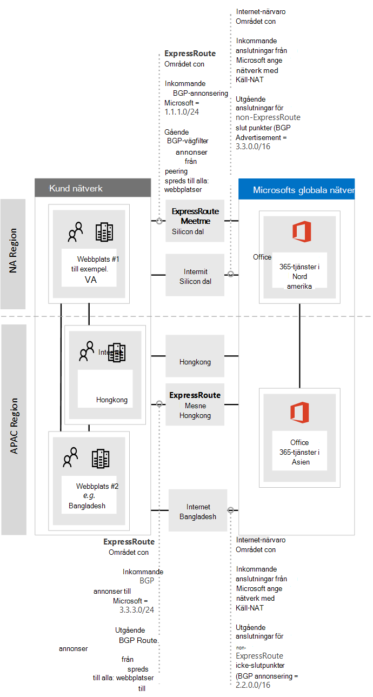
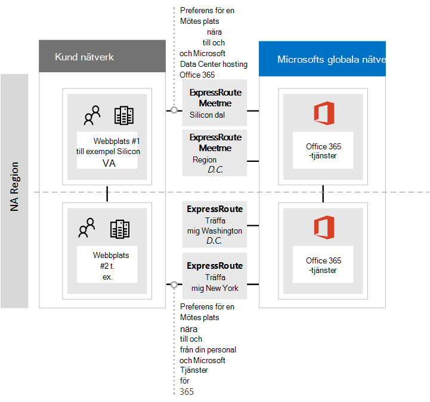
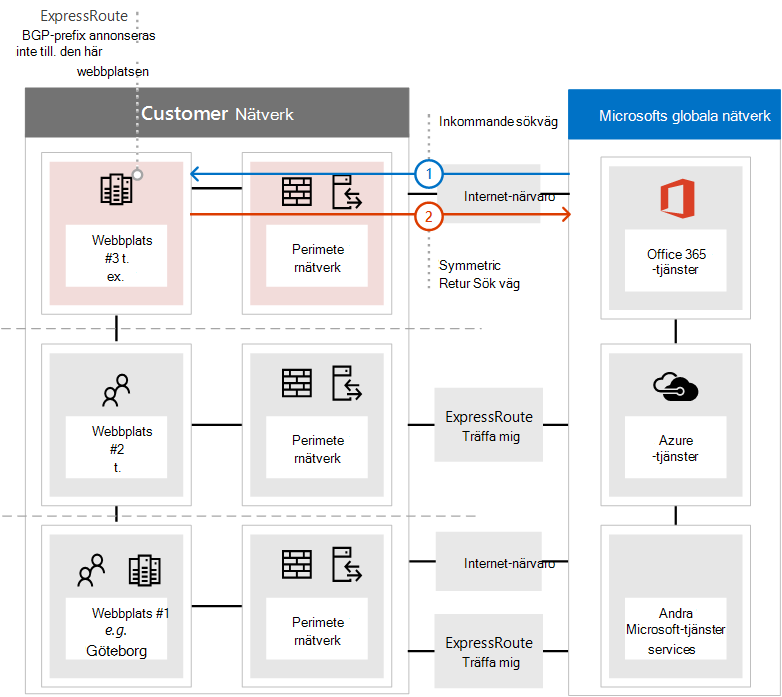

# <a name="implementing-expressroute-for-office-365"></a>Implementera ExpressRoute för Office 365

*Denna artikel gäller för både Microsoft 365 Enterprise och Office 365 Enterprise.*

ExpressRoute för Office 365 tillhandahåller en alternativ routningssökväg till många Internet-motstående Office 365-tjänster. Arkitekturen för ExpressRoute för Office 365 bygger på annonsering av offentliga IP-prefix för Office 365-tjänster som redan är tillgängliga via Internet till dina etablerade ExpressRoute-kretsar för efterföljande omdistribution av dessa IP-prefix till nätverket. Med ExpressRoute möjliggör du effektivt flera olika routningssökvägar, via internet och ExpressRoute, för många Office 365 tjänster. Den här statusen för routning i nätverket kan innebära en betydande förändring av hur den interna nätverkstopologin är utformad.
  
 **Status:** Fullständig vägledning v2
  
Du måste planera din Implementering av Office 365 ExpressRoute noga för att ta hänsyn till nätverkskomplexitet som kan nås via både en särskild krets med routes som matas in i ditt kärnnätverk och Internet. Om du och ditt team inte går med på den detaljerade planeringen och de olika testerna i den här guiden är risken stor att du kommer få upprepade problem med eller en total förlust av anslutningen till Office 365-tjänster när ExpressRoute-kretsen är aktiverad.
  
Om du vill göra en lyckad implementering måste du analysera dina krav på infrastrukturen, gå igenom detaljerade nätverksbedömningar och -utformningar, noggrant planera implementeringen på ett detaljerat och kontrollerat sätt och skapa en detaljerad validerings- och testningsplan. För en stor, distribuerad miljö är det inte ovanligt med implementeringar som spänner över flera månader. Den här guiden har utformats för att hjälpa dig planera.
  
Stora och lyckade distributioner kan ta sex månader att planera och omfattar ofta teammedlemmar från många områden inom organisationen inklusive nätverk, brandväggs- och proxyserveradministratörer, Office 365-administratörer, säkerhet, support för slutanvändare, projektledning och sponsring från ledningen. Investering i planeringsprocessen kommer att minska risken för att du får problem med distributionen som orsakar driftstopp eller komplex och dyr felsökning.
  
Vi räknar med att följande förutsättningar är slutförda innan den här implementeringsguiden startas.
  
1. Du har genomfört en nätverksutvärdering för att avgöra om ExpressRoute rekommenderas och godkänns.

2. Du har valt en ExpressRoute-nätverkstjänstleverantör. Hitta information om [ExpressRoute-partner och peeringplatser.](/azure/expressroute/expressroute-locations)

3. Du har redan läst och förstått [ExpressRoute-dokumentationen](https://azure.microsoft.com/documentation/services/expressroute/) och ditt interna nätverk kan uppfylla grundförutsättningarna för ExpressRoute från slut till slut.

4. Ditt team har läst all offentlig vägledning och dokumentation på , och tittat på Azure ExpressRoute för Office 365-utbildningsserien på Kanal 9 för att få en förståelse för kritisk [https://aka.ms/expressrouteoffice365](./azure-expressroute.md) [https://aka.ms/ert](https://aka.ms/ert) teknisk information, till exempel: [](https://channel9.msdn.com/series/aer)

      - Beroendet av Internet för SaaS-tjänster.

      - Hur du undviker asymmetriska routes och hanterar komplex routning.

      - Hur du införlivar kontroller för perimetersäkerhet, tillgänglighet och programnivå.

## <a name="begin-by-gathering-requirements"></a>Börja med att samla in krav
<a name="requirements"> </a>

Börja med att avgöra vilka funktioner och tjänster du planerar att använda i din organisation. Du måste bestämma vilka funktioner i de Office 365 tjänster som ska användas och vilka platser i nätverket som ska vara värd för personer som använder de funktionerna. När du har katalogen med scenarier måste du lägga till de nätverksattribut som krävs för var och en av de scenarierna. till exempel inkommande och utgående nätverkstrafikflöden och om Office 365 är tillgängliga via ExpressRoute eller inte.
  
Så här samlar du in organisationens krav:
  
- Katalogisera inkommande och utgående nätverkstrafik för de Office 365 tjänster din organisation använder. Titta Office 365 url:er och IP-adressintervallsidan för att få en beskrivning av de flöden Office 365 olika scenarier kräver.

- Samla in dokumentation om den befintliga nätverkstopologin som visar information om stommen och topologin i ditt interna WAN, anslutning av satellitwebbplatser, sista biten-anslutning för användare, routning till nätverkets utgående perimeterpunkter och proxytjänster.

  - Identifiera slutpunkter för inkommande tjänster i nätverksdiagrammen som Office 365 och andra Microsoft-tjänster ansluter till, som visar både Internetanslutningssökvägar och föreslagna ExpressRoute-anslutningssökvägar.

  - Identifiera alla geografiska användarplatser och WAN-anslutningar mellan platser samt vilka platser som för närvarande har en utgång till internet och vilka platser som föreslås ha en utgång till en ExpressRoute-peeringplats.

  - Identifiera alla gränsenheter, till exempel proxyenheter, brandväggar och så vidare, och kartlägg deras relation till flöden via Internet och ExpressRoute.

  - Dokumentera om slutanvändare kommer att få åtkomst Office 365 tjänster via direktroutning eller indirekt programproxy för både Internet- och ExpressRoute-flöden.

- Lägg till klientorganisationens plats och platser för möte i nätverksdiagrammet.

- Uppskatta förväntade och observerade nätverksprestanda och svarstidsegenskaper från större användarplatser till Office 365. Kom ihåg att Office 365 är en global och fördelad uppsättning tjänster och att användarna kommer att ansluta till andra platser än klientorganisationens. Därför rekommenderar vi att du mäter och optimerar för svarstiden mellan användaren och den närmaste gränsen för Microsofts globala nätverk via ExpressRoute- och Internetanslutningar. Du kan använda resultaten från nätverksutvärderingen för den här uppgiften.

- Lista krav för företagets nätverkssäkerhet och hög tillgänglighet som måste uppfyllas med den nya ExpressRoute-anslutningen. Till exempel hur användare fortsätter att få åtkomst till Office 365 vid ett fel på en Internet-utgång eller ExpressRoute-krets.

- Dokumentera vilka inkommande och utgående Office 365 nätverksflöden kommer att använda Internetsökvägen och vilka som kommer att använda ExpressRoute. Specifika förutsättningar för dina användares geografiska platser och information om din lokala nätverkstopologi kan kräva att abonnemanget skiljer sig från en användarplats till en annan.

### <a name="catalog-your-outbound-and-inbound-network-traffic"></a>Katalogisera din utgående och inkommande nätverkstrafik
<a name="trafficCatalog"> </a>

För att minimera routning och annan nätverkskomplexitet rekommenderar vi att du bara använder ExpressRoute för Office 365 för de nätverkstrafikflöden som krävs för att gå via en dedikerad anslutning på grund av krav eller som ett resultat av nätverksutvärderingen. Dessutom rekommenderar vi att du fasar in ExpressRoute-routningens omfattning och metoden för utgående och inkommande nätverkstrafik som olika steg i implementeringsprojektet. Om du bara distribuerar ExpressRoute för Office 365 för användarskapade utgående nätverkstrafikflöden och låter inkommande nätverkstrafikflöden gå via Internet kan du styra ökningen av den topologiska komplexiteten och riskerna som en introduktion till ytterligare asymmetriska routningsmöjligheter innebär.
  
Din katalog över nätverkstrafik ska innehålla alla ingående och utgående nätverksanslutningar som du har mellan ditt lokala nätverk och Microsoft.
  
- Utgående nätverkstrafikflöden är alla scenarier där en anslutning initieras från din lokala miljö, till exempel från interna klienter eller servrar, med destinationen för Microsoft-tjänster. De här anslutningarna kan vara direkta Office 365 eller indirekta, till exempel när anslutningen går genom proxyservrar, brandväggar eller andra nätverksenheter på vägen till Office 365.

- Inkommande nätverkstrafikflöden är alla scenarier där en anslutning initieras från Microsoft-molnet till en lokal värd. De här anslutningarna behöver vanligtvis gå genom brandväggen och annan säkerhetsinfrastruktur som kundens säkerhetspolicy kräver för flöden med externt ursprung.

Läs  avsnittet Säkerställa routningssymmetri i artikeln Dirigering med [ExpressRoute](https://support.office.com/article/Routing-with-ExpressRoute-for-Office-365-e1da26c6-2d39-4379-af6f-4da213218408) för Office 365 för att avgöra vilka tjänster som ska skicka inkommande trafik och leta efter kolumnen som är markerad **med ExpressRoute** för Office 365 i [referensartikeln för Office 365-slutpunkter](https://support.office.com/article/Office-365-URLs-and-IP-address-ranges-8548a211-3fe7-47cb-abb1-355ea5aa88a2) för att fastställa resten av anslutningsinformationen.
  
För varje tjänst som kräver en utgående anslutning ska du beskriva den planerade anslutningen för tjänsten, inklusive nätverksroutning, proxykonfiguration, paketkontroll och bandbreddsbehov.
  
För varje tjänst som kräver en inkommande anslutning behöver du ytterligare information. Servrar i Microsoft-molnet upprättar anslutningar till ditt lokala nätverk. om du vill vara säker på att anslutningarna görs på rätt sätt bör du beskriva alla aspekter av den här anslutningen, inklusive: offentliga DNS-poster för de tjänster som accepterar dessa inkommande anslutningar, de CIDR-formaterade IPv4 IP-adresserna, vilken ISP-utrustning som ingår, och hur inkommande NAT eller käll-NAT hanteras för dessa anslutningar.
  
Inkommande anslutningar bör granskas oavsett om de ansluter via Internet eller ExpressRoute för att säkerställa att asymmetrisk routning inte har använts. I vissa fall kan lokala slutpunkter som Office 365 inkommande anslutningar till också behöva nås av andra Microsoft- och Microsoft-tjänster. Det är mycket viktigt att aktiveringen av ExpressRoute-routning till dessa Office 365 syften inte bryter mot andra scenarier. I många fall kan kunder behöva implementera specifika ändringar i sina interna nätverk, till exempel källbaserad NAT, för att säkerställa att inkommande flöden från Microsoft förblir symmetriska när ExpressRoute har aktiverats.
  
Här är ett exempel på detaljnivån som krävs. I det Exchange fallet skulle hybriden dirigeras till det lokala systemet via ExpressRoute. 

|Anslutningsegenskap   |Värde  |
|----------|-----------|
|**Nätverkstrafikriktning** <br/> |Inkommande  <br/> |
|**Tjänst** <br/> |Exchange-hybrid  <br/> |
|**Offentlig Office 365 (källa)** <br/> |Exchange Online (IP-adresser)  <br/> |
|**Offentlig lokal slutpunkt (mål)** <br/> |5.5.5.5  <br/> |
|**Offentlig DNS-post (Internet)** <br/> |Autodiscover.contoso.com  <br/> |
|**Kommer den här lokala slutpunkten användas av andra (icke-Office 365) Microsoft-tjänster** <br/> |Nej  <br/> |
|**Kommer den här lokala slutpunkten användas av användare/system på Internet** <br/> |Ja  <br/> |
|**Interna system som publiceras via offentliga slutpunkter** <br/> |Exchange Server för klientåtkomst (lokal) 192.168.101, 192.168.102, 192.168.103  <br/> |
|**IP-annonsering för den offentliga slutpunkten** <br/> |**Till Internet:** 5.5.0.0/16 **till ExpressRoute**: 5.5.5.0/24  <br/> |
|**Säkerhets- och perimeterkontroller** <br/> |**Internetsökväg:** DeviceID_002  **ExpressRoute-sökväg:** DeviceID_003  <br/> |
|**Hög tillgänglighet** <br/> |Aktiv/aktiv på 2 geo-redundanta/ExpressRoute-kretsar – Chicago och Dallas  <br/> |
|**Symmetrikontroll för sökväg** <br/> |**Metod**: Internetsökväg för käll-NAT : Inkommande anslutningar för käll-NAT till 192.168.5.5 **ExpressRoute-sökväg:** Anslutningar för käll-NAT till 192.168.1.0 (Chicago) och 192.168.2.0 (Dallas)  <br/> |

Här är ett exempel på en tjänst som endast är utgående:

|**Anslutningsegenskap**|**Värde**|
|----------|-----------|
|**Nätverkstrafikriktning** <br/> |Utgående  <br/> |
|**Tjänst** <br/> |SharePoint Online  <br/> |
|**Lokal slutpunkt (källa)** <br/> |Användarens arbetsstation  <br/> |
|**Offentlig Office 365 (mål)** <br/> |SharePoint Online (IP-adresser)  <br/> |
|**Offentlig DNS-post (Internet)** <br/> |\*.sharepoint.com (och ytterligare FQDN)  <br/> |
|**CDN Referenser** <br/> |cdn.sharepointonline.com (och ytterligare FQDN) – IP-adresser som underhålls CDN tjänsteleverantörer)  <br/> |
|**IP-annonsering och NAT används** <br/> |**Internetsökväg/käll-NAT**: 1.1.1.0/24  <br/> **ExpressRoute-sökväg/käll-NAT**: 1.1.2.0/24 (Chicago) och 1.1.3.0/24 (Dallas)  <br/> |
|**Anslutningsmetod** <br/> |**Internet:** via lager 7-proxy (PAC-fil)  <br/> **ExpressRoute:** direktroutning (ingen proxy)  <br/> |
|**Säkerhets- och perimeterkontroller** <br/> |**Internetsökväg:** DeviceID_002  <br/> **ExpressRoute-sökväg:** DeviceID_003  <br/> |
|**Hög tillgänglighet** <br/> |**Internetsökväg:** Redundant internet egress  <br/> **ExpressRoute-sökväg:** Aktiv/aktiv "potatis"-routning på 2 geo-redundanta ExpressRoute-kretsar – Chicago och Dallas  <br/> |
|**Symmetrikontroll för sökväg** <br/> |**Metod**: Käll-NAT för alla anslutningar  <br/> |

### <a name="your-network-topology-design-with-regional-connectivity"></a>Utformning av din nätverkstopologi med regional anslutning
<a name="topology"> </a>

När du förstår tjänsterna och deras kopplade nätverkstrafikflöden kan du skapa ett nätverksdiagram där de här nya anslutningskraven ingår och som beskriver ändringarna du kommer att göra för att använda ExpressRoute för Office 365. Ditt diagram ska innehålla:
  
1. Alla användarplatser där Office 365 och andra tjänster kan nås från.

2. Alla utgående punkter för Internet och ExpressRoute.

3. Alla utgående och inkommande enheter som hanterar anslutningar in i och ut ur nätverket, inklusive routrar, brandväggar, programproxyservrar och intrångsidentifiering/-skydd.

4. Interna mål för all inkommande trafik, till exempel interna ADFS-servrar som accepterar anslutningar från ADFS-webbprogramproxyservrarna.

5. Katalog över alla IP-undernät som ska annonseras

6. Identifiera varje plats som personer kommer Office 365 från och lista de meet-me-platser som ska användas för ExpressRoute.

7. Platser och delar av din interna nätverkstopologi där Microsoft-IP-prefix som lärts från ExpressRoute accepteras, filtreras och sprids till.

8. Nätverkstopologin ska illustrera varje nätverkssegments geografiska plats och hur det ansluter till Microsoft-nätverket via ExpressRoute och/eller Internet.

Diagrammet nedan visar varje plats där personer kommer att använda Office 365 från tillsammans med inkommande och utgående routningsannonsering till Office 365.
  

  
För utgående trafik använder personerna åtkomst Office 365 ett av tre sätt:
  
1. Via en meet-me-plats i Nordamerika för personer i Kalifornien.

2. Via en meet-me-plats i Hongkong för personer i Hongkong.

3. Via internet i Bangladesh där det finns färre personer och ingen ExpressRoute-krets har etablerats.


  
På samma sätt returnerar den inkommande nätverkstrafiken Office 365 på ett av tre sätt:
  
1. Via en meet-me-plats i Nordamerika för personer i Kalifornien.

2. Via en meet-me-plats i Hongkong för personer i Hongkong.

3. Via internet i Bangladesh där det finns färre personer och ingen ExpressRoute-krets har etablerats.


  
### <a name="determine-the-appropriate-meet-me-location"></a>Fastställa lämplig meet-me-plats

Valet av meet-me-platser, som är den fysiska plats där din ExpressRoute-krets ansluter nätverket till Microsoft-nätverket, påverkas av platserna där personer kommer att Office 365 från. Som SaaS-erbjudande Office 365 den inte enligt den regionala IaaS- eller PaaS-modellen på samma sätt som Azure. I stället är Office 365 en fördelad uppsättning samarbetstjänster där användarna kan behöva ansluta till slutpunkter över flera datacenter och regioner, som kanske inte nödvändigtvis finns på samma plats eller i samma region som användarens klientorganisation.
  
Det innebär att det viktigaste som du måste göra när du väljer meet-me-platser för ExpressRoute för Office 365 är från vilken personer i organisationen kommer att ansluta från. Den allmänna rekommendationen för optimal Office 365-anslutning är att implementera routning, så att användarförfrågningar till Office 365-tjänster lämnas in i Microsoft-nätverket via den kortaste nätverkssökvägen – det här kallas också ofta för "potatisdirigering". Om de flesta Office 365-användarna till exempel finns på en eller två platser skapar du den optimala designen genom att välja"-platser som ligger närmast platsen för de användarna. Om ditt företag har stora användargrupper i många olika regioner kan det vara bra att ha flera ExpressRoute-kretsar och meet-me-platser. För vissa av användarnas platser kanske den kortaste/mest optimala sökvägen till Microsoft-nätverket och Office 365 inte går via ditt interna WAN- och ExpressRoute-möte men via Internet.
  
Ofta går det att välja flera meet-me-platser i ett område som ligger relativt nära dina användare. Fyll i följande tabell för att vägleda dina beslut.

**Planerade ExpressRoute-meet-me-platser i Kalifornien och New York**

|Plats  <br/> |Antal personer  <br/> |Förväntad fördröjning till Microsoft-nätverket via utgående Internet-anslutning  <br/> |Förväntad fördröjning till Microsoft-nätverket via ExpressRoute  <br/> |
|----------|-----------|----------|-----------|
|Los Angeles  <br/> |10 000  <br/> |~15ms  <br/> |~10ms (via Silicon Valley)  <br/> |
|Washington DC  <br/> |15 000  <br/> |~20ms  <br/> |~10ms (via New York)  <br/> |
|Dallas  <br/> |5,000  <br/> |~15ms  <br/> |~40ms (via New York)  <br/> |

När den globala nätverksarkitekturen som visar Office 365-regionen, uppfyller ExpressRoute-nätverkstjänstleverantörens platser och antalet personer per plats har utvecklats kan den användas för att identifiera om några optimeringar kan göras. Den kan också visa globala hårnålsnätverksanslutningar där trafik dirigeras till en fjärrplats för att komma till mötesplats. Om en hårnålsnålsfärg upptäcks i det globala nätverket bör den åtgärdas innan du fortsätter. Hitta en annan plats eller använd selektiva utgående punkter för Internet för att undvika hårnålsanslutningen.
  
I det första diagrammet visas ett exempel på en kund med två fysiska platser i Nordamerika. Du kan se information om kontorsplatser, Office 365 klientorganisationsplatser och flera alternativ för ExpressRoute-meet-me-platser. I det här exemplet har kunden valt plats för möte baserat på två principer i följande ordning:
  
1. Så nära personer i organisationen som finns.

2. Så nära ett Microsoft-datacenter som Office 365 finns.


  
Om vi utökar begreppet något ytterligare visar det andra diagrammet ett exempel på ett multinationellt kunder som står inför liknande information och beslut. Den här kunden har ett litet kontor i Bangladesh med bara ett litet team med tio personer som fokuserar på att få sina fotavtryck i regionen. Det finns en meet-me-plats i Chennai och ett Microsoft-datacenter med Office 365 värd i Chennai så det skulle vara bra att använda en meet-me-plats; Men för tio personer är kostnaden för den extra kretsen besvärande. När du tittar på ditt nätverk måste du avgöra om svarstiden som krävs för att skicka nätverkstrafiken över nätverket är mer effektiv än att använda versaler och till att köpa en annan ExpressRoute-krets.
  
De tio personerna i Bangladesh kan också få bättre prestanda om deras nätverkstrafik skickas via internet till Microsoft-nätverket än de skulle få via routning på deras interna nätverk som vi visade i de inledande diagrammen och nedan.
  

  
## <a name="create-your-expressroute-for-office-365-implementation-plan"></a>Skapa din implementeringsplan för ExpressRoute Office 365 ditt abonnemang
<a name="implementation"> </a>

Din implementeringsplan bör omfatta både teknisk information om konfiguration av ExpressRoute samt information om konfiguration av all annan infrastruktur på nätverket, till exempel följande.
  
- Planera vilka tjänster som delas upp mellan ExpressRoute och Internet.

- Planera för bandbredd, säkerhet, hög tillgänglighet och redundans.

- Utforma inkommande och utgående routning, inklusive korrekt optimering av routningssökvägen för olika platser

- Bestäm hur långt ExpressRoute-routes ska annonseras på ditt nätverk och vilken mekanism som ska finnas för klienter för att välja Internet- eller ExpressRoute-sökväg. till exempel direktroutning eller programproxy.

- Planera DNS-poständringar, inklusive [Sender Policy Framework-poster.](../security/office-365-security/set-up-spf-in-office-365-to-help-prevent-spoofing.md)

- Planera EN NAT-strategi som omfattar utgående och inkommande käll-NAT.

### <a name="plan-your-routing-with-both-internet-and-expressroute-network-paths"></a>Planera din routning med både internetsökvägar och ExpressRoute-nätverkssökvägar
<a name="paths"> </a>

- För den första distributionen rekommenderas alla inkommande tjänster, till exempel inkommande e-post eller hybridanslutning, att använda Internet.

- Planera LAN-routning för slutanvändarklienter, till exempel konfigurera en [PAC/WPAD-fil,](./managing-office-365-endpoints.md)standarddirigering, proxyservrar och annonsering av BGP-routning.

- Planera perimeterroutning, inklusive proxyservrar, brandväggar och molnproxyservrar.

### <a name="plan-your-bandwidth-security-high-availability-and-failover"></a>Planera din bandbredd, säkerhet, hög tillgänglighet och redundans
<a name="availability"> </a>

Skapa en plan för bandbredden som krävs för varje större Office 365 arbetsbelastningen. Beräkna bandbreddskraven Exchange Online, SharePoint online och bandbredd Skype för företag online. Du kan använda uppskattningskalkylatorerna som vi har angett för Exchange Online och Skype för företag som en utgångspunkt. Ett pilottest med ett representativt urval av användarprofiler och platser krävs dock för att helt förstå organisationens bandbreddsbehov.
  
Lägg till hur säkerhet hanteras på varje utgående Internet- och ExpressRoute-plats i planen. Kom ihåg att alla ExpressRoute-anslutningar till Office 365 använder offentlig peering och fortfarande måste skyddas i enlighet med ditt företags säkerhetsprinciper för anslutning till externa nätverk.
  
Lägg till information i din plan om vilka personer som kommer att påverkas av vilken typ av avbrott och hur dessa personer kan utföra sitt arbete med full kapacitet på enklast möjliga sätt.
  
#### <a name="plan-bandwidth-requirements-including-skype-for-business-requirements-on-jitter-latency-congestion-and-headroom"></a>Planera bandbreddskrav inklusive Skype för företag krav på jitter, fördröjning, överbelastning och utrymme
  
Skype för företag Online har även specifika ytterligare nätverkskrav som beskrivs i artikeln [Mediakvalitet och nätverksanslutningsprestanda i Skype för företag Online.](https://support.office.com/article/Media-Quality-and-Network-Connectivity-Performance-in-Skype-for-Business-Online-5fe3e01b-34cf-44e0-b897-b0b2a83f0917)
  
Läs avsnittet Planering **av bandbredd för Azure ExpressRoute** i [Nätverksplanering med ExpressRoute för Office 365.](https://support.office.com/article/Network-planning-with-ExpressRoute-for-Office-365-103208f1-e788-4601-aa45-504f896511cd)
  
När du utför en bandbreddsbedömning med dina pilotanvändare kan du använda vår guide. [Office 365 justera prestanda med baslinjer och prestandahistorik](https://support.office.com/article/Office-365-performance-tuning-using-baselines-and-performance-history-1492cb94-bd62-43e6-b8d0-2a61ed88ebae).
  
#### <a name="plan-for-high-availability-requirements"></a>Planera för krav på hög tillgänglighet
  
Skapa en plan för hög tillgänglighet för att tillgodose dina behov och införliva detta i ditt uppdaterade nätverkstopologidiagram. Läs avsnittet Hög **tillgänglighet och redundans med Azure ExpressRoute i** [Nätverksplanering med ExpressRoute för Office 365](https://support.office.com/article/Network-planning-with-ExpressRoute-for-Office-365-103208f1-e788-4601-aa45-504f896511cd).
  
#### <a name="plan-for-network-security-requirements"></a>Planera för nätverksäkerhetskrav
  
Skapa en plan för att uppfylla nätverkssäkerhetskraven och lägg till den i ditt uppdaterade nätverkstopologidiagram. Läs avsnittet Använda **säkerhetskontroller på Azure ExpressRoute för Office 365 scenarier** i [Nätverksplanering med ExpressRoute för Office 365.](https://support.office.com/article/Network-planning-with-ExpressRoute-for-Office-365-103208f1-e788-4601-aa45-504f896511cd)
  
### <a name="design-outbound-service-connectivity"></a>Utforma anslutning för utgående tjänster
<a name="outbound"> </a>

ExpressRoute för Office 365 har *utgående* nätverkskrav som kan vara obekanta. Specifikt måste IP-adresserna som representerar dina användare och nätverk till Office 365 och som fungerar som källslutpunkter för utgående nätverksanslutningar till Microsoft följa särskilda krav som anges nedan.
  
1. Slutpunkterna måste vara offentliga IP-adresser som är registrerade för ditt företag eller för operatören som tillhandahåller expressRoute-anslutning till dig.

2. Slutpunkterna måste annonseras till Microsoft och valideras/godkännas av ExpressRoute.

3. Slutpunkterna får inte annonseras till Internet med samma eller fler önskade routningsmått.

4. Slutpunkterna får inte användas för anslutning till Microsoft-tjänster som inte konfigureras via ExpressRoute.

Om din nätverksdesign inte uppfyller de här kraven finns det en hög risk för att användarna kan uppleva anslutningsproblem för Office 365 och andra Microsoft-tjänster på grund av svarta hål i routningen eller asymmetrisk routning. Detta inträffar när förfrågningar för Microsoft-tjänster dirigeras via ExpressRoute, men svar dirigeras tillbaka via Internet, eller tvärtom, och svaren ignoreras av tillståndsnätverksenheter såsom brandväggar.
  
Den vanligaste metoden du kan använda för att uppfylla kraven ovan är att använda käll-NAT, antingen som en del av ditt nätverk eller som tillhandahålls av din ExpressRoute-operatör. Med käll-NAT kan du sammandraga information och privata IP-adresser för internetnätverket från ExpressRoute och tillsammans med korrekt annonserade IP-vägar ger en enkel mekanism för att säkerställa sökvägssymmetri. Om du använder tillståndsnätverksenheter som är specifika för ExpressRoute-peeringplatser måste du implementera separata NAT-pooler för varje ExpressRoute-peering för att säkerställa sökvägssymmetri.
  
Läs mer om [NAT-krav för ExpressRoute.](/azure/expressroute/expressroute-nat)
  
Lägg till ändringarna för den utgående anslutningen i nätverkstopologidiagrammet.
  
### <a name="design-inbound-service-connectivity"></a>Utforma anslutning för inkommande tjänster
<a name="inbound"> </a>

Majoriteten av enterprise Office 365-distributionerna antar någon form av inkommande anslutning från Office 365 till lokala tjänster, till exempel för Exchange, SharePoint och Skype för företag-hybridscenarier, postlådemigrering och autentisering med ADFS-infrastrukturen. När ExpressRoute du aktiverar en ytterligare routningssökväg mellan ditt lokala nätverk och Microsoft för utgående anslutningar kan dessa inkommande anslutningar oavsiktligt påverkas av asymmetrisk routning, även om du tänker låta dessa flöden fortsätta att använda Internet. Några försiktighetsåtgärder som beskrivs nedan rekommenderas för att säkerställa att det inte påverkar Internetbaserade inkommande flöden från Office 365 till lokala system.
  
För att minimera riskerna för asymmetrisk routning för inkommande nätverkstrafikflöden bör alla inkommande anslutningar använda käll-NAT innan de dirigeras till segment i nätverket som har routningssyn till ExpressRoute. Om de inkommande anslutningarna tillåts till ett nätverkssegment med routningssynlighet till ExpressRoute utan käll-NAT kommer förfrågningar från Office 365 in från Internet, men svaret som går tillbaka till Office 365 kommer att föredra ExpressRoute-nätverkssökvägen tillbaka till Microsoft-nätverket, vilket orsakar asymmetrisk routning.
  
Du kan överväga ett av följande implementeringsmönster för att uppfylla det här kravet:
  
1. Utför käll-NAT innan förfrågningar dirigeras till det interna nätverket med nätverksutrustning som brandväggar eller belastningsutjämnare på vägen från Internet till dina lokala system.

2. Se till att ExpressRoute-routes inte sprids till nätverkssegment där inkommande tjänster, till exempel frontend-servrar eller omvända proxysystem, som hanterar Internetanslutningar finns.

Ta uttryckligen med de här scenarierna i nätverket och håll alla inkommande nätverkstrafikflöden via Internet för att minimera distributions- och driftriskerna för asymmetrisk routning.
  
Det kan finnas fall där du kan välja att dirigera vissa inkommande flöden via ExpressRoute-anslutningar. Ta hänsyn till följande ytterligare överväganden för de här scenarierna.
  
1. Office 365 kan endast ha lokala slutpunkter som använder offentliga IP-adresser som mål. Det innebär att även om den lokala inkommande slutpunkten endast visas för Office 365 via ExpressRoute så måste den fortfarande ha offentliga IP-adresser kopplade till sig.

2. All DNS-namnmatchning Office 365 dns-tjänster utför för att matcha lokala slutpunkter sker med offentlig DNS. Det innebär att du måste registrera inkommande tjänsteslutpunkters FQDN för IP-mappningar på Internet.

3. För att ta emot inkommande nätverksanslutningar via ExpressRoute måste de offentliga IP-undernäten för dessa slutpunkter annonseras till Microsoft via ExpressRoute.

4. Utvärdera noggrant dessa inkommande nätverkstrafikflöden för att säkerställa att korrekt säkerhets- och nätverkskontroller tillämpas för dem enligt ditt företags säkerhets- och nätverksprinciper.

5. När dina lokala inkommande slutpunkter annonseras till Microsoft via ExpressRoute blir ExpressRoute i praktiken den föredragna routningssökvägen till dessa slutpunkter för alla Microsoft-tjänster, inklusive Office 365. Det innebär att dessa slutpunktsundernät endast får användas för kommunikation med Office 365-tjänster och inga andra tjänster på Microsoft-nätverket. Annars orsakar din utformning asymmetrisk routning där inkommande anslutningar från andra Microsoft-tjänster föredrar att dirigera inkommande trafik via ExpressRoute, medan retursökvägen använder Internet.

6. Om en ExpressRoute-krets eller meet-me-plats ligger nere måste du se till att de lokala inkommande slutpunkterna fortfarande är tillgängliga för att acceptera förfrågningar via en separat nätverkssökväg. Det kan innebära att undernät för dessa slutpunkter annonseras via flera ExpressRoute-kretsar.

7. Vi rekommenderar att du använder käll-NAT för alla inkommande nätverkstrafikflöden som kommer in i ditt nätverk via ExpressRoute, särskilt när flödena går igenom tillståndsnätverksenheter som brandväggar.

8. Vissa lokala tjänster, till exempel ADFS-proxy eller Exchange automatisk upptäckt, kan ta emot inkommande förfrågningar från både Office 365 och användare från Internet. För dessa förfrågningar Office 365 samma FQDN som användarförfrågningar via Internet. Om du tillåter inkommande användaranslutningar från Internet till de lokala slutpunkterna, medan du tvingar Office 365-anslutningar att använda ExpressRoute, representerar betydande routningskomplexitet. För majoriteten av kunderna rekommenderar vi inte att sådana komplexa scenarier implementeras via ExpressRoute på grund av driftöverväganden. Den här extra belastningen omfattar hantering av risker för asymmetrisk routning och kräver att du noggrant hanterar routningsannonsering och -principer i flera dimensioner.

### <a name="update-your-network-topology-plan-to-show-how-you-would-avoid-asymmetric-routes"></a>Uppdatera din nätverkstopologiplan för att visa hur du undviker asymmetriska routes
<a name="asymmetric"> </a>

Du vill undvika asymmetrisk routning för att säkerställa att personer i organisationen smidigt kan använda Office 365 och andra viktiga tjänster på Internet. Det finns två vanliga konfigurationer som kunder har som kan orsaka asymmetrisk routning. Nu är det ett bra tillfälle att granska nätverkskonfigurationen som du planerar att använda och kontrollera om något av följande scenarier för asymmetrisk routning kan finnas.
  
Till att börja med undersöker vi några olika situationer som kopplas till följande nätverksdiagram. I det här diagrammet finns alla servrar som tar emot inkommande förfrågningar, till exempel ADFS eller lokala hybridservrar, på datacentret i New Jersey och annonseras till internet.
  
1. Perimeternätverket är säkert, men det finns ingen käll-NAT tillgänglig för inkommande förfrågningar.

2. Servrarna på datacentret i New Jersey kan se både internet- och ExpressRoute-routes.


  
Vi har också förslag på hur du kan åtgärda dem.
  
#### <a name="problem-1-cloud-to-on-premises-connection-over-the-internet"></a>Problem 1: Moln till lokal anslutning via Internet
  
I följande diagram visas den asymmetriska nätverkssökvägen som används när din nätverkskonfiguration inte tillhandahåller NAT för inkommande förfrågningar från Microsoft-molnet via Internet.
  
1. Den inkommande förfrågan från Office 365 hämtar IP-adressen för den lokala slutpunkten från offentlig DNS och skickar begäran till ditt perimeternätverk.

2. I den här felaktiga konfigurationen finns det ingen konfigurerad käll-NAT och ingen är tillgänglig på perimeternätverket dit trafiken skickas vilket resulterar i att den faktiska käll-IP-adressen används som returmål.

  - Servern på ditt nätverk dirigerar returtrafiken till Office 365 via valfri tillgänglig ExpressRoute-nätverksanslutning.

  - Resultatet är en asymmetrisk sökväg för flödet till Office 365 vilket resulterar i en bruten anslutning.


  
##### <a name="solution-1a-source-nat"></a>Lösning 1a: Käll-NAT
  
Det här felkonfigurerade nätverket löses genom att en käll-NAT läggs till för den inkommande förfrågan. I det här diagrammet:
  
1. Den inkommande förfrågan fortsätter att komma via perimeternätverket för datacentret i New Jersey. Den här gången är käll-NAT tillgänglig.

2. Svaret från servern dirigerar tillbaka mot IP-adressen som är kopplad till käll-NAT i stället för den ursprungliga IP-adressen, vilket resulterar i att svaret returneras längs samma nätverkssökväg.


  
##### <a name="solution-1b-route-scoping"></a>Lösning 1b: Routeomfång
  
Alternativt kan du välja att inte tillåta att ExpressRoute BGP-prefix ska annonseras och ta bort den alternativa nätverkssökvägen för de datorerna. I det här diagrammet:
  
1. Den inkommande förfrågan fortsätter att komma via perimeternätverket för datacentret i New Jersey. Den här gången är de prefix som annonseras från Microsoft via ExpressRoute-kretsen inte tillgängliga för datacentret i New Jersey.

2. Svaret från servern dirigerar tillbaka mot IP-adressen som är kopplad till den ursprungliga IP-adressen via den enda tillgängliga routen, vilket resulterar i att svaret återgår längs samma nätverkssökväg.


  
#### <a name="problem-2-cloud-to-on-premises-connection-over-expressroute"></a>Problem 2: Moln till lokal anslutning via ExpressRoute
  
I följande diagram visas den asymmetriska nätverkssökvägen som används när din nätverkskonfiguration inte tillhandahåller NAT för inkommande förfrågningar från Microsoft-molnet via ExpressRoute.
  
1. Den inkommande förfrågan från Office 365 hämtar IP-adressen från DNS och skickar förfrågan till ditt perimeternätverk.

2. I den här felaktiga konfigurationen finns det ingen konfigurerad käll-NAT och ingen är tillgänglig på perimeternätverket dit trafiken skickas vilket resulterar i att den faktiska käll-IP-adressen används som returmål.

  - Datorn på ditt nätverk dirigerar returtrafiken till Office 365 via valfri tillgänglig ExpressRoute-nätverksanslutning.

  - Resultatet är en asymmetrisk anslutning till Office 365.


  
##### <a name="solution-2-source-nat"></a>Lösning 2: Käll-NAT
  
Det här felkonfigurerade nätverket löses genom att en käll-NAT läggs till för den inkommande förfrågan. I det här diagrammet:
  
1. Den inkommande förfrågan fortsätter att komma via perimeternätverket för datacentret i New York. Den här gången är käll-NAT tillgänglig.

2. Svaret från servern dirigerar tillbaka mot IP-adressen som är kopplad till käll-NAT i stället för den ursprungliga IP-adressen, vilket resulterar i att svaret returneras längs samma nätverkssökväg.


  
### <a name="paper-verify-that-the-network-design-has-path-symmetry"></a>Verifiera på papper att nätverksdesignen har symmetriska sökvägar

Nu behöver du verifiera på papper att din implementeringsplan ger symmetriska router för de olika scenarier som du ska använda Office 365. Du identifierar den specifika nätverksrutt som ska användas när en person använder olika funktioner i tjänsten. Från det lokala nätverket och WAN-routningen, till perimeterenheterna, till anslutningssökvägen. ExpressRoute eller internet, och vidare till anslutningen till onlineslutpunkten.
  
Du måste göra det här för alla Office 365 nätverkstjänster som tidigare identifierades som tjänster som din organisation ska använda.
  
Det underlättar att göra den här pappers genomgången tillsammans med en annan person. Förklara för dem var varje nätverkshopp förväntas få nästa route från och kontrollera att du är bekant med routningssökvägarna. Kom ihåg att ExpressRoute alltid ger en mer begränsad route till Microsoft-servrars IP-adresser, vilket innebär en lägre routekostnad än för en standardroute via Internet.
  
### <a name="design-client-connectivity-configuration"></a>Designa konfiguration av klientanslutning
<a name="asymmetric"> </a>


  
Om du använder en proxyserver för Internetbunden trafik behöver du justera alla PAC- eller klientkonfigurationsfiler för att säkerställa att klientdatorerna på nätverket är korrekt konfigurerade för att skicka ExpressRoute-trafiken som du vill till Office 365 utan att ta vägen via din proxyserver, och att den återstående trafiken, inklusive viss Office 365-trafik, skickas till relevant proxy. Läs vår guide om hantering [Office 365 slutpunkter,](./managing-office-365-endpoints.md) till exempel PAC-filer.
  
> [!NOTE]
> Slutpunkterna ändras ofta, så ofta varje vecka. Du bör bara göra ändringar baserat på de tjänster och funktioner som din organisation har infört för att minska antalet ändringar du behöver göra för att hålla dig aktuell. Var uppmärksam på  startdatumet i RSS-flödet där ändringarna meddelas och en post sparas för alla tidigare ändringar, IP-adresser som meddelas kanske inte annonseras eller tas bort från annonseringen förrän startdatumet har uppnåtts.
  
## <a name="build-your-deployment-and-testing-procedures"></a>Skapa dina distributions- och testmetoder
<a name="testing"> </a>

Din implementeringsplan bör innehålla planering för både testning och återställning. Om din implementering inte fungerar som förväntat bör planen vara utformad så att så få personer som möjligt påverkas innan problemen upptäcks. Nedan följer några högnivåprinciper som du bör överväga att ta med i din plan.
  
1. Fasa in nätverkssegmentet och användare i tjänsten för att minimera störningar.

2. Planera testning av routes med traceroute och TCP-anslutning från en separat Internetansluten värd.

3. Testning av inkommande och utgående tjänster bör helst göras på ett isolerat testnätverk med ett test som Office 365 klientorganisation.

      - Testning kan även utföras på ett produktionsnätverk om kunden ännu inte använder Office 365 finns i pilottestningen.

      - Testning kan även utföras under ett produktionsavbrott som endast är till för test och övervakning.

      - Testning kan också utföras genom att du kontrollerar routes för varje tjänst på varje lager 3-routernod. Denna reserv bör endast användas om ingen annan testning är möjlig, eftersom en brist på fysisk testning innebär risker.

### <a name="build-your-deployment-procedures"></a>Skapa dina distributionsprocedurer

Dina distributionsprocedurer bör distribueras till små grupper med personer i faser för att testas innan du distribuerar till större grupper. Nedan finns flera sätt att fasa in distributionen av ExpressRoute.
  
1. Konfigurera ExpressRoute med Microsoft-peering och se till att routeannonsering vidarebefordras till en enda värd för teständamål.

2. Annonsera routes till ExpressRoute-nätverket till ett enda nätverkssegment först och expandera routeannonseringen per nätverkssegment eller region.

3. Om distribution Office 365 för första gången använder du ExpressRoute-nätverksdistributionen som ett pilottest för ett litet antal personer.

4. Om du använder proxyservrar kan du alternativt konfigurera en test-PAC-fil för att dirigera ett litet antal personer till ExpressRoute för testning och feedback innan du lägger till fler.

Din implementeringsplan bör lista alla distributionsprocedurer som måste genomföras eller kommandon som ska användas för att distribuera nätverkskonfigurationen. När nätverkets avbrottstid kommer ska alla ändringar som görs komma från den skriftliga distributionsplan som skrevs i förväg och som har granskats av kollegor. Läs våra riktlinjer om teknisk konfiguration av ExpressRoute.
  
- Uppdatera dina SPF TXT-poster om du har ändrat IP-adresser för några lokala servrar som kommer att fortsätta skicka e-post.

- Uppdatera alla DNS-poster för lokala servrar om du har ändrat IP-adresser för att ge plats åt en ny NAT-konfiguration.

- Kontrollera att du prenumererar på RSS-feeden för Office 365 att behålla routnings- eller proxykonfigurationer.

När ExpressRoute-distributionen är klar bör procedurerna i testplanen utföras. Resultatet för varje procedur ska loggas. Du måste ta med procedurer för att distribuera tillbaka till den ursprungliga produktionsmiljön om testplanens resultat visar att implementeringen inte lyckades.
  
### <a name="build-your-test-procedures"></a>Skapa dina testprocedurer

Dina testningsprocedurer bör omfatta tester för varje utgående och inkommande nätverkstjänst för Office 365 både sådana som kommer att använda ExpressRoute och sådana som inte kommer att göra det. Procedurerna bör omfatta testning från varje unik nätverksplats, inklusive användare som inte befinner sig på plats i företagets LAN.
  
Här är några exempel på testaktiviteter:
  
1. Ping från din lokala router till din nätverksoperatörs router.

2. Verifiera att de över 500 Office 365 annonserna om IP-adresser i CRM Online tas emot av din lokala router.

3. Verifiera att din inkommande och utgående NAT fungerar mellan ExpressRoute och det interna nätverket.

4. Verifiera att routes till din NAT annonseras från din router.

5. Verifiera att ExpressRoute har accepterat dina annonserade prefix.

      - Använd följande cmdlet för att verifiera peering-annonsering:

      ```PowerShell
      Get-AzureRmExpressRouteCircuitRouteTable -DevicePath Primary -ExpressRouteCircuitName TestER -ResourceGroupName RG -PeeringType MicrosoftPeering
      ```

6. Verifiera att ditt offentliga NAT IP-intervall inte annonseras till Microsoft via någon annan ExpressRoute- eller offentlig Internetnätverkskrets såvida det inte är en specifik delmängd av ett större intervall som i föregående exempel.

7. ExpressRoute-kretsar är parade – verifiera att båda BGP-sessionerna körs.

8. Konfigurera en enda värddator inuti din NAT och använd ping, tracert och tcpping för att testa den nya kretsens anslutning till outlook.office365.com. Alternativt kan du använda ett verktyg, till exempel Wireshark eller Microsoft Network Monitor 3.4, på en speglad port till MSEE för att verifiera att du kan ansluta till IP-adressen som är kopplad till outlook.office365.com.

9. Testa programnivåfunktioner för Exchange Online.

  - Testa Outlook kan ansluta till e-Exchange Online och skicka/ta emot e-post.

  - Testa Outlook kan använda onlineläge.

  - Testa anslutning med smartphone och funktionen för att skicka/ta emot.

10. Testa programnivåfunktioner för SharePoint Online

  - Testa OneDrive för företag synkroniseringsklienten.

  - Testa SharePoint onlinewebbåtkomst.

11. Testa programnivåfunktioner för Skype för företag samtalsscenarier:

  - Anslut till konferenssamtal som autentiserad användare [inbjudan initierad av slutanvändare].

  - Bjud in användare till konferenssamtal [inbjudan skickas från MCU].

  - Anslut till konferens som anonym användare med Skype för företag webbprogrammet.

  - Anslut till samtal från din kabelanslutna dator, IP-telefon och mobila enhet.

  - Samtal till extern användare o Verifiering av samtal till PSTN: samtalet är slutfört, godkänd samtalskvalitet, godkänd anslutningstid.

  - Kontrollera att närvarostatus för kontakter uppdateras för både medlemmar i klientorganisationen och externa användare.

### <a name="common-problems"></a>Vanliga problem

Asymmetrisk routning är det vanligaste implementeringsproblemet. Här är några vanliga källor att leta efter:
  
- Använda en öppen eller platt nätverkstopologi för routning utan käll-NAT på plats.

- SNAT används inte för att dirigera till inkommande tjänster via både Internet- och ExpressRoute-anslutningar.

- Inkommande tjänster testas inte på ExpressRoute på ett testnätverk innan du distribuerar dem i stor utsträckning.

## <a name="deploying-expressroute-connectivity-through-your-network"></a>Distribuera ExpressRoute-anslutningar via nätverket
<a name="testing"> </a>

Fasa in distributionen på ett nätverkssegment i taget och lansera gradvis anslutningen till olika delar av nätverket med en plan för återställning för varje nytt nätverkssegment. Om distributionen är i linje med en Office 365 distribution distribuerar du till dina Office 365-pilotanvändare först och utökar sedan distributionen.
  
Först för ditt test och sedan för produktion:
  
- Kör distributionsstegen för att aktivera ExpressRoute.

- Testa att nätverksvägarna ser ut som förväntat.

- Utför tester på varje inkommande och utgående tjänst.

- Återställ om du upptäcker problem.

### <a name="set-up-a-test-connection-to-expressroute-with-a-test-network-segment"></a>Konfigurera en testanslutning till ExpressRoute med ett testnätverkssegment

Nu när du har slutfört en pappersplan är det dags att testa i liten skala. I det här testet kommer du att upprätta en enda ExpressRoute-anslutning med Microsoft-peering till ett testundernät i ditt lokala nätverk. Du kan konfigurera en [Office 365](https://go.microsoft.com/fwlink/p/?LinkID=403802) utvärderingsversion med anslutning till och från testundernätet och inkludera alla utgående och inkommande tjänster som du kommer att använda i produktion i testundernätet. Konfigurera DNS för testnätverkssegmentet och upprätta alla inkommande och utgående tjänster. Utför din testplan och kontrollera att du är bekant med routningen för varje tjänst och routningsspridningen.
  
### <a name="execute-the-deployment-and-test-plans"></a>Utför distributions- och testplanerna

När du har slutfört objekten som beskrivs ovan böver du de områden som du har slutfört och ser till att du och din grupp har granskat dem innan du kör dina distributions- och testplaner.
  
- Lista över utgående och inkommande tjänster som är inblandade i nätverksändringen.

- Globalt nätverksarkitekturdiagram som visar både utgående internet- och ExpressRoute-meet-me-platser.

- Nätverksroutningsdiagram som visar de olika nätverkssökvägar som används för varje tjänst som distribueras.

- En distributionsplan med steg för att implementera ändringar och återställning vid behov.

- En testplan för testning av Office 365 och nätverkstjänst.

- Slutförd pappersverifiering av produktionsvägar för inkommande och utgående tjänster.

- Ett slutfört test i ett testnätverkssegment inklusive tillgänglighetstestning.

Välj ett avbrottsfönster som är tillräckligt stort för att du ska kunna gå igenom hela distributionsplanen och testplanen. Se till att du har tid för felsökning och distribution av distribution igen om det behövs.
  
> [!CAUTION]
> På grund av hur komplex routningen är över både Internet och ExpressRoute rekommenderar vi att ytterligare tidsbuffert läggs till i fönstret för att hantera felsökning av komplex routning.
  
### <a name="configure-qos-for-skype-for-business-online"></a>Konfigurera QoS för Skype för företag Online

QoS krävs för röst- och mötesfördelarna för Skype för företag Online. Du kan konfigurera QoS när du har säker på att ExpressRoute-nätverksanslutningen inte blockerar någon av Office 365 tjänståtkomst. Konfiguration av QoS beskrivs i artikeln [ExpressRoute och QoS i Skype för företag Online.](https://support.office.com/article/ExpressRoute-and-QoS-in-Skype-for-Business-Online-20c654da-30ee-4e4f-a764-8b7d8844431d)
  
## <a name="troubleshooting-your-implementation"></a>Felsöka din implementering
<a name="troubleshooting"> </a>

Titta först på stegen i den här implementeringsguiden – har du missat något steg i din implementeringsplan? Gå tillbaka och kör ytterligare små nätverkstester om möjligt för att replikera felet och felsöka det där.
  
Identifiera vilka inkommande eller utgående tjänster som misslyckades under testningen. Ta specifikt fram IP-adresserna och undernäten för var och en av de tjänster som misslyckades. Gå sedan igenom det papperna i nätverkstopologidiagrammet och verifiera routningen. Validera vart ExpressRoute-routningen annonseras och testa den routningen med spårning under avbrottet om det går.
  
Kör PSPing med en nätverksspårning till varje kundslutpunkt och utvärdera käll- och mål-IP-adresserna för att verifiera att de ser ut som förväntat. Kör telnet till en e-postvärd som du exponerar på port 25 och verifiera att SNAT döljer den ursprungliga käll-IP-adressen om det är förväntat.
  
När du distribuerar Office 365 med en ExpressRoute-anslutning måste du se till att både nätverkskonfigurationen för ExpressRoute är optimalt utformad och att du även har optimerat andra komponenter i nätverket, till exempel klientdatorer. Förutom att använda den här planeringsguiden för att felsöka steg som du kan ha missat, har vi även skrivit en plan för [prestandafelsökning för Office 365](https://support.office.com/article/Performance-troubleshooting-plan-for-Office-365-e241e5d9-b1d8-4f1d-a5c8-4106b7325f8c) .
  
Här är en kort länk som du kan använda för att komma tillbaka: [https://aka.ms/implementexpressroute365]()
  
## <a name="related-topics"></a>Relaterade ämnen

[Utvärdera Nätverksanslutningar för Office 365](assessing-network-connectivity.md)
  
[Azure ExpressRoute för Office 365](azure-expressroute.md)
  
[Hantera ExpressRoute för Office 365 anslutning](managing-expressroute-for-connectivity.md)
  
[Dirigering med ExpressRoute för Office 365](routing-with-expressroute.md)
  
[Nätverksplanering med ExpressRoute för Office 365](network-planning-with-expressroute.md)
  
[Använda BGP-communities i ExpressRoute för Office 365 scenarier](bgp-communities-in-expressroute.md)
  
[Prestanda för mediekvalitet och nätverksanslutning i Skype för företag – Online](https://support.office.com/article/5fe3e01b-34cf-44e0-b897-b0b2a83f0917)
  
[Optimera ditt nätverk för Skype för företag – Online](https://support.office.com/article/b363bdca-b00d-4150-96c3-ec7eab5a8a43)
  
[ExpressRoute och QoS i Skype för företag Online](https://support.office.com/article/20c654da-30ee-4e4f-a764-8b7d8844431d)
  
[Samtalsflöde med ExpressRoute](https://support.office.com/article/413acb29-ad83-4393-9402-51d88e7561ab)
  
[Prestandajustering för Office 365 med baslinjer och prestandahistorik](performance-tuning-using-baselines-and-history.md)
  
[Plan för prestandafelsökning för Office 365](performance-troubleshooting-plan.md).
  
[Office 365-webbadresser och IP-adressintervall.](https://support.office.com/article/8548a211-3fe7-47cb-abb1-355ea5aa88a2)
  
[Office 365 nätverks- och prestandajustering](network-planning-and-performance.md)
