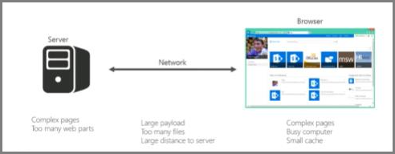
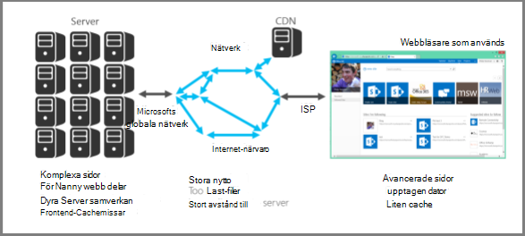

# Introduktion till prestanda justering för SharePoint Online

I den här artikeln förklaras vilka specifika aspekter du bör tänka på när du utformar sidor för bästa prestanda i SharePoint Online.
     
## SharePoint Online-statistik

Följande breda mått för SharePoint Online ger Real data om prestanda:
  
- Hur fasta sidor läses in
    
- Hur många rund resor som krävs per sida
    
- Problem med tjänsten
    
- Andra saker som orsakar prestanda försämring
    
### Slut satser som har nåtts på grund av data

Informationen säger att:
  
- De flesta sidorna fungerar bra på SharePoint Online.
    
- Icke anpassade sidor laddas snabbt.
    
- OneDrive för företag, grupp webbplatser och system sidor, till exempel _layouts etc., är snabbt att läsa in.
    
- De långsammast 1% av SharePoint Online-sidorna tar mer än 5 000 millisekunder att läsa in.
    
Ett enkelt benchmark-test du kan använda är att mäta prestanda genom att jämföra inläsnings tiden för din egen portal mot inläsnings tiden för OneDrive för företag – start sidan, eftersom det innehåller få anpassade funktioner. Det här är ofta det första steg supporten ber dig genomföra när du felsöker problem med nätverks prestanda.
  
## Använda ett vanligt användar konto när du kontrollerar prestanda

En administratör för en webbplats samling, webbplats ägare, redigerare eller deltagare tillhör ytterligare säkerhets grupper, har ytterligare behörigheter och kan därför innehålla ytterligare element som SharePoint läser in på en sida.
  
Det här gäller för SharePoint lokalt och SharePoint Online, men i ett lokalt scenario är skillnaderna inte lika lätt att notera som i SharePoint Online.
  
För att du ska kunna utvärdera hur en sida fungerar för användarna bör du använda ett vanligt användar konto för att undvika att läsa in redigerings kontroller och ytterligare trafik relaterade till säkerhets grupper.
  
## Anslutnings kategorier för prestanda justering

Du kan kategorisera anslutningar mellan servern och användaren i tre huvud komponenter. Tänk på följande när du utformar SharePoint Online-sidor för inläsning av laddnings tider.
  
- **Server** Servrar som Microsoft-värdar i Data Center.
    
- **Nätverk** Microsoft-nätverket, Internet och det lokala nätverket mellan data centret och dina användare.
    
- **Webbläsare** Där sidan laddas.
    
Inom dessa tre anslutningar är det vanligt vis fem skäl att orsaka 95% av långsamma sidor. Var och en av följande anledningar finns i den här artikeln:
  
- Navigerings problem
    
- Innehåll som lyfts upp
    
- Stora filer
    
- Många förfrågningar till servern
    
- Bearbetning av webb delar
    
### Server anslutning

Många av de problem som påverkar prestanda med SharePoint lokalt gäller även för SharePoint Online.
  
Som du skulle förvänta dig har du mycket mer kontroll över hur servrar fungerar med lokala SharePoint. Med SharePoint Online-saker är något annat. Det mer du gör med en server är det längre att ta en sida. Med SharePoint är det största culprit i detta hänseende komplexa sidor med flera webb delar.
  
SharePoint Server lokalt
  

  
SharePoint Online
  

  
Med SharePoint Online kan vissa sid förfrågningar faktiskt avsluta samtalen med flera servrar. Du kan få en matris med förfrågningar mellan servrar för en enskild begäran. Dessa interaktioner är dyra från ett sid inläsnings perspektiv och gör dem långsamt.
  
Här är några exempel på Server interaktion:
  
- Webben till SQL Servers
    
- Webb till program servrar
    
Det andra som kan sakta ner kommunikationen mellan servrar är cache-missar. Till skillnad från lokala SharePoint-servrar är det en väldigt tunn chans att du kommer att trycka på samma server för en sida som du har besökt tidigare; då görs föråldrad objektcache.
  
### Nätverks anslutning

Med lokal SharePoint som inte utnyttjar ett WAN kan du använda en snabb anslutning mellan data Center och slutanvändare. Vanligt vis är det lätt att hantera saker från ett nätverk.
  
Med SharePoint Online är det några fler faktorer att överväga, till exempel:
  
- Microsoft-nätverket
    
- Internet
    
- Internet leverantören
    
Oavsett vilken version av SharePoint (och vilket nätverk) du använder är det vanligt vis möjligt att nätverket är upptaget genom att göra följande:
  
- Stor nytto Last
    
- Många filer
    
- Stort fysiskt avstånd på servern
    
En funktion som du kan använda i SharePoint Online är Microsoft CDN (Content Delivery Network). Ett CDN är i stort sett en distribuerad samling servrar som distribueras i flera data Center. Med en CDN kan innehållet på sidor finnas på en server som är nära klienten även om klienten är långt borta från den ursprungliga SharePoint-servern. Microsoft kommer att använda mer i framtiden för att lagra lokala instanser av sidor som inte kan anpassas, till exempel start sidan för SharePoint Online-administratören. Mer information om CDN finns i avsnittet [innehålls leverans nätverk](content-delivery-networks.md).
  
Något som du måste känna till men kanske inte kan göra mycket om det är Internet leverantörens anslutnings hastighet. Ett enkelt Speed-testverktyg ger dig anslutnings hastigheten.
  
### Webb läsar anslutning

Det finns några saker du bör tänka på när det gäller webbläsare från ett prestanda perspektiv.
  
Att besöka komplexa sidor påverkar prestanda. De flesta webbläsare har bara ett litet cacheminne (runt 90MB), medan den genomsnittliga webb sidan normalt är cirka 1,6 MB. Det tar inte lång tid att komma igång.
  
Bandbredd kan också vara ett problem. Om en användare till exempel tittar på videoklipp i en annan session påverkar detta SharePoint-sidans prestanda. Även om du inte kan hindra användare från att strömma media kan du kontrol lera hur en sida laddas för användarna.
  
Läs följande artiklar för olika anpassnings tekniker för SharePoint Online och andra tips för att få optimal prestanda.
  
- [Navigerings alternativ för SharePoint Online](navigation-options-for-sharepoint-online.md)
    
- [Använda verktyget för nätverksdiagnostik för SharePoint Online](page-diagnostics-for-spo.md)
    
- [Bild optimering för SharePoint Online](image-optimization-for-sharepoint-online.md)
    
- [Fördröj inläsning av bilder och Java Script i SharePoint Online](delay-loading-images-and-javascript-in-sharepoint-online.md)
    
- [För minskning och buntar i SharePoint Online](minification-and-bundling-in-sharepoint-online.md)
    
- [Använda Office 365-innehålls leverans nätverk (CDN) med SharePoint Online](use-microsoft-365-cdn-with-spo.md)
    
- [Använda webb delen för innehålls sökning i stället för webb delen innehålls fråga för att förbättra prestanda i SharePoint Online](using-content-search-web-part-instead-of-content-query-web-part-to-improve-perfo.md)
    
- [Kapacitetsplanering och belastningstestning av SharePoint Online](capacity-planning-and-load-testing-sharepoint-online.md)
    
- [Diagnosticera prestanda problem med SharePoint Online](diagnosing-performance-issues-with-sharepoint-online.md)
    
- [Använda objektcachen med SharePoint Online](using-the-object-cache-with-sharepoint-online.md)
    
- [Så här gör du för att undvika begränsning eller blockering i SharePoint Online](https://msdn.microsoft.com/library/office/dn889829.aspx)
    

