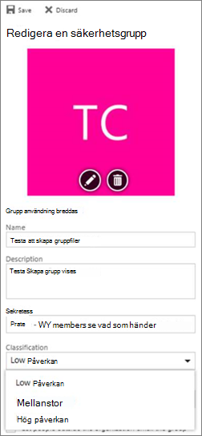

# <a name="manage-microsoft-365-groups-with-powershell"></a><span data-ttu-id="e2409-103">Hantera Microsoft 365-grupper med PowerShell</span><span class="sxs-lookup"><span data-stu-id="e2409-103">Manage Microsoft 365 Groups with PowerShell</span></span>

<span data-ttu-id="e2409-104">*Denna artikel gäller för både Microsoft 365 Enterprise och Office 365 Enterprise.*</span><span class="sxs-lookup"><span data-stu-id="e2409-104">*This article applies to both Microsoft 365 Enterprise and Office 365 Enterprise.*</span></span>

<span data-ttu-id="e2409-105">I den här artikeln beskrivs hur du utför vanliga administrativa uppgifter för grupper i Microsoft PowerShell.</span><span class="sxs-lookup"><span data-stu-id="e2409-105">This article provides the steps for doing common management tasks for Groups in Microsoft PowerShell.</span></span> <span data-ttu-id="e2409-106">Den innehåller även PowerShell-cmdlets för grupper.</span><span class="sxs-lookup"><span data-stu-id="e2409-106">It also lists the PowerShell cmdlets for Groups.</span></span> <span data-ttu-id="e2409-107">Mer information om hur du hanterar SharePoint-webbplatser finns [i Hantera SharePoint Online-webbplatser med PowerShell.](/sharepoint/manage-team-and-communication-sites-in-powershell)</span><span class="sxs-lookup"><span data-stu-id="e2409-107">For info about managing SharePoint sites, see [Manage SharePoint Online sites using PowerShell](/sharepoint/manage-team-and-communication-sites-in-powershell).</span></span>

## <a name="link-to-your-microsoft-365-groups-usage-guidelines"></a><span data-ttu-id="e2409-108">Länk till dina riktlinjer för användning av Microsoft 365 Grupper</span><span class="sxs-lookup"><span data-stu-id="e2409-108">Link to your Microsoft 365 Groups usage guidelines</span></span>
<span data-ttu-id="e2409-109"><a name="BK_LinkToGuideLines"> </a></span><span class="sxs-lookup"><span data-stu-id="e2409-109"><a name="BK_LinkToGuideLines"> </a></span></span>

<span data-ttu-id="e2409-110">När användare [skapar eller redigerar en grupp i Outlook](https://support.office.com/article/04d0c9cf-6864-423c-a380-4fa858f27102.aspx)kan du visa dem en länk till organisationens riktlinjer för användning.</span><span class="sxs-lookup"><span data-stu-id="e2409-110">When users [create or edit a group in Outlook](https://support.office.com/article/04d0c9cf-6864-423c-a380-4fa858f27102.aspx), you can show them a link to your organization's usage guidelines.</span></span> <span data-ttu-id="e2409-111">Det kan till exempel vara att ett visst prefix eller suffix ska läggas till i gruppnamnet.</span><span class="sxs-lookup"><span data-stu-id="e2409-111">For example, if you require a specific prefix or suffix to be added to a group name.</span></span>

<span data-ttu-id="e2409-112">Använd Azure Active Directory (Azure AD) PowerShell för att få användarna att peka på organisationens riktlinjer för användning av Microsoft 365-grupper.</span><span class="sxs-lookup"><span data-stu-id="e2409-112">Use the Azure Active Directory (Azure AD) PowerShell to point your users to your organization's usage guidelines for Microsoft 365 groups.</span></span> <span data-ttu-id="e2409-113">Läs [Azure Active Directory-cmdlets](/azure/active-directory/enterprise-users/groups-settings-cmdlets) för att konfigurera  gruppinställningar och följ stegen i Skapa inställningar på katalognivån för att definiera hyperlänken till riktlinje för användning.</span><span class="sxs-lookup"><span data-stu-id="e2409-113">Check out [Azure Active Directory cmdlets for configuring group settings](/azure/active-directory/enterprise-users/groups-settings-cmdlets) and follow the steps in the **Create settings at the directory level** to define the usage guideline hyperlink.</span></span> <span data-ttu-id="e2409-114">När du kör cmdleten AAD ser användarna en länk till riktlinjerna när de skapar eller redigerar en grupp i Outlook.</span><span class="sxs-lookup"><span data-stu-id="e2409-114">Once you run the AAD cmdlet, user's will see the link to your guidelines when they create or edit a group in Outlook.</span></span>


## <a name="allow-users-to-send-as-the-microsoft-365-group"></a><span data-ttu-id="e2409-117">Tillåt användare att skicka som Microsoft 365-gruppen</span><span class="sxs-lookup"><span data-stu-id="e2409-117">Allow users to Send as the Microsoft 365 Group</span></span>
<span data-ttu-id="e2409-118"><a name="BK_LinkToGuideLines"> </a></span><span class="sxs-lookup"><span data-stu-id="e2409-118"><a name="BK_LinkToGuideLines"> </a></span></span>

<span data-ttu-id="e2409-119">Om du vill aktivera Microsoft 365-grupper till "Skicka som" använder du [cmdletarna Add-RecipientPermission](/powershell/module/exchange/add-recipientpermission) och [Get-RecipientPermission](/powershell/module/exchange/get-recipientpermission) för att konfigurera det.</span><span class="sxs-lookup"><span data-stu-id="e2409-119">If you want to enable your Microsoft 365 groups to "Send As", use the [Add-RecipientPermission](/powershell/module/exchange/add-recipientpermission) and [Get-RecipientPermission](/powershell/module/exchange/get-recipientpermission) cmdlets to configure this.</span></span> <span data-ttu-id="e2409-120">När du har aktiverar den här inställningen kan Microsoft 365-gruppanvändare använda Outlook eller Outlook på webben för att skicka och svara på e-post som Microsoft 365-gruppen.</span><span class="sxs-lookup"><span data-stu-id="e2409-120">Once you enable this setting, Microsoft 365 group users can use Outlook or Outlook on the web to send and reply to email as the Microsoft 365 group.</span></span> <span data-ttu-id="e2409-121">Användare kan gå till gruppen, skapa ett nytt e-postmeddelande och ändra fältet "Skicka som" till gruppens e-postadress.</span><span class="sxs-lookup"><span data-stu-id="e2409-121">Users can go to the group, create a new email, and change the "Send As" field to the group's email address.</span></span>

<span data-ttu-id="e2409-122">([Du kan också göra detta i administrationscentret för Exchange](/office365/admin/create-groups/allow-members-to-send-as-or-send-on-behalf-of-group).)</span><span class="sxs-lookup"><span data-stu-id="e2409-122">([You can also do this in the Exchange Admin Center](/office365/admin/create-groups/allow-members-to-send-as-or-send-on-behalf-of-group).)</span></span>

<span data-ttu-id="e2409-123">Använd följande skript, som ersätter med alias för den grupp som du vill uppdatera och med alias för den användare *\<GroupAlias\>* som du vill tilldela *\<UserAlias\>* behörigheter.</span><span class="sxs-lookup"><span data-stu-id="e2409-123">Use the following script, replacing *\<GroupAlias\>* with the alias of the group that you want to update, and *\<UserAlias\>* with the alias of the user to whom you want to grant permissions.</span></span> <span data-ttu-id="e2409-124">[Anslut till Exchange Online PowerShell för att](/powershell/exchange/connect-to-exchange-online-powershell) köra det här skriptet.</span><span class="sxs-lookup"><span data-stu-id="e2409-124">[Connect to Exchange Online PowerShell](/powershell/exchange/connect-to-exchange-online-powershell) to run this script.</span></span>

```PowerShell
$groupAlias = "<GroupAlias>"
$userAlias = "<UserAlias>"
$groupsRecipientDetails = Get-Recipient -RecipientTypeDetails groupmailbox -Identity $groupAlias

Add-RecipientPermission -Identity $groupsRecipientDetails.Name -Trustee $userAlias -AccessRights SendAs
```

<span data-ttu-id="e2409-125">När cmdleten körs kan användare gå till Outlook eller Outlook på webben för att skicka som gruppen genom att lägga till gruppens e-postadress **i fältet** Från.</span><span class="sxs-lookup"><span data-stu-id="e2409-125">Once the cmdlet is executed, users can go to Outlook or Outlook on the web to send as the group, by adding the group email address to the **From** field.</span></span>

## <a name="create-classifications-for-microsoft-365-groups-in-your-organization"></a><span data-ttu-id="e2409-126">Skapa klassificeringar för Microsoft 365-grupper i din organisation</span><span class="sxs-lookup"><span data-stu-id="e2409-126">Create classifications for Microsoft 365 Groups in your organization</span></span>

<span data-ttu-id="e2409-127">Du kan skapa känslighetsetiketter som användarna i organisationen kan ange när de skapar en Microsoft 365-grupp.</span><span class="sxs-lookup"><span data-stu-id="e2409-127">You can create sensitivity labels that the users in your organization can set when they create a Microsoft 365 Group.</span></span> <span data-ttu-id="e2409-128">Om du vill klassificera grupper rekommenderar vi att du använder känslighetsetiketter i stället för den tidigare klassificeringsfunktionen för grupper.</span><span class="sxs-lookup"><span data-stu-id="e2409-128">If you want to classify groups, we recommend using sensitivity labels instead of the previous groups classification feature.</span></span> <span data-ttu-id="e2409-129">Mer information om hur du använder känslighetsetiketter finns i Använda känslighetsetiketter för att skydda innehåll i [Microsoft Teams, Microsoft 365-grupper och SharePoint-webbplatser.](../compliance/sensitivity-labels-teams-groups-sites.md)</span><span class="sxs-lookup"><span data-stu-id="e2409-129">For information about using sensitivity labels, see [Use sensitivity labels to protect content in Microsoft Teams, Microsoft 365 groups, and SharePoint sites](../compliance/sensitivity-labels-teams-groups-sites.md).</span></span>

> [!IMPORTANT]
> <span data-ttu-id="e2409-130">Om du använder klassificeringsetiketter är de inte längre tillgängliga för användare som skapar grupper när känslighetsetiketter har aktiverats.</span><span class="sxs-lookup"><span data-stu-id="e2409-130">If you are currently using classification labels, they will no longer be available to users who create groups once sensitivity labels are enabled.</span></span>

<span data-ttu-id="e2409-131">Du kan fortfarande använda den tidigare klassificeringsfunktionen för grupper.</span><span class="sxs-lookup"><span data-stu-id="e2409-131">You can still use the previous groups classification feature.</span></span> <span data-ttu-id="e2409-132">Du kan skapa klassificeringar som användarna i organisationen kan ange när de skapar en Microsoft 365-grupp.</span><span class="sxs-lookup"><span data-stu-id="e2409-132">You can create classifications that the users in your organization can set when they create an Microsoft 365 Group.</span></span> <span data-ttu-id="e2409-133">Du kan till exempel tillåta att användare anger "Standard", "Hemlig" och "Top Secret" för grupper som de skapar.</span><span class="sxs-lookup"><span data-stu-id="e2409-133">For example, you can allow users to set "Standard", "Secret", and "Top Secret" on groups they create.</span></span> <span data-ttu-id="e2409-134">Gruppklassificeringarna anges inte som standard och du måste skapa dem för att användarna ska kunna ange dem.</span><span class="sxs-lookup"><span data-stu-id="e2409-134">Group classifications aren't set by default and you need to create it in order for your users to set it.</span></span> <span data-ttu-id="e2409-135">Använd Azure Active Directory PowerShell för att få användarna att peka på organisationens riktlinjer för användning av Microsoft 365-grupper.</span><span class="sxs-lookup"><span data-stu-id="e2409-135">Use Azure Active Directory PowerShell to point your users to your organization's usage guidelines for Microsoft 365 Groups.</span></span>

<span data-ttu-id="e2409-136">Läs [Azure Active Directory-cmdlets](/azure/active-directory/users-groups-roles/groups-settings-cmdlets) för att konfigurera  gruppinställningar och följ stegen i Skapa inställningar på katalognivån för att definiera klassificeringen för Microsoft 365-grupper.</span><span class="sxs-lookup"><span data-stu-id="e2409-136">Check out [Azure Active Directory cmdlets for configuring group settings](/azure/active-directory/users-groups-roles/groups-settings-cmdlets) and follow the steps in the **Create settings at the directory level** to define the classification for Microsoft 365 Groups.</span></span>

```powershell
$setting["ClassificationList"] = "Low Impact, Medium Impact, High Impact"
```

<span data-ttu-id="e2409-137">För att koppla en beskrivning till varje klassificering kan du använda inställningsattributet *Klassificeringsbeskrivningar.*</span><span class="sxs-lookup"><span data-stu-id="e2409-137">In order to associate a description to each classification you can use the settings attribute  *ClassificationDescriptions* to define.</span></span>

```powershell
$setting["ClassificationDescriptions"] ="Classification:Description,Classification:Description"
```

<span data-ttu-id="e2409-138">där Klassificering matchar strängarna i Klassificeringslistan.</span><span class="sxs-lookup"><span data-stu-id="e2409-138">where Classification matches the strings in the ClassificationList.</span></span>

<span data-ttu-id="e2409-139">Exempel:</span><span class="sxs-lookup"><span data-stu-id="e2409-139">Example:</span></span>

```powershell
$setting["ClassificationDescriptions"] = "Low Impact: General communication, Medium Impact: Company internal data , High Impact: Data that has regulatory requirements"
```

<span data-ttu-id="e2409-140">När du har kört Azure Active Directory-cmdleten ovan för att ange din klassificering kör du cmdleten [Set-UnifiedGroup](/powershell/module/exchange/Set-UnifiedGroup) om du vill ange klassificeringen för en viss grupp.</span><span class="sxs-lookup"><span data-stu-id="e2409-140">After you run the above Azure Active Directory cmdlet to set your classification, run the [Set-UnifiedGroup](/powershell/module/exchange/Set-UnifiedGroup) cmdlet if you want to set the classification for a specific group.</span></span>

```powershell
Set-UnifiedGroup <LowImpactGroup@constoso.com> -Classification <LowImpact>
```

<span data-ttu-id="e2409-141">Eller skapa en ny grupp med en klassificering.</span><span class="sxs-lookup"><span data-stu-id="e2409-141">Or create a new group with a classification.</span></span>

```powershell
New-UnifiedGroup <HighImpactGroup@constoso.com> -Classification <HighImpact> -AccessType <Public>
```

<span data-ttu-id="e2409-142">Läs [Använda PowerShell med Exchange Online](/powershell/exchange/exchange-online-powershell) och [Anslut till Exchange Online PowerShell](/powershell/exchange/connect-to-exchange-online-powershell) om du vill ha mer information om hur du använder Exchange Online PowerShell.</span><span class="sxs-lookup"><span data-stu-id="e2409-142">Check out [Using PowerShell with Exchange Online](/powershell/exchange/exchange-online-powershell) and [Connect to Exchange Online PowerShell](/powershell/exchange/connect-to-exchange-online-powershell) for more details on using Exchange Online PowerShell.</span></span>

<span data-ttu-id="e2409-143">När de här inställningarna har aktiverats kan gruppägaren välja en klassificering från listmenyn i Outlook på webben och Outlook och spara den från sidan **Redigera** grupp.</span><span class="sxs-lookup"><span data-stu-id="e2409-143">Once these settings are enabled, the group owner will be able to choose a classification from the drop down menu in Outlook on the Web and Outlook, and save it from the **Edit** group page.</span></span>



## <a name="hide-microsoft-365-groups-from-the-global-address-list"></a><span data-ttu-id="e2409-145">Dölj Microsoft 365-grupper i den globala adresslistan.</span><span class="sxs-lookup"><span data-stu-id="e2409-145">Hide Microsoft 365 Groups from the global address list.</span></span>
<span data-ttu-id="e2409-146"><a name="BKMK_CreateClassification"> </a></span><span class="sxs-lookup"><span data-stu-id="e2409-146"><a name="BKMK_CreateClassification"> </a></span></span>

<span data-ttu-id="e2409-147">Du kan ange om en Microsoft 365-grupp ska visas i den globala adresslistan (GAL) och andra listor i organisationen.</span><span class="sxs-lookup"><span data-stu-id="e2409-147">You can specify whether a Microsoft 365 Group appears in the global address list (GAL) and other lists in your organization.</span></span> <span data-ttu-id="e2409-148">Om du till exempel har en juridisk avdelningsgrupp som du inte vill ska visas i adresslistan kan du hindra att den gruppen visas i GAL.</span><span class="sxs-lookup"><span data-stu-id="e2409-148">For example, if you have a legal department group that you don't want to show up in the address list, you can stop that group from appearing in the GAL.</span></span> <span data-ttu-id="e2409-149">Kör cmdleten Set-Unified Grupp för att dölja gruppen från adresslistan så här:</span><span class="sxs-lookup"><span data-stu-id="e2409-149">Run the Set-Unified Group cmdlet to hide the group from the address list like this:</span></span>

```powershell
Set-UnifiedGroup -Identity "Legal Department" -HiddenFromAddressListsEnabled $true
```

## <a name="allow-only-internal-users-to-send-message-to-microsoft-365-groups"></a><span data-ttu-id="e2409-150">Tillåt endast interna användare att skicka meddelanden till Microsoft 365-grupper</span><span class="sxs-lookup"><span data-stu-id="e2409-150">Allow only internal users to send message to Microsoft 365 Groups</span></span>
<span data-ttu-id="e2409-151"><a name="BKMK_CreateClassification"> </a></span><span class="sxs-lookup"><span data-stu-id="e2409-151"><a name="BKMK_CreateClassification"> </a></span></span>

<span data-ttu-id="e2409-152">Om du inte vill att användare från andra organisationer ska skicka e-postmeddelanden till en Microsoft 365-grupp kan du ändra inställningarna för den gruppen.</span><span class="sxs-lookup"><span data-stu-id="e2409-152">If you don't want users from other organizations to send emails to a Microsoft 365 Group, you can change the settings for that group.</span></span> <span data-ttu-id="e2409-153">Då kan endast interna användare skicka e-postmeddelanden till gruppen.</span><span class="sxs-lookup"><span data-stu-id="e2409-153">It will allow only internal users to send an email to your group.</span></span> <span data-ttu-id="e2409-154">Om en extern användare försöker skicka ett meddelande till den gruppen avvisas det.</span><span class="sxs-lookup"><span data-stu-id="e2409-154">If an external user tries to send a message to that group, it will be rejected.</span></span>

<span data-ttu-id="e2409-155">Kör cmdleten Set-UnifiedGroup för att uppdatera den här inställningen, så här:</span><span class="sxs-lookup"><span data-stu-id="e2409-155">Run the Set-UnifiedGroup cmdlet to update this setting, like this:</span></span>

```powershell
Set-UnifiedGroup -Identity "Internal senders only" -RequireSenderAuthenticationEnabled $true
```

## <a name="add-mailtips-to-microsoft-365-groups"></a><span data-ttu-id="e2409-156">Lägga till e-posttips i Microsoft 365-grupper</span><span class="sxs-lookup"><span data-stu-id="e2409-156">Add MailTips to Microsoft 365 Groups</span></span>
<span data-ttu-id="e2409-157"><a name="BKMK_CreateClassification"> </a></span><span class="sxs-lookup"><span data-stu-id="e2409-157"><a name="BKMK_CreateClassification"> </a></span></span>

<span data-ttu-id="e2409-158">När en avsändare försöker skicka ett e-postmeddelande till en Microsoft 365-grupp visas ett e-posttips för dem.</span><span class="sxs-lookup"><span data-stu-id="e2409-158">Whenever a sender tries to send an email to a Microsoft 365 Group, a MailTip can be shown to them.</span></span>

<span data-ttu-id="e2409-159">Kör cmdleten Set-Unified Grupp för att lägga till ett e-posttips i gruppen:</span><span class="sxs-lookup"><span data-stu-id="e2409-159">Run the Set-Unified Group cmdlet to add a mailTip to the group:</span></span>

```powershell
Set-UnifiedGroup -Identity "MailTip Group" -MailTip "This group has a MailTip"
```

<span data-ttu-id="e2409-160">Tillsammans med e-posttips kan du också ange MailTipTranslations, som anger ytterligare språk för e-posttipset.</span><span class="sxs-lookup"><span data-stu-id="e2409-160">Along with MailTip, you can also set MailTipTranslations, which specifies additional languages for the MailTip.</span></span> <span data-ttu-id="e2409-161">Anta att du vill ha den spanska översättningen och kör sedan följande kommando:</span><span class="sxs-lookup"><span data-stu-id="e2409-161">Suppose you want to have the Spanish translation, then run the following command:</span></span>

```powershell
Set-UnifiedGroup -Identity "MailaTip Group" -MailTip "This group has a MailTip" -MailTipTranslations "@{Add="ES:Esta caja no se supervisa."
```

## <a name="change-the-display-name-of-the-microsoft-365-group"></a><span data-ttu-id="e2409-162">Ändra visningsnamnet för Microsoft 365-gruppen</span><span class="sxs-lookup"><span data-stu-id="e2409-162">Change the display name of the Microsoft 365 Group</span></span>

<span data-ttu-id="e2409-163">Visningsnamnet anger namnet på Microsoft 365-gruppen.</span><span class="sxs-lookup"><span data-stu-id="e2409-163">The display name specifies the name of the Microsoft 365 Group.</span></span> <span data-ttu-id="e2409-164">Du kan se det här namnet i administrationscentret för Exchange eller i administrationscentret för Microsoft 365.</span><span class="sxs-lookup"><span data-stu-id="e2409-164">You can see this name in your exchange admin center or Microsoft 365 admin center.</span></span> <span data-ttu-id="e2409-165">Du kan redigera visningsnamnet för gruppen eller tilldela ett visningsnamn till en befintlig Microsoft 365-grupp genom att köra kommandot Set-UnifiedGroup namn:</span><span class="sxs-lookup"><span data-stu-id="e2409-165">You can edit the display name of the group or assign a display name to an existing Microsoft 365 Group by running the Set-UnifiedGroup command:</span></span>

```powershell
Set-UnifiedGroup -Identity "mygroup@contoso.com" -DisplayName "My new group"
```

## <a name="change-the-default-setting-of-microsoft-365-groups-for-outlook-to-public-or-private"></a><span data-ttu-id="e2409-166">Ändra standardinställningen för Microsoft 365-grupper för Outlook till offentlig eller privat</span><span class="sxs-lookup"><span data-stu-id="e2409-166">Change the default setting of Microsoft 365 Groups for Outlook to Public or Private</span></span>
<span data-ttu-id="e2409-167"><a name="BKMK_CreateClassification"> </a></span><span class="sxs-lookup"><span data-stu-id="e2409-167"><a name="BKMK_CreateClassification"> </a></span></span>

<span data-ttu-id="e2409-168">Microsoft 365-grupper i Outlook skapas som standard som privata.</span><span class="sxs-lookup"><span data-stu-id="e2409-168">Microsoft 365 Groups in Outlook are created as Private by default.</span></span> <span data-ttu-id="e2409-169">Om din organisation vill att Microsoft 365 Grupper ska skapas som offentliga som standard (eller tillbaka till privata) kan du använda följande syntax för PowerShell-cmdlet:</span><span class="sxs-lookup"><span data-stu-id="e2409-169">If your organization wants Microsoft 365 Groups to be created as Public by default (or back to Private), use this PowerShell cmdlet syntax:</span></span>

 `Set-OrganizationConfig -DefaultGroupAccessType Public`

<span data-ttu-id="e2409-170">Så här anger du den till Privat:</span><span class="sxs-lookup"><span data-stu-id="e2409-170">To set to Private:</span></span>

 `Set-OrganizationConfig -DefaultGroupAccessType Private`

<span data-ttu-id="e2409-171">Så här verifierar du inställningen:</span><span class="sxs-lookup"><span data-stu-id="e2409-171">To verify the setting:</span></span>

 `Get-OrganizationConfig | ft DefaultGroupAccessType`

<span data-ttu-id="e2409-172">Mer information finns i [Set-OrganizationConfig](/powershell/module/exchange/set-organizationconfig) och [Get-OrganizationConfig.](/powershell/module/exchange/get-organizationconfig)</span><span class="sxs-lookup"><span data-stu-id="e2409-172">To learn more, see [Set-OrganizationConfig](/powershell/module/exchange/set-organizationconfig) and [Get-OrganizationConfig](/powershell/module/exchange/get-organizationconfig).</span></span>

## <a name="microsoft-365-groups-cmdlets"></a><span data-ttu-id="e2409-173">Microsoft 365 Groups-cmdlets</span><span class="sxs-lookup"><span data-stu-id="e2409-173">Microsoft 365 Groups cmdlets</span></span>

<span data-ttu-id="e2409-174">Följande cmdlets kan användas med Microsoft 365 Groups.</span><span class="sxs-lookup"><span data-stu-id="e2409-174">The following cmdlets can be used with Microsoft 365 Groups.</span></span>

|<span data-ttu-id="e2409-175">**Cmdlet-namn**</span><span class="sxs-lookup"><span data-stu-id="e2409-175">**Cmdlet name**</span></span>|<span data-ttu-id="e2409-176">**Beskrivning**</span><span class="sxs-lookup"><span data-stu-id="e2409-176">**Description**</span></span>|
|:-----|:-----|
|[<span data-ttu-id="e2409-177">Get-UnifiedGroup</span><span class="sxs-lookup"><span data-stu-id="e2409-177">Get-UnifiedGroup</span></span>](/powershell/module/exchange/get-unifiedgroup) <br/> |<span data-ttu-id="e2409-178">Använd denna cmdlet för att slå upp befintliga Microsoft 365-grupper och för att visa egenskaper för gruppobjektet</span><span class="sxs-lookup"><span data-stu-id="e2409-178">Use this cmdlet to look up existing Microsoft 365 Groups, and to view properties of the group object</span></span>  <br/> |
|[<span data-ttu-id="e2409-179">Set-UnifiedGroup</span><span class="sxs-lookup"><span data-stu-id="e2409-179">Set-UnifiedGroup</span></span>](/powershell/module/exchange/set-unifiedgroup) <br/> |<span data-ttu-id="e2409-180">Uppdatera egenskaperna för en viss Microsoft 365-grupp</span><span class="sxs-lookup"><span data-stu-id="e2409-180">Update the properties of a specific Microsoft 365 Group</span></span>  <br/> |
|[<span data-ttu-id="e2409-181">New-UnifiedGroup</span><span class="sxs-lookup"><span data-stu-id="e2409-181">New-UnifiedGroup</span></span>](/powershell/module/exchange/new-unifiedgroup) <br/> |<span data-ttu-id="e2409-182">Skapa en ny Microsoft 365-grupp.</span><span class="sxs-lookup"><span data-stu-id="e2409-182">Create a new Microsoft 365 Group.</span></span> <span data-ttu-id="e2409-183">Den här cmdleten innehåller en minimal uppsättning parametrar.</span><span class="sxs-lookup"><span data-stu-id="e2409-183">This cmdlet provides a minimal set of parameters.</span></span> <span data-ttu-id="e2409-184">Om du vill ange värden för utökade egenskaper använder Set-UnifiedGroup när du har skapat den nya gruppen</span><span class="sxs-lookup"><span data-stu-id="e2409-184">To set values for extended properties, use Set-UnifiedGroup after creating the new group</span></span>  <br/> |
|[<span data-ttu-id="e2409-185">Remove-UnifiedGroup</span><span class="sxs-lookup"><span data-stu-id="e2409-185">Remove-UnifiedGroup</span></span>](/powershell/module/exchange/remove-unifiedgroup) <br/> |<span data-ttu-id="e2409-186">Ta bort en befintlig Microsoft 365-grupp</span><span class="sxs-lookup"><span data-stu-id="e2409-186">Delete an existing Microsoft 365 Group</span></span>  <br/> |
|[<span data-ttu-id="e2409-187">Get-UnifiedGroupLinks</span><span class="sxs-lookup"><span data-stu-id="e2409-187">Get-UnifiedGroupLinks</span></span>](/powershell/module/exchange/get-unifiedgrouplinks) <br/> |<span data-ttu-id="e2409-188">Hämta information om medlemskap och ägare för en Microsoft 365-grupp</span><span class="sxs-lookup"><span data-stu-id="e2409-188">Retrieve membership and owner information for a Microsoft 365 Group</span></span>  <br/> |
|[<span data-ttu-id="e2409-189">Add-UnifiedGroupLinks</span><span class="sxs-lookup"><span data-stu-id="e2409-189">Add-UnifiedGroupLinks</span></span>](/powershell/module/exchange/add-unifiedgrouplinks) <br/> |<span data-ttu-id="e2409-190">Lägga till medlemmar, ägare och prenumeranter i en befintlig Microsoft 365-grupp</span><span class="sxs-lookup"><span data-stu-id="e2409-190">Add members, owners, and subscribers to an existing Microsoft 365 Group</span></span> <br/> |
|[<span data-ttu-id="e2409-191">Remove-UnifiedGroupLinks</span><span class="sxs-lookup"><span data-stu-id="e2409-191">Remove-UnifiedGroupLinks</span></span>](/powershell/module/exchange/remove-unifiedgrouplinks) <br/> |<span data-ttu-id="e2409-192">Ta bort ägare och medlemmar från en befintlig Microsoft 365-grupp</span><span class="sxs-lookup"><span data-stu-id="e2409-192">Remove owners and members from an existing Microsoft 365 Group</span></span>  <br/> |
|[<span data-ttu-id="e2409-193">Get-UserPhoto</span><span class="sxs-lookup"><span data-stu-id="e2409-193">Get-UserPhoto</span></span>](/powershell/module/exchange/get-userphoto) <br/> |<span data-ttu-id="e2409-194">Används för att visa information om användarfotot som är kopplat till ett konto.</span><span class="sxs-lookup"><span data-stu-id="e2409-194">Used to view information about the user photo associated with an account.</span></span> <span data-ttu-id="e2409-195">Användarfoton lagras i Active Directory</span><span class="sxs-lookup"><span data-stu-id="e2409-195">User photos are stored in Active Directory</span></span>  <br/> |
|[<span data-ttu-id="e2409-196">Set-UserPhoto</span><span class="sxs-lookup"><span data-stu-id="e2409-196">Set-UserPhoto</span></span>](/powershell/module/exchange/set-userphoto) <br/> |<span data-ttu-id="e2409-197">Används för att koppla ett användarfoto till ett konto.</span><span class="sxs-lookup"><span data-stu-id="e2409-197">Used to associate a user photo with an account.</span></span> <span data-ttu-id="e2409-198">Användarfoton lagras i Active Directory</span><span class="sxs-lookup"><span data-stu-id="e2409-198">User photos are stored in Active Directory</span></span>  <br/> |
|[<span data-ttu-id="e2409-199">Remove-UserPhoto</span><span class="sxs-lookup"><span data-stu-id="e2409-199">Remove-UserPhoto</span></span>](/powershell/module/exchange/remove-userphoto) <br/> |<span data-ttu-id="e2409-200">Ta bort fotot för en Microsoft 365-grupp</span><span class="sxs-lookup"><span data-stu-id="e2409-200">Remove the photo for an Microsoft 365 Group</span></span>  <br/> |

## <a name="related-topics"></a><span data-ttu-id="e2409-201">Relaterade ämnen</span><span class="sxs-lookup"><span data-stu-id="e2409-201">Related topics</span></span>

[<span data-ttu-id="e2409-202">Uppgradera distributionslistor till Microsoft 365-grupper</span><span class="sxs-lookup"><span data-stu-id="e2409-202">Upgrade distribution lists to Microsoft 365 Groups</span></span>](/office365/admin/manage/upgrade-distribution-lists)

[<span data-ttu-id="e2409-203">Hantera vilka som kan skapa Microsoft 365 Grupper</span><span class="sxs-lookup"><span data-stu-id="e2409-203">Manage who can create Microsoft 365 Groups</span></span>](/office365/admin/create-groups/manage-creation-of-groups)

[<span data-ttu-id="e2409-204">Hantera gäståtkomst till Microsoft 365-grupper</span><span class="sxs-lookup"><span data-stu-id="e2409-204">Manage guest access to Microsoft 365 Groups</span></span>](https://support.office.com/article/bfc7a840-868f-4fd6-a390-f347bf51aff6)

[<span data-ttu-id="e2409-205">Ändra statiska gruppmedlemskap till dynamiskt i</span><span class="sxs-lookup"><span data-stu-id="e2409-205">Change static group membership to dynamic in</span></span>](/azure/active-directory/users-groups-roles/groups-change-type)