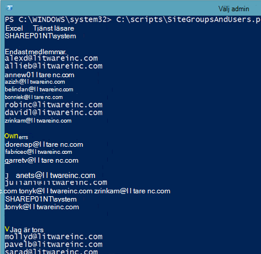

# <a name="manage-sharepoint-online-site-groups-with-powershell"></a><span data-ttu-id="4d761-103">Hantera SharePoint Online-webbplatsgrupper med PowerShell</span><span class="sxs-lookup"><span data-stu-id="4d761-103">Manage SharePoint Online site groups with PowerShell</span></span>

<span data-ttu-id="4d761-104">*Denna artikel gäller för både Microsoft 365 Enterprise och Office 365 Enterprise.*</span><span class="sxs-lookup"><span data-stu-id="4d761-104">*This article applies to both Microsoft 365 Enterprise and Office 365 Enterprise.*</span></span>

<span data-ttu-id="4d761-105">Även om du kan använda administrationscentret för Microsoft 365 kan du också använda PowerShell för Microsoft 365 för att hantera dina SharePoint Online-webbplatsgrupper.</span><span class="sxs-lookup"><span data-stu-id="4d761-105">Although you can use the Microsoft 365 admin center, you can also use PowerShell for Microsoft 365 to manage your SharePoint Online site groups.</span></span>

## <a name="before-you-begin"></a><span data-ttu-id="4d761-106">Innan du börjar</span><span class="sxs-lookup"><span data-stu-id="4d761-106">Before you begin</span></span>

<span data-ttu-id="4d761-107">Procedurerna i den här artikeln kräver att du ansluter till SharePoint Online.</span><span class="sxs-lookup"><span data-stu-id="4d761-107">The procedures in this article require you to connect to SharePoint Online.</span></span> <span data-ttu-id="4d761-108">Instruktioner finns i [Ansluta till SharePoint Online PowerShell.](/powershell/sharepoint/sharepoint-online/connect-sharepoint-online?view=sharepoint-ps)</span><span class="sxs-lookup"><span data-stu-id="4d761-108">For instructions, see [Connect to SharePoint Online PowerShell](/powershell/sharepoint/sharepoint-online/connect-sharepoint-online?view=sharepoint-ps).</span></span>

## <a name="view-sharepoint-online-with-powershell-for-microsoft-365"></a><span data-ttu-id="4d761-109">Visa SharePoint Online med PowerShell för Microsoft 365</span><span class="sxs-lookup"><span data-stu-id="4d761-109">View SharePoint Online with PowerShell for Microsoft 365</span></span>

<span data-ttu-id="4d761-110">I administrationscentret för SharePoint Online finns det några lättanvända metoder för att hantera webbplatsgrupper.</span><span class="sxs-lookup"><span data-stu-id="4d761-110">The SharePoint Online admin center has some easy-to-use methods for managing site groups.</span></span> <span data-ttu-id="4d761-111">Anta till exempel att du vill titta på grupperna och gruppmedlemmarna för `https://litwareinc.sharepoint.com/sites/finance` webbplatsen.</span><span class="sxs-lookup"><span data-stu-id="4d761-111">For example, suppose you want to look at the groups, and the group members, for the `https://litwareinc.sharepoint.com/sites/finance` site.</span></span> <span data-ttu-id="4d761-112">Det här måste du göra:</span><span class="sxs-lookup"><span data-stu-id="4d761-112">Here's what you have to do to:</span></span>

1. <span data-ttu-id="4d761-113">I administrationscentret för SharePoint klickar du **på Aktiva** webbplatser och sedan på webbplatsens URL.</span><span class="sxs-lookup"><span data-stu-id="4d761-113">From the SharePoint admin center, click **Active sites**, and then click the URL of the site.</span></span>
2. <span data-ttu-id="4d761-114">Klicka på ikonen Inställningar (längst **upp** till höger på sidan) och klicka sedan på **Webbplatsbehörigheter.**</span><span class="sxs-lookup"><span data-stu-id="4d761-114">On the site page, click the **Settings** icon (located in the upper right-hand corner of the page), and then click **Site permissions**.</span></span>

<span data-ttu-id="4d761-115">Upprepa sedan processen för nästa webbplats som du vill titta på.</span><span class="sxs-lookup"><span data-stu-id="4d761-115">And then repeat the process for the next site you want to look at.</span></span>

<span data-ttu-id="4d761-116">För att få en lista över grupper med PowerShell för Microsoft 365 kan du använda följande kommandon:</span><span class="sxs-lookup"><span data-stu-id="4d761-116">To get a list of the groups with PowerShell for Microsoft 365, you can use the following commands:</span></span>

```powershell
$siteURL = "https://litwareinc.sharepoint.com/sites/finance"
$x = Get-SPOSiteGroup -Site $siteURL
foreach ($y in $x)
    {
        Write-Host $y.Title -ForegroundColor "Yellow"
        Get-SPOSiteGroup -Site $siteURL -Group $y.Title | Select-Object -ExpandProperty Users
        Write-Host
    }
```

<span data-ttu-id="4d761-117">Det finns två sätt att köra den här kommandouppsättningen i kommandotolken för SharePoint Online Management Shell:</span><span class="sxs-lookup"><span data-stu-id="4d761-117">There are two ways to run this command set in the SharePoint Online Management Shell command prompt:</span></span>

- <span data-ttu-id="4d761-118">Kopiera kommandona till Anteckningar (eller någon annan textredigerare), ändra värdet för $siteURL-variabeln, markera kommandona och klistra in dem i kommandotolken i SharePoint Online Management Shell. </span><span class="sxs-lookup"><span data-stu-id="4d761-118">Copy the commands into Notepad (or another text editor), modify the value of the **$siteURL** variable, select the commands, and then paste them into the SharePoint Online Management Shell command prompt.</span></span> <span data-ttu-id="4d761-119">När du gör det slutar PowerShell när du uppmanas att **>>** göra det.</span><span class="sxs-lookup"><span data-stu-id="4d761-119">When you do, PowerShell will stop at a **>>** prompt.</span></span> <span data-ttu-id="4d761-120">Tryck på Retur för att köra `foreach` kommandot.</span><span class="sxs-lookup"><span data-stu-id="4d761-120">Press Enter to execute the `foreach` command.</span></span><br/>
- <span data-ttu-id="4d761-121">Kopiera kommandona till Anteckningar (eller någon annan textredigerare), ändra värdet för **$siteURL-variabeln** och spara sedan textfilen med ett namn och filnamnstillägget .ps1 i en lämplig mapp.</span><span class="sxs-lookup"><span data-stu-id="4d761-121">Copy the commands into Notepad (or another text editor), modify the value of the **$siteURL** variable, and then save this text file with a name and the .ps1 extension in a suitable folder.</span></span> <span data-ttu-id="4d761-122">Kör sedan skriptet från kommandotolken i SharePoint Online Management Shell genom att ange dess sökväg och filnamn.</span><span class="sxs-lookup"><span data-stu-id="4d761-122">Next, run the script from the SharePoint Online Management Shell command prompt by specifying its path and file name.</span></span> <span data-ttu-id="4d761-123">Här är ett exempelkommando:</span><span class="sxs-lookup"><span data-stu-id="4d761-123">Here is an example command:</span></span>

```powershell
C:\Scripts\SiteGroupsAndUsers.ps1
```

<span data-ttu-id="4d761-124">I båda fallen bör du se något som liknar det här:</span><span class="sxs-lookup"><span data-stu-id="4d761-124">In both cases, you should see something similar to this:</span></span>



<span data-ttu-id="4d761-126">Det här är alla grupper som har skapats för webbplatsen `https://litwareinc.sharepoint.com/sites/finance` och alla användare som tilldelats grupperna.</span><span class="sxs-lookup"><span data-stu-id="4d761-126">These are all the groups that have been created for the site `https://litwareinc.sharepoint.com/sites/finance`, and all the users assigned to those groups.</span></span> <span data-ttu-id="4d761-127">Gruppnamnen är i gult så att du kan skilja gruppnamnen från medlemmarna.</span><span class="sxs-lookup"><span data-stu-id="4d761-127">The group names are in yellow to help you separate group names from their members.</span></span>

<span data-ttu-id="4d761-128">Ett annat exempel är här en kommandouppsättning som listar grupperna och alla gruppmedlemskap för alla dina SharePoint Online-webbplatser.</span><span class="sxs-lookup"><span data-stu-id="4d761-128">As another example, here is a command set that lists the groups, and all the group memberships, for all of your SharePoint Online sites.</span></span>

```powershell
$x = Get-SPOSite
foreach ($y in $x)
    {
        Write-Host $y.Url -ForegroundColor "Yellow"
        $z = Get-SPOSiteGroup -Site $y.Url
        foreach ($a in $z)
            {
                 $b = Get-SPOSiteGroup -Site $y.Url -Group $a.Title 
                 Write-Host $b.Title -ForegroundColor "Cyan"
                 $b | Select-Object -ExpandProperty Users
                 Write-Host
            }
    }
```
    
## <a name="see-also"></a><span data-ttu-id="4d761-129">Se även</span><span class="sxs-lookup"><span data-stu-id="4d761-129">See also</span></span>

[<span data-ttu-id="4d761-130">Ansluta till SharePoint Online PowerShell</span><span class="sxs-lookup"><span data-stu-id="4d761-130">Connect to SharePoint Online PowerShell</span></span>](/powershell/sharepoint/sharepoint-online/connect-sharepoint-online?view=sharepoint-ps)

[<span data-ttu-id="4d761-131">Skapa SharePoint Online-webbplatser och lägga till användare med PowerShell</span><span class="sxs-lookup"><span data-stu-id="4d761-131">Create SharePoint Online sites and add users with PowerShell</span></span>](create-sharepoint-sites-and-add-users-with-powershell.md)

[<span data-ttu-id="4d761-132">Hantera SharePoint Online-användare och grupper med PowerShell</span><span class="sxs-lookup"><span data-stu-id="4d761-132">Manage SharePoint Online users and groups with PowerShell</span></span>](manage-sharepoint-users-and-groups-with-powershell.md)

[<span data-ttu-id="4d761-133">Hantera Microsoft 365 med PowerShell</span><span class="sxs-lookup"><span data-stu-id="4d761-133">Manage Microsoft 365 with PowerShell</span></span>](manage-microsoft-365-with-microsoft-365-powershell.md)
  
[<span data-ttu-id="4d761-134">Börja använda PowerShell för Microsoft 365</span><span class="sxs-lookup"><span data-stu-id="4d761-134">Getting started with PowerShell for Microsoft 365</span></span>](getting-started-with-microsoft-365-powershell.md)