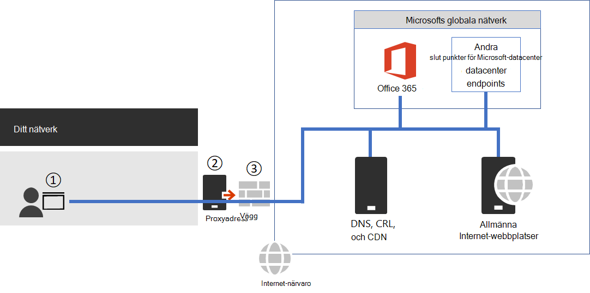

# <a name="managing-office-365-endpoints"></a><span data-ttu-id="ee745-103">Hantera Office 365-slutpunkter</span><span class="sxs-lookup"><span data-stu-id="ee745-103">Managing Office 365 endpoints</span></span>

<span data-ttu-id="ee745-104">De flesta företags organisationer som har flera Office-platser och anslutning till WAN kräver konfiguration för Office 365-nätverks anslutningar.</span><span class="sxs-lookup"><span data-stu-id="ee745-104">Most enterprise organizations that have multiple office locations and a connecting WAN will need configuration for Office 365 network connectivity.</span></span> <span data-ttu-id="ee745-105">Du kan optimera ditt nätverk genom att skicka alla betrodda Office 365-begäranden direkt via din brand vägg, och sedan gå förbi alla ytterligare paket nivå kontroller eller bearbetningar.</span><span class="sxs-lookup"><span data-stu-id="ee745-105">You can optimize your network by sending all trusted Office 365 network requests directly through your firewall, bypassing all additional packet level inspection or processing.</span></span> <span data-ttu-id="ee745-106">Detta minskar svars tiden och dina krav på perimeter.</span><span class="sxs-lookup"><span data-stu-id="ee745-106">This reduces latency and your perimeter capacity requirements.</span></span> <span data-ttu-id="ee745-107">Att identifiera nätverks trafik för Office 365 är det första steget med optimala prestanda för dina användare.</span><span class="sxs-lookup"><span data-stu-id="ee745-107">Identifying Office 365 network traffic is the first step in providing optimal performance for your users.</span></span> <span data-ttu-id="ee745-108">Mer information finns i [principer för Office 365-nätverks anslutningar](microsoft-365-network-connectivity-principles.md).</span><span class="sxs-lookup"><span data-stu-id="ee745-108">For more information, see [Office 365 Network Connectivity Principles](microsoft-365-network-connectivity-principles.md).</span></span>

<span data-ttu-id="ee745-109">Microsoft rekommenderar att du får till gång till Office 365 nätverks slut punkter och pågående ändringar i dem med hjälp av [IP-adressen och URL-adressen för office 365](microsoft-365-ip-web-service.md).</span><span class="sxs-lookup"><span data-stu-id="ee745-109">Microsoft recommends you access the Office 365 network endpoints and ongoing changes to them using the [Office 365 IP Address and URL Web Service](microsoft-365-ip-web-service.md).</span></span>

<span data-ttu-id="ee745-110">Oavsett hur du hanterar viktig Office 365-nätverks trafik kräver Office 365 Internet anslutning.</span><span class="sxs-lookup"><span data-stu-id="ee745-110">Regardless of how you manage vital Office 365 network traffic, Office 365 requires Internet connectivity.</span></span> <span data-ttu-id="ee745-111">Andra nätverks slut punkter där anslutning krävs visas i [ytterligare slut punkter som inte ingår i Office 365 IP Address and URL Web Service](additional-office365-ip-addresses-and-urls.md).</span><span class="sxs-lookup"><span data-stu-id="ee745-111">Other network endpoints where connectivity is required are listed at [Additional endpoints not included in the Office 365 IP Address and URL Web service](additional-office365-ip-addresses-and-urls.md).</span></span>

<span data-ttu-id="ee745-112">Hur du använder Office 365 nätverks slut punkter beror på företagets organisations nätverks arkitektur.</span><span class="sxs-lookup"><span data-stu-id="ee745-112">How you use the Office 365 network endpoints will depend on your enterprise organization network architecture.</span></span> <span data-ttu-id="ee745-113">I den här artikeln beskrivs flera olika sätt som företags nätverks arkitekturer kan integreras med Office 365 IP-adresser och URL: er.</span><span class="sxs-lookup"><span data-stu-id="ee745-113">This article outlines several ways that enterprise network architectures can integrate with Office 365 IP addresses and URLs.</span></span> <span data-ttu-id="ee745-114">Det enklaste sättet att välja vilka nätverks förfrågningar som ska vara tillförlitliga är att använda SD-WAN-enheter som har stöd för automatisk Office 365-konfiguration på var och en av dina Office-platser.</span><span class="sxs-lookup"><span data-stu-id="ee745-114">The easiest way to choose which network requests to trust is to use SD-WAN devices that support automated Office 365 configuration at each of your office locations.</span></span>

## <a name="sd-wan-for-local-branch-egress-of-vital-office-365-network-traffic"></a><span data-ttu-id="ee745-115">SD – WAN för lokal förgrening tillsluts av viktig Office 365-nätverks trafik</span><span class="sxs-lookup"><span data-stu-id="ee745-115">SD-WAN for local branch egress of vital Office 365 network traffic</span></span>

<span data-ttu-id="ee745-116">På varje filial kontors plats kan du tillhandahålla en SD-WAN-enhet som är konfigurerad för att cirkulera trafik för Office 365 optimerar kategorin med slut punkter eller optimerar och tillåter kategorier direkt till Microsofts nätverk.</span><span class="sxs-lookup"><span data-stu-id="ee745-116">At each branch office location, you can provide an SD-WAN device that is configured to route traffic for Office 365 Optimize category of endpoints, or Optimize and Allow categories, directly to Microsoft's network.</span></span> <span data-ttu-id="ee745-117">Annan nätverks trafik inklusive lokal data Center trafik, allmän trafik på Internet webbplatser och trafik till Office 365 standard kategori slut punkter skickas till en annan plats där du har en större nätverks gräns.</span><span class="sxs-lookup"><span data-stu-id="ee745-117">Other network traffic including on-premises datacenter traffic, general Internet web sites traffic, and traffic to Office 365 Default category endpoints is sent to another location where you have a more substantial network perimeter.</span></span>

<span data-ttu-id="ee745-118">Microsoft arbetar med SD-WAN-leverantörer för att aktivera automatisk konfiguration.</span><span class="sxs-lookup"><span data-stu-id="ee745-118">Microsoft is working with SD-WAN providers to enable automated configuration.</span></span> <span data-ttu-id="ee745-119">Mer information finns i [Office 365 Network partner program](microsoft-365-networking-partner-program.md).</span><span class="sxs-lookup"><span data-stu-id="ee745-119">For more information, see [Office 365 Networking Partner Program](microsoft-365-networking-partner-program.md).</span></span>

<span data-ttu-id="ee745-120"><a name="pacfiles"> </a></span><span class="sxs-lookup"><span data-stu-id="ee745-120"><a name="pacfiles"> </a></span></span>
## <a name="use-a-pac-file-for-direct-routing-of-vital-office-365-traffic"></a><span data-ttu-id="ee745-121">Använda en PAC-fil för direkt dirigering av viktig Office 365-trafik</span><span class="sxs-lookup"><span data-stu-id="ee745-121">Use a PAC file for direct routing of vital Office 365 traffic</span></span>

<span data-ttu-id="ee745-122">Använd PAC-eller WPAD-filer för att hantera nätverks förfrågningar som är kopplade till Office 365 men inte har någon IP-adress.</span><span class="sxs-lookup"><span data-stu-id="ee745-122">Use PAC or WPAD files to manage network requests that are associated with Office 365 but don't have an IP address.</span></span> <span data-ttu-id="ee745-123">Vanliga nätverks begär Anden som skickas via en proxy eller en perimeter-enhet.</span><span class="sxs-lookup"><span data-stu-id="ee745-123">Typical network requests that are sent through a proxy or perimeter device increase latency.</span></span> <span data-ttu-id="ee745-124">Medan SSL Avbryt och inspektera skapar den största fördröjningen kan andra tjänster, till exempel proxyautentisering och ryktes uppslag, orsaka dålig prestanda och dåligt användar upplevelse.</span><span class="sxs-lookup"><span data-stu-id="ee745-124">While SSL Break and Inspect creates the largest latency, other services such as proxy authentication and reputation lookup can cause poor performance and a bad user experience.</span></span> <span data-ttu-id="ee745-125">Dessutom behöver de här perimeternätverket tillräckligt med kapacitet för att bearbeta alla nätverks anslutnings förfrågningar.</span><span class="sxs-lookup"><span data-stu-id="ee745-125">Additionally, these perimeter network devices need enough capacity to process all of the network connection requests.</span></span> <span data-ttu-id="ee745-126">Vi rekommenderar att du kringgår dina proxy-eller kontroll enheter för direkta Office 365-begäranden.</span><span class="sxs-lookup"><span data-stu-id="ee745-126">We recommend bypassing your proxy or inspection devices for direct Office 365 network requests.</span></span>
  
<span data-ttu-id="ee745-127">[PowerShell-galleriet get-PacFile](https://www.powershellgallery.com/packages/Get-PacFile) är ett PowerShell-skript som läser de senaste nätverks slut punkterna från Office 365 IP Address and URL web service och skapar ett exempel på en PAC-fil.</span><span class="sxs-lookup"><span data-stu-id="ee745-127">[PowerShell Gallery Get-PacFile](https://www.powershellgallery.com/packages/Get-PacFile) is a PowerShell script that reads the latest network endpoints from the Office 365 IP Address and URL Web service and creates a sample PAC file.</span></span> <span data-ttu-id="ee745-128">Du kan ändra skriptet så att det integreras med din befintliga PAC-filhantering.</span><span class="sxs-lookup"><span data-stu-id="ee745-128">You can modify the script so that it integrates with your existing PAC file management.</span></span>



<span data-ttu-id="ee745-130">**Bild 1 – enkel perimeter för företags nätverk**</span><span class="sxs-lookup"><span data-stu-id="ee745-130">**Figure 1 - Simple enterprise network perimeter**</span></span>

<span data-ttu-id="ee745-131">PAC-filen distribueras till webbläsare vid punkt 1 i bild 1.</span><span class="sxs-lookup"><span data-stu-id="ee745-131">The PAC file is deployed to web browsers at point 1 in Figure 1.</span></span> <span data-ttu-id="ee745-132">När du använder en PAC-fil för direkt utlämnande av viktig Office 365-nätverks trafik måste du även tillåta anslutning till IP-adresserna bakom dessa URL-adresser i nätverks gräns brand väggen.</span><span class="sxs-lookup"><span data-stu-id="ee745-132">When using a PAC file for direct egress of vital Office 365 network traffic, you also need to allow connectivity to the IP addresses behind these URLs on your network perimeter firewall.</span></span> <span data-ttu-id="ee745-133">Detta görs genom att hämta IP-adresserna för samma Office 365-slutpunkts kategorier enligt PAC-filen och skapa brand Väggs åtkomst kontrol listor baserat på dessa adresser.</span><span class="sxs-lookup"><span data-stu-id="ee745-133">This is done by fetching the IP addresses for the same Office 365 endpoint categories as specified in the PAC file and creating firewall ACLs based on those addresses.</span></span> <span data-ttu-id="ee745-134">Brand väggen är punkt 3 i bild 1.</span><span class="sxs-lookup"><span data-stu-id="ee745-134">The firewall is point 3 in Figure 1.</span></span>

<span data-ttu-id="ee745-135">Separat om du väljer att göra en direkt dirigering för optimerings kategorins slut punkter måste alla tillåtna slut punkter för varje kategori som du skickar till proxyservern finnas med i proxyservern för att det ska gå vidare.</span><span class="sxs-lookup"><span data-stu-id="ee745-135">Separately if you choose to only do direct routing for the Optimize category endpoints, any required Allow category endpoints that you send to the proxy server will need to be listed in the proxy server to bypass further processing.</span></span> <span data-ttu-id="ee745-136">SSL-avbrott och inspektion och proxyautentisering är till exempel inkompatibla med både optimerings-och tillåtna kategori slut punkter.</span><span class="sxs-lookup"><span data-stu-id="ee745-136">For example, SSL break and Inspect and Proxy Authentication are incompatible with both the Optimize and Allow category endpoints.</span></span> <span data-ttu-id="ee745-137">Proxyservern är punkt 2 i bild 1.</span><span class="sxs-lookup"><span data-stu-id="ee745-137">The proxy server is point 2 in Figure 1.</span></span>

<span data-ttu-id="ee745-138">Den gemensamma konfigurationen är att tillåta utan att bearbeta all utgående trafik från proxyservern för mål-IP-adresser för Office 365 nätverks trafik som ger proxyservern.</span><span class="sxs-lookup"><span data-stu-id="ee745-138">The common configuration is to permit without processing all outbound traffic from the proxy server for the destination IP addresses for Office 365 network traffic that hits the proxy server.</span></span> <span data-ttu-id="ee745-139">Information om problem med SSL-avbrott och inspektion finns i [använda nätverks enheter eller-lösningar från tredje part i Office 365-trafik](https://support.microsoft.com/help/2690045/using-third-party-network-devices-or-solutions-with-office-365).</span><span class="sxs-lookup"><span data-stu-id="ee745-139">For information about issues with SSL Break and Inspect, see [Using third-party network devices or solutions on Office 365 traffic](https://support.microsoft.com/help/2690045/using-third-party-network-devices-or-solutions-with-office-365).</span></span>

<span data-ttu-id="ee745-140">Det finns två typer av PAC-filer som Get-PacFile-skriptet skapar.</span><span class="sxs-lookup"><span data-stu-id="ee745-140">There are two types of PAC files that the Get-PacFile script will generate.</span></span>

| <span data-ttu-id="ee745-141">Type (Typ)</span><span class="sxs-lookup"><span data-stu-id="ee745-141">Type</span></span> | <span data-ttu-id="ee745-142">Beskrivning</span><span class="sxs-lookup"><span data-stu-id="ee745-142">Description</span></span> |
|:-----|:-----|
|<span data-ttu-id="ee745-143">**9.1**</span><span class="sxs-lookup"><span data-stu-id="ee745-143">**1**</span></span> <br/> |<span data-ttu-id="ee745-144">Skicka optimering av slut punkts trafik direkt och allt annat till proxyservern.</span><span class="sxs-lookup"><span data-stu-id="ee745-144">Send Optimize endpoint traffic direct and everything else to the proxy server.</span></span> <br/> |
|<span data-ttu-id="ee745-145">**två**</span><span class="sxs-lookup"><span data-stu-id="ee745-145">**2**</span></span> <br/> |<span data-ttu-id="ee745-146">Skicka optimering och Tillåt slut punkts trafik direkt och allt annat till proxyservern.</span><span class="sxs-lookup"><span data-stu-id="ee745-146">Send Optimize and Allow endpoint traffic direct and everything else to the proxy server.</span></span> <span data-ttu-id="ee745-147">Den här typen kan också användas för att skicka alla ExpressRoute som stöds för Office 365-trafik till ExpressRoute nätverks segment och allt annat till proxyservern.</span><span class="sxs-lookup"><span data-stu-id="ee745-147">This type can also be used to send all supported ExpressRoute for Office 365 traffic to ExpressRoute network segments and everything else to the proxy server.</span></span> <br/> |

<span data-ttu-id="ee745-148">Här är ett enkelt exempel på hur du anropar PowerShell-skriptet:</span><span class="sxs-lookup"><span data-stu-id="ee745-148">Here's a simple example of calling the PowerShell script:</span></span>

```powershell
Get-PacFile -ClientRequestId b10c5ed1-bad1-445f-b386-b919946339a7
```

<span data-ttu-id="ee745-149">Det finns många parametrar som du kan skicka till skriptet:</span><span class="sxs-lookup"><span data-stu-id="ee745-149">There are many parameters you can pass to the script:</span></span>

| <span data-ttu-id="ee745-150">Indataparametern</span><span class="sxs-lookup"><span data-stu-id="ee745-150">Parameter</span></span> | <span data-ttu-id="ee745-151">Beskrivning</span><span class="sxs-lookup"><span data-stu-id="ee745-151">Description</span></span> |
|:-----|:-----|
|<span data-ttu-id="ee745-152">**ClientRequestId**</span><span class="sxs-lookup"><span data-stu-id="ee745-152">**ClientRequestId**</span></span> <br/> |<span data-ttu-id="ee745-153">Det här är obligatoriskt och är en GUID som skickas till webb tjänsten som representerar den klient dator som ringer samtalet.</span><span class="sxs-lookup"><span data-stu-id="ee745-153">This is required and is a GUID passed to the web service that represents the client machine making the call.</span></span> <br/> |
|<span data-ttu-id="ee745-154">**Enhetsinstans**</span><span class="sxs-lookup"><span data-stu-id="ee745-154">**Instance**</span></span> <br/> |<span data-ttu-id="ee745-155">Office 365-tjänst instans som är som standard världen över.</span><span class="sxs-lookup"><span data-stu-id="ee745-155">The Office 365 service instance, which defaults to Worldwide.</span></span> <span data-ttu-id="ee745-156">Detta skickas också till webb tjänsten.</span><span class="sxs-lookup"><span data-stu-id="ee745-156">This is also passed to the web service.</span></span> <br/> |
|<span data-ttu-id="ee745-157">**TenantName**</span><span class="sxs-lookup"><span data-stu-id="ee745-157">**TenantName**</span></span> <br/> |<span data-ttu-id="ee745-158">Ditt Office 365-klient namn.</span><span class="sxs-lookup"><span data-stu-id="ee745-158">Your Office 365 tenant name.</span></span> <span data-ttu-id="ee745-159">Skickades till webb tjänsten och används som en återställnings bara parameter i vissa Office 365-URL: er.</span><span class="sxs-lookup"><span data-stu-id="ee745-159">Passed to the web service and used as a replaceable parameter in some Office 365 URLs.</span></span> <br/> |
|<span data-ttu-id="ee745-160">**Typ**</span><span class="sxs-lookup"><span data-stu-id="ee745-160">**Type**</span></span> <br/> |<span data-ttu-id="ee745-161">Den typ av PAC som du vill skapa.</span><span class="sxs-lookup"><span data-stu-id="ee745-161">The type of the proxy PAC file that you want to generate.</span></span> <br/> |

<span data-ttu-id="ee745-162">Här är ett annat exempel på hur du anropar PowerShell-skriptet med ytterligare parametrar:</span><span class="sxs-lookup"><span data-stu-id="ee745-162">Here's another example of calling the PowerShell script with additional parameters:</span></span>

```powershell
Get-PacFile -Type 2 -Instance Worldwide -TenantName Contoso -ClientRequestId b10c5ed1-bad1-445f-b386-b919946339a7
```

## <a name="proxy-server-bypass-processing-of-office-365-network-traffic"></a><span data-ttu-id="ee745-163">Kringgå behandling av nätverks trafik för Office 365 i proxyservern</span><span class="sxs-lookup"><span data-stu-id="ee745-163">Proxy server bypass processing of Office 365 network traffic</span></span>

<span data-ttu-id="ee745-164">Där PAC-filer inte används för direkt utgående trafik, vill du ändå kringgå bearbetningen av nätverks omkretsen genom att konfigurera proxyservern.</span><span class="sxs-lookup"><span data-stu-id="ee745-164">Where PAC files are not used for direct outbound traffic, you still want to bypass processing on your network perimeter by configuring your proxy server.</span></span> <span data-ttu-id="ee745-165">Vissa proxyservrar har aktiverat automatisk konfiguration av detta enligt beskrivningen i [Office 365 Network partner-programmet](microsoft-365-networking-partner-program.md).</span><span class="sxs-lookup"><span data-stu-id="ee745-165">Some proxy server vendors have enabled automated configuration of this as described in the [Office 365 Networking Partner Program](microsoft-365-networking-partner-program.md).</span></span>

<span data-ttu-id="ee745-166">Om du gör detta manuellt måste du skaffa optimerings-och tillåtna slut punkts kategori data från Office 365 IP Address and URL web service och konfigurera din proxyserver för att kringgå bearbetningen för dessa.</span><span class="sxs-lookup"><span data-stu-id="ee745-166">If you are doing this manually, you will need to get the Optimize and Allow endpoint category data from the Office 365 IP Address and URL Web Service and configure your proxy server to bypass processing for these.</span></span> <span data-ttu-id="ee745-167">Det är viktigt att undvika SSL-avbrott och inspektera och proxyautentisering för optimerings-och grupp slut punkter.</span><span class="sxs-lookup"><span data-stu-id="ee745-167">It is important to avoid SSL Break and Inspect and Proxy Authentication for the Optimize and Allow category endpoints.</span></span>
  
<span data-ttu-id="ee745-168"><a name="bkmk_changes"> </a></span><span class="sxs-lookup"><span data-stu-id="ee745-168"><a name="bkmk_changes"> </a></span></span>
## <a name="change-management-for-office-365-ip-addresses-and-urls"></a><span data-ttu-id="ee745-169">Ändrings hantering för Office 365 IP-adresser och URL: er</span><span class="sxs-lookup"><span data-stu-id="ee745-169">Change management for Office 365 IP addresses and URLs</span></span>

<span data-ttu-id="ee745-170">Förutom att välja rätt konfiguration för nätverks omkretsen är det viktigt att du använder en process för ändrings hantering för Office 365-slutpunkter.</span><span class="sxs-lookup"><span data-stu-id="ee745-170">In addition to selecting appropriate configuration for your network perimeter, it is critical that you adopt a change management process for Office 365 endpoints.</span></span> <span data-ttu-id="ee745-171">Dessa slut punkter ändras regelbundet och om du inte hanterar ändringarna kan du avsluta med blockerade användare eller dåliga prestanda efter en ny IP-adress eller URL.</span><span class="sxs-lookup"><span data-stu-id="ee745-171">These endpoints change regularly and if you do not manage the changes, you can end up with users blocked or with poor performance after a new IP address or URL is added.</span></span>

<span data-ttu-id="ee745-172">Ändringar av IP-adresser och URL: er för Office 365 publiceras vanligt vis nära den sista dagen i varje månad.</span><span class="sxs-lookup"><span data-stu-id="ee745-172">Changes to the Office 365 IP addresses and URLs are usually published near the last day of each month.</span></span> <span data-ttu-id="ee745-173">Ibland kommer en ändring att publiceras utanför detta schema på grund av drift-, support-eller säkerhets krav.</span><span class="sxs-lookup"><span data-stu-id="ee745-173">Sometimes a change will be published outside of that schedule due to operational, support, or security requirements.</span></span>

<span data-ttu-id="ee745-174">Om en ändring publiceras som kräver att du har lagt till en IP-adress eller URL-adress, bör du förvänta dig 30 dagars varsel från den tidpunkt då vi publicerar ändringen tills det finns en Office 365-tjänst på den slut punkten.</span><span class="sxs-lookup"><span data-stu-id="ee745-174">When a change is published that requires you to act because an IP address or URL was added, you should expect to receive 30 days notice from the time we publish the change until there is an Office 365 service on that endpoint.</span></span> <span data-ttu-id="ee745-175">Även om vi strävar efter att visa denna meddelande period kanske det inte alltid är möjligt på grund av drift-, support-och säkerhets krav.</span><span class="sxs-lookup"><span data-stu-id="ee745-175">Although we aim for this notification period, it may not always be possible due to operational, support, or security requirements.</span></span> <span data-ttu-id="ee745-176">Ändringar som inte kräver någon omedelbar åtgärd för att upprätthålla anslutningen, till exempel borttagna IP-adresser och URL-adresser eller mindre väsentliga ändringar, inkluderar inte förhands avisering.</span><span class="sxs-lookup"><span data-stu-id="ee745-176">Changes that do not require immediate action to maintain connectivity, such as removed IP addresses or URLs or less significant changes, do not include advance notification.</span></span> <span data-ttu-id="ee745-177">Oberoende av vilken avisering som tillhandahålls visar vi den förväntade tjänstens aktiva datum för varje ändring.</span><span class="sxs-lookup"><span data-stu-id="ee745-177">Regardless of what notification is provided, we list the expected service active date for each change.</span></span>

### <a name="change-notification-using-the-web-service"></a><span data-ttu-id="ee745-178">Ändrings meddelande med webb tjänsten</span><span class="sxs-lookup"><span data-stu-id="ee745-178">Change notification using the Web Service</span></span>

<span data-ttu-id="ee745-179">Du kan använda Office 365 IP Address and URL Web Service för att få ett meddelande om ändring.</span><span class="sxs-lookup"><span data-stu-id="ee745-179">You can use the Office 365 IP Address and URL Web Service to get change notification.</span></span> <span data-ttu-id="ee745-180">Vi rekommenderar att du ringer till **/version** webb metod en gång i timmen för att kontrol lera den version av slut punkterna som du använder för att ansluta till Office 365.</span><span class="sxs-lookup"><span data-stu-id="ee745-180">We recommend you call the **/version** web method once an hour to check the version of the endpoints that you are using to connect to Office 365.</span></span> <span data-ttu-id="ee745-181">Om den här versionen ändras när den jämförs med den version som du har använt, bör du skaffa de senaste slut punkts uppgifterna från webb metoden **/endpoints** och även använda de skillnader som råder från **/Changes** webb metod.</span><span class="sxs-lookup"><span data-stu-id="ee745-181">If this version changes when compared to the version that you have in use, then you should get the latest endpoint data from the **/endpoints** web method and optionally get the differences from the **/changes** web method.</span></span> <span data-ttu-id="ee745-182">Det är inte nödvändigt att ringa webb metoderna **/endpoints** eller **/Changes** om ingen ändring har gjorts för den version du hittade.</span><span class="sxs-lookup"><span data-stu-id="ee745-182">It is not necessary to call the **/endpoints** or **/changes** web methods if there has not been any change to the version you found.</span></span>

<span data-ttu-id="ee745-183">Mer information finns i [Office 365 IP Address and URL Web Service](microsoft-365-ip-web-service.md).</span><span class="sxs-lookup"><span data-stu-id="ee745-183">For more information, see [Office 365 IP Address and URL Web Service](microsoft-365-ip-web-service.md).</span></span>

### <a name="change-notification-using-rss-feeds"></a><span data-ttu-id="ee745-184">Ändra meddelande med RSS-feeds</span><span class="sxs-lookup"><span data-stu-id="ee745-184">Change notification using RSS feeds</span></span>

<span data-ttu-id="ee745-185">Webb adressen och URL-webbtjänsten för Office 365 tillhandahåller en RSS-feed som du kan abonnera på i Outlook.</span><span class="sxs-lookup"><span data-stu-id="ee745-185">The Office 365 IP Address and URL Web Service provides an RSS feed that you can subscribe to in Outlook.</span></span> <span data-ttu-id="ee745-186">Det finns länkar till RSS-webbadresserna på var och en av de särskilda sidorna för Office 365-tjänsterna för IP-adresser och URL: er.</span><span class="sxs-lookup"><span data-stu-id="ee745-186">There are links to the RSS URLs on each of the Office 365 service instance-specific pages for the IP addresses and URLs.</span></span> <span data-ttu-id="ee745-187">Mer information finns i [Office 365 IP Address and URL Web Service](microsoft-365-ip-web-service.md).</span><span class="sxs-lookup"><span data-stu-id="ee745-187">For more information, see [Office 365 IP Address and URL Web Service](microsoft-365-ip-web-service.md).</span></span>

### <a name="change-notification-and-approval-review-using-microsoft-flow"></a><span data-ttu-id="ee745-188">Ändring av meddelanden och godkännande granskning med Microsoft-flöde</span><span class="sxs-lookup"><span data-stu-id="ee745-188">Change notification and approval review using Microsoft Flow</span></span>

<span data-ttu-id="ee745-189">Vi förstår att du fortfarande kan behöva manuell bearbetning för ändringar av nätverks slut punkter i varje månad.</span><span class="sxs-lookup"><span data-stu-id="ee745-189">We understand that you might still require manual processing for network endpoint changes that come through each month.</span></span> <span data-ttu-id="ee745-190">Du kan använda Microsoft Flow för att skapa ett flöde som meddelar dig via e-post och som om en godkännande process körs för ändringar när Office 365-nätverks slut punkter har ändrats.</span><span class="sxs-lookup"><span data-stu-id="ee745-190">You can use Microsoft Flow to create a flow that notifies you by email and optionally runs an approval process for changes when Office 365 network endpoints have changes.</span></span> <span data-ttu-id="ee745-191">När granskningen är klar kan du låta flödesschemat Skicka automatiskt e-poständringarna till din brand vägg och server för hanterings servrar.</span><span class="sxs-lookup"><span data-stu-id="ee745-191">Once review is completed, you can have the flow automatically email the changes to your firewall and proxy server management team.</span></span>

<span data-ttu-id="ee745-192">Information om ett Microsoft-flödes exempel och-mall finns i [använda Microsoft Flow för att få ett e-postmeddelande för ändringar i Office 365 IP-adresser och URL: er](https://techcommunity.microsoft.com/t5/Office-365-Networking/Use-Microsoft-Flow-to-receive-an-email-for-changes-to-Office-365/td-p/240651).</span><span class="sxs-lookup"><span data-stu-id="ee745-192">For information about a Microsoft Flow sample and template, see [Use Microsoft Flow to receive an email for changes to Office 365 IP addresses and URLs](https://techcommunity.microsoft.com/t5/Office-365-Networking/Use-Microsoft-Flow-to-receive-an-email-for-changes-to-Office-365/td-p/240651).</span></span>
  
<span data-ttu-id="ee745-193"><a name="FAQ"> </a></span><span class="sxs-lookup"><span data-stu-id="ee745-193"><a name="FAQ"> </a></span></span>
## <a name="office-365-network-endpoints-faq"></a><span data-ttu-id="ee745-194">Vanliga frågor om Office 365-nätverks slut punkter</span><span class="sxs-lookup"><span data-stu-id="ee745-194">Office 365 network endpoints FAQ</span></span>

<span data-ttu-id="ee745-195">Se de här vanliga frågorna om Office 365-nätverks anslutningar.</span><span class="sxs-lookup"><span data-stu-id="ee745-195">See these frequently asked questions about Office 365 network connectivity.</span></span>
  
### <a name="how-do-i-submit-a-question"></a><span data-ttu-id="ee745-196">Hur skickar jag in en fråga?</span><span class="sxs-lookup"><span data-stu-id="ee745-196">How do I submit a question?</span></span>

<span data-ttu-id="ee745-197">Klicka på länken längst ned för att visa om artikeln var till hjälp eller inte och skicka eventuella ytterligare frågor.</span><span class="sxs-lookup"><span data-stu-id="ee745-197">Click the link at the bottom to indicate if the article was helpful or not and submit any additional questions.</span></span> <span data-ttu-id="ee745-198">Vi övervakar feedbacken och uppdaterar frågorna här med de vanligaste frågorna.</span><span class="sxs-lookup"><span data-stu-id="ee745-198">We monitor the feedback and update the questions here with the most frequently asked.</span></span>
  
### <a name="how-do-i-determine-the-location-of-my-tenant"></a><span data-ttu-id="ee745-199">Hur avgör jag platsen för min klient organisation?</span><span class="sxs-lookup"><span data-stu-id="ee745-199">How do I determine the location of my tenant?</span></span>

 <span data-ttu-id="ee745-200">**Klient platsen** bestäms bäst med hjälp av vår [Data Center karta](https://aka.ms/datamaps).</span><span class="sxs-lookup"><span data-stu-id="ee745-200">**Tenant location** is best determined using our [datacenter map](https://aka.ms/datamaps).</span></span>
  
### <a name="am-i-peering-appropriately-with-microsoft"></a><span data-ttu-id="ee745-201">Är jag peer-lämpligt med Microsoft?</span><span class="sxs-lookup"><span data-stu-id="ee745-201">Am I peering appropriately with Microsoft?</span></span>

 <span data-ttu-id="ee745-202">**Peering-platser** beskrivs mer ingående i [peering med Microsoft](https://www.microsoft.com/peering).</span><span class="sxs-lookup"><span data-stu-id="ee745-202">**Peering locations** are described in more detail in [peering with Microsoft](https://www.microsoft.com/peering).</span></span>
  
<span data-ttu-id="ee745-203">Med över 2500 ISP-relationer globalt och 70 punkter i närvaro bör du komma från ditt nätverk till vår är sömlöst.</span><span class="sxs-lookup"><span data-stu-id="ee745-203">With over 2500 ISP peering relationships globally and 70 points of presence, getting from your network to ours should be seamless.</span></span> <span data-ttu-id="ee745-204">Det går inte göra illa att ta några minuter att se till att din Internet leverantörs peer-relation är den mest optimala, [här är några exempel](https://blogs.technet.microsoft.com/onthewire/2017/03/22/__guidance/) på bra och inte så bra bearbetande med dina nätverk.</span><span class="sxs-lookup"><span data-stu-id="ee745-204">It can't hurt to spend a few minutes making sure your ISP's peering relationship is the most optimal, [here's a few examples](https://blogs.technet.microsoft.com/onthewire/2017/03/22/__guidance/) of good and not so good peering hand-offs to our network.</span></span>
  
<span data-ttu-id="ee745-205"><a name="bkmk_MissingIP"> </a></span><span class="sxs-lookup"><span data-stu-id="ee745-205"><a name="bkmk_MissingIP"> </a></span></span>
### <a name="i-see-network-requests-to-ip-addresses-not-on-the-published-list-do-i-need-to-provide-access-to-them"></a><span data-ttu-id="ee745-206">Jag ser nätverks förfrågningar till IP-adresser som inte finns på den publicerade listan, jag behöver ge åtkomst till dem?</span><span class="sxs-lookup"><span data-stu-id="ee745-206">I see network requests to IP addresses not on the published list, do I need to provide access to them?</span></span>

<span data-ttu-id="ee745-207">Vi tillhandahåller bara IP-adresser för de Office 365-servrar som du ska dirigera direkt till.</span><span class="sxs-lookup"><span data-stu-id="ee745-207">We only provide IP addresses for the Office 365 servers you should route directly to.</span></span> <span data-ttu-id="ee745-208">Det här är inte en fullständig lista över alla IP-adresser som du ser nätverks förfrågningar för.</span><span class="sxs-lookup"><span data-stu-id="ee745-208">This isn't a comprehensive list of all IP addresses you'll see network requests for.</span></span> <span data-ttu-id="ee745-209">Du kommer att se nätverks förfrågningar till Microsoft och ägda, opublicerade och IP-adresser från tredje part.</span><span class="sxs-lookup"><span data-stu-id="ee745-209">You will see network requests to Microsoft and third-party owned, unpublished, IP addresses.</span></span> <span data-ttu-id="ee745-210">Dessa IP-adresser skapas eller hanteras dynamiskt på ett sätt som gör att du inte kan se tid när de ändrar.</span><span class="sxs-lookup"><span data-stu-id="ee745-210">These IP addresses are dynamically generated or managed in a way that prevents timely notice when they change.</span></span> <span data-ttu-id="ee745-211">Om din brand vägg inte kan tillåta åtkomst baserat på FQDN-namn för dessa nätverks förfrågningar använder du en PAC-eller WPAD-fil för att hantera begär Anden.</span><span class="sxs-lookup"><span data-stu-id="ee745-211">If your firewall can't allow access based on the FQDNs for these network requests, use a PAC or WPAD file to manage the requests.</span></span>
  
<span data-ttu-id="ee745-212">Finns det en IP-adress som är kopplad till Office 365 som du vill ha mer information om?</span><span class="sxs-lookup"><span data-stu-id="ee745-212">See an IP associated with Office 365 that you want more information on?</span></span>
  
1. <span data-ttu-id="ee745-213">Kontrol lera att IP-adressen ingår i ett större publicerat område med hjälp av en CIDR-kalkylator, till exempel [IPv4](https://www.ipaddressguide.com/cidr) eller [IPv6](https://www.ipaddressguide.com/ipv6-cidr).</span><span class="sxs-lookup"><span data-stu-id="ee745-213">Check if the IP address is included in a larger published range using a CIDR calculator, such as these for [IPv4](https://www.ipaddressguide.com/cidr) or [IPv6](https://www.ipaddressguide.com/ipv6-cidr).</span></span> <span data-ttu-id="ee745-214">40.96.0.0/13 inkluderar till exempel IP-adressen 40.103.0.1 trots att 40,96 inte matchar 40,103.</span><span class="sxs-lookup"><span data-stu-id="ee745-214">For example, 40.96.0.0/13 includes the IP Address 40.103.0.1 despite 40.96 not matching 40.103.</span></span>
2. <span data-ttu-id="ee745-215">Se om en partner äger IP-adressen med en [whois-fråga](https://dnsquery.org/).</span><span class="sxs-lookup"><span data-stu-id="ee745-215">See if a partner owns the IP with a [whois query](https://dnsquery.org/).</span></span> <span data-ttu-id="ee745-216">Om det ägs av Microsoft kan det vara en intern partner.</span><span class="sxs-lookup"><span data-stu-id="ee745-216">If it's Microsoft owned, it may be an internal partner.</span></span> <span data-ttu-id="ee745-217">Många slut punkter för partner nätverk visas som tillhör _standard_ kategorin, för vilka IP-adresser inte är publicerade.</span><span class="sxs-lookup"><span data-stu-id="ee745-217">Many partner network endpoints are listed as belonging to the _default_ category, for which IP addresses are not published.</span></span>
3. <span data-ttu-id="ee745-218">IP-adressen får inte vara en del av Office 365 eller ett samband.</span><span class="sxs-lookup"><span data-stu-id="ee745-218">The IP address may not be part of Office 365 or a dependency.</span></span> <span data-ttu-id="ee745-219">Nätverks slut punkter för Office 365 inkluderar inte alla slut punkter för Microsoft-nätverk.</span><span class="sxs-lookup"><span data-stu-id="ee745-219">Office 365 network endpoint publishing does not include all of Microsoft network endpoints.</span></span>
4. <span data-ttu-id="ee745-220">Kontrol lera certifikatet.</span><span class="sxs-lookup"><span data-stu-id="ee745-220">Check the certificate.</span></span> <span data-ttu-id="ee745-221">Med en webbläsare ansluter du till den IP-adress som använder *https:// \<IP_ADDRESS\>* och kontrollerar vilka domäner som är kopplade till IP-adressen genom att markera domänerna i certifikatet.</span><span class="sxs-lookup"><span data-stu-id="ee745-221">With a browser, connect to the IP address using  *HTTPS://\<IP_ADDRESS\>* and check the domains listed on the certificate to understand what domains are associated with the IP address.</span></span> <span data-ttu-id="ee745-222">Om det är en Microsoft-adress och inte i listan med IP-adresser för Office 365 är det troligt vis IP-adressen som är kopplad till ett Microsoft CDN, till exempel  *MSOCDN.net*  eller en annan Microsoft-domän utan offentlig IP-information.</span><span class="sxs-lookup"><span data-stu-id="ee745-222">If it's a Microsoft-owned IP address and not on the list of Office 365 IP addresses, it's likely the IP address is associated with a Microsoft CDN such as  *MSOCDN.NET*  or another Microsoft domain without published IP information.</span></span> <span data-ttu-id="ee745-223">Om du hittar domänen på certifikatet är ett ställe där vi hävdar att det finns en lista med IP-adressen ber vi dig berätta.</span><span class="sxs-lookup"><span data-stu-id="ee745-223">If you do find the domain on the certificate is one where we claim to list the IP address, please let us know.</span></span>

<span data-ttu-id="ee745-224"><a name="bkmk_cname"> </a></span><span class="sxs-lookup"><span data-stu-id="ee745-224"><a name="bkmk_cname"> </a></span></span>
### <a name="some-office-365-urls-point-to-cname-records-instead-of-a-records-in-the-dns-what-do-i-have-to-do-with-the-cname-records"></a><span data-ttu-id="ee745-225">Vissa Office 365-adresser pekar på CNAME-poster i stället för en post i DNS.</span><span class="sxs-lookup"><span data-stu-id="ee745-225">Some Office 365 URLs point to CNAME records instead of A records in the DNS.</span></span> <span data-ttu-id="ee745-226">Vad måste jag göra med CNAME-posterna?</span><span class="sxs-lookup"><span data-stu-id="ee745-226">What do I have to do with the CNAME records?</span></span>

<span data-ttu-id="ee745-227">Klient datorer behöver en DNS A-eller AAAA Record t)-hatt inkluderar en eller flera IP-adresser att ansluta till en moln tjänst.</span><span class="sxs-lookup"><span data-stu-id="ee745-227">Client computers need a DNS A or AAAA record t)hat includes one or more IP address(es) to connect to a cloud service.</span></span> <span data-ttu-id="ee745-228">Vissa URL-adresser i Office 365 visar CNAME-poster i stället för A-eller AAAA-poster.</span><span class="sxs-lookup"><span data-stu-id="ee745-228">Some URLs included in Office 365 show CNAME records instead of A or AAAA records.</span></span> <span data-ttu-id="ee745-229">Dessa CNAME-poster är mellanhand och det kan finnas flera i en kedja.</span><span class="sxs-lookup"><span data-stu-id="ee745-229">These CNAME records are intermediary and there may be several in a chain.</span></span> <span data-ttu-id="ee745-230">De kommer alltid att behöva komma till en A-eller AAAA-post för en IP-adress.</span><span class="sxs-lookup"><span data-stu-id="ee745-230">They will always eventually resolve to an A or AAAA record for an IP Address.</span></span> <span data-ttu-id="ee745-231">Överväg till exempel följande serie av DNS-poster, som i slut ända till IP-adressen _IP_1_:</span><span class="sxs-lookup"><span data-stu-id="ee745-231">For example, consider the following series of DNS records, which ultimately resolves to the IP address _IP_1_:</span></span>

```console
serviceA.office.com -> CNAME: serviceA.domainA.com -> CNAME: serviceA.domainB.com -> A: IP_1
```

<span data-ttu-id="ee745-232">Dessa CNAME-omdirigeringar är en normal del av DNS och är transparenta för klient datorn och är transparent för proxyservrar.</span><span class="sxs-lookup"><span data-stu-id="ee745-232">These CNAME redirects are a normal part of the DNS and are transparent to the client computer and transparent to proxy servers.</span></span> <span data-ttu-id="ee745-233">De används för belastnings utjämning, innehålls leverans nätverk, hög tillgänglighet och minskning av service händelser.</span><span class="sxs-lookup"><span data-stu-id="ee745-233">They are used for load balancing, content delivery networks, high availability, and service incident mitigation.</span></span> <span data-ttu-id="ee745-234">Microsoft publicerar inte de mellanliggande CNAME-posterna, de kan ändras när som helst och du bör inte behöva konfigurera dem som tillåtna i din proxyserver.</span><span class="sxs-lookup"><span data-stu-id="ee745-234">Microsoft does not publish the intermediary CNAME records, they are subject to change at any time, and you should not need to configure them as allowed in your proxy server.</span></span>

<span data-ttu-id="ee745-235">En proxyserver verifierar den inledande URL-adressen, som i exemplet ovan är serviceA.office.com och denna URL inkluderas i Office 365-publiceringen.</span><span class="sxs-lookup"><span data-stu-id="ee745-235">A proxy server validates the initial URL, which in the above example is serviceA.office.com, and this URL would be included in Office 365 publishing.</span></span> <span data-ttu-id="ee745-236">Proxyservern begär DNS-matchning av URL-adressen till en IP-adress och får tillbaka IP_1.</span><span class="sxs-lookup"><span data-stu-id="ee745-236">The proxy server requests DNS resolution of that URL to an IP Address and will receive back IP_1.</span></span> <span data-ttu-id="ee745-237">Det verifierar inte de mellanliggande CNAME-omdirigerings posterna.</span><span class="sxs-lookup"><span data-stu-id="ee745-237">It does not validate the intermediary CNAME redirection records.</span></span>

<span data-ttu-id="ee745-238">Hårdkodade konfigurationer eller väggar som baseras på indirekta Office 365-FQDN rekommenderas inte, stöds inte av Microsoft och är kända för problem med kund anslutningen.</span><span class="sxs-lookup"><span data-stu-id="ee745-238">Hard-coded configurations or whitelisting based on indirect Office 365 FQDNs are not recommended, not supported by Microsoft, and are known to cause customer connectivity issues.</span></span> <span data-ttu-id="ee745-239">DNS-lösningar som blockerar CNAME-omdirigering eller som annars löser Office 365 DNS-poster kan lösas via DNS-vidarebefordrare med DNS rekursion aktiverat eller med hjälp av DNS-rottips.</span><span class="sxs-lookup"><span data-stu-id="ee745-239">DNS solutions that block on CNAME redirection, or that otherwise incorrectly resolve Office 365 DNS entries, can be solved via DNS forwarders with DNS recursion enabled or by using DNS root hints.</span></span> <span data-ttu-id="ee745-240">Många nätverks gräns produkter från tredje part integrerar automatiskt rekommenderade Office 365-slutpunkter väggar i deras konfiguration med hjälp av [IP-adressen och URL-webbtjänsten för office 365](microsoft-365-ip-web-service.md).</span><span class="sxs-lookup"><span data-stu-id="ee745-240">Many third-party network perimeter products natively integrate recommended Office 365 endpoint whitelisting in their configuration using the [Office 365 IP Address and URL Web service](microsoft-365-ip-web-service.md).</span></span>

<span data-ttu-id="ee745-241"><a name="bkmk_akamai"> </a></span><span class="sxs-lookup"><span data-stu-id="ee745-241"><a name="bkmk_akamai"> </a></span></span>
### <a name="why-do-i-see-names-such-as-nsatcnet-or-akadnsnet-in-the-microsoft-domain-names"></a><span data-ttu-id="ee745-242">Varför ser jag namn som nsatc.net eller akadns.net i domän namnen för Microsoft?</span><span class="sxs-lookup"><span data-stu-id="ee745-242">Why do I see names such as nsatc.net or akadns.net in the Microsoft domain names?</span></span>

<span data-ttu-id="ee745-243">Office 365 och andra Microsoft-tjänster använder flera tredjepartsprogram som Akamai och MarkMonitor för att förbättra din Office 365-upplevelse.</span><span class="sxs-lookup"><span data-stu-id="ee745-243">Office 365 and other Microsoft services use several third-party services such as Akamai and MarkMonitor to improve your Office 365 experience.</span></span> <span data-ttu-id="ee745-244">För att det ska bli så bra som möjligt kan vi ändra dessa tjänster i framtiden.</span><span class="sxs-lookup"><span data-stu-id="ee745-244">To keep giving you the best experience possible, we may change these services in the future.</span></span> <span data-ttu-id="ee745-245">Tredjeparts domäner kan hantera innehåll, till exempel en CDN, eller de kan vara värd för en tjänst, till exempel en tjänst för en geografisk trafik.</span><span class="sxs-lookup"><span data-stu-id="ee745-245">Third-party domains may host content, such as a CDN, or they may host a service, such as a geographical traffic management service.</span></span> <span data-ttu-id="ee745-246">Här är några av de tjänster som används för närvarande:</span><span class="sxs-lookup"><span data-stu-id="ee745-246">Some of the services currently in use include:</span></span>
  
<span data-ttu-id="ee745-247">[MarkMonitor](https://www.markmonitor.com/) används när du ser förfrågningar som innehåller *\* . nsatc.net*.</span><span class="sxs-lookup"><span data-stu-id="ee745-247">[MarkMonitor](https://www.markmonitor.com/) is in use when you see requests that include  *\*.nsatc.net*.</span></span> <span data-ttu-id="ee745-248">Denna tjänst tillhandahåller domän namns skydd och övervakning för att skydda mot skadligt beteende.</span><span class="sxs-lookup"><span data-stu-id="ee745-248">This service provides domain name protection and monitoring to protect against malicious behavior.</span></span>
  
<span data-ttu-id="ee745-249">[ExactTarget](https://www.marketingcloud.com/) används när du ser förfrågningar till *\* . ExactTarget.com*.</span><span class="sxs-lookup"><span data-stu-id="ee745-249">[ExactTarget](https://www.marketingcloud.com/) is in use when you see requests to  *\*.exacttarget.com*.</span></span> <span data-ttu-id="ee745-250">Den här tjänsten tillhandahåller hantering av e-postlänk och övervakning mot skadligt beteende.</span><span class="sxs-lookup"><span data-stu-id="ee745-250">This service provides email link management and monitoring against malicious behavior.</span></span>
  
<span data-ttu-id="ee745-251">[Akamai](https://www.akamai.com/) används när du ser förfrågningar som innehåller något av följande FQDN-namn.</span><span class="sxs-lookup"><span data-stu-id="ee745-251">[Akamai](https://www.akamai.com/) is in use when you see requests that include one of the following FQDNs.</span></span> <span data-ttu-id="ee745-252">Den här tjänsten erbjuder nätverks tjänster för geo-DNS och innehålls leverans.</span><span class="sxs-lookup"><span data-stu-id="ee745-252">This service offers geo-DNS and content delivery network services.</span></span>
  
```console
*.akadns.net
*.akam.net
*.akamai.com
*.akamai.net
*.akamaiedge.net
*.akamaihd.net
*.akamaized.net
*.edgekey.net
*.edgesuite.net
```

<span data-ttu-id="ee745-253"><a name="bkmk_thirdparty"> </a></span><span class="sxs-lookup"><span data-stu-id="ee745-253"><a name="bkmk_thirdparty"> </a></span></span>
### <a name="i-have-to-have-the-minimum-connectivity-possible-for-office-365"></a><span data-ttu-id="ee745-254">Jag måste ha den minsta möjliga anslutningen för Office 365</span><span class="sxs-lookup"><span data-stu-id="ee745-254">I have to have the minimum connectivity possible for Office 365</span></span>

<span data-ttu-id="ee745-255">Eftersom Office 365 är en uppsättning tjänster som är byggda för att fungera över Internet, baseras tillförlitlighet och tillgänglighet på många vanliga Internet-tjänster.</span><span class="sxs-lookup"><span data-stu-id="ee745-255">As Office 365 is a suite of services built to function over the internet, the reliability and availability promises are based on many standard internet services being available.</span></span> <span data-ttu-id="ee745-256">Vanliga Internet-tjänster, till exempel DNS, CRL och CDN, måste kunna nås för att kunna använda Office 365 på samma sätt som de måste kunna använda för de flesta moderna Internet-tjänster.</span><span class="sxs-lookup"><span data-stu-id="ee745-256">For example, standard internet services such as DNS, CRL, and CDNs must be reachable to use Office 365 just as they must be reachable to use most modern internet services.</span></span>

<span data-ttu-id="ee745-257">Office 365-sviten är uppdelad i huvud tjänst områden.</span><span class="sxs-lookup"><span data-stu-id="ee745-257">The Office 365 suite is broken down into major service areas.</span></span> <span data-ttu-id="ee745-258">Dessa kan vara selektivt aktiverade för anslutning och det finns ett gemensamt område, vilket är ett samband för alla och som alltid är obligatoriskt.</span><span class="sxs-lookup"><span data-stu-id="ee745-258">These can be selectively enabled for connectivity and there is a Common area, which is a dependency for all and is always required.</span></span>

| <span data-ttu-id="ee745-259">Tjänst område</span><span class="sxs-lookup"><span data-stu-id="ee745-259">Service Area</span></span> | <span data-ttu-id="ee745-260">Beskrivning</span><span class="sxs-lookup"><span data-stu-id="ee745-260">Description</span></span> |
|:-----|:-----|
|<span data-ttu-id="ee745-261">**Exchange**</span><span class="sxs-lookup"><span data-stu-id="ee745-261">**Exchange**</span></span> <br/> |<span data-ttu-id="ee745-262">Exchange Online och Exchange Online Protection</span><span class="sxs-lookup"><span data-stu-id="ee745-262">Exchange Online and Exchange Online Protection</span></span> <br/> |
|<span data-ttu-id="ee745-263">**SharePoint**</span><span class="sxs-lookup"><span data-stu-id="ee745-263">**SharePoint**</span></span> <br/> |<span data-ttu-id="ee745-264">SharePoint Online och OneDrive för företag</span><span class="sxs-lookup"><span data-stu-id="ee745-264">SharePoint Online and OneDrive for Business</span></span> <br/> |
|<span data-ttu-id="ee745-265">**Skype för företag Online och Microsoft Teams**</span><span class="sxs-lookup"><span data-stu-id="ee745-265">**Skype for Business Online and Microsoft Teams**</span></span> <br/> |<span data-ttu-id="ee745-266">Skype för företag och Microsoft Teams</span><span class="sxs-lookup"><span data-stu-id="ee745-266">Skype for Business and Microsoft Teams</span></span> <br/> |
|<span data-ttu-id="ee745-267">**Gemenskapens**</span><span class="sxs-lookup"><span data-stu-id="ee745-267">**Common**</span></span> <br/> |<span data-ttu-id="ee745-268">Office 365 Pro Plus, Office i en webbläsare, Azure AD och andra vanliga nätverks slut punkter</span><span class="sxs-lookup"><span data-stu-id="ee745-268">Office 365 Pro Plus, Office in a browser, Azure AD, and other common network endpoints</span></span> <br/> |

<span data-ttu-id="ee745-269">Utöver de grundläggande Internet-tjänsterna finns det tjänster som bara används för att integrera funktionalitet.</span><span class="sxs-lookup"><span data-stu-id="ee745-269">In addition to basic internet services, there are third-party services that are only used to integrate functionality.</span></span> <span data-ttu-id="ee745-270">Medan dessa behövs för integrering är de markerade som valfria i avsnittet Office 365-slutpunkter, vilket innebär att de grundläggande funktionerna i tjänsten fortsätter att fungera om slut punkten inte är tillgänglig.</span><span class="sxs-lookup"><span data-stu-id="ee745-270">While these are needed for integration, they're marked as optional in the Office 365 endpoints article, which means core functionality of the service will continue to function if the endpoint isn't accessible.</span></span> <span data-ttu-id="ee745-271">Alla nätverks slut punkter som krävs kommer att ha attributet obligatoriskt angivet till true.</span><span class="sxs-lookup"><span data-stu-id="ee745-271">Any network endpoint that is required will have the required attribute set to true.</span></span> <span data-ttu-id="ee745-272">Alla nätverks slut punkter som är valfria kommer att ha attributet #a0 inställt på falskt och attributet Obs! visar de saknade funktioner som du bör förvänta dig om anslutningen blockeras.</span><span class="sxs-lookup"><span data-stu-id="ee745-272">Any network endpoint that is optional will have the required attribute set to false and the notes attribute will detail the missing functionality you should expect if connectivity is blocked.</span></span>
  
<span data-ttu-id="ee745-273">Om du försöker använda Office 365 och letar efter tjänster från tredje part är inte tillgängliga, bör du [kontrol lera att alla FQDN-namn är markerade som obligatoriska eller valfria i den här artikeln tillåts via proxyn och brand väggen](urls-and-ip-address-ranges.md).</span><span class="sxs-lookup"><span data-stu-id="ee745-273">If you're trying to use Office 365 and are finding third-party services aren't accessible, you'll want to [ensure all FQDNs marked required or optional in this article are allowed through the proxy and firewall](urls-and-ip-address-ranges.md).</span></span>
  
<span data-ttu-id="ee745-274"><a name="bkmk_consumer"> </a></span><span class="sxs-lookup"><span data-stu-id="ee745-274"><a name="bkmk_consumer"> </a></span></span>
### <a name="how-do-i-block-access-to-microsofts-consumer-services"></a><span data-ttu-id="ee745-275">Hur blockerar jag åtkomst till Microsofts konsument tjänster?</span><span class="sxs-lookup"><span data-stu-id="ee745-275">How do I block access to Microsoft's consumer services?</span></span>

<span data-ttu-id="ee745-276">Att begränsa åtkomsten till våra konsument tjänster bör göras på egen risk.</span><span class="sxs-lookup"><span data-stu-id="ee745-276">Restricting access to our consumer services should be done at your own risk.</span></span> <span data-ttu-id="ee745-277">Det enda säkra sättet att blockera konsument tjänster är att begränsa åtkomsten till FQDN för  *login.live.com*  .</span><span class="sxs-lookup"><span data-stu-id="ee745-277">The only reliable way to block consumer services is to restrict access to the  *login.live.com*  FQDN.</span></span> <span data-ttu-id="ee745-278">Detta FQDN används av en mängd olika tjänster, inklusive tjänster som inte är konsumenter, till exempel MSDN, TechNet och andra.</span><span class="sxs-lookup"><span data-stu-id="ee745-278">This FQDN is used by a broad set of services including non-consumer services such as MSDN, TechNet, and others.</span></span> <span data-ttu-id="ee745-279">Detta FQDN används också av Microsoft-Supportens säkra fil utbytes program och det är nödvändigt att överföra filer för att under lätta fel sökning av Microsoft-produkter.</span><span class="sxs-lookup"><span data-stu-id="ee745-279">This FQDN is also used by Microsoft Support's Secure File Exchange program and is necessary to transfer files to facilitate troubleshooting for Microsoft products.</span></span>  <span data-ttu-id="ee745-280">Om du begränsar åtkomsten till detta FQDN kan det leda till att du även inkluderar undantag från regeln för nätverks förfrågningar som är associerade med dessa tjänster.</span><span class="sxs-lookup"><span data-stu-id="ee745-280">Restricting access to this FQDN may result in the need to also include exceptions to the rule for network requests associated with these services.</span></span>
  
<span data-ttu-id="ee745-281">Tänk på att du inte kan förhindra att någon i nätverket kan exfiltrate information med hjälp av en Office 365-klient organisation eller annan tjänst.</span><span class="sxs-lookup"><span data-stu-id="ee745-281">Keep in mind that blocking access to the Microsoft consumer services alone won't prevent the ability for someone on your network to exfiltrate information using an Office 365 tenant or other service.</span></span>

<span data-ttu-id="ee745-282"><a name="bkmk_IPOnlyFirewall"> </a></span><span class="sxs-lookup"><span data-stu-id="ee745-282"><a name="bkmk_IPOnlyFirewall"> </a></span></span>
### <a name="my-firewall-requires-ip-addresses-and-cannot-process-urls-how-do-i-configure-it-for-office-365"></a><span data-ttu-id="ee745-283">Brand väggen kräver IP-adresser och kan inte hantera URL: er.</span><span class="sxs-lookup"><span data-stu-id="ee745-283">My firewall requires IP Addresses and cannot process URLs.</span></span> <span data-ttu-id="ee745-284">Hur konfigurerar jag det för Office 365?</span><span class="sxs-lookup"><span data-stu-id="ee745-284">How do I configure it for Office 365?</span></span>

<span data-ttu-id="ee745-285">Office 365 tillhandahåller inte IP-adresser till alla nödvändiga nätverks slut punkter.</span><span class="sxs-lookup"><span data-stu-id="ee745-285">Office 365 does not provide IP addresses of all required network endpoints.</span></span> <span data-ttu-id="ee745-286">Vissa tillhandahålls endast som URL-adresser och kategoriseras som standard.</span><span class="sxs-lookup"><span data-stu-id="ee745-286">Some are provided as URLs only and are categorized as default.</span></span> <span data-ttu-id="ee745-287">URL-adresser i Standard kategorin som behövs bör tillåtas via en proxyserver.</span><span class="sxs-lookup"><span data-stu-id="ee745-287">URLs in the default category that are required should be allowed through a proxy server.</span></span> <span data-ttu-id="ee745-288">Om du inte har någon proxyserver kan du läsa om hur du har konfigurerat webbegäranden för webb adresser som användare skriver i adress fältet i en webbläsare. användaren anger ingen IP-adress.</span><span class="sxs-lookup"><span data-stu-id="ee745-288">If you don't have a proxy server, look at how you have configured web requests for URLs that users type into the address bar of a web browser; the user doesn’t provide an IP address either.</span></span> <span data-ttu-id="ee745-289">URL-adresserna för Office 365 som inte tillhandahåller IP-adresser bör konfigureras på samma sätt.</span><span class="sxs-lookup"><span data-stu-id="ee745-289">The Office 365 default category URLs that do not provide IP addresses should be configured in the same way.</span></span>

## <a name="related-topics"></a><span data-ttu-id="ee745-290">Relaterade ämnen</span><span class="sxs-lookup"><span data-stu-id="ee745-290">Related topics</span></span>

[<span data-ttu-id="ee745-291">Office 365 IP-adress och URL webbtjänst</span><span class="sxs-lookup"><span data-stu-id="ee745-291">Office 365 IP Address and URL Web service</span></span>](microsoft-365-ip-web-service.md)

[<span data-ttu-id="ee745-292">Microsoft Azure Datacenter IP-intervall</span><span class="sxs-lookup"><span data-stu-id="ee745-292">Microsoft Azure Datacenter IP Ranges</span></span>](https://www.microsoft.com/download/details.aspx?id=41653)
  
[<span data-ttu-id="ee745-293">Microsoft Public IP-utrymme</span><span class="sxs-lookup"><span data-stu-id="ee745-293">Microsoft Public IP Space</span></span>](https://www.microsoft.com/download/details.aspx?id=53602)
  
[<span data-ttu-id="ee745-294">Krav för nätverks infrastruktur för Microsoft Intune</span><span class="sxs-lookup"><span data-stu-id="ee745-294">Network infrastructure requirements for Microsoft Intune</span></span>](https://docs.microsoft.com/intune/get-started/network-infrastructure-requirements-for-microsoft-intune)
  
[<span data-ttu-id="ee745-295">ExpressRoute och Power BI</span><span class="sxs-lookup"><span data-stu-id="ee745-295">ExpressRoute and Power BI</span></span>](https://powerbi.microsoft.com/documentation/powerbi-admin-power-bi-expressroute/)
  
[<span data-ttu-id="ee745-296">URL-adresser och IP-adressintervall för Office 365</span><span class="sxs-lookup"><span data-stu-id="ee745-296">Office 365 URLs and IP address ranges</span></span>](urls-and-ip-address-ranges.md)
  
[<span data-ttu-id="ee745-297">Hantera ExpressRoute för Office 365</span><span class="sxs-lookup"><span data-stu-id="ee745-297">Managing ExpressRoute for Office 365 connectivity</span></span>](managing-expressroute-for-connectivity.md)
  
[<span data-ttu-id="ee745-298">Office 365 principer för nätverksanslutningar</span><span class="sxs-lookup"><span data-stu-id="ee745-298">Office 365 Network Connectivity Principles</span></span>](microsoft-365-network-connectivity-principles.md)
