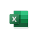

# Stöd för Microsoft 365-klientprogram – certifikatbaserad verifikationMicrosoft 365 Client App Support — Certificate-based Authentication

*Denna artikel gäller för både Microsoft 365 Enterprise och Office 365 Enterprise.**This article applies to both Microsoft 365 Enterprise and Office 365 Enterprise.*

Certifikatbaserad autentisering möjliggör autentisering till Azure Active Directory (Azure AD) med ett klient certifikat på Windows-, Android-eller iOS-enheter.Certificate-based authentication enables you to authenticate to Azure Active Directory (Azure AD) with a client certificate on Windows, Android, or iOS devices. Om du konfigurerar den här funktionen behöver du inte ange användar namn och lösen ord i vissa e-post-och Microsoft Office-program på din mobila enhet.Configuring this feature eliminates the need to enter a username and password combination into certain mail and Microsoft Office applications on your mobile device.

Lär dig mer om [certifikatbaserad identifiering](https://docs.microsoft.com/azure/active-directory/authentication/active-directory-certificate-based-authentication-get-started).Learn more about [certificate-based authentication](https://docs.microsoft.com/azure/active-directory/authentication/active-directory-certificate-based-authentication-get-started).

## Plattformar som stödsSupported platforms

 - Windows 10 skriv bord2Windows 10 Desktop2
 - Windows 10 moderna apparWindows 10 Modern Apps
 - Webbläsare3Web browsers3
 - Android4Android4
 - iOSiOS
 - macOS1 2macOS1 2

Mer information om plattforms stöd i Microsoft 365 finns i [system krav för microsoft 365](https://www.microsoft.com/microsoft-365/microsoft-365-and-office-resources).For more information about platform support in Microsoft 365, see [System requirements for Microsoft 365](https://www.microsoft.com/microsoft-365/microsoft-365-and-office-resources).

## Kompatibla klienterSupported clients

De senaste versionerna av följande klienter har stöd för certifikatbaserad inloggningsautentisering:The latest versions of the following clients support certificate-based authentication:

| | | | | | |
|:---:|:---:|:---:|:---:|:---:|:---:|
|    [ÅtkomstAccess](https://products.office.com/access) |    [Azure AD-   portalen Azure AD   Portal ](https://azure.microsoft.com/features/azure-portal/) |    [Företags   Portal Company   Portal ](https://docs.microsoft.com/intune-user-help/sign-in-to-the-company-portal) |    [DelveDelve](https://products.office.com/business/intelligent-search) |    [Dynamics 365Dynamics 365](https://dynamics.microsoft.com) 
|    [FördelEdge](https://www.microsoft.com/windows/microsoft-edge) |    [ExcelExcel](https://products.office.com/excel) |    [FormulärForms](https://flow.microsoft.com/connectors/shared_microsoftforms/microsoft-forms/) |    [KaizalaKaizala](https://products.office.com/en/business/microsoft-kaizala) |    [Office.comOffice.com](https://www.office.com/) 
|    [Microsoft 365-   administratörMicrosoft 365   Admin](https://products.office.com/business/manage-office-365-admin-app) |    [Office LensOffice Lens](https://www.microsoft.com/p/office-lens/9wzdncrfj3t8?activetab=pivot%3Aoverviewtab) |    [OneDrive1OneDrive1](https://products.office.com/onedrive-for-business/online-cloud-storage) |     [OneNoteOneNote](https://products.office.com/onenote) |    [OutlookOutlook](https://products.office.com/outlook) 
|    [PlannerPlanner](https://products.office.com/business/task-management-software) |    [PowerApps3PowerApps3](https://powerapps.microsoft.com) |    [ Automatisk strömförsörjningPower   Automate](https://flow.microsoft.com) |    [Power BIPower BI](https://powerbi.microsoft.com)|    [PowerPointPowerPoint](https://products.office.com/powerpoint) 
|    [ProjectProject](https://products.office.com/project) |    [PublisherPublisher](https://products.office.com/publisher) |    [SharePointSharepoint](https://products.office.com/sharepoint) |    [Skype för   företagSkype for   Business](https://www.skype.com/business/) |    [FästisarSticky Notes](https://www.microsoft.com/p/microsoft-sticky-notes/9nblggh4qghw) 
|    [StrömmaStream](https://stream.microsoft.com) |    [SwaySway](https://sway.com) |    [Team2Teams2](https://products.office.com/microsoft-teams/group-chat-software) |    [Att göraTo Do](https://todo.microsoft.com) |    [VisioVisio](https://products.office.com/visio/flowchart-software) 
|    [Whiteboard3,4Whiteboard3,4](https://whiteboard.microsoft.com/) |    [WordWord](https://products.office.com/word) |    [Yammer2Yammer2](https://products.office.com/yammer/yammer-overview) |

## PowerShell-moduler som stödsSupported PowerShell modules

| | | | | | |
|:---:|:---:|:---:|:---:|:---:|:---:|
|    [Azure AD   PowerShellAzure AD   PowerShell](https://docs.microsoft.com/powershell/azure/active-directory/overview?view=azureadps-2.0) |    [Exchange Online   PowerShellExchange Online   PowerShell](https://docs.microsoft.com/powershell/exchange/exchange-online-powershell) |    [SharePoint Online   PowerShellSharePoint Online   PowerShell](https://docs.microsoft.com/powershell/sharepoint/sharepoint-online/connect-sharepoint-online)

> [!NOTE]
> 1 stöd för OneDrive på MacOS finns snart.1 Support for OneDrive on macOS available soon.  
> 2 stöd för Yammer på Windows-skrivbordet och MacOS finns snart.2 Support for Yammer on Windows Desktop and macOS available soon. Stöd för Teams på Windows skriv bord finns snart.Support for Teams on Windows Desktop available soon. 
> 3 support för PowerApps och whiteboard i webb program är snart tillgängligt.3 Support for PowerApps and Whiteboard on web apps available soon.  
> 4 support för whiteboard på Android är snart tillgängligt.4 Support for Whiteboard on Android available soon.

## Se ävenSee also

[Översikt över Microsoft 365 EnterpriseMicrosoft 365 Enterprise overview](microsoft-365-overview.md)
