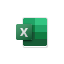

# Microsoft 365-klientprogram – modern-verifikationMicrosoft 365 Client App Support - Modern Authentication

*Denna artikel gäller för både Microsoft 365 Enterprise och Office 365 Enterprise.**This article applies to both Microsoft 365 Enterprise and Office 365 Enterprise.*

Den moderna autentiseringsprocessen aktiverar Active Directory-ADAL-baserade inloggnings bibliotek för Office-klientprogram på olika plattformar.Modern Authentication enables Active Directory Authentication Library (ADAL)-based sign-in for Office client apps across different platforms. Då möjliggörs inloggnings funktioner som multifaktorautentisering (MFA), smartkort och certifikatbaserad identifiering.This enables sign-in features such as multi-factor authentication (MFA), smart card, and certificate-based authentication.

Lär dig mer om [multifaktorautentisering](https://docs.microsoft.com/azure/active-directory/authentication/multi-factor-authentication) och [certifikatbaserad identifiering](https://docs.microsoft.com/azure/active-directory/active-directory-certificate-based-authentication-get-started).Learn more about [multi-factor authentication](https://docs.microsoft.com/azure/active-directory/authentication/multi-factor-authentication) and [certificate-based authentication](https://docs.microsoft.com/azure/active-directory/active-directory-certificate-based-authentication-get-started).

## Plattformar som stödsSupported platforms

 - Windows 10-skrivbordetWindows 10 Desktop
 - Windows 10 moderna apparWindows 10 Modern Apps
 - Webbläsare1Web browsers1
 - Android2Android2
 - iOSiOS
 - macOSmacOS

Mer information om plattforms stöd i Microsoft 365 finns i [system krav för microsoft 365](https://www.microsoft.com/microsoft-365/microsoft-365-and-office-resources).For more information about platform support in Microsoft 365, see [System requirements for Microsoft 365](https://www.microsoft.com/microsoft-365/microsoft-365-and-office-resources).

## Kompatibla klienterSupported clients

De senaste versionerna av följande klienter stöder modern inloggningsautentisering:The latest versions of the following clients support modern authentication:

| | | | | | |
|:---:|:---:|:---:|:---:|:---:|:---:|
|    [ÅtkomstAccess](https://products.office.com/access) |    [Azure   Portal Azure   Portal ](https://azure.microsoft.com/features/azure-portal/) |    [Företags   Portal Company   Portal ](https://docs.microsoft.com/intune-user-help/sign-in-to-the-company-portal) |    [DelveDelve](https://products.office.com/business/intelligent-search) |    [Dynamics 365Dynamics 365](https://dynamics.microsoft.com) 
|    [FördelEdge](https://www.microsoft.com/windows/microsoft-edge) |    [ExcelExcel](https://products.office.com/excel) |    [FormulärForms](https://flow.microsoft.com/connectors/shared_microsoftforms/microsoft-forms/) |    [KaizalaKaizala](https://products.office.com/en/business/microsoft-kaizala) |    [Office.comOffice.com](https://www.office.com/) 
|    [Microsoft 365-   administratörMicrosoft 365   Admin](https://products.office.com/business/manage-office-365-admin-app) |    [Office LensOffice Lens](https://www.microsoft.com/p/office-lens/9wzdncrfj3t8?activetab=pivot%3Aoverviewtab) |    [OneDriveOneDrive](https://products.office.com/onedrive-for-business/online-cloud-storage) |     [OneNoteOneNote](https://products.office.com/onenote) |    [OutlookOutlook](https://products.office.com/outlook) 
|    [PlannerPlanner](https://products.office.com/business/task-management-software) |    [PowerApps PowerApps ](https://powerapps.microsoft.com) |    [ Automatisk strömförsörjningPower   Automate](https://flow.microsoft.com) |    [Power BIPower BI](https://powerbi.microsoft.com)|    [PowerPointPowerPoint](https://products.office.com/powerpoint) 
|    [ProjectProject](https://products.office.com/project) |    [PublisherPublisher](https://products.office.com/publisher) |    [SharePointSharepoint](https://products.office.com/sharepoint) |    [Skype för   företag1Skype for   Business1](https://www.skype.com/business/) |    [StaffHubStaffHub](https://products.office.com/microsoft-staffhub/staff-scheduling-software)
|    [FästisarSticky Notes](https://www.microsoft.com/p/microsoft-sticky-notes/9nblggh4qghw) |    [StrömmaStream](https://stream.microsoft.com) |    [SwaySway](https://sway.com) |    [TeamsTeams](https://products.office.com/microsoft-teams/group-chat-software) |    [Att göraTo Do](https://todo.microsoft.com) 
|    [VisioVisio](https://products.office.com/visio/flowchart-software) |    [Whiteboard1,2Whiteboard1,2](https://whiteboard.microsoft.com/) |    [WordWord](https://products.office.com/word) |    [YammerYammer](https://products.office.com/yammer/yammer-overview) |    [Yammer-   anmälarenYammer   Notifier](https://products.office.com/yammer/yammer-overview) |  |

## PowerShell-moduler som stödsSupported PowerShell modules

| | | | | | |
|:---:|:---:|:---:|:---:|:---:|:---:|
|    [Azure AD   PowerShellAzure AD   PowerShell](https://docs.microsoft.com/powershell/azure/active-directory/overview?view=azureadps-2.0) |    [Exchange Online   PowerShellExchange Online   PowerShell](https://docs.microsoft.com/powershell/exchange/exchange-online-powershell) |    [SharePoint Online   PowerShellSharePoint Online   PowerShell](https://docs.microsoft.com/powershell/sharepoint/sharepoint-online/connect-sharepoint-online)

> [!NOTE]
> 1 stöd för whiteboard och Skype för företag i webbappen är snart tillgängligt.1 Support for Whiteboard and Skype for Business on web app available soon.  
> 2 stöd för whiteboard på Android är snart tillgängligt.2 Support for Whiteboard on Android available soon.

## Se ävenSee also

[Översikt över Microsoft 365 EnterpriseMicrosoft 365 Enterprise overview](microsoft-365-overview.md)
