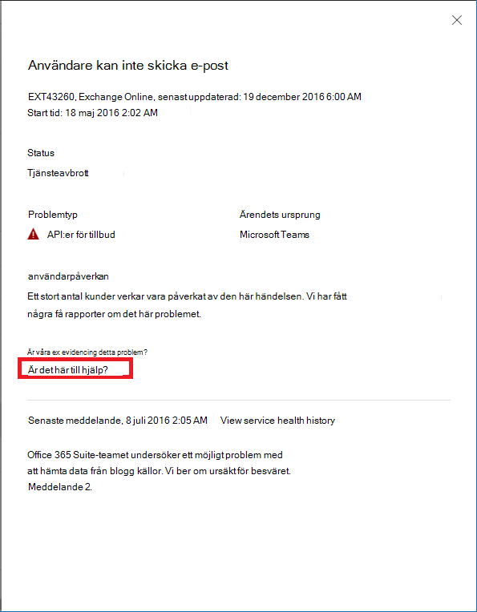

# Exchange Online-övervakning för Microsoft 365Exchange Online monitoring for Microsoft 365

Du kan använda Exchange Online-övervakning i Administrationscentret för Microsoft 365 till att övervaka hälsan för Exchange-tjänsten för din organisations Microsoft 365-prenumeration.You can use Exchange Online monitoring in the Microsoft 365 admin center to monitor the health of the Exchange service for your organization’s Microsoft 365 subscription. I Exchange Online-övervakningen finns information om incidenter och rekommendationer som samlas in i följande kategorier:Exchange Online monitoring provides you with information about incidents and advisories that are collected in these categories:

- **Infrastruktur**: Ett problem identifieras i Microsoft 365-infrastrukturen som Microsoft äger för att ge regelbundna uppdateringar och lösa problemet.**Infrastructure**: Issue is detected in the Microsoft 365 infrastructure that Microsoft owns for providing regular updates and resolving the issue. Till exempel kan användarna inte få åtkomst till Exchange Online på grund av problem med Exchange eller annan molninfrastruktur för Microsoft 365.For example, users cannot access Exchange Online because of issues with Exchange or other Microsoft 365 cloud infrastructure.
- **Tredje parts infrastruktur**: Ett problem identifieras i tredje parts infrastruktur som din organisation är beroende av och det krävs åtgärder från din organisation för att lösa problemet.**Third-party infrastructure**: Issue is detected in third-party infrastructure on which your organization has taken a dependency and requires action from your organization for resolution. Till exempel kan användarautentiserings transaktioner begränsas av en tredjepartsleverantör av säkerhetstokentjänster (STS), vilket hindrar användare från att ansluta till Exchange Online.For example, user authentication transactions are getting throttled by a third-party security token service (STS) provider that prevents users from connecting to Exchange Online.
- **Kundinfrastruktur**: Ett problem identifieras i din organisations infrastruktur och det krävs åtgärder från din organisation för att lösa problemet.**Customer infrastructure**: Issue is detected in your organization's infrastructure and requires action from your organization for resolution. Till exempel kan användare inte få åtkomst till Exchange Online eftersom de inte kan få en autentiseringstoken från STS-leverantören som finns i din organisation, på grund av ett utgånget certifikat.For example, users cannot access Exchange Online because they are unable to obtain an authentication token from STS provider hosted by your organization because of an expired certificate.

Här är ett exempel på sidan **Tjänststatus** i Administrationscentret för Microsoft 365, tillgänglig från **Hälsa > Tjänststatus**.Here is an example of the **Service health** page in the Microsoft 365 admin center, available from **Health > Service health**.

Värdet i kolumnen **Status** anger om tjänsten är felfri eller om det finns rekommendationer eller incidenter baserat på de molntjänster som Microsoft underhåller.The value of the **Status** column indicates whether the service is healthy or has advisories or incidents based on the cloud services that Microsoft maintains. 

Värdet i kolumnen **Organisations- och tredjepartsproblem** anger att organisationens infrastruktur eller programvara från tredje part påverkar tjänststatusens användning i Exchange Online.The value of the **Your org and 3rd party issues** column indicates that your organization's infrastructure or third-party software affects your users service health experience with Exchange Online. Vid rekommendationer och incidenter krävs åtgärder *från dig* för att lösa problemet.Advisories or incidents require *your* actions to resolve.

Här är ett exempel på sidan för **Exchange Online**-övervakning i Administrationscentret för Microsoft 365, tillgängligt från **Hälsa > Tjänststatus > Exchange Online**.Here is an example of the **Exchange Online** monitoring page in the Microsoft 365 admin center, available from **Health > Service health > Exchange Online**.

Med sidan för **Exchange Online**-övervakning kan du se om Exchange Online-tjänsten är felfri eller inte, och om det finns några associerade incidenter eller rekommendationer.With the **Exchange Online** monitoring page, you can see whether the Exchange Online service is healthy or not and whether there are any associated incidents or advisories. Med Exchange Online-övervakning kan du titta på tjänststatusen för specifika e-postscenarier och se signaler nästan i realtid för att avgöra effekten efter scenario.With Exchange Online monitoring, you can look at the service health for specific email scenarios and view near real-time signals to determine the impact by scenario. 

## KravRequirements

Den här förhandsversionen är aktiverad för kunder som uppfyller följande krav:This preview is enabled for customers who meet these requirements: 

- Din organisation måste ha ett licensantal på minst 10 000, med en eller en kombination av dessa produkter: Office 365 E3, Microsoft 365 E3, Office 365 E5, Microsoft 365 E5.Your organization needs to have a license count of at least 10,000, from one or a combination of these products: Office 365 E3, Microsoft 365 E3, Office 365 E5, Microsoft 365 E5. 

  Din organisation kan t. ex. ha 3 000 Office 365 E3-licenser och 8 500 Microsoft 365 E5, för totalt 11 500 licenser för de kvalificerande produkterna.For example, your organization can have 3,000 Office 365 E3 licenses and 8,500 Microsoft 365 E5, for a total of 11,500 licenses from the qualifying products.

- Din organisation måste ha minst 50 månatliga aktiva Exchange Online-användare.Your organization needs to have at least 50 monthly active Exchange Online users.

Med Exchange Online-övervakning kan du visa hälsan för följande e-postklienter baserat på läsaktiviteten för e-post:With Exchange Online monitoring you can view the health for the following email clients based on email read activity:

- Outlook (skrivbordsversion)Outlook Desktop
- Outlook på webbenOutlook on the Web
- Inbyggda e-postklienter för iOS och AndroidNative mail clients of iOS and Android 
- Outlook Mobile-app på iOS och AndroidOutlook Mobile app in iOS and Android 
- Outlook Mac-klientOutlook Mac client

För dessa klienter kan du se antalet aktiva användare under de senaste 30 minuterna baserat på användare som läser ett e-postmeddelande, samt antalet incidenter och rekommendationer på instrumentpanelen.For these clients, you can see the number of active users in the last 30 minutes based on users reading an email, along with number of incidents and advisories in the dashboard. Dessa data jämförs med samma intervall för föregående vecka för att se om det finns ett problem.This data is compared to the same interval for the previous week to see if there’s an issue. 

>[!Note]
> Antalet aktiva användare mäts med en enskild aktivitet, till exempel när en användare läser ett e-postmeddelande.Active user count is measured by a single activity, for example, when a user reads an email. Den redovisar bara de senaste 30 minuternas aktivitet.It only accounts for the last 30 minutes of activity.
>

Du kan också övervaka Exchange Online-hälsan för följande scenarier:You can also monitor Exchange Online health for the following scenarios:

- **E-postflöde**: Antalet meddelanden som skickas till en postlåda utan fördröjning när meddelandet kommit till Microsoft 365-nätverket.**Mail flow**: The number of messages successfully delivered to a mailbox without any delay after the message reached the Microsoft 365 network. 
- **Grundläggande autentisering och modern autentisering**: Antalet användare som har verifierats i Exchange Online-tjänsten.**Basic Authentication and Modern Authentication**: The number of users successfully validated in the Exchange Online service.

För alla de här scenarierna gäller nyckeltalen för de senaste 30 minuterna på huvudinstrumentpanelen.For all these scenarios, the key numbers are for the last 30 minutes in the main dashboard. Detaljerade vyer för vart och ett av dessa scenarier visar trenden nästan i realtid för sju dagar med 30 minuters aggregerade jämfört med föregående vecka.Detailed views for each of these scenarios shows the near real-time trend for seven days with the 30-minute aggregate compared with the previous week. 

## Skicka feedbackSend us feedback

Du kan lämna feedback på två sätt:There are two ways you can provide feedback:

- Använd alternativet **Ge feedback** som finns på varje sida i administrationscentret för Microsoft 365.Use the **Give feedback** option available on every page of the Microsoft 365 admin center.
- Skicka feedback med länken **Är det här inlägget användbart?** för en särskild incident eller rekommendation.Submit feedback using the **Is this post helpful?** link for a specific incident or advisory.

## Vanliga frågor och svarFrequently asked questions

#### 1. Varför ser jag inte ”Exchange Online-övervakning” under Hälsa i Administrationscentret för Microsoft 365?1. Why don’t I see “Exchange Online monitoring” under Health in the Microsoft 365 admin center? 

Kontrollera först att du har aktiverat det nya Administrationscentret på **Startsidan** i Administrationscentret för Microsoft 365.First, make sure you’ve enabled the new admin center on the **Home** page of the Microsoft 365 admin center. 

Kontrollera sedan att du uppfyller båda följande krav:Then make sure you meet both of the following requirements: 

- Din organisation måste ha ett licensantal på minst 10 000, med en eller en kombination av dessa produkter: Office 365 E3, Microsoft 365 E3, Office 365 E5, Microsoft 365 E5.Your organization needs to have a license count of at least 10,000, from one or a combination of these products: Office 365 E3, Microsoft 365 E3, Office 365 E5, Microsoft 365 E5. 
- Din organisation måste ha minst 50 månatliga aktiva Exchange Online-användare.Your organization needs to have at least 50 monthly active Exchange Online users.

Om licensantalet för din organisation understiger 10 000 användare och antalet månatliga aktiva användare hamnar under 50 användare aktiveras inte Exchange Online-övervakning förrän dessa kraven uppfyllts.If the license count for your organization goes below 10,000 users and the monthly active users goes below 50 users, Exchange Online monitoring won’t be enabled until these requirements are met.

#### 2. Antalet aktiva användare på instrumentpanelen för varje klient verkar vara lågt.2. The active user count in the dashboard for each client appears to be low. Vi har många aktiva licenser tilldelade till användare.We have a lot of active licenses assigned to users. Vad betyder det här?What does this mean? 

Antalet aktiva användare som visas i övervakningen baseras på en 30-minutersperiod där användare har utfört aktiviteten som anges i funktionen.The active user count shown in monitoring is based on a 30-minute window where users have performed the activity called out in the feature. Det här ska inte förväxlas med användningstal.This shouldn’t be confused with usage numbers. Använd aktivitetsrapporter i Administrationscentret för Microsoft 365 (**Rapporter > Användning**) för att visa användningstal.To view usage numbers, use activity reports in the Microsoft 365 admin center (**Reports > Usage**).

#### 3. Kommer det att finnas andra övervakningsscenarier för andra tjänster, till exempel Teams och SharePoint?3. Will there be other monitoring scenarios for other services such as Teams and SharePoint? 

Microsoft har integrerat den här funktionen direkt i instrumentpanelen för tjänststatus i Administrationscentret för Microsoft 365.Microsoft is integrating this experience directly inside the Service Health dashboard in the Microsoft 365 admin center. Detta ger Microsoft möjlighet att utöka övervakningsscenarier för andra tjänster, som kommer att meddelas när det finns nyheter att dela.This will provide opportunities for Microsoft to extend monitoring scenarios for other services, which will be announced when there is news to share. 

#### 4. Vad är planen för att få allmän tillgänglighet för den här funktionen?4. What is the plan for general availability of this experience? 

Microsoft har integrerat Exchange Online-övervakning direkt på **Tjänststatus**-instrumentpanelen i administrationscentret för Microsoft 365.Microsoft has integrated Exchange Online monitoring directly on the **Service Health** dashboard in the Microsoft 365 admin center. 

Med den här nya integrerade funktionen är Microsofts plan att samla in din feedback och sedan definiera vår plan för allmän tillgänglighet.With this new integrated experience, Microsoft's plan is to collect your feedback and then define our plan for general availability.

#### 5. Är det här en kostnadsfri (inkluderad) eller betald (extra) funktion?5. Is this a free (included) or paid (extra) feature? 

Den här funktionen är en allmänt tillgänglig förhandsversion och är bara tillgänglig för kunder som uppfyller kraven i fråga 1.This feature is in Public preview and only available for customers that meet the requirements in question 1.

<!--
>[!Note]
>INTERNAL: That decision is pending
>
--> 

#### 6. Hur ger jag feedback?6. How do I provide feedback? 

Om du vill lämna allmän feedback kan du använda ikonen **Ge feedback** längst ned till höger på sidan för **Exchange Online**-övervakning.For general feedback, use the **Give feedback** icon on the bottom-right corner of the **Exchange Online** monitoring page. 

För att lämna feedback om incidenter eller rekommendationer använder du länken **Är det här inlägget användbart?**.For feedback on incidents or advisories, use the **Is this post helpful?** link.

#### 7. Var är data instrumenterad för de scenarier som visar aktivitetstrender?7. Where is the data instrumented for the scenarios that show activity trends?

Data är instrumenterade i Exchange Online-tjänsten.The data is instrumented in the Exchange Online service. Om det finns ett fel som uppstår innan begäran når Exchange Online eller om det finns ett fel i Exchange Online ser du en nedgång i aktivitetssignalen.If there is a failure that happens before the request reaches Exchange Online or there is a failure in Exchange Online, you will see a drop in the activity signal.

