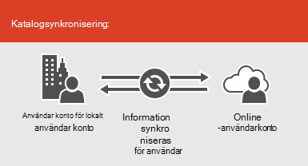
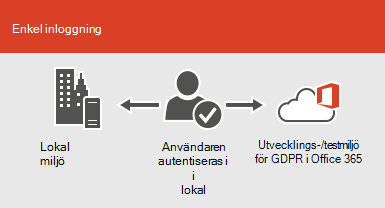

# Microsoft 365-integrering med lokala miljöer

*Den här artikeln gäller både Microsoft 365 Enterprise och Office 365 Enterprise.*

Du kan integrera Microsoft 365 med dina befintliga katalog tjänster och med en lokal installation av Exchange Server, Skype för företag – Server 2015 eller SharePoint Server.
  
 - När du integrerar med katalog tjänster kan du synkronisera och hantera användar konton för båda miljöerna. Du kan också lägga till hash-synkronisering eller enkel inloggning (SSO) så att användarna kan logga in på båda miljöerna med sina lokala autentiseringsuppgifter.
 - När du integrerar med lokala server produkter skapar du en hybrid miljö. En hybrid miljö kan hjälpa dig när du migrerar användare eller information till Microsoft 365, eller så kan du fortsätta att ha vissa användare eller viss information lokalt och i molnet. Mer information om hybrid miljöer finns i [hybrid moln översikt](https://docs.microsoft.com/Office365/Enterprise/hybrid-cloud-overview).

Du kan också använda Azure Active Directory-rådgivarena för anpassade installations anvisningar (du måste vara inloggad i Microsoft 365):

- [Synkronisera användare från organisationens katalog](https://aka.ms/aadconnectpwsync)
- [Distributions rådgivare för AD FS](https://aka.ms/adfsguidance)
- [Konfigurations guide för Azure AD](https://aka.ms/aadpguidance)
   
## Innan du börjar

Innan du integrerar Microsoft 365 och en lokal miljö måste du även delta i [nätverks planering och prestanda justering](network-planning-and-performance.md). Du ska också förstå de tillgängliga [identitets modellerna](about-microsoft-365-identity.md). 

Information [om hur du hanterar microsoft 365-konton](manage-microsoft-365-accounts.md) för en lista över verktyg som du kan använda för att hantera Microsoft 365-användare och-konton. 
  
## Integrera Microsoft 365 med katalog tjänster
Om du har befintliga användar konton i en lokal katalog vill du inte återskapa alla konton i Microsoft 365 och riskera att upptäcka skillnader eller fel mellan miljöerna. Med katalog-synkronisering kan du spegla dessa konton mellan online och lokala miljöer. Med katalog synkronisering behöver dina användare inte komma ihåg ny information för varje miljö, och du behöver inte skapa eller uppdatera konton två gånger. Du måste [förbereda den lokala katalogen](prepare-for-directory-synchronization.md) för Active Directory-synkronisering.
  

  
Om du vill att användarna ska kunna logga in på Microsoft 365 med sina lokala autentiseringsuppgifter kan du också konfigurera SSO. Med SSO är Microsoft 365 konfigurerat för att lita på den lokala miljön för användarautentisering.
  

  
Olika användar konto hanterings tekniker ger olika upplevelser för användarna, vilket visas i följande tabell.
 
### Katalog-synkronisering med eller utan lösen ord-hash-synkronisering eller vidarekoppling

En användare loggar in på den lokala miljön med sitt användar konto (domän \ användar namn). När de går till Microsoft 365 måste de logga in igen med sitt arbets-eller skol konto (user@domain.com). Användar namnet är detsamma i båda miljöerna. När du lägger till hash-synkronisering eller vidarekoppling av lösen ord har användaren samma lösen ord för båda miljöerna, men kommer att behöva uppge dessa autentiseringsuppgifter igen när de loggar in i Microsoft 365. Katalog-synkronisering med hash för lösen ord är det vanligaste scenariot för katalog synkronisering.

Om du vill konfigurera profilsynkronisering använder du Azure Active Directory Connect. Anvisningar finns i [Konfigurera katalog synkronisering för Microsoft 365](set-up-directory-synchronization.md)och [Azure AD Connect med snabb inställningar](https://go.microsoft.com/fwlink/p/?LinkId=698537).

Läs mer om [att förbereda en katalog-synkronisering till Microsoft 365](prepare-for-directory-synchronization.md) och [att integrera lokala identifierings instruktioner med Azure Active Directory](https://go.microsoft.com/fwlink/?LinkId=518101).

### Katalog-synkronisering med SSO

En användare loggar in på sin lokala miljö med sitt användar konto. När de går till Microsoft 365 är de antingen loggade in automatiskt, eller så loggar de in med samma inloggnings uppgifter som de använder för sin lokala miljö (domän \ användar namn).

För att ställa in SSO kan du även använda Azure AD Connect. Anvisningar finns [i anpassad installation av Azure AD Connect](https://go.microsoft.com/fwlink/p/?LinkID=698430).

Läs mer om [enkel inloggning till program i Azure Active Directory](https://go.microsoft.com/fwlink/p/?LinkId=698604).

## Azure AD Connect

Azure AD Connect ersätter äldre versioner av verktyg för identitets integrering, till exempel DirSync och Azure AD-synkronisering. Mer information finns i [Vad är hybrid identitet med Azure Active Directory?](https://go.microsoft.com/fwlink/p/?LinkId=527969). Om du vill uppdatera från Azure Active Directory-synkronisering till Azure AD Connect kan du läsa [uppgraderings anvisningarna](https://go.microsoft.com/fwlink/p/?LinkId=733240). 

Se även [distribuera Microsoft 365-profilsynkronisering i Microsoft Azure](https://go.microsoft.com/fwlink/?LinkId=517887).

## Se även

[Översikt över Microsoft 365 Enterprise](microsoft-365-overview.md)
